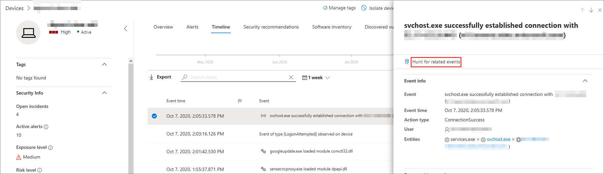

# <a name="quickly-hunt-for-entity-or-event-information-with-go-hunt"></a>Snabbt jaga efter entitets- eller händelseinformation med go-hunt

[!INCLUDE [Microsoft 365 Defender rebranding](../../includes/microsoft-defender.md)]

**Gäller för:**
- [Defender för Endpoint](https://go.microsoft.com/fwlink/?linkid=2154037)

>Vill du använda Defender för Slutpunkt? [Registrera dig för en kostnadsfri utvärderingsversion.](https://www.microsoft.com/microsoft-365/windows/microsoft-defender-atp?ocid=docs-wdatp-advancedhuntingref-abovefoldlink)


Med *sökåtgärden* sök kan du snabbt undersöka händelser och olika entitetstyper med hjälp av kraftfulla [frågebaserade, avancerade](advanced-hunting-overview.md) sökfunktioner. Den här åtgärden kör automatiskt en avancerad fråga för att hitta relevant information om den valda händelsen eller enheten.

Åtgärden *gåsök* är tillgänglig i olika delar av säkerhetscentret när händelse- eller entitetsinformation visas. Du kan till exempel använda *gå jag* från följande avsnitt:

- På [incidentsidan kan](investigate-incidents.md)du granska information om användare, enheter och många andra enheter som är kopplade till ett problem. När du väljer en entitet får du ytterligare information samt olika åtgärder du kan utföra på den enheten. I exemplet nedan är en enhet markerad, som visar information om enheten samt alternativet för att leta efter mer information om enheten.

    

- På incidentsidan kan du också komma åt en lista över enheter under bevisfliken. Om du väljer en av dessa enheter kan du snabbt jaga efter information om den enheten.

    

- När du visar tidslinjen för en enhet kan du välja en händelse på tidslinjen om du vill visa ytterligare information om händelsen. När en händelse har valts får du möjlighet att leta efter andra relevanta händelser vid avancerad sökning.

    

Om **du väljer Sök** efter sök eller Sök **efter** relaterade händelser passeras olika frågor, beroende på om du har valt en enhet eller en händelse.

## <a name="query-for-entity-information"></a>Fråga för entitetsinformation

När du *använder go hunt* to query för information om en användare, enhet eller någon annan typ av entitet, kontrollerar frågan alla relevanta schematabeller för alla händelser som innefattar den enheten. För att resultatet ska kunna hanteras är frågan begränsad till ungefär samma tidsperiod som den tidigaste aktiviteten under de senaste 30 dagarna som innefattar enheten och som är kopplad till händelsen.

Här är ett exempel på sökfrågan för en enhet:

```kusto
let selectedTimestamp = datetime(2020-06-02T02:06:47.1167157Z);
let deviceName = "fv-az770.example.com";
let deviceId = "device-guid";
search in (DeviceLogonEvents, DeviceProcessEvents, DeviceNetworkEvents, DeviceFileEvents, DeviceRegistryEvents, DeviceImageLoadEvents, DeviceEvents, DeviceImageLoadEvents, IdentityLogonEvents, IdentityQueryEvents)
Timestamp between ((selectedTimestamp - 1h) .. (selectedTimestamp + 1h))
and DeviceName == deviceName
// or RemoteDeviceName == deviceName
// or DeviceId == deviceId
| take 100
```

### <a name="supported-entity-types"></a>Entitetstyper som stöds

Du kan använda *gåsök när* du har valt någon av följande entitetstyper:

- Filer
- Användare
- Enheter
- IP-adresser
- URL:er

## <a name="query-for-event-information"></a>Fråga för händelseinformation

När du *använder sökfråga* efter information om en tidslinjehändelse söker frågan i alla relevanta schematabeller efter andra händelser vid tidpunkten för den valda händelsen. Följande fråga visar till exempel händelser i olika schematabeller som inträffade ungefär samma tidsperiod på samma enhet:

```kusto
// List relevant events 30 minutes before and after selected RegistryValueSet event
let selectedEventTimestamp = datetime(2020-10-06T21:40:25.3466868Z);
search in (DeviceFileEvents, DeviceProcessEvents, DeviceEvents, DeviceRegistryEvents, DeviceNetworkEvents, DeviceImageLoadEvents, DeviceLogonEvents)
    Timestamp between ((selectedEventTimestamp - 30m) .. (selectedEventTimestamp + 30m))
    and DeviceId == "a305b52049c4658ec63ae8b55becfe5954c654a4"
| sort by Timestamp desc
| extend Relevance = iff(Timestamp == selectedEventTimestamp, "Selected event", iff(Timestamp < selectedEventTimestamp, "Earlier event", "Later event"))
| project-reorder Relevance
```

## <a name="adjust-the-query"></a>Justera frågan

Om du har viss kunskap [om frågespråket](advanced-hunting-query-language.md)kan du justera frågan efter dina önskemål. Du kan till exempel justera den här raden, som bestämmer storleken på tidsfönstret:

```kusto
Timestamp between ((selectedTimestamp - 1h) .. (selectedTimestamp + 1h))
```

Förutom att ändra frågan för att få mer relevanta resultat kan du också:

- [Visa resultatet som diagram](advanced-hunting-query-results.md#view-query-results-as-a-table-or-chart)
- [Skapa en anpassad identifieringsregel](custom-detection-rules.md)

## <a name="related-topics"></a>Relaterade ämnen

- [Översikt över avancerad jakt](advanced-hunting-overview.md)
- [Lär dig frågespråket](advanced-hunting-query-language.md)
- [Arbeta med frågeresultat](advanced-hunting-query-results.md)
- [Anpassade regler för identifiering](custom-detection-rules.md)
