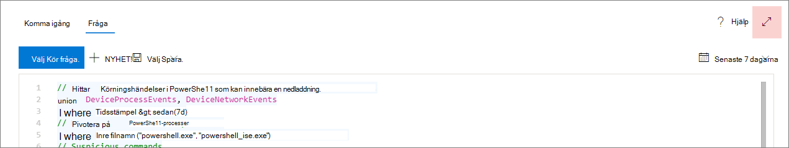

# <a name="learn-the-advanced-hunting-query-language"></a><span data-ttu-id="54f3d-104">Lär dig språket för avancerad fråga om sökning</span><span class="sxs-lookup"><span data-stu-id="54f3d-104">Learn the advanced hunting query language</span></span>

[!INCLUDE [Microsoft 365 Defender rebranding](../../includes/microsoft-defender.md)]

<span data-ttu-id="54f3d-105">**Gäller för:**</span><span class="sxs-lookup"><span data-stu-id="54f3d-105">**Applies to:**</span></span>
- [<span data-ttu-id="54f3d-106">Defender för Endpoint</span><span class="sxs-lookup"><span data-stu-id="54f3d-106">Defender for Endpoint</span></span>](https://go.microsoft.com/fwlink/?linkid=2154037)

> <span data-ttu-id="54f3d-107">Vill du använda Defender för Slutpunkt?</span><span class="sxs-lookup"><span data-stu-id="54f3d-107">Want to experience Defender for Endpoint?</span></span> [<span data-ttu-id="54f3d-108">Registrera dig för en kostnadsfri utvärderingsversion.</span><span class="sxs-lookup"><span data-stu-id="54f3d-108">Sign up for a free trial.</span></span>](https://www.microsoft.com/microsoft-365/windows/microsoft-defender-atp?ocid=docs-wdatp-advancedhunting-abovefoldlink)

<span data-ttu-id="54f3d-109">Avancerad sökning är baserad på [språket i Kusto-frågan.](https://docs.microsoft.com/azure/kusto/query/)</span><span class="sxs-lookup"><span data-stu-id="54f3d-109">Advanced hunting is based on the [Kusto query language](https://docs.microsoft.com/azure/kusto/query/).</span></span> <span data-ttu-id="54f3d-110">Du kan använda kustooperatorer och -uttryck till att skapa frågor som söker efter information i ett särskilt [schema.](advanced-hunting-schema-reference.md)</span><span class="sxs-lookup"><span data-stu-id="54f3d-110">You can use Kusto operators and statements to construct queries that locate information in a specialized [schema](advanced-hunting-schema-reference.md).</span></span> <span data-ttu-id="54f3d-111">För att förstå begreppen bättre bör du köra din första fråga.</span><span class="sxs-lookup"><span data-stu-id="54f3d-111">To understand these concepts better, run your first query.</span></span>

## <a name="try-your-first-query"></a><span data-ttu-id="54f3d-112">Prova den första frågan</span><span class="sxs-lookup"><span data-stu-id="54f3d-112">Try your first query</span></span>

<span data-ttu-id="54f3d-113">I Microsoft Defender Säkerhetscenter går du till **Avancerad sökning för** att köra din första fråga.</span><span class="sxs-lookup"><span data-stu-id="54f3d-113">In Microsoft Defender Security Center, go to **Advanced hunting** to run your first query.</span></span> <span data-ttu-id="54f3d-114">Använd följande exempel:</span><span class="sxs-lookup"><span data-stu-id="54f3d-114">Use the following example:</span></span>

```kusto
// Finds PowerShell execution events that could involve a download
union DeviceProcessEvents, DeviceNetworkEvents
| where Timestamp > ago(7d)
// Pivoting on PowerShell processes
| where FileName in~ ("powershell.exe", "powershell_ise.exe")
// Suspicious commands
| where ProcessCommandLine has_any("WebClient",
    "DownloadFile",
    "DownloadData",
    "DownloadString",
    "WebRequest",
    "Shellcode",
    "http",
    "https")
| project Timestamp, DeviceName, InitiatingProcessFileName, InitiatingProcessCommandLine, 
FileName, ProcessCommandLine, RemoteIP, RemoteUrl, RemotePort, RemoteIPType
| top 100 by Timestamp
```
<span data-ttu-id="54f3d-115">**[Kör den här frågan för avancerad sökning](https://securitycenter.windows.com/hunting?query=H4sIAAAAAAAEAI2TT0vDQBDF5yz4HUJPFcTqyZsXqyCIBFvxKNGWtpo_NVlbC8XP7m8mado0K5Zls8nkzdu3b2Z70pNAbmUmqYyk4D2UTJYyllwGMmWNGQHrN_NNvsSBzUBrbMFMiWieAx3xDEBl4GL4AuNd8B0bNgARENcdUmIZ3yM5liPwac3bN-YZPGPU5ET1rWDc7Ox4uod8YDp4MzI-GkjlX4Ne2nly0zEkKzFWh4ZE5sSuTN8Ehq5couvEMnvmUAhez-HsRBMipVa_W_OG6vEfGtT12JRHpqV064e1Kx04NsxFzXxW1aFjp_djXmDRPbfY3XMMcLogTz2bWZ2KqmIJI6q6wKe2WYnrRsa9KVeU9kCBBo2v7BzPxF_Bx2DKiqh63SGoRoc6Njti48z_yL71XHQAcgAur6rXRpcqH3l-4knZF23Utsbq2MircEqmw-G__xR1TdZ1r7zb7XLezmx3etkvGr-ze6NdGdW92azUfpcdluWvr-aqbh_nofnqcWI3aYyOsBV7giduRUO7187LMKTT5rxvHHX80_t8IeeMgLquvL7-Ak3q-kz8BAAA&runQuery=true&timeRangeId=week)**</span><span class="sxs-lookup"><span data-stu-id="54f3d-115">**[Run this query in advanced hunting](https://securitycenter.windows.com/hunting?query=H4sIAAAAAAAEAI2TT0vDQBDF5yz4HUJPFcTqyZsXqyCIBFvxKNGWtpo_NVlbC8XP7m8mado0K5Zls8nkzdu3b2Z70pNAbmUmqYyk4D2UTJYyllwGMmWNGQHrN_NNvsSBzUBrbMFMiWieAx3xDEBl4GL4AuNd8B0bNgARENcdUmIZ3yM5liPwac3bN-YZPGPU5ET1rWDc7Ox4uod8YDp4MzI-GkjlX4Ne2nly0zEkKzFWh4ZE5sSuTN8Ehq5couvEMnvmUAhez-HsRBMipVa_W_OG6vEfGtT12JRHpqV064e1Kx04NsxFzXxW1aFjp_djXmDRPbfY3XMMcLogTz2bWZ2KqmIJI6q6wKe2WYnrRsa9KVeU9kCBBo2v7BzPxF_Bx2DKiqh63SGoRoc6Njti48z_yL71XHQAcgAur6rXRpcqH3l-4knZF23Utsbq2MircEqmw-G__xR1TdZ1r7zb7XLezmx3etkvGr-ze6NdGdW92azUfpcdluWvr-aqbh_nofnqcWI3aYyOsBV7giduRUO7187LMKTT5rxvHHX80_t8IeeMgLquvL7-Ak3q-kz8BAAA&runQuery=true&timeRangeId=week)**</span></span>

### <a name="describe-the-query-and-specify-the-tables-to-search"></a><span data-ttu-id="54f3d-116">Beskriv frågan och ange vilka tabeller som ska sökas</span><span class="sxs-lookup"><span data-stu-id="54f3d-116">Describe the query and specify the tables to search</span></span>
<span data-ttu-id="54f3d-117">En kort kommentar har lagts till i början av frågan för att beskriva vad den används till.</span><span class="sxs-lookup"><span data-stu-id="54f3d-117">A short comment has been added to the beginning of the query to describe what it is for.</span></span> <span data-ttu-id="54f3d-118">Den här kommentaren hjälper dig om du senare bestämmer dig för att spara frågan och dela den med andra i organisationen.</span><span class="sxs-lookup"><span data-stu-id="54f3d-118">This comment helps if you later decide to save the query and share it with others in your organization.</span></span>

```kusto
// Finds PowerShell execution events that could involve a download
```
<span data-ttu-id="54f3d-119">Själva frågan börjar vanligtvis med ett tabellnamn följt av flera element som börjar med en pipe `|` ().</span><span class="sxs-lookup"><span data-stu-id="54f3d-119">The query itself will typically start with a table name followed by several elements that start with a pipe (`|`).</span></span> <span data-ttu-id="54f3d-120">I det här exemplet börjar vi med att skapa en union av två tabeller och , och  `DeviceProcessEvents` `DeviceNetworkEvents` lägger till rörelement efter behov.</span><span class="sxs-lookup"><span data-stu-id="54f3d-120">In this example, we start by creating a union of two tables,  `DeviceProcessEvents` and `DeviceNetworkEvents`, and add piped elements as needed.</span></span>

```kusto
union DeviceProcessEvents, DeviceNetworkEvents
```
### <a name="set-the-time-range"></a><span data-ttu-id="54f3d-121">Ange tidsperiod</span><span class="sxs-lookup"><span data-stu-id="54f3d-121">Set the time range</span></span>
<span data-ttu-id="54f3d-122">Det första pipade elementet är ett tidsfilter som är inderat i de föregående sju dagarna.</span><span class="sxs-lookup"><span data-stu-id="54f3d-122">The first piped element is a time filter scoped to the previous seven days.</span></span> <span data-ttu-id="54f3d-123">Genom att begränsa tidsperioden ser du till att frågorna fungerar bra, returnerar hanterbara resultat och inte time out.</span><span class="sxs-lookup"><span data-stu-id="54f3d-123">Limiting the time range helps ensure that queries perform well, return manageable results, and don't time out.</span></span>

```kusto
| where Timestamp > ago(7d)
```

### <a name="check-specific-processes"></a><span data-ttu-id="54f3d-124">Kontrollera specifika processer</span><span class="sxs-lookup"><span data-stu-id="54f3d-124">Check specific processes</span></span>
<span data-ttu-id="54f3d-125">Tidsperioden följs omedelbart av en sökning efter processfilnamn som representerar PowerShell-programmet.</span><span class="sxs-lookup"><span data-stu-id="54f3d-125">The time range is immediately followed by a search for process file names representing the PowerShell application.</span></span>

```kusto
// Pivoting on PowerShell processes
| where FileName in~ ("powershell.exe", "powershell_ise.exe")
```

### <a name="search-for-specific-command-strings"></a><span data-ttu-id="54f3d-126">Söka efter specifika kommandosträngar</span><span class="sxs-lookup"><span data-stu-id="54f3d-126">Search for specific command strings</span></span>
<span data-ttu-id="54f3d-127">Därefter söker frågan efter strängar i kommandorader som vanligtvis används för att ladda ned filer med PowerShell.</span><span class="sxs-lookup"><span data-stu-id="54f3d-127">Afterwards, the query looks for strings in command lines that are typically used to download files using PowerShell.</span></span>

```kusto
// Suspicious commands
| where ProcessCommandLine has_any("WebClient",
    "DownloadFile",
    "DownloadData",
    "DownloadString",
    "WebRequest",
    "Shellcode",
    "http",
    "https")
```

### <a name="customize-result-columns-and-length"></a><span data-ttu-id="54f3d-128">Anpassa resultatkolumner och längd</span><span class="sxs-lookup"><span data-stu-id="54f3d-128">Customize result columns and length</span></span> 
<span data-ttu-id="54f3d-129">Nu när frågan tydligt identifierar de data du vill hitta kan du definiera hur resultatet ska se ut.</span><span class="sxs-lookup"><span data-stu-id="54f3d-129">Now that your query clearly identifies the data you want to locate, you can define what the results look like.</span></span> <span data-ttu-id="54f3d-130">`project` returnerar specifika kolumner `top` och begränsar antalet resultat.</span><span class="sxs-lookup"><span data-stu-id="54f3d-130">`project` returns specific columns, and `top` limits the number of results.</span></span> <span data-ttu-id="54f3d-131">De här operatorerna hjälper till att säkerställa att resultatet är väl formaterat och ganska stort och lätt att bearbeta.</span><span class="sxs-lookup"><span data-stu-id="54f3d-131">These operators help ensure the results are well-formatted and reasonably large and easy to process.</span></span>

```kusto
| project Timestamp, DeviceName, InitiatingProcessFileName, InitiatingProcessCommandLine, 
FileName, ProcessCommandLine, RemoteIP, RemoteUrl, RemotePort, RemoteIPType
| top 100 by Timestamp
```

<span data-ttu-id="54f3d-132">Välj **Kör fråga** för att se resultatet.</span><span class="sxs-lookup"><span data-stu-id="54f3d-132">Select **Run query** to see the results.</span></span> <span data-ttu-id="54f3d-133">Använd expanderikonen längst upp till höger i frågeredigeraren om du vill fokusera på din sökfråga och resultaten.</span><span class="sxs-lookup"><span data-stu-id="54f3d-133">Use the expand icon at the top right of the query editor to focus on your hunting query and the results.</span></span> 



>[!TIP]
><span data-ttu-id="54f3d-135">Du kan visa frågeresultat som diagram och snabbt justera filter.</span><span class="sxs-lookup"><span data-stu-id="54f3d-135">You can view query results as charts and quickly adjust filters.</span></span> <span data-ttu-id="54f3d-136">Mer information finns [i arbeta med frågeresultat](advanced-hunting-query-results.md)</span><span class="sxs-lookup"><span data-stu-id="54f3d-136">For guidance, [read about working with query results](advanced-hunting-query-results.md)</span></span>

## <a name="learn-common-query-operators-for-advanced-hunting"></a><span data-ttu-id="54f3d-137">Lär dig vanliga frågeoperatorer för avancerad sökning</span><span class="sxs-lookup"><span data-stu-id="54f3d-137">Learn common query operators for advanced hunting</span></span>

<span data-ttu-id="54f3d-138">Du kör den första frågan och har en övergripande uppfattning om dess komponenter.</span><span class="sxs-lookup"><span data-stu-id="54f3d-138">You've just run your first query and have a general idea of its components.</span></span> <span data-ttu-id="54f3d-139">Det är dags att gå tillbaka lite och lära dig grunderna.</span><span class="sxs-lookup"><span data-stu-id="54f3d-139">It's time to backtrack slightly and learn some basics.</span></span> <span data-ttu-id="54f3d-140">Frågespråket Kusto som används av avancerad sökning har stöd för ett antal operatorer, bland annat följande vanliga.</span><span class="sxs-lookup"><span data-stu-id="54f3d-140">The Kusto query language used by advanced hunting supports a range of operators, including the following common ones.</span></span>

| <span data-ttu-id="54f3d-141">Operator</span><span class="sxs-lookup"><span data-stu-id="54f3d-141">Operator</span></span> | <span data-ttu-id="54f3d-142">Beskrivning och användning</span><span class="sxs-lookup"><span data-stu-id="54f3d-142">Description and usage</span></span> |
|--|--|
| `where` | <span data-ttu-id="54f3d-143">Filtrera en tabell till den delmängd rader som uppfyller ett predikat.</span><span class="sxs-lookup"><span data-stu-id="54f3d-143">Filter a table to the subset of rows that satisfy a predicate.</span></span> |
| `summarize` | <span data-ttu-id="54f3d-144">Skapa en tabell som aggregerar innehållet i indatatabellen.</span><span class="sxs-lookup"><span data-stu-id="54f3d-144">Produce a table that aggregates the content of the input table.</span></span> |
| `join` | <span data-ttu-id="54f3d-145">Slå samman raderna i två tabeller för att skapa en ny tabell genom att matcha värden för de angivna kolumnerna från varje tabell.</span><span class="sxs-lookup"><span data-stu-id="54f3d-145">Merge the rows of two tables to form a new table by matching values of the specified column(s) from each table.</span></span> |
| `count` | <span data-ttu-id="54f3d-146">Returnera antalet poster i uppsättningen med indataposter.</span><span class="sxs-lookup"><span data-stu-id="54f3d-146">Return the number of records in the input record set.</span></span> |
| `top` | <span data-ttu-id="54f3d-147">Returnera de första N-posterna som sorteras efter de angivna kolumnerna.</span><span class="sxs-lookup"><span data-stu-id="54f3d-147">Return the first N records sorted by the specified columns.</span></span> |
| `limit` | <span data-ttu-id="54f3d-148">Returnera upp till det angivna antalet rader.</span><span class="sxs-lookup"><span data-stu-id="54f3d-148">Return up to the specified number of rows.</span></span> |
| `project` | <span data-ttu-id="54f3d-149">Markera de kolumner som du vill ta med, byt namn på eller släpp och infoga nya beräknade kolumner.</span><span class="sxs-lookup"><span data-stu-id="54f3d-149">Select the columns to include, rename or drop, and insert new computed columns.</span></span> |
| `extend` | <span data-ttu-id="54f3d-150">Skapa beräknade kolumner och lägg till dem i resultatuppsättningen.</span><span class="sxs-lookup"><span data-stu-id="54f3d-150">Create calculated columns and append them to the result set.</span></span> |
| `makeset` |  <span data-ttu-id="54f3d-151">Returnera en dynamisk (JSON) matris med uppsättningen distinkta värden som Uttr tar i gruppen.</span><span class="sxs-lookup"><span data-stu-id="54f3d-151">Return a dynamic (JSON) array of the set of distinct values that Expr takes in the group.</span></span> |
| `find` | <span data-ttu-id="54f3d-152">Hitta rader som matchar ett predikat i en uppsättning tabeller.</span><span class="sxs-lookup"><span data-stu-id="54f3d-152">Find rows that match a predicate across a set of tables.</span></span> |

<span data-ttu-id="54f3d-153">Om du vill se ett exempel på dessa operatorer kan du köra dem från **avsnittet Komma** igång på sidan för avancerad sökning.</span><span class="sxs-lookup"><span data-stu-id="54f3d-153">To see a live example of these operators, run them from the **Get started** section of the advanced hunting page.</span></span>

## <a name="understand-data-types"></a><span data-ttu-id="54f3d-154">Förstå datatyper</span><span class="sxs-lookup"><span data-stu-id="54f3d-154">Understand data types</span></span>

<span data-ttu-id="54f3d-155">Avancerad sökning stöder Kusto-datatyper, bland annat följande vanliga typer:</span><span class="sxs-lookup"><span data-stu-id="54f3d-155">Advanced hunting supports Kusto data types, including the following common types:</span></span>

| <span data-ttu-id="54f3d-156">Datatyp</span><span class="sxs-lookup"><span data-stu-id="54f3d-156">Data type</span></span> | <span data-ttu-id="54f3d-157">Beskrivning och frågekonsekvenser</span><span class="sxs-lookup"><span data-stu-id="54f3d-157">Description and query implications</span></span> |
|--|--|
| `datetime` | <span data-ttu-id="54f3d-158">Data och tidsinformation representerar vanligtvis tidsstämplar för händelser.</span><span class="sxs-lookup"><span data-stu-id="54f3d-158">Data and time information typically representing event timestamps.</span></span> [<span data-ttu-id="54f3d-159">Visa datumtidsformat som stöds</span><span class="sxs-lookup"><span data-stu-id="54f3d-159">See supported datetime formats</span></span>](https://docs.microsoft.com/azure/data-explorer/kusto/query/scalar-data-types/datetime) |
| `string` | <span data-ttu-id="54f3d-160">Teckensträng i UTF-8 inom enkla citattecken ( `'` ) eller dubbla citattecken ( `"` ).</span><span class="sxs-lookup"><span data-stu-id="54f3d-160">Character string in UTF-8 enclosed in single quotes (`'`) or double quotes (`"`).</span></span> [<span data-ttu-id="54f3d-161">Läs mer om strängar</span><span class="sxs-lookup"><span data-stu-id="54f3d-161">Read more about strings</span></span>](https://docs.microsoft.com/azure/data-explorer/kusto/query/scalar-data-types/string) |
| `bool` | <span data-ttu-id="54f3d-162">Den här datatypen stöder `true` eller `false` tillstånd.</span><span class="sxs-lookup"><span data-stu-id="54f3d-162">This data type supports `true` or `false` states.</span></span> [<span data-ttu-id="54f3d-163">Visa literaler och operatorer som stöds</span><span class="sxs-lookup"><span data-stu-id="54f3d-163">See supported literals and operators</span></span>](https://docs.microsoft.com/azure/data-explorer/kusto/query/scalar-data-types/bool) |
| `int` | <span data-ttu-id="54f3d-164">32-bitars heltal</span><span class="sxs-lookup"><span data-stu-id="54f3d-164">32-bit integer</span></span>  |
| `long` | <span data-ttu-id="54f3d-165">64-bitars heltal</span><span class="sxs-lookup"><span data-stu-id="54f3d-165">64-bit integer</span></span> |

<span data-ttu-id="54f3d-166">Mer information om dessa datatyper finns [i Kusto skalära datatyper.](https://docs.microsoft.com/azure/data-explorer/kusto/query/scalar-data-types/)</span><span class="sxs-lookup"><span data-stu-id="54f3d-166">To learn more about these data types, [read about Kusto scalar data types](https://docs.microsoft.com/azure/data-explorer/kusto/query/scalar-data-types/).</span></span>

## <a name="get-help-as-you-write-queries"></a><span data-ttu-id="54f3d-167">Få hjälp medan du skriver frågor</span><span class="sxs-lookup"><span data-stu-id="54f3d-167">Get help as you write queries</span></span>
<span data-ttu-id="54f3d-168">Dra nytta av följande funktioner för att skriva frågor snabbare:</span><span class="sxs-lookup"><span data-stu-id="54f3d-168">Take advantage of the following functionality to write queries faster:</span></span>

- <span data-ttu-id="54f3d-169">**Automatiska förslag – när** du skriver frågor får du förslag från IntelliSense med avancerad sökning.</span><span class="sxs-lookup"><span data-stu-id="54f3d-169">**Autosuggest**—as you write queries, advanced hunting provides suggestions from IntelliSense.</span></span>
- <span data-ttu-id="54f3d-170">**Schematräd**– en schemarepresentation som innehåller listan med tabeller och deras kolumner visas bredvid ditt arbetsområde.</span><span class="sxs-lookup"><span data-stu-id="54f3d-170">**Schema tree**—a schema representation that includes the list of tables and their columns is provided next to your working area.</span></span> <span data-ttu-id="54f3d-171">Hovra över ett objekt om du vill ha mer information.</span><span class="sxs-lookup"><span data-stu-id="54f3d-171">For more information, hover over an item.</span></span> <span data-ttu-id="54f3d-172">Dubbelklicka på ett objekt för att infoga det i frågeredigeraren.</span><span class="sxs-lookup"><span data-stu-id="54f3d-172">Double-click an item to insert it to the query editor.</span></span>
- <span data-ttu-id="54f3d-173">**[Schemareferens](advanced-hunting-schema-reference.md#get-schema-information-in-the-security-center)**– referens i portalen med tabell- och kolumnbeskrivningar samt händelsetyper (värden) och exempelfrågor som `ActionType` stöds</span><span class="sxs-lookup"><span data-stu-id="54f3d-173">**[Schema reference](advanced-hunting-schema-reference.md#get-schema-information-in-the-security-center)**—in-portal reference with table and column descriptions as well as supported event types (`ActionType` values) and sample queries</span></span>

## <a name="work-with-multiple-queries-in-the-editor"></a><span data-ttu-id="54f3d-174">Arbeta med flera frågor i redigeraren</span><span class="sxs-lookup"><span data-stu-id="54f3d-174">Work with multiple queries in the editor</span></span>
<span data-ttu-id="54f3d-175">Du kan använda frågeredigeraren när du experimenterar med flera frågor.</span><span class="sxs-lookup"><span data-stu-id="54f3d-175">You can use the query editor to experiment with multiple queries.</span></span> <span data-ttu-id="54f3d-176">Så här använder du flera frågor:</span><span class="sxs-lookup"><span data-stu-id="54f3d-176">To use multiple queries:</span></span>

- <span data-ttu-id="54f3d-177">Avgränsa varje fråga med en tom rad.</span><span class="sxs-lookup"><span data-stu-id="54f3d-177">Separate each query with an empty line.</span></span>
- <span data-ttu-id="54f3d-178">Placera markören på någon del av en fråga för att markera frågan innan du kör den.</span><span class="sxs-lookup"><span data-stu-id="54f3d-178">Place the cursor on any part of a query to select that query before running it.</span></span> <span data-ttu-id="54f3d-179">Då körs endast den markerade frågan.</span><span class="sxs-lookup"><span data-stu-id="54f3d-179">This will run only the selected query.</span></span> <span data-ttu-id="54f3d-180">Om du vill köra en annan fråga flyttar du markören därefter och väljer **Kör fråga**.</span><span class="sxs-lookup"><span data-stu-id="54f3d-180">To run another query, move the cursor accordingly and select **Run query**.</span></span>

<span data-ttu-id="54f3d-181">
 _frågor Frågeredigeraren med flera frågor_</span><span class="sxs-lookup"><span data-stu-id="54f3d-181">
_Query editor with multiple queries_</span></span>

## <a name="use-sample-queries"></a><span data-ttu-id="54f3d-182">Använda exempelfrågor</span><span class="sxs-lookup"><span data-stu-id="54f3d-182">Use sample queries</span></span>

<span data-ttu-id="54f3d-183">I **avsnittet Komma** igång finns några enkla frågor som används med vanliga operatorer.</span><span class="sxs-lookup"><span data-stu-id="54f3d-183">The **Get started** section provides a few simple queries using commonly used operators.</span></span> <span data-ttu-id="54f3d-184">Prova att köra dessa frågor och göra små ändringar i dem.</span><span class="sxs-lookup"><span data-stu-id="54f3d-184">Try running these queries and making small modifications to them.</span></span>


> [!NOTE]
> <span data-ttu-id="54f3d-186">Förutom de grundläggande frågeexempelen kan du också komma åt [delade frågor för](advanced-hunting-shared-queries.md) specifika fall av hot efter hot.</span><span class="sxs-lookup"><span data-stu-id="54f3d-186">Apart from the basic query samples, you can also access [shared queries](advanced-hunting-shared-queries.md) for specific threat hunting scenarios.</span></span> <span data-ttu-id="54f3d-187">Utforska de delade frågorna till vänster på sidan eller lagringsplatsen för [GitHub-frågan.](https://aka.ms/hunting-queries)</span><span class="sxs-lookup"><span data-stu-id="54f3d-187">Explore the shared queries on the left side of the page or the [GitHub query repository](https://aka.ms/hunting-queries).</span></span>

## <a name="access-comprehensive-query-language-reference"></a><span data-ttu-id="54f3d-188">Omfattande frågespråkreferens i Access</span><span class="sxs-lookup"><span data-stu-id="54f3d-188">Access comprehensive query language reference</span></span>

<span data-ttu-id="54f3d-189">Detaljerad information om frågespråket finns i [dokumentationen för Kusto-frågespråk.](https://docs.microsoft.com/azure/kusto/query/)</span><span class="sxs-lookup"><span data-stu-id="54f3d-189">For detailed information about the query language, see [Kusto query language documentation](https://docs.microsoft.com/azure/kusto/query/).</span></span>

## <a name="related-topics"></a><span data-ttu-id="54f3d-190">Relaterade ämnen</span><span class="sxs-lookup"><span data-stu-id="54f3d-190">Related topics</span></span>
- [<span data-ttu-id="54f3d-191">Översikt över avancerad jakt</span><span class="sxs-lookup"><span data-stu-id="54f3d-191">Advanced hunting overview</span></span>](advanced-hunting-overview.md)
- [<span data-ttu-id="54f3d-192">Arbeta med frågeresultat</span><span class="sxs-lookup"><span data-stu-id="54f3d-192">Work with query results</span></span>](advanced-hunting-query-results.md)
- [<span data-ttu-id="54f3d-193">Använda delade frågor</span><span class="sxs-lookup"><span data-stu-id="54f3d-193">Use shared queries</span></span>](advanced-hunting-shared-queries.md)
- [<span data-ttu-id="54f3d-194">Förstå schemat</span><span class="sxs-lookup"><span data-stu-id="54f3d-194">Understand the schema</span></span>](advanced-hunting-schema-reference.md)
- [<span data-ttu-id="54f3d-195">Använda metodtips för frågor</span><span class="sxs-lookup"><span data-stu-id="54f3d-195">Apply query best practices</span></span>](advanced-hunting-best-practices.md)
