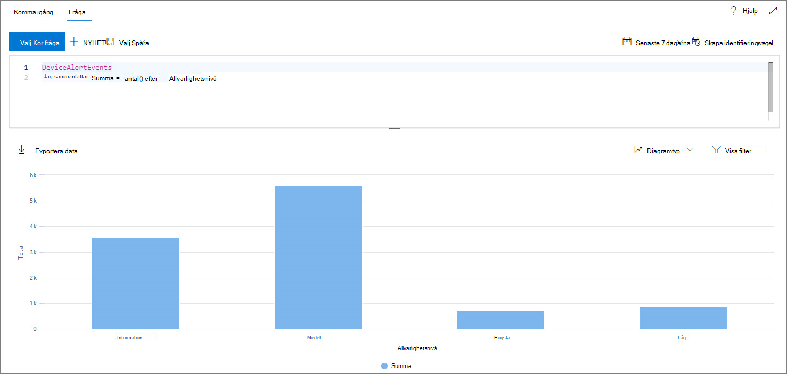
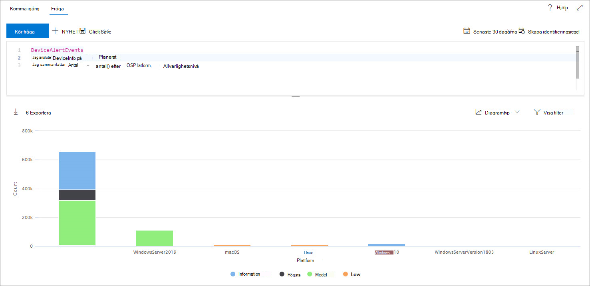
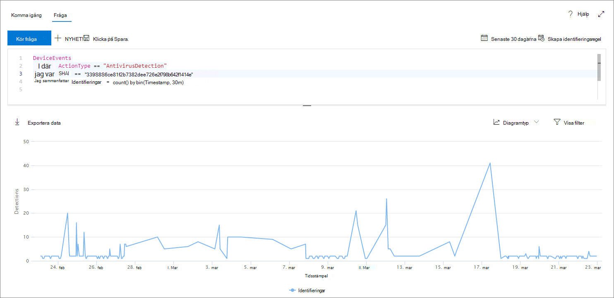
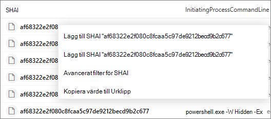
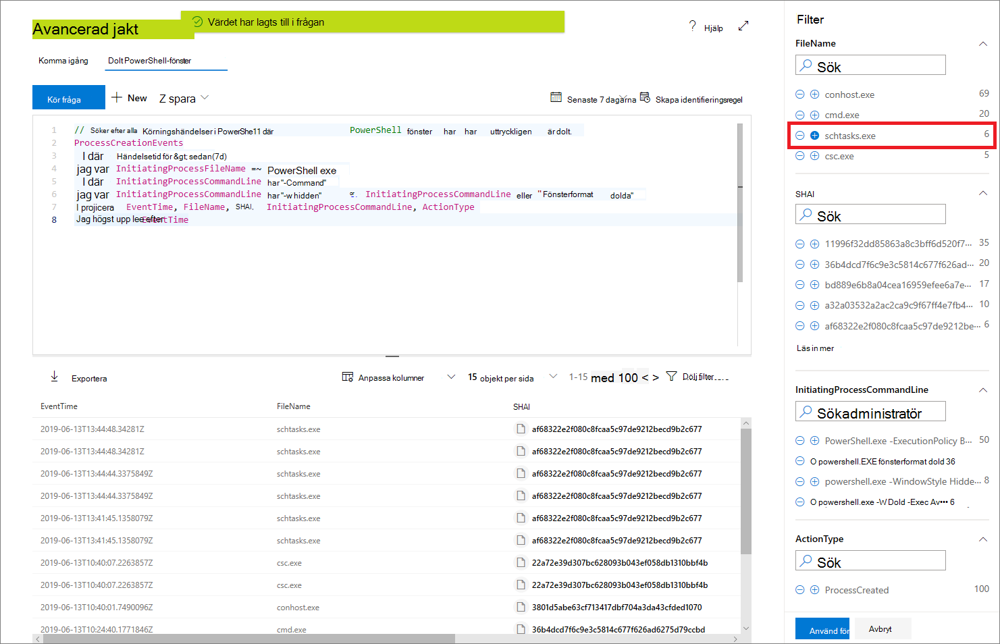

# <a name="work-with-advanced-hunting-query-results"></a><span data-ttu-id="161d7-104">Arbeta med avancerade frågeresultat för sökning</span><span class="sxs-lookup"><span data-stu-id="161d7-104">Work with advanced hunting query results</span></span>

[!INCLUDE [Microsoft 365 Defender rebranding](../../includes/microsoft-defender.md)]

<span data-ttu-id="161d7-105">**Gäller för:**</span><span class="sxs-lookup"><span data-stu-id="161d7-105">**Applies to:**</span></span>
- [<span data-ttu-id="161d7-106">Microsoft Defender för Endpoint</span><span class="sxs-lookup"><span data-stu-id="161d7-106">Microsoft Defender for Endpoint</span></span>](https://go.microsoft.com/fwlink/?linkid=2154037)

><span data-ttu-id="161d7-107">Vill du använda Defender för Slutpunkt?</span><span class="sxs-lookup"><span data-stu-id="161d7-107">Want to experience Defender for Endpoint?</span></span> [<span data-ttu-id="161d7-108">Registrera dig för en kostnadsfri utvärderingsversion.</span><span class="sxs-lookup"><span data-stu-id="161d7-108">Sign up for a free trial.</span></span>](https://www.microsoft.com/microsoft-365/windows/microsoft-defender-atp?ocid=docs-wdatp-advancedhunting-abovefoldlink)

<span data-ttu-id="161d7-109">Du kan skapa avancerade [sökfrågor](advanced-hunting-overview.md) för att få exakt information, men du kan också arbeta med frågeresultatet för att få ytterligare insikter och undersöka specifika aktiviteter och indikatorer.</span><span class="sxs-lookup"><span data-stu-id="161d7-109">While you can construct your [advanced hunting](advanced-hunting-overview.md) queries to return very precise information, you can also work with the query results to gain further insight and investigate specific activities and indicators.</span></span> <span data-ttu-id="161d7-110">Du kan utföra följande åtgärder på dina frågeresultat:</span><span class="sxs-lookup"><span data-stu-id="161d7-110">You can take the following actions on your query results:</span></span>

- <span data-ttu-id="161d7-111">Visa resultat som en tabell eller ett diagram</span><span class="sxs-lookup"><span data-stu-id="161d7-111">View results as a table or chart</span></span>
- <span data-ttu-id="161d7-112">Exportera tabeller och diagram</span><span class="sxs-lookup"><span data-stu-id="161d7-112">Export tables and charts</span></span>
- <span data-ttu-id="161d7-113">Granska nedåt till detaljerad entitetsinformation</span><span class="sxs-lookup"><span data-stu-id="161d7-113">Drill down to detailed entity information</span></span>
- <span data-ttu-id="161d7-114">Justera frågorna direkt från resultatet eller använd filter</span><span class="sxs-lookup"><span data-stu-id="161d7-114">Tweak your queries directly from the results or apply filters</span></span>

## <a name="view-query-results-as-a-table-or-chart"></a><span data-ttu-id="161d7-115">Visa frågeresultat som en tabell eller ett diagram</span><span class="sxs-lookup"><span data-stu-id="161d7-115">View query results as a table or chart</span></span>
<span data-ttu-id="161d7-116">Som standard visar avancerad sökning frågeresultat som tabelldata.</span><span class="sxs-lookup"><span data-stu-id="161d7-116">By default, advanced hunting displays query results as tabular data.</span></span> <span data-ttu-id="161d7-117">Du kan också visa samma data som ett diagram.</span><span class="sxs-lookup"><span data-stu-id="161d7-117">You can also display the same data as a chart.</span></span> <span data-ttu-id="161d7-118">Avancerad sökning har stöd för följande vyer:</span><span class="sxs-lookup"><span data-stu-id="161d7-118">Advanced hunting supports the following views:</span></span>

| <span data-ttu-id="161d7-119">Vytyp</span><span class="sxs-lookup"><span data-stu-id="161d7-119">View type</span></span> | <span data-ttu-id="161d7-120">Beskrivning</span><span class="sxs-lookup"><span data-stu-id="161d7-120">Description</span></span> |
| -- | -- |
| <span data-ttu-id="161d7-121">**Tabell**</span><span class="sxs-lookup"><span data-stu-id="161d7-121">**Table**</span></span> | <span data-ttu-id="161d7-122">Visar frågeresultatet i tabellformat</span><span class="sxs-lookup"><span data-stu-id="161d7-122">Displays the query results in tabular format</span></span> |
| <span data-ttu-id="161d7-123">**Stapeldiagram**</span><span class="sxs-lookup"><span data-stu-id="161d7-123">**Column chart**</span></span> | <span data-ttu-id="161d7-124">Återger en serie unika objekt på x-axeln som lodräta staplar vars höjd representerar numeriska värden från ett annat fält</span><span class="sxs-lookup"><span data-stu-id="161d7-124">Renders a series of unique items on the x-axis as vertical bars whose heights represent numeric values from another field</span></span> |
| <span data-ttu-id="161d7-125">**Staplat stapeldiagram**</span><span class="sxs-lookup"><span data-stu-id="161d7-125">**Stacked column chart**</span></span> | <span data-ttu-id="161d7-126">Återger en serie unika objekt på x-axeln som staplade lodräta staplar vars höjd representerar numeriska värden från ett eller flera andra fält</span><span class="sxs-lookup"><span data-stu-id="161d7-126">Renders a series of unique items on the x-axis as stacked vertical bars whose heights represent numeric values from one or more other fields</span></span> |
| <span data-ttu-id="161d7-127">**Cirkeldiagram**</span><span class="sxs-lookup"><span data-stu-id="161d7-127">**Pie chart**</span></span> | <span data-ttu-id="161d7-128">Återger avsnittsdiagram som representerar unika element.</span><span class="sxs-lookup"><span data-stu-id="161d7-128">Renders sectional pies representing unique items.</span></span> <span data-ttu-id="161d7-129">Storleken på varje cirkel representerar numeriska värden från ett annat fält.</span><span class="sxs-lookup"><span data-stu-id="161d7-129">The size of each pie represents numeric values from another field.</span></span> |
| <span data-ttu-id="161d7-130">**Ringdiagram**</span><span class="sxs-lookup"><span data-stu-id="161d7-130">**Donut chart**</span></span> | <span data-ttu-id="161d7-131">Återger avsnittsbåge som representerar unika objekt.</span><span class="sxs-lookup"><span data-stu-id="161d7-131">Renders sectional arcs representing unique items.</span></span> <span data-ttu-id="161d7-132">Längden på varje båge representerar numeriska värden från ett annat fält.</span><span class="sxs-lookup"><span data-stu-id="161d7-132">The length of each arc represents numeric values from another field.</span></span> |
| <span data-ttu-id="161d7-133">**Linjediagram**</span><span class="sxs-lookup"><span data-stu-id="161d7-133">**Line chart**</span></span> | <span data-ttu-id="161d7-134">Ritar numeriska värden för en serie unika objekt och kopplar samman de ritade värdena</span><span class="sxs-lookup"><span data-stu-id="161d7-134">Plots numeric values for a series of unique items and connects the plotted values</span></span> |
| <span data-ttu-id="161d7-135">**Punktdiagram**</span><span class="sxs-lookup"><span data-stu-id="161d7-135">**Scatter chart**</span></span> | <span data-ttu-id="161d7-136">Ritar numeriska värden för en serie unika objekt</span><span class="sxs-lookup"><span data-stu-id="161d7-136">Plots numeric values for a series of unique items</span></span> |
| <span data-ttu-id="161d7-137">**Areadiagram**</span><span class="sxs-lookup"><span data-stu-id="161d7-137">**Area chart**</span></span> | <span data-ttu-id="161d7-138">Ritar numeriska värden för en serie unika objekt och fyller i avsnitten under de uppritade värdena</span><span class="sxs-lookup"><span data-stu-id="161d7-138">Plots numeric values for a series of unique items and fills the sections below the plotted values</span></span> |

### <a name="construct-queries-for-effective-charts"></a><span data-ttu-id="161d7-139">Skapa frågor för effektiva diagram</span><span class="sxs-lookup"><span data-stu-id="161d7-139">Construct queries for effective charts</span></span>
<span data-ttu-id="161d7-140">Vid rendering av diagram identifierar avancerad sökning automatiskt kolumner av intresse och de numeriska värdena som ska aggregeras.</span><span class="sxs-lookup"><span data-stu-id="161d7-140">When rendering charts, advanced hunting automatically identifies columns of interest and the numeric values to aggregate.</span></span> <span data-ttu-id="161d7-141">Skapa meningsfulla diagram genom att skapa frågor för att returnera de specifika värden som du vill se visualiserade.</span><span class="sxs-lookup"><span data-stu-id="161d7-141">To get meaningful charts, construct your queries to return the specific values you want to see visualized.</span></span> <span data-ttu-id="161d7-142">Här är några exempelfrågor och de resulterande diagrammen.</span><span class="sxs-lookup"><span data-stu-id="161d7-142">Here are some sample queries and the resulting charts.</span></span>

#### <a name="alerts-by-severity"></a><span data-ttu-id="161d7-143">Aviseringar efter allvarlighetsgrad</span><span class="sxs-lookup"><span data-stu-id="161d7-143">Alerts by severity</span></span>
<span data-ttu-id="161d7-144">Använd `summarize` operatorn för att räkna antalet värden som ska visas i diagrammet.</span><span class="sxs-lookup"><span data-stu-id="161d7-144">Use the `summarize` operator to obtain a numeric count of the values you want to chart.</span></span> <span data-ttu-id="161d7-145">I frågan nedan används `summarize` operatorn för att få antalet varningar med allvarlighetsgrad.</span><span class="sxs-lookup"><span data-stu-id="161d7-145">The query below uses the `summarize` operator to get the number of alerts by severity.</span></span>

```kusto
DeviceAlertEvents
| summarize Total = count() by Severity
```
<span data-ttu-id="161d7-146">När resultatet återges visas varje allvarlighetsgrad i ett stapeldiagram som en separat kolumn:</span><span class="sxs-lookup"><span data-stu-id="161d7-146">When rendering the results, a column chart displays each severity value as a separate column:</span></span>

<span data-ttu-id="161d7-147">
 *Frågeresultat för aviseringar efter allvarlighetsgrad som visas som ett stapeldiagram*</span><span class="sxs-lookup"><span data-stu-id="161d7-147">
*Query results for alerts by severity displayed as a column chart*</span></span>

#### <a name="alert-severity-by-operating-system"></a><span data-ttu-id="161d7-148">Aviserings allvarlighetsgrad per operativsystem</span><span class="sxs-lookup"><span data-stu-id="161d7-148">Alert severity by operating system</span></span>
<span data-ttu-id="161d7-149">Du kan också använda `summarize` operatorn för att förbereda resultat för diagramvärden från flera fält.</span><span class="sxs-lookup"><span data-stu-id="161d7-149">You could also use the `summarize` operator to prepare results for charting values from multiple fields.</span></span> <span data-ttu-id="161d7-150">Du kanske till exempel vill veta hur allvarlighetsgraderna för varningar fördelas mellan operativsystemen.</span><span class="sxs-lookup"><span data-stu-id="161d7-150">For example, you might want to understand how alert severities are distributed across operating systems (OS).</span></span> 

<span data-ttu-id="161d7-151">Frågan nedan använder en operator för att hämta OS-information från tabellen och använder sedan `join` för att räkna värden i både och `DeviceInfo` `summarize` `OSPlatform` `Severity` kolumner:</span><span class="sxs-lookup"><span data-stu-id="161d7-151">The query below uses a `join` operator to pull in OS information from the `DeviceInfo` table, and then uses `summarize` to count values in both the `OSPlatform` and `Severity` columns:</span></span>

```kusto
DeviceAlertEvents
| join DeviceInfo on DeviceId
| summarize Count = count() by OSPlatform, Severity
```
<span data-ttu-id="161d7-152">Dessa resultat visualiseras bäst med hjälp av ett staplat diagram:</span><span class="sxs-lookup"><span data-stu-id="161d7-152">These results are best visualized using a stacked column chart:</span></span>

<span data-ttu-id="161d7-153">
 *som visas som ett staplat diagram*</span><span class="sxs-lookup"><span data-stu-id="161d7-153">
*Query results for alerts by OS and severity displayed as a stacked chart*</span></span>

#### <a name="top-ten-device-groups-with-alerts"></a><span data-ttu-id="161d7-154">De tio översta enhetsgrupper med aviseringar</span><span class="sxs-lookup"><span data-stu-id="161d7-154">Top ten device groups with alerts</span></span>
<span data-ttu-id="161d7-155">Om du hanterar en lista med värden som inte är ändliga kan du använda operatorn för att visa endast de värden som har `Top` flest förekomster.</span><span class="sxs-lookup"><span data-stu-id="161d7-155">If you're dealing with a list of values that isn’t finite, you can use the `Top` operator to chart only the values with the most instances.</span></span> <span data-ttu-id="161d7-156">Om du till exempel vill få de tio översta enhetsgrupper med flest aviseringar använder du frågan nedan:</span><span class="sxs-lookup"><span data-stu-id="161d7-156">For example, to get the top ten device groups with the most alerts, use the query below:</span></span>

```kusto
DeviceAlertEvents
| join DeviceInfo on DeviceId
| summarize Count = count() by MachineGroup
| top 10 by Count
```
<span data-ttu-id="161d7-157">Använd vyn cirkeldiagram för att effektivt visa fördelningen mellan de översta grupperna:</span><span class="sxs-lookup"><span data-stu-id="161d7-157">Use the pie chart view to effectively show distribution across the top groups:</span></span>

<span data-ttu-id="161d7-158">
 *Cirkeldiagram som visar fördelningen av aviseringar mellan enhetsgrupper*</span><span class="sxs-lookup"><span data-stu-id="161d7-158">
*Pie chart showing distribution of alerts across device groups*</span></span>

#### <a name="malware-detections-over-time"></a><span data-ttu-id="161d7-159">Identifiering av skadlig programvara över tid</span><span class="sxs-lookup"><span data-stu-id="161d7-159">Malware detections over time</span></span>
<span data-ttu-id="161d7-160">Med hjälp `summarize` av operatorn `bin()` med funktionen kan du söka efter händelser som innefattar en viss indikator över tid.</span><span class="sxs-lookup"><span data-stu-id="161d7-160">Using the `summarize` operator with the `bin()` function, you can check for events involving a particular indicator over time.</span></span> <span data-ttu-id="161d7-161">I frågan nedan räknas identifieringar av en EICAR-testfil med 30 minuters intervall för att visa insamlingar i identifieringar av den filen:</span><span class="sxs-lookup"><span data-stu-id="161d7-161">The query below counts detections of an EICAR test file at 30 minute intervals to show spikes in detections of that file:</span></span>

```kusto
DeviceEvents
| where ActionType == "AntivirusDetection"
| where SHA1 == "3395856ce81f2b7382dee72602f798b642f14140"
| summarize Detections = count() by bin(Timestamp, 30m)
```
<span data-ttu-id="161d7-162">I linjediagrammet nedan markeras tidsperioder tydligt med fler identifieringar av skadlig programvara:</span><span class="sxs-lookup"><span data-stu-id="161d7-162">The line chart below clearly highlights time periods with more detections of the test malware:</span></span> 

<span data-ttu-id="161d7-163">
 *programvara över tid*</span><span class="sxs-lookup"><span data-stu-id="161d7-163">
*Line chart showing the number of detections of a test malware over time*</span></span>


## <a name="export-tables-and-charts"></a><span data-ttu-id="161d7-164">Exportera tabeller och diagram</span><span class="sxs-lookup"><span data-stu-id="161d7-164">Export tables and charts</span></span>
<span data-ttu-id="161d7-165">När du har kört en fråga väljer **du Exportera** för att spara resultaten i en lokal fil.</span><span class="sxs-lookup"><span data-stu-id="161d7-165">After running a query, select **Export** to save the results to local file.</span></span> <span data-ttu-id="161d7-166">Den valda vyn avgör hur resultatet exporteras:</span><span class="sxs-lookup"><span data-stu-id="161d7-166">Your chosen view determines how the results are exported:</span></span>

- <span data-ttu-id="161d7-167">**Tabellvy** – frågeresultatet exporteras i tabellform som en Microsoft Excel-arbetsbok</span><span class="sxs-lookup"><span data-stu-id="161d7-167">**Table view** — the query results are exported in tabular form as a Microsoft Excel workbook</span></span>
- <span data-ttu-id="161d7-168">**Alla diagram** – frågeresultatet exporteras som en JPEG-bild av det återgivna diagrammet</span><span class="sxs-lookup"><span data-stu-id="161d7-168">**Any chart** — the query results are exported as a JPEG image of the rendered chart</span></span>

## <a name="drill-down-from-query-results"></a><span data-ttu-id="161d7-169">Öka detalj detalj detalj för frågeresultat</span><span class="sxs-lookup"><span data-stu-id="161d7-169">Drill down from query results</span></span>
<span data-ttu-id="161d7-170">Du kan visa mer information om enheter, till exempel enheter, filer, användare, IP-adresser och URL-adresser, i frågeresultatet genom att klicka på entitetsidentifieraren.</span><span class="sxs-lookup"><span data-stu-id="161d7-170">To view more information about entities, such as devices, files, users, IP addresses, and URLs, in your query results, simply click the entity identifier.</span></span> <span data-ttu-id="161d7-171">Då öppnas en detaljerad profilsida för den valda enheten.</span><span class="sxs-lookup"><span data-stu-id="161d7-171">This opens a detailed profile page for the selected entity.</span></span>

<span data-ttu-id="161d7-172">Om du snabbt vill granska en post i dina frågeresultat markerar du motsvarande rad för att öppna panelen Kontrollera post.</span><span class="sxs-lookup"><span data-stu-id="161d7-172">To quickly inspect a record in your query results, select the corresponding row to open the Inspect record panel.</span></span> <span data-ttu-id="161d7-173">Panelen innehåller följande information baserad på den valda posten:</span><span class="sxs-lookup"><span data-stu-id="161d7-173">The panel provides the following information based on the selected record:</span></span>

- <span data-ttu-id="161d7-174">**Tillgångar** – En sammanfattad vy av huvudtillgångarna (postlådor, enheter och användare) i posten, som är bättre beskad med tillgänglig information, t.ex. risk- och exponeringsnivåer</span><span class="sxs-lookup"><span data-stu-id="161d7-174">**Assets** — A summarized view of the main assets (mailboxes, devices, and users) found in the record, enriched with available information, such as risk and exposure levels</span></span>
- <span data-ttu-id="161d7-175">**Processträd** – Ett diagram som genereras för poster med processinformation och som är bättre genom att använda tillgänglig sammanhangsberoende information. I allmänhet kan frågor som returnerar fler kolumner leda till rikare processträd.</span><span class="sxs-lookup"><span data-stu-id="161d7-175">**Process tree** — A chart generated for records with process information and enriched using available contextual information; in general, queries that return more columns can result in richer process trees.</span></span>
- <span data-ttu-id="161d7-176">**All information** – Visar alla värden från kolumnerna i posten</span><span class="sxs-lookup"><span data-stu-id="161d7-176">**All details** — Lists all the values from the columns in the record</span></span>

## <a name="tweak-your-queries-from-the-results"></a><span data-ttu-id="161d7-177">Justera frågorna från resultatet</span><span class="sxs-lookup"><span data-stu-id="161d7-177">Tweak your queries from the results</span></span>
<span data-ttu-id="161d7-178">Högerklicka på ett värde i resultatuppsättningen för att snabbt förbättra frågan.</span><span class="sxs-lookup"><span data-stu-id="161d7-178">Right-click a value in the result set to quickly enhance your query.</span></span> <span data-ttu-id="161d7-179">Du kan använda alternativen för att:</span><span class="sxs-lookup"><span data-stu-id="161d7-179">You can use the options to:</span></span>

- <span data-ttu-id="161d7-180">Leta explicit efter det markerade värdet ( `==` )</span><span class="sxs-lookup"><span data-stu-id="161d7-180">Explicitly look for the selected value (`==`)</span></span>
- <span data-ttu-id="161d7-181">Utesluta det valda värdet från frågan ( `!=` )</span><span class="sxs-lookup"><span data-stu-id="161d7-181">Exclude the selected value from the query (`!=`)</span></span>
- <span data-ttu-id="161d7-182">Få mer avancerade operatorer för att lägga till värdet i din fråga, till exempel `contains` `starts with` , och `ends with`</span><span class="sxs-lookup"><span data-stu-id="161d7-182">Get more advanced operators for adding the value to your query, such as `contains`, `starts with` and `ends with`</span></span> 



## <a name="filter-the-query-results"></a><span data-ttu-id="161d7-184">Filtrera frågeresultatet</span><span class="sxs-lookup"><span data-stu-id="161d7-184">Filter the query results</span></span>
<span data-ttu-id="161d7-185">Filtren som visas i den högra rutan ger en sammanfattning av resultatuppsättningen.</span><span class="sxs-lookup"><span data-stu-id="161d7-185">The filters displayed in the right pane provide a summary of the result set.</span></span> <span data-ttu-id="161d7-186">Varje kolumn har en egen sektion i fönstret, som var och en visar värdena i kolumnen och antalet förekomster.</span><span class="sxs-lookup"><span data-stu-id="161d7-186">Every column has its own section in the pane, each of which lists the values found in that column, and the number of instances.</span></span>

<span data-ttu-id="161d7-187">Förfina frågan genom att `+` välja knapparna eller på de värden som du vill ska ingå eller `-` utelämnas.</span><span class="sxs-lookup"><span data-stu-id="161d7-187">Refine your query by selecting the `+` or `-` buttons on the values that you want to include or exclude.</span></span> <span data-ttu-id="161d7-188">Välj sedan **Kör fråga.**</span><span class="sxs-lookup"><span data-stu-id="161d7-188">Then select **Run query**.</span></span>



<span data-ttu-id="161d7-190">När du använder filtret för att ändra frågan och sedan kör frågan uppdateras resultatet.</span><span class="sxs-lookup"><span data-stu-id="161d7-190">Once you apply the filter to modify the query and then run the query, the results are updated accordingly.</span></span>

## <a name="related-topics"></a><span data-ttu-id="161d7-191">Relaterade ämnen</span><span class="sxs-lookup"><span data-stu-id="161d7-191">Related topics</span></span>
- [<span data-ttu-id="161d7-192">Översikt över avancerad jakt</span><span class="sxs-lookup"><span data-stu-id="161d7-192">Advanced hunting overview</span></span>](advanced-hunting-overview.md)
- [<span data-ttu-id="161d7-193">Lär dig frågespråket</span><span class="sxs-lookup"><span data-stu-id="161d7-193">Learn the query language</span></span>](advanced-hunting-query-language.md)
- [<span data-ttu-id="161d7-194">Använda delade frågor</span><span class="sxs-lookup"><span data-stu-id="161d7-194">Use shared queries</span></span>](advanced-hunting-shared-queries.md)
- [<span data-ttu-id="161d7-195">Förstå schemat</span><span class="sxs-lookup"><span data-stu-id="161d7-195">Understand the schema</span></span>](advanced-hunting-schema-reference.md)
- [<span data-ttu-id="161d7-196">Använda metodtips för frågor</span><span class="sxs-lookup"><span data-stu-id="161d7-196">Apply query best practices</span></span>](advanced-hunting-best-practices.md)
- [<span data-ttu-id="161d7-197">Översikt över anpassade identifieringar</span><span class="sxs-lookup"><span data-stu-id="161d7-197">Custom detections overview</span></span>](overview-custom-detections.md)
