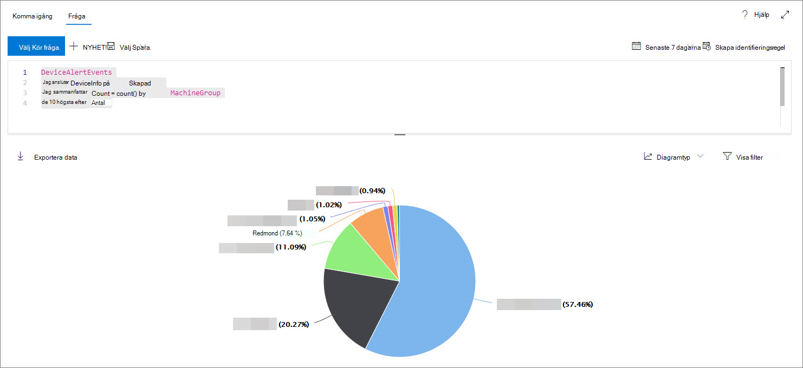

# <a name="work-with-advanced-hunting-query-results"></a>Arbeta med avancerade frågeresultat för sökning

[!INCLUDE [Microsoft 365 Defender rebranding](../../includes/microsoft-defender.md)]

**Gäller för:**
- [Microsoft Defender för Endpoint](https://go.microsoft.com/fwlink/?linkid=2154037)

>Vill du använda Defender för Slutpunkt? [Registrera dig för en kostnadsfri utvärderingsversion.](https://www.microsoft.com/microsoft-365/windows/microsoft-defender-atp?ocid=docs-wdatp-advancedhunting-abovefoldlink)

Du kan skapa avancerade [sökfrågor](advanced-hunting-overview.md) för att få exakt information, men du kan också arbeta med frågeresultatet för att få ytterligare insikter och undersöka specifika aktiviteter och indikatorer. Du kan utföra följande åtgärder på dina frågeresultat:

- Visa resultat som en tabell eller ett diagram
- Exportera tabeller och diagram
- Granska nedåt till detaljerad entitetsinformation
- Justera frågorna direkt från resultatet eller använd filter

## <a name="view-query-results-as-a-table-or-chart"></a>Visa frågeresultat som en tabell eller ett diagram
Som standard visar avancerad sökning frågeresultat som tabelldata. Du kan också visa samma data som ett diagram. Avancerad sökning har stöd för följande vyer:

| Vytyp | Beskrivning |
| -- | -- |
| **Tabell** | Visar frågeresultatet i tabellformat |
| **Stapeldiagram** | Återger en serie unika objekt på x-axeln som lodräta staplar vars höjd representerar numeriska värden från ett annat fält |
| **Staplat stapeldiagram** | Återger en serie unika objekt på x-axeln som staplade lodräta staplar vars höjd representerar numeriska värden från ett eller flera andra fält |
| **Cirkeldiagram** | Återger avsnittsdiagram som representerar unika element. Storleken på varje cirkel representerar numeriska värden från ett annat fält. |
| **Ringdiagram** | Återger avsnittsbåge som representerar unika objekt. Längden på varje båge representerar numeriska värden från ett annat fält. |
| **Linjediagram** | Ritar numeriska värden för en serie unika objekt och kopplar samman de ritade värdena |
| **Punktdiagram** | Ritar numeriska värden för en serie unika objekt |
| **Areadiagram** | Ritar numeriska värden för en serie unika objekt och fyller i avsnitten under de uppritade värdena |

### <a name="construct-queries-for-effective-charts"></a>Skapa frågor för effektiva diagram
Vid rendering av diagram identifierar avancerad sökning automatiskt kolumner av intresse och de numeriska värdena som ska aggregeras. Skapa meningsfulla diagram genom att skapa frågor för att returnera de specifika värden som du vill se visualiserade. Här är några exempelfrågor och de resulterande diagrammen.

#### <a name="alerts-by-severity"></a>Aviseringar efter allvarlighetsgrad
Använd `summarize` operatorn för att räkna antalet värden som ska visas i diagrammet. I frågan nedan används `summarize` operatorn för att få antalet varningar med allvarlighetsgrad.

```kusto
DeviceAlertEvents
| summarize Total = count() by Severity
```
När resultatet återges visas varje allvarlighetsgrad i ett stapeldiagram som en separat kolumn:


 *Frågeresultat för aviseringar efter allvarlighetsgrad som visas som ett stapeldiagram*

#### <a name="alert-severity-by-operating-system"></a>Aviserings allvarlighetsgrad per operativsystem
Du kan också använda `summarize` operatorn för att förbereda resultat för diagramvärden från flera fält. Du kanske till exempel vill veta hur allvarlighetsgraderna för varningar fördelas mellan operativsystemen. 

Frågan nedan använder en operator för att hämta OS-information från tabellen och använder sedan `join` för att räkna värden i både och `DeviceInfo` `summarize` `OSPlatform` `Severity` kolumner:

```kusto
DeviceAlertEvents
| join DeviceInfo on DeviceId
| summarize Count = count() by OSPlatform, Severity
```
Dessa resultat visualiseras bäst med hjälp av ett staplat diagram:


 *som visas som ett staplat diagram*

#### <a name="top-ten-device-groups-with-alerts"></a>De tio översta enhetsgrupper med aviseringar
Om du hanterar en lista med värden som inte är ändliga kan du använda operatorn för att visa endast de värden som har `Top` flest förekomster. Om du till exempel vill få de tio översta enhetsgrupper med flest aviseringar använder du frågan nedan:

```kusto
DeviceAlertEvents
| join DeviceInfo on DeviceId
| summarize Count = count() by MachineGroup
| top 10 by Count
```
Använd vyn cirkeldiagram för att effektivt visa fördelningen mellan de översta grupperna:


 *Cirkeldiagram som visar fördelningen av aviseringar mellan enhetsgrupper*

#### <a name="malware-detections-over-time"></a>Identifiering av skadlig programvara över tid
Med hjälp `summarize` av operatorn `bin()` med funktionen kan du söka efter händelser som innefattar en viss indikator över tid. I frågan nedan räknas identifieringar av en EICAR-testfil med 30 minuters intervall för att visa insamlingar i identifieringar av den filen:

```kusto
DeviceEvents
| where ActionType == "AntivirusDetection"
| where SHA1 == "3395856ce81f2b7382dee72602f798b642f14140"
| summarize Detections = count() by bin(Timestamp, 30m)
```
I linjediagrammet nedan markeras tidsperioder tydligt med fler identifieringar av skadlig programvara: 


 *programvara över tid*


## <a name="export-tables-and-charts"></a>Exportera tabeller och diagram
När du har kört en fråga väljer **du Exportera** för att spara resultaten i en lokal fil. Den valda vyn avgör hur resultatet exporteras:

- **Tabellvy** – frågeresultatet exporteras i tabellform som en Microsoft Excel-arbetsbok
- **Alla diagram** – frågeresultatet exporteras som en JPEG-bild av det återgivna diagrammet

## <a name="drill-down-from-query-results"></a>Öka detalj detalj detalj för frågeresultat
Du kan visa mer information om enheter, till exempel enheter, filer, användare, IP-adresser och URL-adresser, i frågeresultatet genom att klicka på entitetsidentifieraren. Då öppnas en detaljerad profilsida för den valda enheten.

Om du snabbt vill granska en post i dina frågeresultat markerar du motsvarande rad för att öppna panelen Kontrollera post. Panelen innehåller följande information baserad på den valda posten:

- **Tillgångar** – En sammanfattad vy av huvudtillgångarna (postlådor, enheter och användare) i posten, som är bättre beskad med tillgänglig information, t.ex. risk- och exponeringsnivåer
- **Processträd** – Ett diagram som genereras för poster med processinformation och som är bättre genom att använda tillgänglig sammanhangsberoende information. I allmänhet kan frågor som returnerar fler kolumner leda till rikare processträd.
- **All information** – Visar alla värden från kolumnerna i posten

## <a name="tweak-your-queries-from-the-results"></a>Justera frågorna från resultatet
Högerklicka på ett värde i resultatuppsättningen för att snabbt förbättra frågan. Du kan använda alternativen för att:

- Leta explicit efter det markerade värdet ( `==` )
- Utesluta det valda värdet från frågan ( `!=` )
- Få mer avancerade operatorer för att lägga till värdet i din fråga, till exempel `contains` `starts with` , och `ends with` 


## <a name="filter-the-query-results"></a>Filtrera frågeresultatet
Filtren som visas i den högra rutan ger en sammanfattning av resultatuppsättningen. Varje kolumn har en egen sektion i fönstret, som var och en visar värdena i kolumnen och antalet förekomster.

Förfina frågan genom att `+` välja knapparna eller på de värden som du vill ska ingå eller `-` utelämnas. Välj sedan **Kör fråga.**


När du använder filtret för att ändra frågan och sedan kör frågan uppdateras resultatet.

## <a name="related-topics"></a>Relaterade ämnen
- [Översikt över avancerad jakt](advanced-hunting-overview.md)
- [Lär dig frågespråket](advanced-hunting-query-language.md)
- [Använda delade frågor](advanced-hunting-shared-queries.md)
- [Förstå schemat](advanced-hunting-schema-reference.md)
- [Använda metodtips för frågor](advanced-hunting-best-practices.md)
- [Översikt över anpassade identifieringar](overview-custom-detections.md)
