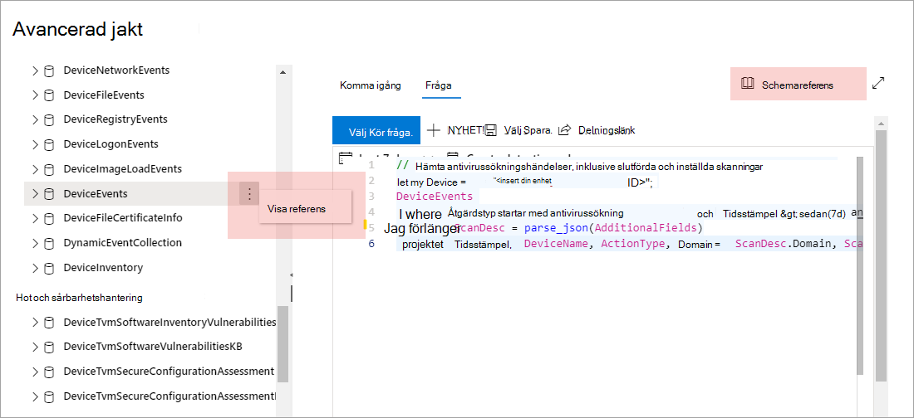

# Förstå det avancerade sökschematUnderstand the advanced hunting schema

[!INCLUDE [Microsoft 365 Defender rebranding](../../includes/microsoft-defender.md)]

**Gäller för:****Applies to:**
- [Microsoft Defender för EndpointMicrosoft Defender for Endpoint](https://go.microsoft.com/fwlink/?linkid=2154037)

>Vill du använda Defender för Slutpunkt?Want to experience Defender for Endpoint? [Registrera dig för en kostnadsfri utvärderingsversion.Sign up for a free trial.](https://www.microsoft.com/microsoft-365/windows/microsoft-defender-atp?ocid=docs-wdatp-advancedhuntingref-abovefoldlink)

[!include[Prerelease information](../../includes/prerelease.md)]

Det [avancerade schemat för](advanced-hunting-overview.md) sökning består av flera tabeller som innehåller händelseinformation eller information om enheter och andra enheter.The [advanced hunting](advanced-hunting-overview.md) schema is made up of multiple tables that provide either event information or information about devices and other entities. För att skapa frågor som sträcker sig över flera tabeller effektivt måste du förstå tabellerna och kolumnerna i det avancerade sökschemat.To effectively build queries that span multiple tables, you need to understand the tables and the columns in the advanced hunting schema.

## Hämta schemainformation i säkerhetscentretGet schema information in the security center
När du skapar frågor kan du använda den inbyggda schemareferensen för att snabbt få följande information om varje tabell i schemat:While constructing queries, use the built-in schema reference to quickly get the following information about each table in the schema:

- **Tabellbeskrivning**– typ av data som finns i tabellen och källan till dessa data.**Tables description**—type of data contained in the table and the source of that data.
- **Kolumner**– alla kolumner i tabellen.**Columns**—all the columns in the table.
- **Åtgärdstyper**– möjliga värden i `ActionType` kolumnen som representerar de händelsetyper som stöds av tabellen.**Action types**—possible values in the `ActionType` column representing the event types supported by the table. Detta tillhandahålls endast för tabeller som innehåller händelseinformation.This is provided only for tables that contain event information.
- **Exempelfråga**– exempelfrågor som innehåller hur tabellen kan användas.**Sample query**—example queries that feature how the table can be utilized.

### Komma åt schemareferensenAccess the schema reference
Om du snabbt vill komma åt schemareferensen **väljer du åtgärden** Visa referens bredvid tabellnamnet i schemarepresentationen.To quickly access the schema reference, select the **View reference** action next to the table name in the schema representation. Du kan också välja **Schemareferens om** du vill söka efter en tabell.You can also select **Schema reference** to search for a table.

## Lär dig schematabellernaLearn the schema tables

I följande referens visas alla tabeller i det avancerade sökschemat.The following reference lists all the tables in the advanced hunting schema. Varje tabellnamn länkar till en sida som beskriver kolumnnamnen för tabellen.Each table name links to a page describing the column names for that table.

Tabell- och kolumnnamn visas också i Microsoft Defender Säkerhetscenter, i schemarepresentationen på den avancerade sökskärmen.Table and column names are also listed within the Microsoft Defender Security Center, in the schema representation on the advanced hunting screen.

| TabellnamnTable name | BeskrivningDescription |
|------------|-------------|
| **[DeviceAlertEvents](advanced-hunting-devicealertevents-table.md)****[DeviceAlertEvents](advanced-hunting-devicealertevents-table.md)** | Varningar i Microsoft Defender SäkerhetscenterAlerts on Microsoft Defender Security Center |
| **[DeviceInfo](advanced-hunting-deviceinfo-table.md)****[DeviceInfo](advanced-hunting-deviceinfo-table.md)** | Enhetsinformation, inklusive OS-informationDevice information, including OS information |
| **[DeviceNetworkInfo](advanced-hunting-devicenetworkinfo-table.md)****[DeviceNetworkInfo](advanced-hunting-devicenetworkinfo-table.md)** | Nätverksegenskaper för enheter, inklusive adaptrar, IP- och MAC-adresser, samt anslutna nätverk och domänerNetwork properties of devices, including adapters, IP and MAC addresses, as well as connected networks and domains |
| **[DeviceProcessEvents](advanced-hunting-deviceprocessevents-table.md)****[DeviceProcessEvents](advanced-hunting-deviceprocessevents-table.md)** | Skapa processer och relaterade händelserProcess creation and related events |
| **[DeviceNetworkEvents](advanced-hunting-devicenetworkevents-table.md)****[DeviceNetworkEvents](advanced-hunting-devicenetworkevents-table.md)** | Nätverksanslutning och relaterade händelserNetwork connection and related events |
| **[DeviceFileEvents](advanced-hunting-devicefileevents-table.md)****[DeviceFileEvents](advanced-hunting-devicefileevents-table.md)** | Skapa, ändra filer och andra filsystemhändelserFile creation, modification, and other file system events |
| **[DeviceRegistryEvents](advanced-hunting-deviceregistryevents-table.md)****[DeviceRegistryEvents](advanced-hunting-deviceregistryevents-table.md)** | Skapa och ändra registerposterCreation and modification of registry entries |
| **[DeviceLogonEvents](advanced-hunting-devicelogonevents-table.md)****[DeviceLogonEvents](advanced-hunting-devicelogonevents-table.md)** | Inloggningar och andra autentiseringshändelserSign-ins and other authentication events |
| **[DeviceImageLoadEvents](advanced-hunting-deviceimageloadevents-table.md)****[DeviceImageLoadEvents](advanced-hunting-deviceimageloadevents-table.md)** | DLL-inläsningshändelserDLL loading events |
| **[DeviceEvents](advanced-hunting-deviceevents-table.md)****[DeviceEvents](advanced-hunting-deviceevents-table.md)** | Flera händelsetyper, inklusive händelser som utlöses av säkerhetskontroller, till exempel Microsoft Defender Antivirus och sårbarhetsskyddMultiple event types, including events triggered by security controls such as Microsoft Defender Antivirus and exploit protection |
| **[DeviceFileCertificateInfo](advanced-hunting-devicefilecertificateinfo-table.md)****[DeviceFileCertificateInfo](advanced-hunting-devicefilecertificateinfo-table.md)** | Certifikatinformation för signerade filer som erhållits från certifikatverifieringshändelser i slutpunkterCertificate information of signed files obtained from certificate verification events on endpoints |
| **[DeviceTvmSoftwareInventory](advanced-hunting-devicetvmsoftwareinventory-table.md)****[DeviceTvmSoftwareInventory](advanced-hunting-devicetvmsoftwareinventory-table.md)** | Inventering av programvara installerad på enheter, inklusive deras versionsinformation och status vid slutet av supportenInventory of software installed on devices, including their version information and end-of-support status |
| **[DeviceTvmSoftwareVulnerabilities](advanced-hunting-devicetvmsoftwarevulnerabilities-table.md)****[DeviceTvmSoftwareVulnerabilities](advanced-hunting-devicetvmsoftwarevulnerabilities-table.md)** | Sårbarheter i programvaran som finns på enheter och listan över tillgängliga säkerhetsuppdateringar som är tillgängliga för varje sårbarhetSoftware vulnerabilities found on devices and the list of available security updates that address each vulnerability |
| **[DeviceTvmSoftwareVulnerabilitiesKB](advanced-hunting-devicetvmsoftwarevulnerabilitieskb-table.md)****[DeviceTvmSoftwareVulnerabilitiesKB](advanced-hunting-devicetvmsoftwarevulnerabilitieskb-table.md)** | Kunskapsbas för offentligt avslöjat säkerhetsproblem, inklusive om sårbarhetskod är offentligt tillgängligKnowledge base of publicly disclosed vulnerabilities, including whether exploit code is publicly available |
| **[DeviceTvmSecureConfigurationAssessment](advanced-hunting-devicetvmsecureconfigurationassessment-table.md)****[DeviceTvmSecureConfigurationAssessment](advanced-hunting-devicetvmsecureconfigurationassessment-table.md)** | Hot & sårbarhetshanteringsutvärderingshändelser, som anger status för olika säkerhetskonfigurationer på enheterThreat & Vulnerability Management assessment events, indicating the status of various security configurations on devices |
| **[DeviceTvmSecureConfigurationAssessmentKB](advanced-hunting-devicetvmsecureconfigurationassessmentkb-table.md)****[DeviceTvmSecureConfigurationAssessmentKB](advanced-hunting-devicetvmsecureconfigurationassessmentkb-table.md)** | Kunskapsbas av olika säkerhetskonfigurationer som används av Threat & Vulnerability Management för att utvärdera enheter; inkluderar mappningar till olika standarder och riktvärdeKnowledge base of various security configurations used by Threat & Vulnerability Management to assess devices; includes mappings to various standards and benchmarks |

## Relaterade ämnenRelated topics
- [Översikt över avancerad jaktAdvanced hunting overview](advanced-hunting-overview.md)
- [Lär dig frågespråketLearn the query language](advanced-hunting-query-language.md)
- [Arbeta med frågeresultatWork with query results](advanced-hunting-query-results.md)
- [Använda metodtips för frågorApply query best practices](advanced-hunting-best-practices.md)
- [Översikt över anpassade identifieringarCustom detections overview](overview-custom-detections.md)
- [Avancerade dataschemaändringar för sökningAdvanced hunting data schema changes](https://techcommunity.microsoft.com/t5/microsoft-defender-atp/advanced-hunting-data-schema-changes/ba-p/1043914)
