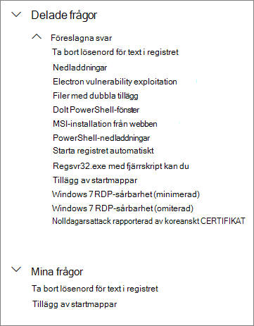
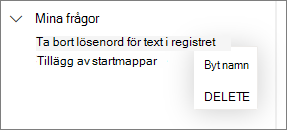

# Använda delade frågor för avancerad sökningUse shared queries in advanced hunting

[!INCLUDE [Microsoft 365 Defender rebranding](../../includes/microsoft-defender.md)]

**Gäller för:****Applies to:**
- [Microsoft Defender för EndpointMicrosoft Defender for Endpoint](https://go.microsoft.com/fwlink/p/?linkid=2154037)

>Vill du använda Defender för Slutpunkt?Want to experience Defender for Endpoint? [Registrera dig för en kostnadsfri utvärderingsversion.Sign up for a free trial.](https://www.microsoft.com/microsoft-365/windows/microsoft-defender-atp?ocid=docs-wdatp-advancedhunting-abovefoldlink)

[Avancerade sökfrågor](advanced-hunting-overview.md) kan delas mellan användare i samma organisation.[Advanced hunting](advanced-hunting-overview.md) queries can be shared among users in the same organization. Du kan också hitta frågor som delats offentligt på GitHub.You can also find queries shared publicly on GitHub. Med de här frågorna kan du snabbt söka efter specifika hot utan att behöva skriva frågor från grunden.These queries let you quickly pursue specific threat hunting scenarios without having to write queries from scratch.

## Spara, ändra och dela en frågaSave, modify, and share a query
Du kan spara en ny eller befintlig fråga så att den bara är tillgänglig för dig eller delas med andra användare i organisationen.You can save a new or existing query so that it is only accessible to you or shared with other users in your organization.

1. Skriv en ny fråga eller läs in en befintlig fråga under **Delade frågor** eller **Mina frågor.**Type a new query or load an existing one from under **Shared queries** or **My queries**.

2. Välj **Spara** eller **Spara som** bland alternativen för Att spara.Select **Save** or **Save as** from the save options. Du undviker att skriva över en befintlig fråga genom att **välja Spara som**.To avoid overwriting an existing query, choose **Save as**.

3. Ange ett namn för frågan.Enter a name for the query.

   

4. Välj den mapp där du vill spara frågan.Select the folder where you'd like to save the query.
    - **Delade frågor –** delas för alla användare i organisationen**Shared queries** — shared to all users in your organization
    - **Mina frågor –** endast tillgänglig för dig**My queries** — accessible only to you
    
5. Välj **Spara**.Select **Save**.

## Ta bort eller byta namn på en frågaDelete or rename a query
1. Högerklicka på en fråga som du vill byta namn på eller ta bort.Right-click on a query you want to rename or delete.

    

2. Välj **Ta bort** och bekräfta borttagningen.Select **Delete** and confirm deletion. Eller välj **Byt** namn och ange ett nytt namn för frågan.Or select **Rename** and provide a new name for the query.

## Skapa en direktlänk till en frågaCreate a direct link to a query
Om du vill skapa en länk som öppnar frågan direkt i den avancerade frågeredigeraren för sökning slutför du frågan och väljer **Dela länk**.To generate a link that opens your query directly in the advanced hunting query editor, finalize your query and select **Share link**.

## Åtkomstfrågor på GitHub-lagringsplatsenAccess queries in the GitHub repository  
Microsoft-säkerhetsvakterna delar regelbundet avancerade sökfrågor på en [angiven offentlig lagringsplats på GitHub.](https://github.com/Microsoft/WindowsDefenderATP-Hunting-Queries)Microsoft security researchers regularly share advanced hunting queries in a [designated public repository on GitHub](https://github.com/Microsoft/WindowsDefenderATP-Hunting-Queries). Lagringsplatsen är öppen för bidrag.This repository is open to contributions. Delta genom [att kostnadsfritt ansluta till GitHub.](https://github.com/)To contribute, [join GitHub for free](https://github.com/). 

>[!TIP]
>Microsoft-säkerhetsvakter erbjuder också avancerade sökfrågor som du kan använda för att hitta aktiviteter och indikatorer som är associerade med nya hot.Microsoft security researchers also provide advanced hunting queries that you can use to locate activities and indicators associated with emerging threats. Dessa frågor tillhandahålls som en del av rapporterna [över hotanalyser](threat-analytics.md) i Microsoft Defender Säkerhetscenter.These queries are provided as part of the [threat analytics](threat-analytics.md) reports in Microsoft Defender Security Center.

## Relaterade ämnenRelated topics
- [Översikt över avancerad jaktAdvanced hunting overview](advanced-hunting-overview.md)
- [Lär dig frågespråketLearn the query language](advanced-hunting-query-language.md)
- [Arbeta med frågeresultatWork with query results](advanced-hunting-query-results.md)
- [Förstå schematUnderstand the schema](advanced-hunting-schema-reference.md)
- [Använda metodtips för frågorApply query best practices](advanced-hunting-best-practices.md)
- [Översikt över anpassade identifieringarCustom detections overview](overview-custom-detections.md)
