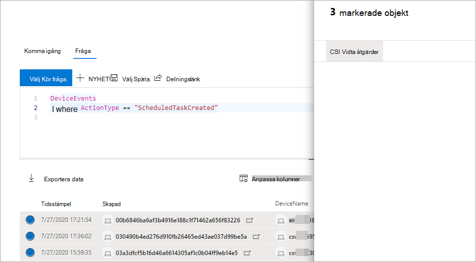

# Vidta åtgärder för avancerade frågeresultat för sökningTake action on advanced hunting query results

**Gäller för:****Applies to:**
- [Microsoft Defender för EndpointMicrosoft Defender for Endpoint](https://go.microsoft.com/fwlink/p/?linkid=2154037)

> Vill du använda Defender för Slutpunkt?Want to experience Defender for Endpoint? [Registrera dig för en kostnadsfri utvärderingsversion.Sign up for a free trial.](https://www.microsoft.com/microsoft-365/windows/microsoft-defender-atp?ocid=docs-wdatp-advancedhuntingref-abovefoldlink)

Du kan snabbt innehålla hot eller adresser komprometterade tillgångar som du hittar i [avancerad sökning](advanced-hunting-overview.md) med hjälp av kraftfulla och omfattande åtgärdsalternativ.You can quickly contain threats or address compromised assets that you find in [advanced hunting](advanced-hunting-overview.md) using powerful and comprehensive action options. Med de här alternativen kan du:With these options, you can:

- Vidta olika åtgärder på enheterTake various actions on devices
- Sätt filer i karantänQuarantine files

## Behörighet som krävsRequired permissions

För att kunna vidta åtgärder via avancerad sökning måste du ha en roll i Defender för Endpoint med behörighet att skicka [åtgärder på enheter](https://docs.microsoft.com/microsoft-365/security/defender-endpoint/user-roles#permission-options).To be able to take action through advanced hunting, you need a role in Defender for Endpoint with [permissions to submit remediation actions on devices](https://docs.microsoft.com/microsoft-365/security/defender-endpoint/user-roles#permission-options). Om du inte kan vidta någon åtgärd kontaktar du en global administratör för att få följande behörighet:If you can't take action, contact a global administrator about getting the following permission:

*Aktiva åtgärdsåtgärder > hantering av hot och sårbarhet – åtgärdshantering**Active remediation actions > Threat and vulnerability management - Remediation handling*

## Vidta olika åtgärder på enheterTake various actions on devices

Du kan utföra följande åtgärder på enheter som identifieras av `DeviceId` kolumnen i frågeresultatet:You can take the following actions on devices identified by the `DeviceId` column in your query results:

- Isolera påverkade enheter för att isolera en smitta eller förhindra attacker från att röra sig frittIsolate affected devices to contain an infection or prevent attacks from moving laterally
- Samla in undersökningspaket för att få mer teknisk informationCollect investigation package to obtain more forensic information
- Kör en antivirussökning för att hitta och ta bort hot med de senaste säkerhetsintelligensuppdateringarnaRun an antivirus scan to find and remove threats using the latest security intelligence updates
- Initiera en automatiserad undersökning för att kontrollera och åtgärda hot på enheten och eventuellt andra enheter som påverkasInitiate an automated investigation to check and remediate threats on the device and possibly other affected devices
- Begränsa programkörningen till endast Microsoft-signerade körbara filer, förhindra efterföljande aktivitet med hot genom skadlig programvara eller andra körbara filer som inte är betroddaRestrict app execution to only Microsoft-signed executable files, preventing subsequent threat activity through malware or other untrusted executables

Mer information om hur de här svarsåtgärderna utförs via Defender för Slutpunkt finns [i om svarsåtgärder på enheter.](respond-machine-alerts.md)To learn more about how these response actions are performed through Defender for Endpoint, [read about response actions on devices](respond-machine-alerts.md).

## Sätt filer i karantänQuarantine files

Du kan distribuera *karantänåtgärden* på filer så att de automatiskt sätts i karantän när de påträffas.You can deploy the *quarantine* action on files so that they are automatically quarantined when encountered. När du väljer den här åtgärden kan du välja mellan följande kolumner för att identifiera vilka filer i frågan som ska sätts i karantän:When selecting this action, you can choose between the following columns to identify which files in your query results to quarantine:

- `SHA1` — I de flesta avancerade tabeller för sökning är det SHA-1 i filen som påverkades av den inspelade åtgärden.`SHA1` — In most advanced hunting tables, this is the SHA-1 of the file that was affected by the recorded action. Om en fil till exempel kopierades är det den kopierade filen.For example, if a file was copied, this would be the copied file.
- `InitiatingProcessSHA1` — I de flesta avancerade söktabeller är det här filen som ansvarar för att initiera den inspelade åtgärden.`InitiatingProcessSHA1` — In most advanced hunting tables, this is the file responsible for initiating the recorded action. Om till exempel en underordnad process startades skulle det här vara den överordnade processen.For example, if a child process was launched, this would be the parent process. 
- `SHA256` — Det här är SHA-256-motsvarigheten till filen som identifieras av `SHA1` kolumnen.`SHA256` — This is the SHA-256 equivalent of the file identified by the `SHA1` column.
- `InitiatingProcessSHA256` — Det här är SHA-256-motsvarigheten till filen som identifieras av `InitiatingProcessSHA1` kolumnen.`InitiatingProcessSHA256` — This is the SHA-256 equivalent of the file identified by the `InitiatingProcessSHA1` column.

Mer information om hur åtgärder i karantän vidtas och hur filer kan återställas finns [i svarsåtgärder på filer.](respond-file-alerts.md)To learn more about how quarantine actions are taken and how files can be restored, [read about response actions on files](respond-file-alerts.md).

>[!NOTE]
>För att hitta filer och sätta dem i karantän bör frågeresultatet även `DeviceId` innehålla värden som enhetsidentifierare.To locate files and quarantine them, the query results should also include `DeviceId` values as device identifiers.  

## Vidta åtgärderTake action

Om du vill utföra någon av de åtgärder som beskrivs markerar du en eller flera poster i frågeresultatet och väljer **sedan Vidta åtgärder**.To take any of the described actions, select one or more records in your query results and then select **Take actions**. En guide vägleder dig genom processen med att välja och sedan skicka dina föredragna åtgärder.A wizard will guide you through the process of selecting and then submitting your preferred actions.

## Granska åtgärder som har vidtagitsReview actions taken

Varje åtgärd registreras individuellt i åtgärdscenter, under **Historik för åtgärdscenter**  >   ([security.microsoft.com/action-center/history](https://security.microsoft.com/action-center/history)).Each action is individually recorded in the action center, under **Action center** > **History** ([security.microsoft.com/action-center/history](https://security.microsoft.com/action-center/history)). Gå till åtgärdscenter för att kontrollera status för varje åtgärd.Go to the action center to check the status of each action.
 
## Relaterade ämnenRelated topics

- [Översikt över avancerad jaktAdvanced hunting overview](advanced-hunting-overview.md)
- [Lär dig frågespråketLearn the query language](advanced-hunting-query-language.md)
- [Förstå schematUnderstand the schema](advanced-hunting-schema-reference.md)
- [Arbeta med frågeresultatWork with query results](advanced-hunting-query-results.md)
- [Använda metodtips för frågorApply query best practices](advanced-hunting-best-practices.md)
- [Översikt över anpassade identifieringarCustom detections overview](overview-custom-detections.md)
