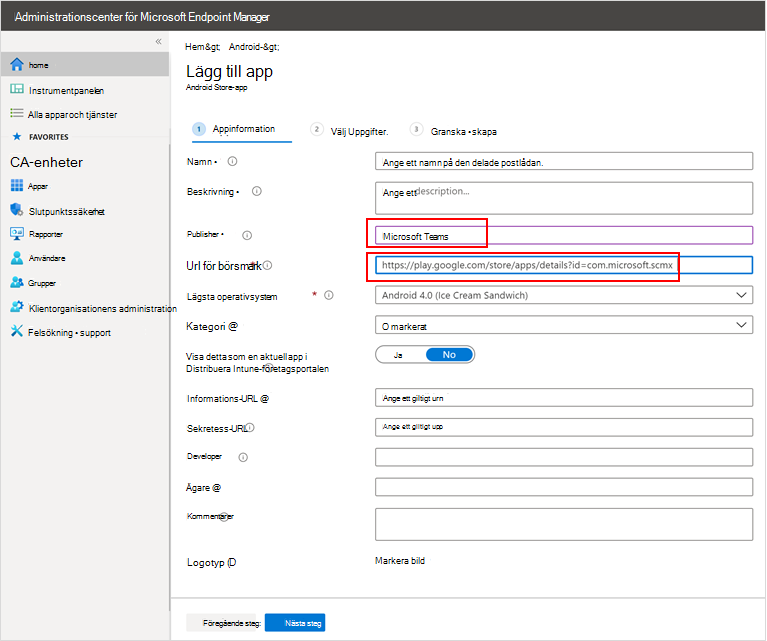
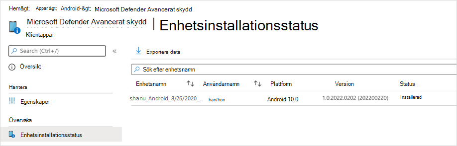

# Distribuera Microsoft Defender för Endpoint för Android med Microsoft IntuneDeploy Microsoft Defender for Endpoint on Android with Microsoft Intune 

[!INCLUDE [Microsoft 365 Defender rebranding](../../includes/microsoft-defender.md)]

**Gäller för:****Applies to:**
- [Microsoft Defender för EndpointMicrosoft Defender for Endpoint](https://go.microsoft.com/fwlink/p/?linkid=2154037)
- [Microsoft 365 DefenderMicrosoft 365 Defender](https://go.microsoft.com/fwlink/?linkid=2118804)

> Vill du uppleva Microsoft Defender för Slutpunkt?Want to experience Microsoft Defender for Endpoint? [Registrera dig för en kostnadsfri utvärderingsversion.Sign up for a free trial.](https://www.microsoft.com/microsoft-365/windows/microsoft-defender-atp?ocid=docs-wdatp-exposedapis-abovefoldlink) 

Lär dig hur du distribuerar Defender för slutpunkt på Android Intune-företagsportal enheter med registrerade enheter.Learn how to deploy Defender for Endpoint on Android on Intune Company Portal enrolled devices. Mer information om registrering av Intune-enheter finns  [i Registrera din enhet](/mem/intune/user-help/enroll-device-android-company-portal).For more information about Intune device enrollment, see  [Enroll your device](/mem/intune/user-help/enroll-device-android-company-portal).

> [!NOTE]
> **Defender för slutpunkt på Android är nu tillgängligt på [Google Play](https://play.google.com/store/apps/details?id=com.microsoft.scmx)****Defender for Endpoint on Android is now available on [Google Play](https://play.google.com/store/apps/details?id=com.microsoft.scmx)**  
> Du kan ansluta till Google Play från Intune för att distribuera Defender för slutpunktsappen i alla registreringslägena för Enhetsadministratör och Android Enterprise.You can connect to Google Play from Intune to deploy Defender for Endpoint app across Device Administrator and Android Enterprise entrollment modes.
Uppdateringar av appen sker automatiskt via Google Play.Updates to the app are automatic via Google Play.

## Distribuera på registrerade enheter med enhetsadministratörDeploy on Device Administrator enrolled devices

**Distribuera Defender för slutpunkt på Android Intune-företagsportal – registrerade enheter som enhetsadministratör****Deploy Defender for Endpoint on Android on Intune Company Portal - Device Administrator enrolled devices**

Lär dig hur du distribuerar Defender för slutpunkt på Android Intune-företagsportal enheter – registrerade enheter som enhetsadministratör.Learn how to deploy Defender for Endpoint on Android on Intune Company Portal - Device Administrator enrolled devices. 

### Lägg till som Android Store-appAdd as Android store app

1. Gå [Microsoft Endpoint Manager App Android-appar](https://go.microsoft.com/fwlink/?linkid=2109431) **Lägg** till \> **Android** \> **\> Store-app** i administrationscentret och välj **Välj**.In [Microsoft Endpoint Manager admin center](https://go.microsoft.com/fwlink/?linkid=2109431) , go to **Apps** \> **Android Apps** \> **Add \> Android store app** and choose **Select**.

   

2. På sidan **Lägg till app** och i avsnittet *Programinformation* anger du:On the **Add app** page and in the *App Information* section enter: 

   - **Name****Name** 
   - **Beskrivning****Description**
   - **Publisher** som Microsoft.**Publisher** as Microsoft.
   - **URL för app store** som https://play.google.com/store/apps/details?id=com.microsoft.scmx (Defender för slutpunktsapp google Play Store URL)**App store URL** as https://play.google.com/store/apps/details?id=com.microsoft.scmx (Defender for Endpoint app Google Play Store URL) 

   Andra fält är valfria.Other fields are optional. Välj **Nästa**.Select **Next**.

   

3. Gå till *avsnittet* Obligatoriska i avsnittet Uppgifter **och** välj Lägg **till grupp.**In the *Assignments* section, go to the **Required** section and select **Add group.** Du kan sedan välja den användargrupp(er) som du vill rikta Defender för Endpoint på Android-appen till.You can then choose the user group(s) that you would like to target Defender for Endpoint on Android app. Välj **Markera** och sedan **Nästa.**Choose **Select** and then **Next**.

    >[!NOTE]
    >Den valda användargruppen ska bestå av intune-registrerade användare.The selected user group should consist of Intune enrolled users.

    > [!div class="mx-imgBorder"]

    > 

4. I avsnittet **Granska+Skapa** kontrollerar du att all information som angetts är korrekt och väljer sedan **Skapa**.In the **Review+Create** section, verify that all the information entered is correct and then select **Create**.

    Inom en liten stund kunde appen Defender för Slutpunkt skapas och ett meddelande visades i det övre högra hörnet på sidan.In a few moments, the Defender for Endpoint app would be created successfully, and a notification would show up at the top-right corner of the page.

    

5. På sidan med appinformation som  visas i avsnittet Övervaka väljer du Enhetsinstallationsstatus **för** att verifiera att enhetsinstallationen har slutförts.In the app information page that is displayed, in the **Monitor** section, select **Device install status** to verify that the device installation has completed successfully.

    > [!div class="mx-imgBorder"]
    > 

### Fullständig registrering och kontrollstatusComplete onboarding and check status

1. När Defender för slutpunkt på Android har installerats på enheten visas appikonen.Once Defender for Endpoint on Android has been installed on the device, you'll see the app icon.

    

2. Tryck på appikonen Microsoft Defender för Slutpunkt och följ anvisningarna på skärmen för att slutföra introduktionen av appen.Tap the Microsoft Defender for Endpoint app icon and follow the on-screen instructions to complete onboarding the app. Informationen innefattar godkännande av Android-behörigheter som krävs av Defender för Endpoint på Android.The details include end-user acceptance of Android permissions required by Defender for Endpoint on Android.

3. Vid lyckad registrering börjar enheten visas i listan Enheter i Microsoft Defender Säkerhetscenter.Upon successful onboarding, the device will start showing up on the Devices list in Microsoft Defender Security Center.

    

## Distribuera på registrerade enheter för Android EnterpriseDeploy on Android Enterprise enrolled devices

Defender för slutpunkt på Android stöder registrerade enheter för Android Enterprise.Defender for Endpoint on Android supports Android Enterprise enrolled devices.

Mer information om de registreringsalternativ som stöds av Intune finns i [Alternativ för registrering.](/mem/intune/enrollment/android-enroll)For more information on the enrollment options supported by Intune, see [Enrollment Options](/mem/intune/enrollment/android-enroll).

**För närvarande stöds personligt ägda enheter med arbetsprofil och fullständigt hanterad användarenhetsregistrering i företagsägd distribution.****Currently, Personally owned devices with work profile and Corporate-owned fully managed user device enrollments are supported for deployment.**

## Lägga till Microsoft Defender för slutpunkt på Android som en hanterad Google Play-appAdd Microsoft Defender for Endpoint on Android as a Managed Google Play app

Följ stegen nedan för att lägga till appen Microsoft Defender för slutpunkt i ditt hanterade Google Play.Follow the steps below to add Microsoft Defender for Endpoint app into your managed Google Play.

1. I [Microsoft Endpoint Manager appcenter går](https://go.microsoft.com/fwlink/?linkid=2109431) du till **Appar** \> **Android-appar Lägg** \> **till** och väljer **Hanterad Google Play-app.**In [Microsoft Endpoint Manager admin center](https://go.microsoft.com/fwlink/?linkid=2109431) , go to **Apps** \> **Android Apps** \> **Add** and select **Managed Google Play app**.

    > [!div class="mx-imgBorder"]
    > 

2. På den hanterade Google Play-sidan som läses in därefter går du till sökrutan och letar upp **Microsoft Defender.**On your managed Google Play page that loads subsequently, go to the search box and lookup **Microsoft Defender.** Din sökning ska visa appen Microsoft Defender för slutpunkt i ditt hanterade Google Play.Your search should display the Microsoft Defender for Endpoint app in your Managed Google Play. Klicka på microsoft Defender för slutpunktsappen i sökresultatet för appar.Click on the Microsoft Defender for Endpoint app from the Apps search result.

    

3. På sidan Appbeskrivning som kommer härnäst bör du kunna se appinformationen på Defender för Slutpunkt.In the App description page that comes up next, you should be able to see app details on Defender for Endpoint. Granska informationen på sidan och välj sedan **Godkänn**.Review the information on the page and then select **Approve**.

    > [!div class="mx-imgBorder"]
    > 

4. Du får de behörigheter som Defender för Endpoint får för att det ska fungera.You'll be presented with the permissions that Defender for Endpoint obtains for it to work. Granska dem och välj sedan **Godkänn**.Review them and then select **Approve**.

    

5. Då visas sidan Inställningar för godkännande.You'll be presented with the Approval settings page. Sidan bekräftar din inställning för att hantera nya appbehörigheter som Defender för Slutpunkt på Android kan fråga.The page confirms your preference to handle new app permissions that Defender for Endpoint on Android might ask. Granska alternativen och välj det alternativ du vill använda.Review the choices and select your preferred option. Välj **Klar**.Select **Done**.

    Som standard markeras Behåll godkänd som hanterad Google Play *när appen begär nya behörigheter*By default, managed Google Play selects *Keep approved when app requests new permissions*

    > [!div class="mx-imgBorder"]
    > 

6. När du har valt behörighetshantering väljer du Synkronisera **för att** synkronisera Microsoft Defender för Endpoint till din applista.After the permissions handling selection is made, select **Sync** to sync Microsoft Defender for Endpoint to your apps list.

    > [!div class="mx-imgBorder"]
    > 

7. Synkroniseringen slutförs om några minuter.The sync will complete in a few minutes.

    

8. Välj knappen **Uppdatera** på skärmen Android-appar så ska Microsoft Defender för Slutpunkt visas i applistan.Select the **Refresh** button in the Android apps screen and Microsoft Defender for Endpoint should be visible in the apps list.

    > [!div class="mx-imgBorder"]
    > 

9. Defender för Endpoint har stöd för appkonfigurationsprinciper för hanterade enheter via Intune.Defender for Endpoint supports App configuration policies for managed devices via Intune. Den här funktionen kan användas för att automatiskt skapa tillämpliga Android-behörigheter, så slutanvändaren behöver inte acceptera dessa behörigheter.This capability can be leveraged to autogrant applicable Android permission(s), so the end user does not need to accept these permission(s).

    1. På sidan **Appar går** du till **Principprinciper > principer för programkonfiguration > Lägg till > hanterade enheter.**In the **Apps** page, go to **Policy > App configuration policies > Add > Managed devices**.

       

    1. På sidan **Skapa appkonfigurationsprincip** anger du följande information:In the **Create app configuration policy** page, enter the following details:
    
        - Namn: Microsoft Defender för Slutpunkt.Name: Microsoft Defender for Endpoint.
        - Välj **Android Enterprise** som plattform.Choose **Android Enterprise** as platform.
        - Välj **Endast Arbetsprofil** som Profiltyp.Choose **Work Profile only** as Profile Type.
        - Klicka **på Välj app**, **Microsoft Defender ATP**, välj **OK** och sedan **Nästa.**Click **Select App**, choose **Microsoft Defender ATP**, select **OK** and then **Next**.
    
        > [!div class="mx-imgBorder"]
        > 

    1. På sidan **Inställningar** till avsnittet Behörigheter klickar du på Lägg till för att visa listan med behörigheter som stöds.In the **Settings** page, go to the Permissions section click on Add to view the list of supported permissions. Välj följande behörigheter i avsnittet Lägg till behörigheter:In the Add Permissions section, select the following permissions:

       - Extern lagring (läsa)External storage (read)
       - Extern lagring (skrivning)External storage (write)

       Välj sedan **OK**.Then select **OK**.

       > [!div class="mx-imgBorder"]
      > 

    1. Nu bör du se både de behörigheter som visas och nu kan  du automatiskt tilldela båda genom att välja autogrant i listrutan Behörighetstillstånd och sedan **välja Nästa.**You should now see both the permissions listed and now you can autogrant both by choosing autogrant in the **Permission state** drop-down and then select **Next**.

       > [!div class="mx-imgBorder"]
       > 

    1. På sidan Assignments väljer du den användargrupp som den här appkonfigurationsprincipen ska **tilldelas** till.In the **Assignments** page, select the user group to which this app config policy would be assigned to. Klicka **på Markera grupper som ska** inkluderas och markera tillämplig grupp och välj sedan **Nästa.**Click **Select groups to include** and selecting the applicable group and then selecting **Next**.  Gruppen som väljs här är vanligtvis samma grupp som du tilldelar Microsoft Defender för endpoint Android-appen.The group selected here is usually the same group to which you would assign Microsoft Defender for Endpoint Android app. 

       > [!div class="mx-imgBorder"]
       > 
    

     1. På sidan **Granska + Skapa** som kommer upp härnäst granskar du all information och väljer sedan **Skapa**.In the **Review + Create** page that comes up next, review all the information and then select **Create**.  
    
        Appkonfigurationsprincipen för Defender för slutpunkt som automatiskt tilldelas lagringsbehörigheten tilldelas nu till den valda användargruppen.The app configuration policy for Defender for Endpoint autogranting the storage permission is now assigned to the selected user group.

        > [!div class="mx-imgBorder"]
        > 

10. Välj **Microsoft Defender ATP** i listan \> **Egenskaper** \> **uppgifter** \> **Redigera.**Select **Microsoft Defender ATP** app in the list \> **Properties** \> **Assignments** \> **Edit**.

    

11. Tilldela appen som en *obligatorisk* app till en användargrupp.Assign the app as a *Required* app to a user group. Det installeras automatiskt i *arbetsprofilen* vid nästa synkronisering av enheten via Företagsportal appen.It is automatically installed in the *work profile* during the next sync of the device via Company Portal app. Uppgiften kan göras genom att gå till avsnittet Lägg till *grupp* \> **som krävs,** markera användargruppen och klicka på **Välj.**This assignment can be done by navigating to the *Required* section \> **Add group,** selecting the user group and click **Select**.

    > [!div class="mx-imgBorder"]
    > 

12. På sidan **Redigera** program granskar du all information som angetts ovan.In the **Edit Application** page, review all the information that was entered above. Välj sedan **Granska + Spara och** sedan Spara igen **för** att påbörja uppgiften.Then select **Review + Save** and then **Save** again to commence assignment.

### Automatisk konfiguration av alltid på VPNAuto Setup of Always-on VPN 
Defender för Endpoint har stöd för principer för enhetskonfiguration för hanterade enheter via Intune.Defender for Endpoint supports Device configuration policies for managed devices via Intune. Den här funktionen kan användas för automatisk konfiguration av alltid på VPN på registrerade enheter för Android Enterprise, så slutanvändaren behöver inte konfigurera **VPN-tjänsten** under registrering.This capability can be leveraged to **Auto setup of Always-on VPN** on Android Enterprise enrolled devices, so the end user does not need to set up VPN service while onboarding.
1.  På **enheter** väljer du **Konfigurationsprofiler**  >  **Skapa**  >  **profilplattform**  >  **Android Enterprise–** **Välj enhetsbegränsningar** under något av följande, beroende på vilken typ av enhetsregistrering du harOn **Devices**, select **Configuration Profiles** > **Create Profile** > **Platform** > **Android Enterprise** Select **Device restrictions** under one of the following, based on your device enrollment type 
- **Fullständigt hanterad, dedikerad och Corporate-Owned arbetsprofil****Fully Managed, Dedicated, and Corporate-Owned Work Profile**
- **Personligt ägd arbetsprofil****Personally owned Work Profile**

Välj **Skapa**.Select **Create**.
 
   > 
    
2. **Konfigurationsinställningar Inställningar** Ange ett **namn** och en **beskrivning** för att unikt identifiera konfigurationsprofilen.**Configuration Settings** Provide a **Name** and a **Description** to uniquely identify the configuration profile. 

   > 
   
 3. Välj **Anslutningar** och konfigurera VPN:Select **Connectivity** and configure VPN:
- Aktivera **att alltid på VPN** konfigurera en VPN-klient i arbetsprofilen så att den automatiskt ansluter och återansluter till VPN när det är möjligt.Enable **Always-on VPN** Setup a VPN client in the work profile to automatically connect and reconnect to the VPN whenever possible. Endast en VPN-klient kan konfigureras för alltid-på VPN på en viss enhet, så se till att inte ha fler än en alltid-på VPN-policy distribuerad till en enda enhet.Only one VPN client can be configured for always-on VPN on a given device, so be sure to have no more than one always-on VPN policy deployed to a single device. 
- Välj **Custom** i VPN-klientlistrutan Custom VPN i det här fallet Defender för Endpoint VPN som används för att tillhandahålla Web Protection-funktionen.Select **Custom** in VPN client dropdown list Custom VPN in this case is Defender for Endpoint VPN which is used to provide the Web Protection feature. 
    > [!NOTE]
    > Appen Microsoft Defender för slutpunkt måste installeras på användarens enhet för att den ska fungera automatiskt.Microsoft Defender for Endpoint app must be installed on user’s device, in order to functioning of auto setup of this VPN.

- Ange **paket-ID** för Microsoft Defender för slutpunktsappen i Google Play Store.Enter **Package ID** of the Microsoft Defender for Endpoint app in Google Play store. För Defender-appens URL https://play.google.com/store/apps/details?id=com.microsoft.scmx är Paket-ID **com.microsoft.scmx**For the Defender app URL https://play.google.com/store/apps/details?id=com.microsoft.scmx, Package ID is **com.microsoft.scmx**  
- **Nedlåst listläge** Inte konfigurerad (standard)**Lockdown mode** Not configured (Default) 

     
   
4. **Uppgift** På sidan  **Assignments**   väljer du den användargrupp som den här appkonfigurationsprincipen ska tilldelas till.**Assignment** In the **Assignments** page, select the user group to which this app config policy would be assigned to. Klicka **på Markera grupper** som ska ingå och markera tillämplig grupp och klicka sedan på **Nästa.**Click **Select groups** to include and selecting the applicable group and then click **Next**. Gruppen som väljs här är vanligtvis samma grupp som du tilldelar Microsoft Defender för endpoint Android-appen.The group selected here is usually the same group to which you would assign Microsoft Defender for Endpoint Android app. 

     

5. På sidan **Granska + Skapa** som kommer upp härnäst granskar du all information och väljer sedan **Skapa**.In the **Review + Create** page that comes up next, review all the information and then select **Create**. Profil för enhetskonfiguration har nu tilldelats den valda användargruppen.The device configuration profile is now assigned to the selected user group.    

    

## Fullständig registrering och kontrollstatusComplete onboarding and check status

1. Bekräfta installationsstatusen för Microsoft Defender för slutpunkt på Android genom att klicka på **Enhetsinstallationsstatus**.Confirm the installation status of Microsoft Defender for Endpoint on Android by clicking on the **Device Install Status**. Kontrollera att enheten visas här.Verify that the device is displayed here.

    > [!div class="mx-imgBorder"]
    > 

2. På enheten kan du verifiera onboarding-status genom att gå till **arbetsprofilen**.On the device, you can validate the onboarding status by going to the **work profile**. Kontrollera att Defender för slutpunkt är tillgängligt och att du är registrerad för personligt **ägda enheter med arbetsprofilen**.Confirm that Defender for Endpoint is available and that you are enrolled to the **Personally owned devices with work profile**.  Om du är registrerad på en enhet som ägs av en företagsägd, fullständigt hanterad användare har du en enda profil på enheten där du kan bekräfta att Defender för Slutpunkt är tillgänglig.If you are enrolled to a **Corporate-owned, fully managed user device**, you will have a single profile on the device where you can confirm that Defender for Endpoint is available.

    

3. När appen är installerad öppnar du appen och godkänner behörigheterna. Därefter lyckades din registrering.When the app is installed, open the app and accept the permissions and then your onboarding should be successful.

    

4. I det här läget har enheten introducerats till Defender för slutpunkt på Android.At this stage the device is successfully onboarded onto Defender for Endpoint on Android. Du kan kontrollera detta på [Microsoft Defender Säkerhetscenter](https://securitycenter.microsoft.com) genom att gå till **sidan** Enheter.You can verify this on the [Microsoft Defender Security Center](https://securitycenter.microsoft.com) by navigating to the **Devices** page.

    

## Relaterade ämnenRelated topics
- [Översikt över Microsoft Defender för Endpoint för AndroidOverview of Microsoft Defender for Endpoint on Android](microsoft-defender-endpoint-android.md)
- [Konfigurera Microsoft Defender för Endpoint för Android-funktionerConfigure Microsoft Defender for Endpoint on Android features](android-configure.md)
