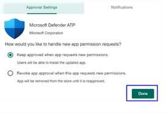
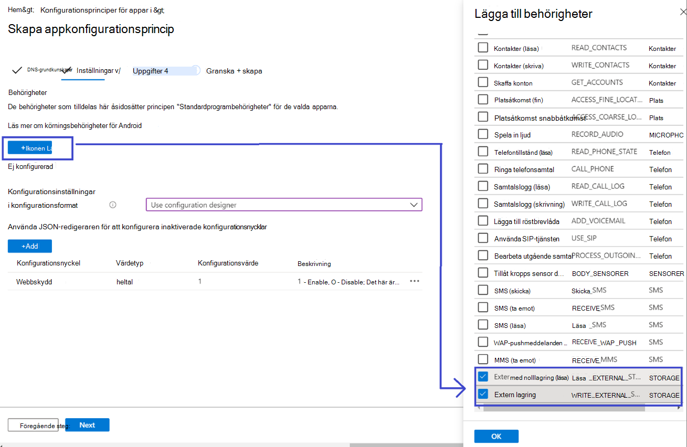
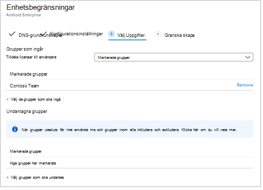

# Distribuera Microsoft Defender för slutpunkt på Android med Microsoft Intune 

[!INCLUDE [Microsoft 365 Defender rebranding](../../includes/microsoft-defender.md)]

**Gäller för:**
- [Microsoft Defender för Endpoint](https://go.microsoft.com/fwlink/p/?linkid=2154037)
- [Microsoft 365 Defender](https://go.microsoft.com/fwlink/?linkid=2118804)

> Vill du uppleva Microsoft Defender för Slutpunkt? [Registrera dig för en kostnadsfri utvärderingsversion.](https://www.microsoft.com/microsoft-365/windows/microsoft-defender-atp?ocid=docs-wdatp-exposedapis-abovefoldlink) 

Lär dig hur du distribuerar Defender för Slutpunkt för Android på registrerade enheter i Intune-företagsportal. Mer information om registrering av Intune-enheter finns  [i Registrera din enhet](https://docs.microsoft.com/mem/intune/user-help/enroll-device-android-company-portal).

> [!NOTE]
> **Defender för slutpunkt för Android är nu tillgänglig på [Google Play](https://play.google.com/store/apps/details?id=com.microsoft.scmx)**  
> Du kan ansluta till Google Play från Intune för att distribuera Defender för slutpunktsappen i alla registreringslägena för Enhetsadministratör och Android Enterprise.
Uppdateringar av appen sker automatiskt via Google Play.

## Distribuera på registrerade enheter med enhetsadministratör

**Distribuera Defender för slutpunkt för Android på Intune-företagsportal – registrerade enheter som enhetsadministratör**

Lär dig hur du distribuerar Defender för Slutpunkt för Android på Intune-företagsportal – registrerade enheter som enhetsadministratör. 

### Lägg till som Android Store-app

1. I [administrationscentret för Microsoft Endpoint Manager](https://go.microsoft.com/fwlink/?linkid=2109431) går du till **Appar** \> **Android-appar Lägg** till App för Android \> **\> Store** och väljer **Välj**.

   

2. På sidan **Lägg till app** och i avsnittet *Programinformation* anger du: 

   - **Name** 
   - **Beskrivning**
   - **Publisher** som Microsoft.
   - **URL för app store** som https://play.google.com/store/apps/details?id=com.microsoft.scmx (Defender för slutpunktsapp google Play Store URL) 

   Andra fält är valfria. Välj **Nästa**.

   

3. Gå till *avsnittet* Obligatoriska i avsnittet Uppgifter **och** välj Lägg **till grupp.** Du kan sedan välja den användargrupp du vill rikta Defender för Endpoint för Android-appen till. Välj **Markera** och sedan **Nästa.**

    >[!NOTE]
    >Den valda användargruppen ska bestå av intune-registrerade användare.

    > [!div class="mx-imgBorder"]

    > 

4. I avsnittet **Granska+Skapa** kontrollerar du att all information som angetts är korrekt och väljer sedan **Skapa**.

    Inom en liten stund kunde appen Defender för Slutpunkt skapas och ett meddelande visades i det övre högra hörnet på sidan.

    

5. På sidan med appinformation som  visas i avsnittet Övervaka väljer du Enhetsinstallationsstatus **för** att verifiera att enhetsinstallationen har slutförts.

    > [!div class="mx-imgBorder"]
    > 

### Fullständig registrering och kontrollstatus

1. När Defender för slutpunkt för Android har installerats på enheten visas appikonen.

    

2. Tryck på appikonen Microsoft Defender ATP och följ anvisningarna på skärmen för att slutföra introduktionen av appen. Informationen innefattar godkännande av Android-behörigheter som krävs av Defender för Endpoint för Android.

3. Om onboarding lyckas visas enheten i listan Enheter i Microsoft Defender Säkerhetscenter.

    

## Distribuera på registrerade enheter för Android Enterprise

Defender för slutpunkt för Android stöder registrerade enheter för Android Enterprise.

Mer information om de registreringsalternativ som stöds av Intune finns i [Alternativ för registrering.](https://docs.microsoft.com/mem/intune/enrollment/android-enroll)

**För närvarande stöds personligt ägda enheter med arbetsprofil och fullständigt hanterad användarenhetsregistrering i företagsägd distribution.**

## Lägga till Microsoft Defender för slutpunkt på Android som en hanterad Google Play-app

Följ stegen nedan för att lägga till appen Microsoft Defender för slutpunkt i ditt hanterade Google Play.

1. I [administrationscentret för Microsoft Endpoint Manager](https://go.microsoft.com/fwlink/?linkid=2109431) går du till **Appar** \> **Android-appar Lägg** \> **till** och väljer **Hanterad Google Play-app.**

    > [!div class="mx-imgBorder"]
    > 

2. På den hanterade Google Play-sidan som läses in därefter går du till sökrutan och letar upp **Microsoft Defender.** Din sökning ska visa appen Microsoft Defender för slutpunkt i ditt hanterade Google Play. Klicka på microsoft Defender för slutpunktsappen i sökresultatet för appar.

    

3. På sidan Appbeskrivning som kommer härnäst bör du kunna se appinformationen på Defender för Slutpunkt. Granska informationen på sidan och välj sedan **Godkänn**.

    > [!div class="mx-imgBorder"]
    > 

4. Du får de behörigheter som Defender för Endpoint får för att det ska fungera. Granska dem och välj sedan **Godkänn**.

    

5. Då visas sidan Inställningar för godkännande. Sidan bekräftar din inställning för att hantera nya appbehörigheter som Defender för Endpoint för Android kan fråga. Granska alternativen och välj det alternativ du vill använda. Välj **Klar**.

    Som standard markeras Behåll godkänd som hanterad Google Play *när appen begär nya behörigheter*

    > [!div class="mx-imgBorder"]
    > 

6. När du har valt behörighetshantering väljer du Synkronisera **för att** synkronisera Microsoft Defender för Endpoint till din applista.

    > [!div class="mx-imgBorder"]
    > 

7. Synkroniseringen slutförs om några minuter.

    

8. Välj **uppdatera-knappen** på skärmen Android-appar så ska Microsoft Defender ATP visas i applistan.

    > [!div class="mx-imgBorder"]
    > 

9. Defender för Endpoint har stöd för appkonfigurationsprinciper för hanterade enheter via Intune. Den här funktionen kan användas för att automatiskt skapa tillämpliga Android-behörigheter, så slutanvändaren behöver inte acceptera dessa behörigheter.

    1. På sidan **Appar går** du till **Principprinciper > principer för programkonfiguration > Lägg till > hanterade enheter.**

       

    1. På sidan **Skapa appkonfigurationsprincip** anger du följande information:
    
        - Namn: Microsoft Defender ATP.
        - Välj **Android Enterprise** som plattform.
        - Välj **Endast Arbetsprofil** som Profiltyp.
        - Klicka **på Välj app**, välj Microsoft Defender **ATP**, välj **OK** och sedan **Nästa.**
    
        > [!div class="mx-imgBorder"]
        > 

    1. På sidan **Inställningar** går du till avsnittet Behörigheter där du klickar på Lägg till för att visa listan med behörigheter som stöds. Välj följande behörigheter i avsnittet Lägg till behörigheter:

       - Extern lagring (läsa)
       - Extern lagring (skrivning)

       Välj sedan **OK**.

       > [!div class="mx-imgBorder"]
      > 

    1. Nu bör du se både de behörigheter som visas och nu kan  du automatiskt tilldela båda genom att välja autogrant i listrutan Behörighetstillstånd och sedan **välja Nästa.**

       > [!div class="mx-imgBorder"]
       > 

    1. På sidan Assignments väljer du den användargrupp som den här appkonfigurationsprincipen ska **tilldelas** till. Klicka **på Markera grupper som ska** inkluderas och markera tillämplig grupp och välj sedan **Nästa.**  Gruppen som väljs här är vanligtvis samma grupp som du tilldelar Microsoft Defender för endpoint Android-appen. 

       > [!div class="mx-imgBorder"]
       > 
    

     1. På sidan **Granska + Skapa** som kommer upp härnäst granskar du all information och väljer sedan **Skapa**.  
    
        Appkonfigurationsprincipen för Defender för slutpunkt som automatiskt tilldelas lagringsbehörigheten tilldelas nu till den valda användargruppen.

        > [!div class="mx-imgBorder"]
        > 

10. Välj **appen Microsoft Defender ATP** i listan \> **Egenskaper** \> **uppgifter** \> **Redigera.**

    

11. Tilldela appen som en *obligatorisk* app till en användargrupp. Det installeras automatiskt i *arbetsprofilen* vid nästa synkronisering av enheten via företagsportalappen. Uppgiften kan göras genom att gå till avsnittet Lägg till *grupp* \> **som krävs,** markera användargruppen och klicka på **Välj.**

    > [!div class="mx-imgBorder"]
    > 

12. På sidan **Redigera** program granskar du all information som angetts ovan. Välj sedan **Granska + Spara och** sedan Spara igen **för** att påbörja uppgiften.

### Automatisk konfiguration av alltid på VPN 
Defender för Endpoint har stöd för principer för enhetskonfiguration för hanterade enheter via Intune. Den här funktionen kan användas för automatisk konfiguration av alltid på VPN på registrerade enheter för Android Enterprise, så slutanvändaren behöver inte konfigurera **VPN-tjänsten** under registrering.
1.  På **enheter** väljer du **Konfigurationsprofiler**  >  **Skapa**  >  **profilplattform**  >  **Android Enterprise–** **Välj enhetsbegränsningar** under något av följande, beroende på vilken typ av enhetsregistrering du har 
- **Fullständigt hanterad, dedikerad och Corporate-Owned arbetsprofil**
- **Personligt ägd arbetsprofil**

Välj **Skapa**.
 
   > 
    
2. **Konfigurationsinställningar** Ange ett **namn** och en **beskrivning** för att unikt identifiera konfigurationsprofilen. 

   > 
   
 3. Välj **Anslutningar** och konfigurera VPN:
- Aktivera **att alltid på VPN** konfigurera en VPN-klient i arbetsprofilen så att den automatiskt ansluter och återansluter till VPN när det är möjligt. Endast en VPN-klient kan konfigureras för alltid-på VPN på en viss enhet, så se till att inte ha fler än en alltid-på VPN-policy distribuerad till en enda enhet. 
- Välj **Custom** i VPN-klientlistrutan Custom VPN i det här fallet Defender för Endpoint VPN som används för att tillhandahålla Web Protection-funktionen. 
    > [!NOTE]
    > Appen Microsoft Defender ATP måste vara installerad på användarens enhet för att den automatiska konfigurationen av VPN ska fungera.

- Ange **paket-ID** för Microsoft Defender ATP-appen i Google Play Butik. För Defender-appens URL https://play.google.com/store/apps/details?id=com.microsoft.scmx är Paket-ID **com.microsoft.scmx**  
- **Nedlåst listläge** Inte konfigurerad (standard) 

     
   
4. **Uppgift** På sidan  **Assignments**   väljer du den användargrupp som den här appkonfigurationsprincipen ska tilldelas till. Klicka **på Markera grupper** som ska ingå och markera tillämplig grupp och klicka sedan på **Nästa.** Gruppen som väljs här är vanligtvis samma grupp som du tilldelar Microsoft Defender för endpoint Android-appen. 

     

5. På sidan **Granska + Skapa** som kommer upp härnäst granskar du all information och väljer sedan **Skapa**. Profil för enhetskonfiguration har nu tilldelats den valda användargruppen.    

    

## Fullständig registrering och kontrollstatus

1. Bekräfta installationsstatusen för Microsoft Defender för slutpunkt på Android genom att klicka på **Enhetsinstallationsstatus**. Kontrollera att enheten visas här.

    > [!div class="mx-imgBorder"]
    > 

2. På enheten kan du verifiera onboarding-status genom att gå till **arbetsprofilen**. Kontrollera att Defender för slutpunkt är tillgängligt och att du är registrerad för personligt **ägda enheter med arbetsprofilen**.  Om du är registrerad på en enhet som ägs av en företagsägd, fullständigt hanterad användare har du en enda profil på enheten där du kan bekräfta att Defender för Slutpunkt är tillgänglig.

    

3. När appen är installerad öppnar du appen och godkänner behörigheterna. Därefter lyckades din registrering.

    

4. I det här läget har enheten loggats in på Defender för Slutpunkt för Android. Du kan kontrollera detta på [Microsoft Defender Säkerhetscenter genom](https://securitycenter.microsoft.com) att gå till **sidan** Enheter.

    

## Relaterade ämnen
- [Översikt över Microsoft Defender för slutpunkt på Android](microsoft-defender-endpoint-android.md)
- [Konfigurera Microsoft Defender för slutpunkt på Android-funktioner](android-configure.md)
