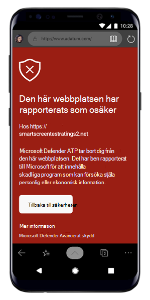

# Felsöka problem med Microsoft Defender för slutpunkt på AndroidTroubleshooting issues on Microsoft Defender for Endpoint on Android

[!INCLUDE [Microsoft 365 Defender rebranding](../../includes/microsoft-defender.md)]

**Gäller för:****Applies to:**
- [Microsoft Defender för EndpointMicrosoft Defender for Endpoint](https://go.microsoft.com/fwlink/p/?linkid=2154037)
- [Microsoft 365 DefenderMicrosoft 365 Defender](https://go.microsoft.com/fwlink/?linkid=2118804)

> Vill du uppleva Microsoft Defender för Slutpunkt?Want to experience Microsoft Defender for Endpoint? [Registrera dig för en kostnadsfri utvärderingsversion.Sign up for a free trial.](https://www.microsoft.com/microsoft-365/windows/microsoft-defender-atp?ocid=docs-wdatp-exposedapis-abovefoldlink) 

Vid registrering av en enhet kan du eventuellt se inloggningsproblem när appen har installerats.When onboarding a device, you might see sign in issues after the app is installed.

Under introduktionen kan du stöta på inloggningsproblem när appen är installerad på din enhet.During onboarding, you might encounter sign in issues after the app is installed on your device.

I den här artikeln finns lösningar på inloggningsproblem.This article provides solutions to help address the sign-on issues.  

## Inloggningen misslyckades – oväntat felSign in failed - unexpected error
**Inloggningen misslyckades:** *Oväntat fel, försök senare***Sign in failed:** *Unexpected error, try later*

**Meddelande:****Message:**

Oväntat fel, försök senareUnexpected error, try later

**Orsak:****Cause:**

Du har en äldre version av appen "Microsoft Authenticator" installerad på enheten.You have an older version of "Microsoft Authenticator" app installed on your device.

**Lösning:****Solution:**

Installera den senaste versionen och [Microsoft Authenticator](https://play.google.com/store/apps/details?androidid=com.azure.authenticator) från Google Play Store och försök igenInstall latest version and of [Microsoft Authenticator](https://play.google.com/store/apps/details?androidid=com.azure.authenticator) from Google Play Store and try again

## Inloggningen misslyckades – ogiltig licensSign in failed - invalid license

**Inloggningen misslyckades:** *Ogiltig licens. Kontakta administratören***Sign in failed:** *Invalid license, please contact administrator*

**Meddelande:** *Ogiltig licens, kontakta administratören***Message:** *Invalid license, please contact administrator*

**Orsak:****Cause:**

Du har inte Microsoft 365 licens kopplad, eller så har organisationen ingen licens för Microsoft 365 Enterprise prenumeration.You do not have Microsoft 365 license assigned, or your organization does not have a license for Microsoft 365 Enterprise subscription.

**Lösning:****Solution:**

Kontakta administratören om du behöver hjälp.Contact your administrator for help.

## Rapportera osäker webbplatsReport unsafe site

Nätfiskewebbplatser utger sig för att vara betrodda webbplatser i syfte att skaffa personlig eller ekonomisk information.Phishing websites impersonate trustworthy websites for the purpose of obtaining your personal or financial information. Gå till [sidan Ge feedback om nätverksskydd](https://www.microsoft.com/wdsi/filesubmission/exploitguard/networkprotection) om du vill rapportera en webbplats som kan vara en nätfiskewebbplats.Visit the [Provide feedback about network protection](https://www.microsoft.com/wdsi/filesubmission/exploitguard/networkprotection) page if you want to report a website that could be a phishing site.

## Nätfiskesidor blockeras inte på vissa OEM-enheterPhishing pages aren't blocked on some OEM devices

**Gäller för:** Endast vissa OEM-maskiner**Applies to:** Specific OEMs only

-   **Xiaomi****Xiaomi**

Nätfiske och skadliga webbhot som upptäcks av Defender för Endpoint för Android blockeras inte på vissa Xiaomi-enheter.Phishing and harmful web threats that are detected by Defender for Endpoint for Android are not blocked on some Xiaomi devices. Följande funktioner fungerar inte på de här enheterna.The following functionality doesn't work on these devices.

**Orsak:****Cause:**

Xiaomi-enheter har en ny behörighetsmodell.Xiaomi devices include a new permission model. Det förhindrar att Defender för Slutpunkt för Android visar popup-fönster medan det körs i bakgrunden.This prevents Defender for Endpoint for Android from displaying pop-up windows while it runs in the background.

Behörighet för Xiaomi-enheter: "Visa popup-fönster när de körs i bakgrunden".Xiaomi devices permission: "Display pop-up windows while running in the background."

**Lösning:****Solution:**

Aktivera den behörighet som krävs på Xiaomi-enheter.Enable the required permission on Xiaomi devices.

- Visa popup-fönster när du körs i bakgrunden.Display pop-up windows while running in the background.
