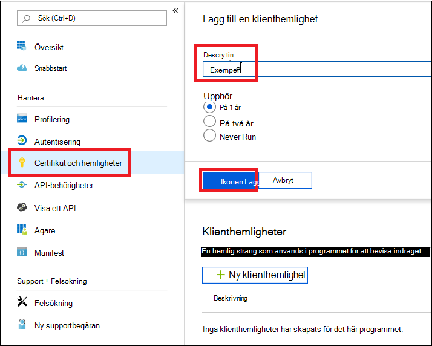

# <a name="microsoft-defender-for-endpoint-api---hello-world"></a><span data-ttu-id="cb03f-104">Microsoft Defender för slutpunkts-API – Hello World</span><span class="sxs-lookup"><span data-stu-id="cb03f-104">Microsoft Defender for Endpoint API - Hello World</span></span>

[!INCLUDE [Microsoft 365 Defender rebranding](../../includes/microsoft-defender.md)]


<span data-ttu-id="cb03f-105">**Gäller för:**</span><span class="sxs-lookup"><span data-stu-id="cb03f-105">**Applies to:**</span></span>
- [<span data-ttu-id="cb03f-106">Microsoft Defender för Endpoint</span><span class="sxs-lookup"><span data-stu-id="cb03f-106">Microsoft Defender for Endpoint</span></span>](https://go.microsoft.com/fwlink/?linkid=2154037)


- <span data-ttu-id="cb03f-107">Vill du uppleva Microsoft Defender för Slutpunkt?</span><span class="sxs-lookup"><span data-stu-id="cb03f-107">Want to experience Microsoft Defender for Endpoint?</span></span> [<span data-ttu-id="cb03f-108">Registrera dig för en kostnadsfri utvärderingsversion.</span><span class="sxs-lookup"><span data-stu-id="cb03f-108">Sign up for a free trial.</span></span>](https://www.microsoft.com/microsoft-365/windows/microsoft-defender-atp?ocid=docs-wdatp-exposedapis-abovefoldlink)

[!include[Microsoft Defender for Endpoint API URIs for US Government](../../includes/microsoft-defender-api-usgov.md)]

[!include[Improve request performance](../../includes/improve-request-performance.md)]


## <a name="get-alerts-using-a-simple-powershell-script"></a><span data-ttu-id="cb03f-109">Få aviseringar med ett enkelt PowerShell-skript</span><span class="sxs-lookup"><span data-stu-id="cb03f-109">Get Alerts using a simple PowerShell script</span></span>

### <a name="how-long-it-takes-to-go-through-this-example"></a><span data-ttu-id="cb03f-110">Hur lång tid tar det att gå igenom det här exemplet?</span><span class="sxs-lookup"><span data-stu-id="cb03f-110">How long it takes to go through this example?</span></span>
<span data-ttu-id="cb03f-111">Det tar bara 5 minuter att göra i två steg:</span><span class="sxs-lookup"><span data-stu-id="cb03f-111">It only takes 5 minutes done in two steps:</span></span>
- <span data-ttu-id="cb03f-112">Appregistrering</span><span class="sxs-lookup"><span data-stu-id="cb03f-112">Application registration</span></span>
- <span data-ttu-id="cb03f-113">Använd exempel: kräver endast kopiera/klistra in ett kort PowerShell-skript</span><span class="sxs-lookup"><span data-stu-id="cb03f-113">Use examples: only requires copy/paste of a short PowerShell script</span></span>

### <a name="do-i-need-a-permission-to-connect"></a><span data-ttu-id="cb03f-114">Behöver jag behörighet för att ansluta?</span><span class="sxs-lookup"><span data-stu-id="cb03f-114">Do I need a permission to connect?</span></span>
<span data-ttu-id="cb03f-115">För steget Registrering av program måste du ha en **global administratörsroll** i Azure Active Directory klientorganisationen (Azure AD).</span><span class="sxs-lookup"><span data-stu-id="cb03f-115">For the Application registration stage, you must have a **Global administrator** role in your Azure Active Directory (Azure AD) tenant.</span></span>

### <a name="step-1---create-an-app-in-azure-active-directory"></a><span data-ttu-id="cb03f-116">Steg 1 – Skapa ett program i Azure Active Directory</span><span class="sxs-lookup"><span data-stu-id="cb03f-116">Step 1 - Create an App in Azure Active Directory</span></span>

1. <span data-ttu-id="cb03f-117">Logga in på [Azure med](https://portal.azure.com) den **globala administratörsanvändaren.**</span><span class="sxs-lookup"><span data-stu-id="cb03f-117">Log on to [Azure](https://portal.azure.com) with your **Global administrator** user.</span></span>

2. <span data-ttu-id="cb03f-118">Gå till **Azure Active Directory**  >  **Appregistreringar**  >  **Ny registrering.**</span><span class="sxs-lookup"><span data-stu-id="cb03f-118">Navigate to **Azure Active Directory** > **App registrations** > **New registration**.</span></span>

   

3. <span data-ttu-id="cb03f-120">I registreringsformuläret väljer du ett namn på din ansökan och klickar sedan på **Registrera**.</span><span class="sxs-lookup"><span data-stu-id="cb03f-120">In the registration form, choose a name for your application and then click **Register**.</span></span>

4. <span data-ttu-id="cb03f-121">Tillåt att ditt program kommer åt Defender för Endpoint och tilldela **behörigheten Läs alla** aviseringar:</span><span class="sxs-lookup"><span data-stu-id="cb03f-121">Allow your Application to access Defender for Endpoint and assign it **'Read all alerts'** permission:</span></span>

   - <span data-ttu-id="cb03f-122">På programsidan klickar du på **API-behörigheter** Lägg till behörighetS-API:er som min organisation använder >  >    >   **WindowsDefenderATP** och klickar på **WindowsDefenderATP.**</span><span class="sxs-lookup"><span data-stu-id="cb03f-122">On your application page, click **API Permissions** > **Add permission** > **APIs my organization uses** > type **WindowsDefenderATP** and click on **WindowsDefenderATP**.</span></span>

   - <span data-ttu-id="cb03f-123">**Obs!** WindowsDefenderATP visas inte i den ursprungliga listan.</span><span class="sxs-lookup"><span data-stu-id="cb03f-123">**Note**: WindowsDefenderATP does not appear in the original list.</span></span> <span data-ttu-id="cb03f-124">Du måste börja skriva namnet i textrutan för att det ska visas.</span><span class="sxs-lookup"><span data-stu-id="cb03f-124">You need to start writing its name in the text box to see it appear.</span></span>

   

   - <span data-ttu-id="cb03f-126">Välj **Avisering om**  >  **programbehörigheter.Read.All >** Klicka på Lägg till **behörigheter**</span><span class="sxs-lookup"><span data-stu-id="cb03f-126">Choose **Application permissions** > **Alert.Read.All** > Click on **Add permissions**</span></span>

   

   <span data-ttu-id="cb03f-128">**Viktigt meddelande:** Du måste välja rätt behörighet.</span><span class="sxs-lookup"><span data-stu-id="cb03f-128">**Important note**: You need to select the relevant permissions.</span></span> <span data-ttu-id="cb03f-129">"Läs alla aviseringar" är bara ett exempel!</span><span class="sxs-lookup"><span data-stu-id="cb03f-129">'Read All Alerts' is only an example!</span></span>

     <span data-ttu-id="cb03f-130">Exempel:</span><span class="sxs-lookup"><span data-stu-id="cb03f-130">For instance,</span></span>

     - <span data-ttu-id="cb03f-131">Om [du vill köra avancerade](run-advanced-query-api.md)frågor väljer du behörigheten Kör avancerade frågor</span><span class="sxs-lookup"><span data-stu-id="cb03f-131">To [run advanced queries](run-advanced-query-api.md), select 'Run advanced queries' permission</span></span>
     - <span data-ttu-id="cb03f-132">Om [du vill isolera en dator](isolate-machine.md)väljer du behörigheten Isolera dator</span><span class="sxs-lookup"><span data-stu-id="cb03f-132">To [isolate a machine](isolate-machine.md), select 'Isolate machine' permission</span></span>
     - <span data-ttu-id="cb03f-133">Ta reda på vilken behörighet du behöver i avsnittet Behörigheter **i** det API du är intresserad av att anropa.</span><span class="sxs-lookup"><span data-stu-id="cb03f-133">To determine which permission you need, please look at the **Permissions** section in the API you are interested to call.</span></span>

5. <span data-ttu-id="cb03f-134">Klicka **på Bevilja medgivande**</span><span class="sxs-lookup"><span data-stu-id="cb03f-134">Click **Grant consent**</span></span>

   - <span data-ttu-id="cb03f-135">**Obs!** Varje gång du lägger till behörighet måste du klicka på **Bevilja medgivande** för att den nya behörigheten ska gälla.</span><span class="sxs-lookup"><span data-stu-id="cb03f-135">**Note**: Every time you add permission you must click on **Grant consent** for the new permission to take effect.</span></span>

   

6. <span data-ttu-id="cb03f-137">Gör programmet hemligt.</span><span class="sxs-lookup"><span data-stu-id="cb03f-137">Add a secret to the application.</span></span>

   - <span data-ttu-id="cb03f-138">Klicka **på Certifikat & ,** lägg till en beskrivning av hemligheten och klicka på Lägg **till**.</span><span class="sxs-lookup"><span data-stu-id="cb03f-138">Click **Certificates & secrets**, add description to the secret and click **Add**.</span></span>

    <span data-ttu-id="cb03f-139">**Viktigt:** Efter att du klickat på Lägg **till kopierar du det genererade hemliga värdet**.</span><span class="sxs-lookup"><span data-stu-id="cb03f-139">**Important**: After click Add, **copy the generated secret value**.</span></span> <span data-ttu-id="cb03f-140">Du kommer inte att kunna hämta igen när du har lämnat!</span><span class="sxs-lookup"><span data-stu-id="cb03f-140">You won't be able to retrieve after you leave!</span></span>

    

7. <span data-ttu-id="cb03f-142">Skriv ned ditt program-ID och ditt klient-ID:</span><span class="sxs-lookup"><span data-stu-id="cb03f-142">Write down your application ID and your tenant ID:</span></span>

   - <span data-ttu-id="cb03f-143">Gå till Översikt på **programsidan och** kopiera följande:</span><span class="sxs-lookup"><span data-stu-id="cb03f-143">On your application page, go to **Overview** and copy the following:</span></span>

   

<span data-ttu-id="cb03f-145">Klart!</span><span class="sxs-lookup"><span data-stu-id="cb03f-145">Done!</span></span> <span data-ttu-id="cb03f-146">Du har registrerat ett program!</span><span class="sxs-lookup"><span data-stu-id="cb03f-146">You have successfully registered an application!</span></span>

### <a name="step-2---get-a-token-using-the-app-and-use-this-token-to-access-the-api"></a><span data-ttu-id="cb03f-147">Steg 2 – Hämta en token med appen och använd denna token för att få åtkomst till API:t.</span><span class="sxs-lookup"><span data-stu-id="cb03f-147">Step 2 - Get a token using the App and use this token to access the API.</span></span>

- <span data-ttu-id="cb03f-148">Kopiera skriptet nedan till PowerShell ISE eller en textredigerare och spara det som "**Get-Token.ps1**"</span><span class="sxs-lookup"><span data-stu-id="cb03f-148">Copy the script below to PowerShell ISE or to a text editor, and save it as "**Get-Token.ps1**"</span></span>
- <span data-ttu-id="cb03f-149">När du kör det här skriptet genereras en token och den sparas i arbetsmappen under namnet "**Latest-token.txt**".</span><span class="sxs-lookup"><span data-stu-id="cb03f-149">Running this script will generate a token and will save it in the working folder under the name "**Latest-token.txt**".</span></span>

   ```powershell
   # That code gets the App Context Token and save it to a file named "Latest-token.txt" under the current directory
   # Paste below your Tenant ID, App ID and App Secret (App key).

   $tenantId = '' ### Paste your tenant ID here
   $appId = '' ### Paste your Application ID here
   $appSecret = '' ### Paste your Application secret here

   $resourceAppIdUri = 'https://api.securitycenter.microsoft.com'
   $oAuthUri = "https://login.microsoftonline.com/$TenantId/oauth2/token"
   $authBody = [Ordered] @{
       resource = "$resourceAppIdUri"
       client_id = "$appId"
       client_secret = "$appSecret"
       grant_type = 'client_credentials'
   }
   $authResponse = Invoke-RestMethod -Method Post -Uri $oAuthUri -Body $authBody -ErrorAction Stop
   $token = $authResponse.access_token
   Out-File -FilePath "./Latest-token.txt" -InputObject $token
   return $token
   ```

- <span data-ttu-id="cb03f-150">Sanity Check:</span><span class="sxs-lookup"><span data-stu-id="cb03f-150">Sanity Check:</span></span>
  - <span data-ttu-id="cb03f-151">Kör skriptet.</span><span class="sxs-lookup"><span data-stu-id="cb03f-151">Run the script.</span></span>
  - <span data-ttu-id="cb03f-152">I webbläsaren går du till: <https://jwt.ms/></span><span class="sxs-lookup"><span data-stu-id="cb03f-152">In your browser go to: <https://jwt.ms/></span></span>
  - <span data-ttu-id="cb03f-153">Kopiera tokenet (innehållet i Latest-token.txt filen).</span><span class="sxs-lookup"><span data-stu-id="cb03f-153">Copy the token (the content of the Latest-token.txt file).</span></span>
  - <span data-ttu-id="cb03f-154">Klistra in i den övre rutan.</span><span class="sxs-lookup"><span data-stu-id="cb03f-154">Paste in the top box.</span></span>
  - <span data-ttu-id="cb03f-155">Titta efter avsnittet "roller".</span><span class="sxs-lookup"><span data-stu-id="cb03f-155">Look for the "roles" section.</span></span> <span data-ttu-id="cb03f-156">Leta reda på rollen Avisering.Läs.Alla.</span><span class="sxs-lookup"><span data-stu-id="cb03f-156">Find the Alert.Read.All role.</span></span>

  

### <a name="lets-get-the-alerts"></a><span data-ttu-id="cb03f-158">Låt oss få aviseringarna!</span><span class="sxs-lookup"><span data-stu-id="cb03f-158">Lets get the Alerts!</span></span>

- <span data-ttu-id="cb03f-159">Skriptet nedan använder en **Get-Token.ps1** för att få åtkomst till API:et och får aviseringar under de senaste 48 timmarna.</span><span class="sxs-lookup"><span data-stu-id="cb03f-159">The script below will use **Get-Token.ps1** to access the API and will get the past 48 hours Alerts.</span></span>
- <span data-ttu-id="cb03f-160">Spara skriptet i samma mapp som du sparade föregående skript i **Get-Token.ps1**.</span><span class="sxs-lookup"><span data-stu-id="cb03f-160">Save this script in the same folder you saved the previous script **Get-Token.ps1**.</span></span>
- <span data-ttu-id="cb03f-161">Skriptet skapar två filer (json och CSV) med data i samma mapp som skripten.</span><span class="sxs-lookup"><span data-stu-id="cb03f-161">The script creates two files (json and csv) with the data in the same folder as the scripts.</span></span>

  ```powershell
  # Returns Alerts created in the past 48 hours.

  $token = ./Get-Token.ps1       #run the script Get-Token.ps1  - make sure you are running this script from the same folder of Get-Token.ps1

  # Get Alert from the last 48 hours. Make sure you have alerts in that time frame.
  $dateTime = (Get-Date).ToUniversalTime().AddHours(-48).ToString("o")

  # The URL contains the type of query and the time filter we create above
  # Read more about other query options and filters at   Https://TBD- add the documentation link
  $url = "https://api.securitycenter.microsoft.com/api/alerts?`$filter=alertCreationTime ge $dateTime"

  # Set the WebRequest headers
  $headers = @{
      'Content-Type' = 'application/json'
      Accept = 'application/json'
      Authorization = "Bearer $token"
  }

  # Send the webrequest and get the results.
  $response = Invoke-WebRequest -Method Get -Uri $url -Headers $headers -ErrorAction Stop

  # Extract the alerts from the results.
  $alerts =  ($response | ConvertFrom-Json).value | ConvertTo-Json

  # Get string with the execution time. We concatenate that string to the output file to avoid overwrite the file
  $dateTimeForFileName = Get-Date -Format o | foreach {$_ -replace ":", "."}

  # Save the result as json and as csv
  $outputJsonPath = "./Latest Alerts $dateTimeForFileName.json"
  $outputCsvPath = "./Latest Alerts $dateTimeForFileName.csv"

  Out-File -FilePath $outputJsonPath -InputObject $alerts
  ($alerts | ConvertFrom-Json) | Export-CSV $outputCsvPath -NoTypeInformation
  ```

<span data-ttu-id="cb03f-162">Nu är allt klart!</span><span class="sxs-lookup"><span data-stu-id="cb03f-162">You're all done!</span></span> <span data-ttu-id="cb03f-163">Du har just lyckats:</span><span class="sxs-lookup"><span data-stu-id="cb03f-163">You have just successfully:</span></span>

- <span data-ttu-id="cb03f-164">Skapad och registrerad och program</span><span class="sxs-lookup"><span data-stu-id="cb03f-164">Created and registered and application</span></span>
- <span data-ttu-id="cb03f-165">Beviljad behörighet för det programmet att läsa aviseringar</span><span class="sxs-lookup"><span data-stu-id="cb03f-165">Granted permission for that application to read alerts</span></span>
- <span data-ttu-id="cb03f-166">Anslöt API:t</span><span class="sxs-lookup"><span data-stu-id="cb03f-166">Connected the API</span></span>
- <span data-ttu-id="cb03f-167">Använde ett PowerShell-skript för att returnera aviseringar som skapats de senaste 48 timmarna</span><span class="sxs-lookup"><span data-stu-id="cb03f-167">Used a PowerShell script to return alerts created in the past 48 hours</span></span>

## <a name="related-topic"></a><span data-ttu-id="cb03f-168">Relaterat ämne</span><span class="sxs-lookup"><span data-stu-id="cb03f-168">Related topic</span></span>

- [<span data-ttu-id="cb03f-169">Microsoft Defender för slutpunkts-API:er</span><span class="sxs-lookup"><span data-stu-id="cb03f-169">Microsoft Defender for Endpoint APIs</span></span>](exposed-apis-list.md)
- [<span data-ttu-id="cb03f-170">Access Microsoft Defender för slutpunkt med programkontext</span><span class="sxs-lookup"><span data-stu-id="cb03f-170">Access Microsoft Defender for Endpoint with application context</span></span>](exposed-apis-create-app-webapp.md)
- [<span data-ttu-id="cb03f-171">Använda Microsoft Defender för slutpunkt med användarkontext</span><span class="sxs-lookup"><span data-stu-id="cb03f-171">Access Microsoft Defender for Endpoint with user context</span></span>](exposed-apis-create-app-nativeapp.md)
