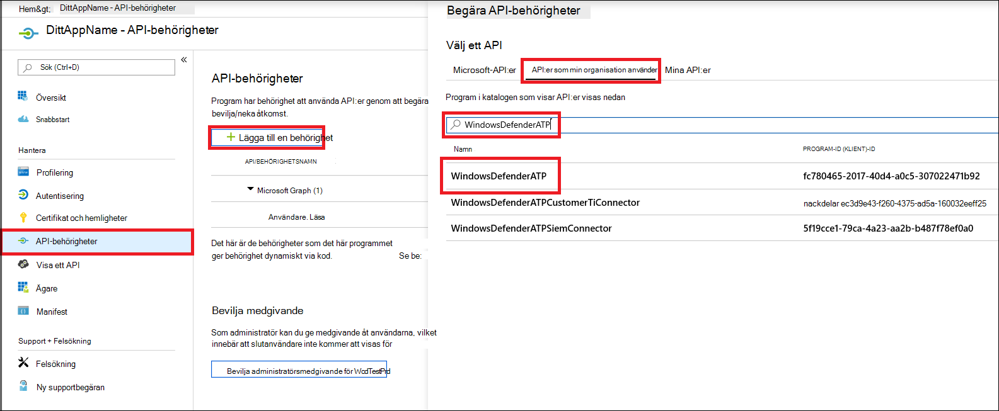

# <a name="microsoft-defender-for-endpoint-api---hello-world"></a>Microsoft Defender för slutpunkts-API – Hello World 

[!INCLUDE [Microsoft 365 Defender rebranding](../../includes/microsoft-defender.md)]


**Gäller för:** 
- [Microsoft Defender för Endpoint](https://go.microsoft.com/fwlink/?linkid=2154037)


- Vill du uppleva Microsoft Defender för Slutpunkt? [Registrera dig för en kostnadsfri utvärderingsversion.](https://www.microsoft.com/microsoft-365/windows/microsoft-defender-atp?ocid=docs-wdatp-exposedapis-abovefoldlink) 

[!include[Microsoft Defender for Endpoint API URIs for US Government](../../includes/microsoft-defender-api-usgov.md)]

[!include[Improve request performance](../../includes/improve-request-performance.md)]


## <a name="get-alerts-using-a-simple-powershell-script"></a>Få aviseringar med ett enkelt PowerShell-skript

### <a name="how-long-it-takes-to-go-through-this-example"></a>Hur lång tid tar det att gå igenom det här exemplet?
Det tar bara 5 minuter att göra i två steg:
- Appregistrering
- Använd exempel: kräver endast kopiera/klistra in ett kort PowerShell-skript

### <a name="do-i-need-a-permission-to-connect"></a>Behöver jag behörighet för att ansluta?
För registreringssteget för program måste du ha en **global administratörsroll** i Azure Active Directory-klienten (Azure AD).

### <a name="step-1---create-an-app-in-azure-active-directory"></a>Steg 1 - Skapa en app i Azure Active Directory

1. Logga in på [Azure med](https://portal.azure.com) den **globala administratörsanvändaren.**

2. Gå till **Azure Active Directory-appregistreringar**  >    >  **Ny registrering.** 

   

3. I registreringsformuläret väljer du ett namn på din ansökan och klickar sedan på **Registrera**.

4. Tillåt att ditt program kommer åt Defender för Endpoint och tilldela **behörigheten Läs alla** aviseringar:

   - På programsidan klickar du på **API-behörigheter** Lägg till behörighetS-API:er som min organisation använder >  >    >   **WindowsDefenderATP** och klickar på **WindowsDefenderATP.**

   - **Obs!** WindowsDefenderATP visas inte i den ursprungliga listan. Du måste börja skriva namnet i textrutan för att det ska visas.

   

   - Välj **Avisering om**  >  **programbehörigheter.Read.All >** Klicka på Lägg till **behörigheter**

   

   **Viktigt meddelande:** Du måste välja rätt behörighet. "Läs alla aviseringar" är bara ett exempel!

     Exempel:

     - Om [du vill köra avancerade](run-advanced-query-api.md)frågor väljer du behörigheten Kör avancerade frågor
     - Om [du vill isolera en dator](isolate-machine.md)väljer du behörigheten Isolera dator
     - Ta reda på vilken behörighet du behöver i avsnittet Behörigheter **i** det API du är intresserad av att anropa.

5. Klicka **på Bevilja medgivande**

    - **Obs!** Varje gång du lägger till behörighet måste du klicka på **Bevilja medgivande** för att den nya behörigheten ska gälla.

    

6. Gör programmet hemligt.

    - Klicka **på Certifikat & ,** lägg till en beskrivning av hemligheten och klicka på Lägg **till**.

    **Viktigt:** Efter att du klickat på Lägg **till kopierar du det genererade hemliga värdet**. Du kommer inte att kunna hämta igen när du har lämnat!

    

7. Skriv ned ditt program-ID och ditt klient-ID:

   - Gå till Översikt på **programsidan och** kopiera följande:

   


Klart! Du har registrerat ett program!

### <a name="step-2---get-a-token-using-the-app-and-use-this-token-to-access-the-api"></a>Steg 2 – Hämta en token med appen och använd denna token för att få åtkomst till API:t.

-   Kopiera skriptet nedan till PowerShell ISE eller en textredigerare och spara det som "**Get-Token.ps1**"
-   När du kör det här skriptet genereras en token och den sparas i arbetsmappen under namnet "**Latest-token.txt**".

```
# That code gets the App Context Token and save it to a file named "Latest-token.txt" under the current directory
# Paste below your Tenant ID, App ID and App Secret (App key).

$tenantId = '' ### Paste your tenant ID here
$appId = '' ### Paste your Application ID here
$appSecret = '' ### Paste your Application secret here

$resourceAppIdUri = 'https://api.securitycenter.microsoft.com'
$oAuthUri = "https://login.microsoftonline.com/$TenantId/oauth2/token"
$authBody = [Ordered] @{
    resource = "$resourceAppIdUri"
    client_id = "$appId"
    client_secret = "$appSecret"
    grant_type = 'client_credentials'
}
$authResponse = Invoke-RestMethod -Method Post -Uri $oAuthUri -Body $authBody -ErrorAction Stop
$token = $authResponse.access_token
Out-File -FilePath "./Latest-token.txt" -InputObject $token
return $token
```

-   Sanity Check:<br>
Kör skriptet.<br>
I webbläsaren går du till: https://jwt.ms/ <br>
Kopiera tokenet (innehållet i Latest-token.txt filen).<br>
Klistra in i den övre rutan.<br>
Titta efter avsnittet "roller". Leta reda på rollen Avisering.Läs.Alla.


### <a name="lets-get-the-alerts"></a>Låt oss få aviseringarna!

-   Skriptet nedan använder en **Get-Token.ps1** för att få åtkomst till API:et och får aviseringar under de senaste 48 timmarna.
-   Spara skriptet i samma mapp som du sparade föregående skript i **Get-Token.ps1**. 
-   Skriptet skapar två filer (json och CSV) med data i samma mapp som skripten.

```
# Returns Alerts created in the past 48 hours.

$token = ./Get-Token.ps1       #run the script Get-Token.ps1  - make sure you are running this script from the same folder of Get-Token.ps1

# Get Alert from the last 48 hours. Make sure you have alerts in that time frame.
$dateTime = (Get-Date).ToUniversalTime().AddHours(-48).ToString("o")       

# The URL contains the type of query and the time filter we create above
# Read more about other query options and filters at   Https://TBD- add the documentation link
$url = "https://api.securitycenter.microsoft.com/api/alerts?`$filter=alertCreationTime ge $dateTime"

# Set the WebRequest headers
$headers = @{ 
    'Content-Type' = 'application/json'
    Accept = 'application/json'
    Authorization = "Bearer $token" 
}

# Send the webrequest and get the results. 
$response = Invoke-WebRequest -Method Get -Uri $url -Headers $headers -ErrorAction Stop

# Extract the alerts from the results. 
$alerts =  ($response | ConvertFrom-Json).value | ConvertTo-Json

# Get string with the execution time. We concatenate that string to the output file to avoid overwrite the file
$dateTimeForFileName = Get-Date -Format o | foreach {$_ -replace ":", "."}    

# Save the result as json and as csv
$outputJsonPath = "./Latest Alerts $dateTimeForFileName.json"     
$outputCsvPath = "./Latest Alerts $dateTimeForFileName.csv"

Out-File -FilePath $outputJsonPath -InputObject $alerts
($alerts | ConvertFrom-Json) | Export-CSV $outputCsvPath -NoTypeInformation 
```

Nu är allt klart! Du har just lyckats:
-   Skapad och registrerad och program
-   Beviljad behörighet för det programmet att läsa aviseringar
-   Anslöt API:t
-   Använde ett PowerShell-skript för att returnera aviseringar som skapats de senaste 48 timmarna


## <a name="related-topic"></a>Relaterat ämne
- [Microsoft Defender för slutpunkts-API:er](exposed-apis-list.md)
- [Access Microsoft Defender för slutpunkt med programkontext](exposed-apis-create-app-webapp.md)
- [Använda Microsoft Defender för slutpunkt med användarkontext](exposed-apis-create-app-nativeapp.md)
