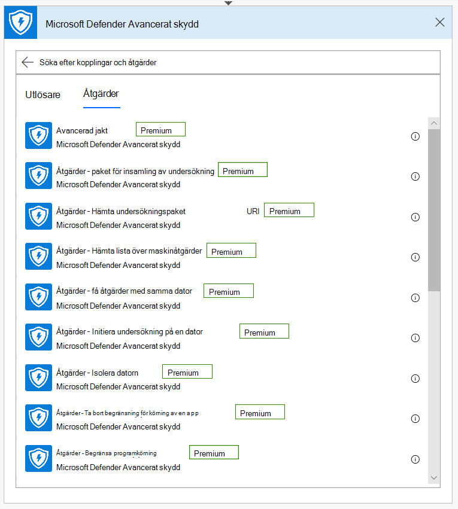
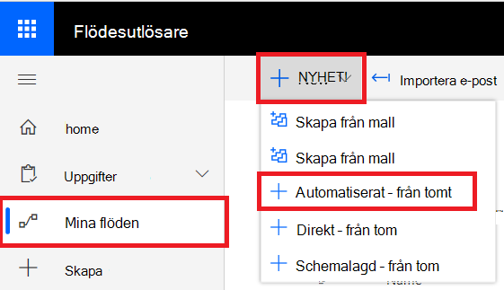

# Microsoft Power Automate (tidigare Microsoft Flow) och Azure-funktioner

[!INCLUDE [Microsoft 365 Defender rebranding](../../includes/microsoft-defender.md)]

**Gäller för:**
- [Microsoft Defender för Endpoint](https://go.microsoft.com/fwlink/p/?linkid=2154037)
- [Microsoft 365 Defender](https://go.microsoft.com/fwlink/?linkid=2118804)

- Vill du uppleva Microsoft Defender för Slutpunkt? [Registrera dig för en kostnadsfri utvärderingsversion.](https://www.microsoft.com/microsoft-365/windows/microsoft-defender-atp?ocid=docs-wdatp-exposedapis-abovefoldlink) 

Att automatisera säkerhetsprocedurer är ett standardkrav för alla moderna säkerhetsoperationscenter. Brist på professionella cyberbrott tvingar SOC att arbeta på det mest effektiva sättet och automatisering är ett måste. Microsoft Power Automate har stöd för olika kopplingar som skapats exakt för detta. Du kan skapa en end-to-end-procedurautomatisering inom några minuter.

Microsoft Defender API har en officiell Flow Connector med många funktioner.

> [!NOTE]
> Mer information om licenskrav för Premium Connectors finns i [Licensiering för premium-anslutningappar.](https://docs.microsoft.com/power-automate/triggers-introduction#licensing-for-premium-connectors)

## Användningsexempel

I följande exempel visas hur du skapar ett flöde som utlöses när en ny avisering inträffar för din klientorganisation.

1. Logga in på [Microsoft Power Automate](https://flow.microsoft.com).

2. Gå till **My flows**  >  **New**  >  **Automated-from blank**.

    

3. Välj ett namn för ditt Flow, sök efter "Microsoft Defender ATP-utlösare" som utlösare och välj sedan den nya aviseringsutlösaren.

    

Nu har du ett Flöde som utlöses varje gång en ny avisering inträffar.

Allt du behöver göra nu är att välja nästa steg.
Du kan till exempel isolera enheten om aviseringens allvarlighetsgrad är Hög och skicka ett e-postmeddelande om den.
Aviseringsutlösaren anger endast aviserings-ID och maskin-ID. Du kan använda kopplingen för att expandera dessa enheter.

### Hämta aviseringsentitet med hjälp av kopplingen

1. Välj **Microsoft Defender ATP** för det nya steget.

2. Välj **Aviseringar – Få API för enkel avisering.**

3. Ställ in **aviserings-ID** från det sista steget som **indata**.

    

### Isolera enheten om aviseringens allvarlighetsgrad är hög

1. Lägg **till** villkor som ett nytt steg.

2. Kontrollera om allvarlighetsgraden för avisering **är lika med** Hög.

   Om ja lägger du till **åtgärden Microsoft Defender ATP - Isolera** maskin med maskin-ID och en kommentar.

    

3. Lägg till ett nytt steg för att skicka e-post om aviseringen och isoleringen. Det finns flera e-postanslutningar som är mycket enkla att använda, till exempel Outlook eller Gmail.

4. Spara flödet.

Du kan också skapa ett **schemalagt** flöde som kör Avancerad sökning och mycket mer!

## Relaterade ämnen
- [Microsoft Defender för slutpunkts-API:er](apis-intro.md)
