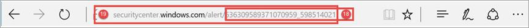

# API-fält för identifiering av slutpunkter i Microsoft Defender

[!INCLUDE [Microsoft 365 Defender rebranding](../../includes/microsoft-defender.md)]

**Gäller för:**
- [Microsoft Defender för Endpoint](https://go.microsoft.com/fwlink/p/?linkid=2154037)
- [Microsoft 365 Defender](https://go.microsoft.com/fwlink/?linkid=2118804)

>Vill du använda Defender för Slutpunkt? [Registrera dig för en kostnadsfri utvärderingsversion.](https://www.microsoft.com/microsoft-365/windows/microsoft-defender-atp?ocid=docs-wdatp-apiportalmapping-abovefoldlink)

Förstå vilka datafält som visas som en del av identifierings-API:t och hur de mappas till Microsoft Defender Säkerhetscenter.

>[!Note]
>- [Defender för Slutpunktsavisering](alerts.md) består av en eller flera identifieringar.
>- **Microsoft Defender ATP Detection** består av den misstänkta händelsen som inträffade på enheten och tillhörande **aviseringsinformation.**
>- Microsoft Defender för slutpunktsaviserings-API är det senaste API:t för aviseringsanvändning och innehåller en detaljerad lista med relaterade bevis för varje avisering. Mer information finns i [Aviseringsmetoder och egenskaper](alerts.md) och [Listaviseringar.](get-alerts.md)

## Identifiering av API-fält och portalmappning
I följande tabell visas de tillgängliga fält som exponeras i identifieringarna av API-nyttolast. Den visar exempel på de ifyllda värdena och en referens på hur data visas i portalen.

Fältkolumnen ArcSight innehåller standardmappningen mellan Defender för Slutpunkt-fälten och de inbyggda fälten i ArcSight. Du kan ladda ned mappningsfilen från portalen när du aktiverar integrationsfunktionen SIEM och du kan ändra den så att den matchar organisationens behov. Mer information finns i Aktivera [SIEM-integrering i Defender för slutpunkt.](enable-siem-integration.md)

Fältnummer motsvarar talen i bilderna nedan.

> [!div class="mx-tableFixed"]
> 
> | Portaletikett   | SIEM-fältnamn           | Fältet ArcSight      | Exempelvärde                                                                      | Beskrivning                                                                                                                                                                    |
> |------------------|---------------------------|---------------------|------------------------------------------------------------------------------------|--------------------------------------------------------------------------------------------------------------------------------------------------------------------------------|
> | 1                | AlertTitle                | Namn                | Microsoft Defender AV upptäckte "Mikatz" skadlig programvara med hög allvarlighetsgrad | Tillgängligt värde för varje identifiering.                                                                                                                                               |
> | 2                | Allvarlighetsgrad                  | deviceSeverity      | Högsta                                                                             | Tillgängligt värde för varje identifiering.                                                                                                                                               |
> | 3                | Kategori                  | deviceEventCategory | Skadlig programvara                                                               | Tillgängligt värde för varje identifiering.                                                                                                                                               |
> | 4                | Identifieringskälla                    | sourceServiceName   | Antivirus                                                                 | Microsoft Defender Antivirus eller Defender för Slutpunkt. Tillgängligt värde för varje identifiering.                                                                                         |
> | 5                | Maskinnamn               | sourceHostName      | desktop-4a5ngd6                                                                           | Tillgängligt värde för varje identifiering.                                                                                                                                               |
> | 6                | Filnamn                  | fileName            | Robocopy.exe                                                                       | Tillgängligt för identifieringar som är associerade med en fil eller process.                                                                                                                      |
> | 7                | FilePath                  | filePath            | C:\Windows\System32\Robocopy.exe                                                   | Tillgängligt för identifieringar som är associerade med en fil eller process.                                                                                                                     |
> | 8                | UserDomain                | sourceNtDomain      | CONTOSO                                                                            | Domänen för användarkontexten som kör aktiviteten, tillgänglig för Defender för slutpunktsbeteendebaserade identifieringar.                                                           |
> | 9                | UserName                  | sourceUserName      | procent.bean                                                                           | Användarkontexten som kör aktiviteten, tillgänglig för Defender för slutpunktsbeteendebaserade identifieringar.                                                                           |
> | 10               | Sha1                      | fileHash            | 3da065e07b990034e9db7842167f70b63aa5329                                           | Tillgängligt för identifieringar som är associerade med en fil eller process.                                                                                                                      |
> | 11               | Sha256                    | deviceCustomString6 | ebf54f745dc81e1958f75e4ca91dd0ab989fc9787bb6b0bf993e2f5                   | Tillgängligt för avkänningar av Microsoft Defender.                                                                                                                                    |
> | 12               | Md5                       | deviceCustomString5 | db979c04a99b96d370988325bb5a8b21                                                   | Tillgängligt för avkänningar av Microsoft Defender.                                                                                                                                    |
> | 13               | ThreatName                | deviceCustomString1  | HackTool:Win32/Mikatz!automation                                                         | Tillgängligt för avkänningar av Microsoft Defender.                                                                                                                                    |
> | 14               | IpAddress                 | sourceAddress       | 218.90.204.141                                                                     | Tillgängligt för identifieringar som är kopplade till nätverkshändelser. Till exempel "Kommunikation till en skadlig nätverksdestination".                                                        |
> | 15               | URL                       | requestUrl          | down.esales360.cn                                                                  | Tillgängligt för identifieringar som är kopplade till nätverkshändelser. Till exempel "Kommunikation till en skadlig nätverksdestination".                                                         |
> | 16               | RemediationIsSuccess      | deviceCustomNumber2 | TRUE                                                                               | Tillgängligt för avkänningar av Microsoft Defender. ArcUsight-värde är 1 när SANT och 0 när det är FALSKT.                                                                                    |
> | 17               | WasExecutingWhileDetected | deviceCustomNumber1 | FALSE                                                                              | Tillgängligt för avkänningar av Microsoft Defender. ArcUsight-värde är 1 när SANT och 0 när det är FALSKT.                                                                                    |
> | 18               | AlertId                   | externalId          | 636210704265059241_673569822                                                       | Tillgängligt värde för varje identifiering.                                                                                                                                               |
> | 19               | LinkToWDATP               | flexString1         | `https://securitycenter.windows.com/alert/636210704265059241_673569822`            | Tillgängligt värde för varje identifiering.                                                                                                                                               |
> | 20               | AlertTime                 | deviceReceiptTime   | 2017-05-07T01:56:59.3191352Z                                                       | Tidpunkten då händelsen inträffade. Tillgängligt värde för varje identifiering.                                                                                       |
> | 21               | MachineDomain             | sourceDnsDomain     | contoso.com                                                                        | Domännamnet är inte relevant för AAD-anslutna enheter. Tillgängligt värde för varje identifiering.                                                                                           |
> | 22               | Aktör                     | deviceCustomString4 | BORON                                                                                   | Tillgängligt för aviseringar relaterade till en känd aktörsgrupp.                                                                                                                         |
> | 21+5             | ComputerDnsName           | Ingen mappning          | liz-bean.contoso.com                                                               | Det fullständigt kvalificerade domännamnet för enheten. Tillgängligt värde för varje identifiering.                                                                                                    |
> |                  | LogOnUsers                | sourceUserId        | contoso\smtp-bean;   contoso\smtp-hardee                                             | Domän och användare av de interaktiva inloggningsanvändarna vid tidpunkten för händelsen. Obs! För enheter med Windows 10 version 1607 är domäninformationen inte tillgänglig. |
> |                  | InternalIPv4List          | Ingen mappning          | 192.168.1.7, 10.1.14.1                                                             | Lista över interna IPV4-IP:er för aktiva nätverksgränssnitt.                                                                                                                                                                               |
> |                  | InternalIPv6List          | Ingen mappning          | fd30:0000:0000:0001:ff4e:003e:0009:000e, FE80:CD00:0000:0CDE:1257:0000:211E:729C | Lista över interna IPV6-IP:er för aktiva nätverksgränssnitt.                                                                                                                                                                               |
| | LinkToMTP | Ingen mappning | `https://security.microsoft.com/alert/da637370718981685665_16349121` | Tillgängligt värde för varje identifiering.
| | IncidentLinkToMTP | Ingen mappning | `"https://security.microsoft.com/incidents/byalert?alertId=da637370718981685665_16349121&source=SIEM` | Tillgängligt värde för varje identifiering.
| | IncidentLinkToWDATP | Ingen mappning | `https://securitycenter.windows.com/incidents/byalert?alertId=da637370718981685665_16349121&source=SIEM` | Tillgängligt värde för varje identifiering.
> | Internt fält | LastProcessedTimeUtc      | Ingen mappning          | 2017-05-07T01:56:58.9936648Z                                                       | Tidpunkt när händelsen kom till backend. Det här fältet kan användas när du anger parametern för begäran under det intervall som identifieringar ska hämtas.                         |
> |                  | Inte en del av schemat    | deviceVendor        |                                                                                    | Statiskt värde i arcusight-mappningen – "Microsoft".                                                                                                                          |
> |                  | Inte en del av schemat    | deviceProduct       |                                                                                    | Statiskt värde i ArcSight-mappningen – "Microsoft Defender ATP".                                                                                                               |
> |                  | Inte en del av schemat    | deviceVersion       |                                                                                    | Statiskt värde i ArcSight-mappningen – '2,0', som används för att identifiera mappningsversionerna.                                                                                         

## Relaterade ämnen
- [Aktivera SIEM-integrering i Microsoft Defender för Slutpunkt](enable-siem-integration.md)
- [Konfigurera ArcSight för att hämta Microsoft Defender för identifiering av slutpunkter](configure-arcsight.md)
- [Hämta Microsoft Defender för slutpunktsidentifiering med REST API](pull-alerts-using-rest-api.md)
- [Felsöka problem med SIEM-verktygsintegrering](troubleshoot-siem.md)
