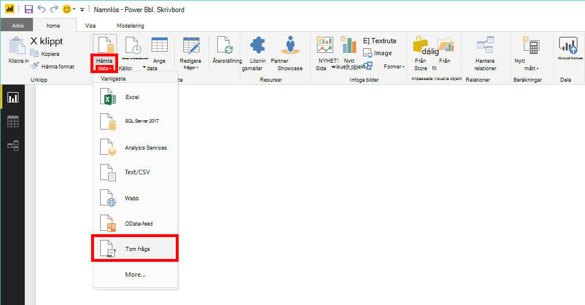
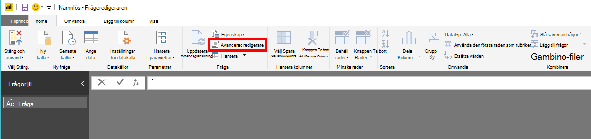
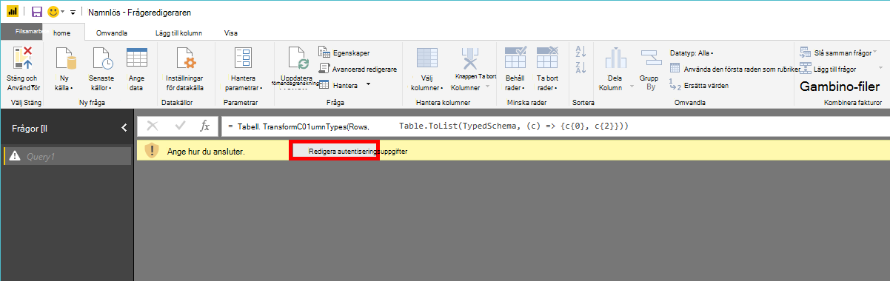
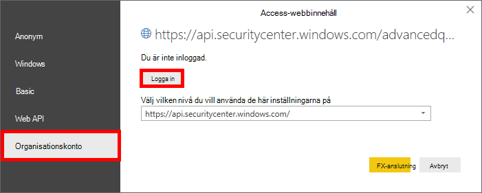
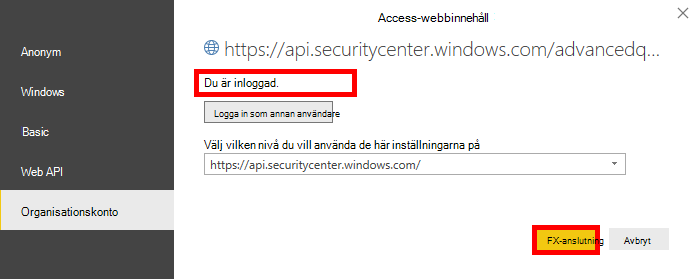

# <a name="create-custom-reports-using-power-bi"></a>Skapa anpassade rapporter med Power BI

[!INCLUDE [Microsoft 365 Defender rebranding](../../includes/microsoft-defender.md)]

**Gäller för:**
- [Microsoft Defender för Endpoint](https://go.microsoft.com/fwlink/p/?linkid=2154037)
- [Microsoft 365 Defender](https://go.microsoft.com/fwlink/?linkid=2118804)


- Vill du uppleva Microsoft Defender för Slutpunkt? [Registrera dig för en kostnadsfri utvärderingsversion.](https://www.microsoft.com/microsoft-365/windows/microsoft-defender-atp?ocid=docs-wdatp-exposedapis-abovefoldlink) 

[!include[Microsoft Defender for Endpoint API URIs for US Government](../../includes/microsoft-defender-api-usgov.md)]

[!include[Improve request performance](../../includes/improve-request-performance.md)]

I det här avsnittet får du lära dig att skapa en Power BI-rapport ovanpå Defender för slutpunkts-API:er.

I det första exemplet visas hur du ansluter Power BI till Advanced Hunting API och det andra exemplet visar en anslutning till våra OData-API:er, till exempel Datoråtgärder eller Varningar.

## <a name="connect-power-bi-to-advanced-hunting-api"></a>Anslut Power BI till API för avancerad sökning

- Öppna Microsoft Power BI

- Klicka **på Hämta data** tom  >  **fråga**

    

- Klicka på **Avancerad redigerare**

    

- Kopiera nedan och klistra in den i redigeraren:

```
    let 
        AdvancedHuntingQuery = "DeviceEvents | where ActionType contains 'Anti' | limit 20",

        HuntingUrl = "https://api.securitycenter.microsoft.com/api/advancedqueries",

        Response = Json.Document(Web.Contents(HuntingUrl, [Query=[key=AdvancedHuntingQuery]])),

        TypeMap = #table(
            { "Type", "PowerBiType" },
            {
                { "Double",   Double.Type },
                { "Int64",    Int64.Type },
                { "Int32",    Int32.Type },
                { "Int16",    Int16.Type },
                { "UInt64",   Number.Type },
                { "UInt32",   Number.Type },
                { "UInt16",   Number.Type },
                { "Byte",     Byte.Type },
                { "Single",   Single.Type },
                { "Decimal",  Decimal.Type },
                { "TimeSpan", Duration.Type },
                { "DateTime", DateTimeZone.Type },
                { "String",   Text.Type },
                { "Boolean",  Logical.Type },
                { "SByte",    Logical.Type },
                { "Guid",     Text.Type }
            }),

        Schema = Table.FromRecords(Response[Schema]),
        TypedSchema = Table.Join(Table.SelectColumns(Schema, {"Name", "Type"}), {"Type"}, TypeMap , {"Type"}),
        Results = Response[Results],
        Rows = Table.FromRecords(Results, Schema[Name]),
        Table = Table.TransformColumnTypes(Rows, Table.ToList(TypedSchema, (c) => {c{0}, c{2}}))

    in Table

```

- Klicka **på Klar**

- Klicka **på Redigera autentiseringsuppgifter**

    

- Välj **Organisationskonto**  >  **Logga in**

    

- Ange dina autentiseringsuppgifter och vänta med att vara inloggad

- Klicka **på Anslut**

    

- Resultatet av frågan visas nu som en tabell och du kan börja skapa visualiseringar ovanpå den!

- Du kan duplicera den här tabellen, byta namn på den och redigera frågan Avancerad sökning inuti så att du får de data du vill ha.

## <a name="connect-power-bi-to-odata-apis"></a>Ansluta Power BI till OData-API:er

- Den enda skillnaden från exemplet ovan är frågan i redigeraren. 

- Kopiera nedan och klistra in den i redigeraren för att hämta alla **datoråtgärder** från organisationen:

```
    let

        Query = "MachineActions",

        Source = OData.Feed("https://api.securitycenter.microsoft.com/api/" & Query, null, [Implementation="2.0", MoreColumns=true])
    in
        Source

```

- Du kan göra samma sak för **Aviseringar** och **Maskiner.**

- Du kan också använda OData-frågor för frågefilter. Mer information finns i [Använda OData-frågor](exposed-apis-odata-samples.md)


## <a name="power-bi-dashboard-samples-in-github"></a>Exempel på Power BI-instrumentpanel i GitHub
Mer information finns i Power [BI-rapportmallar.](https://github.com/microsoft/MicrosoftDefenderATP-PowerBI)

## <a name="sample-reports"></a>Exempelrapporter
Visa exempel på Microsoft Defender ATP Power BI-rapporter. Mer information finns i Bläddra [i kodexempel](https://docs.microsoft.com/samples/browse/?products=mdatp).


## <a name="related-topic"></a>Relaterade ämnen
- [Defender för slutpunkts-API:er](apis-intro.md)
- [Advanced jakt-API](run-advanced-query-api.md)
- [Använda OData-frågor](exposed-apis-odata-samples.md)
