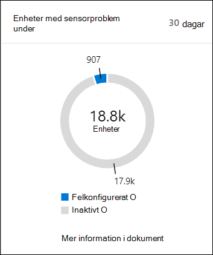
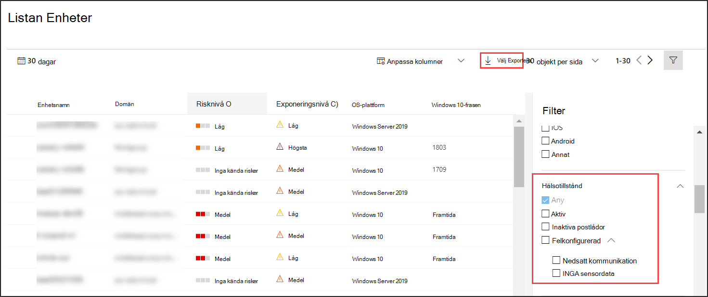

# Kontrollera sensorhälsan i Microsoft Defender för EndpointCheck sensor health state in Microsoft Defender for Endpoint

[!INCLUDE [Microsoft 365 Defender rebranding](../../includes/microsoft-defender.md)]

**Gäller för:****Applies to:**
- [Microsoft Defender för EndpointMicrosoft Defender for Endpoint](https://go.microsoft.com/fwlink/p/?linkid=2154037)
- [Microsoft 365 DefenderMicrosoft 365 Defender](https://go.microsoft.com/fwlink/?linkid=2118804)

>Vill du använda Defender för Slutpunkt?Want to experience Defender for Endpoint? [Registrera dig för en kostnadsfri utvärderingsversion.Sign up for a free trial.](https://www.microsoft.com/microsoft-365/windows/microsoft-defender-atp?ocid=docs-wdatp-checksensor-abovefoldlink)

Panelen **Enheter med sensorproblem** finns på instrumentpanelen Säkerhetsåtgärder.The **Devices with sensor issues** tile is found on the Security Operations dashboard. Den här panelen ger information om den enskilda enhetens möjlighet att tillhandahålla sensordata och kommunicera med Defender för slutpunkt-tjänsten.This tile provides information on the individual device’s ability to provide sensor data and communicate with the Defender for Endpoint service. Den rapporterar hur många enheter som kräver uppmärksamhet och hjälper dig att identifiera problematiska enheter och vidta åtgärder för att korrigera kända problem.It reports how many devices require attention and helps you identify problematic devices and take action to correct known issues.

Det finns två statusindikatorer på panelen som tillhandahåller information om antalet enheter som inte rapporterar korrekt till tjänsten:There are two status indicators on the tile that provide information on the number of devices that are not reporting properly to the service:
- **Felkonfigurerad** – De här enheterna kan delvis rapportera sensordata till Defender för Slutpunkt-tjänsten och kan ha konfigurationsfel som behöver korrigeras.**Misconfigured** - These devices might partially be reporting sensor data to the Defender for Endpoint service and might have configuration errors that need to be corrected.
- **Inaktiva** – Enheter som har slutat rapportera till Defender för slutpunktstjänsten under mer än sju dagar den senaste månaden.**Inactive** - Devices that have stopped reporting to the Defender for Endpoint service for more than seven days in the past month.

Om du klickar på någon av grupperna dirigeras du **till listan Enheter**, filtrerad efter ditt val.Clicking any of the groups directs you to **Devices list**, filtered according to your choice.

I **listan Enheter** kan du filtrera hälsostatuslistan efter följande status:On **Devices list**, you can filter the health state list by the following status:
- **Aktiv** – Enheter som aktivt rapporterar till Defender för slutpunktstjänsten.**Active** - Devices that are actively reporting to the Defender for Endpoint service.
- **Felkonfigurerad** – De här enheterna kan delvis rapportera sensordata till Defender för Slutpunkt-tjänsten men har konfigurationsfel som behöver korrigeras.**Misconfigured** - These devices might partially be reporting sensor data to the Defender for Endpoint service but have configuration errors that need to be corrected. Felkonfigurerade enheter kan ha en eller en kombination av följande problem:Misconfigured devices can have either one or a combination of the following issues:
  - **Inga sensordata** – Enheterna har slutat skicka sensordata.**No sensor data** - Devices has stopped sending sensor data. Begränsade aviseringar kan utlösas från enheten.Limited alerts can be triggered from the device.
  - **Nedsatt kommunikation –** Möjligheten att kommunicera med en enhet är försämrad.**Impaired communications** - Ability to communicate with device is impaired. Det kan hända att det inte fungerar att skicka filer för djupanalys, blockera filer, isolera enheten från nätverket och andra åtgärder som kräver kommunikation med enheten.Sending files for deep analysis, blocking files, isolating device from network and other actions that require communication with the device may not work.
- **Inaktiv** – Enheter som har stoppat rapporteringen till Defender för slutpunktstjänsten.**Inactive** - Devices that have stopped reporting to the Defender for Endpoint service.

Du kan också ladda ned hela listan i CSV-format med **hjälp av funktionen** Exportera.You can also download the entire list in CSV format using the **Export** feature. Mer information om filter finns i [Visa och ordna listan Enheter.](machines-view-overview.md)For more information on filters, see [View and organize the Devices list](machines-view-overview.md).

>[!NOTE]
>Exportera listan i CSV-format om du vill visa ofiltrerade data.Export the list in CSV format to display the unfiltered data. CSV-filen innehåller alla enheter i organisationen, oavsett vilken filtrering som används i vyn och kan ta mycket tid att ladda ned, beroende på hur stor din organisation är.The CSV file will include all devices in the organization, regardless of any filtering applied in the view itself and can take a significant amount of time to download, depending on how large your organization is.

Du kan visa enhetsinformationen när du klickar på en felkonfigurerad eller inaktiv enhet.You can view the device details when you click on a misconfigured or inactive device.

## Relaterat ämneRelated topic
- [Åtgärda defekta sensorer i Defender för EndpointFix unhealthy sensors in Defender for Endpoint](fix-unhealthy-sensors.md)
