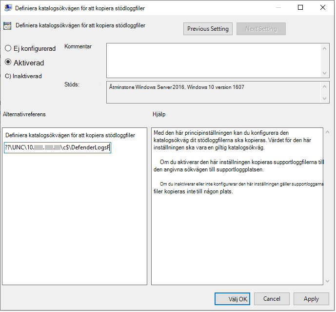

# <a name="collect-microsoft-defender-av-diagnostic-data"></a>Samla in Microsoft Defender AV-diagnostikdata

[!INCLUDE [Microsoft 365 Defender rebranding](../../includes/microsoft-defender.md)]


**Gäller för:**

- [Microsoft Defender för Endpoint](/microsoft-365/security/defender-endpoint/)

I den här artikeln beskrivs hur du samlar in diagnostikdata som kan användas av Microsofts support- och teknikteam för att felsöka problem som kan uppstå när du använder Microsoft Defender AV.

> [!NOTE]
> Som en del av undersökningen eller svarsprocessen kan du samla in ett undersökningspaket från en enhet. Gör så här: Samla [in undersökningspaket från enheter](/windows/security/threat-protection/microsoft-defender-atp/respond-machine-alerts#collect-investigation-package-from-devices).

Skaffa .cab-diagnostikfilen på minst två enheter som har samma problem genom att göra följande:

1. Öppna en version på administratörsnivå av kommandotolken på följande sätt:

    a. Öppna **Start-menyn.**

    b. Skriv **cmd**. Högerklicka på **Kommandotolken och** klicka på **Kör som administratör.**

    c. Ange administratörsautentiseringsuppgifter eller godkänn uppmaningen.

2. Gå till Microsoft Defender-katalogen. Som standard är det här `C:\Program Files\Windows Defender` .

> [!NOTE]
> Om du kör en uppdaterad [version av Microsoft Defender-plattformen](https://support.microsoft.com/help/4052623/update-for-microsoft-defender-antimalware-platform)kör `MpCmdRun` du från följande plats: `C:\ProgramData\Microsoft\Windows Defender\Platform\<version>` .

3. Skriv in följande kommando och tryck sedan på **Retur**  

    ```Dos
    mpcmdrun.exe -GetFiles
    ```
  
4. En .cab-fil skapas som innehåller olika diagnostikloggar. Platsen för filen anges i utdata i kommandotolken. Platsen är som standard `C:\ProgramData\Microsoft\Microsoft Defender\Support\MpSupportFiles.cab` .

> [!NOTE]
> Använd följande kommando för att omdirigera CAB-filen till en annan sökväg eller UNC-delning: `mpcmdrun.exe -GetFiles -SupportLogLocation <path>`  <br/>Mer information finns i Omdirigera [diagnostikdata till en UNC-delning.](#redirect-diagnostic-data-to-a-unc-share)

5. Kopiera de här .cab-filerna till en plats som kan nås av Microsoft Support. Ett exempel kan vara en lösenordsskyddad OneDrive-mapp som du kan dela med oss.

> [!NOTE]
>Om du har problem med Uppdateringsefterlevnad <a href="mailto:ucsupport@microsoft.com?subject=WDAV assessment issue&body=I%20am%20encountering%20the%20following%20issue%20when%20using%20Windows%20Defender%20AV%20in%20Update%20Compliance%3a%20%0d%0aI%20have%20provided%20at%20least%202%20support%20.cab%20files%20at%20the%20following%20location%3a%20%3Caccessible%20share%2c%20including%20access%20details%20such%20as%20password%3E%0d%0aMy%20OMS%20workspace%20ID%20is%3a%20%0d%0aPlease%20contact%20me%20at%3a"></a>kan du skicka ett e-postmeddelande med hjälp av e-postmallen För uppdateringsefterlevnad och fylla i mallen med följande information:
>```
> I am encountering the following issue when using Microsoft Defender Antivirus in Update Compliance:
> I have provided at least 2 support .cab files at the following location:  
> <accessible share, including access details such as password>
>
>    My OMS workspace ID is:
>
>    Please contact me at:

## <a name="redirect-diagnostic-data-to-a-unc-share"></a>Omdirigera diagnostikdata till en UNC-delning
Om du vill samla in diagnostikdata på en central lagringsplats kan du ange parametern SupportLogLocation.

```Dos
mpcmdrun.exe -GetFiles -SupportLogLocation <path>
```

Kopierar diagnostikdata till den angivna sökvägen. Om sökvägen inte anges kopieras diagnostikdata till den plats som anges i konfigurationen av supportloggplatsen.

När parametern SupportLogLocation används skapas en mappstruktur enligt följande i målsökvägen:

```Dos
<path>\<MMDD>\MpSupport-<hostname>-<HHMM>.cab
```

| fält  | Beskrivning   |
|:----|:----|
| sökväg | Sökvägen som anges på kommandoraden eller hämtas från konfigurationen
| MMDD | Månad och dag när diagnostikdata samlades in (till exempel 0530)
| hostname | Värdnamnet för enheten där diagnostikdata samlades in
| HHMM | Timmar och minuter när diagnostikdata samlades in (till exempel 1422)

> [!NOTE]
> När du använder en filresurs kontrollerar du att kontot som används för att samla in diagnostikpaketet har skrivbehörighet till resursen.  

## <a name="specify-location-where-diagnostic-data-is-created"></a>Ange plats där diagnostikdata skapas

Du kan också ange var diagnostikfilen .cab ska skapas med ett Grupprincipobjekt (GPO). 

1. Öppna redigeraren för lokala grupprinciper och leta upp GPO:t SupportLogLocation på: `HKEY_LOCAL_MACHINE\SOFTWARE\Policies\Microsoft\Windows Defender\SupportLogLocation`
   
1. Välj **Definiera katalogsökvägen för att kopiera stöd för loggfiler**.

      
        
       
3. I principredigeraren väljer du **Aktiverad**.
       
4. Ange den katalogsökväg där du vill kopiera stödloggfilerna i **fältet** Alternativ.
      
5. Välj **OK** eller **Använd.**

## <a name="see-also"></a>Se även

- [Felsöka rapportering av Microsoft Defender Antivirus](troubleshoot-reporting.md)