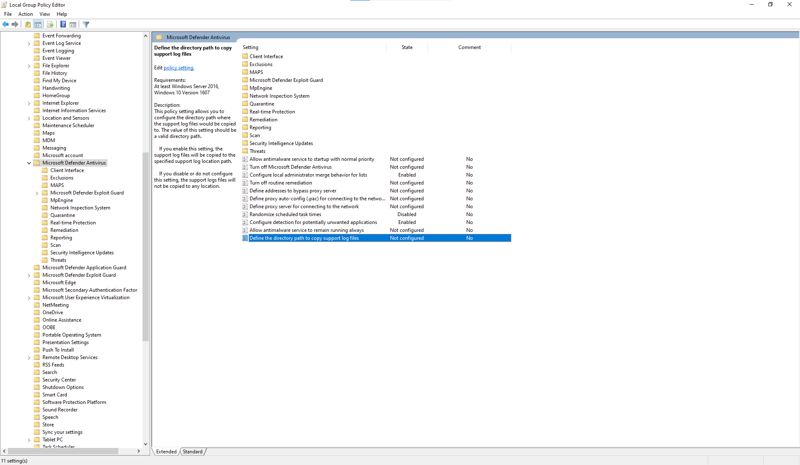

# <a name="collect-microsoft-defender-av-diagnostic-data"></a><span data-ttu-id="368f8-104">Samla in Microsoft Defender AV-diagnostikdata</span><span class="sxs-lookup"><span data-stu-id="368f8-104">Collect Microsoft Defender AV diagnostic data</span></span>

[!INCLUDE [Microsoft 365 Defender rebranding](../../includes/microsoft-defender.md)]


<span data-ttu-id="368f8-105">**Gäller för:**</span><span class="sxs-lookup"><span data-stu-id="368f8-105">**Applies to:**</span></span>

- [<span data-ttu-id="368f8-106">Microsoft Defender för Endpoint</span><span class="sxs-lookup"><span data-stu-id="368f8-106">Microsoft Defender for Endpoint</span></span>](/microsoft-365/security/defender-endpoint/)

<span data-ttu-id="368f8-107">I den här artikeln beskrivs hur du samlar in diagnostikdata som kan användas av Microsofts support- och teknikteam för att felsöka problem som kan uppstå när du använder Microsoft Defender AV.</span><span class="sxs-lookup"><span data-stu-id="368f8-107">This article describes how to collect diagnostic data that can be used by Microsoft support and engineering teams to help troubleshoot issues you might encounter when using the Microsoft Defender AV.</span></span>

> [!NOTE]
> <span data-ttu-id="368f8-108">Som en del av undersökningen eller svarsprocessen kan du samla in ett undersökningspaket från en enhet.</span><span class="sxs-lookup"><span data-stu-id="368f8-108">As part of the investigation or response process, you can collect an investigation package from a device.</span></span> <span data-ttu-id="368f8-109">Gör så här: Samla [in undersökningspaket från enheter](/windows/security/threat-protection/microsoft-defender-atp/respond-machine-alerts#collect-investigation-package-from-devices).</span><span class="sxs-lookup"><span data-stu-id="368f8-109">Here's how: [Collect investigation package from devices](/windows/security/threat-protection/microsoft-defender-atp/respond-machine-alerts#collect-investigation-package-from-devices).</span></span>

<span data-ttu-id="368f8-110">Skaffa .cab-diagnostikfilen på minst två enheter som har samma problem genom att göra följande:</span><span class="sxs-lookup"><span data-stu-id="368f8-110">On at least two devices that are experiencing the same issue, obtain the .cab diagnostic file by taking the following steps:</span></span>

1. <span data-ttu-id="368f8-111">Öppna en version på administratörsnivå av kommandotolken på följande sätt:</span><span class="sxs-lookup"><span data-stu-id="368f8-111">Open an administrator-level version of the command prompt as follows:</span></span>

    <span data-ttu-id="368f8-112">a.</span><span class="sxs-lookup"><span data-stu-id="368f8-112">a.</span></span> <span data-ttu-id="368f8-113">Öppna **Start-menyn.**</span><span class="sxs-lookup"><span data-stu-id="368f8-113">Open the **Start** menu.</span></span>

    <span data-ttu-id="368f8-114">b.</span><span class="sxs-lookup"><span data-stu-id="368f8-114">b.</span></span> <span data-ttu-id="368f8-115">Skriv **cmd**.</span><span class="sxs-lookup"><span data-stu-id="368f8-115">Type **cmd**.</span></span> <span data-ttu-id="368f8-116">Högerklicka på **Kommandotolken och** klicka på **Kör som administratör.**</span><span class="sxs-lookup"><span data-stu-id="368f8-116">Right-click on **Command Prompt** and click **Run as administrator**.</span></span>

    <span data-ttu-id="368f8-117">c.</span><span class="sxs-lookup"><span data-stu-id="368f8-117">c.</span></span> <span data-ttu-id="368f8-118">Ange administratörsautentiseringsuppgifter eller godkänn uppmaningen.</span><span class="sxs-lookup"><span data-stu-id="368f8-118">Enter administrator credentials or approve the prompt.</span></span>

2. <span data-ttu-id="368f8-119">Gå till Microsoft Defender-katalogen.</span><span class="sxs-lookup"><span data-stu-id="368f8-119">Navigate to the Microsoft Defender directory.</span></span> <span data-ttu-id="368f8-120">Som standard är det här `C:\Program Files\Windows Defender` .</span><span class="sxs-lookup"><span data-stu-id="368f8-120">By default, this is `C:\Program Files\Windows Defender`.</span></span>

> [!NOTE]
> <span data-ttu-id="368f8-121">Om du kör en uppdaterad [version av Microsoft Defender-plattformen](https://support.microsoft.com/help/4052623/update-for-microsoft-defender-antimalware-platform)kör `MpCmdRun` du från följande plats: `C:\ProgramData\Microsoft\Windows Defender\Platform\<version>` .</span><span class="sxs-lookup"><span data-stu-id="368f8-121">If you're running an [updated Microsoft Defender Platform version](https://support.microsoft.com/help/4052623/update-for-microsoft-defender-antimalware-platform), please run `MpCmdRun` from the following location: `C:\ProgramData\Microsoft\Windows Defender\Platform\<version>`.</span></span>

3. <span data-ttu-id="368f8-122">Skriv in följande kommando och tryck sedan på **Retur**</span><span class="sxs-lookup"><span data-stu-id="368f8-122">Type the following command, and then press **Enter**</span></span>  

    ```Dos
    mpcmdrun.exe -GetFiles
    ```
  
4. <span data-ttu-id="368f8-123">En .cab-fil skapas som innehåller olika diagnostikloggar.</span><span class="sxs-lookup"><span data-stu-id="368f8-123">A .cab file will be generated that contains various diagnostic logs.</span></span> <span data-ttu-id="368f8-124">Platsen för filen anges i utdata i kommandotolken.</span><span class="sxs-lookup"><span data-stu-id="368f8-124">The location of the file will be specified in the output in the command prompt.</span></span> <span data-ttu-id="368f8-125">Platsen är som standard `C:\ProgramData\Microsoft\Microsoft Defender\Support\MpSupportFiles.cab` .</span><span class="sxs-lookup"><span data-stu-id="368f8-125">By default, the location is `C:\ProgramData\Microsoft\Microsoft Defender\Support\MpSupportFiles.cab`.</span></span>

> [!NOTE]
> <span data-ttu-id="368f8-126">Använd följande kommando för att omdirigera CAB-filen till en annan sökväg eller UNC-delning: `mpcmdrun.exe -GetFiles -SupportLogLocation <path>`</span><span class="sxs-lookup"><span data-stu-id="368f8-126">To redirect the cab file to a a different path or UNC share, use the following command: `mpcmdrun.exe -GetFiles -SupportLogLocation <path>`</span></span>  <br/><span data-ttu-id="368f8-127">Mer information finns i Omdirigera [diagnostikdata till en UNC-delning.](#redirect-diagnostic-data-to-a-unc-share)</span><span class="sxs-lookup"><span data-stu-id="368f8-127">For more information, see [Redirect diagnostic data to a UNC share](#redirect-diagnostic-data-to-a-unc-share).</span></span>

5. <span data-ttu-id="368f8-128">Kopiera de här .cab-filerna till en plats som kan nås av Microsoft Support.</span><span class="sxs-lookup"><span data-stu-id="368f8-128">Copy these .cab files to a location that can be accessed by Microsoft support.</span></span> <span data-ttu-id="368f8-129">Ett exempel kan vara en lösenordsskyddad OneDrive-mapp som du kan dela med oss.</span><span class="sxs-lookup"><span data-stu-id="368f8-129">An example could be a password-protected OneDrive folder that you can share with us.</span></span>

> [!NOTE]
><span data-ttu-id="368f8-130">Om du har problem med Uppdateringsefterlevnad <a href="mailto:ucsupport@microsoft.com?subject=WDAV assessment issue&body=I%20am%20encountering%20the%20following%20issue%20when%20using%20Windows%20Defender%20AV%20in%20Update%20Compliance%3a%20%0d%0aI%20have%20provided%20at%20least%202%20support%20.cab%20files%20at%20the%20following%20location%3a%20%3Caccessible%20share%2c%20including%20access%20details%20such%20as%20password%3E%0d%0aMy%20OMS%20workspace%20ID%20is%3a%20%0d%0aPlease%20contact%20me%20at%3a"></a>kan du skicka ett e-postmeddelande med hjälp av e-postmallen För uppdateringsefterlevnad och fylla i mallen med följande information:</span><span class="sxs-lookup"><span data-stu-id="368f8-130">If you have a problem with Update compliance, send an email using the <a href="mailto:ucsupport@microsoft.com?subject=WDAV assessment issue&body=I%20am%20encountering%20the%20following%20issue%20when%20using%20Windows%20Defender%20AV%20in%20Update%20Compliance%3a%20%0d%0aI%20have%20provided%20at%20least%202%20support%20.cab%20files%20at%20the%20following%20location%3a%20%3Caccessible%20share%2c%20including%20access%20details%20such%20as%20password%3E%0d%0aMy%20OMS%20workspace%20ID%20is%3a%20%0d%0aPlease%20contact%20me%20at%3a">Update Compliance support email template</a>, and fill out the template with the following information:</span></span>
>```
> I am encountering the following issue when using Microsoft Defender Antivirus in Update Compliance:
> I have provided at least 2 support .cab files at the following location:  
> <accessible share, including access details such as password>
>
>    My OMS workspace ID is:
>
>    Please contact me at:

## <a name="redirect-diagnostic-data-to-a-unc-share"></a><span data-ttu-id="368f8-131">Omdirigera diagnostikdata till en UNC-delning</span><span class="sxs-lookup"><span data-stu-id="368f8-131">Redirect diagnostic data to a UNC share</span></span>
<span data-ttu-id="368f8-132">Om du vill samla in diagnostikdata på en central lagringsplats kan du ange parametern SupportLogLocation.</span><span class="sxs-lookup"><span data-stu-id="368f8-132">To collect diagnostic data on a central repository, you can specify the SupportLogLocation parameter.</span></span>

```Dos
mpcmdrun.exe -GetFiles -SupportLogLocation <path>
```

<span data-ttu-id="368f8-133">Kopierar diagnostikdata till den angivna sökvägen.</span><span class="sxs-lookup"><span data-stu-id="368f8-133">Copies the diagnostic data to the specified path.</span></span> <span data-ttu-id="368f8-134">Om sökvägen inte anges kopieras diagnostikdata till den plats som anges i konfigurationen av supportloggplatsen.</span><span class="sxs-lookup"><span data-stu-id="368f8-134">If the path is not specified, the diagnostic data will be copied to the location specified in the Support Log Location Configuration.</span></span>

<span data-ttu-id="368f8-135">När parametern SupportLogLocation används skapas en mappstruktur enligt följande i målsökvägen:</span><span class="sxs-lookup"><span data-stu-id="368f8-135">When the SupportLogLocation parameter is used, a folder structure like as follows will be created in the destination path:</span></span>

```Dos
<path>\<MMDD>\MpSupport-<hostname>-<HHMM>.cab
```

| <span data-ttu-id="368f8-136">fält</span><span class="sxs-lookup"><span data-stu-id="368f8-136">field</span></span>  | <span data-ttu-id="368f8-137">Beskrivning</span><span class="sxs-lookup"><span data-stu-id="368f8-137">Description</span></span>   |
|:----|:----|
| <span data-ttu-id="368f8-138">sökväg</span><span class="sxs-lookup"><span data-stu-id="368f8-138">path</span></span> | <span data-ttu-id="368f8-139">Sökvägen som anges på kommandoraden eller hämtas från konfigurationen</span><span class="sxs-lookup"><span data-stu-id="368f8-139">The path as specified on the command line or retrieved from configuration</span></span>
| <span data-ttu-id="368f8-140">MMDD</span><span class="sxs-lookup"><span data-stu-id="368f8-140">MMDD</span></span> | <span data-ttu-id="368f8-141">Månad och dag när diagnostikdata samlades in (till exempel 0530)</span><span class="sxs-lookup"><span data-stu-id="368f8-141">Month and day when the diagnostic data was collected (for example, 0530)</span></span>
| <span data-ttu-id="368f8-142">hostname</span><span class="sxs-lookup"><span data-stu-id="368f8-142">hostname</span></span> | <span data-ttu-id="368f8-143">Värdnamnet för enheten där diagnostikdata samlades in</span><span class="sxs-lookup"><span data-stu-id="368f8-143">The hostname of the device on which the diagnostic data was collected</span></span>
| <span data-ttu-id="368f8-144">HHMM</span><span class="sxs-lookup"><span data-stu-id="368f8-144">HHMM</span></span> | <span data-ttu-id="368f8-145">Timmar och minuter när diagnostikdata samlades in (till exempel 1422)</span><span class="sxs-lookup"><span data-stu-id="368f8-145">Hours and minutes when the diagnostic data was collected (for example, 1422)</span></span>

> [!NOTE]
> <span data-ttu-id="368f8-146">När du använder en filresurs kontrollerar du att kontot som används för att samla in diagnostikpaketet har skrivbehörighet till resursen.</span><span class="sxs-lookup"><span data-stu-id="368f8-146">When using a file share please make sure that account used to collect the diagnostic package has write access to the share.</span></span>  

## <a name="specify-location-where-diagnostic-data-is-created"></a><span data-ttu-id="368f8-147">Ange plats där diagnostikdata skapas</span><span class="sxs-lookup"><span data-stu-id="368f8-147">Specify location where diagnostic data is created</span></span>

<span data-ttu-id="368f8-148">Du kan också ange var diagnostikfilen .cab ska skapas med ett Grupprincipobjekt (GPO).</span><span class="sxs-lookup"><span data-stu-id="368f8-148">You can also specify where the diagnostic .cab file will be created using a Group Policy Object (GPO).</span></span> 

1. <span data-ttu-id="368f8-149">Öppna redigeraren för lokala grupprinciper och leta upp GPO:t SupportLogLocation på: `HKEY_LOCAL_MACHINE\SOFTWARE\Policies\Microsoft\Windows Defender\SupportLogLocation`</span><span class="sxs-lookup"><span data-stu-id="368f8-149">Open the Local Group Policy Editor and find the SupportLogLocation GPO at: `HKEY_LOCAL_MACHINE\SOFTWARE\Policies\Microsoft\Windows Defender\SupportLogLocation`</span></span>
   
1. <span data-ttu-id="368f8-150">Välj **Definiera katalogsökvägen för att kopiera stöd för loggfiler**.</span><span class="sxs-lookup"><span data-stu-id="368f8-150">Select **Define the directory path to copy support log files**.</span></span>

      
        
       
3. <span data-ttu-id="368f8-153">I principredigeraren väljer du **Aktiverad**.</span><span class="sxs-lookup"><span data-stu-id="368f8-153">Inside the policy editor, select **Enabled**.</span></span>
       
4. <span data-ttu-id="368f8-154">Ange den katalogsökväg där du vill kopiera stödloggfilerna i **fältet** Alternativ.</span><span class="sxs-lookup"><span data-stu-id="368f8-154">Specify the directory path where you want to copy the support log files in the **Options** field.</span></span>
     <span data-ttu-id="368f8-155"></span><span class="sxs-lookup"><span data-stu-id="368f8-155"></span></span> 
5. <span data-ttu-id="368f8-156">Välj **OK** eller **Använd.**</span><span class="sxs-lookup"><span data-stu-id="368f8-156">Select **OK** or **Apply**.</span></span>

## <a name="see-also"></a><span data-ttu-id="368f8-157">Se även</span><span class="sxs-lookup"><span data-stu-id="368f8-157">See also</span></span>

- [<span data-ttu-id="368f8-158">Felsöka rapportering av Microsoft Defender Antivirus</span><span class="sxs-lookup"><span data-stu-id="368f8-158">Troubleshoot Microsoft Defender Antivirus reporting</span></span>](troubleshoot-reporting.md)