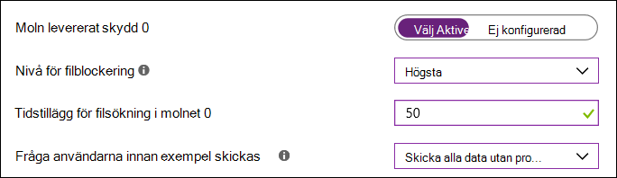

# Aktivera block vid första synenTurn on block at first sight

[!INCLUDE [Microsoft 365 Defender rebranding](../../includes/microsoft-defender.md)]

**Gäller för:****Applies to:**

- [Microsoft Defender för EndpointMicrosoft Defender for Endpoint](/microsoft-365/security/defender-endpoint/)

Blockering vid första synen är ett sätt att identifiera och blockera ny skadlig programvara inom några sekunder.Block at first sight provides a way to detect and block new malware within seconds. Skyddet aktiveras som standard när vissa nödvändiga inställningar är aktiverade.This protection is enabled by default when certain prerequisite settings are enabled. De här inställningarna omfattar moln levererat skydd, en angiven tidsgräns för sändning (t.ex. 50 sekunder) och en nivå av hög filblockering.These settings include cloud-delivered protection, a specified sample submission timeout (such as 50 seconds), and a file-blocking level of high. I de flesta företag är de här inställningarna aktiverade som standard med distributioner av Microsoft Defender Antivirus.In most enterprise organizations, these settings are enabled by default with Microsoft Defender Antivirus deployments. 

Du kan [ange hur länge en fil ska förhindras från att köras](configure-cloud-block-timeout-period-microsoft-defender-antivirus.md) medan den molnbaserade skyddstjänsten analyserar filen.You can [specify how long a file should be prevented from running](configure-cloud-block-timeout-period-microsoft-defender-antivirus.md) while the cloud-based protection service analyzes the file. Du kan också [anpassa meddelandet som visas på användarnas skrivbord](/windows/security/threat-protection//windows-defender-security-center/wdsc-customize-contact-information.md) när en fil blockeras.And, you can [customize the message displayed on users' desktops](/windows/security/threat-protection//windows-defender-security-center/wdsc-customize-contact-information.md) when a file is blocked. Du kan ändra företagets namn, kontaktinformation och meddelande-URL.You can change the company name, contact information, and message URL.

>[!TIP]
>Besök microsoft Defender för slutpunktens demowebbplats på [demo.wd.microsoft.com](https://demo.wd.microsoft.com?ocid=cx-wddocs-testground) bekräfta att funktionerna fungerar och se hur de fungerar.Visit the Microsoft Defender for Endpoint demo website at [demo.wd.microsoft.com](https://demo.wd.microsoft.com?ocid=cx-wddocs-testground) to confirm the features are working and see how they work.

## Så här fungerar detHow it works

När Microsoft Defender Antivirus stöter på en misstänkt men oupptäckta fil, uppstår ett problem i vårt molnskyddsbackend.When Microsoft Defender Antivirus encounters a suspicious but undetected file, it queries our cloud protection backend. I molnbackend används heuristics, maskininlärning och automatiserad analys av filen för att avgöra om filerna är skadliga eller inte som ett hot.The cloud backend applies heuristics, machine learning, and automated analysis of the file to determine whether the files are malicious or not a threat.

Microsoft Defender Antivirus använder flera identifierings- och skyddstekniker för att ge korrekt, intelligent och realtidsskydd.Microsoft Defender Antivirus uses multiple detection and prevention technologies to deliver accurate, intelligent, and real-time protection. Mer information finns i den här bloggen: Lär känna den avancerade tekniken som ligger till grund för nästa generations skydd [i Microsoft Defender för Slutpunkt.](https://www.microsoft.com/security/blog/2019/06/24/inside-out-get-to-know-the-advanced-technologies-at-the-core-of-microsoft-defender-atp-next-generation-protection/)To learn more, see this blog: [Get to know the advanced technologies at the core of Microsoft Defender for Endpoint next-generation protection](https://www.microsoft.com/security/blog/2019/06/24/inside-out-get-to-know-the-advanced-technologies-at-the-core-of-microsoft-defender-atp-next-generation-protection/).
  

I Windows 10, version 1803 eller senare, kan blockering vid första anblicken blockera icke-bärbara körbara filer (t.ex. JS, VBS eller makron) samt körbara filer.In Windows 10, version 1803 or later, block at first sight can block non-portable executable files (such as JS, VBS, or macros) as well as executable files.

Spärr vid första anblicken använder bara molnskyddsbackend för körbara filer och icke-bärbara körbara filer som laddas ned från Internet eller som kommer från Internetzonen.Block at first sight only uses the cloud protection backend for executable files and non-portable executable files that are downloaded from the Internet, or that originate from the Internet zone. Ett hashvärde för EXE-filen kontrolleras via molnbackend för att fastställa om filen är en tidigare oupptäckta fil.A hash value of the .exe file is checked via the cloud backend to determine if the file is a previously undetected file.

Om molnbackend inte kan avgöra något låses filen och en kopia laddas upp till molnet av Microsoft Defender Antivirus.If the cloud backend is unable to make a determination, Microsoft Defender Antivirus locks the file and uploads a copy to the cloud. Molnet utför ytterligare analyser för att nå ett avgörande innan det antingen gör det möjligt att köra filen eller blockerar den i alla framtida möten, beroende på om filen är skadlig eller säker.The cloud performs additional analysis to reach a determination before it either allows the file to run or blocks it in all future encounters, depending on whether it determines the file to be malicious or safe.

I många fall kan den här processen minska svarstiden för ny skadlig programvara från timmar till sekunder.In many cases, this process can reduce the response time for new malware from hours to seconds.

## Aktivera blockera vid första synen med Microsoft IntuneTurn on block at first sight with Microsoft Intune

> [!TIP]
> Microsoft Intune ingår nu i Microsoft Endpoint Manager.Microsoft Intune is now part of Microsoft Endpoint Manager.

1. Gå till Konfigurationsprofiler för enheter i administrationscentret för Microsoft Endpoint [https://endpoint.microsoft.com](https://endpoint.microsoft.com)   >  **Manager**( ).In the Microsoft Endpoint Manager admin center ([https://endpoint.microsoft.com](https://endpoint.microsoft.com)), navigate to **Devices** > **Configuration profiles**.

2. Välj eller skapa en profil med **profiltypen** Enhetsbegränsningar.Select or create a profile using the **Device restrictions** profile type.

3. I **konfigurationsinställningarna** för profilen För enhetsbegränsningar anger eller bekräftar du följande inställningar under **Microsoft Defender Antivirus:**In the **Configuration settings** for the Device restrictions profile, set or confirm the following settings under **Microsoft Defender Antivirus**:

   - **Moln levererat skydd**: Aktiverat**Cloud-delivered protection**: Enabled
   - **Blockeringsnivå för filer:** hög**File Blocking Level**: High
   - **Tidstillägg för filsökning i molnet:** 50**Time extension for file scanning by the cloud**: 50
   - **Fråga användarna innan exempel skickas:** Skicka alla data utan att fråga**Prompt users before sample submission**: Send all data without prompting

   

4. Spara inställningarna.Save your settings.

> [!TIP]
> - Om du ställer in blockeringsnivån **Hög** tillämpas en stark identifieringsnivå.Setting the file blocking level to **High** applies a strong level of detection. Om filblockering orsakar en falsk positiv identifiering av legitima filer kan du återställa filer i karantän om så inte är [möjligt.](./restore-quarantined-files-microsoft-defender-antivirus.md)In the unlikely event that file blocking causes a false positive detection of legitimate files, you can [restore quarantined files](./restore-quarantined-files-microsoft-defender-antivirus.md).
> - Mer information om hur du konfigurerar begränsningar för Microsoft Defender Antivirus-enheter i Intune finns i Konfigurera inställningar [för enhetsbegränsning i Microsoft Intune.](/intune/device-restrictions-configure)For more information about configuring Microsoft Defender Antivirus device restrictions in Intune, see [Configure device restriction settings in Microsoft Intune](/intune/device-restrictions-configure).
> - En lista över begränsningar för Microsoft Defender Antivirus-enheter i Intune finns i Enhetsbegränsning för [Windows 10-inställningar (och nyare) i Intune.](/intune/device-restrictions-windows-10#microsoft-defender-antivirus)For a list of Microsoft Defender Antivirus device restrictions in Intune, see [Device restriction for Windows 10 (and newer) settings in Intune](/intune/device-restrictions-windows-10#microsoft-defender-antivirus).

## Aktivera block vid första synen med Microsoft Endpoint ManagerTurn on block at first sight with Microsoft Endpoint Manager

> [!TIP]
> Om du letar efter Microsoft Endpoint Configuration Manager är det nu en del av Microsoft Endpoint Manager.If you're looking for Microsoft Endpoint Configuration Manager, it's now part of Microsoft Endpoint Manager.

1. Gå till Slutpunktssäkerhetsantivirusprogram i Microsoft Endpoint Manager ( [https://endpoint.microsoft.com](https://endpoint.microsoft.com)   >  ).In Microsoft Endpoint Manager ([https://endpoint.microsoft.com](https://endpoint.microsoft.com)), go to **Endpoint security** > **Antivirus**.

2. Välj en befintlig princip eller skapa en ny princip med profiltypen **Microsoft Defender** Antivirus.Select an existing policy, or create a new policy using the **Microsoft Defender Antivirus** profile type.

3. Ange eller bekräfta följande konfigurationsinställningar:Set or confirm the following configuration settings:

   - **Aktivera moln levererat skydd**: Ja**Turn on cloud-delivered protection**: Yes
   - **Moln levererat skyddsnivå**: Hög**Cloud-delivered protection level**: High
   - **Utökad tidsgräns för Defender Cloud på några sekunder**: 50**Defender Cloud Extended Timeout in Seconds**: 50

   :::image type="content" source="images/endpointmgr-antivirus-cloudprotection.png" alt-text="Inställningar för spärr vid första synen i Slutpunktshanteraren":::

4. Använd Microsoft Defender Antivirus-profilen för en grupp, till exempel **Alla användare,** **Alla enheter** eller Alla användare **och enheter.**Apply the Microsoft Defender Antivirus profile to a group, such as **All users**, **All devices**, or **All users and devices**.

## Aktivera blockera vid första synen med GrupprincipTurn on block at first sight with Group Policy

> [!NOTE]
> Vi rekommenderar att du använder Intune eller Microsoft Endpoint Manager för att aktivera block vid första synen.We recommend using Intune or Microsoft Endpoint Manager to turn on block at first sight. 

1. Öppna grupprinciphanteringskonsolen på datorn för [grupprinciphantering,](/previous-versions/windows/it-pro/windows-server-2008-R2-and-2008/cc731212(v=ws.11))högerklicka på det grupprincipobjekt du vill konfigurera och välj **Redigera.**On your Group Policy management computer, open the [Group Policy Management Console](/previous-versions/windows/it-pro/windows-server-2008-R2-and-2008/cc731212(v=ws.11)), right-click the Group Policy Object you want to configure and select **Edit**. 

2. Med **redigeraren för hantering av grupprinciper** går du **till Administrativa mallar** för  >    >  **datorkonfiguration Windows-komponenter**  >  **Microsoft Defender Antivirus**  >  **MAPS**.Using the **Group Policy Management Editor** go to **Computer configuration** > **Administrative templates** > **Windows Components** > **Microsoft Defender Antivirus** > **MAPS**. 

3. I avsnittet KARTOR dubbelklickar du på Konfigurera funktionen "Blockera vid första **synen"** och ställer in den på **Aktiverad**. Välj sedan **OK.**In the MAPS section, double-click **Configure the 'Block at First Sight' feature**, and set it to **Enabled**, and then select **OK**.

    > [!IMPORTANT]
    > Om du **ställer in på Fråga alltid (0)** sänks enhetens skyddstillstånd.Setting to **Always prompt (0)** will lower the protection state of the device. Inställning till **Skicka aldrig (2) innebär** att blocket vid första synen inte fungerar.Setting to **Never send (2)** means block at first sight will not function.

4. I avsnittet KARTOR dubbelklickar du på **Skicka filexempel när vidare analys krävs** och ställer in det på **Aktiverad**.In the MAPS section, double-click **Send file samples when further analysis is required**, and set it to **Enabled**. Under **Skicka filexempel när ytterligare analys krävs väljer** du Skicka alla **exempel** och klickar sedan på **OK.**Under **Send file samples when further analysis is required**, select **Send all samples**, and then click **OK**.

5. Om du har ändrat några inställningar distribuerar du grupprincipobjektet igen över nätverket för att säkerställa att alla slutpunkter täcks.If you changed any settings, redeploy the Group Policy Object across your network to ensure all endpoints are covered.

## Bekräfta att blocket vid första synen är aktiverat för enskilda klienterConfirm block at first sight is enabled on individual clients

Du kan kontrollera att blocket vid första synen är aktiverat för enskilda klienter med windows säkerhetsinställningar.You can confirm that block at first sight is enabled on individual clients using Windows security settings.

Spärr vid första synen aktiveras automatiskt så länge som **moln levererat skydd och** automatisk **sändning** av stickprov är aktiverade.Block at first sight is automatically enabled as long as **Cloud-delivered protection** and **Automatic sample submission** are both turned on.

1. Öppna Windows-säkerhetsappen.Open the Windows Security app.

2. Välj **Virus & skydd mot hot** och välj sedan Hantera & inställningar för skydd mot **&** **virushot**.Select **Virus & threat protection**, and then, under **Virus & threat protection settings**, select **Manage Settings**.

   

3. Bekräfta att **skydd mot moln levererat och** automatisk **exempelinskickning** båda är aktiverat.Confirm that **Cloud-delivered protection** and **Automatic sample submission** are both turned on.

> [!NOTE]
> - Om de nödvändiga inställningarna konfigureras och distribueras med grupprincip kommer inställningarna som beskrivs i det här avsnittet att vara nedtonade och inte tillgängliga för användning i enskilda slutpunkter.If the prerequisite settings are configured and deployed using Group Policy, the settings described in this section will be greyed-out and unavailable for use on individual endpoints. 
> - Ändringar som görs via ett grupprincipobjekt måste först distribueras till enskilda slutpunkter innan inställningen uppdateras i Windows-inställningar.Changes made through a Group Policy Object must first be deployed to individual endpoints before the setting will be updated in Windows Settings.

## Verifiera att blocket vid första synen fungerarValidate block at first sight is working

Verifiera att funktionen fungerar genom att följa instruktionerna i [Verifiera anslutningar mellan nätverket och molnet.](configure-network-connections-microsoft-defender-antivirus.md#validate-connections-between-your-network-and-the-cloud)To validate that the feature is working, follow the guidance in [Validate connections between your network and the cloud](configure-network-connections-microsoft-defender-antivirus.md#validate-connections-between-your-network-and-the-cloud).

## Inaktivera block vid första synenTurn off block at first sight

> [!CAUTION]
> Om du stänger av block vid första synen sänks skyddstillståndet för dina enheter och ditt nätverk.Turning off block at first sight will lower the protection state of your device(s) and your network.

Du kan välja att inaktivera blocket vid första synen om du vill behålla de nödvändiga inställningarna utan att använda skydd vid första synen.You might choose to disable block at first sight if you want to retain the prerequisite settings without actually using block at first sight protection. Du kan tillfälligt stänga av blocket vid första synen om du har problem med svarstiden eller om du vill testa funktionens påverkan på nätverket.You might do temporarily turn block at first sight off if you are experiencing latency issues or you want to test the feature's impact on your network. Vi rekommenderar dock inte att spärrskyddet för första synen inaktiveras permanent.However, we do not recommend disabling block at first sight protection permanently.

### Inaktivera blocket vid första synen med Microsoft Endpoint ManagerTurn off block at first sight with Microsoft Endpoint Manager

1. Gå till administrationscentret för Microsoft Endpoint Manager ( [https://endpoint.microsoft.com](https://endpoint.microsoft.com) ) och logga in.Go to Microsoft Endpoint Manager admin center ([https://endpoint.microsoft.com](https://endpoint.microsoft.com)) and sign in.

2. Gå till **Endpoint Security**  >  **Antivirus** och välj sedan din Microsoft Defender Antivirus-policy.Go to **Endpoint security** > **Antivirus**, and then select your Microsoft Defender Antivirus policy.

3. Välj **Egenskaper** under **Hantera**.Under **Manage**, choose **Properties**.

4. Välj **Redigera bredvid** **Konfigurationsinställningar.**Next to **Configuration settings**, choose **Edit**.

5. Ändra en eller flera av följande inställningar:Change one or more of the following settings:

   - Ställ **in Aktivera moln levererat skydd till** **Nej** eller **Inte konfigurerat.**Set **Turn on cloud-delivered protection** to **No** or **Not configured**.
   - Ställ **in skyddsnivån Moln levererat till** Ej **konfigurerad**.Set **Cloud-delivered protection level** to **Not configured**.
   - Avmarkera kryssrutan **Utökad tidsgräns för Defender Cloud på några** sekunder.Clear the **Defender Cloud Extended Timeout In Seconds** box.

6. Granska och spara inställningarna.Review and save your settings.

### Inaktivera blocket vid första synen med GrupprincipTurn off block at first sight with Group Policy

1. På datorn för grupprinciphantering öppnar du [Konsolen](/previous-versions/windows/it-pro/windows-server-2008-R2-and-2008/cc731212(v=ws.11))för grupprinciphantering, högerklickar på det grupprincipobjekt du vill konfigurera och klickar sedan på **Redigera.**On your Group Policy management computer, open the [Group Policy Management Console](/previous-versions/windows/it-pro/windows-server-2008-R2-and-2008/cc731212(v=ws.11)), right-click the Group Policy Object you want to configure, and then click **Edit**.

2. Med **grupprinciphanteringsredigeraren går** du till **Datorkonfiguration och** klickar på **Administrativa mallar**.Using the **Group Policy Management Editor** go to **Computer configuration** and click **Administrative templates**.

3. Expandera trädet med **Windows-komponenterna**  >  **Microsoft Defender Antivirus**  >  **MAPS**.Expand the tree through **Windows components** > **Microsoft Defender Antivirus** > **MAPS**.

4. Dubbelklicka på Konfigurera **funktionen "Spärr vid första synen"** och ställ in alternativet på **Inaktiverad**.Double-click **Configure the 'Block at First Sight' feature** and set the option to **Disabled**.

    > [!NOTE]
    > Om du inaktiverar blocket vid första synen inaktiveras inte nödvändiga gruppprinciper.Disabling block at first sight does not disable or alter the prerequisite group policies.

## Se ävenSee also

- [Microsoft Defender Antivirus i Windows 10Microsoft Defender Antivirus in Windows 10](microsoft-defender-antivirus-in-windows-10.md)

- [Aktivera moln levererat skyddEnable cloud-delivered protection](enable-cloud-protection-microsoft-defender-antivirus.md)