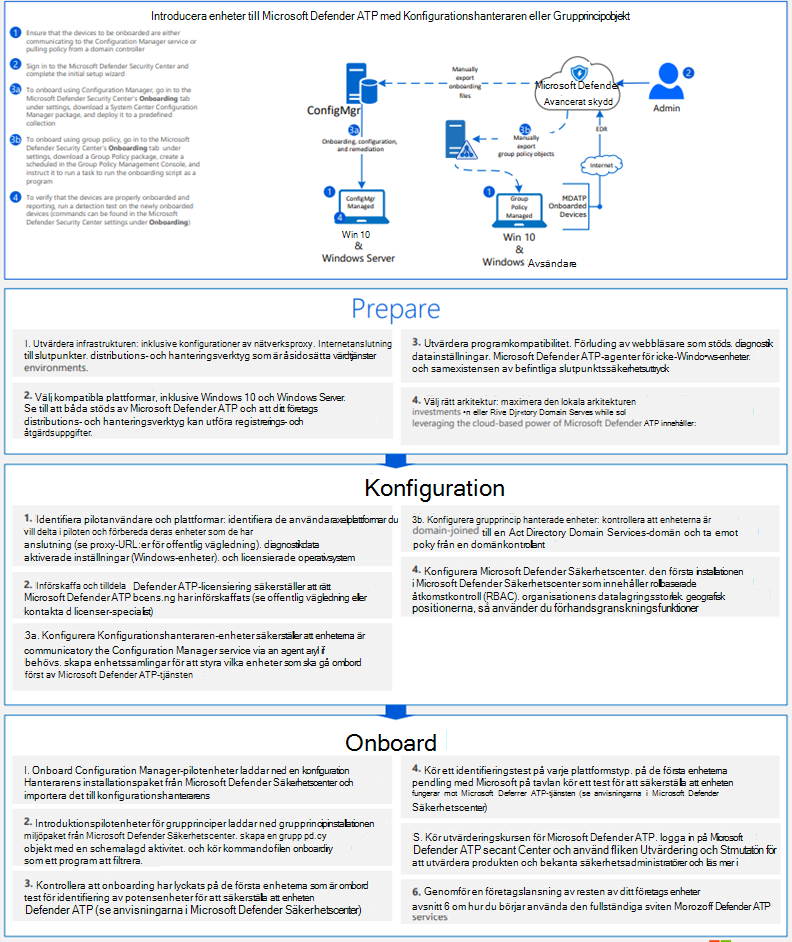
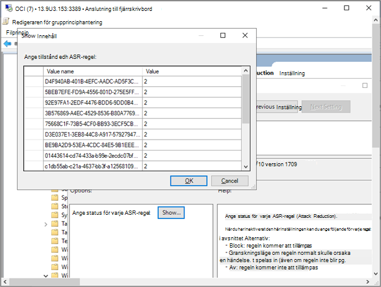

# Introducera Windows 10 enheter med grupprincip 

[!INCLUDE [Microsoft 365 Defender rebranding](../../includes/microsoft-defender.md)]

**Gäller för:**

- Grupprincip
- [Microsoft Defender för Endpoint](https://go.microsoft.com/fwlink/p/?linkid=2154037)
- [Microsoft 365 Defender](https://go.microsoft.com/fwlink/?linkid=2118804)

>Vill du använda Defender för Slutpunkt? [Registrera dig för en kostnadsfri utvärderingsversion.](https://www.microsoft.com/microsoft-365/windows/microsoft-defender-atp?ocid=docs-wdatp-configureendpointsgp-abovefoldlink)

> [!NOTE]
> Om du vill använda grupprincipuppdateringar (GP) för att distribuera paketet måste du använda Windows Server 2008 R2 eller senare.
>
> För Windows Server 2019 kan du behöva ersätta NT AUTHORITY\Well-Known-System-Account med NT AUTHORITY\SYSTEM för den XML-fil som grupprincipinställning skapar.

## Registrera enheter med grupprinciper

Läs PDF- [eller](https://github.com/MicrosoftDocs/microsoft-365-docs/raw/public/microsoft-365/security/defender-endpoint/downloads/mdatp-deployment-strategy.pdf) [Visio](https://github.com/MicrosoftDocs/microsoft-365-docs/raw/public/microsoft-365/security/defender-endpoint/downloads/mdatp-deployment-strategy.vsdx) se de olika sökvägarna i distribuera Defender för Endpoint.

1. Öppna filen för GP.zip konfigurationspaket *(WindowsDefenderATPOnboardingPackage.zip)* som du laddade ned från guiden för registrering av tjänster. Du kan också hämta paketet från [Microsoft Defender Säkerhetscenter:](https://securitycenter.windows.com/)

    1. I navigeringsfönstret väljer du **Inställningar**  >  **Onboarding**.

    1. Välj Windows 10 som operativsystem.

    1. Välj **Grupprincip i** fältet **Distributionsmetod.**

    1. Klicka **på Ladda ned** paket och spara .zip filen.

2. Extrahera innehållet i filen .zip till en delad, skrivskyddad plats som kan nås av enheten. Du bör ha en mapp med namnet *OptionalParamsPolicy* och filen *WindowsDefenderATPOnboardingScript.cmd*.

3. Öppna GPMC [(Group Policy Management Console),](/internet-explorer/ie11-deploy-guide/group-policy-and-group-policy-mgmt-console-ie11) högerklicka på det grupprincipobjekt (GPO) du vill konfigurera och klicka på **Redigera.**

4. I **redigeraren för grupprinciphantering** går du **till Datorkonfiguration** **och** sedan Inställningar och **inställningar för Kontrollpanelen.**

5. Högerklicka på **Schemalagda aktiviteter**, peka på **Nytt** och klicka sedan på **Direktaktivitet (minst Windows 7).**

6. I **uppgiftsfönstret** som öppnas går du till **fliken** Allmänt. Under **Säkerhetsalternativ klickar** du **på Ändra användare eller grupp,** skriver SYSTEM och klickar sedan **på Kontrollera namn** och sedan på **OK.** NT AUTHORITY\SYSTEM visas som det användarkonto som aktiviteten körs som.

7. Välj **Kör om användaren är inloggad eller inte** och markera kryssrutan Kör med **högst** behörighet.

8. Gå till fliken **Åtgärder** och klicka på **Ny...** Kontrollera att **Starta ett program** är markerat i **fältet** Åtgärd. Ange filnamnet och platsen för den delade *filen WindowsDefenderATPOnboardingScript.cmd.*

9. Klicka **på OK** och stäng alla öppna GPMC-fönster.

> [!TIP]
> När du har introducerat enheten kan du välja att köra ett identifieringstest för att verifiera att enheten är korrekt onboarded till tjänsten. Mer information finns i Köra [ett identifieringstest på en nyligen onboarded Defender för Slutpunkt-enhet](run-detection-test.md).

## Ytterligare Defender för konfigurationsinställningar för slutpunkt
För varje enhet kan du ange om exempel kan samlas in från enheten när en begäran görs via Microsoft Defender Säkerhetscenter att skicka in en fil för djupanalys.

Du kan använda Grupprincip (GP) för att konfigurera inställningar, till exempel inställningar för exempeldelningen som används i funktionen djupanalys.

### Konfigurera exempelsamlingsinställningar

1. Kopiera följande filer från konfigurationspaketet på GP-hanteringsenheten:

    - Kopiera _AtpConfiguration.admx_ till _C: \\ Windows \\ PolicyDefinitions_

    - Kopiera _AtpConfiguration.adml_ till _C: \\ Windows \\ PolicyDefinitions \\ en-US_

    Om du använder en [central lagring för administrativa mallar för grupprinciper](https://support.microsoft.com/help/3087759/how-to-create-and-manage-the-central-store-for-group-policy-administra)kopierar du följande filer från konfigurationspaketet:

    - Kopiera _AtpConfiguration.admx till_ _\\ \\ \<forest.root\> \\ SysVol \\ \<forest.root\> \\ Policies \\ PolicyDefinitions_

    - Kopiera _AtpConfiguration.adml_ till _\\ \\ \<forest.root\> \\ SysVol \\ \<forest.root\> \\ Policies \\ PolicyDefinitions \\ en-US_

2. Öppna konsolen [grupprinciphantering,](/internet-explorer/ie11-deploy-guide/group-policy-and-group-policy-mgmt-console-ie11)högerklicka på det GPO du vill konfigurera och klicka på **Redigera.**

3. Gå till **Datorkonfiguration i redigeraren** för **grupprinciphantering.**

4. Klicka **på Principer** och sedan på Administrativa **mallar.**

5. Klicka **Windows på komponenter** och Windows Defender på **SmartScreen.**

6. Välj för att aktivera eller inaktivera exempeldelning från dina enheter.

> [!NOTE]
> Om du inte anger något värde är standardvärdet att aktivera exempelsamling.

## Andra rekommenderade konfigurationsinställningar

### Uppdatera konfiguration av slutpunktsskydd

När du har konfigurerat onboarding-skriptet fortsätter du att redigera samma grupprincip för att lägga till slutpunktsskyddskonfigurationer. Utför grupprincipredigeringar från ett system med Windows 10 eller Server 2019 för att säkerställa att du har alla nödvändiga Microsoft Defender Antivirus funktioner. Du kan behöva stänga och öppna grupprincipobjektet igen för att registrera Defender ATP-konfigurationsinställningarna.

Alla principer finns under `Computer Configuration\Policies\Administrative Templates` .

**Principplats:** \Windows Components\Windows Defender ATP

Princip | Inställning
:---|:---
Aktivera\Inaktivera exempelsamling| Aktiverad – "Aktivera exempelsamling på datorer" markerat

 

**Principplats:** \Windows Components\Microsoft Defender Antivirus

Princip | Inställning
:---|:---
Konfigurera identifiering för potentiellt oönskade program | Aktiverad, Blockera

 

**Policyplats:** \Windows Components\Microsoft Defender Antivirus\MAPS

Princip | Inställning
:---|:---
Ansluta till Microsoft MAPS | Aktiverade, avancerade KARTOR
Skicka filexempel när ytterligare analys krävs | Aktiverad, Skicka säkra exempel

 

**Principplats:** \Windows Components\Microsoft Defender Antivirus\Real-time Protection

Princip | Inställning
:---|:---
Inaktivera realtidsskydd|Inaktiverad
Aktivera beteendeövervakning|Aktiverad
Genomsöka alla nedladdade filer och bifogade filer|Aktiverad
Övervaka fil- och programaktivitet på datorn|Aktiverad

 

**Policyplats:** \Windows Components\Microsoft Defender Antivirus\Scan

De här inställningarna konfigurerar periodiska genomsökningar av slutpunkten. Vi rekommenderar att du gör en snabbsökning varje vecka, om det är möjligt med prestanda.

Princip | Inställning 
:---|:---
Sök efter den senaste säkerhetsinformation om virus och spionprogram innan du kör en schemalagd sökning |Aktiverad

 

**Policyplats:** \Windows Components\Microsoft Defender Antivirus\Microsoft Defender Exploit Guard\Attack Surface Reduction

Hämta den aktuella listan med GUID för att minska attackytan från Anpassa minskning [av attackytor](customize-attack-surface-reduction.md)

1. Öppna principen **Konfigurera minskning av attackytan.**

1. Välj **Aktiverad**.

1. Välj **knappen** Visa.

1. Lägg till varje GUID i **fältet Värdenamn** med värdet 2.

   Var och en konfigureras endast för granskning.

   

Princip | Inställning
:---|:---
Konfigurera reglerad mappåtkomst| Aktiverat, granskningsläge

## Offboard-enheter med grupprincip

Av säkerhetsskäl upphör paketet som används till Offboard-enheter 30 dagar efter det datum då det laddades ned. Utgångna offboarding-paket som skickats till en enhet kommer att avvisas. När du laddar ned ett offboarding-paket meddelas du om paketens utgångsdatum och det inkluderas också i paketnamnet.

> [!NOTE]
> Principer för onboarding och offboarding får inte distribueras på samma enhet samtidigt, annars kan det orsaka oförutsägbara tavlor.

1. Hämta offboarding-paketet från [Microsoft Defender Säkerhetscenter:](https://securitycenter.windows.com/)

    1. I navigeringsfönstret väljer du **Inställningar**  >  **Offboarding**.

    1. Välj Windows 10 som operativsystem.

    1. Välj **Grupprincip i** fältet **Distributionsmetod.**

    1. Klicka **på Ladda ned** paket och spara .zip filen.

2. Extrahera innehållet i filen .zip till en delad, skrivskyddad plats som kan nås av enheten. Du bör ha en fil med *namnet WindowsDefenderATPOffboardingScript_valid_until_YYYY-MM-DD.cmd*.

3. Öppna GPMC [(Group Policy Management Console),](/internet-explorer/ie11-deploy-guide/group-policy-and-group-policy-mgmt-console-ie11) högerklicka på det grupprincipobjekt (GPO) du vill konfigurera och klicka på **Redigera.**

4. I **redigeraren för grupprinciphantering** går du **till Datorkonfiguration,** **inställningar** och sedan Inställningar på **Kontrollpanelen.**

5. Högerklicka på **Schemalagda aktiviteter**, peka på **Nytt** och klicka sedan på **Direktaktivitet.**

6. I **uppgiftsfönstret** som öppnas går du till **fliken** Allmänt. Välj det lokala systemanvändarkontot (INBYGGD\SYSTEM) under **Säkerhetsalternativ**.

7. Markera **Kör om användaren är inloggad eller inte** och markera **kryssrutan** Kör med högst behörighet.

8. Gå till fliken **Åtgärder** och klicka på **Nytt...**. Kontrollera att **Starta ett program** är markerat i **fältet** Åtgärd. Ange filnamn och plats för den delade filen *WindowsDefenderATPOffboardingScript_valid_until_YYYY-MM-DD.cmd.*

9. Klicka **på OK** och stäng alla öppna GPMC-fönster.

> [!IMPORTANT]
> Offboarding gör att enheten slutar skicka sensordata till portalen men data från enheten, inklusive referens till aviseringar som den haft kommer att behållas i upp till 6 månader.

## Övervaka enhetskonfiguration

Med Grupprincip finns det inte något alternativ för att övervaka distribution av principer på enheter. Övervakning kan utföras direkt i portalen eller med hjälp av de olika distributionsverktygen.

## Övervaka enheter med hjälp av portalen

1. Gå till [Microsoft Defender Säkerhetscenter](https://securitycenter.windows.com/).
2. Klicka **på listan Enheter.**
3. Kontrollera att enheter visas.

> [!NOTE]
> Det kan ta flera dagar innan enheter börjar visas i **listan Enheter.** Det inkluderar den tid det tar för principerna att distribueras till enheten, den tid det tar innan användaren loggar in och den tid det tar för slutpunkten att starta rapporteringen.

## Relaterade ämnen

- [Introducera Windows 10 enheter med Microsoft Endpoint Configuration Manager](configure-endpoints-sccm.md)
- [Registrera Windows 10-enheter med hanteringsverktyg för mobila enheter](configure-endpoints-mdm.md)
- [Registrera Windows 10-enheter med ett lokalt skript](configure-endpoints-script.md)
- [Registrera enheter för icke beständiga VDI-enheter (Virtual Desktop Infrastructure)](configure-endpoints-vdi.md)
- [Köra ett identifieringstest på en nyligen onboarded Microsoft Defender för Slutpunkt-enheter](run-detection-test.md)
- [Felsöka problem med Introduktion till Slutpunkt för Microsoft Defender](troubleshoot-onboarding.md)
