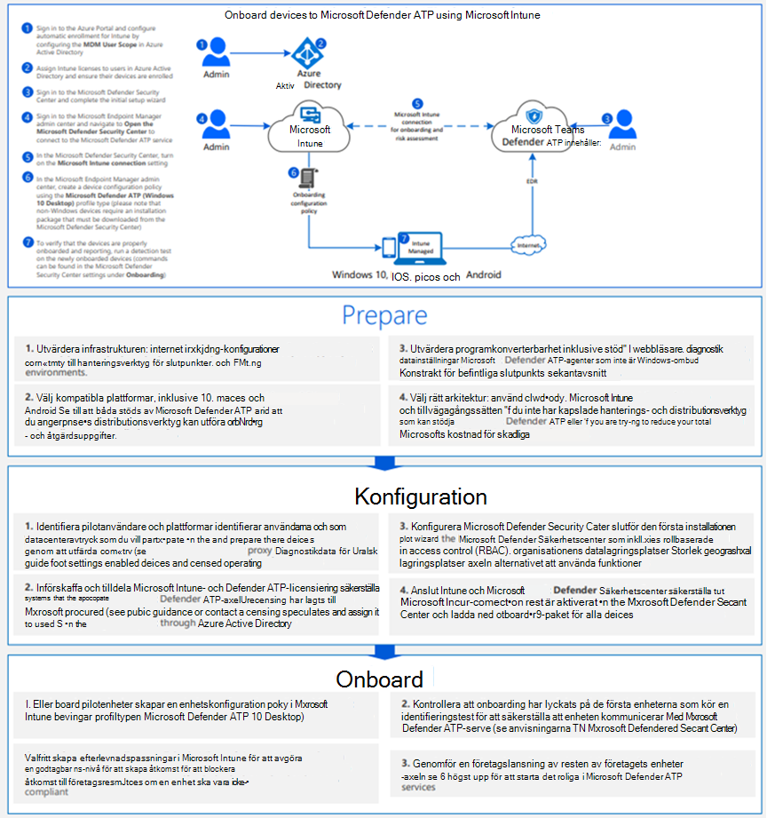

# Registrera Windows 10-enheter med hanteringsverktyg för mobila enheterOnboard Windows 10 devices using Mobile Device Management tools

[!INCLUDE [Microsoft 365 Defender rebranding](../../includes/microsoft-defender.md)]

**Gäller för:****Applies to:**
- [Microsoft Defender för EndpointMicrosoft Defender for Endpoint](https://go.microsoft.com/fwlink/p/?linkid=2154037)
- [Microsoft 365 DefenderMicrosoft 365 Defender](https://go.microsoft.com/fwlink/?linkid=2118804)

>Vill du använda Defender för Slutpunkt?Want to experience Defender for Endpoint? [Registrera dig för en kostnadsfri utvärderingsversion.Sign up for a free trial.](https://www.microsoft.com/microsoft-365/windows/microsoft-defender-atp?ocid=docs-wdatp-configureendpointsmdm-abovefoldlink)

Du kan använda MDM-lösningar (Mobile Device Management) för att konfigurera enheter.You can use mobile device management (MDM) solutions to configure devices. Defender för Endpoint stöder MDM genom att tillhandahålla OMA-URIs att skapa principer för att hantera enheter.Defender for Endpoint supports MDMs by providing OMA-URIs to create policies to manage devices.

Mer information om hur du använder Defender för slutpunkt-CSP finns i [WindowsAdvancedThreatProtection CSP-](https://msdn.microsoft.com/library/windows/hardware/mt723296(v=vs.85).aspx) och [WindowsAdvancedThreatProtection DDF-fil.](https://msdn.microsoft.com/library/windows/hardware/mt723297(v=vs.85).aspx)For more information on using Defender for Endpoint CSP see, [WindowsAdvancedThreatProtection CSP](https://msdn.microsoft.com/library/windows/hardware/mt723296(v=vs.85).aspx) and [WindowsAdvancedThreatProtection DDF file](https://msdn.microsoft.com/library/windows/hardware/mt723297(v=vs.85).aspx).

## Innan du börjarBefore you begin
Om du använder Microsoft Intune måste enheten MDM vara registrerad.If you're using Microsoft Intune, you must have the device MDM Enrolled. Annars kommer inställningarna inte att tillämpas.Otherwise, settings will not be applied successfully. 

Mer information om hur du aktiverar MDM med Microsoft Intune finns i [Enhetsregistrering (Microsoft Intune).](https://docs.microsoft.com/mem/intune/enrollment/device-enrollment)For more information on enabling MDM with Microsoft Intune, see [Device enrollment (Microsoft Intune)](https://docs.microsoft.com/mem/intune/enrollment/device-enrollment).

## Onboard-enheter med Microsoft IntuneOnboard devices using Microsoft Intune

Ta en titta på [PDF-](https://github.com/MicrosoftDocs/microsoft-365-docs/raw/public/microsoft-365/security/defender-endpoint/downloads/mdatp-deployment-strategy.pdf)  [eller Visio-filen](https://github.com/MicrosoftDocs/microsoft-365-docs/raw/public/microsoft-365/security/defender-endpoint/downloads/mdatp-deployment-strategy.vsdx) för att se de olika sökvägarna i distribuera Defender för Endpoint.Check out the [PDF](https://github.com/MicrosoftDocs/microsoft-365-docs/raw/public/microsoft-365/security/defender-endpoint/downloads/mdatp-deployment-strategy.pdf)  or  [Visio](https://github.com/MicrosoftDocs/microsoft-365-docs/raw/public/microsoft-365/security/defender-endpoint/downloads/mdatp-deployment-strategy.vsdx) to see the various paths in deploying Defender for Endpoint. 

Följ instruktionerna från [Intune](https://docs.microsoft.com/intune/advanced-threat-protection).Follow the instructions from [Intune](https://docs.microsoft.com/intune/advanced-threat-protection).

Mer information om hur du använder Defender för slutpunkt-CSP finns i [WindowsAdvancedThreatProtection CSP-](https://msdn.microsoft.com/library/windows/hardware/mt723296(v=vs.85).aspx) och [WindowsAdvancedThreatProtection DDF-fil.](https://msdn.microsoft.com/library/windows/hardware/mt723297(v=vs.85).aspx)For more information on using Defender for Endpoint CSP see, [WindowsAdvancedThreatProtection CSP](https://msdn.microsoft.com/library/windows/hardware/mt723296(v=vs.85).aspx) and [WindowsAdvancedThreatProtection DDF file](https://msdn.microsoft.com/library/windows/hardware/mt723297(v=vs.85).aspx).

> [!NOTE]
> - Principen **Hälsostatus för onboarded-enheter** använder skrivskyddade egenskaper och kan inte åtgärdas.The **Health Status for onboarded devices** policy uses read-only properties and can't be remediated.
> - Konfiguration av frekvens för diagnostikdatarapportering är endast tillgänglig för enheter i Windows 10 version 1703.Configuration of diagnostic data reporting frequency is only available for devices on Windows 10, version 1703.

>[!TIP]
> När du har introducerat enheten kan du välja att köra ett identifieringstest för att verifiera att en enhet är korrekt onboarded till tjänsten.After onboarding the device, you can choose to run a detection test to verify that a device is properly onboarded to the service. Mer information finns i Köra [ett identifieringstest på en nyligen onboarded Microsoft Defender för Endpoint-enhet.](run-detection-test.md)For more information, see [Run a detection test on a newly onboarded Microsoft Defender for Endpoint device](run-detection-test.md).

Läs PDF- [eller](https://github.com/MicrosoftDocs/microsoft-365-docs/raw/public/microsoft-365/security/defender-endpoint/downloads/mdatp-deployment-strategy.pdf)  [Visio-filen](https://github.com/MicrosoftDocs/microsoft-365-docs/raw/public/microsoft-365/security/defender-endpoint/downloads/mdatp-deployment-strategy.vsdx) för att se de olika sökvägarna i distributionen av Microsoft Defender för Endpoint.Check out the [PDF](https://github.com/MicrosoftDocs/microsoft-365-docs/raw/public/microsoft-365/security/defender-endpoint/downloads/mdatp-deployment-strategy.pdf)  or  [Visio](https://github.com/MicrosoftDocs/microsoft-365-docs/raw/public/microsoft-365/security/defender-endpoint/downloads/mdatp-deployment-strategy.vsdx) to see the various paths in deploying Microsoft Defender for Endpoint.

## Offboard och övervaka enheter med hjälp av verktyg för hantering av mobila enheterOffboard and monitor devices using Mobile Device Management tools
Av säkerhetsskäl upphör paketet som används till Offboard-enheter 30 dagar efter det datum då det laddades ned.For security reasons, the package used to Offboard devices will expire 30 days after the date it was downloaded. Utgångna offboarding-paket som skickats till en enhet kommer att avvisas.Expired offboarding packages sent to a device will be rejected. När du laddar ned ett offboarding-paket meddelas du om paketens utgångsdatum och det inkluderas också i paketnamnet.When downloading an offboarding package you will be notified of the packages expiry date and it will also be included in the package name.

> [!NOTE]
> Principer för onboarding och offboarding får inte distribueras på samma enhet samtidigt, annars kan det orsaka oförutsägbara tavlor.Onboarding and offboarding policies must not be deployed on the same device at the same time, otherwise this will cause unpredictable collisions.

1. Hämta offboarding-paketet från [Microsoft Defender Säkerhetscenter:](https://securitycenter.windows.com/)Get the offboarding package from [Microsoft Defender Security Center](https://securitycenter.windows.com/):

   1. I navigeringsfönstret väljer du **Inställningar**  >  **offboarding**.In the navigation pane, select **Settings** > **Offboarding**.

   1. Välj Windows 10 som operativsystem.Select Windows 10 as the operating system.

   1. I fältet **Distributionsmetod** väljer du **Hantering av mobila enheter/Microsoft Intune.**In the **Deployment method** field, select **Mobile Device Management / Microsoft Intune**.
    
   1. Klicka **på Ladda ned** paket och spara ZIP-filen.Click **Download package**, and save the .zip file.

2. Extrahera innehållet i ZIP-filen till en delad, skrivskyddad plats som kan nås av nätverksadministratörerna som ska distribuera paketet.Extract the contents of the .zip file to a shared, read-only location that can be accessed by the network administrators who will deploy the package. Du bör ha en fil med *namnet WindowsDefenderATP_valid_until_YYYY-MM-DD.offboarding*.You should have a file named *WindowsDefenderATP_valid_until_YYYY-MM-DD.offboarding*.

3. Använd den anpassade konfigurationsprincipen för Microsoft Intune för att distribuera följande OMA-URI-inställningar som stöds.Use the Microsoft Intune custom configuration policy to deploy the following supported OMA-URI settings.

      OMA-URI: ./Device/Vendor/MSFT/WindowsAdvancedThreatProtection/OffboardingOMA-URI: ./Device/Vendor/MSFT/WindowsAdvancedThreatProtection/Offboarding 
      Datumtyp: SträngDate type: String 
      Värde: [Kopiera och klistra in värdet från innehållet i WindowsDefenderATP_valid_until_YYYY-MM-DD.offboarding]Value: [Copy and paste the value from the content of the WindowsDefenderATP_valid_until_YYYY-MM-DD.offboarding file]

Mer information om Inställningar för Microsoft Intune-princip finns i [Principinställningar för Windows 10 i Microsoft Intune.](https://docs.microsoft.com/intune/deploy-use/windows-10-policy-settings-in-microsoft-intune)For more information on Microsoft Intune policy settings see, [Windows 10 policy settings in Microsoft Intune](https://docs.microsoft.com/intune/deploy-use/windows-10-policy-settings-in-microsoft-intune).

> [!NOTE]
> Principen **Hälsostatus för offboarded-enheter** använder skrivskyddade egenskaper och kan inte åtgärdas.The **Health Status for offboarded devices** policy uses read-only properties and can't be remediated.

> [!IMPORTANT]
> Offboarding gör att enheten slutar skicka sensordata till portalen men data från enheten, inklusive referens till aviseringar som den haft kommer att behållas i upp till 6 månader.Offboarding causes the device to stop sending sensor data to the portal but data from the device, including reference to any alerts it has had will be retained for up to 6 months.

## Relaterade ämnenRelated topics
- [Introducera Windows 10-enheter med grupprincipOnboard Windows 10 devices using Group Policy](configure-endpoints-gp.md)
- [Introducera Windows 10-enheter med Microsoft Endpoint Configuration ManagerOnboard Windows 10 devices using Microsoft Endpoint Configuration Manager](configure-endpoints-sccm.md)
- [Registrera Windows 10-enheter med ett lokalt skriptOnboard Windows 10 devices using a local script](configure-endpoints-script.md)
- [Registrera enheter för icke beständiga VDI-enheter (Virtual Desktop Infrastructure)Onboard non-persistent virtual desktop infrastructure (VDI) devices](configure-endpoints-vdi.md)
- [Köra ett identifieringstest på en nyligen onboarded Microsoft Defender för Endpoint-enhetRun a detection test on a newly onboarded Microsoft Defender for Endpoint device](run-detection-test.md)
- [Felsöka problem med Introduktion till Slutpunkt för Microsoft DefenderTroubleshoot Microsoft Defender for Endpoint onboarding issues](troubleshoot-onboarding.md)
