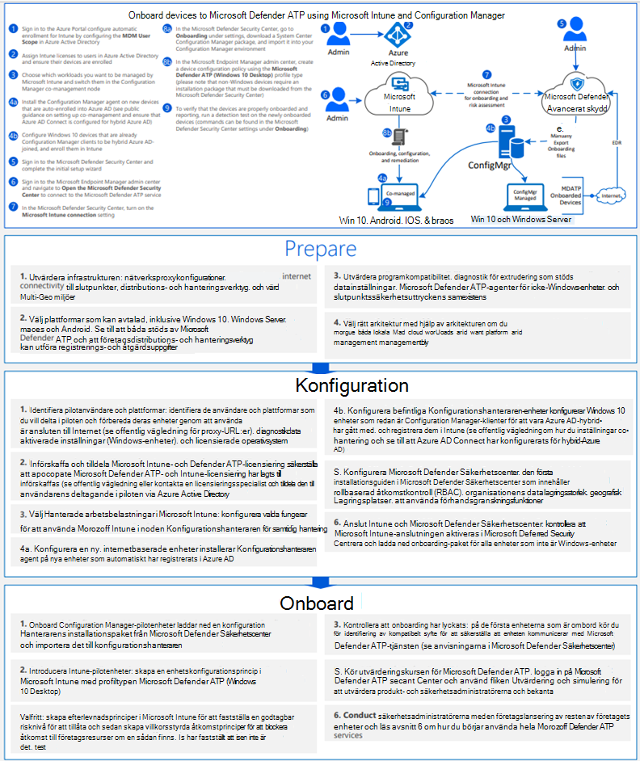
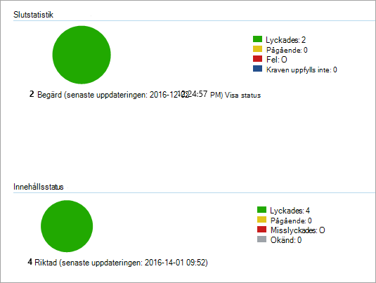

# <a name="onboard-windows-10-devices-using-configuration-manager"></a><span data-ttu-id="6d0bb-104">Registrera Windows 10-enheter med konfigurationshanteraren</span><span class="sxs-lookup"><span data-stu-id="6d0bb-104">Onboard Windows 10 devices using Configuration Manager</span></span>

[!INCLUDE [Microsoft 365 Defender rebranding](../../includes/microsoft-defender.md)]

<span data-ttu-id="6d0bb-105">**Gäller för:**</span><span class="sxs-lookup"><span data-stu-id="6d0bb-105">**Applies to:**</span></span>

- [<span data-ttu-id="6d0bb-106">Microsoft Defender för Endpoint</span><span class="sxs-lookup"><span data-stu-id="6d0bb-106">Microsoft Defender for Endpoint</span></span>](https://go.microsoft.com/fwlink/p/?linkid=2154037)
- [<span data-ttu-id="6d0bb-107">Microsoft 365 Defender</span><span class="sxs-lookup"><span data-stu-id="6d0bb-107">Microsoft 365 Defender</span></span>](https://go.microsoft.com/fwlink/?linkid=2118804)
- <span data-ttu-id="6d0bb-108">Microsoft Endpoint Configuration Manager current branch</span><span class="sxs-lookup"><span data-stu-id="6d0bb-108">Microsoft Endpoint Configuration Manager current branch</span></span>
- <span data-ttu-id="6d0bb-109">Konfigurationshanteraren för System Center 2012 R2</span><span class="sxs-lookup"><span data-stu-id="6d0bb-109">System Center 2012 R2 Configuration Manager</span></span>

><span data-ttu-id="6d0bb-110">Vill du använda Defender för Slutpunkt?</span><span class="sxs-lookup"><span data-stu-id="6d0bb-110">Want to experience Defender for Endpoint?</span></span> [<span data-ttu-id="6d0bb-111">Registrera dig för en kostnadsfri utvärderingsversion.</span><span class="sxs-lookup"><span data-stu-id="6d0bb-111">Sign up for a free trial.</span></span>](https://www.microsoft.com/microsoft-365/windows/microsoft-defender-atp?ocid=docs-wdatp-configureendpointssccm-abovefoldlink)

## <a name="supported-client-operating-systems"></a><span data-ttu-id="6d0bb-112">Klientoperativsystemet som stöds</span><span class="sxs-lookup"><span data-stu-id="6d0bb-112">Supported client operating systems</span></span>

<span data-ttu-id="6d0bb-113">Beroende på vilken version av Konfigurationshanteraren du kör kan följande klientoperativsystemet registreras:</span><span class="sxs-lookup"><span data-stu-id="6d0bb-113">Based on the version of Configuration Manager you're running, the following client operating systems can be onboarded:</span></span>

#### <a name="configuration-manager-version-1910-and-prior"></a><span data-ttu-id="6d0bb-114">Konfigurationshanteraren version 1910 och tidigare</span><span class="sxs-lookup"><span data-stu-id="6d0bb-114">Configuration Manager version 1910 and prior</span></span>

- <span data-ttu-id="6d0bb-115">Klientdatorer med Windows 10</span><span class="sxs-lookup"><span data-stu-id="6d0bb-115">Clients computers running Windows 10</span></span> 

#### <a name="configuration-manager-version-2002-and-later"></a><span data-ttu-id="6d0bb-116">Konfigurationshanteraren version 2002 och senare</span><span class="sxs-lookup"><span data-stu-id="6d0bb-116">Configuration Manager version 2002 and later</span></span>

<span data-ttu-id="6d0bb-117">Från och med Konfigurationshanteraren version 2002 kan du registrera följande operativsystem:</span><span class="sxs-lookup"><span data-stu-id="6d0bb-117">Starting in Configuration Manager version 2002, you can onboard the following operating systems:</span></span>

- <span data-ttu-id="6d0bb-118">Windows 8.1</span><span class="sxs-lookup"><span data-stu-id="6d0bb-118">Windows 8.1</span></span>
- <span data-ttu-id="6d0bb-119">Windows 10</span><span class="sxs-lookup"><span data-stu-id="6d0bb-119">Windows 10</span></span>
- <span data-ttu-id="6d0bb-120">Windows Server 2012 R2</span><span class="sxs-lookup"><span data-stu-id="6d0bb-120">Windows Server 2012 R2</span></span>
- <span data-ttu-id="6d0bb-121">Windows Server 2016</span><span class="sxs-lookup"><span data-stu-id="6d0bb-121">Windows Server 2016</span></span>
- <span data-ttu-id="6d0bb-122">Windows Server 2016, version 1803 eller senare</span><span class="sxs-lookup"><span data-stu-id="6d0bb-122">Windows Server 2016, version 1803 or later</span></span>
- <span data-ttu-id="6d0bb-123">Windows Server 2019</span><span class="sxs-lookup"><span data-stu-id="6d0bb-123">Windows Server 2019</span></span>

>[!NOTE]
><span data-ttu-id="6d0bb-124">Mer information om hur du onboardar Windows Server 2012 R2, Windows Server 2016 och Windows Server 2019 finns i [Onboard Windows-servrar.](configure-server-endpoints.md)</span><span class="sxs-lookup"><span data-stu-id="6d0bb-124">For more information on how to onboard Windows Server 2012 R2, Windows Server 2016, and Windows Server 2019, see, [Onboard Windows servers](configure-server-endpoints.md).</span></span>


### <a name="onboard-devices-using-system-center-configuration-manager"></a><span data-ttu-id="6d0bb-125">Onboard-enheter med System Center Configuration Manager</span><span class="sxs-lookup"><span data-stu-id="6d0bb-125">Onboard devices using System Center Configuration Manager</span></span>


<span data-ttu-id="6d0bb-126">[](images/onboard-config-mgr.png#lightbox)</span><span class="sxs-lookup"><span data-stu-id="6d0bb-126">[](images/onboard-config-mgr.png#lightbox)</span></span>


<span data-ttu-id="6d0bb-127">Läs PDF- [eller](https://github.com/MicrosoftDocs/microsoft-365-docs/raw/public/microsoft-365/security/defender-endpoint/downloads/mdatp-deployment-strategy.pdf)  [Visio-filen](https://github.com/MicrosoftDocs/microsoft-365-docs/raw/public/microsoft-365/security/defender-endpoint/downloads/mdatp-deployment-strategy.vsdx) för att se de olika sökvägarna i distributionen av Microsoft Defender för Endpoint.</span><span class="sxs-lookup"><span data-stu-id="6d0bb-127">Check out the [PDF](https://github.com/MicrosoftDocs/microsoft-365-docs/raw/public/microsoft-365/security/defender-endpoint/downloads/mdatp-deployment-strategy.pdf)  or  [Visio](https://github.com/MicrosoftDocs/microsoft-365-docs/raw/public/microsoft-365/security/defender-endpoint/downloads/mdatp-deployment-strategy.vsdx) to see the various paths in deploying Microsoft Defender for Endpoint.</span></span> 


1. <span data-ttu-id="6d0bb-128">Öppna ZIP-filen (Configuration Manager configuration package)*(WindowsDefenderATPOnboardingPackage.zip)* som du laddade ned från guiden för service onboarding.</span><span class="sxs-lookup"><span data-stu-id="6d0bb-128">Open the Configuration Manager configuration package .zip file (*WindowsDefenderATPOnboardingPackage.zip*) that you downloaded from the service onboarding wizard.</span></span> <span data-ttu-id="6d0bb-129">Du kan också hämta paketet från [Microsoft Defender Säkerhetscenter:](https://securitycenter.windows.com/)</span><span class="sxs-lookup"><span data-stu-id="6d0bb-129">You can also get the package from [Microsoft Defender Security Center](https://securitycenter.windows.com/):</span></span>

    1. <span data-ttu-id="6d0bb-130">Välj Inställningar Onboarding **i**  >  **navigeringsfönstret.**</span><span class="sxs-lookup"><span data-stu-id="6d0bb-130">In the navigation pane, select **Settings** > **Onboarding**.</span></span>
    
    1. <span data-ttu-id="6d0bb-131">Välj Windows 10 som operativsystem.</span><span class="sxs-lookup"><span data-stu-id="6d0bb-131">Select Windows 10 as the operating system.</span></span>

    1. <span data-ttu-id="6d0bb-132">I fältet **Distributionsmetod** väljer du **System Center Configuration Manager 2012/2012 R2/1511/1602.**</span><span class="sxs-lookup"><span data-stu-id="6d0bb-132">In the **Deployment method** field, select **System Center Configuration Manager 2012/2012 R2/1511/1602**.</span></span>
    
    1. <span data-ttu-id="6d0bb-133">Välj **Ladda ned paket** och spara ZIP-filen.</span><span class="sxs-lookup"><span data-stu-id="6d0bb-133">Select **Download package**, and save the .zip file.</span></span>

2. <span data-ttu-id="6d0bb-134">Extrahera innehållet i ZIP-filen till en delad, skrivskyddad plats som kan nås av nätverksadministratörerna som ska distribuera paketet.</span><span class="sxs-lookup"><span data-stu-id="6d0bb-134">Extract the contents of the .zip file to a shared, read-only location that can be accessed by the network administrators who will deploy the package.</span></span> <span data-ttu-id="6d0bb-135">Du bör ha en fil med namnet *WindowsDefenderATPOnboardingScript.cmd*.</span><span class="sxs-lookup"><span data-stu-id="6d0bb-135">You should have a file named *WindowsDefenderATPOnboardingScript.cmd*.</span></span>

3. <span data-ttu-id="6d0bb-136">Distribuera paketet genom att följa stegen i artikeln [Paket och program i System Center 2012 R2 Configuration Manager.](https://docs.microsoft.com/previous-versions/system-center/system-center-2012-R2/gg699369\(v=technet.10\))</span><span class="sxs-lookup"><span data-stu-id="6d0bb-136">Deploy the package by following the steps in the [Packages and Programs in System Center 2012 R2 Configuration Manager](https://docs.microsoft.com/previous-versions/system-center/system-center-2012-R2/gg699369\(v=technet.10\)) article.</span></span>

    <span data-ttu-id="6d0bb-137">a.</span><span class="sxs-lookup"><span data-stu-id="6d0bb-137">a.</span></span> <span data-ttu-id="6d0bb-138">Välj en fördefinierad enhetssamling att distribuera paketet till.</span><span class="sxs-lookup"><span data-stu-id="6d0bb-138">Choose a predefined device collection to deploy the package to.</span></span>

> [!NOTE]
> <span data-ttu-id="6d0bb-139">Defender för Endpoint har inte stöd för onboarding under fas [OOBE (Out-Box Experience).](https://answers.microsoft.com/en-us/windows/wiki/windows_10/how-to-complete-the-windows-10-out-of-box/47e3f943-f000-45e3-8c5c-9d85a1a0cf87)</span><span class="sxs-lookup"><span data-stu-id="6d0bb-139">Defender for Endpoint doesn't support onboarding during the [Out-Of-Box Experience (OOBE)](https://answers.microsoft.com/en-us/windows/wiki/windows_10/how-to-complete-the-windows-10-out-of-box/47e3f943-f000-45e3-8c5c-9d85a1a0cf87) phase.</span></span> <span data-ttu-id="6d0bb-140">Se till att användarna slutför OOBE när de har kört Windows-installationen eller uppgraderat.</span><span class="sxs-lookup"><span data-stu-id="6d0bb-140">Make sure users complete OOBE after running Windows installation or upgrading.</span></span>

>[!TIP]
> <span data-ttu-id="6d0bb-141">När du har introducerat enheten kan du välja att köra ett identifieringstest för att verifiera att en enhet är korrekt onboarded till tjänsten.</span><span class="sxs-lookup"><span data-stu-id="6d0bb-141">After onboarding the device, you can choose to run a detection test to verify that an device is properly onboarded to the service.</span></span> <span data-ttu-id="6d0bb-142">Mer information finns i Köra [ett identifieringstest på en nyligen onboarded Defender för Slutpunkt-enhet](run-detection-test.md).</span><span class="sxs-lookup"><span data-stu-id="6d0bb-142">For more information, see [Run a detection test on a newly onboarded Defender for Endpoint device](run-detection-test.md).</span></span>
>
> <span data-ttu-id="6d0bb-143">Observera att det är möjligt att skapa en identifieringsregel i ett Configuration Manager-program för att kontinuerligt kontrollera om en enhet har introducerats.</span><span class="sxs-lookup"><span data-stu-id="6d0bb-143">Note that it is possible to create a detection rule on a Configuration Manager application to continuously check if a device has been onboarded.</span></span> <span data-ttu-id="6d0bb-144">Ett program är en annan typ av objekt än ett paket och ett program.</span><span class="sxs-lookup"><span data-stu-id="6d0bb-144">An application is a different type of object than a package and program.</span></span>
> <span data-ttu-id="6d0bb-145">Om en enhet ännu inte är igång (på grund av att OOBE har slutförts eller av någon annan anledning) försöker Konfigurationshanteraren att registrera enheten igen tills regeln identifierar statusändringen.</span><span class="sxs-lookup"><span data-stu-id="6d0bb-145">If a device is not yet onboarded (due to pending OOBE completion or any other reason), Configuration Manager will retry to onboard the device until the rule detects the status change.</span></span>
> 
> <span data-ttu-id="6d0bb-146">Du kan åstadkomma detta genom att skapa en kontroll för identifieringsregel om registervärdet "OnboardingState" (av typen REG_DWORD) = 1.</span><span class="sxs-lookup"><span data-stu-id="6d0bb-146">This behavior can be accomplished by creating a detection rule checking if the "OnboardingState" registry value (of type REG_DWORD) = 1.</span></span>
> <span data-ttu-id="6d0bb-147">Registervärdet finns under "HKLM\SOFTWARE\Microsoft\Windows Advanced Threat Protection\Status".</span><span class="sxs-lookup"><span data-stu-id="6d0bb-147">This registry value is located under "HKLM\SOFTWARE\Microsoft\Windows Advanced Threat Protection\Status".</span></span>
<span data-ttu-id="6d0bb-148">Mer information finns i [Konfigurera identifieringsmetoder i System Center 2012 R2 Configuration Manager.](https://docs.microsoft.com/previous-versions/system-center/system-center-2012-R2/gg682159\(v=technet.10\)#step-4-configure-detection-methods-to-indicate-the-presence-of-the-deployment-type)</span><span class="sxs-lookup"><span data-stu-id="6d0bb-148">For more information, see [Configure Detection Methods in System Center 2012 R2 Configuration Manager](https://docs.microsoft.com/previous-versions/system-center/system-center-2012-R2/gg682159\(v=technet.10\)#step-4-configure-detection-methods-to-indicate-the-presence-of-the-deployment-type).</span></span>

### <a name="configure-sample-collection-settings"></a><span data-ttu-id="6d0bb-149">Konfigurera exempelsamlingsinställningar</span><span class="sxs-lookup"><span data-stu-id="6d0bb-149">Configure sample collection settings</span></span>

<span data-ttu-id="6d0bb-150">För varje enhet kan du ange ett konfigurationsvärde för att ange om exempel kan samlas in från enheten när en begäran görs via Microsoft Defender Säkerhetscenter för att skicka en fil för djupanalys.</span><span class="sxs-lookup"><span data-stu-id="6d0bb-150">For each device, you can set a configuration value to state whether samples can be collected from the device when a request is made through Microsoft Defender Security Center to submit a file for deep analysis.</span></span>

>[!NOTE]
><span data-ttu-id="6d0bb-151">De här konfigurationsinställningarna görs vanligtvis via Konfigurationshanteraren.</span><span class="sxs-lookup"><span data-stu-id="6d0bb-151">These configuration settings are typically done through Configuration Manager.</span></span> 

<span data-ttu-id="6d0bb-152">Du kan ange en regel för efterlevnad för konfigurationsobjektet i Konfigurationshanteraren om du vill ändra inställningen för exempelresursen på en enhet.</span><span class="sxs-lookup"><span data-stu-id="6d0bb-152">You can set a compliance rule for configuration item in Configuration Manager to change the sample share setting on a device.</span></span>

<span data-ttu-id="6d0bb-153">Den här regeln bör vara *ett konfigurationsobjekt* för efterlevnadsregel som anger värdet på en registernyckel på riktade enheter för att säkerställa att de är klagomål.</span><span class="sxs-lookup"><span data-stu-id="6d0bb-153">This rule should be a *remediating* compliance rule configuration item that sets the value of a registry key on targeted devices to make sure they’re complaint.</span></span>

<span data-ttu-id="6d0bb-154">Konfigurationen anges via följande registernyckelpost:</span><span class="sxs-lookup"><span data-stu-id="6d0bb-154">The configuration is set through the following registry key entry:</span></span>

```console
Path: "HKLM\SOFTWARE\Policies\Microsoft\Windows Advanced Threat Protection"
Name: "AllowSampleCollection"
Value: 0 or 1
```

<span data-ttu-id="6d0bb-155">Var:</span><span class="sxs-lookup"><span data-stu-id="6d0bb-155">Where:</span></span><br>
<span data-ttu-id="6d0bb-156">Nyckeltyp är en D-WORD.</span><span class="sxs-lookup"><span data-stu-id="6d0bb-156">Key type is a D-WORD.</span></span> <br>
<span data-ttu-id="6d0bb-157">Möjliga värden är:</span><span class="sxs-lookup"><span data-stu-id="6d0bb-157">Possible values are:</span></span>
- <span data-ttu-id="6d0bb-158">0 – tillåter inte exempeldelning från den här enheten</span><span class="sxs-lookup"><span data-stu-id="6d0bb-158">0 - doesn't allow sample sharing  from this device</span></span>
- <span data-ttu-id="6d0bb-159">1 – tillåter delning av alla filtyper från den här enheten</span><span class="sxs-lookup"><span data-stu-id="6d0bb-159">1 - allows sharing of all file types from this device</span></span>

<span data-ttu-id="6d0bb-160">Standardvärdet är 1 om registernyckeln inte finns.</span><span class="sxs-lookup"><span data-stu-id="6d0bb-160">The default value in case the registry key doesn’t exist is 1.</span></span>

<span data-ttu-id="6d0bb-161">Mer information om efterlevnad för System Center Configuration Manager finns i Introduktion till [efterlevnadsinställningar i System Center 2012 R2 Configuration Manager.](https://docs.microsoft.com/previous-versions/system-center/system-center-2012-R2/gg682139\(v=technet.10\))</span><span class="sxs-lookup"><span data-stu-id="6d0bb-161">For more information about System Center Configuration Manager Compliance, see [Introduction to compliance settings in System Center 2012 R2 Configuration Manager](https://docs.microsoft.com/previous-versions/system-center/system-center-2012-R2/gg682139\(v=technet.10\)).</span></span>


## <a name="other-recommended-configuration-settings"></a><span data-ttu-id="6d0bb-162">Andra rekommenderade konfigurationsinställningar</span><span class="sxs-lookup"><span data-stu-id="6d0bb-162">Other recommended configuration settings</span></span>
<span data-ttu-id="6d0bb-163">Efter att du har introducerat enheter för tjänsten är det viktigt att du utnyttjar de skyddsfunktioner som ingår i tjänsten genom att aktivera dem med följande rekommenderade konfigurationsinställningar.</span><span class="sxs-lookup"><span data-stu-id="6d0bb-163">After onboarding devices to the service, it's important to take advantage of the included threat protection capabilities by enabling them with the following recommended configuration settings.</span></span>

### <a name="device-collection-configuration"></a><span data-ttu-id="6d0bb-164">Konfiguration av enhetssamling</span><span class="sxs-lookup"><span data-stu-id="6d0bb-164">Device collection configuration</span></span>
<span data-ttu-id="6d0bb-165">Om du använder Endpoint Configuration Manager, version 2002 eller senare, kan du välja att bredda distributionen så att den omfattar servrar eller klienter på nednivå.</span><span class="sxs-lookup"><span data-stu-id="6d0bb-165">If you're using Endpoint Configuration Manager, version 2002 or later, you can choose to broaden the deployment to include servers or down-level clients.</span></span>


### <a name="next-generation-protection-configuration"></a><span data-ttu-id="6d0bb-166">Nästa generations skyddskonfiguration</span><span class="sxs-lookup"><span data-stu-id="6d0bb-166">Next generation protection configuration</span></span>
<span data-ttu-id="6d0bb-167">Följande konfigurationsinställningar rekommenderas:</span><span class="sxs-lookup"><span data-stu-id="6d0bb-167">The following configuration settings are recommended:</span></span>

<span data-ttu-id="6d0bb-168">**Skanna**</span><span class="sxs-lookup"><span data-stu-id="6d0bb-168">**Scan**</span></span> <br>
- <span data-ttu-id="6d0bb-169">Skanna flyttbara lagringsenheter, till exempel USB-enheter: Ja</span><span class="sxs-lookup"><span data-stu-id="6d0bb-169">Scan removable storage devices such as USB drives: Yes</span></span>

<span data-ttu-id="6d0bb-170">**Realtidsskydd**</span><span class="sxs-lookup"><span data-stu-id="6d0bb-170">**Real-time Protection**</span></span> <br>
- <span data-ttu-id="6d0bb-171">Aktivera beteendeuppföljning: Ja</span><span class="sxs-lookup"><span data-stu-id="6d0bb-171">Enable Behavioral Monitoring: Yes</span></span>
- <span data-ttu-id="6d0bb-172">Aktivera skydd mot potentiellt oönskade program vid nedladdning och före installationen: Ja</span><span class="sxs-lookup"><span data-stu-id="6d0bb-172">Enable protection against Potentially Unwanted Applications at download and prior to installation: Yes</span></span>

<span data-ttu-id="6d0bb-173">**Molnskyddstjänst**</span><span class="sxs-lookup"><span data-stu-id="6d0bb-173">**Cloud Protection Service**</span></span>
- <span data-ttu-id="6d0bb-174">Molnskyddstjänsttyp: Avancerat medlemskap</span><span class="sxs-lookup"><span data-stu-id="6d0bb-174">Cloud Protection Service membership type: Advanced membership</span></span>

<span data-ttu-id="6d0bb-175">**Minskning av attackytan** Konfigurera alla tillgängliga regler för granskning.</span><span class="sxs-lookup"><span data-stu-id="6d0bb-175">**Attack surface reduction** Configure all available rules to Audit.</span></span>

>[!NOTE]
> <span data-ttu-id="6d0bb-176">Att blockera dessa aktiviteter kan avbryta legitima affärsprocesser.</span><span class="sxs-lookup"><span data-stu-id="6d0bb-176">Blocking these activities may interrupt legitimate business processes.</span></span> <span data-ttu-id="6d0bb-177">Det bästa sättet är att ange allt som ska granskas, identifiera vilka som är säkra att aktivera och sedan aktivera inställningarna på slutpunkter som inte har falsk positiv identifiering.</span><span class="sxs-lookup"><span data-stu-id="6d0bb-177">The best approach is setting everything to audit, identifying which ones are safe to turn on, and then enabling those settings on endpoints which do not have false positive detections.</span></span>


<span data-ttu-id="6d0bb-178">**Nätverksskydd**</span><span class="sxs-lookup"><span data-stu-id="6d0bb-178">**Network protection**</span></span> <br>
<span data-ttu-id="6d0bb-179">Innan du aktiverar nätverksskydd i gransknings- eller blockeringsläge bör du kontrollera att du har installerat uppdateringen för program mot skadlig kod som kan fås från [supportsidan.](https://support.microsoft.com/en-us/help/4560203/windows-defender-anti-malware-platform-binaries-are-missing)</span><span class="sxs-lookup"><span data-stu-id="6d0bb-179">Prior to enabling network protection in audit or block mode, ensure that you've installed the antimalware platform update, which can be obtained from the [support page](https://support.microsoft.com/en-us/help/4560203/windows-defender-anti-malware-platform-binaries-are-missing).</span></span>


<span data-ttu-id="6d0bb-180">**Kontrollerad mappåtkomst**</span><span class="sxs-lookup"><span data-stu-id="6d0bb-180">**Controlled folder access**</span></span><br>
<span data-ttu-id="6d0bb-181">Aktivera funktionen i granskningsläge i minst 30 dagar.</span><span class="sxs-lookup"><span data-stu-id="6d0bb-181">Enable the feature in audit mode for at least 30 days.</span></span> <span data-ttu-id="6d0bb-182">Granska identifieringar och skapa en lista över program som får skriva i skyddade kataloger efter den här perioden.</span><span class="sxs-lookup"><span data-stu-id="6d0bb-182">After this period, review detections and create a list of applications that are allowed to write to protected directories.</span></span>

<span data-ttu-id="6d0bb-183">Mer information finns i Utvärdera [reglerad mappåtkomst.](evaluate-controlled-folder-access.md)</span><span class="sxs-lookup"><span data-stu-id="6d0bb-183">For more information, see [Evaluate controlled folder access](evaluate-controlled-folder-access.md).</span></span>


## <a name="offboard-devices-using-configuration-manager"></a><span data-ttu-id="6d0bb-184">Offboard-enheter med Konfigurationshanteraren</span><span class="sxs-lookup"><span data-stu-id="6d0bb-184">Offboard devices using Configuration Manager</span></span>

<span data-ttu-id="6d0bb-185">Av säkerhetsskäl upphör paketet som används till Offboard-enheter 30 dagar efter det datum då det laddades ned.</span><span class="sxs-lookup"><span data-stu-id="6d0bb-185">For security reasons, the package used to Offboard devices will expire 30 days after the date it was downloaded.</span></span> <span data-ttu-id="6d0bb-186">Utgångna offboarding-paket som skickats till en enhet kommer att avvisas.</span><span class="sxs-lookup"><span data-stu-id="6d0bb-186">Expired offboarding packages sent to a device will be rejected.</span></span> <span data-ttu-id="6d0bb-187">När du laddar ned ett offboarding-paket meddelas du om paketens utgångsdatum och det inkluderas också i paketets namn.</span><span class="sxs-lookup"><span data-stu-id="6d0bb-187">When downloading an offboarding package, you will be notified of the packages expiry date and it will also be included in the package name.</span></span>

> [!NOTE]
> <span data-ttu-id="6d0bb-188">Principer för onboarding och offboarding får inte distribueras på samma enhet samtidigt, annars kan det orsaka oförutsägbara tavlor.</span><span class="sxs-lookup"><span data-stu-id="6d0bb-188">Onboarding and offboarding policies must not be deployed on the same device at the same time, otherwise this will cause unpredictable collisions.</span></span>

### <a name="offboard-devices-using-microsoft-endpoint-manager-current-branch"></a><span data-ttu-id="6d0bb-189">Offboard-enheter med Aktuell gren i Microsoft Endpoint Manager</span><span class="sxs-lookup"><span data-stu-id="6d0bb-189">Offboard devices using Microsoft Endpoint Manager current branch</span></span>

<span data-ttu-id="6d0bb-190">Om du använder Microsoft Endpoint Manager current branch, se [Skapa en konfigurationsfil för offboarding.](https://docs.microsoft.com/configmgr/protect/deploy-use/windows-defender-advanced-threat-protection#create-an-offboarding-configuration-file)</span><span class="sxs-lookup"><span data-stu-id="6d0bb-190">If you use Microsoft Endpoint Manager current branch, see [Create an offboarding configuration file](https://docs.microsoft.com/configmgr/protect/deploy-use/windows-defender-advanced-threat-protection#create-an-offboarding-configuration-file).</span></span>

### <a name="offboard-devices-using-system-center-2012-r2-configuration-manager"></a><span data-ttu-id="6d0bb-191">Offboard-enheter med System Center 2012 R2 Configuration Manager</span><span class="sxs-lookup"><span data-stu-id="6d0bb-191">Offboard devices using System Center 2012 R2 Configuration Manager</span></span>

1. <span data-ttu-id="6d0bb-192">Hämta offboarding-paketet från [Microsoft Defender Säkerhetscenter:](https://securitycenter.windows.com/)</span><span class="sxs-lookup"><span data-stu-id="6d0bb-192">Get the offboarding package from [Microsoft Defender Security Center](https://securitycenter.windows.com/):</span></span>

    1. <span data-ttu-id="6d0bb-193">I navigeringsfönstret väljer du **Inställningar**  >   **offboarding**.</span><span class="sxs-lookup"><span data-stu-id="6d0bb-193">In the navigation pane, select **Settings** >  **Offboarding**.</span></span>

    1. <span data-ttu-id="6d0bb-194">Välj Windows 10 som operativsystem.</span><span class="sxs-lookup"><span data-stu-id="6d0bb-194">Select Windows 10 as the operating system.</span></span>

    1. <span data-ttu-id="6d0bb-195">I fältet **Distributionsmetod** väljer du **System Center Configuration Manager 2012/2012 R2/1511/1602.**</span><span class="sxs-lookup"><span data-stu-id="6d0bb-195">In the **Deployment method** field, select **System Center Configuration Manager 2012/2012 R2/1511/1602**.</span></span>
    
    1. <span data-ttu-id="6d0bb-196">Välj **Ladda ned paket** och spara ZIP-filen.</span><span class="sxs-lookup"><span data-stu-id="6d0bb-196">Select **Download package**, and save the .zip file.</span></span>

2. <span data-ttu-id="6d0bb-197">Extrahera innehållet i ZIP-filen till en delad, skrivskyddad plats som kan nås av nätverksadministratörerna som ska distribuera paketet.</span><span class="sxs-lookup"><span data-stu-id="6d0bb-197">Extract the contents of the .zip file to a shared, read-only location that can be accessed by the network administrators who will deploy the package.</span></span> <span data-ttu-id="6d0bb-198">Du bör ha en fil med *namnet WindowsDefenderATPOffboardingScript_valid_until_YYYY-MM-DD.cmd*.</span><span class="sxs-lookup"><span data-stu-id="6d0bb-198">You should have a file named *WindowsDefenderATPOffboardingScript_valid_until_YYYY-MM-DD.cmd*.</span></span>

3. <span data-ttu-id="6d0bb-199">Distribuera paketet genom att följa stegen i artikeln [Paket och program i System Center 2012 R2 Configuration Manager.](https://docs.microsoft.com/previous-versions/system-center/system-center-2012-R2/gg699369\(v=technet.10\))</span><span class="sxs-lookup"><span data-stu-id="6d0bb-199">Deploy the package by following the steps in the [Packages and Programs in System Center 2012 R2 Configuration Manager](https://docs.microsoft.com/previous-versions/system-center/system-center-2012-R2/gg699369\(v=technet.10\)) article.</span></span>

    <span data-ttu-id="6d0bb-200">a.</span><span class="sxs-lookup"><span data-stu-id="6d0bb-200">a.</span></span> <span data-ttu-id="6d0bb-201">Välj en fördefinierad enhetssamling att distribuera paketet till.</span><span class="sxs-lookup"><span data-stu-id="6d0bb-201">Choose a predefined device collection to deploy the package to.</span></span>

> [!IMPORTANT]
> <span data-ttu-id="6d0bb-202">Offboarding gör att enheten slutar skicka sensordata till portalen men data från enheten, inklusive referens till aviseringar som den haft kommer att behållas i upp till 6 månader.</span><span class="sxs-lookup"><span data-stu-id="6d0bb-202">Offboarding causes the device to stop sending sensor data to the portal but data from the device, including reference to any alerts it has had will be retained for up to 6 months.</span></span>


## <a name="monitor-device-configuration"></a><span data-ttu-id="6d0bb-203">Övervaka enhetskonfiguration</span><span class="sxs-lookup"><span data-stu-id="6d0bb-203">Monitor device configuration</span></span>

<span data-ttu-id="6d0bb-204">Om du använder Aktuell gren i Microsoft Endpoint Manager använder du den inbyggda Defender för Slutpunkt-instrumentpanelen i konfigurationshanterarens konsol.</span><span class="sxs-lookup"><span data-stu-id="6d0bb-204">If you're using Microsoft Endpoint Manager current branch, use the built-in Defender for Endpoint dashboard in the Configuration Manager console.</span></span> <span data-ttu-id="6d0bb-205">Mer information finns i [Defender för slutpunkt – bildskärm.](https://docs.microsoft.com/configmgr/protect/deploy-use/windows-defender-advanced-threat-protection#monitor)</span><span class="sxs-lookup"><span data-stu-id="6d0bb-205">For more information, see [Defender for Endpoint - Monitor](https://docs.microsoft.com/configmgr/protect/deploy-use/windows-defender-advanced-threat-protection#monitor).</span></span>

<span data-ttu-id="6d0bb-206">Om du använder System Center 2012 R2 Configuration Manager består övervakning av två delar:</span><span class="sxs-lookup"><span data-stu-id="6d0bb-206">If you're using System Center 2012 R2 Configuration Manager, monitoring consists of two parts:</span></span>

1. <span data-ttu-id="6d0bb-207">Bekräfta att konfigurationspaketet har distribuerats korrekt och körs (eller har körts) på enheterna i nätverket.</span><span class="sxs-lookup"><span data-stu-id="6d0bb-207">Confirming the configuration package has been correctly deployed and is running (or has successfully run) on the devices in your network.</span></span>

2. <span data-ttu-id="6d0bb-208">Kontrollera att enheterna är kompatibla med Defender för Slutpunkt-tjänsten (detta säkerställer att enheten kan slutföra onboarding-processen och kan fortsätta att rapportera data till tjänsten).</span><span class="sxs-lookup"><span data-stu-id="6d0bb-208">Checking that the devices are compliant with the Defender for Endpoint service (this ensures the device can complete the onboarding process and can continue to report data to the service).</span></span>

### <a name="confirm-the-configuration-package-has-been-correctly-deployed"></a><span data-ttu-id="6d0bb-209">Bekräfta att konfigurationspaketet har distribuerats korrekt</span><span class="sxs-lookup"><span data-stu-id="6d0bb-209">Confirm the configuration package has been correctly deployed</span></span>

1. <span data-ttu-id="6d0bb-210">Klicka på Övervakning längst ned i **navigeringsfönstret** i konfigurationshanterarens konsol.</span><span class="sxs-lookup"><span data-stu-id="6d0bb-210">In the Configuration Manager console, click **Monitoring** at the bottom of the navigation pane.</span></span>

2. <span data-ttu-id="6d0bb-211">Välj **Översikt** och **sedan Distributioner.**</span><span class="sxs-lookup"><span data-stu-id="6d0bb-211">Select **Overview** and then **Deployments**.</span></span>

3. <span data-ttu-id="6d0bb-212">Välj på distributionen med paketets namn.</span><span class="sxs-lookup"><span data-stu-id="6d0bb-212">Select on the deployment with the package name.</span></span>

4. <span data-ttu-id="6d0bb-213">Granska statusindikatorerna under **Slutstatistik** och **Innehållsstatus.**</span><span class="sxs-lookup"><span data-stu-id="6d0bb-213">Review the status indicators under **Completion Statistics** and **Content Status**.</span></span>

    <span data-ttu-id="6d0bb-214">Om distributionen misslyckades (enheter med **fel-** och krav **som** inte uppfylls eller **statusen Misslyckades)** kan du behöva felsöka enheterna.</span><span class="sxs-lookup"><span data-stu-id="6d0bb-214">If there are failed deployments (devices with **Error**, **Requirements Not Met**, or **Failed statuses**), you may need to  troubleshoot the devices.</span></span> <span data-ttu-id="6d0bb-215">Mer information finns i Felsöka [problem med Microsoft Defender för slutpunkts onboarding.](troubleshoot-onboarding.md)</span><span class="sxs-lookup"><span data-stu-id="6d0bb-215">For more information, see, [Troubleshoot Microsoft Defender for Endpoint onboarding issues](troubleshoot-onboarding.md).</span></span>

    

### <a name="check-that-the-devices-are-compliant-with-the-microsoft-defender-for-endpoint-service"></a><span data-ttu-id="6d0bb-217">Kontrollera att enheterna är kompatibla med Microsoft Defender för slutpunktstjänsten</span><span class="sxs-lookup"><span data-stu-id="6d0bb-217">Check that the devices are compliant with the Microsoft Defender for Endpoint service</span></span>

<span data-ttu-id="6d0bb-218">Du kan ange en regel för efterlevnad för konfigurationsobjekt i System Center 2012 R2 Configuration Manager för att övervaka distributionen.</span><span class="sxs-lookup"><span data-stu-id="6d0bb-218">You can set a compliance rule for configuration item in System Center 2012 R2 Configuration Manager to monitor your deployment.</span></span>

<span data-ttu-id="6d0bb-219">Den här regeln bör vara *ett konfigurationsobjekt som inte åtgärdar* konfigurationsobjekt för efterlevnadsregel som övervakar värdet för en registernyckel på riktade enheter.</span><span class="sxs-lookup"><span data-stu-id="6d0bb-219">This rule should be a *non-remediating* compliance rule configuration item that monitors the value of a registry key on targeted devices.</span></span>

<span data-ttu-id="6d0bb-220">Övervaka följande registernyckelpost:</span><span class="sxs-lookup"><span data-stu-id="6d0bb-220">Monitor the following registry key entry:</span></span>

```console
Path: "HKLM\SOFTWARE\Microsoft\Windows Advanced Threat Protection\Status"
Name: "OnboardingState"
Value: "1"
```

<span data-ttu-id="6d0bb-221">Mer information finns i Introduktion [till efterlevnadsinställningar i System Center 2012 R2 Configuration Manager.](https://docs.microsoft.com/previous-versions/system-center/system-center-2012-R2/gg682139\(v=technet.10\))</span><span class="sxs-lookup"><span data-stu-id="6d0bb-221">For more information, see [Introduction to compliance settings in System Center 2012 R2 Configuration Manager](https://docs.microsoft.com/previous-versions/system-center/system-center-2012-R2/gg682139\(v=technet.10\)).</span></span>

## <a name="related-topics"></a><span data-ttu-id="6d0bb-222">Relaterade ämnen</span><span class="sxs-lookup"><span data-stu-id="6d0bb-222">Related topics</span></span>
- [<span data-ttu-id="6d0bb-223">Introducera Windows 10-enheter med grupprincip</span><span class="sxs-lookup"><span data-stu-id="6d0bb-223">Onboard Windows 10 devices using Group Policy</span></span>](configure-endpoints-gp.md)
- [<span data-ttu-id="6d0bb-224">Registrera Windows 10-enheter med hanteringsverktyg för mobila enheter</span><span class="sxs-lookup"><span data-stu-id="6d0bb-224">Onboard Windows 10 devices using Mobile Device Management tools</span></span>](configure-endpoints-mdm.md)
- [<span data-ttu-id="6d0bb-225">Registrera Windows 10-enheter med ett lokalt skript</span><span class="sxs-lookup"><span data-stu-id="6d0bb-225">Onboard Windows 10 devices using a local script</span></span>](configure-endpoints-script.md)
- [<span data-ttu-id="6d0bb-226">Registrera enheter för icke beständiga VDI-enheter (Virtual Desktop Infrastructure)</span><span class="sxs-lookup"><span data-stu-id="6d0bb-226">Onboard non-persistent virtual desktop infrastructure (VDI) devices</span></span>](configure-endpoints-vdi.md)
- [<span data-ttu-id="6d0bb-227">Köra ett identifieringstest på en nyligen onboarded Microsoft Defender för Endpoint-enhet</span><span class="sxs-lookup"><span data-stu-id="6d0bb-227">Run a detection test on a newly onboarded Microsoft Defender for Endpoint device</span></span>](run-detection-test.md)
- [<span data-ttu-id="6d0bb-228">Felsöka problem med Introduktion till Slutpunkt för Microsoft Defender</span><span class="sxs-lookup"><span data-stu-id="6d0bb-228">Troubleshoot Microsoft Defender for Endpoint onboarding issues</span></span>](troubleshoot-onboarding.md)
