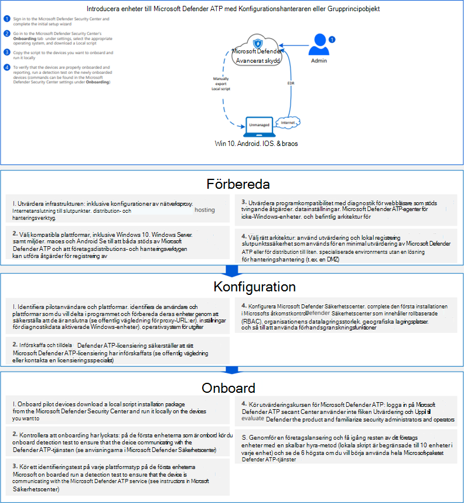

# <a name="onboard-the-windows-10-devices-using-a-local-script"></a>Registrera de Windows 10 med hjälp av ett lokalt skript

[!INCLUDE [Microsoft 365 Defender rebranding](../../includes/microsoft-defender.md)]

- [Microsoft 365 Defender](https://go.microsoft.com/fwlink/?linkid=2118804)


>Vill du använda Defender för Slutpunkt? [Registrera dig för en kostnadsfri utvärderingsversion.](https://www.microsoft.com/microsoft-365/windows/microsoft-defender-atp?ocid=docs-wdatp-configureendpointsscript-abovefoldlink)

Du kan även manuellt registrera enskilda enheter i Defender för Endpoint. Du kanske vill göra det här först när du testar tjänsten innan du åtar dig att registrera alla enheter i nätverket.

> [!IMPORTANT]
> Det här skriptet har optimerats för användning på upp till 10 enheter.
>
> Använd andra distributionsalternativ om du [vill distribuera i skala.](configure-endpoints.md) Du kan till exempel distribuera ett onboarding-skript till fler än 10 enheter i produktionen med skriptet som är tillgängligt i [Onboard Windows 10-enheter med grupprincip.](configure-endpoints-gp.md)

## <a name="onboard-devices"></a>Onboard-enheter 

[](images/onboard-script.png#lightbox)


Läs PDF- [eller](https://github.com/MicrosoftDocs/microsoft-365-docs/raw/public/microsoft-365/security/defender-endpoint/downloads/mdatp-deployment-strategy.pdf) [Visio](https://github.com/MicrosoftDocs/microsoft-365-docs/raw/public/microsoft-365/security/defender-endpoint/downloads/mdatp-deployment-strategy.vsdx) se de olika sökvägarna i distribuera Defender för Endpoint. 


1.  Öppna filen för GP.zip konfigurationspaket *(WindowsDefenderATPOnboardingPackage.zip)* som du laddade ned från guiden för registrering av tjänster. Du kan också hämta paketet från [Microsoft 365 Defender-portalen:](https://security.microsoft.com/)

    1. I navigeringsfönstret väljer du **Inställningar**  >  **Endpoints**  >  **Device Management**  >  **Onboarding**.

    1. Välj Windows 10 som operativsystem.

    1. Välj **Lokalt skript** i fältet **Distributionsmetod.**

    1. Klicka **på Ladda ned** paket och spara .zip filen.

  
2.  Extrahera innehållet i konfigurationspaketet till en plats på den enhet som du vill registrera (till exempel skrivbordet). Du bör ha en fil med namnet *WindowsDefenderATPLocalOnboardingScript.cmd*.

3.  Öppna en upphöjd kommandoradsfråga på enheten och kör skriptet:

    1.  Gå till **Start** och skriv **cmd**.

    1.  Högerklicka på **Kommandotolken** och välj **Kör som administratör**.

        

4.  Skriv skriptfilens plats. Om du kopierade filen till skrivbordet skriver du: *%userprofile%\Desktop\WindowsDefenderATPLocalOnboardingScript.cmd*

5.  Tryck på **Retur** eller klicka på **OK.**

Mer information om hur du manuellt kan verifiera att enheten är kompatibel och korrekt rapporterar sensordata finns i Felsöka problem med Microsoft Defender för [slutpunkts onboarding.](troubleshoot-onboarding.md)


>[!TIP]
> När du har introducerat enheten kan du välja att köra ett identifieringstest för att verifiera att en enhet är korrekt onboarded till tjänsten. Mer information finns i Köra [ett identifieringstest på en nyligen introducerad Microsoft Defender för slutpunktsslutpunkt.](run-detection-test.md)

## <a name="configure-sample-collection-settings"></a>Konfigurera exempelsamlingsinställningar
För varje enhet kan du ange ett konfigurationsvärde för att ange om exempel kan samlas in från enheten när en förfrågan görs via Microsoft 365 Defender för att skicka in en fil för djupanalys.

Du kan manuellt konfigurera exempeldelningsinställningen på enheten genom att använda *regedit* eller skapa och köra en *REG-fil.*  

Konfigurationen anges via följande registernyckelpost:

```console
Path: “HKLM\SOFTWARE\Policies\Microsoft\Windows Advanced Threat Protection”
Name: "AllowSampleCollection"
Value: 0 or 1
```
Var:<br>
Namntypen är en D-WORD. <br>
Möjliga värden är:
- 0 – tillåter inte exempeldelning från den här enheten
- 1 – tillåter delning av alla filtyper från den här enheten

Standardvärdet är 1 om registernyckeln inte finns.


## <a name="offboard-devices-using-a-local-script"></a>Offboard-enheter med ett lokalt skript
Av säkerhetsskäl upphör paketet som används till Offboard-enheter 30 dagar efter det datum då det laddades ned. Utgångna offboarding-paket som skickats till en enhet kommer att avvisas. När du laddar ned ett offboarding-paket meddelas du om paketens utgångsdatum och det inkluderas också i paketnamnet.

> [!NOTE]
> Principer för onboarding och offboarding får inte distribueras på samma enhet samtidigt, annars kan det orsaka oförutsägbara tavlor.

1. Hämta offboarding-paketet från [Microsoft 365 Defender portalen:](https://security.microsoft.com/)

    1. I navigeringsfönstret väljer du **Inställningar**  >  **Ändpunkter**  >  **Enhetshantering**  > **Offboarding**.

    1. Välj Windows 10 som operativsystem.

    1. Välj **Lokalt skript** i fältet **Distributionsmetod.**

    1. Klicka **på Ladda ned** paket och spara .zip filen.

2. Extrahera innehållet i filen .zip till en delad, skrivskyddad plats som kan nås av enheterna. Du bör ha en fil med *namnet WindowsDefenderATPOffboardingScript_valid_until_YYYY-MM-DD.cmd*.

3.  Öppna en upphöjd kommandoradsfråga på enheten och kör skriptet:

    1.  Gå till **Start** och skriv **cmd**.

    1.  Högerklicka på **Kommandotolken** och välj **Kör som administratör**.

        

4.  Skriv skriptfilens plats. Om du kopierade filen till skrivbordet skriver du: *%userprofile%\Desktop\WindowsDefenderATPOffboardingScript_valid_until_YYYY-MM-DD.cmd*

5.  Tryck på **Retur** eller klicka på **OK.**

> [!IMPORTANT]
> Offboarding gör att enheten slutar skicka sensordata till portalen men data från enheten, inklusive referens till aviseringar som den haft kommer att behållas i upp till 6 månader.


## <a name="monitor-device-configuration"></a>Övervaka enhetskonfiguration
Du kan följa de olika verifieringsstegen i [Felsöka onboarding-problem](troubleshoot-onboarding.md) för att verifiera att skriptet har slutförts och att agenten körs.

Övervakning kan också utföras direkt i portalen eller med hjälp av de olika distributionsverktygen.

### <a name="monitor-devices-using-the-portal"></a>Övervaka enheter med hjälp av portalen
1. Gå till Microsoft 365 Defender portalen.

2. Klicka **på Inventering av enheter**.

3. Kontrollera att enheter visas.


## <a name="related-topics"></a>Relaterade ämnen
- [Introducera Windows 10 enheter med grupprincip](configure-endpoints-gp.md)
- [Introducera Windows 10 enheter med Microsoft Endpoint Configuration Manager](configure-endpoints-sccm.md)
- [Registrera Windows 10-enheter med hanteringsverktyg för mobila enheter](configure-endpoints-mdm.md)
- [Registrera enheter för icke beständiga VDI-enheter (Virtual Desktop Infrastructure)](configure-endpoints-vdi.md)
- [Köra ett identifieringstest på en nyligen onboarded Microsoft Defender för Endpoint-enhet](run-detection-test.md)
- [Felsöka problem med Introduktion till Slutpunkt för Microsoft Defender](troubleshoot-onboarding.md)
