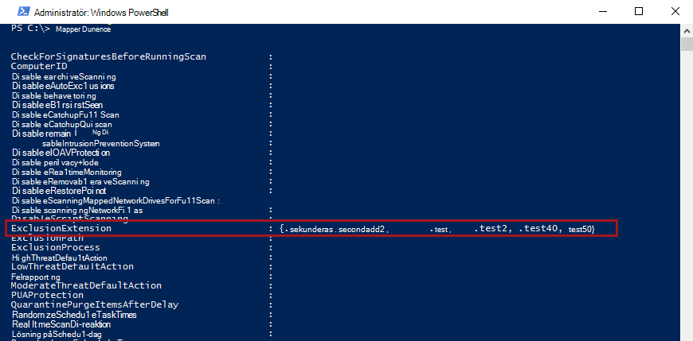
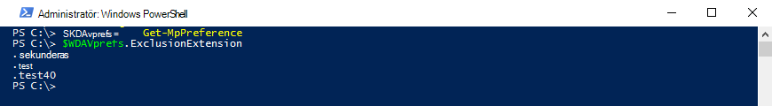

# <a name="configure-and-validate-exclusions-based-on-file-extension-and-folder-location"></a>Konfigurera och validera undantag baserat på filtillägg och mappplats

[!INCLUDE [Microsoft 365 Defender rebranding](../../includes/microsoft-defender.md)]


**Gäller för:**

- [Microsoft Defender för Endpoint](/microsoft-365/security/defender-endpoint/)

> [!IMPORTANT]
> Undantag från Microsoft Defender Antivirus gäller inte för andra Microsoft Defender-funktioner för slutpunktsfunktioner, inklusive slutpunktsidentifiering och svar [(EDR), ASR-regler (attack](/microsoft-365/security/defender-endpoint/overview-endpoint-detection-response)surface [reduction)](/microsoft-365/security/defender-endpoint/attack-surface-reduction)och kontrollerad [mappåtkomst.](/microsoft-365/security/defender-endpoint/controlled-folders) Filer som du undantar med hjälp av metoderna som beskrivs i den här artikeln kan fortfarande utlösa EDR-aviseringar och andra identifieringar. Om du vill utesluta filer allmänt lägger du till dem i anpassade indikatorer i Microsoft Defender [för Slutpunkt.](/microsoft-365/security/defender-endpoint/manage-indicators)

## <a name="exclusion-lists"></a>Undantagslistor

Du kan utesluta vissa filer från genomsökningar för Microsoft Defender Antivirus genom att ändra undantagslistor. **I allmänhet ska du inte behöva tillämpa undantag.** Microsoft Defender Antivirus innehåller många automatiska undantag baserade på kända operativsystemsbeteenden och vanliga hanteringsfiler, till exempel de som används i företagshantering, databashantering och andra företagsscenarier och situationer.

> [!NOTE]
> Undantag gäller även pua-identifieringar som kan vara oönskade.

> [!NOTE]
> Automatiska undantag gäller endast för Windows Server 2016 och högre. De här undantagen visas inte i Windows-säkerhetsappen och i PowerShell.

I den här artikeln beskrivs hur du konfigurerar undantagslistor för filer och mappar. Se [Rekommendationer för att definiera undantag](configure-exclusions-microsoft-defender-antivirus.md#recommendations-for-defining-exclusions) innan du definierar dina undantagslistor.

| Exkludering | Exempel | Undantagslista |
|:---|:---|:---|
|Alla filer med ett specifikt filnamnstillägg | Alla filer med det angivna tillägget, var som helst på datorn. <p> Giltig syntax: `.test` och `test`  | Undantag för tillägg |
|En fil under en särskild mapp | Alla filer under `c:\test\sample` mappen | Undantag för filer och mappar |
| En viss fil i en särskild mapp | Endast `c:\sample\sample.test` filen | Undantag för filer och mappar |
| En specifik process | Den körbara filen `c:\test\process.exe` | Undantag för filer och mappar |

Undantagslistor har följande egenskaper:

- Undantag för mappar gäller för alla filer och mappar under den mappen, såvida inte undermappen är en omparsningspunkt. Undermappar med uppslagspunkt måste uteslutas separat.
- Filnamnstillägg gäller för alla filnamn med det definierade filnamnstillägget om en sökväg eller mapp inte definierats.

> [!IMPORTANT]
> - Om du använder jokertecken som asterisk ( \* ) ändras hur undantagsreglerna tolkas. Viktig information om hur jokertecken fungerar finns i avsnittet Använda jokertecken i filnamn och mappsökväg eller [undantagslistor](#use-wildcards-in-the-file-name-and-folder-path-or-extension-exclusion-lists) för tillägg.
> - Du kan inte utesluta mappade nätverksenheter. Du måste ange den faktiska nätverkssökvägen.
> - Mappar som ärparspunkter som skapas när Microsoft Defender Antivirus-tjänsten startas och som har lagts till i undantagslistan inkluderas inte. Du måste starta om tjänsten (genom att starta om Windows) för att nya poäng ska tolkas som ett giltigt undantagsmål.

Information om hur du utesluter filer som öppnas i en viss process finns i Konfigurera och validera [undantag för filer som öppnas med processer.](configure-process-opened-file-exclusions-microsoft-defender-antivirus.md)

Undantagen gäller för [schemalagda genomsökningar,](scheduled-catch-up-scans-microsoft-defender-antivirus.md) [skanningar på](run-scan-microsoft-defender-antivirus.md)begäran och [realtidsskydd.](configure-real-time-protection-microsoft-defender-antivirus.md)

> [!IMPORTANT]
> Ändringar av undantagslistor som görs **med Grupprincip visas** i listorna i [Windows-säkerhetsappen.](microsoft-defender-security-center-antivirus.md)
> Ändringar som görs i **Windows-säkerhetsappen visas inte** i listorna grupprinciper.

Som standard kommer lokala ändringar som görs i listorna (av användare med administratörsbehörighet, inklusive ändringar som görs med PowerShell och WMI) att slås ihop med listorna som definierats (och distribuerats) av Grupprincip, Konfigurationshanteraren eller Intune. Grupprinciplistorna har företräde när det uppstår konflikter.

Du kan [konfigurera hur lokalt och globalt definierade undantagslistor slås samman så](configure-local-policy-overrides-microsoft-defender-antivirus.md#merge-lists) att lokala ändringar åsidosätter inställningar för hanterad distribution.

## <a name="configure-the-list-of-exclusions-based-on-folder-name-or-file-extension"></a>Konfigurera listan över undantag baserat på mappnamn eller filnamnstillägg

### <a name="use-intune-to-configure-file-name-folder-or-file-extension-exclusions"></a>Använda Intune för att konfigurera undantag för filnamn, mapp eller filnamnstillägg

Se följande artiklar:
- [Konfigurera inställningar för enhetsbegränsning i Microsoft Intune](/intune/device-restrictions-configure)
- [Inställningar för att begränsa antivirusenheten för Windows 10 i Intune](/intune/device-restrictions-windows-10#microsoft-defender-antivirus)

### <a name="use-configuration-manager-to-configure-file-name-folder-or-file-extension-exclusions"></a>Använda Konfigurationshanteraren för att konfigurera undantag för filnamn, mapp eller filnamnstillägg

Se [Hur du skapar och distribuerar principer för program mot skadlig programvara: Undantagsinställningar](/configmgr/protect/deploy-use/endpoint-antimalware-policies#exclusion-settings) för information om hur du konfigurerar Microsoft Endpoint Manager (current branch).

### <a name="use-group-policy-to-configure-folder-or-file-extension-exclusions"></a>Använda grupprinciper för att konfigurera undantag för mappar eller filnamnstillägg

>[!NOTE]
>Om du anger en fullständigt kvalificerad sökväg till en fil utesluts endast den filen. Om en mapp definieras i undantaget utesluts alla filer och undermappar under den mappen.

1. På datorn för grupprinciphantering öppnar du [Konsolen för](/previous-versions/windows/it-pro/windows-server-2008-R2-and-2008/cc731212(v=ws.11))grupprinciphantering, högerklickar på det grupprincipobjekt du vill konfigurera och klickar på **Redigera.**

2. I **redigeraren för hantering av grupprinciper** går **du till Datorkonfiguration** och **väljer Administrativa mallar**.

3. Expandera trädet till **Windows-komponenter**  >  **Microsoft Defender Antivirus**  >  **Exclusions**.

4. Öppna inställningen **för undantag av** sökvägar för redigering och lägg till undantagen.

    1. Ställ in alternativet som **Aktiverat**.
    1. Klicka på **Visa** under **Alternativ.**
    1. Ange varje mapp på en egen rad under **kolumnen Värdenamn.**
    1. Om du anger en fil ska du kontrollera att du anger en fullständigt kvalificerad sökväg till filen, inklusive enhetsbokstaven, mappsökvägen, filnamn och filnamnstillägg. Ange **0** i **kolumnen** Värde.

5. Välj **OK**.

6. Öppna inställningen **för undantag av filnamnstillägg** för redigering och lägg till undantagen.

    1. Ställ in alternativet som **Aktiverat**.
    1. Under avsnittet **Alternativ** väljer du **Visa**.
    1. Ange varje filnamnstillägg på en egen rad under **kolumnen Värdenamn.**  Ange **0** i **kolumnen** Värde.

7. Välj **OK**.

<a id="ps"></a>

### <a name="use-powershell-cmdlets-to-configure-file-name-folder-or-file-extension-exclusions"></a>Använda PowerShell-cmdlets för att konfigurera undantag för filnamn, mapp eller filnamnstillägg

Användning av PowerShell för att lägga till eller ta bort undantag för filer baserat på filtillägget, platsen eller filnamnet kräver en kombination av tre cmdlets och lämplig undantagslistparameter. Cmdletarna finns i [Defender-modulen.](/powershell/module/defender/)

Formatet för cmdletarna är följande:

```PowerShell
<cmdlet> -<exclusion list> "<item>"
```

Följande tillåts `<cmdlet>` som:

| Konfigurationsåtgärd | PowerShell-cmdlet |
|:---|:---|
|Skapa eller skriva över listan | `Set-MpPreference` |
|Lägg till i listan | `Add-MpPreference` |
|Ta bort objekt från listan | `Remove-MpPreference` |

Följande tillåts `<exclusion list>` som:

| Exkluderingstyp | PowerShell-parameter |
|:---|:---|
| Alla filer med ett angivet filnamnstillägg | `-ExclusionExtension` |
| Alla filer under en mapp (inklusive filer i undermappar) eller en viss fil | `-ExclusionPath` |

> [!IMPORTANT]
> Om du har skapat en lista med eller skriver du över den befintliga listan med hjälp av `Set-MpPreference` `Add-MpPreference` `Set-MpPreference` cmdleten igen.

Följande kodavsnitt skulle till exempel göra att microsoft Defender Antivirus-genomsökningar utesluter alla filer med `.test` filnamnstillägget:

```PowerShell
Add-MpPreference -ExclusionExtension ".test"
```

Mer information finns i Använda [PowerShell-cmdlets för att konfigurera och köra cmdlets för Microsoft Defender Antivirus](use-powershell-cmdlets-microsoft-defender-antivirus.md) och [Defender.](/powershell/module/defender/)

### <a name="use-windows-management-instruction-wmi-to-configure-file-name-folder-or-file-extension-exclusions"></a>Använda Instruktionerna för Windows Management (WMI) för att konfigurera undantag för filnamn, mapp eller filnamnstillägg

Använd metoderna [ **Ange,** **Lägg** till **och Ta** bort **MSFT_MpPreference**](/previous-versions/windows/desktop/legacy/dn455323(v=vs.85)) klassen för följande egenskaper:

```WMI
ExclusionExtension
ExclusionPath
```

Användandet av **Set**, **Add** och **Remove kan** jämföras med deras motsvarigheter i PowerShell: , `Set-MpPreference` och `Add-MpPreference` `Remove-MpPreference` .

Mer information finns i [Windows Defender WMIv2 API:er.](/previous-versions/windows/desktop/defender/windows-defender-wmiv2-apis-portal)

<a id="man-tools"></a>

### <a name="use-the-windows-security-app-to-configure-file-name-folder-or-file-extension-exclusions"></a>Använda appen Windows-säkerhet för att konfigurera undantag för filnamn, mapp eller filnamnstillägg

Anvisningar [finns i Lägga till undantag i Windows-säkerhetsappen.](microsoft-defender-security-center-antivirus.md)

<a id="wildcards"></a>

## <a name="use-wildcards-in-the-file-name-and-folder-path-or-extension-exclusion-lists"></a>Använda jokertecken i filnamnet och i undantagslistorna för mappar och filnamnstillägg

Du kan använda asterisken, frågetecken eller miljövariabler (till exempel ) som jokertecken när du definierar objekt i undantagslistan för filnamnet eller `*` `?` `%ALLUSERSPROFILE%` sökvägen till mappen. Hur dessa jokertecken tolkas skiljer sig från den vanliga användningen i andra appar och språk. Läs det här avsnittet för att förstå deras specifika begränsningar.

> [!IMPORTANT]
> Det finns viktiga begränsningar och användningsscenarier för dessa jokertecken:
> - Miljövariabel användning begränsas till maskinvariabler och de som gäller för processer som körs som ett NT AUTHORITY\SYSTEM-konto.
> - Du kan inte använda ett jokertecken i stället för en enhetsbeteckning.
> - En asterisk `*` i ett undantag från mappar gäller för en enskild mapp. Använd flera instanser av för `\*\` att ange flera kapslade mappar med ospecificerade namn.

I följande tabell beskrivs hur jokertecken kan användas och några exempel.


|Jokertecken  |Exempel  |
|:---------|:---------|
|`*` (asterisk) <p> I **filnamns- och filnamnstillägg ersätter** asterisken valt många tecken och gäller endast filer i den senaste mappen som definierats i argumentet. <p> I **mapp undantas** ersätter asterisken en enskild mapp. Använd flera `*` med mappsnedstreck för `\` att ange flera kapslade mappar. När antalet jokertecken och namngivna mappar har matchats, inkluderas även alla undermappar.   | `C:\MyData\*.txt` inkluderar `C:\MyData\notes.txt` <p> `C:\somepath\*\Data` inkluderar alla filer `C:\somepath\Archives\Data` i och dess undermappar och `C:\somepath\Authorized\Data` dess undermappar <p> `C:\Serv\*\*\Backup` inkluderar alla filer `C:\Serv\Primary\Denied\Backup` i och dess undermappar `C:\Serv\Secondary\Allowed\Backup` och dess undermappar     |
|`?` (frågetecken)  <p> I **filnamns- och filnamnstillägg ersätter** frågetecknet ett enda tecken och gäller endast filer i den senaste mappen som definierats i argumentet. <p> I **mapp undantas** ersätter frågetecknet ett enda tecken i ett mappnamn. När antalet jokertecken och namngivna mappar har matchats, inkluderas även alla undermappar.   |`C:\MyData\my?.zip` inkluderar `C:\MyData\my1.zip` <p> `C:\somepath\?\Data` inkluderar alla filer `C:\somepath\P\Data` i och dess undermappar  <p> `C:\somepath\test0?\Data` skulle inkludera alla filer i `C:\somepath\test01\Data` och dess undermappar          |
|Miljövariabler <p> Den definierade variabeln fylls i som en sökväg när undantaget beräknas.          |`%ALLUSERSPROFILE%\CustomLogFiles` skulle inkludera `C:\ProgramData\CustomLogFiles\Folder1\file1.txt`         |
        

> [!IMPORTANT]
> Om du blandar ett argument för filexkludering med ett argument för undantag för mappar stannar reglerna vid argumentet fil i den matchande mappen och söker inte efter filmatchningar i någon undermapp.
> Du kan till exempel utesluta alla filer som börjar med "datum" i mapparna `c:\data\final\marked` och genom att använda `c:\data\review\marked` regelargumentet `c:\data\*\marked\date*` .
> Det här argumentet matchar dock inte filer i undermappar under `c:\data\final\marked` eller `c:\data\review\marked` .

<a id="review"></a>

### <a name="system-environment-variables"></a>Systemmiljövariabler

I följande tabell visas och beskrivs systemkontomiljövariablerna. 

| Den här systemmiljövariabeln... | Omdirigerar till den här |
|:--|:--|
| `%APPDATA%`| `C:\Users\UserName.DomainName\AppData\Roaming` |
| `%APPDATA%\Microsoft\Internet Explorer\Quick Launch` | `C:\Windows\System32\config\systemprofile\AppData\Roaming\Microsoft\Internet Explorer\Quick Launch` |
| `%APPDATA%\Microsoft\Windows\Start Menu` | `C:\Windows\System32\config\systemprofile\AppData\Roaming\Microsoft\Windows\Start Menu` |
| `%APPDATA%\Microsoft\Windows\Start Menu\Programs` | `C:\Windows\System32\config\systemprofile\AppData\Roaming\Microsoft\Windows\Start Menu\Programs` |
| `%LOCALAPPDATA%` | `C:\Windows\System32\config\systemprofile\AppData\Local` |
| `%ProgramData%` | `C:\ProgramData` |
| `%ProgramFiles%` | `C:\Program Files` |
| `%ProgramFiles%\Common Files` | `C:\Program Files\Common Files` |
| `%ProgramFiles%\Windows Sidebar\Gadgets` | `C:\Program Files\Windows Sidebar\Gadgets` |
| `%ProgramFiles%\Common Files` | `C:\Program Files\Common Files` |
| `%ProgramFiles(x86)%` | `C:\Program Files (x86)` |
| `%ProgramFiles(x86)%\Common Files` | `C:\Program Files (x86)\Common Files` |
| `%SystemDrive%` | `C:` |
| `%SystemDrive%\Program Files` | `C:\Program Files` |
| `%SystemDrive%\Program Files (x86)` | `C:\Program Files (x86)` |
| `%SystemDrive%\Users` | `C:\Users` |
| `%SystemDrive%\Users\Public` | `C:\Users\Public` |
| `%SystemRoot%` | `C:\Windows` |
| `%windir%` | `C:\Windows` |
| `%windir%\Fonts` | `C:\Windows\Fonts` |
| `%windir%\Resources` | `C:\Windows\Resources` |
| `%windir%\resources\0409` | `C:\Windows\resources\0409` |
| `%windir%\system32` | `C:\Windows\System32` |
| `%ALLUSERSPROFILE%` | `C:\ProgramData` |
| `%ALLUSERSPROFILE%\Application Data` | `C:\ProgramData\Application Data` |
| `%ALLUSERSPROFILE%\Documents` | `C:\ProgramData\Documents` |
| `%ALLUSERSPROFILE%\Documents\My Music\Sample Music` | `C:\ProgramData\Documents\My Music\Sample Music` |
| `%ALLUSERSPROFILE%\Documents\My Music` | `C:\ProgramData\Documents\My Music` |
| `%ALLUSERSPROFILE%\Documents\My Pictures` | `C:\ProgramData\Documents\My Pictures` |
| `%ALLUSERSPROFILE%\Documents\My Pictures\Sample Pictures` | `C:\ProgramData\Documents\My Pictures\Sample Pictures` |
| `%ALLUSERSPROFILE%\Documents\My Videos` | `C:\ProgramData\Documents\My Videos` |
| `%ALLUSERSPROFILE%\Microsoft\Windows\DeviceMetadataStore` | `C:\ProgramData\Microsoft\Windows\DeviceMetadataStore` |
| `%ALLUSERSPROFILE%\Microsoft\Windows\GameExplorer` | `C:\ProgramData\Microsoft\Windows\GameExplorer` |
| `%ALLUSERSPROFILE%\Microsoft\Windows\Ringtones` | `C:\ProgramData\Microsoft\Windows\Ringtones` |
| `%ALLUSERSPROFILE%\Microsoft\Windows\Start Menu` | `C:\ProgramData\Microsoft\Windows\Start Menu` |
| `%ALLUSERSPROFILE%\Microsoft\Windows\Start Menu\Programs` | `C:\ProgramData\Microsoft\Windows\Start Menu\Programs` |
| `%ALLUSERSPROFILE%\Microsoft\Windows\Start Menu\Programs\Administrative Tools` | `C:\ProgramData\Microsoft\Windows\Start Menu\Programs\Administrative Tools` |
| `%ALLUSERSPROFILE%\Microsoft\Windows\Start Menu\Programs\StartUp` | `C:\ProgramData\Microsoft\Windows\Start Menu\Programs\StartUp` |
| `%ALLUSERSPROFILE%\Microsoft\Windows\Templates` | `C:\ProgramData\Microsoft\Windows\Templates` |
| `%ALLUSERSPROFILE%\Start Menu` | `C:\ProgramData\Start Menu` |
| `%ALLUSERSPROFILE%\Start Menu\Programs` | C:\ProgramData\Start Menu\Programs |
| `%ALLUSERSPROFILE%\Start Menu\Programs\Administrative Tools` | `C:\ProgramData\Start Menu\Programs\Administrative Tools` | 
| `%ALLUSERSPROFILE%\Templates` | `C:\ProgramData\Templates` |
| `%LOCALAPPDATA%\Microsoft\Windows\ConnectedSearch\Templates` | `C:\Windows\System32\config\systemprofile\AppData\Local\Microsoft\Windows\ConnectedSearch\Templates` |
| `%LOCALAPPDATA%\Microsoft\Windows\History` | `C:\Windows\System32\config\systemprofile\AppData\Local\Microsoft\Windows\History` |
| `%PUBLIC%` | `C:\Users\Public` |
| `%PUBLIC%\AccountPictures` | `C:\Users\Public\AccountPictures` |
| `%PUBLIC%\Desktop` | `C:\Users\Public\Desktop` |
| `%PUBLIC%\Documents` | `C:\Users\Public\Documents` |
| `%PUBLIC%\Downloads` | `C:\Users\Public\Downloads` |
| `%PUBLIC%\Music\Sample Music` | `C:\Users\Public\Music\Sample Music` |
| `%PUBLIC%\Music\Sample Playlists` | `C:\Users\Public\Music\Sample Playlists` |
| `%PUBLIC%\Pictures\Sample Pictures` | `C:\Users\Public\Pictures\Sample Pictures` |
| `%PUBLIC%\RecordedTV.library-ms` | `C:\Users\Public\RecordedTV.library-ms` |
| `%PUBLIC%\Videos` | `C:\Users\Public\Videos` |
| `%PUBLIC%\Videos\Sample Videos` | `C:\Users\Public\Videos\Sample Videos` | 
| `%USERPROFILE%` | `C:\Windows\System32\config\systemprofile` |
| `%USERPROFILE%\AppData\Local` | `C:\Windows\System32\config\systemprofile\AppData\Local` |
| `%USERPROFILE%\AppData\LocalLow` | `C:\Windows\System32\config\systemprofile\AppData\LocalLow` |
| `%USERPROFILE%\AppData\Roaming` | `C:\Windows\System32\config\systemprofile\AppData\Roaming` |


## <a name="review-the-list-of-exclusions"></a>Granska listan över undantag

Du kan hämta objekten i undantagslistan på något av följande sätt:
- [Intune](/intune/deploy-use/help-secure-windows-pcs-with-endpoint-protection-for-microsoft-intune)
- [Microsoft Endpoint Configuration Manager](/configmgr/protect/deploy-use/endpoint-antimalware-policies)
- MpCmdRun
- PowerShell
- [Appen Windows-säkerhet](microsoft-defender-security-center-antivirus.md)

>[!IMPORTANT]
>Ändringar av undantagslistor som görs **med Grupprincip visas** i listorna i [Windows-säkerhetsappen.](microsoft-defender-security-center-antivirus.md)
>
>Ändringar som görs i **Windows-säkerhetsappen visas inte** i listorna grupprinciper.

Om du använder PowerShell kan du hämta listan på två sätt:

- Hämta status för alla inställningar för Microsoft Defender Antivirus. Varje lista visas på separata rader, men objekten i varje lista kombineras på samma rad.
- Skriv statusen för alla inställningar till en variabel och använd den variabeln för att bara anropa den specifika listan som du är intresserad av. Varje användning av `Add-MpPreference` skrivs till en ny rad.

### <a name="validate-the-exclusion-list-by-using-mpcmdrun"></a>Validera undantagslistan med hjälp av MpCmdRun

Om du vill kontrollera undantag med det [dedikerade kommandoradsverktyget mpcmdrun.exe](./command-line-arguments-microsoft-defender-antivirus.md?branch=v-anbic-wdav-new-mpcmdrun-options)använder du följande kommando:

```DOS
Start, CMD (Run as admin)
cd "%programdata%\microsoft\windows defender\platform"
cd 4.18.1812.3 (Where 4.18.1812.3 is this month's MDAV "Platform Update".)
MpCmdRun.exe -CheckExclusion -path <path>
```

>[!NOTE]
>Om du vill kontrollera undantag med MpCmdRun krävs Microsoft Defender Antivirus ANTIVIRUS version 4.18.1812.3 (utgiven i december 2018) eller senare.

### <a name="review-the-list-of-exclusions-alongside-all-other-microsoft-defender-antivirus-preferences-by-using-powershell"></a>Granska listan över undantag bredvid alla andra inställningar för Microsoft Defender Antivirus med hjälp av PowerShell

Använd följande cmdlet:

```PowerShell
Get-MpPreference
```

I följande exempel är de poster som finns `ExclusionExtension` i listan markerade:



Mer information finns i Använda [PowerShell-cmdlets för att konfigurera och köra cmdlets för Microsoft Defender Antivirus](use-powershell-cmdlets-microsoft-defender-antivirus.md) och [Defender.](/powershell/module/defender/)

### <a name="retrieve-a-specific-exclusions-list-by-using-powershell"></a>Hämta en specifik undantagslista med hjälp av PowerShell

Använd följande kodavsnitt (ange varje rad som ett separat kommando). ersätt **WDAVprefs med** den etikett som du vill namnge variabeln:

```PowerShell
$WDAVprefs = Get-MpPreference
$WDAVprefs.ExclusionExtension
$WDAVprefs.ExclusionPath
```

I följande exempel är listan uppdelad i nya rader för varje användning av `Add-MpPreference` cmdleten:



Mer information finns i Använda [PowerShell-cmdlets för att konfigurera och köra cmdlets för Microsoft Defender Antivirus](use-powershell-cmdlets-microsoft-defender-antivirus.md) och [Defender.](/powershell/module/defender/)

<a id="validate"></a>

## <a name="validate-exclusions-lists-with-the-eicar-test-file"></a>Validera undantagslistor med EICAR-testfilen

Du kan verifiera att undantagslistorna fungerar genom att använda PowerShell med `Invoke-WebRequest` antingen cmdleten eller .NET WebClient-klassen för att hämta en testfil.

I följande PowerShell-avsnitt ersätter *dutest.txt* med en fil som överensstämmer med dina undantagsregler. Om du till exempel har utelämnat `.testing` tillägget ersätter du `test.txt` med `test.testing` . Om du testar en sökväg bör du kontrollera att du kör cmdleten inom den sökvägen.

```PowerShell
Invoke-WebRequest "http://www.eicar.org/download/eicar.com.txt" -OutFile "test.txt"
```

Om Microsoft Defender Antivirus rapporterar skadlig programvara fungerar inte regeln. Om det inte finns någon rapport om skadlig programvara och den hämtade filen finns fungerar undantaget. Du kan öppna filen för att bekräfta att innehållet är detsamma som det som beskrivs på [EICAR-testfilens webbplats](http://www.eicar.org/86-0-Intended-use.html).

Du kan också använda följande PowerShell-kod som anropar .NET WebClient-klassen för att ladda ned testfilen – precis som med cmdleten – och ersättac:\test.txtmed en fil som överensstämmer med den regel som du `Invoke-WebRequest` validerar: 

```PowerShell
$client = new-object System.Net.WebClient
$client.DownloadFile("http://www.eicar.org/download/eicar.com.txt","c:\test.txt")
```

Om du inte har tillgång till Internet kan du skapa en egen EICAR-testfil genom att skriva EICAR-strängen till en ny textfil med följande PowerShell-kommando:

```PowerShell
[io.file]::WriteAllText("test.txt",'X5O!P%@AP[4\PZX54(P^)7CC)7}$EICAR-STANDARD-ANTIVIRUS-TEST-FILE!$H+H*')
```

Du kan också kopiera strängen till en tom textfil och försöka spara den med filnamnet eller i mappen som du försöker utelämna.

## <a name="related-topics"></a>Relaterade ämnen

- [Konfigurera och validera undantag i genomsökningar för Microsoft Defender Antivirus](configure-exclusions-microsoft-defender-antivirus.md)
- [Konfigurera och validera undantag för filer som öppnas i processer](configure-process-opened-file-exclusions-microsoft-defender-antivirus.md)
- [Konfigurera undantag för Microsoft Defender Antivirus på Windows Server](configure-server-exclusions-microsoft-defender-antivirus.md)
- [Vanliga misstag att undvika när du definierar undantag](common-exclusion-mistakes-microsoft-defender-antivirus.md)
