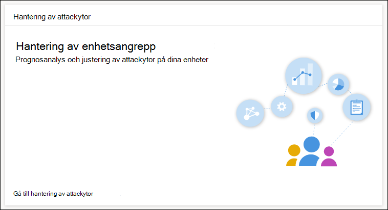

# Optimera ASR-regeldistribution och identifiering

[!INCLUDE [Microsoft 365 Defender rebranding](../../includes/microsoft-defender.md)]

**Gäller för:**
- [Microsoft Defender för Endpoint](https://go.microsoft.com/fwlink/p/?linkid=2154037)
- [Microsoft 365 Defender](https://go.microsoft.com/fwlink/?linkid=2118804)

> Vill du använda Defender för Slutpunkt? [Registrera dig för en kostnadsfri utvärderingsversion](https://www.microsoft.com/en-us/WindowsForBusiness/windows-atp?ocid=docs-wdatp-onboardconfigure-abovefoldlink).

[ASR-regler (Attack Surface Reduction) identifierar](./attack-surface-reduction.md) och förhindrar vanliga sårbarheter från skadlig programvara. De styr när och hur potentiellt skadlig kod kan köras. De kan till exempel förhindra att JavaScript eller VBScript startar en nedladdad körbar fil, blockera Win32 API-anrop från Office-makron och blockera processer som körs från USB-enheter.

 
*Kortet Attackyta*

Kortet *för hantering av attackytor* är en startpunkt för verktyg Microsoft 365 säkerhetscenter som du kan använda för att:

* Förstå hur ASR-regler för närvarande distribueras i organisationen.
* Granska ASR-identifieringar och identifiera möjliga felaktiga identifieringar.
* Analysera effekterna av undantag och generera listan med filsökvägar som ska undantas.

Välj **Gå till regler för övervakning av attackytor**& i > för minskning av  >  **attackytor > Lägg till undantag**. Därifrån kan du navigera till andra avsnitt i Microsoft 365 Säkerhetscenter.

 
Fliken ***Lägg till undantag** på sidan För att minska attackytan i Microsoft 365 säkerhetscenter*

> [!NOTE]
> För att Microsoft 365 åtkomst till säkerhetscentret behöver du en licens Microsoft 365 E3 eller E5 och ett konto som har vissa roller på Azure Active Directory. [Läs om licenser och behörigheter som krävs.](/office365/securitycompliance/microsoft-security-and-compliance#required-licenses-and-permissions)

Mer information om distribution av ASR-regler Microsoft 365 säkerhetscenter finns i Övervaka och hantera DISTRIBUTION och identifiering av [ASR-regler.](/office365/securitycompliance/monitor-devices#monitor-and-manage-asr-rule-deployment-and-detections)

**Närliggande ämnen**

* [Se till att dina enheter är korrekt konfigurerade](configure-machines.md)
* [Få enheter skickade till Microsoft Defender för Endpoint](configure-machines-onboarding.md)
* [Övervaka efterlevnad av Microsoft Defender för slutpunktens säkerhetsbaslinje](configure-machines-security-baseline.md)
