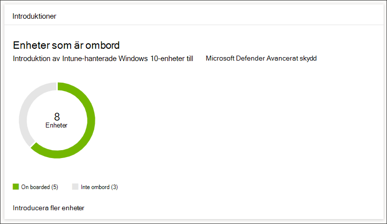
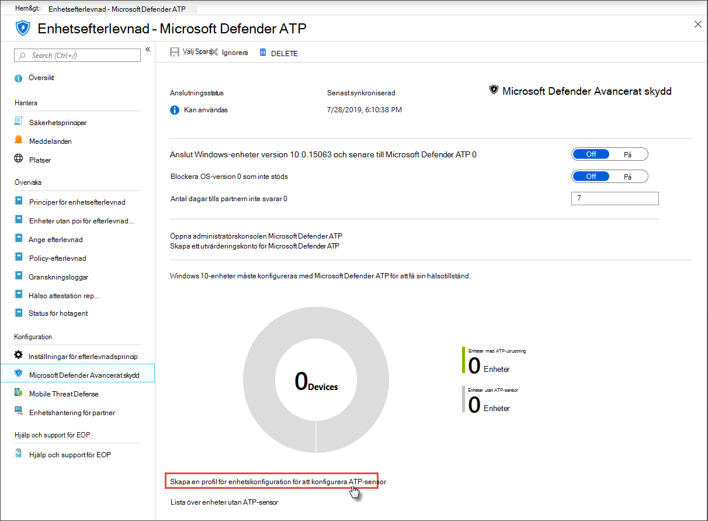

# Få enheter skickade till Microsoft Defender för Endpoint

[!INCLUDE [Microsoft 365 Defender rebranding](../../includes/microsoft-defender.md)]

**Gäller för:**
- [Microsoft Defender för Endpoint](https://go.microsoft.com/fwlink/p/?linkid=2154037)
- [Microsoft 365 Defender](https://go.microsoft.com/fwlink/?linkid=2118804)

>Vill du uppleva Microsoft Defender för Slutpunkt? [Registrera dig för en kostnadsfri utvärderingsversion.](https://www.microsoft.com/microsoft-365/windows/microsoft-defender-atp?ocid=docs-wdatp-onboardconfigure-abovefoldlink)

Varje onboarded device lägger till ytterligare en slutpunktsidentifiering och svars sensor (EDR) och ökar synligheten över intrångsaktivitet i nätverket. Onboarding ser också till att en enhet kan kontrolleras för sårbara komponenter och problem med säkerhetskonfigurationen och kan ta emot kritiska åtgärdsåtgärder under attacker.

Innan du kan spåra och hantera registrering av enheter:
- [Registrera dina enheter till Intune-hantering](configure-machines.md#enroll-devices-to-intune-management)
- [Kontrollera att du har de behörigheter som krävs](configure-machines.md#obtain-required-permissions)

## Hitta och spåra oskyddade enheter

**Onboarding-kortet** ger en översikt över din registreringshastighet genom att jämföra antalet Windows 10-enheter som faktiskt har onboarded to Defender för Endpoint med det totala antalet Intune-hanterade Windows 10-enheter.

 
*Kort som visar onboarded-enheter jämfört med det totala antalet Intune-hanterade Windows 10-enheter*

>[!NOTE]
>Om du använde Säkerhetscenter Configuration Manager, onboarding-skriptet eller andra onboarding-metoder som inte använder Intune-profiler kan det uppstå dataavvikheter. Om du vill lösa de här avvikelserna skapar du en motsvarande Intune-konfigurationsprofil för Defender för slutpunkts onboarding och tilldelar den profilen till dina enheter.

## Introducera fler enheter med Intune-profiler

Defender för Endpoint innehåller flera praktiska alternativ för [registrering av Windows 10-enheter.](onboard-configure.md) För Intune-hanterade enheter kan du använda Intune-profiler för att enkelt distribuera Defender för Slutpunkts sensor för att välja enheter, vilket effektivt introduktions av dessa enheter till tjänsten.

På **introduktionskortet** väljer du **Onboard more devices för** att skapa och tilldela en profil i Intune. Länken tar dig till sidan enhetsefterlevnad på Intune, som ger en liknande översikt över din registrering.

 
   *Sidan Microsoft Defender för Slutpunktens enhetsefterlevnad på Intune-enhetshantering*

>[!TIP]
>Alternativt kan du gå till sidan Defender för slutpunktsefterlevnad för registrering av slutpunkt i [Microsoft Azure-portalen](https://portal.azure.com/) från Alla tjänster **> Intune > Enhetsefterlevnad > Microsoft Defender ATP**.

>[!NOTE]
> Om du vill visa de senaste enhetsdata klickar du på Lista över **enheter utan ATP-sensor**.

På sidan för enhetsefterlevnad skapar du en konfigurationsprofil specifikt för distributionen av Defender för slutpunkts sensor och tilldelar den profilen till de enheter som du vill registrera. Det kan du göra genom att antingen:

- Välj **Skapa en profil för enhetskonfiguration om du vill konfigurera ATP-sensorn** så att den börjar med en fördefinierad enhetskonfigurationsprofil.
- Skapa profilen för enhetskonfiguration från grunden.

Mer information finns i [om hur du använder konfigurationsprofiler för Intune-enheter för att registrera enheter i Defender för slutpunkt.](https://docs.microsoft.com/intune/advanced-threat-protection#onboard-devices-by-using-a-configuration-profile)

>Vill du uppleva Microsoft Defender ATP? [Registrera dig för en kostnadsfri utvärderingsversion.](https://www.microsoft.com/microsoft-365/windows/microsoft-defender-atp?ocid=docs-wdatp-onboardconfigure-belowfoldlink)

## Relaterade ämnen
- [Se till att dina enheter är korrekt konfigurerade](configure-machines.md)
- [Öka efterlevnad för Defender för slutpunktens säkerhetsbaslinje](configure-machines-security-baseline.md)
- [Optimera ASR-regeldistribution och identifiering](configure-machines-asr.md)
