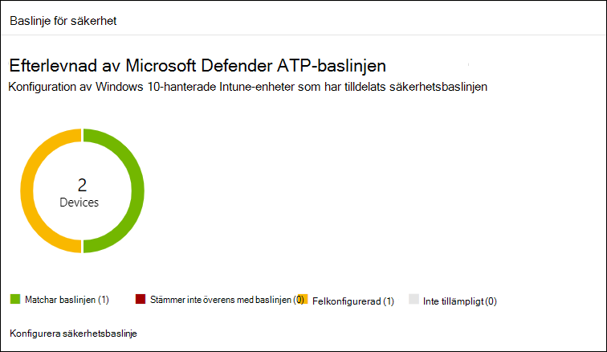
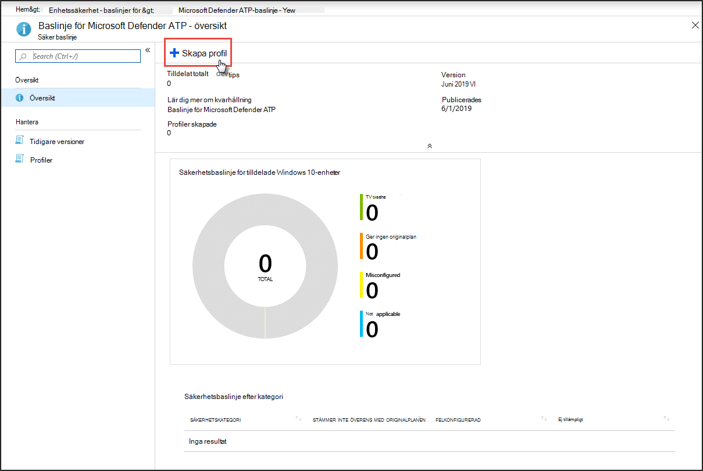
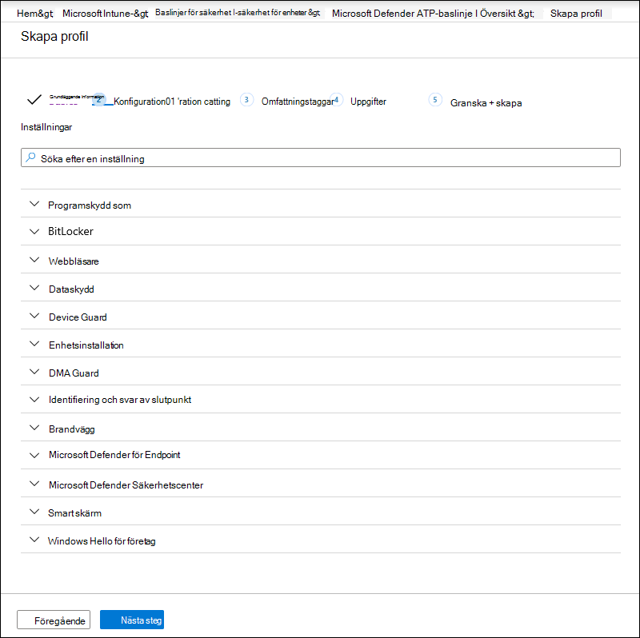
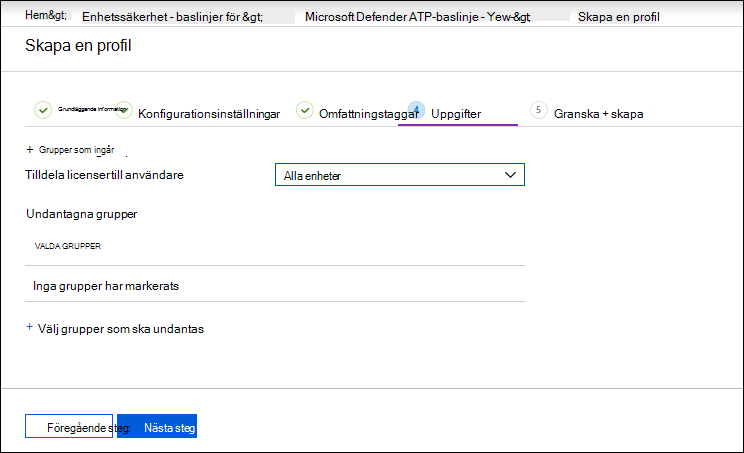
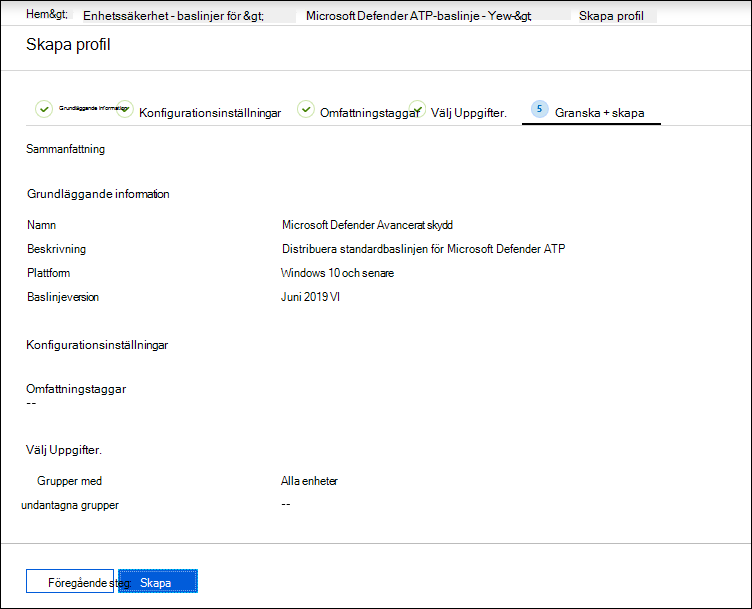

# Öka efterlevnad för Microsoft Defender för slutpunktens säkerhetsbaslinje

[!INCLUDE [Microsoft 365 Defender rebranding](../../includes/microsoft-defender.md)]

**Gäller för:**
- [Microsoft Defender för Endpoint](https://go.microsoft.com/fwlink/p/?linkid=2154037)
- [Microsoft 365 Defender](https://go.microsoft.com/fwlink/?linkid=2118804)

>Vill du använda Defender för Slutpunkt? [Registrera dig för en kostnadsfri utvärderingsversion.](https://www.microsoft.com/microsoft-365/windows/microsoft-defender-atp?ocid=docs-wdatp-onboardconfigure-abovefoldlink)

Säkerhetsbaslinjer säkerställer att säkerhetsfunktionerna konfigureras enligt vägledning från både säkerhetsexperter och experta Windows-systemadministratörer. När den har distribuerats ger Defender för Slutpunktens säkerhetsbaslinje baslinje Defender för slutpunktssäkerhetskontroller för att ge optimalt skydd.

Läs följande vanliga frågor och svar för att förstå säkerhetsbaslinjer och hur de tilldelas på Intune [med hjälp av konfigurationsprofiler.](https://docs.microsoft.com/intune/security-baselines#q--a)

Innan du kan distribuera och spåra efterlevnad för säkerhetsbaslinjer:
- [Registrera dina enheter till Intune-hantering](configure-machines.md#enroll-devices-to-intune-management)
- [Kontrollera att du har de behörigheter som krävs](configure-machines.md#obtain-required-permissions)

## Jämför Säkerhetsbaslinjer för Microsoft Defender för Slutpunkt och Windows Intune
Säkerhetsbaslinjen för Windows Intune innehåller en omfattande uppsättning rekommenderade inställningar som krävs för att säkert konfigurera enheter som kör Windows, inklusive webbläsarinställningar, PowerShell-inställningar samt inställningar för vissa säkerhetsfunktioner som Microsoft Defender Antivirus. Defender för slutpunktsbaslinje tillhandahåller däremot inställningar som optimerar alla säkerhetskontroller i Defender för slutpunktsstacken, inklusive inställningar för identifiering av slutpunkt och svar (EDR) samt inställningar som också finns i Windows Intune-säkerhetsbaslinjen. Mer information om varje baslinje finns i:

- [Inställningar för Windows-säkerhetsbaslinje för Intune](https://docs.microsoft.com/intune/security-baseline-settings-windows)
- [Baslinjeinställningar för Microsoft Defender för Slutpunkt för Intune](https://docs.microsoft.com/intune/security-baseline-settings-defender-atp)

Under idealiska förhållanden distribueras enheter som finns i Defender för Slutpunkt med båda baslinjerna: Säkerhetsbaslinjen för Windows Intune till att först skydda Windows och sedan Defender för slutpunktens säkerhetsbaslinje lagd ovanpå för att optimalt konfigurera Defender för slutpunktssäkerhetskontroller. För att dra nytta av de senaste data om risker och hot och för att minimera konflikter allt eftersom baslinjer utvecklas ska du alltid använda de senaste versionerna av baslinjerna för alla produkter så snart de släpps.

>[!NOTE]
>Säkerhetsbaslinjen för Defender för slutpunkt har optimerats för fysiska enheter och rekommenderas för närvarande inte för användning på virtuella maskiner eller VDI-slutpunkter. Vissa baslinjeinställningar kan påverka fjärranslutna interaktiva sessioner i virtualiserade miljöer.

## Övervaka efterlevnad av Defender för slutpunktens säkerhetsbaslinje

Kortet **med säkerhetsbaslinje** för hantering av [enhetskonfiguration](configure-machines.md) ger en översikt över efterlevnad för alla Windows 10-enheter som har tilldelats Defender för slutpunktens säkerhetsbaslinje.

 
*Kort som visar efterlevnad för Defender för slutpunktens säkerhetsbaslinje*

Varje enhet ges en av följande statustyper:

- **Matchar baslinjen**– enhetsinställningarna matchar alla inställningar i baslinjen
- **Stämmer inte in på** baslinjen – minst en enhetsinställning matchar inte baslinjen
- **Felkonfigurerad**– minst en baslinjeinställning är inte korrekt konfigurerad på enheten och statusen är konflikt, fel eller väntande
- **Inte tillämpligt**– minst en baslinjeinställning är inte tillämplig på enheten

Om du vill granska vissa enheter väljer **du Konfigurera säkerhetsbaslinje** på kortet. Då kommer du till Intune-enhetshantering. Därifrån väljer **du Enhetsstatus** för namn och status för enheterna.

>[!NOTE]
>Det kan hända att avvikelser visas i aggregerade data på sidan Konfigurationshantering för enheter och data som visas på översiktsskärmar i Intune.

## Granska och tilldela Microsoft Defender för slutpunktens säkerhetsbaslinje

Enhetshantering övervakar endast grundläggande efterlevnad av Windows 10-enheter som specifikt har tilldelats Microsoft Defender för slutpunktens säkerhetsbaslinje. Du kan enkelt granska baslinjen och tilldela den till enheter med Intune-enhetshantering.

1. Välj **Konfigurera säkerhetsbaslinje** på kortet **Säkerhetsbaslinje** om du vill gå till Intune-enhetshantering. En liknande översikt över grundläggande efterlevnad visas.

   >[!TIP]
   > Alternativt kan du navigera till säkerhetsbaslinjen för Defender för slutpunkt i Microsoft Azure-portalen från Alla tjänster **> Intune > Enhetssäkerhet > Säkerhetsbaslinjer > baslinje > Microsoft Defender ATP.**

2. Skapa en ny profil.

    
   *Översikt över Säkerhetsbaslinje för Microsoft Defender för Slutpunkt på Intune*

3. När du skapar en profil kan du granska och justera specifika inställningar för originalplanen.

    
   *Alternativ för säkerhetsbaslinje vid profilskapande på Intune*

4. Tilldela profilen till rätt enhetsgrupp.

    
   *Tilldela säkerhetsbaslinjeprofilen i Intune*

5. Skapa profilen för att spara den och distribuera den till den tilldelade enhetsgruppen.

    
   *Skapa säkerhetsbaslinjeprofilen i Intune*

>[!TIP]
>Säkerhetsbaslinjer för Intune är ett bekvämt sätt att skydda dina enheter på ett fullständigt säkert sätt. [Läs mer om säkerhetsbaslinjer i Intune](https://docs.microsoft.com/intune/security-baselines).

>Vill du uppleva Microsoft Defender för Slutpunkt? [Registrera dig för en kostnadsfri utvärderingsversion.](https://www.microsoft.com/microsoft-365/windows/microsoft-defender-atp?ocid=docs-wdatp-onboardconfigure-belowfoldlink)

## Relaterade ämnen
- [Se till att dina enheter är korrekt konfigurerade](configure-machines.md)
- [Få enheter skickade till Microsoft Defender för Endpoint](configure-machines-onboarding.md)
- [Optimera ASR-regeldistribution och identifiering](configure-machines-asr.md)
