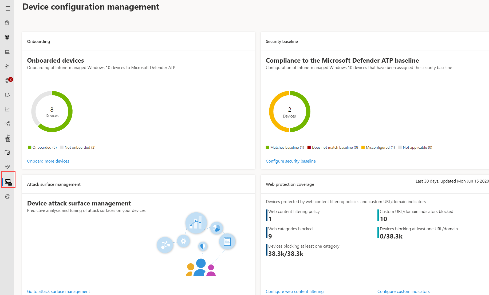
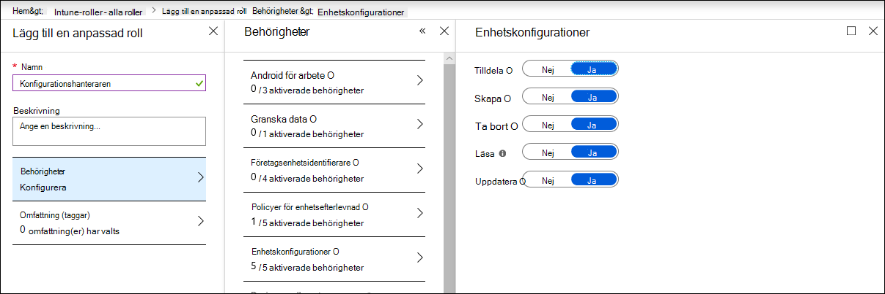

# Se till att dina enheter är korrekt konfigurerade

[!INCLUDE [Microsoft 365 Defender rebranding](../../includes/microsoft-defender.md)]

**Gäller för:**
- [Microsoft Defender för Endpoint](https://go.microsoft.com/fwlink/p/?linkid=2154037)
- [Microsoft 365 Defender](https://go.microsoft.com/fwlink/?linkid=2118804)

>Vill du använda Defender för Slutpunkt? [Registrera dig för en kostnadsfri utvärderingsversion.](https://www.microsoft.com/microsoft-365/windows/microsoft-defender-atp?ocid=docs-wdatp-onboardconfigure-abovefoldlink)

Med korrekt konfigurerade enheter kan du öka den totala motståndskraft mot hot och förbättra din förmåga att identifiera och reagera på attacker. Med hjälp av säkerhetskonfigurationshantering kan du säkerställa att dina enheter:

- Gå till Microsoft Defender för Slutpunkt
- Möt eller överskrider konfiguration av säkerhetsbaslinje för Defender för slutpunkt
- Gör åtgärder för strategiska attackytor på plats

Klicka **på Konfigurationshantering** i navigeringsmenyn för att öppna sidan Hantering av enhetskonfiguration.

 
*Sida för hantering av enhetskonfiguration*

Du kan spåra konfigurationsstatus på organisationsnivå och snabbt vidta åtgärder som svar på dålig täckning under onboarding, efterlevnadsproblem och dåligt optimerade minskningar av attackytan genom direkta, djupa länkar till sidor för enhetshantering på Microsoft Intune och Microsoft 365 säkerhetscenter.

När du gör det har du nytta av följande:
- Omfattande synlighet för händelser på dina enheter
- Robust information om hot och kraftfulla enhetsinlärningstekniker för bearbetning av rådata och identifiering av intrångsaktivitet och hotindikatorer
- En komplett hög med säkerhetsfunktioner som är konfigurerade för att effektivt stoppa installationen av skadliga program, kapning av systemfiler och systemfiler, datainfiltrering och andra hotaktiviteter
- Optimerade minskningar av attackytor, maximera strategiska skydd mot hotaktivitet samtidigt som påverkan på produktiviteten minimeras

## Registrera enheter till Intune-hantering

Hantering av enhetskonfigurationer fungerar nära med intune enhetshantering för att upprätta inventeringen av enheterna i din organisation och den grundläggande säkerhetskonfigurationen. Du kommer att kunna spåra och hantera konfigurationsproblem på Intune-hanterade Windows 10 enheter.

Innan du kan se till att dina enheter har konfigurerats korrekt bör du registrera dem i Intune-hantering. Intune-registrering är robust och har flera registreringsalternativ för Windows 10 enheter. Mer information om intune-registreringsalternativ finns i om hur du [ställer in registrering för Windows enheter.](/intune/windows-enroll)

>[!NOTE]
>För att registrera Windows enheter till Intune måste administratörer redan ha tilldelats licenser. [Läs om hur du tilldelar licenser för enhetsregistrering](/intune/licenses-assign).

>[!TIP] 
>Om du vill optimera enhetshantering via Intune [ansluter du Intune till Defender för Slutpunkt](/intune/advanced-threat-protection#enable-windows-defender-atp-in-intune).

## Skaffa behörighet som krävs
Som standard kan endast användare som har tilldelats rollen Global administratör eller Intune-tjänstadministratör i Azure AD hantera och tilldela de enhetskonfigurationsprofiler som behövs för registrering av enheter och distribuera säkerhetsbaslinjen.

Om du har tilldelats andra roller bör du kontrollera att du har rätt behörighet:

- Fullständig behörighet till enhetskonfigurationer
- Fullständig behörighet till säkerhetsbaslinjer
- Läs behörigheter till principer för enhetsefterlevnad
- Läsbehörigheter för organisationen

 
*Behörigheter för enhetskonfiguration i Intune*

>[!TIP] 
>Mer information om hur du tilldelar behörigheter för Intune finns [i Skapa anpassade roller.](/intune/create-custom-role#to-create-a-custom-role)

## I det här avsnittet
Ämne | Beskrivning
:---|:---
[Få enheter onboarded till Defender för Endpoint](configure-machines-onboarding.md)| Spåra onboardingstatus för Intune-hanterade enheter och registrera fler enheter via Intune. 
[Öka efterlevnad för Defender för slutpunktens säkerhetsbaslinje](configure-machines-security-baseline.md) | Spåra grundläggande efterlevnad och icke-efterlevnad. Distribuera säkerhetsbaslinjen till fler Intune-hanterade enheter.
[Optimera ASR-regeldistribution och identifiering](configure-machines-asr.md) | Granska regeldistribution och justera avkänningar med hjälp av effektanalysverktyg Microsoft 365 säkerhetscenter.

>Vill du använda Defender för Slutpunkt? [Registrera dig för en kostnadsfri utvärderingsversion.](https://www.microsoft.com/microsoft-365/windows/microsoft-defender-atp?ocid=docs-wdatp-onboardconfigure-belowfoldlink)
