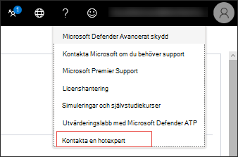

# Konfigurera och hantera funktioner för Microsoft Hotexperter

[!INCLUDE [Microsoft 365 Defender rebranding](../../includes/microsoft-defender.md)]

**Gäller för:**
- [Microsoft Defender för Endpoint](https://go.microsoft.com/fwlink/p/?linkid=2154037)
- [Microsoft 365 Defender](https://go.microsoft.com/fwlink/?linkid=2118804)

>Vill du använda Defender för Slutpunkt? [Registrera dig för en kostnadsfri utvärderingsversion.](https://www.microsoft.com/microsoft-365/windows/microsoft-defender-atp?ocid=docs-wdatp-assignaccess-abovefoldlink)

## Innan du börjar 
> [!NOTE]
> Diskutera kraven för berättigande med din Microsoft-leverantör och ditt kontoteam innan du ansökar om Microsoft Hotexperter – Riktad attackmeddelande hanterad säkerhetstjänst för hot.

Se till att du har Defender för slutpunkt distribuerad i din miljö med registrerade enheter och inte bara på en miljö.

Om du är Defender för slutpunktskund måste du söka efter **Microsoft Hotexperter – Riktade** attackmeddelanden för att få särskilda insikter och analyser som hjälper dig att identifiera de viktigaste hoten, så att du kan svara på dem snabbt. Kontakta ditt kontoteam eller din Microsoft-representant för att prenumerera **på Microsoft Hotexperter - Experts on Demand** och rådgör med våra hotexperter om relevanta identifieringar och adversaries.

## Ansök för Microsoft Hotexperter – riktad tjänst för attackmeddelanden 
Om du redan är Defender för Slutpunktskund kan du söka via Microsoft Defender Säkerhetscenter. 

1. Från navigeringsfönstret går du till fliken **Inställningar > för > Avancerade > Microsoft Hotexperter - Riktade attackmeddelanden.**

2. Klicka på **Använd**.

    

3. Ange ditt namn och din e-postadress så att Microsoft kan kontakta dig i programmet.

    

4. Läs [sekretesspolicyn och](https://privacy.microsoft.com/en-us/privacystatement)klicka sedan på **Skicka** när du är klar. Du får ett välkomstmeddelande via e-post när din ansökan har godkänts.

    

När du accepterar får du ett välkomstmeddelande  via e-post och du ser knappen Använd ändras till en växlingsknapp som är "på". Om du vill ta dig själv från tjänsten Riktad attackmeddelanden drar du reglaget "av" och klickar på Spara **inställningar** längst ned på sidan. 

## Var du ser riktade attackmeddelanden från Microsoft Hotexperter 
Du kan få riktade attackmeddelanden från Microsoft Hotexperter via följande medium:  
- Sidan Incidenter för Defender för **Slutpunktsportalen** 
- Instrumentpanelen Aviseringar i Defender för **Slutpunktsportalen**  
- OData-avisering för [API](/windows/security/threat-protection/microsoft-defender-atp/get-alerts) och [REST API](/windows/security/threat-protection/microsoft-defender-atp/pull-alerts-using-rest-api)
- [DeviceAlertEvents-tabell](/windows/security/threat-protection/microsoft-defender-atp/advanced-hunting-devicealertevents-table) i Avancerad sökning
- Din e-post, om du väljer att konfigurera den 

Om du vill ta emot riktade attackmeddelanden via e-post skapar du en regel för e-postavisering.

### Skapa en regel för e-postavisering 
Du kan skapa regler för att skicka e-postaviseringar för aviseringsmottagare. Mer  [information finns i Konfigurera](configure-email-notifications.md) aviseringsmeddelanden för att skapa, redigera, ta bort eller felsöka e-postaviseringar.

## Visa meddelandet om riktad attack  
Du börjar ta emot riktade attackaviseringar från e Microsoft Hotexperter postmeddelanden när du har konfigurerat systemet för att ta emot e-postaviseringar.  

1. Klicka på länken i e-postmeddelandet för att gå till motsvarande aviseringskontext i instrumentpanelen som är märkt **med hotexperter.** 

2. På instrumentpanelen väljer du samma aviseringsavsnitt som du fick i e-postmeddelandet för att visa informationen.  

## Prenumerera på Microsoft Hotexperter – experter på begäran
Det här är tillgängligt som en prenumerationstjänst. Om du redan är Defender för Slutpunktskund kan du kontakta din Microsoft-representant för att prenumerera på Microsoft Hotexperter - Experter på begäran. 

## Kontakta en Microsoft-expert om misstänkt cybersäkerhet i din organisation 
Ni kan samarbeta med Microsoft Hotexperter som kan vara engagerade direkt i mötet Microsoft Defender Säkerhetscenter få snabba och korrekta svar. Experter tillhandahåller insikter för att bättre förstå komplexa hot, riktade attackmeddelanden som du får eller om du behöver mer information om aviseringar, en potentiellt komprometterad enhet eller ett informationssammanhang för hot som visas på din portalinstrumentpanel. 

> [!NOTE]
> - Vi har för närvarande inte stöd för förfrågningar som rör din organisations anpassade hotinformation. Kontakta din säkerhetsgrupp eller ditt svarsteam för incidenter.
> - Du måste ha behörigheten **Hantera** säkerhetsinställningar i Säkerhetscenter-portalen för att kunna skicka en förfrågan om att "Kontakta en hotexpert".

1. Gå till portalsidan med relevant information som du vill undersöka, till exempel **sidan Incident.** Kontrollera att sidan för den relevanta aviseringen eller enheten visas innan du skickar en undersökningsförfrågan. 

2. I den övre högra menyn klickar du på **?** . Välj sedan **Rådgör med en hotexpert**. 

    

    En utfälld skärm öppnas. Följande skärm visas när du använder en utvärderingsprenumeration.

    

    Följande skärm visar när du är på en fullständig Microsoft Hotexperter - Experter på begäran-prenumeration.

    

    Fältet **Inquiry topic** är förifylld med länken till den relevanta sidan för din undersökningsförfrågan. Till exempel en länk till sidan incident, avisering eller enhetsinformation som du var på när du gjorde begäran.

3.  Ange tillräckligt med information i nästa fält för att ge Microsoft Hotexperter tillräckligt med kontext för att starta undersökningen.
  
4. Ange den e-postadress som du vill använda för att motsvara Microsoft Hotexperter.

> [!NOTE]
> Om du vill spåra statusen för ärenden för experter på begäran via Microsoft Services Hub kan du kontakta din Technical Account Manager. 

Titta på den här videon för en snabb överblick över Microsoft Services-hubben.

>[!VIDEO https://www.microsoft.com/videoplayer/embed/RE4pk9f] 

   
## Exempel på undersökningsämnen som du kan rådgöra med Microsoft Hotexperter – experter på begäran 

**Aviseringsinformation**
- Vi ser en ny typ av avisering för binär aningen off-the-land: [AlertID]. Kan du berätta något mer om den här aviseringen och hur vi kan undersöka ytterligare?
- Vi har observerat två liknande attacker som försöker köra skadliga PowerShell-skript men generera olika aviseringar. Den ena är "Misstänkt PowerShell-kommandorad" och den andra är "En skadlig fil upptäcktes baserat på indikering från O365". Vad är skillnaden?
- Jag får en udda avisering idag om felaktigt antal misslyckade inloggningar från en användares enhet. Jag kan inte hitta några ytterligare bevis för dessa inloggningsförsök. Hur kan Defender för Endpoint se de här försöken? Vilken typ av inloggning övervakas?
- Du kan ge mer kontext eller insikter om den här aviseringen: "Misstänkt beteende hos ett systemverktyg har observerats". 

**Möjlig datorkompromettering**
- Kan du svara på varför vi ser "Okänd process observerad?" Det här meddelandet eller meddelandet visas ofta på många enheter. Vi uppskattar eventuella synpunkter för att klargöra om det här meddelandet eller aviseringen är relaterat till skadlig aktivitet.
- Kan du verifiera en möjlig intrång i följande system [datum] med liknande beteenden som den tidigare identifieringen av skadlig programvara för samma system under [månad]?

**Information om hotinformation**
- Vi har upptäckt ett nätfiskemeddelande som levererade ett skadligt Word-dokument till en användare. Det skadliga Word-dokumentet orsakade en serie misstänkta händelser som utlöste flera Microsoft Defender-varningar för skadlig programvara (malware name). Har du någon information om den här skadlig programvara? Om ja, kan du skicka mig en länk?
- Jag såg nyligen en referens från [sociala medier, till exempel Twitter eller en blogg] om ett hot som riktar sig till min bransch. Kan du hjälpa mig förstå vilket skydd Defender för Endpoint tillhandahåller mot den här hotspelaren? 

**Microsoft Hotexperter aviseringsmeddelanden** 
- Kan ditt svarsteam för incidenter hjälpa oss att hantera det riktade attackmeddelandet vi fick?
- Jag fick den här riktade attackmeddelandet från Microsoft Hotexperter. Vi har inte vårt eget svarsteam för incidenter. Vad kan vi göra nu och hur kan vi begränsa händelsen?
- Jag fick ett riktad attackmeddelande från Microsoft Hotexperter. Vilka data kan du ge oss som vi kan skicka till vårt svarsteam för incidenter?

  >[!NOTE]
  >Microsoft Hotexperter är en hanterad säkerhetstjänst för cybersäkerhet och inte en incidenttjänst. Vid behov kan experterna vid behov smidigt gå över undersökningen till TJÄNSTEN Microsoft Cybersecurity Solutions Group (CSG) för tjänsten Detection and Response Team (PHOTOSHOP). Du kan också välja att kommunicera med din egen svarsgrupp för incidenter för att åtgärda problem som kräver ett incidentsvar. 

## Scenario

### Få en förloppsrapport om din förfrågan om hanterad förfrågan 
Svar från Microsoft Hotexperter varierar beroende på din förfrågan. De skickar en förloppsrapport  via e-post till dig om en expert på hot inom två dagar för att informera om undersökningsstatus från följande kategorier: 
- Mer information krävs för att fortsätta med undersökningen 
- Det krävs en eller flera filexempel för att avgöra det tekniska sammanhanget 
- Undersökning kräver mer tid   
- Den inledande informationen var tillräcklig för att slutföra undersökningen 

Det är centralt att du svarar snabbt för att hålla undersökningen i rörelse. 

## Relaterat ämne
- [Översikt över Microsoft Hotexperter](microsoft-threat-experts.md)
- [Microsoft Hotexperter i Microsoft 365 Översikt](/microsoft-365/security/mtp/microsoft-threat-experts)
