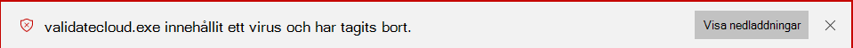
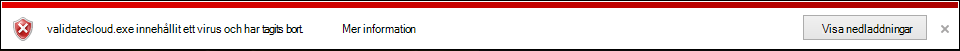

# <a name="configure-and-validate-microsoft-defender-antivirus-network-connections"></a><span data-ttu-id="a38d8-104">Konfigurera och verifiera nätverksanslutningar för Microsoft Defender Antivirus</span><span class="sxs-lookup"><span data-stu-id="a38d8-104">Configure and validate Microsoft Defender Antivirus network connections</span></span>

<span data-ttu-id="a38d8-105">**Gäller för:**</span><span class="sxs-lookup"><span data-stu-id="a38d8-105">**Applies to:**</span></span>

- [<span data-ttu-id="a38d8-106">Microsoft Defender för Endpoint</span><span class="sxs-lookup"><span data-stu-id="a38d8-106">Microsoft Defender for Endpoint</span></span>](/microsoft-365/security/defender-endpoint/)

<span data-ttu-id="a38d8-107">Om du Microsoft Defender Antivirus att moln levererat-skydd fungerar korrekt måste du konfigurera nätverket så att anslutningar tillåts mellan slutpunkterna och vissa Microsoft-servrar.</span><span class="sxs-lookup"><span data-stu-id="a38d8-107">To ensure Microsoft Defender Antivirus cloud-delivered protection works properly, you need to configure your network to allow connections between your endpoints and certain Microsoft servers.</span></span> <span data-ttu-id="a38d8-108">Den här artikeln innehåller en lista över de anslutningar som måste tillåtas, till exempel genom att använda brandväggsregler, och innehåller instruktioner för att verifiera anslutningen.</span><span class="sxs-lookup"><span data-stu-id="a38d8-108">This article lists the connections that must be allowed, such as by using firewall rules, and provides instructions for validating your connection.</span></span> <span data-ttu-id="a38d8-109">Om du konfigurerar skyddet på rätt sätt får du bästa möjliga värde från dina moln leveransskyddstjänster.</span><span class="sxs-lookup"><span data-stu-id="a38d8-109">Configuring your protection properly helps ensure that you receive the best value from your cloud-delivered protection services.</span></span>

<span data-ttu-id="a38d8-110">Mer information om [nätverksanslutningen finns i blogginlägget Viktiga](https://techcommunity.microsoft.com/t5/Configuration-Manager-Archive/Important-changes-to-Microsoft-Active-Protection-Service-MAPS/ba-p/274006) ändringar av Microsoft Active Protection Services-slutpunkten.</span><span class="sxs-lookup"><span data-stu-id="a38d8-110">See the blog post [Important changes to Microsoft Active Protection Services endpoint](https://techcommunity.microsoft.com/t5/Configuration-Manager-Archive/Important-changes-to-Microsoft-Active-Protection-Service-MAPS/ba-p/274006) for some details about network connectivity.</span></span>

> [!TIP]
> <span data-ttu-id="a38d8-111">Du kan också besöka demowebbplatsen Microsoft Defender för slutpunkt [på demo.wd.microsoft.com](https://demo.wd.microsoft.com?ocid=cx-wddocs-testground) för att bekräfta att följande funktioner fungerar:</span><span class="sxs-lookup"><span data-stu-id="a38d8-111">You can also visit the Microsoft Defender for Endpoint demo website at [demo.wd.microsoft.com](https://demo.wd.microsoft.com?ocid=cx-wddocs-testground) to confirm the following features are working:</span></span>
>
> - <span data-ttu-id="a38d8-112">Molnbaserat skydd</span><span class="sxs-lookup"><span data-stu-id="a38d8-112">Cloud-delivered protection</span></span>
> - <span data-ttu-id="a38d8-113">Fast learning (inklusive block vid första synen)</span><span class="sxs-lookup"><span data-stu-id="a38d8-113">Fast learning (including block at first sight)</span></span>
> - <span data-ttu-id="a38d8-114">Potentiellt oönskad programblockering</span><span class="sxs-lookup"><span data-stu-id="a38d8-114">Potentially unwanted application blocking</span></span>

## <a name="allow-connections-to-the-microsoft-defender-antivirus-cloud-service"></a><span data-ttu-id="a38d8-115">Tillåt anslutningar till Microsoft Defender Antivirus molntjänsten</span><span class="sxs-lookup"><span data-stu-id="a38d8-115">Allow connections to the Microsoft Defender Antivirus cloud service</span></span>

<span data-ttu-id="a38d8-116">Den Microsoft Defender Antivirus tjänst i molnet ger snabbt och starkt skydd för dina slutpunkter.</span><span class="sxs-lookup"><span data-stu-id="a38d8-116">The Microsoft Defender Antivirus cloud service provides fast, strong protection for your endpoints.</span></span> <span data-ttu-id="a38d8-117">Aktivering av den molnbaserade skyddstjänsten är valfri, men vi rekommenderar starkt att den ger ett viktigt skydd mot skadlig programvara på slutpunkter och i nätverket.</span><span class="sxs-lookup"><span data-stu-id="a38d8-117">Enabling the cloud-delivered protection service is optional, however it's highly recommended because it provides important protection against malware on your endpoints and across your network.</span></span>

> [!NOTE]
> <span data-ttu-id="a38d8-118">Den Microsoft Defender Antivirus molntjänsten är en mekanism för att tillhandahålla uppdaterat skydd till nätverket och slutpunkterna.</span><span class="sxs-lookup"><span data-stu-id="a38d8-118">The Microsoft Defender Antivirus cloud service is a mechanism for delivering updated protection to your network and endpoints.</span></span> <span data-ttu-id="a38d8-119">Trots att det kallas för molntjänst är det inte bara skydd för filer som lagras i molnet utan använder distribuerade resurser och maskininlärning för att ge skydd till slutpunkterna i en takt som är mycket snabbare än traditionella säkerhetsintelligensuppdateringar.</span><span class="sxs-lookup"><span data-stu-id="a38d8-119">Although it's called a cloud service, it's not simply protection for files stored in the cloud, rather it uses distributed resources and machine learning to deliver protection to your endpoints at a rate that is far faster than traditional Security intelligence updates.</span></span>

<span data-ttu-id="a38d8-120">Mer [information om](enable-cloud-protection-microsoft-defender-antivirus.md) hur du aktiverar tjänsten med Intune, Microsoft Endpoint Configuration Manager, Grupprincip, PowerShell-cmdlets eller på enskilda klienter i Windows-säkerhet-appen finns i Aktivera moln levererat skydd.</span><span class="sxs-lookup"><span data-stu-id="a38d8-120">See [Enable cloud-delivered protection](enable-cloud-protection-microsoft-defender-antivirus.md) for details on enabling the service with Intune, Microsoft Endpoint Configuration Manager, Group Policy, PowerShell cmdlets, or on individual clients in the Windows Security app.</span></span> 

<span data-ttu-id="a38d8-121">När du har aktiverat tjänsten kan du behöva konfigurera nätverket eller brandväggen för att tillåta anslutningar mellan den och dina slutpunkter.</span><span class="sxs-lookup"><span data-stu-id="a38d8-121">After you've enabled the service, you may need to configure your network or firewall to allow connections between it and your endpoints.</span></span>

<span data-ttu-id="a38d8-122">Eftersom ditt skydd är en molntjänst måste datorerna ha åtkomst till Internet och kunna nå Microsoft Defender för Office 365 maskininlärningstjänster.</span><span class="sxs-lookup"><span data-stu-id="a38d8-122">Because your protection is a cloud service, computers must have access to the internet and reach the Microsoft Defender for Office 365 machine learning services.</span></span> <span data-ttu-id="a38d8-123">Exkludera inte URL:en `*.blob.core.windows.net` från någon typ av nätverksinspektion.</span><span class="sxs-lookup"><span data-stu-id="a38d8-123">Don't exclude the URL `*.blob.core.windows.net` from any kind of network inspection.</span></span> 

<span data-ttu-id="a38d8-124">I tabellen nedan visas tjänsterna och deras tillhörande URL:er.</span><span class="sxs-lookup"><span data-stu-id="a38d8-124">The table below lists the services and their associated URLs.</span></span> <span data-ttu-id="a38d8-125">Kontrollera att det inte finns några brandväggs- eller nätverksfiltreringsregler som nekar åtkomst till url-adresserna, eller så kan du behöva skapa en tillåta-regel specifikt för dem (undantaget `*.blob.core.windows.net` URL:en).</span><span class="sxs-lookup"><span data-stu-id="a38d8-125">Make sure that there are no firewall or network filtering rules denying access to these URLs, or you may need to create an allow rule specifically for them (excluding the URL `*.blob.core.windows.net`).</span></span> <span data-ttu-id="a38d8-126">Omnämnande URL:er använder port 443 för kommunikation.</span><span class="sxs-lookup"><span data-stu-id="a38d8-126">Below mention URLs are using port 443 for communication.</span></span>


| <span data-ttu-id="a38d8-127">**Tjänst**</span><span class="sxs-lookup"><span data-stu-id="a38d8-127">**Service**</span></span>| <span data-ttu-id="a38d8-128">**Beskrivning**</span><span class="sxs-lookup"><span data-stu-id="a38d8-128">**Description**</span></span> |<span data-ttu-id="a38d8-129">**URL**</span><span class="sxs-lookup"><span data-stu-id="a38d8-129">**URL**</span></span> |
| :--: | :-- | :-- |
| <span data-ttu-id="a38d8-130">Microsoft Defender Antivirus moln levererad skyddstjänst, även kallad Microsoft Active Protection Service (MAPS)</span><span class="sxs-lookup"><span data-stu-id="a38d8-130">Microsoft Defender Antivirus cloud-delivered protection service, also referred to as Microsoft Active Protection Service (MAPS)</span></span>|<span data-ttu-id="a38d8-131">Används av Microsoft Defender Antivirus för att ge moln levererat skydd</span><span class="sxs-lookup"><span data-stu-id="a38d8-131">Used by Microsoft Defender Antivirus to provide cloud-delivered protection</span></span>|`*.wdcp.microsoft.com` <br/> `*.wdcpalt.microsoft.com` <br/> `*.wd.microsoft.com`|
| <span data-ttu-id="a38d8-132">Microsoft Update Service (MU)</span><span class="sxs-lookup"><span data-stu-id="a38d8-132">Microsoft Update Service (MU)</span></span> <br/> <span data-ttu-id="a38d8-133">Windows Uppdateringstjänst (WU)</span><span class="sxs-lookup"><span data-stu-id="a38d8-133">Windows Update Service (WU)</span></span>|  <span data-ttu-id="a38d8-134">Säkerhetsinformation och produktuppdateringar</span><span class="sxs-lookup"><span data-stu-id="a38d8-134">Security intelligence and product updates</span></span>   |`*.update.microsoft.com` <br/> `*.delivery.mp.microsoft.com`<br/> `*.windowsupdate.com` <br/><br/> <span data-ttu-id="a38d8-135">Mer information finns [i Anslutningsslutpunkter för Windows Uppdatering](/windows/privacy/manage-windows-1709-endpoints#windows-update)</span><span class="sxs-lookup"><span data-stu-id="a38d8-135">For details see [Connection endpoints for Windows Update](/windows/privacy/manage-windows-1709-endpoints#windows-update)</span></span>|
|<span data-ttu-id="a38d8-136">Alternativ nedladdningsplats för säkerhetsintelligensuppdateringar (ADL)</span><span class="sxs-lookup"><span data-stu-id="a38d8-136">Security intelligence updates Alternate Download Location (ADL)</span></span>|   <span data-ttu-id="a38d8-137">Alternativ plats för Microsoft Defender Antivirus säkerhetsintelligensuppdateringar om den installerade säkerhetsintelligensen är in date (7 eller fler dagar efter)</span><span class="sxs-lookup"><span data-stu-id="a38d8-137">Alternate location for Microsoft Defender Antivirus Security intelligence updates if the installed Security intelligence is out of date (7 or more days behind)</span></span>|    `*.download.microsoft.com`  </br> `*.download.windowsupdate.com`</br>  `go.microsoft.com`</br> `https://fe3cr.delivery.mp.microsoft.com/ClientWebService/client.asmx`|
| <span data-ttu-id="a38d8-138">Lagring av inskickade skadlig programvara</span><span class="sxs-lookup"><span data-stu-id="a38d8-138">Malware submission storage</span></span>|<span data-ttu-id="a38d8-139">Upload plats för filer som skickats till Microsoft via formulär för inskickning eller automatiskt exempel</span><span class="sxs-lookup"><span data-stu-id="a38d8-139">Upload location for files submitted to Microsoft via the Submission form or automatic sample submission</span></span>    | `ussus1eastprod.blob.core.windows.net` <br/>    `ussus2eastprod.blob.core.windows.net` <br/>    `ussus3eastprod.blob.core.windows.net` <br/>    `ussus4eastprod.blob.core.windows.net` <br/>    `wsus1eastprod.blob.core.windows.net` <br/>    `wsus2eastprod.blob.core.windows.net` <br/>    `ussus1westprod.blob.core.windows.net` <br/>    `ussus2westprod.blob.core.windows.net` <br/>    `ussus3westprod.blob.core.windows.net` <br/>    `ussus4westprod.blob.core.windows.net` <br/>    `wsus1westprod.blob.core.windows.net` <br/>    `wsus2westprod.blob.core.windows.net` <br/>    `usseu1northprod.blob.core.windows.net` <br/>    `wseu1northprod.blob.core.windows.net` <br/>    `usseu1westprod.blob.core.windows.net` <br/>    `wseu1westprod.blob.core.windows.net` <br/>    `ussuk1southprod.blob.core.windows.net` <br/>    `wsuk1southprod.blob.core.windows.net` <br/>    `ussuk1westprod.blob.core.windows.net` <br/>    `wsuk1westprod.blob.core.windows.net` |
| <span data-ttu-id="a38d8-140">Certifikatåterkallningslista (CRL)</span><span class="sxs-lookup"><span data-stu-id="a38d8-140">Certificate Revocation List (CRL)</span></span>|<span data-ttu-id="a38d8-141">Används av Windows när du skapar SSL-anslutningen till KARTOR för att uppdatera CRL</span><span class="sxs-lookup"><span data-stu-id="a38d8-141">Used by Windows when creating the SSL connection to MAPS for updating the CRL</span></span>   | `http://www.microsoft.com/pkiops/crl/` <br/> `http://www.microsoft.com/pkiops/certs` <br/>   `http://crl.microsoft.com/pki/crl/products` <br/> `http://www.microsoft.com/pki/certs` |
| <span data-ttu-id="a38d8-142">Symbolarkiv</span><span class="sxs-lookup"><span data-stu-id="a38d8-142">Symbol Store</span></span>|<span data-ttu-id="a38d8-143">Används av Microsoft Defender Antivirus för att återställa vissa kritiska filer under åtgärdsflöden</span><span class="sxs-lookup"><span data-stu-id="a38d8-143">Used by Microsoft Defender Antivirus to restore certain critical files during remediation flows</span></span>  | `https://msdl.microsoft.com/download/symbols` |
| <span data-ttu-id="a38d8-144">Universell telemetriklient</span><span class="sxs-lookup"><span data-stu-id="a38d8-144">Universal Telemetry Client</span></span>| <span data-ttu-id="a38d8-145">Används av Windows för att skicka klientdiagnostikdata. Microsoft Defender Antivirus använder telemetri för övervakning av produktkvalitet</span><span class="sxs-lookup"><span data-stu-id="a38d8-145">Used by Windows to send client diagnostic data; Microsoft Defender Antivirus uses telemetry for product quality monitoring purposes</span></span>   | <span data-ttu-id="a38d8-146">Uppdateringen använder SSL (TCP Port 443) för att ladda ned manifest och ladda upp diagnostikdata till Microsoft som använder följande DNS-slutpunkter:   `vortex-win.data.microsoft.com`</span><span class="sxs-lookup"><span data-stu-id="a38d8-146">The update uses SSL (TCP Port 443) to download manifests and upload diagnostic data to Microsoft that uses the following DNS endpoints:   `vortex-win.data.microsoft.com`</span></span> <br/>   `settings-win.data.microsoft.com`|

## <a name="validate-connections-between-your-network-and-the-cloud"></a><span data-ttu-id="a38d8-147">Verifiera anslutningar mellan ditt nätverk och molnet</span><span class="sxs-lookup"><span data-stu-id="a38d8-147">Validate connections between your network and the cloud</span></span>

<span data-ttu-id="a38d8-148">När du har tillått webbadresserna ovan kan du testa om du är ansluten till Microsoft Defender Antivirus-molntjänsten och rapporterar och tar emot information på rätt sätt för att säkerställa att du är helt skyddad.</span><span class="sxs-lookup"><span data-stu-id="a38d8-148">After allowing the URLs listed above, you can test if you're connected to the Microsoft Defender Antivirus cloud service and are correctly reporting and receiving information to ensure you're fully protected.</span></span>

<span data-ttu-id="a38d8-149">**Använd cmdline-verktyget för att verifiera moln levererat skydd:**</span><span class="sxs-lookup"><span data-stu-id="a38d8-149">**Use the cmdline tool to validate cloud-delivered protection:**</span></span>

<span data-ttu-id="a38d8-150">Använd följande argument med kommandoradsverktyget Microsoft Defender Antivirus ( ) för att verifiera att nätverket kan kommunicera Microsoft Defender Antivirus `mpcmdrun.exe` molntjänsten:</span><span class="sxs-lookup"><span data-stu-id="a38d8-150">Use the following argument with the Microsoft Defender Antivirus command-line utility (`mpcmdrun.exe`) to verify that your network can communicate with the Microsoft Defender Antivirus cloud service:</span></span>

```console
"%ProgramFiles%\Windows Defender\MpCmdRun.exe" -ValidateMapsConnection
```

> [!NOTE]
> <span data-ttu-id="a38d8-151">Du måste öppna en version på administratörsnivå av kommandotolken.</span><span class="sxs-lookup"><span data-stu-id="a38d8-151">You need to open an administrator-level version of the command prompt.</span></span> <span data-ttu-id="a38d8-152">Högerklicka på objektet på Start-menyn, klicka på **Kör som administratör och** klicka på **Ja** när behörigheter efterfrågas.</span><span class="sxs-lookup"><span data-stu-id="a38d8-152">Right-click the item in the Start menu, click **Run as administrator** and click **Yes** at the permissions prompt.</span></span> <span data-ttu-id="a38d8-153">Det här kommandot fungerar bara i Windows 10, version 1703 eller senare.</span><span class="sxs-lookup"><span data-stu-id="a38d8-153">This command will only work on Windows 10, version 1703 or higher.</span></span>

<span data-ttu-id="a38d8-154">Mer information finns i [Hantera Microsoft Defender Antivirus med mpcmdrun.exe-kommandoradsverktyget](command-line-arguments-microsoft-defender-antivirus.md).</span><span class="sxs-lookup"><span data-stu-id="a38d8-154">For more information, see [Manage Microsoft Defender Antivirus with the mpcmdrun.exe commandline tool](command-line-arguments-microsoft-defender-antivirus.md).</span></span>

<span data-ttu-id="a38d8-155">**Försök att ladda ned en falsk skadlig fil från Microsoft:**</span><span class="sxs-lookup"><span data-stu-id="a38d8-155">**Attempt to download a fake malware file from Microsoft:**</span></span>

<span data-ttu-id="a38d8-156">Du kan ladda ned en exempelfil Microsoft Defender Antivirus kan identifiera och blockera om du är korrekt ansluten till molnet.</span><span class="sxs-lookup"><span data-stu-id="a38d8-156">You can download a sample file that Microsoft Defender Antivirus will detect and block if you're properly connected to the cloud.</span></span>

<span data-ttu-id="a38d8-157">Ladda ned filen genom att gå till [https://aka.ms/ioavtest](https://aka.ms/ioavtest) .</span><span class="sxs-lookup"><span data-stu-id="a38d8-157">Download the file by visiting [https://aka.ms/ioavtest](https://aka.ms/ioavtest).</span></span>

> [!NOTE]
> <span data-ttu-id="a38d8-158">Den här filen är inte en faktisk del av skadlig programvara.</span><span class="sxs-lookup"><span data-stu-id="a38d8-158">This file is not an actual piece of malware.</span></span> <span data-ttu-id="a38d8-159">Det är en falsk fil som är utformad för att testa om du är korrekt ansluten till molnet.</span><span class="sxs-lookup"><span data-stu-id="a38d8-159">It's a fake file that is designed to test if you're properly connected to the cloud.</span></span>

<span data-ttu-id="a38d8-160">Om du är korrekt ansluten visas en varning om Microsoft Defender Antivirus meddelande.</span><span class="sxs-lookup"><span data-stu-id="a38d8-160">If you're properly connected, you'll see a warning Microsoft Defender Antivirus notification.</span></span>

<span data-ttu-id="a38d8-161">Om du använder Microsoft Edge visas även ett meddelande:</span><span class="sxs-lookup"><span data-stu-id="a38d8-161">If you're using Microsoft Edge, you'll also see a notification message:</span></span>



<span data-ttu-id="a38d8-163">Ett liknande meddelande visas om du använder Internet Explorer:</span><span class="sxs-lookup"><span data-stu-id="a38d8-163">A similar message occurs if you're using Internet Explorer:</span></span>



<span data-ttu-id="a38d8-165">Du ser också en identifiering under Hot i karantän i avsnittet **Genomsökningshistorik** i Windows-säkerhet appen: </span><span class="sxs-lookup"><span data-stu-id="a38d8-165">You'll also see a detection under **Quarantined threats** in the **Scan history** section in the Windows Security app:</span></span>

1. <span data-ttu-id="a38d8-166">Öppna Windows-säkerhet genom att klicka på sköldikonen i aktivitetsfältet eller söka efter Säkerhet på **Start-menyn.**</span><span class="sxs-lookup"><span data-stu-id="a38d8-166">Open the Windows Security app by clicking the shield icon in the task bar or searching the start menu for **Security**.</span></span>

2. <span data-ttu-id="a38d8-167">Välj **Virus & skydd mot hot** och välj sedan **Säkerhetshistorik**.</span><span class="sxs-lookup"><span data-stu-id="a38d8-167">Select **Virus & threat protection**, and then select **Protection history**.</span></span>

3. <span data-ttu-id="a38d8-168">Under avsnittet **Hot i karantän väljer** du Se fullständig **historik för** att se den identifierade falska skadlig programvara.</span><span class="sxs-lookup"><span data-stu-id="a38d8-168">Under the **Quarantined threats** section, select **See full history** to see the detected fake malware.</span></span>

   > [!NOTE]
   > <span data-ttu-id="a38d8-169">Versioner av Windows 10 version 1703 har ett annat användargränssnitt.</span><span class="sxs-lookup"><span data-stu-id="a38d8-169">Versions of Windows 10 before version 1703 have a different user interface.</span></span> <span data-ttu-id="a38d8-170">Se [Microsoft Defender Antivirus i Windows-säkerhet appen](microsoft-defender-security-center-antivirus.md).</span><span class="sxs-lookup"><span data-stu-id="a38d8-170">See [Microsoft Defender Antivirus in the Windows Security app](microsoft-defender-security-center-antivirus.md).</span></span>

   <span data-ttu-id="a38d8-171">I Windows händelseloggen visas också [Windows Defender klienthändelse-ID 1116.](troubleshoot-microsoft-defender-antivirus.md)</span><span class="sxs-lookup"><span data-stu-id="a38d8-171">The Windows event log will also show [Windows Defender client event ID 1116](troubleshoot-microsoft-defender-antivirus.md).</span></span>

## <a name="related-articles"></a><span data-ttu-id="a38d8-172">Relaterade artiklar</span><span class="sxs-lookup"><span data-stu-id="a38d8-172">Related articles</span></span>

- [<span data-ttu-id="a38d8-173">Microsoft Defender Antivirus i Windows 10</span><span class="sxs-lookup"><span data-stu-id="a38d8-173">Microsoft Defender Antivirus in Windows 10</span></span>](microsoft-defender-antivirus-in-windows-10.md)

- [<span data-ttu-id="a38d8-174">Aktivera molnbaserat skydd</span><span class="sxs-lookup"><span data-stu-id="a38d8-174">Enable cloud-delivered protection</span></span>](enable-cloud-protection-microsoft-defender-antivirus.md)

- [<span data-ttu-id="a38d8-175">Kommandoradsargument</span><span class="sxs-lookup"><span data-stu-id="a38d8-175">Command line arguments</span></span>](command-line-arguments-microsoft-defender-antivirus.md)

- [<span data-ttu-id="a38d8-176">Viktiga ändringar av slutpunkten Microsoft Active Protection Services</span><span class="sxs-lookup"><span data-stu-id="a38d8-176">Important changes to Microsoft Active Protection Services endpoint</span></span>](https://techcommunity.microsoft.com/t5/Configuration-Manager-Archive/Important-changes-to-Microsoft-Active-Protection-Service-MAPS/ba-p/274006)
