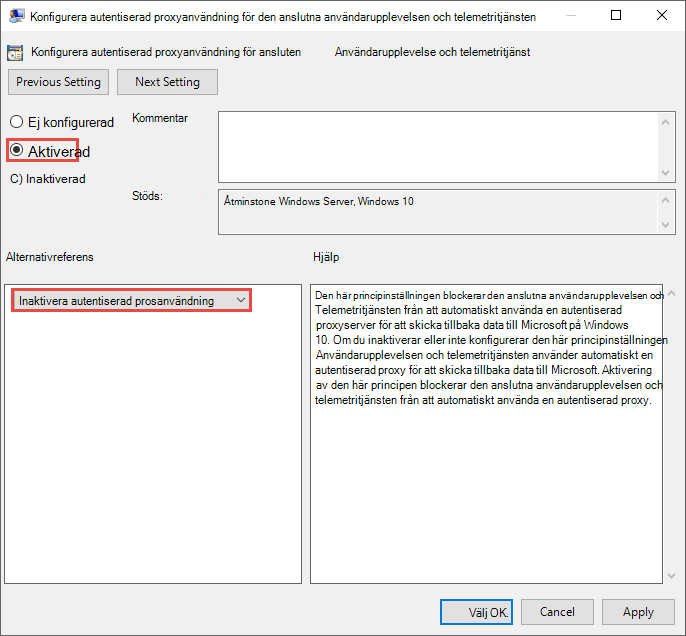
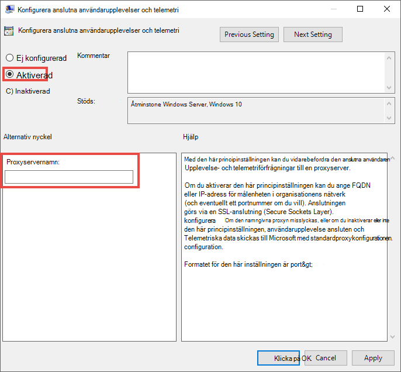

# <a name="configure-device-proxy-and-internet-connectivity-settings"></a><span data-ttu-id="61606-104">Konfigurera enhetsproxy och internetanslutningsinställningar</span><span class="sxs-lookup"><span data-stu-id="61606-104">Configure device proxy and Internet connectivity settings</span></span>

[!INCLUDE [Microsoft 365 Defender rebranding](../../includes/microsoft-defender.md)]

<span data-ttu-id="61606-105">**Gäller för:**</span><span class="sxs-lookup"><span data-stu-id="61606-105">**Applies to:**</span></span>
- [<span data-ttu-id="61606-106">Microsoft Defender för Endpoint</span><span class="sxs-lookup"><span data-stu-id="61606-106">Microsoft Defender for Endpoint</span></span>](https://go.microsoft.com/fwlink/p/?linkid=2154037)
- [<span data-ttu-id="61606-107">Microsoft 365 Defender</span><span class="sxs-lookup"><span data-stu-id="61606-107">Microsoft 365 Defender</span></span>](https://go.microsoft.com/fwlink/?linkid=2118804)

> <span data-ttu-id="61606-108">Vill du använda Defender för Slutpunkt?</span><span class="sxs-lookup"><span data-stu-id="61606-108">Want to experience Defender for Endpoint?</span></span> [<span data-ttu-id="61606-109">Registrera dig för en kostnadsfri utvärderingsversion.</span><span class="sxs-lookup"><span data-stu-id="61606-109">Sign up for a free trial.</span></span>](https://www.microsoft.com/en-us/WindowsForBusiness/windows-atp?ocid=docs-wdatp-configureendpointsscript-abovefoldlink)

<span data-ttu-id="61606-110">Defender för slutpunkts sensor kräver Microsoft Windows HTTP (WinHTTP) för att rapportera sensordata och kommunicera med Defender för slutpunktstjänsten.</span><span class="sxs-lookup"><span data-stu-id="61606-110">The Defender for Endpoint sensor requires Microsoft Windows HTTP (WinHTTP) to report sensor data and communicate with the Defender for Endpoint service.</span></span>

<span data-ttu-id="61606-111">Den inbäddade Defender för slutpunkts sensor körs i systemkontext med localSystem-kontot.</span><span class="sxs-lookup"><span data-stu-id="61606-111">The embedded Defender for Endpoint sensor runs in system context using the LocalSystem account.</span></span> <span data-ttu-id="61606-112">Sensorn använder Microsoft Windows HTTP-tjänster (WinHTTP) för att aktivera kommunikation med Defender för slutpunktsmolntjänsten.</span><span class="sxs-lookup"><span data-stu-id="61606-112">The sensor uses Microsoft Windows HTTP Services (WinHTTP) to enable communication with the Defender for Endpoint cloud service.</span></span>

>[!TIP]
><span data-ttu-id="61606-113">Organisationer som använder proxyservrar för vidarebefordran som en gateway till Internet, kan använda nätverksskydd till undersökningar bakom en proxy.</span><span class="sxs-lookup"><span data-stu-id="61606-113">For organizations that use forward proxies as a gateway to the Internet, you can use network protection to investigate behind a proxy.</span></span> <span data-ttu-id="61606-114">Mer information finns i [Undersöka anslutningshändelser som inträffar bakom proxyservrar för vidarebefordran](investigate-behind-proxy.md).</span><span class="sxs-lookup"><span data-stu-id="61606-114">For more information, see [Investigate connection events that occur behind forward proxies](investigate-behind-proxy.md).</span></span>

<span data-ttu-id="61606-115">WinHTTP-konfigurationsinställningen är oberoende av proxyinställningarna för Internetsurfning på Windows Internet (WinINet) på Internet och kan bara identifiera en proxyserver med hjälp av följande identifieringsmetoder:</span><span class="sxs-lookup"><span data-stu-id="61606-115">The WinHTTP configuration setting is independent of the Windows Internet (WinINet) Internet browsing proxy settings and can only discover a proxy server by using the following discovery methods:</span></span>

- <span data-ttu-id="61606-116">Metoder för automatisk identifiering:</span><span class="sxs-lookup"><span data-stu-id="61606-116">Auto-discovery methods:</span></span>

  - <span data-ttu-id="61606-117">Transparent proxy</span><span class="sxs-lookup"><span data-stu-id="61606-117">Transparent proxy</span></span>

  - <span data-ttu-id="61606-118">WPAD (Web Proxy Auto-discovery Protocol)</span><span class="sxs-lookup"><span data-stu-id="61606-118">Web Proxy Auto-discovery Protocol (WPAD)</span></span>

    > [!NOTE]
    > <span data-ttu-id="61606-119">Om du använder Transparent proxy eller WPAD i nätverkstopologin behöver du inga särskilda konfigurationsinställningar.</span><span class="sxs-lookup"><span data-stu-id="61606-119">If you're using Transparent proxy or WPAD in your network topology, you don't need special configuration settings.</span></span> <span data-ttu-id="61606-120">Mer information om undantag för Slutpunkts-URL för Defender i proxyn finns i Aktivera åtkomst till Defender för [slutpunktstjänst-URL:er i proxyservern.](#enable-access-to-microsoft-defender-for-endpoint-service-urls-in-the-proxy-server)</span><span class="sxs-lookup"><span data-stu-id="61606-120">For more information on Defender for Endpoint URL exclusions in the proxy, see [Enable access to Defender for Endpoint service URLs in the proxy server](#enable-access-to-microsoft-defender-for-endpoint-service-urls-in-the-proxy-server).</span></span>

- <span data-ttu-id="61606-121">Manuell konfiguration av statisk proxy:</span><span class="sxs-lookup"><span data-stu-id="61606-121">Manual static proxy configuration:</span></span>

  - <span data-ttu-id="61606-122">Registerbaserad konfiguration</span><span class="sxs-lookup"><span data-stu-id="61606-122">Registry based configuration</span></span>

  - <span data-ttu-id="61606-123">WinHTTP som är konfigurerat med ett netsh-kommando – Endast lämpligt för stationära datorer i en stabil topologi (t.ex. en stationär dator i ett företagsnätverk bakom samma proxy)</span><span class="sxs-lookup"><span data-stu-id="61606-123">WinHTTP configured using netsh command – Suitable only for desktops in a stable topology (for example: a desktop in a corporate network behind the same proxy)</span></span>

## <a name="configure-the-proxy-server-manually-using-a-registry-based-static-proxy"></a><span data-ttu-id="61606-124">Konfigurera proxyservern manuellt med hjälp av en registerbaserad statisk proxy</span><span class="sxs-lookup"><span data-stu-id="61606-124">Configure the proxy server manually using a registry-based static proxy</span></span>

<span data-ttu-id="61606-125">Konfigurera en registerbaserad statisk proxy så att endast Defender för slutpunkts sensor kan rapportera diagnostikdata och kommunicera med Defender för Slutpunktstjänster om en dator inte har tillåtelse att ansluta till Internet.</span><span class="sxs-lookup"><span data-stu-id="61606-125">Configure a registry-based static proxy to allow only Defender for Endpoint sensor to report diagnostic data and communicate with Defender for Endpoint services if a computer is not permitted to connect to the Internet.</span></span>

> [!NOTE]
> <span data-ttu-id="61606-126">När du använder det här alternativet på Windows 10 eller Windows Server 2019 rekommenderas du att ha följande (eller senare) samlad uppdatering och kumulativ uppdatering:</span><span class="sxs-lookup"><span data-stu-id="61606-126">When using this option on Windows 10 or Windows Server 2019, it is recommended to have the following (or later) build and cumulative update rollup:</span></span>
>
> - <span data-ttu-id="61606-127">Windows 10, version 1809 eller Windows Server 2019 -https://support.microsoft.com/kb/5001384</span><span class="sxs-lookup"><span data-stu-id="61606-127">Windows 10, version 1809 or Windows Server 2019 - https://support.microsoft.com/kb/5001384</span></span>
> - <span data-ttu-id="61606-128">Windows 10, version 1909 -https://support.microsoft.com/kb/4601380</span><span class="sxs-lookup"><span data-stu-id="61606-128">Windows 10, version 1909 - https://support.microsoft.com/kb/4601380</span></span>
> - <span data-ttu-id="61606-129">Windows 10, version 2004 –https://support.microsoft.com/kb/4601382</span><span class="sxs-lookup"><span data-stu-id="61606-129">Windows 10, version 2004 - https://support.microsoft.com/kb/4601382</span></span>
> - <span data-ttu-id="61606-130">Windows 10, version 20H2 -https://support.microsoft.com/kb/4601382</span><span class="sxs-lookup"><span data-stu-id="61606-130">Windows 10, version 20H2 - https://support.microsoft.com/kb/4601382</span></span>
>
> <span data-ttu-id="61606-131">Dessa uppdateringar förbättrar anslutningen och tillförlitligheten för CnC-kanalen (kommando- och kontrollkanal).</span><span class="sxs-lookup"><span data-stu-id="61606-131">These updates improve the connectivity and reliability of the CnC (Command and Control) channel.</span></span>

<span data-ttu-id="61606-132">Den statiska proxyn kan konfigureras via en grupprincip.</span><span class="sxs-lookup"><span data-stu-id="61606-132">The static proxy is configurable through Group Policy (GP).</span></span> <span data-ttu-id="61606-133">Grupprincipen finns under:</span><span class="sxs-lookup"><span data-stu-id="61606-133">The group policy can be found under:</span></span>

- <span data-ttu-id="61606-134">**Administrativa mallar > Windows komponenter > datainsamlings- och förhandsversioner > Konfigurera autentiserad proxyanvändning för den anslutna användarupplevelsen och telemetritjänsten**</span><span class="sxs-lookup"><span data-stu-id="61606-134">**Administrative Templates > Windows Components > Data Collection and Preview Builds > Configure Authenticated Proxy usage for the Connected User Experience and Telemetry Service**</span></span>

  <span data-ttu-id="61606-135">Ställ in den **på Aktiverad** och välj **Inaktivera autentiserad proxyanvändning.**</span><span class="sxs-lookup"><span data-stu-id="61606-135">Set it to **Enabled** and select **Disable Authenticated Proxy usage**.</span></span>

  

- <span data-ttu-id="61606-137">**Administrativa mallar > Windows komponenter > datainsamlings- och förhandsversioner > Konfigurera anslutna användarupplevelser och telemetri:**</span><span class="sxs-lookup"><span data-stu-id="61606-137">**Administrative Templates > Windows Components > Data Collection and Preview Builds > Configure connected user experiences and telemetry**:</span></span>

  <span data-ttu-id="61606-138">Konfigurera proxyn</span><span class="sxs-lookup"><span data-stu-id="61606-138">Configure the proxy</span></span>

  

  <span data-ttu-id="61606-140">Principen anger två registervärden, `TelemetryProxyServer` som REG_SZ och som `DisableEnterpriseAuthProxy` REG_DWORD, under registernyckeln `HKLM\Software\Policies\Microsoft\Windows\DataCollection` .</span><span class="sxs-lookup"><span data-stu-id="61606-140">The policy sets two registry values, `TelemetryProxyServer` as REG_SZ and `DisableEnterpriseAuthProxy` as REG_DWORD, under the registry key `HKLM\Software\Policies\Microsoft\Windows\DataCollection`.</span></span>

  <span data-ttu-id="61606-141">Registervärdet `TelemetryProxyServer` har följande strängformat:</span><span class="sxs-lookup"><span data-stu-id="61606-141">The registry value `TelemetryProxyServer` takes the following string format:</span></span>

  ```text
  <server name or ip>:<port>
  ```

  <span data-ttu-id="61606-142">Till exempel: 10.0.0.6:8080</span><span class="sxs-lookup"><span data-stu-id="61606-142">For example: 10.0.0.6:8080</span></span>

  <span data-ttu-id="61606-143">Registervärdet `DisableEnterpriseAuthProxy` anges till 1.</span><span class="sxs-lookup"><span data-stu-id="61606-143">The registry value `DisableEnterpriseAuthProxy` should be set to 1.</span></span>

## <a name="configure-the-proxy-server-manually-using-netsh-command"></a><span data-ttu-id="61606-144">Konfigurera proxyservern manuellt med netsh-kommandot</span><span class="sxs-lookup"><span data-stu-id="61606-144">Configure the proxy server manually using netsh command</span></span>

<span data-ttu-id="61606-145">Använd netsh för att konfigurera en systemomfattande statisk proxy.</span><span class="sxs-lookup"><span data-stu-id="61606-145">Use netsh to configure a system-wide static proxy.</span></span>

> [!NOTE]
> - <span data-ttu-id="61606-146">Detta påverkar alla program, inklusive Windows-tjänster som använder WinHTTP med standardproxyn.</span><span class="sxs-lookup"><span data-stu-id="61606-146">This will affect all applications including Windows services which use WinHTTP with default proxy.</span></span></br>
> - <span data-ttu-id="61606-147">Bärbara datorer som ändrar topologi (till exempel från kontor till hem) fungerar inte på netsh.</span><span class="sxs-lookup"><span data-stu-id="61606-147">Laptops that are changing topology (for example: from office to home) will malfunction with netsh.</span></span> <span data-ttu-id="61606-148">Använd den registerbaserade statiska proxykonfigurationen.</span><span class="sxs-lookup"><span data-stu-id="61606-148">Use the registry-based static proxy configuration.</span></span>

1. <span data-ttu-id="61606-149">Öppna en upphöjd kommandorad:</span><span class="sxs-lookup"><span data-stu-id="61606-149">Open an elevated command-line:</span></span>

   1. <span data-ttu-id="61606-150">Gå till **Start** och skriv **cmd**.</span><span class="sxs-lookup"><span data-stu-id="61606-150">Go to **Start** and type **cmd**.</span></span>

   1. <span data-ttu-id="61606-151">Högerklicka på **Kommandotolken** och välj **Kör som administratör**.</span><span class="sxs-lookup"><span data-stu-id="61606-151">Right-click **Command prompt** and select **Run as administrator**.</span></span>

2. <span data-ttu-id="61606-152">Skriv följande kommando och tryck på **Retur**:</span><span class="sxs-lookup"><span data-stu-id="61606-152">Enter the following command and press **Enter**:</span></span>

   ```PowerShell
   netsh winhttp set proxy <proxy>:<port>
   ```

   <span data-ttu-id="61606-153">Till exempel: `netsh winhttp set proxy 10.0.0.6:8080`</span><span class="sxs-lookup"><span data-stu-id="61606-153">For example: `netsh winhttp set proxy 10.0.0.6:8080`</span></span>

<span data-ttu-id="61606-154">Återställ winhttp-proxyn genom att ange följande kommando och trycka på **Retur**:</span><span class="sxs-lookup"><span data-stu-id="61606-154">To reset the winhttp proxy, enter the following command and press **Enter**:</span></span>

```PowerShell
netsh winhttp reset proxy
```

<span data-ttu-id="61606-155">Se [Netsh-kommandosyntax, kontexter och formatering](/windows-server/networking/technologies/netsh/netsh-contexts) för mer information.</span><span class="sxs-lookup"><span data-stu-id="61606-155">See [Netsh Command Syntax, Contexts, and Formatting](/windows-server/networking/technologies/netsh/netsh-contexts) to learn more.</span></span>

## <a name="enable-access-to-microsoft-defender-for-endpoint-service-urls-in-the-proxy-server"></a><span data-ttu-id="61606-156">Aktivera åtkomst till URL-adresser för Microsoft Defender för slutpunktstjänsten på proxyservern</span><span class="sxs-lookup"><span data-stu-id="61606-156">Enable access to Microsoft Defender for Endpoint service URLs in the proxy server</span></span>

<span data-ttu-id="61606-157">Om en proxy eller brandvägg blockerar all trafik som standard och endast tillåter vissa domäner, lägger du till domänerna som visas på det nedladdningsbara bladet i listan med tillåtna domäner.</span><span class="sxs-lookup"><span data-stu-id="61606-157">If a proxy or firewall is blocking all traffic by default and allowing only specific domains through, add the domains listed in the downloadable sheet to the allowed domains list.</span></span>

<span data-ttu-id="61606-158">I följande nedladdningsbara kalkylblad finns de tjänster och deras tillhörande URL:er som nätverket måste kunna ansluta till.</span><span class="sxs-lookup"><span data-stu-id="61606-158">The following downloadable spreadsheet lists the services and their associated URLs that your network must be able to connect to.</span></span> <span data-ttu-id="61606-159">Du bör kontrollera att det inte finns några brandväggs- eller nätverksfiltreringsregler som nekar åtkomst till dessa URL:er, eller att du kan behöva skapa en *tillåta-regel* specifikt för dem.</span><span class="sxs-lookup"><span data-stu-id="61606-159">You should ensure that there are no firewall or network filtering rules that would deny access to these URLs, or you may need to create an *allow* rule specifically for them.</span></span>


| <span data-ttu-id="61606-160">Kalkylblad med domänlista</span><span class="sxs-lookup"><span data-stu-id="61606-160">Spreadsheet of domains list</span></span> | <span data-ttu-id="61606-161">Beskrivning</span><span class="sxs-lookup"><span data-stu-id="61606-161">Description</span></span> |
|:-----|:-----|
|<br/>  | <span data-ttu-id="61606-163">Kalkylblad med specifika DNS-poster för tjänstplatser, geografiska platser och operativsystem.</span><span class="sxs-lookup"><span data-stu-id="61606-163">Spreadsheet of specific DNS records for service locations, geographic locations, and OS.</span></span> <br><br>[<span data-ttu-id="61606-164">Ladda ned kalkylbladet här.</span><span class="sxs-lookup"><span data-stu-id="61606-164">Download the spreadsheet here.</span></span>](https://download.microsoft.com/download/8/a/5/8a51eee5-cd02-431c-9d78-a58b7f77c070/mde-urls.xlsx) 


<span data-ttu-id="61606-165">Om en proxy eller brandvägg har HTTPS-skanning (SSL-inspektion) aktiverad, utesluter du domänerna som visas i tabellen ovan från HTTPS-skanningen.</span><span class="sxs-lookup"><span data-stu-id="61606-165">If a proxy or firewall has HTTPS scanning (SSL inspection) enabled, exclude the domains listed in the above table from HTTPS scanning.</span></span>

> [!NOTE]
> <span data-ttu-id="61606-166">settings-win.data.microsoft.com bara om du har en Windows 10 som kör version 1803 eller tidigare.</span><span class="sxs-lookup"><span data-stu-id="61606-166">settings-win.data.microsoft.com is only needed if you have Windows 10 devices running version 1803 or earlier.</span></span><br>


> [!NOTE]
> <span data-ttu-id="61606-167">URL-adresser som innehåller v20 i dem behövs bara om du har Windows 10 enheter med version 1803 eller senare.</span><span class="sxs-lookup"><span data-stu-id="61606-167">URLs that include v20 in them are only needed if you have Windows 10 devices running version 1803 or later.</span></span> <span data-ttu-id="61606-168">For example, `us-v20.events.data.microsoft.com` is needed for a Windows 10 device running version 1803 or later and onboarded to US Data Storage region.</span><span class="sxs-lookup"><span data-stu-id="61606-168">For example, `us-v20.events.data.microsoft.com` is needed for a Windows 10 device running version 1803 or later and onboarded to US Data Storage region.</span></span>


> [!NOTE]
> <span data-ttu-id="61606-169">Om du använder Microsoft Defender Antivirus i din miljö kan du [gå till Konfigurera nätverksanslutningar till Microsoft Defender Antivirus molntjänsten.](/windows/security/threat-protection/microsoft-defender-antivirus/configure-network-connections-microsoft-defender-antivirus)</span><span class="sxs-lookup"><span data-stu-id="61606-169">If you are using Microsoft Defender Antivirus in your environment, see [Configure network connections to the Microsoft Defender Antivirus cloud service](/windows/security/threat-protection/microsoft-defender-antivirus/configure-network-connections-microsoft-defender-antivirus).</span></span>

<span data-ttu-id="61606-170">Om en proxy eller brandvägg blockerar anonym trafik, som Defender för Slutpunkts sensor ansluter från systemkontext, kontrollerar du att anonym trafik tillåts i tidigare angivna URL:er.</span><span class="sxs-lookup"><span data-stu-id="61606-170">If a proxy or firewall is blocking anonymous traffic, as Defender for Endpoint sensor is connecting from system context, make sure anonymous traffic is permitted in the previously listed URLs.</span></span>

### <a name="microsoft-monitoring-agent-mma---proxy-and-firewall-requirements-for-older-versions-of-windows-client-or-windows-server"></a><span data-ttu-id="61606-171">Microsoft Monitoring Agent (MMA) – proxy- och brandväggskrav för äldre versioner Windows klient eller Windows Server</span><span class="sxs-lookup"><span data-stu-id="61606-171">Microsoft Monitoring Agent (MMA) - proxy and firewall requirements for older versions of Windows client or Windows Server</span></span>

<span data-ttu-id="61606-172">Informationen nedan innehåller den konfigurationsinformation för proxy och brandvägg som krävs för att kommunicera med loganalysagenten (kallas ofta Microsoft monitoring agent) för tidigare versioner av Windows, till exempel Windows 7 SP1, Windows 8.1, Windows Server 2008 R2, Windows Server 2012 R2 och Windows Server 2016.</span><span class="sxs-lookup"><span data-stu-id="61606-172">The information below list the proxy and firewall configuration information required to communicate with Log Analytics agent (often referred to as Microsoft Monitoring Agent) for the previous versions of Windows such as Windows 7 SP1, Windows 8.1, Windows Server 2008 R2, Windows Server 2012 R2, and Windows Server 2016.</span></span>

|<span data-ttu-id="61606-173">Agentresurs</span><span class="sxs-lookup"><span data-stu-id="61606-173">Agent Resource</span></span>|<span data-ttu-id="61606-174">Portar</span><span class="sxs-lookup"><span data-stu-id="61606-174">Ports</span></span> |<span data-ttu-id="61606-175">Riktning</span><span class="sxs-lookup"><span data-stu-id="61606-175">Direction</span></span> |<span data-ttu-id="61606-176">Förbikoppling av HTTPS-kontroll</span><span class="sxs-lookup"><span data-stu-id="61606-176">Bypass HTTPS inspection</span></span>|
|------|---------|--------|--------|   
|<span data-ttu-id="61606-177">\*.ods.opinsights.azure.com</span><span class="sxs-lookup"><span data-stu-id="61606-177">\*.ods.opinsights.azure.com</span></span> |<span data-ttu-id="61606-178">Port 443</span><span class="sxs-lookup"><span data-stu-id="61606-178">Port 443</span></span> |<span data-ttu-id="61606-179">Utgående</span><span class="sxs-lookup"><span data-stu-id="61606-179">Outbound</span></span>|<span data-ttu-id="61606-180">Ja</span><span class="sxs-lookup"><span data-stu-id="61606-180">Yes</span></span> |  
|<span data-ttu-id="61606-181">\*.oms.opinsights.azure.com</span><span class="sxs-lookup"><span data-stu-id="61606-181">\*.oms.opinsights.azure.com</span></span> |<span data-ttu-id="61606-182">Port 443</span><span class="sxs-lookup"><span data-stu-id="61606-182">Port 443</span></span> |<span data-ttu-id="61606-183">Utgående</span><span class="sxs-lookup"><span data-stu-id="61606-183">Outbound</span></span>|<span data-ttu-id="61606-184">Ja</span><span class="sxs-lookup"><span data-stu-id="61606-184">Yes</span></span> |  
|<span data-ttu-id="61606-185">\*.blob.core.windows.net</span><span class="sxs-lookup"><span data-stu-id="61606-185">\*.blob.core.windows.net</span></span> |<span data-ttu-id="61606-186">Port 443</span><span class="sxs-lookup"><span data-stu-id="61606-186">Port 443</span></span> |<span data-ttu-id="61606-187">Utgående</span><span class="sxs-lookup"><span data-stu-id="61606-187">Outbound</span></span>|<span data-ttu-id="61606-188">Ja</span><span class="sxs-lookup"><span data-stu-id="61606-188">Yes</span></span> |
|<span data-ttu-id="61606-189">\*.azure-automation.net</span><span class="sxs-lookup"><span data-stu-id="61606-189">\*.azure-automation.net</span></span> |<span data-ttu-id="61606-190">Port 443</span><span class="sxs-lookup"><span data-stu-id="61606-190">Port 443</span></span> |<span data-ttu-id="61606-191">Utgående</span><span class="sxs-lookup"><span data-stu-id="61606-191">Outbound</span></span>|<span data-ttu-id="61606-192">Ja</span><span class="sxs-lookup"><span data-stu-id="61606-192">Yes</span></span> |  


> [!NOTE]
> <span data-ttu-id="61606-193">Som en molnbaserad lösning kan IP-intervallet ändras.</span><span class="sxs-lookup"><span data-stu-id="61606-193">As a cloud-based solution, the IP range can change.</span></span> <span data-ttu-id="61606-194">Vi rekommenderar att du går över till DNS-lösningsinställningen.</span><span class="sxs-lookup"><span data-stu-id="61606-194">It's recommended you move to DNS resolving setting.</span></span>

## <a name="confirm-microsoft-monitoring-agent-mma-service-url-requirements"></a><span data-ttu-id="61606-195">Bekräfta URL-krav för Tjänst-URL för Microsoft Monitoring Agent (MMA)</span><span class="sxs-lookup"><span data-stu-id="61606-195">Confirm Microsoft Monitoring Agent (MMA) Service URL Requirements</span></span> 

<span data-ttu-id="61606-196">Läs följande vägledning för att ta bort jokertecknet (\*) för din specifika miljö när du använder Microsoft Monitoring Agent (MMA) för tidigare versioner av Windows.</span><span class="sxs-lookup"><span data-stu-id="61606-196">Please see the following guidance to eliminate the wildcard (\*) requirement for your specific environment when using the Microsoft Monitoring Agent (MMA) for previous versions of Windows.</span></span>

1.  <span data-ttu-id="61606-197">Introducera ett tidigare operativsystem med Microsoft Monitoring Agent (MMA) i Defender för Slutpunkt (mer information finns i Hantera tidigare versioner av [Windows på Defender](https://go.microsoft.com/fwlink/p/?linkid=2010326) för slutpunkt och onboard [Windows-servrar](configure-server-endpoints.md#windows-server-2008-r2-sp1-windows-server-2012-r2-and-windows-server-2016).</span><span class="sxs-lookup"><span data-stu-id="61606-197">Onboard a previous operating system with the Microsoft Monitoring Agent (MMA) into Defender for Endpoint (for more information, see [Onboard previous versions of Windows on Defender for Endpoint](https://go.microsoft.com/fwlink/p/?linkid=2010326) and [Onboard Windows servers](configure-server-endpoints.md#windows-server-2008-r2-sp1-windows-server-2012-r2-and-windows-server-2016).</span></span>

2.  <span data-ttu-id="61606-198">Kontrollera att datorn rapporterar till Microsoft Defender Säkerhetscenter portalen.</span><span class="sxs-lookup"><span data-stu-id="61606-198">Ensure the machine is successfully reporting into the Microsoft Defender Security Center portal.</span></span>

3.  <span data-ttu-id="61606-199">Kör verktyget TestCloudConnection.exe C:\Program\Microsoft Monitoring Agent\Agent" för att verifiera anslutningen och visa de URL-adresser som krävs för den specifika arbetsytan.</span><span class="sxs-lookup"><span data-stu-id="61606-199">Run the TestCloudConnection.exe tool from “C:\Program Files\Microsoft Monitoring Agent\Agent” to validate the connectivity and to see the required URLs for your specific workspace.</span></span>

4.  <span data-ttu-id="61606-200">Titta i listan med URL-adresser för Microsoft Defender för slutpunkten för en fullständig lista över krav för din region (mer information finns i [Tjänstwebbadresser för kalkylblad](https://download.microsoft.com/download/8/a/5/8a51eee5-cd02-431c-9d78-a58b7f77c070/mde-urls.xlsx)).</span><span class="sxs-lookup"><span data-stu-id="61606-200">Check the Microsoft Defender for Endpoint URLs list for the complete list of requirements for your region (please refer to the Service URLs [Spreadsheet](https://download.microsoft.com/download/8/a/5/8a51eee5-cd02-431c-9d78-a58b7f77c070/mde-urls.xlsx)).</span></span>

    

<span data-ttu-id="61606-202">Jokert många (\*) som används i \*.ods.opinsights.azure.com-, \*.oms.opinsights.azure.com- och \*.agentsvc.azure-automation.net-URL-slutpunkter kan ersättas med ditt specifika arbetsyte-ID.</span><span class="sxs-lookup"><span data-stu-id="61606-202">The wildcards (\*) used in \*.ods.opinsights.azure.com, \*.oms.opinsights.azure.com, and \*.agentsvc.azure-automation.net URL endpoints can be replaced with your specific Workspace ID.</span></span> <span data-ttu-id="61606-203">Arbetsyte-ID:t är specifikt för din miljö och arbetsyta och finns i avsnittet Registrering för klientorganisationen i Microsoft Defender Säkerhetscenter portal.</span><span class="sxs-lookup"><span data-stu-id="61606-203">The Workspace ID is specific to your environment and workspace and can be found in the Onboarding section of your tenant within the Microsoft Defender Security Center portal.</span></span>

<span data-ttu-id="61606-204">Slutpunkten \*.blob.core.windows.net-URL kan ersättas med WEBBADRESSerna som visas i avsnittet "Brandväggsregel: \*.blob.core.windows.net" i testresultaten.</span><span class="sxs-lookup"><span data-stu-id="61606-204">The \*.blob.core.windows.net URL endpoint can be replaced with the URLs shown in the “Firewall Rule: \*.blob.core.windows.net” section of the test results.</span></span> 

> [!NOTE]
> <span data-ttu-id="61606-205">När det gäller registrering via Azure Defender kan flera arbetsytor användas.</span><span class="sxs-lookup"><span data-stu-id="61606-205">In the case of onboarding via Azure Defender, multiple workspaces maybe used.</span></span> <span data-ttu-id="61606-206">Du måste utföra TestCloudConnection.exe ovan på en inbyggd dator från varje arbetsyta (för att avgöra om det finns några ändringar i URL blob.core.windows.net adresserna mellan arbetsytorna).</span><span class="sxs-lookup"><span data-stu-id="61606-206">You will need to perform the TestCloudConnection.exe procedure above on an onboarded machine from each workspace (to determine if there are any changes to the \*.blob.core.windows.net URLs between the workspaces).</span></span>

## <a name="verify-client-connectivity-to-microsoft-defender-for-endpoint-service-urls"></a><span data-ttu-id="61606-207">Verifiera klientanslutningen till URL-adresser för Microsoft Defender för slutpunktstjänsten</span><span class="sxs-lookup"><span data-stu-id="61606-207">Verify client connectivity to Microsoft Defender for Endpoint service URLs</span></span>

<span data-ttu-id="61606-208">Verifiera att proxykonfigurationen har slutförts, att WinHTTP kan identifiera och kommunicera via proxyservern i din miljö och att proxyservern tillåter trafik till URL:erna för Defender för Endpoint-tjänsten.</span><span class="sxs-lookup"><span data-stu-id="61606-208">Verify the proxy configuration completed successfully, that WinHTTP can discover and communicate through the proxy server in your environment, and that the proxy server allows traffic to the Defender for Endpoint service URLs.</span></span>

1. <span data-ttu-id="61606-209">Ladda ned [MDATP-verktyget Klientanalys till](https://aka.ms/mdatpanalyzer) den dator där Defender för Slutpunkts sensor körs på.</span><span class="sxs-lookup"><span data-stu-id="61606-209">Download the [MDATP Client Analyzer tool](https://aka.ms/mdatpanalyzer) to the PC where Defender for Endpoint sensor is running on.</span></span>

2. <span data-ttu-id="61606-210">Extrahera innehållet i MDATPClientAnalyzer.zip på enheten.</span><span class="sxs-lookup"><span data-stu-id="61606-210">Extract the contents of MDATPClientAnalyzer.zip on the device.</span></span>

3. <span data-ttu-id="61606-211">Öppna en upphöjd kommandorad:</span><span class="sxs-lookup"><span data-stu-id="61606-211">Open an elevated command-line:</span></span>

   1. <span data-ttu-id="61606-212">Gå till **Start** och skriv **cmd**.</span><span class="sxs-lookup"><span data-stu-id="61606-212">Go to **Start** and type **cmd**.</span></span>

   1.  <span data-ttu-id="61606-213">Högerklicka på **Kommandotolken** och välj **Kör som administratör**.</span><span class="sxs-lookup"><span data-stu-id="61606-213">Right-click **Command prompt** and select **Run as administrator**.</span></span>

4. <span data-ttu-id="61606-214">Skriv följande kommando och tryck på **Retur**:</span><span class="sxs-lookup"><span data-stu-id="61606-214">Enter the following command and press **Enter**:</span></span>

    ```PowerShell
    HardDrivePath\MDATPClientAnalyzer.cmd
    ```

    <span data-ttu-id="61606-215">Ersätt *HardDrivePath* med sökvägen dit verktyget MDATPClientAnalyzer laddades ned till, till exempel:</span><span class="sxs-lookup"><span data-stu-id="61606-215">Replace *HardDrivePath* with the path where the MDATPClientAnalyzer tool was downloaded to, for example:</span></span>

    ```PowerShell
    C:\Work\tools\MDATPClientAnalyzer\MDATPClientAnalyzer.cmd
    ```

5. <span data-ttu-id="61606-216">Extrahera den *MDATPClientAnalyzerResult.zip* som skapats av verktyget i mappen som används i *HardDrivePath.*</span><span class="sxs-lookup"><span data-stu-id="61606-216">Extract the *MDATPClientAnalyzerResult.zip* file created by tool in the folder used in the *HardDrivePath*.</span></span>

6. <span data-ttu-id="61606-217">Öppna *MDATPClientAnalyzerResult.txt* och kontrollera att du har utfört proxykonfigurationsstegen som aktiverar serveridentifiering och åtkomst till tjänstens URL:er.</span><span class="sxs-lookup"><span data-stu-id="61606-217">Open *MDATPClientAnalyzerResult.txt* and verify that you have performed the proxy configuration steps to enable server discovery and access to the service URLs.</span></span>

   <span data-ttu-id="61606-218">Verktyget kontrollerar anslutningen av URL:erna för Defender för Endpoint-tjänsten som Defender för Endpoint-klienten har konfigurerats att interagera med.</span><span class="sxs-lookup"><span data-stu-id="61606-218">The tool checks the connectivity of Defender for Endpoint service URLs that Defender for Endpoint client is configured to interact with.</span></span> <span data-ttu-id="61606-219">Resultatet skrivs sedan i filen *MDATPClientAnalyzerResult.txt* för varje URL som kan användas till att kommunicera med Defender för Endpoint-tjänsterna.</span><span class="sxs-lookup"><span data-stu-id="61606-219">It then prints the results into the *MDATPClientAnalyzerResult.txt* file for each URL that can potentially be used to communicate with the Defender for Endpoint services.</span></span> <span data-ttu-id="61606-220">Till exempel:</span><span class="sxs-lookup"><span data-stu-id="61606-220">For example:</span></span>

   ```text
   Testing URL : https://xxx.microsoft.com/xxx
   1 - Default proxy: Succeeded (200)
   2 - Proxy auto discovery (WPAD): Succeeded (200)
   3 - Proxy disabled: Succeeded (200)
   4 - Named proxy: Doesn't exist
   5 - Command line proxy: Doesn't exist
   ```

<span data-ttu-id="61606-221">Om minst ett av anslutningsalternativen returnerar en status (200) kan Defender för Endpoint-klienten kommunicera med den testade URL:en med anslutningsmetoden.</span><span class="sxs-lookup"><span data-stu-id="61606-221">If at least one of the connectivity options returns a (200) status, then the Defender for Endpoint client can communicate with the tested URL properly using this connectivity method.</span></span>

<span data-ttu-id="61606-222">Men om anslutningskontrollens resultat anger att ett fel uppstod, visas ett HTTP-fel (se HTTP-statuskoder).</span><span class="sxs-lookup"><span data-stu-id="61606-222">However, if the connectivity check results indicate a failure, an HTTP error is displayed (see HTTP Status Codes).</span></span> <span data-ttu-id="61606-223">Du kan sedan använda URL:erna i tabellen som visas i Aktivera åtkomst till Defender för [slutpunktstjänst-URL:er i proxyservern.](#enable-access-to-microsoft-defender-for-endpoint-service-urls-in-the-proxy-server)</span><span class="sxs-lookup"><span data-stu-id="61606-223">You can then use the URLs in the table shown in [Enable access to Defender for Endpoint service URLs in the proxy server](#enable-access-to-microsoft-defender-for-endpoint-service-urls-in-the-proxy-server).</span></span> <span data-ttu-id="61606-224">Vilka URL-adresser du använder beror på vilken region du valde under registreringsprocessen.</span><span class="sxs-lookup"><span data-stu-id="61606-224">The URLs you'll use will depend on the region selected during the onboarding procedure.</span></span>

> [!NOTE]
> <span data-ttu-id="61606-225"> Verktyget Connectivity Analyzer är inte kompatibelt med ASR-regeln [Blockera processer som skapas från PSExec- och WMI-kommandon](/windows/security/threat-protection/windows-defender-exploit-guard/attack-surface-reduction#attack-surface-reduction-rules).</span><span class="sxs-lookup"><span data-stu-id="61606-225">The Connectivity Analyzer tool is not compatible with ASR rule [Block process creations originating from PSExec and WMI commands](/windows/security/threat-protection/windows-defender-exploit-guard/attack-surface-reduction#attack-surface-reduction-rules).</span></span> <span data-ttu-id="61606-226">Du måste inaktivera regeln tillfälligt om du vill köra anslutningsverktyget.</span><span class="sxs-lookup"><span data-stu-id="61606-226">You will need to temporarily disable this rule to run the connectivity tool.</span></span>


> [!NOTE]
> <span data-ttu-id="61606-227">När telemetriproxyServer har angetts i registret eller via grupprincip hamnar Defender för Slutpunkt direkt om den inte har åtkomst till den definierade proxyn.</span><span class="sxs-lookup"><span data-stu-id="61606-227">When the TelemetryProxyServer is set, in Registry or via Group Policy, Defender for Endpoint will fall back to direct if it can't access the defined proxy.</span></span>

## <a name="related-topics"></a><span data-ttu-id="61606-228">Relaterade ämnen</span><span class="sxs-lookup"><span data-stu-id="61606-228">Related topics</span></span>

- [<span data-ttu-id="61606-229">Registrera Windows 10-enheter</span><span class="sxs-lookup"><span data-stu-id="61606-229">Onboard Windows 10 devices</span></span>](configure-endpoints.md)
- [<span data-ttu-id="61606-230">Felsöka problem med Introduktion till Slutpunkt för Microsoft Defender</span><span class="sxs-lookup"><span data-stu-id="61606-230">Troubleshoot Microsoft Defender for Endpoint onboarding issues</span></span>](troubleshoot-onboarding.md)
