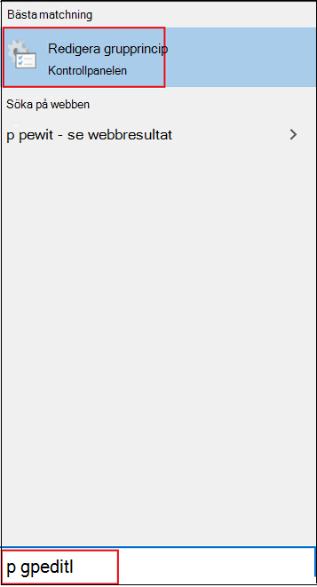

# Aktivera och konfigurera alltid-skydd för Microsoft Defender Antivirus i GrupprincipEnable and configure Microsoft Defender Antivirus always-on protection in Group Policy

[!INCLUDE [Microsoft 365 Defender rebranding](../../includes/microsoft-defender.md)]

**Gäller för:****Applies to:**

- [Microsoft Defender för EndpointMicrosoft Defender for Endpoint](/microsoft-365/security/defender-endpoint/)

Ständigt skydd består av realtidsskydd, övervakning av beteende och heuristics för att identifiera skadlig programvara baserat på kända misstänkta och skadliga aktiviteter.Always-on protection consists of real-time protection, behavior monitoring, and heuristics to identify malware based on known suspicious and malicious activities.

Dessa aktiviteter omfattar händelser, till exempel processer som gör ovanliga ändringar i befintliga filer, ändrar eller skapar automatiska registernycklar för start och startplatser (kallas även utökningspunkter för automatisk start eller ASEPs) och andra ändringar av filsystemet eller filstrukturen.These activities include events, such as processes making unusual changes to existing files, modifying or creating automatic startup registry keys and startup locations (also known as auto-start extensibility points, or ASEPs), and other changes to the file system or file structure.

## Aktivera och konfigurera alltid skydd i GrupprincipEnable and configure always-on protection in Group Policy

Du kan använda **redigeraren för lokala grupprinciper** för att aktivera och konfigurera inställningar för alltid skydd i Microsoft Defender Antivirus.You can use **Local Group Policy Editor** to enable and configure Microsoft Defender Antivirus always-on protection settings.

Så här aktiverar och konfigurerar du alltid skydd:To enable and configure always-on protection:

1. Öppna **redigeraren för lokala grupprinciper**.Open **Local Group Policy Editor**. Gör så här:To do this:  

    1. I sökrutan i Windows 10-aktivitetsfältet skriver **du gpedit**.In your Windows 10 taskbar search box, type **gpedit**.
    
    1. Under **Bästa matchning klickar** du på Redigera grupprincip **för** att starta **redigeraren för lokala grupprinciper.**Under **Best match**, click **Edit group policy** to launch **Local Group Policy Editor**.
    
       

2. I det vänstra fönstret i **redigeraren för lokala grupprinciper** expanderar du trädet **till** administrativa mallar för  >    >  **datorkonfiguration Windows-komponenter**  >  **Microsoft Defender Antivirus.**In the left pane of **Local Group Policy Editor**, expand the tree to **Computer Configuration** > **Administrative Templates** > **Windows Components** > **Microsoft Defender Antivirus**. 

3. Konfigurera principinställningarna för tjänstprinciper för skydd mot skadlig programvara i Microsoft Defender Antivirus.Configure the Microsoft Defender Antivirus antimalware service policy settings. Gör så här:To do this:  

    1. I **informationsfönstret för Microsoft Defender Antivirus** till höger dubbelklickar du på principinställningen enligt tabellen nedan:In the **Microsoft Defender Antivirus** details pane on right, double-click the policy setting as specified in the following table:

       | InställningSetting | BeskrivningDescription | StandardinställningDefault setting |
       |-----------------------------|------------------------|-------------------------------|
       | Tillåt att program mot skadlig kod startas med normal prioritetAllow antimalware service to startup with normal priority | Du kan ge lägre prioritet för Microsoft Defender Antivirus-motorn, vilket kan vara användbart i enkel distribution där du vill ha så smidig startprocessen som möjligt.You can lower the priority of the Microsoft Defender Antivirus engine, which may be useful in lightweight deployments where you want to have as lean a startup process as possible. Det kan påverka skyddet för slutpunkten.This may impact protection on the endpoint. | AktiveradEnabled
       | Tillåt att program mot skadlig programvara alltid körsAllow antimalware service to remain running always | Om skyddsuppdateringar har inaktiverats kan du ställa in att Microsoft Defender Antivirus fortfarande ska köras.If protection updates have been disabled, you can set Microsoft Defender Antivirus to still run. Då sänks skyddet på slutpunkten.This lowers the protection on the endpoint. | InaktiveradDisabled |
    
    1. Konfigurera inställningen efter behov och klicka på **OK.**Configure the setting as appropriate, and click **OK**.
    
    1. Upprepa föregående steg för varje inställning i tabellen.Repeat the previous steps for each setting in the table.

4. Konfigurera principinställningarna för realtidsskydd i Microsoft Defender Antivirus.Configure the Microsoft Defender Antivirus real-time protection policy settings. Gör så här:To do this:

    1. I **informationsfönstret för Microsoft Defender Antivirus** dubbelklickar du på **Realtidsskydd.**In the **Microsoft Defender Antivirus** details pane, double-click **Real-time Protection**. Du kan också klicka **på Realtidsskydd** i trädträdet för Microsoft Defender Antivirus i **den vänstra rutan.**Or, from the **Microsoft Defender Antivirus** tree on left pane, click **Real-time Protection**.
    
    1. I **informationsfönstret Realtidsskydd** till höger dubbelklickar du på principinställningen enligt tabellen nedan:In the **Real-time Protection** details pane on right, double-click the policy setting as specified in the following table:  

       | InställningSetting | BeskrivningDescription | StandardinställningDefault setting |
       |-----------------------------|------------------------|-------------------------------|
       | Aktivera beteendeövervakningTurn on behavior monitoring | Av-motorn övervakar filprocesser, fil- och registerändringar och andra händelser på slutpunkterna för misstänkt och känd skadlig aktivitet.The AV engine will monitor file processes, file and registry changes, and other events on your endpoints for suspicious and known malicious activity. | AktiveradEnabled |
       | Genomsöka alla nedladdade filer och bifogade filerScan all downloaded files and attachments | Nedladdade filer och bifogade filer genomsöks automatiskt.Downloaded files and attachments are automatically scanned. Det här fungerar utöver Windows Defender SmartScreen-filtret, som söker igenom filer före och under nedladdningen.This operates in addition to the Windows Defender SmartScreen filter, which scans files before and during downloading. | AktiveradEnabled |
       | Övervaka fil- och programaktivitet på datornMonitor file and program activity on your computer | Microsoft Defender Antivirus-motorn notera alla filändringar (fil skriver, till exempel flyttningar, kopior eller ändringar) och allmän programaktivitet (program som öppnas eller körs och som gör att andra program kan köras).The Microsoft Defender Antivirus engine makes note of any file changes (file writes, such as moves, copies, or modifications) and general program activity (programs that are opened or running and that cause other programs to run). | AktiveradEnabled |
       | Aktivera aviseringar om rådata för volymskrivningTurn on raw volume write notifications | Information om rådata i volym skriver analyseras genom övervakning av beteendet.Information about raw volume writes will be analyzed by behavior monitoring. | AktiveradEnabled |
       | Aktivera processsökning när realtidsskydd är aktiveratTurn on process scanning whenever real-time protection is enabled | Du kan aktivera Antivirusmotorn i Microsoft Defender oberoende av varandra för att söka igenom processer som körs efter misstänkta ändringar eller beteenden.You can independently enable the Microsoft Defender Antivirus engine to scan running processes for suspicious modifications or behaviors. Det här är användbart om du tillfälligt har inaktiverat realtidsskyddet och vill söka igenom processer som startades när det inaktiverades automatiskt.This is useful if you have temporarily disabled real-time protection and want to automatically scan processes that started while it was disabled. | AktiveradEnabled |
       | Definiera den maximala storleken på nedladdade filer och bifogade filer som ska genomsökasDefine the maximum size of downloaded files and attachments to be scanned | Du kan definiera storleken i kilobyte.You can define the size in kilobytes. | AktiveradEnabled |
       | Konfigurera åsidosättning av lokal inställning för att aktivera beteendeuppföljningConfigure local setting override for turn on behavior monitoring | Konfigurera en lokal åsidosättning för konfiguration av beteendeövervakning.Configure a local override for the configuration of behavior monitoring. Den här inställningen kan endast anges av Grupprincip.This setting can only be set by Group Policy. Om du aktiverar den här inställningen prioriteras den lokala inställningen framför Grupprincip.If you enable this setting, the local preference setting will take priority over Group Policy. Om du inaktiverar eller inte konfigurerar den här inställningen kommer grupprincipen att ha företräde framför den lokala inställningen.If you disable or do not configure this setting, Group Policy will take priority over the local preference setting.| AktiveradEnabled |
       | Konfigurera åsidosättning av lokal inställning för genomsökning av alla nedladdade filer och bifogade filerConfigure local setting override for scanning all downloaded files and attachments | Konfigurera en lokal åsidosättning för konfiguration av genomsökning för alla nedladdade filer och bifogade filer.Configure a local override for the configuration of scanning for all downloaded files and attachments. Den här inställningen kan endast anges av Grupprincip.This setting can only be set by Group Policy. Om du aktiverar den här inställningen prioriteras den lokala inställningen framför Grupprincip.If you enable this setting, the local preference setting will take priority over Group Policy. Om du inaktiverar eller inte konfigurerar den här inställningen kommer grupprincipen att ha företräde framför den lokala inställningen.If you disable or do not configure this setting, Group Policy will take priority over the local preference setting.| AktiveradEnabled |
       | Konfigurera en lokal åsidosättning för övervakning av fil- och programaktivitet på datornConfigure local setting override for monitoring file and program activity on your computer | Konfigurera en lokal åsidosättning för konfiguration av övervakning för fil- och programaktivitet på datorn.Configure a local override for the configuration of monitoring for file and program activity on your computer. Den här inställningen kan endast anges av Grupprincip.This setting can only be set by Group Policy. Om du aktiverar den här inställningen prioriteras den lokala inställningen framför Grupprincip.If you enable this setting, the local preference setting will take priority over Group Policy. Om du inaktiverar eller inte konfigurerar den här inställningen kommer grupprincipen att ha företräde framför den lokala inställningen.If you disable or do not configure this setting, Group Policy will take priority over the local preference setting.| AktiveradEnabled |
       | Konfigurera åsidosättning av lokal inställning för att aktivera realtidsskyddConfigure local setting override to turn on real-time protection | Konfigurera en lokal åsidosättning för konfigurationen för att aktivera realtidsskydd.Configure a local override for the configuration to turn on real-time protection. Den här inställningen kan endast anges av Grupprincip.This setting can only be set by Group Policy. Om du aktiverar den här inställningen prioriteras den lokala inställningen framför Grupprincip.If you enable this setting, the local preference setting will take priority over Group Policy. Om du inaktiverar eller inte konfigurerar den här inställningen kommer grupprincipen att ha företräde framför den lokala inställningen.If you disable or do not configure this setting, Group Policy will take priority over the local preference setting.| AktiveradEnabled |
       | Konfigurera åsidosättning av lokal inställning för övervakning av inkommande och utgående filaktivitetConfigure local setting override for monitoring for incoming and outgoing file activity | Konfigurera en lokal åsidosättning för konfiguration av övervakning för inkommande och utgående filaktivitet.Configure a local override for the configuration of monitoring for incoming and outgoing file activity. Den här inställningen kan endast anges av Grupprincip.This setting can only be set by Group Policy. Om du aktiverar den här inställningen prioriteras den lokala inställningen framför Grupprincip.If you enable this setting, the local preference setting will take priority over Group Policy. Om du inaktiverar eller inte konfigurerar den här inställningen kommer grupprincipen att ha företräde framför den lokala inställningen.If you disable or do not configure this setting, Group Policy will take priority over the local preference setting. | AktiveradEnabled |
       | Konfigurera övervakning för inkommande och utgående fil och programaktivitetConfigure monitoring for incoming and outgoing file and program activity | Ange om övervakning ska ske i inkommande, utgående, båda eller endera riktningen.Specify whether monitoring should occur on incoming, outgoing, both, or neither direction. Det här är relevant för Windows Server-installationer där du har definierat specifika servrar eller serverroller som ser stora mängder filändringar bara i en riktning och du vill förbättra nätverksprestandan.This is relevant for Windows Server installations where you have defined specific servers or Server Roles that see large amounts of file changes in only one direction and you want to improve network performance. Helt uppdaterade slutpunkter (och servrar) på ett nätverk kommer att få liten prestandaeffekter oavsett hur många ändringar filen har gjort eller i vilken riktning de har gjorts.Fully updated endpoints (and servers) on a network will see little performance impact irrespective of the number or direction of file changes. | Aktiverad (båda anvisningarna)Enabled (both directions) |

    1. Konfigurera inställningen efter behov och klicka på **OK.**Configure the setting as appropriate, and click **OK**.
    
    1. Upprepa föregående steg för varje inställning i tabellen.Repeat the previous steps for each setting in the table.

5. Konfigurera inställningen för sökprincip för Microsoft Defender Antivirus.Configure the Microsoft Defender Antivirus scanning policy setting. Gör så här:To do this:  

    1. I trädet **Microsoft Defender Antivirus** i den vänstra rutan klickar du på **Sök**.From the **Microsoft Defender Antivirus** tree on left pane, click **Scan**.
    
       

    1. I fönstret **Genomsökningsinformation** till höger dubbelklickar du på principinställningen enligt tabellen nedan:In the **Scan** details pane on right, double-click the policy setting as specified in the following table:

       | InställningSetting | BeskrivningDescription | StandardinställningDefault setting |
       |-----------------------------|------------------------|-------------------------------|    
       | Aktivera heuristiskTurn on heuristics | Heuristiskt skydd inaktiverar eller blockerar misstänkt aktivitet direkt innan Microsoft Defender Antivirus engine uppmanas att identifiera aktiviteten.Heuristic protection will disable or block suspicious activity immediately before the Microsoft Defender Antivirus engine is asked to detect the activity. | AktiveradEnabled |

    1. Konfigurera inställningen efter behov och klicka på **OK.**Configure the setting as appropriate, and click **OK**.
    
6. Stäng **redigeraren för lokala grupprinciper**.Close **Local Group Policy Editor**.

## Inaktivera realtidsskydd i GrupprincipDisable real-time protection in Group Policy

> [!WARNING]
> Om du inaktiverar realtidsskydd minskar du avsevärt skyddet för slutpunkterna och rekommenderas inte.Disabling real-time protection drastically reduces the protection on your endpoints and is not recommended.

Den huvudsakliga realtidsskyddet är aktiverat som standard, men du kan inaktivera det med hjälp av **redigeraren för lokala grupprinciper.**The main real-time protection capability is enabled by default, but you can disable it by using **Local Group Policy Editor**.

Så här inaktiverar du realtidsskydd i Grupprincip:To disable real-time protection in Group policy:

1. Öppna **redigeraren för lokala grupprinciper**.Open **Local Group Policy Editor**.

   1. I sökrutan i Windows 10-aktivitetsfältet skriver **du gpedit**.In your Windows 10 taskbar search box, type **gpedit**.
   
   1. Under **Bästa matchning klickar** du på Redigera grupprincip **för** att starta **redigeraren för lokala grupprinciper.**Under **Best match**, click **Edit group policy** to launch **Local Group Policy Editor**.

2.  I det vänstra fönstret i **redigeraren för** lokala grupprinciper expanderar du trädet till Administrativa mallar för datorkonfiguration   >    >  **Windows-komponenter**  >  **Microsoft Defender Antivirus**  >  **Realtidsskydd.**In the left pane of **Local Group Policy Editor**, expand the tree to **Computer Configuration** > **Administrative Templates** > **Windows Components** > **Microsoft Defender Antivirus** > **Real-time Protection**.

3. I **informationsfönstret Realtidsskydd** till höger dubbelklickar du på **Inaktivera realtidsskydd.**In the **Real-time Protection** details pane on right, double-click **Turn off real-time protection**.

   

4. I **inställningsfönstret Inaktivera realtidsskydd** ställer du in alternativet på **Aktiverad**.In the **Turn off real-time protection** setting window, set the option to **Enabled**.

   
   
5. Klicka på **OK**.Click **OK**.

6. Stäng **redigeraren för lokala grupprinciper**.Close **Local Group Policy Editor**.

## Relaterade artiklarRelated articles

- [Konfigurera behavioruellt, heuristiskt och realtidsskyddConfigure behavioral, heuristic, and real-time protection](configure-protection-features-microsoft-defender-antivirus.md)
- [Microsoft Defender Antivirus i Windows 10Microsoft Defender Antivirus in Windows 10](microsoft-defender-antivirus-in-windows-10.md)