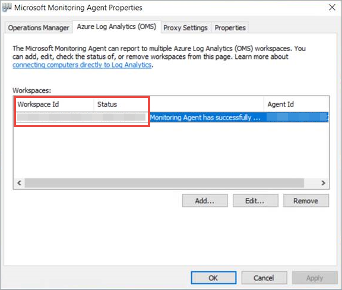
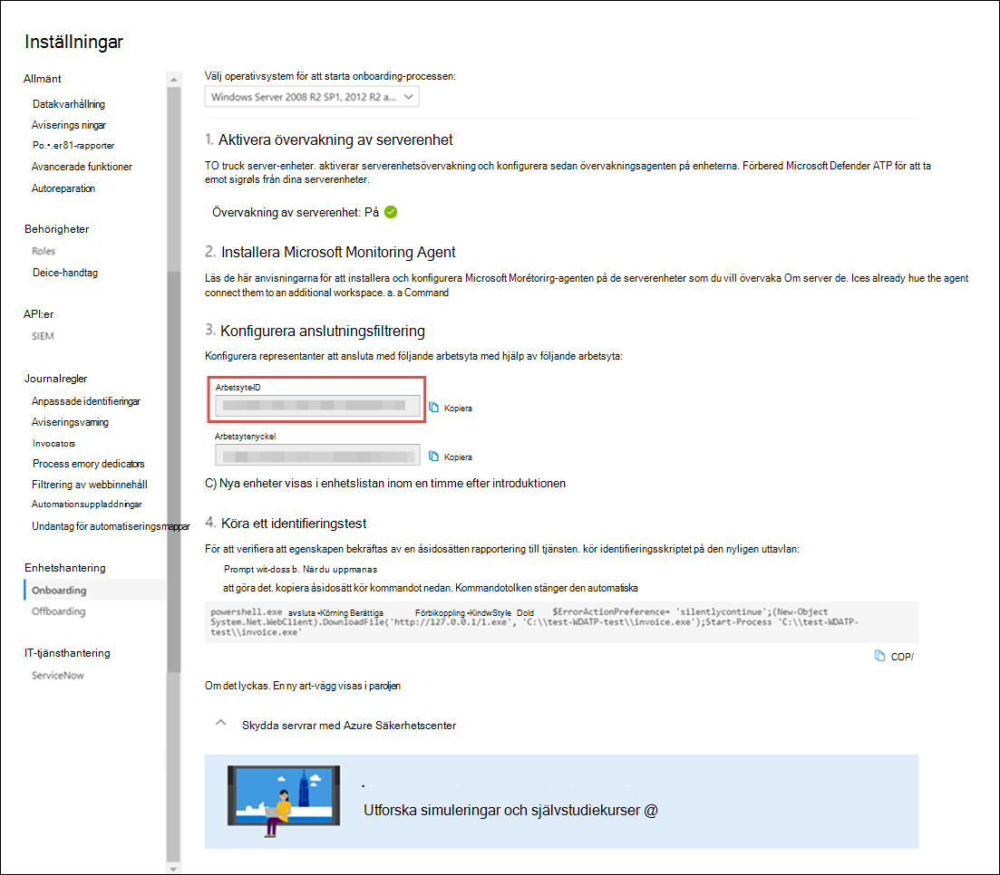

# <a name="onboard-windows-servers-to-the-microsoft-defender-for-endpoint-service"></a>Introducera Windows-servrar till Microsoft Defender för slutpunktstjänsten

[!INCLUDE [Microsoft 365 Defender rebranding](../../includes/microsoft-defender.md)]

**Gäller för:**

- Windows Server 2008 R2 SP1
- Windows Server 2012 R2
- Windows Server 2016
- Windows Server (SACK) version 1803 och senare
- Windows Server 2019 och senare
- Kärnversionen av Windows Server 2019

> Vill du använda Defender för Slutpunkt? [Registrera dig för en kostnadsfri utvärderingsversion.](https://www.microsoft.com/microsoft-365/windows/microsoft-defender-atp?ocid=docs-wdatp-configserver-abovefoldlink)

Defender för Endpoint utökar stödet till att även omfatta Windows Server-operativsystemet. Det här stödet ger avancerade funktioner för identifiering och undersökning av angrepp via microsoft Defender Säkerhetscenter-konsolen.

Praktiska anvisningar om vad som måste finnas för licensiering och infrastruktur finns i Skydda [Windows-servrar med Defender för slutpunkt.](https://techcommunity.microsoft.com/t5/What-s-New/Protecting-Windows-Server-with-Windows-Defender-ATP/m-p/267114#M128)

Information om hur du laddar ned och använder Windows-säkerhetsbaslinjer för Windows-servrar finns i [Baslinjer för Windows-säkerhet.](https://docs.microsoft.com/windows/device-security/windows-security-baselines)

## <a name="windows-server-2008-r2-sp1-windows-server-2012-r2-and-windows-server-2016"></a>Windows Server 2008 R2 SP1, Windows Server 2012 R2 och Windows Server 2016

Du kan registrera Windows Server 2008 R2 SP1, Windows Server 2012 R2 och Windows Server 2016 till Defender för slutpunkt genom att använda något av följande alternativ:

- **Alternativ 1:** [Få igång genom att installera och konfigurera Microsoft Monitoring Agent (MMA)](#option-1-onboard-by-installing-and-configuring-microsoft-monitoring-agent-mma)
- **Alternativ 2:** [Hantera via Azure Säkerhetscenter](#option-2-onboard-windows-servers-through-azure-security-center)
- **Alternativ 3:** [Introduktion till Microsoft Endpoint Manager version 2002 och senare](#option-3-onboard-windows-servers-through-microsoft-endpoint-manager-version-2002-and-later)

När du har slutfört introduktionsstegen med något av de angivna alternativen måste du Konfigurera och uppdatera [System Center Endpoint Protection-klienter.](#configure-and-update-system-center-endpoint-protection-clients)

> [!NOTE]
> Defender för fristående slutpunkt för serverlicens krävs per nod, för att kunna introducera en Windows-server via Microsoft Monitoring Agent (alternativ 1) eller via Microsoft Endpoint Manager (Alternativ 3). Du kan också behöva en Azure Defender för servrar-licens per nod för att kunna hantera en Windows-server via Azure Security Center (alternativ 2) i Funktioner som stöds i [Azure Defender.](https://docs.microsoft.com/azure/security-center/security-center-services)

### <a name="option-1-onboard-by-installing-and-configuring-microsoft-monitoring-agent-mma"></a>Alternativ 1: Registrera dig genom att installera och konfigurera Microsoft Monitoring Agent (MMA)

Du måste installera och konfigurera MMA för Windows-servrar för att rapportera sensordata till Defender för slutpunkt. Mer information finns i Samla [in loggdata med Azure Log Analytics-agenten.](https://docs.microsoft.com/azure/azure-monitor/platform/log-analytics-agent)

Om du redan använder System Center Operations Manager (SCOM) eller Azure Monitor (tidigare kallat Operations Management Suite (OMS)) kan du koppla Microsoft Monitoring Agent (MMA) till din Defender för slutpunkt-arbetsyta via Stöd för Multihoming.

I allmänhet måste du göra följande:

1. Uppfylla kraven för introduktion som beskrivs i **avsnittet Innan du börjar.**
2. Aktivera serverövervakning från Microsoft Defender Säkerhetscenter.
3. Installera och konfigurera MMA för servern för att rapportera sensordata till Defender för Slutpunkt.
4. Konfigurera och uppdatera System Center Endpoint Protection-klienter.

> [!TIP]
> När du har introducerat enheten kan du välja att köra ett identifieringstest för att verifiera att den är korrekt onboarded till tjänsten. Mer information finns i Köra [ett identifieringstest på en nyligen onboarded Defender för Slutpunktsslutpunkt.](run-detection-test.md)

#### <a name="before-you-begin"></a>Innan du börjar

Utför följande steg för att uppfylla kraven för registrering:

För Windows Server 2008 R2 SP1 eller Windows Server 2012 R2 bör du installera följande snabbkorrigering:

- [Uppdatering för kundupplevelse och diagnostisk telemetri](https://support.microsoft.com/help/3080149/update-for-customer-experience-and-diagnostic-telemetry)

För Windows Server 2008 R2 SP1: se till att du uppfyller följande krav:

- Installera den [månatliga uppdateringen för februari](https://support.microsoft.com/help/4074598/windows-7-update-kb4074598)
- Installera [antingen .NET framework 4.5](https://www.microsoft.com/download/details.aspx?id=30653) (eller senare) eller [KB3154518](https://support.microsoft.com/help/3154518/support-for-tls-system-default-versions-included-in-the-net-framework)

    > [!NOTE]
    > Om du hanterar Windows Server 2008 R2 SP1 med SCCM installerar SCCM-klientagenten .Net Framework 4.5.2. Du behöver därför inte installera .NET Framework 4.5 (eller senare).

För Windows Server 2008 R2 SP1 och Windows Server 2012 R2: Konfigurera och uppdatera [slutpunktsskyddsklienter för System Center.](#configure-and-update-system-center-endpoint-protection-clients)

> [!NOTE]
> Det här steget krävs bara om din organisation använder System Center Endpoint Protection (SFÖNSTER) och du använder Windows Server 2008 R2 SP1 och Windows Server 2012 R2.

### <a name="install-and-configure-microsoft-monitoring-agent-mma-to-report-sensor-data-to-microsoft-defender-for-endpoint"></a>Installera och konfigurera MMA (Microsoft Monitoring Agent) för att rapportera sensordata till Microsoft Defender för slutpunkt

1. Ladda ned installationsfilen för agenten: [Windows 64-bitars agent](https://go.microsoft.com/fwlink/?LinkId=828603).

2. Med nyckeln arbetsyte-ID och arbetsyta som hämtas i föregående procedur väljer du någon av följande installationsmetoder för att installera agenten på Windows-servern:
    - [Installera agenten manuellt med hjälp av konfigurationen](https://docs.microsoft.com/azure/log-analytics/log-analytics-windows-agents#install-agent-using-setup-wizard). 
    På sidan **Alternativ för konfiguration av** agent väljer du Anslut **agenten till Azure Log Analytics (OMS).**
    - [Installera agenten med kommandoraden](https://docs.microsoft.com/azure/log-analytics/log-analytics-windows-agents#install-agent-using-command-line).
    - [Konfigurera agenten med hjälp av ett skript](https://docs.microsoft.com/azure/log-analytics/log-analytics-windows-agents#install-agent-using-dsc-in-azure-automation).

> [!NOTE]
> Om du [](gov.md)är myndighetskund i USA måste du under "Azure Cloud" välja "Azure US Government" om du använder installationsguiden, eller om du använder en kommandorad eller ett skript – ange parametern "OPINSIGHTS_WORKSPACE_AZURE_CLOUD_TYPE" till 1.

### <a name="configure-windows-server-proxy-and-internet-connectivity-settings-if-needed"></a>Konfigurera Windows-serverproxy och internetanslutningsinställningar vid behov

Om dina servrar behöver använda en proxyserver för att kommunicera med Defender för Slutpunkt använder du någon av följande metoder för att konfigurera MMA att använda proxyservern:

- [Konfigurera MMA att använda en proxyserver](https://docs.microsoft.com/azure/azure-monitor/platform/agent-windows#install-agent-using-setup-wizard)

- [Konfigurera Windows till att använda en proxyserver för alla anslutningar](configure-proxy-internet.md)

Om en proxy eller brandvägg används ska du se till att servrar kan komma åt alla URL-adresser för Microsoft Defender för Endpoint-tjänsten direkt och utan SSL-avlyssning. Mer information finns i aktivera [åtkomst till Defender för slutpunktstjänst-URL:er.](configure-proxy-internet.md#enable-access-to-microsoft-defender-for-endpoint-service-urls-in-the-proxy-server) Användning av SSL-avlyssning förhindrar att systemet kommunicerar med Defender för Endpoint-tjänsten.

När den är klar bör du se de onboarded Windows-servrarna i portalen inom en timme.

### <a name="option-2-onboard-windows-servers-through-azure-security-center"></a>Alternativ 2: Hantera Windows-servrar via Azure Säkerhetscenter

1. I navigeringsfönstret för Microsoft Defender Säkerhetscenter väljer du **Inställningar Registrering**  >  **av**  >  **enhetshantering**.

2. Välj **Windows Server 2008 R2 SP1, 2012 R2 och 2016** som operativsystem.

3. Klicka **på Onboard Servers i Azure Security Center.**

4. Följ introduktionsanvisningarna i [Microsoft Defender](https://docs.microsoft.com/azure/security-center/security-center-wdatp) för Endpoint med Azure Defender och Om du använder Azure ARC följer du introduktionsanvisningarna i Aktivera Microsoft Defender för [slutpunktsintegrering.](https://docs.microsoft.com/azure/security-center/security-center-wdatp#enabling-the-microsoft-defender-for-endpoint-integration)

När du har slutfört introduktionsstegen måste du Konfigurera och uppdatera [Slutpunktsskydd-klienter i System Center.](#configure-and-update-system-center-endpoint-protection-clients)

> [!NOTE]
>
> - För att onboarding via Azure Defender for Servers ska fungera som förväntat måste servern ha en lämplig arbetsyta och nyckel konfigurerad i inställningarna för Microsoft Monitoring Agent (MMA).
> - När det har konfigurerats distribueras rätt molnhanteringspaket på datorn och sensorprocessen (MsSenseS.exe) distribueras och startas.
> - Det här krävs också om servern är konfigurerad att använda en OMS Gateway-server som proxy.

### <a name="option-3-onboard-windows-servers-through-microsoft-endpoint-manager-version-2002-and-later"></a>Alternativ 3: Introducera Windows-servrar via Microsoft Endpoint Manager version 2002 och senare

Du kan registrera Windows Server 2012 R2 och Windows Server 2016 med hjälp av Microsoft Endpoint Manager version 2002 och senare. Mer information finns i [Microsoft Defender för Slutpunkt i Microsoft Endpoint Manager current branch](https://docs.microsoft.com/mem/configmgr/protect/deploy-use/defender-advanced-threat-protection).

När du har slutfört introduktionsstegen måste du Konfigurera och uppdatera [Slutpunktsskydd-klienter i System Center.](#configure-and-update-system-center-endpoint-protection-clients)

## <a name="windows-server-sac-version-1803-windows-server-2019-and-windows-server-2019-core-edition"></a>Windows Server (SACK) version 1803, Windows Server 2019 och Windows Server 2019 Core Edition

Du kan registrera Windows Server (SACK) version 1803, Windows Server 2019 eller Windows Server 2019 Core Edition med hjälp av följande distributionsmetoder:

- [Lokalt skript](configure-endpoints-script.md)
- [Grupprincip](configure-endpoints-gp.md)
- [Microsoft Endpoint Configuration Manager](configure-endpoints-sccm.md)
- [System Center Configuration Manager 2012 / 2012 R2 1511 / 1602](configure-endpoints-sccm.md#onboard-devices-using-system-center-configuration-manager)
- [VDI-onboardingskript för icke-beständiga enheter](configure-endpoints-vdi.md)

> [!NOTE]
>
> - Onboarding-paketet för Windows Server 2019 till Microsoft Endpoint Manager levereras för närvarande ett skript. Mer information om hur du distribuerar skript i Configuration Manager finns i [Paket och program i Configuration Manager.](https://docs.microsoft.com/configmgr/apps/deploy-use/packages-and-programs)
> - Ett lokalt skript är lämpligt för ett konceptbevis men bör inte användas för produktionsdistribution. För produktionsdistribution rekommenderar vi att du använder grupprinciper eller Microsoft Endpoint Configuration Manager.

Stöd för Windows Server ger djupare insikter i serveraktiviteter, vad gäller kernel- och minnesattack och möjliggör svarsåtgärder.

1. Konfigurera onboardinginställningar för Defender för slutpunkt på Windows-servern med samma verktyg och metoder för Windows 10-enheter. Mer information finns i Introducera [Windows 10-enheter.](configure-endpoints.md)

2. Om du kör en lösning mot skadlig programvara från tredje part måste du använda följande inställningar för Microsoft Defender AV-passivt läge. Kontrollera att den har konfigurerats korrekt:

    1. Ange följande registerpost:
       - Sökväg: `HKLM\SOFTWARE\Policies\Microsoft\Windows Advanced Threat Protection`
       - Namn: ForceDefenderPassiveMode
       - Typ: REG_DWORD
       - Värde: 1

    1. Kör följande PowerShell-kommando för att verifiera att det passiva läget har konfigurerats:

       ```PowerShell
       Get-WinEvent -FilterHashtable @{ProviderName="Microsoft-Windows-Sense" ;ID=84}
       ```

    1. Bekräfta att en nyligen genomförd händelse som innehåller händelsen passiv form hittas:

       

3. Kör följande kommando för att kontrollera om Microsoft Defender AV är installerat:

   ```sc.exe query Windefend```

    Om resultatet är "Den angivna tjänsten finns inte som en installerad tjänst" måste du installera Microsoft Defender AV. Mer information finns i [Microsoft Defender Antivirus i Windows 10.](https://docs.microsoft.com/windows/security/threat-protection/microsoft-defender-antivirus/microsoft-defender-antivirus-in-windows-10)

    Mer information om hur du använder grupprinciper för att konfigurera och hantera Microsoft Defender Antivirus på dina Windows-servrar finns i Använda grupprincipinställningar för att konfigurera och hantera [Microsoft Defender Antivirus.](https://docs.microsoft.com/windows/security/threat-protection/microsoft-defender-antivirus/use-group-policy-microsoft-defender-antivirus)

## <a name="integration-with-azure-defender"></a>Integrering med Azure Defender

Defender för Endpoint kan integreras med Azure Defender för att tillhandahålla en omfattande lösning för Windows-serverskydd. Med den här integreringen kan Azure Defender använda kraften i Defender för Slutpunkt för att tillhandahålla förbättrad identifiering av hot för Windows-servrar.

Följande funktioner ingår i den här integreringen:

- Automatisk onboarding – Defender för slutpunkts sensor aktiveras automatiskt på Windows-servrar som är onboarded to Azure Defender. Mer information om Azure Defender-registrering finns i [Onboarding till Azure Defender Standard för förbättrad säkerhet.](https://docs.microsoft.com/azure/security-center/security-center-onboarding)

    > [!NOTE]
    > Integreringen mellan Azure Defender för servrar och Microsoft Defender för slutpunkt har utökats med stöd för [Windows Server 2019 och Windows Virtual Desktop (WVD).](https://docs.microsoft.com/azure/security-center/release-notes#microsoft-defender-for-endpoint-integration-with-azure-defender-now-supports-windows-server-2019-and-windows-10-virtual-desktop-wvd-in-preview)

- Windows-servrar som övervakas av Azure Defender blir också tillgängliga i Defender för slutpunkt – Azure Defender ansluter sömlöst till Defender för slutpunktsklientorganisationen, vilket ger en enda vy över alla klienter och servrar.  Dessutom är Defender för slutpunktsaviseringar tillgängliga i Azure Defender-konsolen.
- Serverundersökning – Azure Defender-kunder kan få åtkomst till Microsoft Defender Säkerhetscenter för att utföra detaljerad undersökning för att ta reda på omfattningen av en möjlig överträdelse.

> [!IMPORTANT]
> - När du använder Azure Defender för att övervaka servrar skapas automatiskt en Defender för slutpunktsklientorganisation (i USA för USA-användare i EU för europeiska och brittiska användare).<br>
Data som samlas in av Defender för Endpoint lagras på klientorganisationens geoplats som identifieras under etableringen.
> - Om du använder Defender för slutpunkt innan du använder Azure Defender lagras dina data på den plats som du angav när du skapade klientorganisationen, även om du integrerar med Azure Defender vid ett senare tillfälle.
> - När den har konfigurerats kan du inte ändra platsen där dina data lagras. Om du behöver flytta dina data till en annan plats måste du kontakta Microsoft Support för att återställa klientorganisationen. <br>
Serverslutpunktsövervakning som använder den här integreringen har inaktiverats för Office 365 GCC-kunder.

## <a name="configure-and-update-system-center-endpoint-protection-clients"></a>Konfigurera och uppdatera System Center Endpoint Protection-klienter

Defender för Endpoint integreras med System Center Endpoint Protection. Integreringen ger möjlighet till identifiering av skadlig programvara och för att stoppa spridningen av en attack i organisationen genom att förbjuda potentiellt skadliga filer eller misstänkt skadlig programvara.

Följande steg krävs för att aktivera den här integreringen:

- Installera uppdateringen för plattformen för skydd mot skadlig programvara i januari [2017 för Endpoint Protection-klienter.](https://support.microsoft.com/help/3209361/january-2017-anti-malware-platform-update-for-endpoint-protection-clie)

- [Konfigurera medlemskap i S FLERA-klientens Molnskyddstjänst](https://docs.microsoft.com/windows/security/threat-protection/microsoft-defender-antivirus/enable-cloud-protection-microsoft-defender-antivirus) till **inställningen** Avancerat.

## <a name="offboard-windows-servers"></a>Offboard Windows-servrar

Du kan offboard Windows Server (SACK), Windows Server 2019 och Windows Server 2019 Core-versionen på samma sätt som för Windows 10-klientenheter.

För andra Versioner av Windows-servrar har du två alternativ för att ta bort Windows-servrar från tjänsten:

- Avinstallera MMA-agenten
- Ta bort Defender för slutpunktsarbetsytans konfiguration

> [!NOTE]
> Offboarding gör att Windows-servern slutar skicka sensordata till portalen, men data från Windows-servern, inklusive referens till eventuella aviseringar som den haft kommer att behållas i upp till 6 månader.

### <a name="uninstall-windows-servers-by-uninstalling-the-mma-agent"></a>Avinstallera Windows-servrar genom att avinstallera MMA-agenten

Om du vill ta bort Windows-servern kan du avinstallera MMA-agenten från Windows-servern eller koppla från den från rapporteringen till Defender för slutpunkt-arbetsytan. Efter offboarding av agenten skickar Windows-servern inte längre sensordata till Defender för Slutpunkt.
Mer information finns i Inaktivera [en agent](https://docs.microsoft.com/azure/log-analytics/log-analytics-windows-agents#to-disable-an-agent).

### <a name="remove-the-defender-for-endpoint-workspace-configuration"></a>Ta bort Defender för slutpunktsarbetsytans konfiguration

Om du vill ta bort Windows-servern från en annan dator kan du använda någon av följande metoder:

- Ta bort konfiguration av Defender för slutpunktsarbetsyta från MMA-agenten
- Köra ett PowerShell-kommando för att ta bort konfigurationen

#### <a name="remove-the-defender-for-endpoint-workspace-configuration-from-the-mma-agent"></a>Ta bort konfiguration av Defender för slutpunktsarbetsyta från MMA-agenten

1. I egenskaperna **för Microsoft Monitoring Agent** väljer du fliken Azure Log Analytics **(OMS).**

2. Välj Defender för slutpunktsarbetsytan och klicka på **Ta bort**.

    

#### <a name="run-a-powershell-command-to-remove-the-configuration"></a>Köra ett PowerShell-kommando för att ta bort konfigurationen

1. Skaffa ditt arbetsyte-ID:

   1. Välj Inställningar Onboarding **i**  >  **navigeringsfönstret.**

   1. Välj **Windows Server 2008 R2 SP1, 2012 R2 och 2016** som operativsystem och få ditt Arbetsyte-ID:

      

2. Öppna en PowerShell med förhöjd behörighet och kör följande kommando. Använd det arbetsyte-ID du skaffade och `WorkspaceID` ersätter:

    ```powershell
    $ErrorActionPreference = "SilentlyContinue&quot;
    # Load agent scripting object
    $AgentCfg = New-Object -ComObject AgentConfigManager.MgmtSvcCfg
    # Remove OMS Workspace
    $AgentCfg.RemoveCloudWorkspace(&quot;WorkspaceID")
    # Reload the configuration and apply changes
    $AgentCfg.ReloadConfiguration()

    ```

## <a name="onboarding-servers-with-no-management-solution"></a>Onboarding Servers utan hanteringslösning

### <a name="using-group-policy"></a>Använda grupprinciper

**Steg 1: Skapa de filer som behövs för att kopiera till servrarna.**

1. Gå till c:\windows\sysvol\domain\scripts (du kan behöva ändra kontrollen på en av domänkontrollanterna.)
1. Skapa en mapp med namnet MMA.
1. Ladda ned följande och placera den i MMA-mappen:

    **Uppdatering för kundupplevelse och diagnostisk telemetri (Windows Server 2008 R2 och Windows Server 2012 R2)**

    [För Windows 2008 R2 x64](https://www.microsoft.com/download/details.aspx?familyid=1bd1d18d-4631-4d8e-a897-327925765f71)

    [För Windows 2012 R2 x64](https://www.microsoft.com/download/details.aspx?familyid=94cf6d85-017a-4c4c-afca-7d00721b500f)

    > [!NOTE]
    > Den här artikeln förutsätter att du använder x64-baserade servrar (MMA-agent .exe x64 [Ny SHA-2-kompatibel version](https://go.microsoft.com/fwlink/?LinkId=828603))

**Steg-2: Skapa ett filnamn DeployMMA.cmd (med anteckningar)** Lägg till följande rader i cmd-filen. Observera att du behöver ditt ARBETSYTE-ID och en NYCKEL.

```dos
@echo off 
cd "C:"
IF EXIST "C:\Program Files\Microsoft Monitoring Agent\Agent\MonitoringHost.exe" ( 
exit
) ELSE (
wusa.exe c:\Windows\MMA\Windows6.1-KB123456-x86.msu /quiet /norestart
wusa.exe c:\Windows\MMA\Windows8.1-KB123456-x86.msu /quiet /norestart
"c:\windows\MMA\MMASetup-AMD64.exe" /C:"setup.exe /qn ADD_OPINSIGHTS_WORKSPACE=1
OPINSIGHTS_WORKSPACE_ID=<your workspace ID>
OPINSIGHTS_WORKSPACE_KEY=<your workspace key>== AcceptEndUserLicenseAgreement=1"
)
```

## <a name="group-policy-configuration"></a>Grupprincipkonfiguration

Skapa en ny grupprincip specifikt för onboarding-enheter, till exempel "Microsoft Defender för slutpunkts onboarding".

- Skapa en grupprincipmapp med namnet "c:\windows\MMA"

     :::image type="content" source="images/grppolicyconfig1.png" alt-text="mappar":::

    **Då sparas en ny mapp på varje server där GPO:t tillämpas, en så kallad MMA-mapp, som lagras i c:\windows. Det här innehåller installationsfilerna för MMA, krav och installationsskript.**

- Skapa en inställning för grupprincipfiler för var och en av de filer som lagras i Net-inloggningen.

     :::image type="content" source="images/grppolicyconfig2.png" alt-text="grupprincipbild1":::

Filerna kopieras från DOMÄN\NETLOGON\MMA\filnamn till C:\windows\MMA\filnamn – så installationsfilerna är lokala **för servern:**

:::image type="content" source="images/deploymma.png" alt-text="distribuera mma cmd":::

För de två KBs (en för Windows Server 2008R2/Windows 7 och en annan för Windows Server 2012 R2) upprepar du processen men skapar objektnivåanpassning på fliken COMMON, så filen kopieras bara till lämplig plattform/operativsystem-version i omfattning:

:::image type="content" source="images/targeteditor.png" alt-text="målredigeraren":::

- För Windows Server 2008 R2 behöver du (och den kopieras bara nedåt) Windows6.1-BJ3080149-x64.msu
- För Windows Server 2012 R2 behöver du (och den kopieras bara nedåt) Windows8.1-BJ3080149-x64.msu

När det är klart måste du skapa en princip för startskript:

:::image type="content" source="images/startupprops.png" alt-text="startegenskaper":::

Namnet på filen som ska köras här är c:\windows\MMA\DeployMMA.cmd När servern startas om som en del av startprocessen installeras uppdatering för kundupplevelse och diagnostisk telemetri KB, och SEDAN installera MMAAgent, samtidigt som du anger arbetsyte-ID och -nyckel, så tas servern med.

Du kan också använda en **omedelbar uppgift** för att köra distribueraMMA.cmd om du inte vill starta om alla servrar.
Det kan du göra i två faser. Skapa först **filerna och** mappen i GPO – Se till att GPO:t tillämpas och att alla servrar har installationsfilerna. Lägg sedan till den direkta uppgiften. Det här uppnår samma resultat utan att behöva starta om datorn.

Eftersom skriptet har en utgångsmetod och inte körs på nytt om MMA är installerat, kan du också använda en daglig schemalagd aktivitet för att uppnå samma resultat. Liknar en konfigurationshanterarens efterlevnadsprincip som den kontrollerar dagligen för att säkerställa att MMA finns.

:::image type="content" source="images/schtask.png" alt-text="schemalägg aktivitet":::

:::image type="content" source="images/newtaskprops.png" alt-text="nya aktivitetsegenskaper":::

:::image type="content" source="images/deploymmadowmload.png" alt-text="distribuera mma nedladdnings-props":::

:::image type="content" source="images/tasksch.png" alt-text="schemaläggaren":::

Som nämns i dokumentationen för onboarding för Server specifikt kring Server 2008 R2 kan du se nedan:

För Windows Server 2008 R2 PS1: se till att du uppfyller följande krav:

- Installera den [månatliga uppdateringen för februari 2018](https://support.microsoft.com/help/4074598/windows-7-update-kb4074598)
  
- Installera [antingen .NET framework 4.5](https://www.microsoft.com/download/details.aspx?id=30653) (eller senare) eller [KB3154518](https://support.microsoft.com/help/3154518/support-for-tls-system-default-versions-included-in-the-net-framework)

Kontrollera vilka KB som finns innan du börjar använda Windows Server 2008 R2 Den här processen gör att du kan hantera alla servrar om du inte har Configuration Manager som hanterar servrar.

## <a name="related-topics"></a>Relaterade ämnen

- [Registrera Windows 10-enheter](configure-endpoints.md)
- [Registrera icke-Windows-enheter](configure-endpoints-non-windows.md)
- [Konfigurera inställningar för proxy- och Internetanslutning](configure-proxy-internet.md)
- [Köra ett identifieringstest på en nyligen onboarded Defender för Endpoint-enhet](run-detection-test.md)
- [Felsökning av problem med introduktion till Microsoft Defender för slutpunkt](troubleshoot-onboarding.md)
