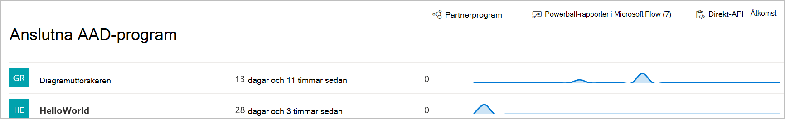

# Anslutna program i Microsoft Defender för Slutpunkt

[!INCLUDE [Microsoft 365 Defender rebranding](../../includes/microsoft-defender.md)]

**Gäller för:**
- [Microsoft Defender för Endpoint](https://go.microsoft.com/fwlink/p/?linkid=2154037)
- [Microsoft 365 Defender](https://go.microsoft.com/fwlink/?linkid=2118804)

>Vill du använda Defender för Slutpunkt? [Registrera dig för en kostnadsfri utvärderingsversion.](https://www.microsoft.com/microsoft-365/windows/microsoft-defender-atp?ocid=docs-wdatp-assignaccess-abovefoldlink)

Anslutna program integreras med Defender för slutpunktsplattformen med API:er. 

Program använder standard-OAuth 2.0-protokollet för att autentisera och tillhandahålla token för användning med Microsoft Defender för slutpunkts-API:er.  Dessutom tillåter Azure Active Directory (Azure AD) att innehavaradministratörer kan ställa in explicit kontroll över vilka API:er som kan nås med hjälp av motsvarande app.
 
Du måste följa de här [anvisningarna för att](/microsoft-365/security/defender-endpoint/apis-intro) använda API:erna med det anslutna programmet.
 
## Öppna sidan för det anslutna programmet
I den vänstra navigeringsmenyn väljer du **Partners & API:er**  >  **anslutna AAD-program.**

 
## Visa information om anslutna program
Sidan Anslutna program innehåller information om de Azure AD-program som är anslutna till Microsoft Defender för Slutpunkt i din organisation. Du kan granska användningen av anslutna program: senast sedd, antal begäranden under de senaste 24 timmarna och begär trender under de senaste 30 dagarna.

 
## Redigera, konfigurera om eller ta bort ett anslutet program
Länken **Öppna programinställningar** öppnar motsvarande sida för Hantering av Azure AD-program i Azure-portalen. Från Azure Portal kan du hantera behörigheter, konfigurera om eller ta bort anslutna program.
