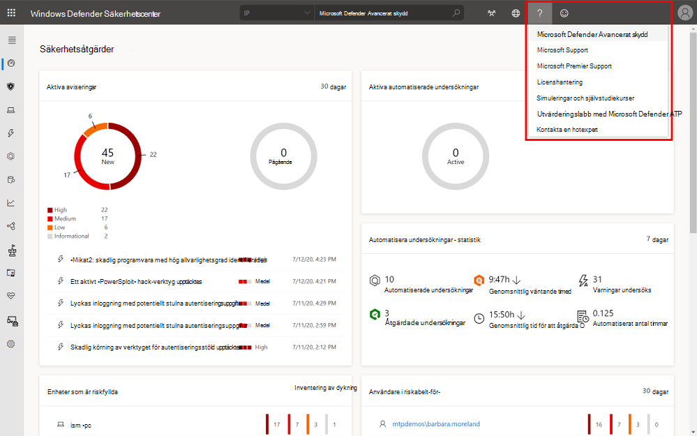
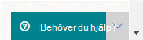
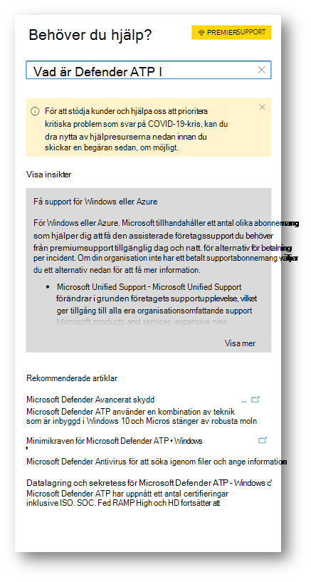
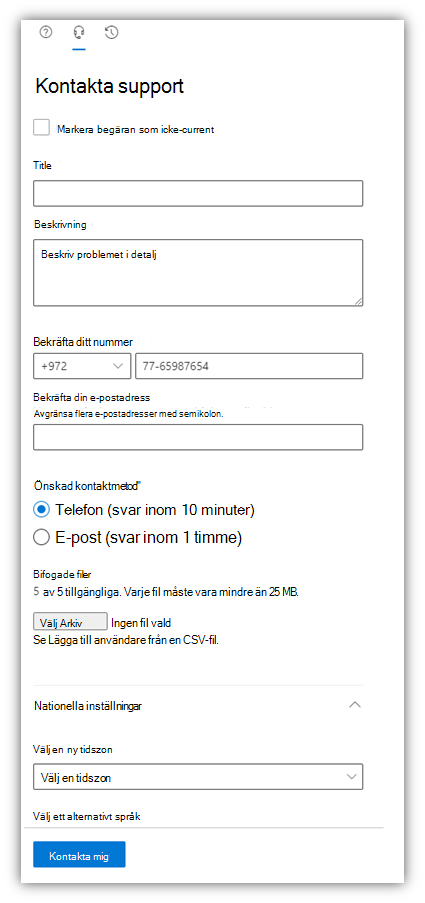

# Kontakta Microsoft Defender för slutpunktssupportContact Microsoft Defender for Endpoint support

[!INCLUDE [Microsoft 365 Defender rebranding](../../includes/microsoft-defender.md)]

**Gäller för:****Applies to:**
- [Microsoft Defender för EndpointMicrosoft Defender for Endpoint](https://go.microsoft.com/fwlink/p/?linkid=2154037)
- [Microsoft 365 DefenderMicrosoft 365 Defender](https://go.microsoft.com/fwlink/?linkid=2118804)

>Vill du använda Defender för Slutpunkt?Want to experience Defender for Endpoint? [Registrera dig för en kostnadsfri utvärderingsversion.Sign up for a free trial.](https://www.microsoft.com/microsoft-365/windows/microsoft-defender-atp?ocid=docs-wdatp-assignaccess-abovefoldlink)

Defender för Endpoint har nyligen uppgraderat supportprocessen för att erbjuda en mer modern och avancerad supportupplevelse.Defender for Endpoint has recently upgraded the support process to offer a more modern and advanced support experience. 

Med den nya widgeten kan kunder:The new widget allows customers to:
- Hitta lösningar på vanliga problemFind solutions to common problems
- Skicka ett supportfall till Microsofts supportteamSubmit a support case to the Microsoft support team

## FörutsättningarPrerequisites
Det är viktigt att känna till de specifika roller som har behörighet att öppna supportärenden.It's important to know the specific roles that have permission to open support cases.

Du måste minst ha rollen Tjänstsupportadministratör **ELLER** Supportadministratör.At a minimum, you must have a Service Support Administrator **OR** Helpdesk Administrator role.

Mer information om vilka roller som har behörighet finns i Behörigheter [för säkerhetsadministratör.](https://docs.microsoft.com/azure/active-directory/users-groups-roles/directory-assign-admin-roles#security-administrator-permissions)For more information on which roles have permission see, [Security Administrator permissions](https://docs.microsoft.com/azure/active-directory/users-groups-roles/directory-assign-admin-roles#security-administrator-permissions). Roller som innehåller åtgärden kan `microsoft.office365.supportTickets/allEntities/allTasks` skicka ett ärende.Roles that include the action `microsoft.office365.supportTickets/allEntities/allTasks` can submit a case.

Allmän information om administratörsroller finns i [Om administratörsroller.](https://docs.microsoft.com/microsoft-365/admin/add-users/about-admin-roles?view=o365-worldwide&preserve-view=true)For general information on admin roles, see [About admin roles](https://docs.microsoft.com/microsoft-365/admin/add-users/about-admin-roles?view=o365-worldwide&preserve-view=true).

## Komma åt widgetenAccess the widget
Åtkomst till den nya supportwidgeten kan göras på två olika sätt:Accessing the new support widget can be done in one of two ways:

1.  Klicka på frågetecknet längst upp till höger i portalen och klicka sedan på "Microsoft Support":Clicking on the question mark on the top right of the portal and then clicking on "Microsoft support":

    

2. Klickar du på **behöver du hjälp?**Clicking on the **Need help?**  längst ned till höger i Microsoft Defender Säkerhetscenter:button in the bottom right of the Microsoft Defender Security Center:

    

I widgeten erbjuds du två alternativ:In the widget you will be offered two options:

- Hitta lösningar på vanliga problemFind solutions to common problems    
- Öppna en tjänstbegäranOpen a service request  

## Hitta lösningar på vanliga problemFind solutions to common problems
Det här alternativet innehåller artiklar som kan vara relaterade till den fråga du kan ställa.This option includes articles that might be related to the question you may ask. Börja skriva frågan i sökrutan så visas artiklar relaterade till sökningen.Just start typing the question in the search box and articles related to your search will be surfaced.

Om de föreslagna artiklarna inte är tillräckliga kan du öppna en tjänstbegäran.In case the suggested articles are not sufficient, you can open a service request.

## Öppna en tjänstbegäranOpen a service request

Lär dig hur du öppnar supportärenden genom att kontakta Defender för Endpoint-supporten.Learn how to open support tickets by contacting Defender for Endpoint support. 

### Kontakta supportContact support
Du kan välja det här alternativet genom att klicka på ikonen som ser ut som ett headset.This option is available by clicking the icon that looks like a headset. Du får sedan följande sida för att skicka ditt supportfall:You will then get the following page to submit your support case:

1. Fyll i en titel och beskrivning av ditt problem, samt ett telefonnummer och en e-postadress som vi kan nå dig på.Fill in a title and description for the issue you are facing, as well as a phone number and email address where we may reach you. 

2. (Valfritt) Ta med upp till fem bifogade filer som är relevanta för problemet för att ge ytterligare kontext för supportproblemet.(Optional) Include up to five attachments that are relevant to the issue in order to provide additional context for the support case. 

3. Välj din tidszon och ett alternativt språk, om tillämpligt.Select your time zone and an alternative language, if applicable. Begäran skickas till Microsofts supportteam.The request will be sent to Microsoft Support Team. Gruppen svarar på din tjänstbegäran inom kort.The team will respond to your service request shortly.

## Relaterade ämnenRelated topics
- [Felsöka tjänstproblemTroubleshoot service issues](troubleshoot-mdatp.md)
- [Kontrollera tjänstens hälsaCheck service health](service-status.md)