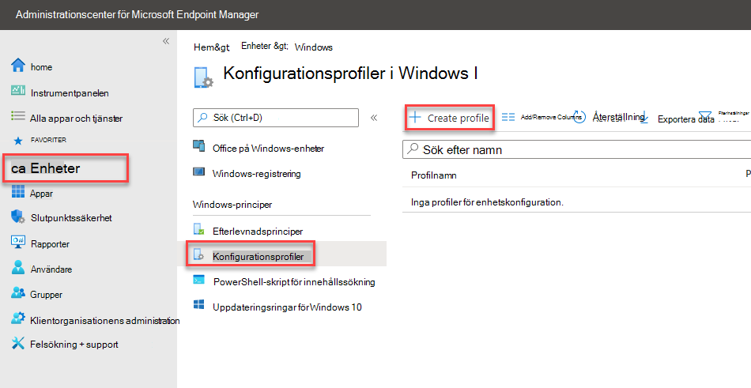

# <a name="how-to-control-usb-devices-and-other-removable-media-using-microsoft-defender-for-endpoint"></a><span data-ttu-id="2a91b-103">Styra USB-enheter och andra flyttbara medium med Hjälp av Microsoft Defender för Endpoint</span><span class="sxs-lookup"><span data-stu-id="2a91b-103">How to control USB devices and other removable media using Microsoft Defender for Endpoint</span></span>

<span data-ttu-id="2a91b-104">**Gäller för:** [Microsoft Defender för slutpunkt](https://go.microsoft.com/fwlink/p/?linkid=2069559)</span><span class="sxs-lookup"><span data-stu-id="2a91b-104">**Applies to:** [Microsoft Defender for Endpoint](https://go.microsoft.com/fwlink/p/?linkid=2069559)</span></span>

<span data-ttu-id="2a91b-105">Microsoft rekommenderar en lager metoden för att skydda flyttbara media [,](https://aka.ms/devicecontrolblog)och Microsoft Defender för Endpoint ger flera övervaknings- och kontrollfunktioner för att förhindra att hot för obehörig kringutrustning komprometteras från dina enheter:</span><span class="sxs-lookup"><span data-stu-id="2a91b-105">Microsoft recommends [a layered approach to securing removable media](https://aka.ms/devicecontrolblog), and Microsoft Defender for Endpoint provides multiple monitoring and control features to help prevent threats in unauthorized peripherals from compromising your devices:</span></span>

1. <span data-ttu-id="2a91b-106">[Upptäck ansluta och spela upp anslutna händelser för kringutrustning i Microsoft Defender för avancerad sökning i Endpoint.](#discover-plug-and-play-connected-events)</span><span class="sxs-lookup"><span data-stu-id="2a91b-106">[Discover plug and play connected events for peripherals in Microsoft Defender for Endpoint advanced hunting](#discover-plug-and-play-connected-events).</span></span> <span data-ttu-id="2a91b-107">Identifiera eller undersöka misstänkt användningsaktivitet.</span><span class="sxs-lookup"><span data-stu-id="2a91b-107">Identify or investigate suspicious usage activity.</span></span>

2. <span data-ttu-id="2a91b-108">Konfigurera för att tillåta eller blockera endast vissa flyttbara enheter och förhindra hot.</span><span class="sxs-lookup"><span data-stu-id="2a91b-108">Configure to allow or block only certain removable devices and prevent threats.</span></span>
    1. <span data-ttu-id="2a91b-109">[Tillåt eller blockera flyttbara enheter](#allow-or-block-removable-devices) baserat på detaljerad konfiguration för att neka skrivåtkomst till flyttbara diskar och godkänna eller neka enheter med hjälp av USB-enhets-ID.</span><span class="sxs-lookup"><span data-stu-id="2a91b-109">[Allow or block removable devices](#allow-or-block-removable-devices) based on granular configuration to deny write access to removable disks and approve or deny devices by using USB device IDs.</span></span> <span data-ttu-id="2a91b-110">Flexibel principtilldelning av enhetsinstallationsinställningar baserat på en enskild användare eller grupp av Azure Active Directory (Azure AD) användare och enheter.</span><span class="sxs-lookup"><span data-stu-id="2a91b-110">Flexible policy assignment of device installation settings based on an individual or group of Azure Active Directory (Azure AD) users and devices.</span></span>

    2. <span data-ttu-id="2a91b-111">[Förhindra hot från flyttbara lagringsmedia som](#prevent-threats-from-removable-storage) introduceras genom flyttbara lagringsenheter genom att aktivera:</span><span class="sxs-lookup"><span data-stu-id="2a91b-111">[Prevent threats from removable storage](#prevent-threats-from-removable-storage) introduced by removable storage devices by enabling:</span></span>  
        - <span data-ttu-id="2a91b-112">Microsoft Defender Antivirus realtidsskydd (RTP) för att söka igenom det flyttbara lagringsutrymmet efter skadlig kod.</span><span class="sxs-lookup"><span data-stu-id="2a91b-112">Microsoft Defender Antivirus real-time protection (RTP) to scan removable storage for malware.</span></span>  
        - <span data-ttu-id="2a91b-113">USB-regeln (Attack Surface Reduction) för att blockera icke betrodda och osignerade processer som körs från USB.</span><span class="sxs-lookup"><span data-stu-id="2a91b-113">The Attack Surface Reduction (ASR) USB rule to block untrusted and unsigned processes that run from USB.</span></span>  
        - <span data-ttu-id="2a91b-114">DMA-skyddsinställningar (Direct Memory Access) för att minimera DMA-attacker, t.ex. Kernel DMA Protection för Kernel DMA Protection för Kernel och blockera DMA tills en användare loggar in.</span><span class="sxs-lookup"><span data-stu-id="2a91b-114">Direct Memory Access (DMA) protection settings to mitigate DMA attacks, including Kernel DMA Protection for Thunderbolt and blocking DMA until a user signs in.</span></span>  

3. <span data-ttu-id="2a91b-115">[Skapa anpassade aviseringar och svarsåtgärder](#create-customized-alerts-and-response-actions) för att övervaka användningen av flyttbara enheter baserat på dessa plugin-program och spela upp händelser eller andra Microsoft Defender för Slutpunkt-händelser med [anpassade identifieringsregler](/microsoft-365/security/defender-endpoint/custom-detection-rules).</span><span class="sxs-lookup"><span data-stu-id="2a91b-115">[Create customized alerts and response actions](#create-customized-alerts-and-response-actions) to monitor usage of removable devices based on these plug and play events or any other Microsoft Defender for Endpoint events with [custom detection rules](/microsoft-365/security/defender-endpoint/custom-detection-rules).</span></span>

4. <span data-ttu-id="2a91b-116">[Reagera på hot från](#respond-to-threats) kringutrustning i realtid baserat på egenskaper som rapporterats av varje kringutrustning.</span><span class="sxs-lookup"><span data-stu-id="2a91b-116">[Respond to threats](#respond-to-threats) from peripherals in real-time based on properties reported by each peripheral.</span></span>

>[!Note]
><span data-ttu-id="2a91b-117">De här åtgärderna för att minska hot hjälper till att förhindra att skadlig programvara kommer till din miljö.</span><span class="sxs-lookup"><span data-stu-id="2a91b-117">These threat reduction measures help prevent malware from coming into your environment.</span></span> <span data-ttu-id="2a91b-118">Om du vill skydda företagsdata från att lämna miljön kan du också konfigurera åtgärder för skydd mot dataförlust.</span><span class="sxs-lookup"><span data-stu-id="2a91b-118">To protect enterprise data from leaving your environment, you can also configure data loss prevention measures.</span></span> <span data-ttu-id="2a91b-119">På Windows 10-enheter kan du till exempel konfigurera [BitLocker](/windows/security/information-protection/bitlocker/bitlocker-overview.md) och [Windows Information Protection](/windows/security/information-protection/create-wip-policy-using-intune-azure.md), som krypterar företagsdata även om de lagras på en personlig enhet, eller använda [Storage/RemovableDiskDenyWriteAccess CSP](/windows/client-management/mdm/policy-csp-storage#storage-removablediskdenywriteaccess) för att neka skrivåtkomst till flyttbara diskar.</span><span class="sxs-lookup"><span data-stu-id="2a91b-119">For example, on Windows 10 devices you can configure [BitLocker](/windows/security/information-protection/bitlocker/bitlocker-overview.md) and [Windows Information Protection](/windows/security/information-protection/create-wip-policy-using-intune-azure.md), which will encrypt company data even if it is stored on a personal device, or use the [Storage/RemovableDiskDenyWriteAccess CSP](/windows/client-management/mdm/policy-csp-storage#storage-removablediskdenywriteaccess) to deny write access to removable disks.</span></span> <span data-ttu-id="2a91b-120">Du kan dessutom klassificera och skydda filer på [Windows](/windows/security/threat-protection/windows-defender-atp/information-protection-in-windows-overview) enheter (inklusive derasmonterade USB-enheter) med hjälp av Microsoft Defender för Endpoint och Azure Information Protection.</span><span class="sxs-lookup"><span data-stu-id="2a91b-120">Additionally, you can [classify and protect files on Windows devices](/windows/security/threat-protection/windows-defender-atp/information-protection-in-windows-overview) (including their mounted USB devices) by using Microsoft Defender for Endpoint and Azure Information Protection.</span></span>

## <a name="discover-plug-and-play-connected-events"></a><span data-ttu-id="2a91b-121">Upptäck ansluta och spela upp anslutna händelser</span><span class="sxs-lookup"><span data-stu-id="2a91b-121">Discover plug and play connected events</span></span>

<span data-ttu-id="2a91b-122">Du kan visa plug and play anslutna händelser i Microsoft Defender för Endpoint avancerad sökning för att identifiera misstänkt användningsaktivitet eller utföra interna undersökningar.</span><span class="sxs-lookup"><span data-stu-id="2a91b-122">You can view plug and play connected events in Microsoft Defender for Endpoint advanced hunting to identify suspicious usage activity or perform internal investigations.</span></span>
<span data-ttu-id="2a91b-123">Exempel på avancerade sökfrågor för Defender för Endpoint finns i Sökfrågor i Microsoft Defender för slutpunkt GitHub [lagringsplatsen.](https://github.com/Microsoft/WindowsDefenderATP-Hunting-Queries)</span><span class="sxs-lookup"><span data-stu-id="2a91b-123">For examples of Defender for Endpoint advanced hunting queries, see the [Microsoft Defender for Endpoint hunting queries GitHub repo](https://github.com/Microsoft/WindowsDefenderATP-Hunting-Queries).</span></span>

<span data-ttu-id="2a91b-124">Exempel på Power BI-rapportmallar finns tillgängliga för Microsoft Defender för Endpoint som du kan använda för Avancerade sökfrågor.</span><span class="sxs-lookup"><span data-stu-id="2a91b-124">Sample Power BI report templates are available for Microsoft Defender for Endpoint that you can use for Advanced hunting queries.</span></span> <span data-ttu-id="2a91b-125">Med de här exempelmallarna, bland annat en för enhetskontroll, kan du integrera avancerad sökning i Power BI.</span><span class="sxs-lookup"><span data-stu-id="2a91b-125">With these sample templates, including one for device control, you can integrate the power of Advanced hunting into Power BI.</span></span> <span data-ttu-id="2a91b-126">Mer [information GitHub lagringsplatsen för PowerBI-mallar.](https://github.com/microsoft/MDATP-PowerBI-Templates)</span><span class="sxs-lookup"><span data-stu-id="2a91b-126">See the [GitHub repository for PowerBI templates](https://github.com/microsoft/MDATP-PowerBI-Templates) for more information.</span></span> <span data-ttu-id="2a91b-127">Mer [information om hur du Power BI](/microsoft-365/security/defender-endpoint/api-power-bi) finns i Skapa anpassade Power BI med hjälp av Power BI rapport.</span><span class="sxs-lookup"><span data-stu-id="2a91b-127">See [Create custom reports using Power BI](/microsoft-365/security/defender-endpoint/api-power-bi) to learn more about Power BI integration.</span></span>

## <a name="allow-or-block-removable-devices"></a><span data-ttu-id="2a91b-128">Tillåt eller blockera flyttbara enheter</span><span class="sxs-lookup"><span data-stu-id="2a91b-128">Allow or block removable devices</span></span>
<span data-ttu-id="2a91b-129">I följande tabell beskrivs hur Microsoft Defender för Endpoint kan tillåta eller blockera flyttbara enheter baserat på en detaljerad konfiguration.</span><span class="sxs-lookup"><span data-stu-id="2a91b-129">The following table describes the ways Microsoft Defender for Endpoint can allow or block removable devices based on granular configuration.</span></span>

| <span data-ttu-id="2a91b-130">Kontroll</span><span class="sxs-lookup"><span data-stu-id="2a91b-130">Control</span></span>  | <span data-ttu-id="2a91b-131">Beskrivning</span><span class="sxs-lookup"><span data-stu-id="2a91b-131">Description</span></span> |
|----------|-------------|
| [<span data-ttu-id="2a91b-132">Begränsa USB-enheter och annan kringutrustning</span><span class="sxs-lookup"><span data-stu-id="2a91b-132">Restrict USB drives and other peripherals</span></span>](#restrict-usb-drives-and-other-peripherals) | <span data-ttu-id="2a91b-133">Du kan tillåta/förhindra att användare endast installerar USB-enheter och annan kringutrustning som finns på en lista över godkända/obehöriga enheter eller enhetstyper.</span><span class="sxs-lookup"><span data-stu-id="2a91b-133">You can allow/prevent users to install only the USB drives and other peripherals included on a list of authorized/unauthorized devices or device types.</span></span> |
| [<span data-ttu-id="2a91b-134">Blockera installation och användning av flyttbart lagringsutrymme</span><span class="sxs-lookup"><span data-stu-id="2a91b-134">Block installation and usage of removable storage</span></span>](#block-installation-and-usage-of-removable-storage) | <span data-ttu-id="2a91b-135">Det går inte att installera eller använda flyttbart lagringsutrymme.</span><span class="sxs-lookup"><span data-stu-id="2a91b-135">You can't install or use removable storage.</span></span> |
| [<span data-ttu-id="2a91b-136">Tillåt installation och användning av specifikt godkänd kringutrustning</span><span class="sxs-lookup"><span data-stu-id="2a91b-136">Allow installation and usage of specifically approved peripherals</span></span>](#allow-installation-and-usage-of-specifically-approved-peripherals)   | <span data-ttu-id="2a91b-137">Du kan bara installera och använda godkänd kringutrustning som rapporterar specifika egenskaper på den inbyggda programvaran.</span><span class="sxs-lookup"><span data-stu-id="2a91b-137">You can only install and use approved peripherals that report specific properties in their firmware.</span></span> |
| [<span data-ttu-id="2a91b-138">Förhindra installation av specifikt förbjudna kringutrustning</span><span class="sxs-lookup"><span data-stu-id="2a91b-138">Prevent installation of specifically prohibited peripherals</span></span>](#prevent-installation-of-specifically-prohibited-peripherals) | <span data-ttu-id="2a91b-139">Du kan inte installera eller använda förbjuden kringutrustning som rapporterar specifika egenskaper på den inbyggda programvaran.</span><span class="sxs-lookup"><span data-stu-id="2a91b-139">You can't install or use prohibited peripherals that report specific properties in their firmware.</span></span> |
| [<span data-ttu-id="2a91b-140">Tillåt installation och användning av specifikt godkänd kringutrustning med matchande enhetsinstans-ID</span><span class="sxs-lookup"><span data-stu-id="2a91b-140">Allow installation and usage of specifically approved peripherals with matching device instance IDs</span></span>](#allow-installation-and-usage-of-specifically-approved-peripherals-with-matching-device-instance-ids) | <span data-ttu-id="2a91b-141">Du kan bara installera och använda godkänd kringutrustning som matchar någon av dessa enhetsinstans-ID.</span><span class="sxs-lookup"><span data-stu-id="2a91b-141">You can only install and use approved peripherals that match any of these device instance IDs.</span></span> |
| [<span data-ttu-id="2a91b-142">Förhindra installation och användning av specifikt förbjudna kringutrustning med matchande enhetsinstans-ID</span><span class="sxs-lookup"><span data-stu-id="2a91b-142">Prevent installation and usage of specifically prohibited peripherals with matching device instance IDs</span></span>](#prevent-installation-and-usage-of-specifically-prohibited-peripherals-with-matching-device-instance-ids) | <span data-ttu-id="2a91b-143">Du kan inte installera eller använda förbjuden kringutrustning som matchar någon av dessa enhetsinstans-ID.</span><span class="sxs-lookup"><span data-stu-id="2a91b-143">You can't install or use prohibited peripherals that match any of these device instance IDs.</span></span> |
| [<span data-ttu-id="2a91b-144">Begränsa antalet tjänster som använder Bluetooth</span><span class="sxs-lookup"><span data-stu-id="2a91b-144">Limit services that use Bluetooth</span></span>](#limit-services-that-use-bluetooth) | <span data-ttu-id="2a91b-145">Du kan begränsa tjänsterna som kan använda Bluetooth.</span><span class="sxs-lookup"><span data-stu-id="2a91b-145">You can limit the services that can use Bluetooth.</span></span> |
| [<span data-ttu-id="2a91b-146">Använda baslinjeinställningar för Microsoft Defender för Slutpunkt</span><span class="sxs-lookup"><span data-stu-id="2a91b-146">Use Microsoft Defender for Endpoint baseline settings</span></span>](#use-microsoft-defender-for-endpoint-baseline-settings) | <span data-ttu-id="2a91b-147">Du kan ange den rekommenderade konfigurationen för ATP med hjälp av säkerhetsbaslinjen Defender för Slutpunkt.</span><span class="sxs-lookup"><span data-stu-id="2a91b-147">You can set the recommended configuration for ATP by using the Defender for Endpoint security baseline.</span></span> |

### <a name="restrict-usb-drives-and-other-peripherals"></a><span data-ttu-id="2a91b-148">Begränsa USB-enheter och annan kringutrustning</span><span class="sxs-lookup"><span data-stu-id="2a91b-148">Restrict USB drives and other peripherals</span></span>

<span data-ttu-id="2a91b-149">För att förhindra att skadlig programvara smittas eller dataförlust kan en organisation begränsa USB-enheter och annan kringutrustning.</span><span class="sxs-lookup"><span data-stu-id="2a91b-149">To prevent malware infections or data loss, an organization may restrict USB drives and other peripherals.</span></span> <span data-ttu-id="2a91b-150">I följande tabell beskrivs hur Microsoft Defender för Slutpunkt kan förhindra installation och användning av USB-enheter och annan kringutrustning.</span><span class="sxs-lookup"><span data-stu-id="2a91b-150">The following table describes the ways Microsoft Defender for Endpoint can help prevent installation and usage of USB drives and other peripherals.</span></span>

| <span data-ttu-id="2a91b-151">Kontroll</span><span class="sxs-lookup"><span data-stu-id="2a91b-151">Control</span></span>  | <span data-ttu-id="2a91b-152">Beskrivning</span><span class="sxs-lookup"><span data-stu-id="2a91b-152">Description</span></span>
|----------|-------------|
| [<span data-ttu-id="2a91b-153">Tillåt installation och användning av USB-enheter och annan kringutrustning</span><span class="sxs-lookup"><span data-stu-id="2a91b-153">Allow installation and usage of USB drives and other peripherals</span></span>](#allow-installation-and-usage-of-usb-drives-and-other-peripherals) | <span data-ttu-id="2a91b-154">Tillåt användare att endast installera USB-enheter och annan kringutrustning som finns på en lista över godkända enheter eller enhetstyper</span><span class="sxs-lookup"><span data-stu-id="2a91b-154">Allow users to install only the USB drives and other peripherals included on a list of authorized devices or device types</span></span> |
| [<span data-ttu-id="2a91b-155">Förhindra installation och användning av USB-enheter och annan kringutrustning</span><span class="sxs-lookup"><span data-stu-id="2a91b-155">Prevent installation and usage of USB drives and other peripherals</span></span>](#prevent-installation-and-usage-of-usb-drives-and-other-peripherals) | <span data-ttu-id="2a91b-156">Hindra användare från att installera USB-enheter och annan kringutrustning som ingår i en lista över obehöriga enheter och enhetstyper</span><span class="sxs-lookup"><span data-stu-id="2a91b-156">Prevent users from installing USB drives and other peripherals included on a list of unauthorized devices and device types</span></span> |

<span data-ttu-id="2a91b-157">Alla kontroller ovan kan ställas in via [](/intune/administrative-templates-windows)Administrativa mallar i Intune.</span><span class="sxs-lookup"><span data-stu-id="2a91b-157">All of the above controls can be set through the Intune [Administrative Templates](/intune/administrative-templates-windows).</span></span> <span data-ttu-id="2a91b-158">Relevanta principer finns här i intune-administratörsmallarna:</span><span class="sxs-lookup"><span data-stu-id="2a91b-158">The relevant policies are located here in the Intune Administrator Templates:</span></span>


>[!Note]
><span data-ttu-id="2a91b-160">Med Intune kan du tillämpa principer för enhetskonfiguration för Azure AD-användare och/eller enhetsgrupper.</span><span class="sxs-lookup"><span data-stu-id="2a91b-160">Using Intune, you can apply device configuration policies to Azure AD user and/or device groups.</span></span>
<span data-ttu-id="2a91b-161">Ovanstående principer kan också anges via inställningarna för CSP för [enhetsinstallation och](/windows/client-management/mdm/policy-csp-deviceinstallation) [GPOs för enhetsinstallation.](/previous-versions/dotnet/articles/bb530324(v=msdn.10))</span><span class="sxs-lookup"><span data-stu-id="2a91b-161">The above policies can also be set through the [Device Installation CSP settings](/windows/client-management/mdm/policy-csp-deviceinstallation) and the [Device Installation GPOs](/previous-versions/dotnet/articles/bb530324(v=msdn.10)).</span></span>

> [!Note]
> <span data-ttu-id="2a91b-162">Testa och förfina alltid de här inställningarna med en pilotgrupp med användare och enheter först innan du tillämpar dem i produktionen.</span><span class="sxs-lookup"><span data-stu-id="2a91b-162">Always test and refine these settings with a pilot group of users and devices first before applying them in production.</span></span>
<span data-ttu-id="2a91b-163">Mer information om hur du styr USB-enheter finns i [bloggen Microsoft Defender för Endpoint.](https://www.microsoft.com/security/blog/2018/12/19/windows-defender-atp-has-protections-for-usb-and-removable-devices/)</span><span class="sxs-lookup"><span data-stu-id="2a91b-163">For more information about controlling USB devices, see the [Microsoft Defender for Endpoint blog](https://www.microsoft.com/security/blog/2018/12/19/windows-defender-atp-has-protections-for-usb-and-removable-devices/).</span></span>

#### <a name="allow-installation-and-usage-of-usb-drives-and-other-peripherals"></a><span data-ttu-id="2a91b-164">Tillåt installation och användning av USB-enheter och annan kringutrustning</span><span class="sxs-lookup"><span data-stu-id="2a91b-164">Allow installation and usage of USB drives and other peripherals</span></span>

<span data-ttu-id="2a91b-165">Ett sätt att tillåta installation och användning av USB-enheter och annan kringutrustning är att börja med att tillåta allt.</span><span class="sxs-lookup"><span data-stu-id="2a91b-165">One way to approach allowing installation and usage of USB drives and other peripherals is to start by allowing everything.</span></span> <span data-ttu-id="2a91b-166">Därefter kan du börja minska de tillåtna USB-drivrutinerna och annan kringutrustning.</span><span class="sxs-lookup"><span data-stu-id="2a91b-166">Afterwards, you can start reducing the allowable USB drivers and other peripherals.</span></span>

>[!Note]
><span data-ttu-id="2a91b-167">Eftersom obehörig USB-kringutrustning kan ha inbyggd programvara som kapar dess USB-egenskaper rekommenderar vi att du bara tillåter specifikt godkänd USB-kringutrustning och begränsar vilka användare som kan komma åt dem.</span><span class="sxs-lookup"><span data-stu-id="2a91b-167">Because an unauthorized USB peripheral can have firmware that spoofs its USB properties, we recommend only allowing specifically approved USB peripherals and limiting the users who can access them.</span></span>

1. <span data-ttu-id="2a91b-168">Aktivera **Förhindra installation av enheter som inte beskrivs av andra principinställningar** för alla användare.</span><span class="sxs-lookup"><span data-stu-id="2a91b-168">Enable **Prevent installation of devices not described by other policy settings** to all users.</span></span>
2. <span data-ttu-id="2a91b-169">Aktivera **Tillåt installation av enheter med drivrutiner som matchar dessa enhetskonfigurationsklasser** för alla [enhetskonfigurationsklasser](/windows-hardware/drivers/install/system-defined-device-setup-classes-available-to-vendors).</span><span class="sxs-lookup"><span data-stu-id="2a91b-169">Enable **Allow installation of devices using drivers that match these device setup classes** for all [device setup classes](/windows-hardware/drivers/install/system-defined-device-setup-classes-available-to-vendors).</span></span>

<span data-ttu-id="2a91b-170">Tillämpa principen för redan installerade enheter genom att tillämpa de prevent-principer som har den här inställningen.</span><span class="sxs-lookup"><span data-stu-id="2a91b-170">To enforce the policy for already installed devices, apply the prevent policies that have this setting.</span></span>

<span data-ttu-id="2a91b-171">När du konfigurerar principen för att tillåta enhetsinstallation måste du tillåta alla överordnade attribut också.</span><span class="sxs-lookup"><span data-stu-id="2a91b-171">When configuring the allow device installation policy, you must allow all parent attributes as well.</span></span> <span data-ttu-id="2a91b-172">Du kan visa föräldrar för en enhet genom att öppna Enhetshanteraren och visa efter anslutning.</span><span class="sxs-lookup"><span data-stu-id="2a91b-172">You can view the parents of a device by opening Device Manager and view by connection.</span></span>


<span data-ttu-id="2a91b-174">I det här exemplet måste följande klasser läggas till: HID, tangentbord och {36fc9e60-c465-11cf-8056-44455354000}.</span><span class="sxs-lookup"><span data-stu-id="2a91b-174">In this example, the following classes needed to be added: HID, Keyboard, and {36fc9e60-c465-11cf-8056-444553540000}.</span></span> <span data-ttu-id="2a91b-175">Mer information [finns i Microsoft-medföljande USB-drivrutiner.](/windows-hardware/drivers/usbcon/supported-usb-classes)</span><span class="sxs-lookup"><span data-stu-id="2a91b-175">See [Microsoft-provided USB drivers](/windows-hardware/drivers/usbcon/supported-usb-classes) for more information.</span></span>


<span data-ttu-id="2a91b-177">Om du vill begränsa användningen till vissa enheter tar du bort enhetsinstallationsklassen för den kringutrustning som du vill begränsa.</span><span class="sxs-lookup"><span data-stu-id="2a91b-177">If you want to restrict to certain devices, remove the device setup class of the peripheral that you want to limit.</span></span> <span data-ttu-id="2a91b-178">Lägg sedan till det enhets-ID du vill lägga till.</span><span class="sxs-lookup"><span data-stu-id="2a91b-178">Then add the device ID that you want to add.</span></span> <span data-ttu-id="2a91b-179">Enhets-ID baseras på leverantörs-ID och produkt-ID för en enhet.</span><span class="sxs-lookup"><span data-stu-id="2a91b-179">Device ID is based on the vendor ID and product ID values for a device.</span></span> <span data-ttu-id="2a91b-180">Mer information om enhets-ID-format finns i [Standard-USB-identifierare.](/windows-hardware/drivers/install/standard-usb-identifiers)</span><span class="sxs-lookup"><span data-stu-id="2a91b-180">For information on device ID formats, see [Standard USB Identifiers](/windows-hardware/drivers/install/standard-usb-identifiers).</span></span> 

<span data-ttu-id="2a91b-181">Information om hur du hittar enhets-ID:n finns i [Slå upp enhets-ID.](#look-up-device-id)</span><span class="sxs-lookup"><span data-stu-id="2a91b-181">To find the device IDs, see [Look up device ID](#look-up-device-id).</span></span> 

<span data-ttu-id="2a91b-182">Till exempel:</span><span class="sxs-lookup"><span data-stu-id="2a91b-182">For example:</span></span>

1. <span data-ttu-id="2a91b-183">Ta bort USB-enhet för klassen från Tillåt installation av enheter med **drivrutiner som matchar dessa enhetskonfiguration.**</span><span class="sxs-lookup"><span data-stu-id="2a91b-183">Remove class USBDevice from the **Allow installation of devices using drivers that match these device setup**.</span></span>
2. <span data-ttu-id="2a91b-184">Lägg till det enhets-ID som ska tillåtas i Tillåt installation av **enhet som matchar något av dessa enhets-ID:n.**</span><span class="sxs-lookup"><span data-stu-id="2a91b-184">Add the device ID to allow in the **Allow installation of device that match any of these device IDs**.</span></span> 


#### <a name="prevent-installation-and-usage-of-usb-drives-and-other-peripherals"></a><span data-ttu-id="2a91b-185">Förhindra installation och användning av USB-enheter och annan kringutrustning</span><span class="sxs-lookup"><span data-stu-id="2a91b-185">Prevent installation and usage of USB drives and other peripherals</span></span>

<span data-ttu-id="2a91b-186">Om du vill förhindra installation av en enhetsklass eller vissa enheter kan du använda principer för att förhindra enhetsinstallation:</span><span class="sxs-lookup"><span data-stu-id="2a91b-186">If you want to prevent the installation of a device class or certain devices, you can use the prevent device installation policies:</span></span>

1. <span data-ttu-id="2a91b-187">Aktivera **Förhindra installation av enheter som matchar något av dessa enhets-ID och** lägg till dessa enheter i listan.</span><span class="sxs-lookup"><span data-stu-id="2a91b-187">Enable **Prevent installation of devices that match any of these device IDs** and add these devices to the list.</span></span>
2. <span data-ttu-id="2a91b-188">Aktivera **Förhindra installation av enheter med drivrutiner som matchar dessa enhetskonfigurationsklasser**.</span><span class="sxs-lookup"><span data-stu-id="2a91b-188">Enable **Prevent installation of devices using drivers that match these device setup classes**.</span></span>

> [!Note]
> <span data-ttu-id="2a91b-189">Principerna för att förhindra enhetsinstallation har företräde framför principer för installation av tillåtna enheter.</span><span class="sxs-lookup"><span data-stu-id="2a91b-189">The prevent device installation policies take precedence over the allow device installation policies.</span></span>

<span data-ttu-id="2a91b-190">Med principen Förhindra installation av enheter som matchar någon av dessa **enhets-IDS** kan du ange en lista över enheter som Windows förhindras från att installera.</span><span class="sxs-lookup"><span data-stu-id="2a91b-190">The **Prevent installation of devices that match any of these device IDs** policy allows you to specify a list of devices that Windows is prevented from installing.</span></span> 

<span data-ttu-id="2a91b-191">Så här förhindrar du installation av enheter som matchar något av dessa enhets-ID:</span><span class="sxs-lookup"><span data-stu-id="2a91b-191">To prevent installation of devices that match any of these device IDs:</span></span> 

1. <span data-ttu-id="2a91b-192">[Leta upp enhets-ID](#look-up-device-id) för enheter som du Windows förhindra från att installera.</span><span class="sxs-lookup"><span data-stu-id="2a91b-192">[Look up device ID](#look-up-device-id) for devices that you want Windows to prevent from installing.</span></span>

   

2. <span data-ttu-id="2a91b-194">Aktivera **Förhindra installation av enheter som matchar något av dessa enhets-ID** och lägg till leverantörs- eller produkt-ID i listan.</span><span class="sxs-lookup"><span data-stu-id="2a91b-194">Enable **Prevent installation of devices that match any of these device IDs** and add the vendor or product IDs to the list.</span></span>

    

#### <a name="look-up-device-id"></a><span data-ttu-id="2a91b-196">Slå upp enhets-ID</span><span class="sxs-lookup"><span data-stu-id="2a91b-196">Look up device ID</span></span>

<span data-ttu-id="2a91b-197">Du kan använda Enhetshanteraren för att leta upp ett enhets-ID.</span><span class="sxs-lookup"><span data-stu-id="2a91b-197">You can use Device Manager to look up a device ID.</span></span>

1. <span data-ttu-id="2a91b-198">Öppna Enhetshanteraren.</span><span class="sxs-lookup"><span data-stu-id="2a91b-198">Open Device Manager.</span></span>
2. <span data-ttu-id="2a91b-199">Klicka **på** Visa och välj **Enheter efter anslutning.**</span><span class="sxs-lookup"><span data-stu-id="2a91b-199">Click **View** and select **Devices by connection**.</span></span>
3. <span data-ttu-id="2a91b-200">Högerklicka på enheten i trädet och välj **Egenskaper**.</span><span class="sxs-lookup"><span data-stu-id="2a91b-200">From the tree, right-click the device and select **Properties**.</span></span>
4. <span data-ttu-id="2a91b-201">Klicka på fliken Information i dialogrutan för den **valda** enheten.</span><span class="sxs-lookup"><span data-stu-id="2a91b-201">In the dialog box for the selected device, click the **Details** tab.</span></span>
5. <span data-ttu-id="2a91b-202">Klicka på **listrutan** Egenskap och välj **Maskinvaru-ID:n**.</span><span class="sxs-lookup"><span data-stu-id="2a91b-202">Click the **Property** drop-down list and select **Hardware Ids**.</span></span>
6. <span data-ttu-id="2a91b-203">Högerklicka på det översta ID-värdet och välj **Kopiera**.</span><span class="sxs-lookup"><span data-stu-id="2a91b-203">Right-click the top ID value and select **Copy**.</span></span>

<span data-ttu-id="2a91b-204">Mer information om enhets-ID-format finns i [Standard-USB-identifierare.](/windows-hardware/drivers/install/standard-usb-identifiers)</span><span class="sxs-lookup"><span data-stu-id="2a91b-204">For information about Device ID formats, see [Standard USB Identifiers](/windows-hardware/drivers/install/standard-usb-identifiers).</span></span>

<span data-ttu-id="2a91b-205">Mer information om leverantörs-IDt finns i [USB-medlemmar.](https://www.usb.org/members)</span><span class="sxs-lookup"><span data-stu-id="2a91b-205">For information on vendor IDs, see [USB members](https://www.usb.org/members).</span></span>

<span data-ttu-id="2a91b-206">Följande är ett exempel för att leta upp ett leverantörs-ID för en enhet eller ett produkt-ID (som är en del av enhets-ID:t) med hjälp av PowerShell:</span><span class="sxs-lookup"><span data-stu-id="2a91b-206">The following is an example for looking up a device vendor ID or product ID (which is part of the device ID) using PowerShell:</span></span> 

```powershell
Get-WMIObject -Class Win32_DiskDrive |
Select-Object -Property * 
```

<span data-ttu-id="2a91b-207">Med **principen Prevent installation of devices using drivers that match these device setup classes** (Förhindra installation av enheter med drivrutiner som matchar den här principen för enhetskonfigurationsklasser) kan du ange enhetskonfigurationsklasser som Windows förhindras från att installeras.</span><span class="sxs-lookup"><span data-stu-id="2a91b-207">The **Prevent installation of devices using drivers that match these device setup classes** policy allows you to specify device setup classes that Windows is prevented from installing.</span></span> 

<span data-ttu-id="2a91b-208">För att förhindra installation av vissa klasser av enheter:</span><span class="sxs-lookup"><span data-stu-id="2a91b-208">To prevent installation of particular classes of devices:</span></span> 

1. <span data-ttu-id="2a91b-209">Hitta GUID för enhetsinstallationsklassen från [Systemdefinierade enhetskonfigurationsklasser som är tillgängliga för leverantörer.](/windows-hardware/drivers/install/system-defined-device-setup-classes-available-to-vendors)</span><span class="sxs-lookup"><span data-stu-id="2a91b-209">Find the GUID of the device setup class from [System-Defined Device Setup Classes Available to Vendors](/windows-hardware/drivers/install/system-defined-device-setup-classes-available-to-vendors).</span></span>

2. <span data-ttu-id="2a91b-210">Aktivera **Förhindra installation av enheter med drivrutiner som matchar dessa enhetskonfigurationsklasser** och lägg till klassens GUID i listan.</span><span class="sxs-lookup"><span data-stu-id="2a91b-210">Enable **Prevent installation of devices using drivers that match these device setup classes** and add the class GUID to the list.</span></span>

    > [!div class="mx-imgBorder"]
    > <span data-ttu-id="2a91b-211"></span><span class="sxs-lookup"><span data-stu-id="2a91b-211"></span></span>

### <a name="block-installation-and-usage-of-removable-storage"></a><span data-ttu-id="2a91b-212">Blockera installation och användning av flyttbart lagringsutrymme</span><span class="sxs-lookup"><span data-stu-id="2a91b-212">Block installation and usage of removable storage</span></span>

1. <span data-ttu-id="2a91b-213">Logga in Microsoft Endpoint Manager [administrationscentret](https://endpoint.microsoft.com/).</span><span class="sxs-lookup"><span data-stu-id="2a91b-213">Sign in to the [Microsoft Endpoint Manager admin center](https://endpoint.microsoft.com/).</span></span>

2. <span data-ttu-id="2a91b-214">Klicka **på**  >  **Konfigurationsprofiler för enheter** för att skapa  >  **profil**.</span><span class="sxs-lookup"><span data-stu-id="2a91b-214">Click **Devices** > **Configuration Profiles** > **Create profile**.</span></span>

    > [!div class="mx-imgBorder"]
    > <span data-ttu-id="2a91b-215"></span><span class="sxs-lookup"><span data-stu-id="2a91b-215"></span></span>

3. <span data-ttu-id="2a91b-216">Använd följande inställningar:</span><span class="sxs-lookup"><span data-stu-id="2a91b-216">Use the following settings:</span></span>

   - <span data-ttu-id="2a91b-217">Namn: Ange ett namn för profilen</span><span class="sxs-lookup"><span data-stu-id="2a91b-217">Name: Type a name for the profile</span></span>
   - <span data-ttu-id="2a91b-218">Beskrivning: Skriv en beskrivning</span><span class="sxs-lookup"><span data-stu-id="2a91b-218">Description: Type a description</span></span>
   - <span data-ttu-id="2a91b-219">Plattform: Windows 10 och senare</span><span class="sxs-lookup"><span data-stu-id="2a91b-219">Platform: Windows 10 and later</span></span>
   - <span data-ttu-id="2a91b-220">Profiltyp: Enhetsbegränsningar</span><span class="sxs-lookup"><span data-stu-id="2a91b-220">Profile type: Device restrictions</span></span>

   > [!div class="mx-imgBorder"]
   > <span data-ttu-id="2a91b-221"></span><span class="sxs-lookup"><span data-stu-id="2a91b-221"></span></span>

4. <span data-ttu-id="2a91b-222">Klicka **på Konfigurera**  >  **allmänt.**</span><span class="sxs-lookup"><span data-stu-id="2a91b-222">Click **Configure** > **General**.</span></span>  

5. <span data-ttu-id="2a91b-223">För **Flyttbart lagringsutrymme och** **USB-anslutning (endast mobil)** väljer du **Blockera**.</span><span class="sxs-lookup"><span data-stu-id="2a91b-223">For **Removable storage** and **USB connection (mobile only)**, choose **Block**.</span></span> <span data-ttu-id="2a91b-224">**Flyttbart lagringsutrymme** inkluderar USB-enheter, **medan USB-anslutning (endast mobil)** exkluderar USB-laddning men inkluderar andra USB-anslutningar på endast mobila enheter.</span><span class="sxs-lookup"><span data-stu-id="2a91b-224">**Removable storage** includes USB drives, whereas **USB connection (mobile only)** excludes USB charging but includes other USB connections on mobile devices only.</span></span> 

   

6. <span data-ttu-id="2a91b-226">Stäng Allmänna inställningar och **Enhetsbegränsningar** genom **att klicka på** **OK.**</span><span class="sxs-lookup"><span data-stu-id="2a91b-226">Click **OK** to close **General** settings and **Device restrictions**.</span></span>

7. <span data-ttu-id="2a91b-227">Spara **profilen genom** att klicka på Skapa.</span><span class="sxs-lookup"><span data-stu-id="2a91b-227">Click **Create** to save the profile.</span></span>

### <a name="allow-installation-and-usage-of-specifically-approved-peripherals"></a><span data-ttu-id="2a91b-228">Tillåt installation och användning av specifikt godkänd kringutrustning</span><span class="sxs-lookup"><span data-stu-id="2a91b-228">Allow installation and usage of specifically approved peripherals</span></span>

<span data-ttu-id="2a91b-229">Kringutrustning som tillåts installeras kan anges av deras [maskinvaruidentitet.](/windows-hardware/drivers/install/device-identification-strings)</span><span class="sxs-lookup"><span data-stu-id="2a91b-229">Peripherals that are allowed to be installed can be specified by their [hardware identity](/windows-hardware/drivers/install/device-identification-strings).</span></span> <span data-ttu-id="2a91b-230">En lista över vanliga identifierarstrukturer finns i Format [för enhetsidentifierare.](/windows-hardware/drivers/install/device-identifier-formats)</span><span class="sxs-lookup"><span data-stu-id="2a91b-230">For a list of common identifier structures, see [Device Identifier Formats](/windows-hardware/drivers/install/device-identifier-formats).</span></span> <span data-ttu-id="2a91b-231">Testa konfigurationen innan du distribuerar den för att säkerställa att den blockerar och tillåter förväntade enheter.</span><span class="sxs-lookup"><span data-stu-id="2a91b-231">Test the configuration prior to rolling it out to ensure it blocks and allows the devices expected.</span></span> <span data-ttu-id="2a91b-232">Testa helst olika förekomster av maskinvaran.</span><span class="sxs-lookup"><span data-stu-id="2a91b-232">Ideally test various instances of the hardware.</span></span> <span data-ttu-id="2a91b-233">Testa till exempel flera USB-nycklar i stället för bara en.</span><span class="sxs-lookup"><span data-stu-id="2a91b-233">For example, test multiple USB keys rather than only one.</span></span>

<span data-ttu-id="2a91b-234">Ett exempel på synkroniseringsml som tillåter installation av specifika enhets-IDs finns i CSP för [Enhetsinstallation/AllowInstallationOfMatchingDeviceIDs.](/windows/client-management/mdm/policy-csp-deviceinstallation#deviceinstallation-allowinstallationofmatchingdeviceids)</span><span class="sxs-lookup"><span data-stu-id="2a91b-234">For a SyncML example that allows installation of specific device IDs, see [DeviceInstallation/AllowInstallationOfMatchingDeviceIDs CSP](/windows/client-management/mdm/policy-csp-deviceinstallation#deviceinstallation-allowinstallationofmatchingdeviceids).</span></span> <span data-ttu-id="2a91b-235">Information om hur du tillåter specifika enhetsklasser [finns i DeviceInstallation/AllowInstallationOfMatchingDeviceSetupClasses CSP.](/windows/client-management/mdm/policy-csp-deviceinstallation#deviceinstallation-allowinstallationofmatchingdevicesetupclasses)</span><span class="sxs-lookup"><span data-stu-id="2a91b-235">To allow specific device classes, see [DeviceInstallation/AllowInstallationOfMatchingDeviceSetupClasses CSP](/windows/client-management/mdm/policy-csp-deviceinstallation#deviceinstallation-allowinstallationofmatchingdevicesetupclasses).</span></span>
<span data-ttu-id="2a91b-236">Om du vill tillåta installation av specifika enheter måste du också aktivera [DeviceInstallation/PreventInstallationOfDevicesNotDescribedByOtherPolicySettings.](/windows/client-management/mdm/policy-csp-deviceinstallation#deviceinstallation-preventinstallationofdevicesnotdescribedbyotherpolicysettings)</span><span class="sxs-lookup"><span data-stu-id="2a91b-236">Allowing installation of specific devices requires also enabling [DeviceInstallation/PreventInstallationOfDevicesNotDescribedByOtherPolicySettings](/windows/client-management/mdm/policy-csp-deviceinstallation#deviceinstallation-preventinstallationofdevicesnotdescribedbyotherpolicysettings).</span></span>

### <a name="prevent-installation-of-specifically-prohibited-peripherals"></a><span data-ttu-id="2a91b-237">Förhindra installation av specifikt förbjudna kringutrustning</span><span class="sxs-lookup"><span data-stu-id="2a91b-237">Prevent installation of specifically prohibited peripherals</span></span>

<span data-ttu-id="2a91b-238">Microsoft Defender för Endpoint blockerar installation och användning av förbjuden kringutrustning genom att använda något av följande alternativ:</span><span class="sxs-lookup"><span data-stu-id="2a91b-238">Microsoft Defender for Endpoint blocks installation and usage of prohibited peripherals by using either of these options:</span></span>

- <span data-ttu-id="2a91b-239">[Administrativa mallar](/intune/administrative-templates-windows) kan blockera alla enheter med ett matchande maskinvaru-ID eller konfigurationsklass.</span><span class="sxs-lookup"><span data-stu-id="2a91b-239">[Administrative Templates](/intune/administrative-templates-windows) can block any device with a matching hardware ID or setup class.</span></span>  
- <span data-ttu-id="2a91b-240">[Inställningar för CSP för enhetsinstallation](/windows/client-management/mdm/policy-csp-deviceinstallation) med en anpassad profil i Intune.</span><span class="sxs-lookup"><span data-stu-id="2a91b-240">[Device Installation CSP settings](/windows/client-management/mdm/policy-csp-deviceinstallation) with a custom profile in Intune.</span></span> <span data-ttu-id="2a91b-241">Du kan [förhindra installation av specifika enhets-ID eller](/windows/client-management/mdm/policy-csp-deviceinstallation#deviceinstallation-preventinstallationofmatchingdeviceids) förhindra specifika [enhetsklasser.](/windows/client-management/mdm/policy-csp-deviceinstallation#deviceinstallation-preventinstallationofmatchingdevicesetupclasses)</span><span class="sxs-lookup"><span data-stu-id="2a91b-241">You can [prevent installation of specific device IDs](/windows/client-management/mdm/policy-csp-deviceinstallation#deviceinstallation-preventinstallationofmatchingdeviceids) or [prevent specific device classes](/windows/client-management/mdm/policy-csp-deviceinstallation#deviceinstallation-preventinstallationofmatchingdevicesetupclasses).</span></span>

### <a name="allow-installation-and-usage-of-specifically-approved-peripherals-with-matching-device-instance-ids"></a><span data-ttu-id="2a91b-242">Tillåt installation och användning av specifikt godkänd kringutrustning med matchande enhetsinstans-ID</span><span class="sxs-lookup"><span data-stu-id="2a91b-242">Allow installation and usage of specifically approved peripherals with matching device instance IDs</span></span>

<span data-ttu-id="2a91b-243">Kringutrustning som tillåts installeras kan anges av deras [enhetsinstans-ID.](/windows-hardware/drivers/install/device-instance-ids)</span><span class="sxs-lookup"><span data-stu-id="2a91b-243">Peripherals that are allowed to be installed can be specified by their [device instance IDs](/windows-hardware/drivers/install/device-instance-ids).</span></span> <span data-ttu-id="2a91b-244">Testa konfigurationen innan du distribuerar den för att säkerställa att den tillåter de förväntade enheterna.</span><span class="sxs-lookup"><span data-stu-id="2a91b-244">Test the configuration prior to rolling it out to ensure it allows the devices expected.</span></span> <span data-ttu-id="2a91b-245">Testa helst olika förekomster av maskinvaran.</span><span class="sxs-lookup"><span data-stu-id="2a91b-245">Ideally test various instances of the hardware.</span></span> <span data-ttu-id="2a91b-246">Testa till exempel flera USB-nycklar i stället för bara en.</span><span class="sxs-lookup"><span data-stu-id="2a91b-246">For example, test multiple USB keys rather than only one.</span></span>

<span data-ttu-id="2a91b-247">Du kan tillåta installation och användning av godkänd kringutrustning med matchande enhetsinstans-IP genom att konfigurera principinställningen [Enhetsinstallation/AllowInstallationOfMatchingDeviceInstanceIDs.](/windows/client-management/mdm/policy-csp-deviceinstallation#deviceinstallation-allowinstallationofmatchingdeviceinstanceids)</span><span class="sxs-lookup"><span data-stu-id="2a91b-247">You can allow installation and usage of approved peripherals with matching device instance IDs by configuring [DeviceInstallation/AllowInstallationOfMatchingDeviceInstanceIDs](/windows/client-management/mdm/policy-csp-deviceinstallation#deviceinstallation-allowinstallationofmatchingdeviceinstanceids) policy setting.</span></span>

### <a name="prevent-installation-and-usage-of-specifically-prohibited-peripherals-with-matching-device-instance-ids"></a><span data-ttu-id="2a91b-248">Förhindra installation och användning av specifikt förbjudna kringutrustning med matchande enhetsinstans-ID</span><span class="sxs-lookup"><span data-stu-id="2a91b-248">Prevent installation and usage of specifically prohibited peripherals with matching device instance IDs</span></span>

<span data-ttu-id="2a91b-249">Kringutrustning som är förbjudna att installeras kan anges av deras [enhetsinstans-ID.](/windows-hardware/drivers/install/device-instance-ids)</span><span class="sxs-lookup"><span data-stu-id="2a91b-249">Peripherals that are prohibited to be installed can be specified by their [device instance IDs](/windows-hardware/drivers/install/device-instance-ids).</span></span> <span data-ttu-id="2a91b-250">Testa konfigurationen innan du distribuerar den för att säkerställa att den tillåter de förväntade enheterna.</span><span class="sxs-lookup"><span data-stu-id="2a91b-250">Test the configuration prior to rolling it out to ensure it allows the devices expected.</span></span> <span data-ttu-id="2a91b-251">Testa helst olika förekomster av maskinvaran.</span><span class="sxs-lookup"><span data-stu-id="2a91b-251">Ideally test various instances of the hardware.</span></span> <span data-ttu-id="2a91b-252">Testa till exempel flera USB-nycklar i stället för bara en.</span><span class="sxs-lookup"><span data-stu-id="2a91b-252">For example, test multiple USB keys rather than only one.</span></span>

<span data-ttu-id="2a91b-253">Du kan förhindra installation av förbjuden kringutrustning med matchande enhetsinstans-IP genom att konfigurera principinställningen [Enhetsinstallation/PreventInstallationOfMatchingDeviceInstanceIDs.](/windows/client-management/mdm/policy-csp-deviceinstallation#deviceinstallation-preventinstallationofmatchingdeviceinstanceids)</span><span class="sxs-lookup"><span data-stu-id="2a91b-253">You can prevent installation of the prohibited peripherals with matching device instance IDs by configuring [DeviceInstallation/PreventInstallationOfMatchingDeviceInstanceIDs](/windows/client-management/mdm/policy-csp-deviceinstallation#deviceinstallation-preventinstallationofmatchingdeviceinstanceids) policy setting.</span></span>

### <a name="limit-services-that-use-bluetooth"></a><span data-ttu-id="2a91b-254">Begränsa antalet tjänster som använder Bluetooth</span><span class="sxs-lookup"><span data-stu-id="2a91b-254">Limit services that use Bluetooth</span></span>

<span data-ttu-id="2a91b-255">Med Intune kan du begränsa de tjänster som kan Bluetooth via ["Bluetooth".](/windows/client-management/mdm/policy-csp-bluetooth#servicesallowedlist-usage-guide)</span><span class="sxs-lookup"><span data-stu-id="2a91b-255">Using Intune, you can limit the services that can use Bluetooth through the ["Bluetooth allowed services"](/windows/client-management/mdm/policy-csp-bluetooth#servicesallowedlist-usage-guide).</span></span> <span data-ttu-id="2a91b-256">Standardtillståndet för inställningarna Bluetooth tjänster innebär att allt är tillåtet.</span><span class="sxs-lookup"><span data-stu-id="2a91b-256">The default state of "Bluetooth allowed services" settings means everything is allowed.</span></span>  <span data-ttu-id="2a91b-257">Så snart en tjänst har lagts till blir den listan över tillåtna.</span><span class="sxs-lookup"><span data-stu-id="2a91b-257">As soon as a service is added, that becomes the allowed list.</span></span> <span data-ttu-id="2a91b-258">Om kunden lägger till värdena för tangentbord och möss, och inte lägger till GUID:er för filöverföring, ska filöverföring blockeras.</span><span class="sxs-lookup"><span data-stu-id="2a91b-258">If the customer adds the Keyboards and Mice values, and doesn’t add the file transfer GUIDs, file transfer should be blocked.</span></span>

> [!div class="mx-imgBorder"]
> <span data-ttu-id="2a91b-259"></span><span class="sxs-lookup"><span data-stu-id="2a91b-259"></span></span>

### <a name="use-microsoft-defender-for-endpoint-baseline-settings"></a><span data-ttu-id="2a91b-260">Använda baslinjeinställningar för Microsoft Defender för Slutpunkt</span><span class="sxs-lookup"><span data-stu-id="2a91b-260">Use Microsoft Defender for Endpoint baseline settings</span></span>

<span data-ttu-id="2a91b-261">Baslinjeinställningarna för Microsoft Defender för Slutpunkt representerar den rekommenderade konfigurationen för skydd mot hot.</span><span class="sxs-lookup"><span data-stu-id="2a91b-261">The Microsoft Defender for Endpoint baseline settings represent the recommended configuration for threat protection.</span></span> <span data-ttu-id="2a91b-262">Konfigurationsinställningar för originalplan finns på sidan redigera profil i konfigurationsinställningarna.</span><span class="sxs-lookup"><span data-stu-id="2a91b-262">Configuration settings for baseline are located in the edit profile page of the configuration settings.</span></span>

> [!div class="mx-imgBorder"]
> <span data-ttu-id="2a91b-263"></span><span class="sxs-lookup"><span data-stu-id="2a91b-263"></span></span>

## <a name="prevent-threats-from-removable-storage"></a><span data-ttu-id="2a91b-264">Förhindra hot från att ta bort flyttbara lagringsmedia</span><span class="sxs-lookup"><span data-stu-id="2a91b-264">Prevent threats from removable storage</span></span>
  
<span data-ttu-id="2a91b-265">Flyttbara lagringsenheter kan leda till ytterligare säkerhetsrisker för organisationen.</span><span class="sxs-lookup"><span data-stu-id="2a91b-265">Removable storage devices can introduce additional security risk to your organization.</span></span> <span data-ttu-id="2a91b-266">Microsoft Defender för Endpoint kan hjälpa dig att identifiera och blockera skadliga filer på flyttbara lagringsenheter.</span><span class="sxs-lookup"><span data-stu-id="2a91b-266">Microsoft Defender for Endpoint can help identify and block malicious files on removable storage devices.</span></span>

<span data-ttu-id="2a91b-267">Microsoft Defender för Endpoint kan också förhindra att USB-kringutrustning används på enheter för att förhindra externa hot.</span><span class="sxs-lookup"><span data-stu-id="2a91b-267">Microsoft Defender for Endpoint can also prevent USB peripherals from being used on devices to help prevent external threats.</span></span> <span data-ttu-id="2a91b-268">Det gör du genom att använda de egenskaper som rapporterats av USB-kringutrustning för att avgöra om de kan installeras och användas på enheten eller inte.</span><span class="sxs-lookup"><span data-stu-id="2a91b-268">It does this by using the properties reported by USB peripherals to determine whether or not they can be installed and used on the device.</span></span>

<span data-ttu-id="2a91b-269">Observera att om du blockerar USB-enheter eller andra enhetsklasser med hjälp av principer för enhetsinstallation kan anslutna enheter, till exempel telefoner, fortfarande ladda.</span><span class="sxs-lookup"><span data-stu-id="2a91b-269">Note that if you block USB devices or any other device classes using the device installation policies, connected devices, such as phones, can still charge.</span></span>

>[!NOTE]
><span data-ttu-id="2a91b-270">Testa och förfina alltid de här inställningarna med en pilotgrupp med användare och enheter innan du distribuerar dem till din organisation på många sätt.</span><span class="sxs-lookup"><span data-stu-id="2a91b-270">Always test and refine these settings with a pilot group of users and devices first before widely distributing to your organization.</span></span> 

<span data-ttu-id="2a91b-271">I följande tabell beskrivs hur Microsoft Defender för Endpoint kan förhindra hot från att ta bort flyttbart lagringsutrymme.</span><span class="sxs-lookup"><span data-stu-id="2a91b-271">The following table describes the ways Microsoft Defender for Endpoint can help prevent threats from removable storage.</span></span>

<span data-ttu-id="2a91b-272">Mer information om hur du styr USB-enheter finns i [bloggen Microsoft Defender för Endpoint.](https://aka.ms/devicecontrolblog)</span><span class="sxs-lookup"><span data-stu-id="2a91b-272">For more information about controlling USB devices, see the [Microsoft Defender for Endpoint blog](https://aka.ms/devicecontrolblog).</span></span>

| <span data-ttu-id="2a91b-273">Kontroll</span><span class="sxs-lookup"><span data-stu-id="2a91b-273">Control</span></span>  | <span data-ttu-id="2a91b-274">Beskrivning</span><span class="sxs-lookup"><span data-stu-id="2a91b-274">Description</span></span> |
|----------|-------------|
| [<span data-ttu-id="2a91b-275">Aktivera Microsoft Defender Antivirus skanning</span><span class="sxs-lookup"><span data-stu-id="2a91b-275">Enable Microsoft Defender Antivirus Scanning</span></span>](#enable-microsoft-defender-antivirus-scanning) | <span data-ttu-id="2a91b-276">Aktivera Microsoft Defender Antivirus skanning för realtidsskydd eller schemalagda genomsökningar.</span><span class="sxs-lookup"><span data-stu-id="2a91b-276">Enable Microsoft Defender Antivirus scanning for real-time protection or scheduled scans.</span></span>|
| [<span data-ttu-id="2a91b-277">Blockera ej betrodda och osignerade processer på USB-kringutrustning</span><span class="sxs-lookup"><span data-stu-id="2a91b-277">Block untrusted and unsigned processes on USB peripherals</span></span>](#block-untrusted-and-unsigned-processes-on-usb-peripherals) | <span data-ttu-id="2a91b-278">Blockera USB-filer som inte är betrodda eller inte är betrodda.</span><span class="sxs-lookup"><span data-stu-id="2a91b-278">Block USB files that are unsigned or untrusted.</span></span> |
| [<span data-ttu-id="2a91b-279">Skydda mot DMA-attacker (Direct Memory Access)</span><span class="sxs-lookup"><span data-stu-id="2a91b-279">Protect against Direct Memory Access (DMA) attacks</span></span>](#protect-against-direct-memory-access-dma-attacks) | <span data-ttu-id="2a91b-280">Konfigurera inställningar för att skydda mot DMA-attacker.</span><span class="sxs-lookup"><span data-stu-id="2a91b-280">Configure settings to protect against DMA attacks.</span></span> |

>[!NOTE]
><span data-ttu-id="2a91b-281">Eftersom obehörig USB-kringutrustning kan ha inbyggd programvara som kapar dess USB-egenskaper rekommenderar vi att du bara tillåter specifikt godkänd USB-kringutrustning och begränsar vilka användare som kan komma åt dem.</span><span class="sxs-lookup"><span data-stu-id="2a91b-281">Because an unauthorized USB peripheral can have firmware that spoofs its USB properties, we recommend only allowing specifically approved USB peripherals and limiting the users who can access them.</span></span>

### <a name="enable-microsoft-defender-antivirus-scanning"></a><span data-ttu-id="2a91b-282">Aktivera Microsoft Defender Antivirus skanning</span><span class="sxs-lookup"><span data-stu-id="2a91b-282">Enable Microsoft Defender Antivirus Scanning</span></span>

<span data-ttu-id="2a91b-283">För att skydda behörigt flyttbart [](/microsoft-365/security/defender-endpoint/configure-real-time-protection-microsoft-defender-antivirus) lagringsutrymme Microsoft Defender Antivirus kräver du skydd i realtid eller genomsökningar för schemaläggning och konfigurering av flyttbara enheter för genomsökningar.</span><span class="sxs-lookup"><span data-stu-id="2a91b-283">Protecting authorized removable storage with Microsoft Defender Antivirus requires [enabling real-time protection](/microsoft-365/security/defender-endpoint/configure-real-time-protection-microsoft-defender-antivirus) or scheduling scans and configuring removable drives for scans.</span></span>

- <span data-ttu-id="2a91b-284">Om realtidsskyddet är aktiverat genomsöks filerna innan de används och körs.</span><span class="sxs-lookup"><span data-stu-id="2a91b-284">If real-time protection is enabled, files are scanned before they are accessed and executed.</span></span> <span data-ttu-id="2a91b-285">Skanningsomfånget inkluderar alla filer, inklusive de påmonterade flyttbara enheter som USB-enheter.</span><span class="sxs-lookup"><span data-stu-id="2a91b-285">The scanning scope includes all files, including those on mounted removable devices such as USB drives.</span></span> <span data-ttu-id="2a91b-286">Du kan även köra ett [PowerShell-skript](/samples/browse/?redirectedfrom=TechNet-Gallery) för att utföra en anpassad genomsökning av en USB-enhet efter att den har kopplats, så att Microsoft Defender Antivirus börjar skanna alla filer på en flyttbar enhet när den flyttbara enheten har kopplats.</span><span class="sxs-lookup"><span data-stu-id="2a91b-286">You can optionally [run a PowerShell script to perform a custom scan](/samples/browse/?redirectedfrom=TechNet-Gallery) of a USB drive after it is mounted, so that Microsoft Defender Antivirus starts scanning all files on a removable device once the removable device is attached.</span></span> <span data-ttu-id="2a91b-287">Vi rekommenderar dock att du aktiverar realtidsskydd för bättre skanningsprestanda, särskilt för stora lagringsenheter.</span><span class="sxs-lookup"><span data-stu-id="2a91b-287">However, we recommend enabling real-time protection for improved scanning performance, especially for large storage devices.</span></span>

- <span data-ttu-id="2a91b-288">Om schemalagda skanningar används måste du inaktivera inställningen DisableRemovableDriveScanning (aktiverad som standard) för att söka igenom den flyttbara enheten vid en fullständig genomsökning.</span><span class="sxs-lookup"><span data-stu-id="2a91b-288">If scheduled scans are used, then you need to disable the DisableRemovableDriveScanning setting (enabled by default) to scan the removable device during a full scan.</span></span> <span data-ttu-id="2a91b-289">Flyttbara enheter genomsöks vid en snabb eller anpassad genomsökning oavsett inställningen DisableRemovableDriveStartning.</span><span class="sxs-lookup"><span data-stu-id="2a91b-289">Removable devices are scanned during a quick or custom scan regardless of the DisableRemovableDriveScanning setting.</span></span>

>[!NOTE]
><span data-ttu-id="2a91b-290">Vi rekommenderar att du aktiverar övervakning i realtid för skanning.</span><span class="sxs-lookup"><span data-stu-id="2a91b-290">We recommend enabling real-time monitoring for scanning.</span></span> <span data-ttu-id="2a91b-291">I Intune kan du aktivera övervakning i realtid för Windows 10 i **Enhetsbegränsningar**  >  **Konfigurera**  >  **Microsoft Defender Antivirus**  >  **övervakning i realtid.**</span><span class="sxs-lookup"><span data-stu-id="2a91b-291">In Intune, you can enable real-time monitoring for Windows 10 in **Device Restrictions** > **Configure** > **Microsoft Defender Antivirus** > **Real-time monitoring**.</span></span>

<!-- Need to build out point in the preceding note. 
-->

### <a name="block-untrusted-and-unsigned-processes-on-usb-peripherals"></a><span data-ttu-id="2a91b-292">Blockera ej betrodda och osignerade processer på USB-kringutrustning</span><span class="sxs-lookup"><span data-stu-id="2a91b-292">Block untrusted and unsigned processes on USB peripherals</span></span>

<span data-ttu-id="2a91b-293">Slutanvändarna kan ansluta flyttbara enheter som är smittade med skadlig kod.</span><span class="sxs-lookup"><span data-stu-id="2a91b-293">End-users might plug in removable devices that are infected with malware.</span></span>
<span data-ttu-id="2a91b-294">För att förhindra att bli betrodda kan ett företag blockera USB-filer som inte är betrodda eller inte betrodda.</span><span class="sxs-lookup"><span data-stu-id="2a91b-294">To prevent infections, a company can block USB files that are unsigned or untrusted.</span></span>
<span data-ttu-id="2a91b-295">Företag kan också använda granskningsfunktionen i minskningsregler för [attackytor](/microsoft-365/security/defender-endpoint/attack-surface-reduction) för att övervaka aktiviteten i icke betrodda och osignerade processer som körs på kringutrustning av USB.</span><span class="sxs-lookup"><span data-stu-id="2a91b-295">Alternatively, companies can leverage the audit feature of [attack surface reduction rules](/microsoft-365/security/defender-endpoint/attack-surface-reduction) to monitor the activity of untrusted and unsigned processes that execute on a USB peripheral.</span></span>
<span data-ttu-id="2a91b-296">Det kan du göra genom att **ange icke betrodda och osignerade** processer som körs från USB till antingen **Blockera** eller Granska **endast**, respektive.</span><span class="sxs-lookup"><span data-stu-id="2a91b-296">This can be done by setting **Untrusted and unsigned processes that run from USB** to either **Block** or **Audit only**, respectively.</span></span>
<span data-ttu-id="2a91b-297">Med den här regeln kan administratörer förhindra att osignerade eller icke betrodda körbara filer körs från flyttbara USB-enheter, inklusive SD-kort.</span><span class="sxs-lookup"><span data-stu-id="2a91b-297">With this rule, admins can prevent or audit unsigned or untrusted executable files from running from USB removable drives, including SD cards.</span></span>
<span data-ttu-id="2a91b-298">Berörda filtyper omfattar körbara filer (till exempel .exe-, .dll- eller .scr) och skriptfiler som PowerShell-filer (.ps), VisualBasic-filer (.vbs) eller JavaScript-filer (.js).</span><span class="sxs-lookup"><span data-stu-id="2a91b-298">Affected file types include executable files (such as .exe, .dll, or .scr) and script files such as a PowerShell (.ps), VisualBasic (.vbs), or JavaScript (.js) files.</span></span>

<span data-ttu-id="2a91b-299">De här [inställningarna kräver att du aktiverar realtidsskydd.](/microsoft-365/security/defender-endpoint/configure-real-time-protection-microsoft-defender-antivirus)</span><span class="sxs-lookup"><span data-stu-id="2a91b-299">These settings require [enabling real-time protection](/microsoft-365/security/defender-endpoint/configure-real-time-protection-microsoft-defender-antivirus).</span></span>

1. <span data-ttu-id="2a91b-300">Logga in på [Microsoft Endpoint Manager](https://endpoint.microsoft.com/).</span><span class="sxs-lookup"><span data-stu-id="2a91b-300">Sign in to the [Microsoft Endpoint Manager](https://endpoint.microsoft.com/).</span></span>

2. <span data-ttu-id="2a91b-301">Klicka **på Enheter**  >  **Windows**  >  **Konfigurationsprinciper** skapa  >  **profil**.</span><span class="sxs-lookup"><span data-stu-id="2a91b-301">Click **Devices** > **Windows** > **Configuration Policies** > **Create profile**.</span></span> 

    

3. <span data-ttu-id="2a91b-303">Använd följande inställningar:</span><span class="sxs-lookup"><span data-stu-id="2a91b-303">Use the following settings:</span></span>
   - <span data-ttu-id="2a91b-304">Plattform: Windows 10 och senare</span><span class="sxs-lookup"><span data-stu-id="2a91b-304">Platform: Windows 10 and later</span></span> 
   - <span data-ttu-id="2a91b-305">Profiltyp: Enhetsbegränsningar</span><span class="sxs-lookup"><span data-stu-id="2a91b-305">Profile type: Device restrictions</span></span>

   > [!div class="mx-imgBorder"]
   > <span data-ttu-id="2a91b-306"></span><span class="sxs-lookup"><span data-stu-id="2a91b-306"></span></span>

4. <span data-ttu-id="2a91b-307">Klicka på **Skapa**.</span><span class="sxs-lookup"><span data-stu-id="2a91b-307">Click **Create**.</span></span>  

5. <span data-ttu-id="2a91b-308">För **processer som inte är betrodda och som körs från USB väljer** du **Blockera**.</span><span class="sxs-lookup"><span data-stu-id="2a91b-308">For **Unsigned and untrusted processes that run from USB**, choose **Block**.</span></span>

   

6. <span data-ttu-id="2a91b-310">Stäng inställningar och enhetsbegränsningar genom att **klicka på** **OK.**</span><span class="sxs-lookup"><span data-stu-id="2a91b-310">Click **OK** to close settings and **Device restrictions**.</span></span>

### <a name="protect-against-direct-memory-access-dma-attacks"></a><span data-ttu-id="2a91b-311">Skydda mot DMA-attacker (Direct Memory Access)</span><span class="sxs-lookup"><span data-stu-id="2a91b-311">Protect against Direct Memory Access (DMA) attacks</span></span>

<span data-ttu-id="2a91b-312">DMA-attacker kan leda till att känslig information lämnas ut på en dator eller till och med att skadlig programvara används för att kringgå låsskärmen eller kontrollera datorer på distans.</span><span class="sxs-lookup"><span data-stu-id="2a91b-312">DMA attacks can lead to disclosure of sensitive information residing on a PC, or even injection of malware that allows attackers to bypass the lock screen or control PCs remotely.</span></span> <span data-ttu-id="2a91b-313">Följande inställningar förhindrar DMA-attacker:</span><span class="sxs-lookup"><span data-stu-id="2a91b-313">The following settings help to prevent DMA attacks:</span></span>

1. <span data-ttu-id="2a91b-314">Från och Windows 10 version 1803 introducerade Microsoft [Kernel DMA Protection för Kernel DMA Protection](/windows/security/information-protection/kernel-dma-protection-for-thunderbolt.md) för Att ge inbyggt skydd mot DMA-attacker via Ports för Microsoft.</span><span class="sxs-lookup"><span data-stu-id="2a91b-314">Beginning with Windows 10 version 1803, Microsoft introduced [Kernel DMA Protection for Thunderbolt](/windows/security/information-protection/kernel-dma-protection-for-thunderbolt.md) to provide native protection against DMA attacks via Thunderbolt ports.</span></span> <span data-ttu-id="2a91b-315">Kernel DMA Protection för Bluetooth aktiveras av systemtillverkare och kan inte aktiveras eller inaktiveras av användarna.</span><span class="sxs-lookup"><span data-stu-id="2a91b-315">Kernel DMA Protection for Thunderbolt is enabled by system manufacturers and cannot be turned on or off by users.</span></span>

   <span data-ttu-id="2a91b-316">Från och Windows 10 version 1809 kan du justera nivån på Kernel DMA Protection genom att konfigurera [DMA Guard CSP.](/windows/client-management/mdm/policy-csp-dmaguard#dmaguard-deviceenumerationpolicy)</span><span class="sxs-lookup"><span data-stu-id="2a91b-316">Beginning with Windows 10 version 1809, you can adjust the level of Kernel DMA Protection by configuring the [DMA Guard CSP](/windows/client-management/mdm/policy-csp-dmaguard#dmaguard-deviceenumerationpolicy).</span></span> <span data-ttu-id="2a91b-317">Det här är en ytterligare kontroll för kringutrustning som inte stöder enhetsminnesisolering (kallas även DMA-ommappning).</span><span class="sxs-lookup"><span data-stu-id="2a91b-317">This is an additional control for peripherals that don't support device memory isolation (also known as DMA-remapping).</span></span> <span data-ttu-id="2a91b-318">Med minnesisolering kan operativsystemet utnyttja I/O-minneshanteringsenheten (IOMMU) på en enhet för att blockera ej tillkommet I/O eller minnesåtkomst genom kringutrustning (begränsat minne).</span><span class="sxs-lookup"><span data-stu-id="2a91b-318">Memory isolation allows the OS to leverage the I/O Memory Management Unit (IOMMU) of a device to block unallowed I/O, or memory access, by the peripheral (memory sandboxing).</span></span> <span data-ttu-id="2a91b-319">Med andra ord tilldelar operativsystemet ett visst minnesintervall för kringutrustningen.</span><span class="sxs-lookup"><span data-stu-id="2a91b-319">In other words, the OS assigns a certain memory range to the peripheral.</span></span> <span data-ttu-id="2a91b-320">Om kringutrustning försöker läsa/skriva till minnet utanför det tilldelade området blockerar operativsystemet det.</span><span class="sxs-lookup"><span data-stu-id="2a91b-320">If the peripheral attempts to read/write to memory outside of the assigned range, the OS blocks it.</span></span>

   <span data-ttu-id="2a91b-321">Kringutrustning som stöder enhetsminnesisolering kan alltid ansluta.</span><span class="sxs-lookup"><span data-stu-id="2a91b-321">Peripherals that support device memory isolation can always connect.</span></span> <span data-ttu-id="2a91b-322">Kringutrustning som inte kan blockeras, tillåtas eller tillåtas endast efter att användaren loggar in (standard).</span><span class="sxs-lookup"><span data-stu-id="2a91b-322">Peripherals that don't can be blocked, allowed, or allowed only after the user signs in (default).</span></span>

2. <span data-ttu-id="2a91b-323">På Windows 10 system som inte stöder Kernel DMA-skydd kan du:</span><span class="sxs-lookup"><span data-stu-id="2a91b-323">On Windows 10 systems that do not support Kernel DMA Protection, you can:</span></span>

   - [<span data-ttu-id="2a91b-324">Blockera DMA tills en användare loggar in</span><span class="sxs-lookup"><span data-stu-id="2a91b-324">Block DMA until a user signs in</span></span>](/windows/client-management/mdm/policy-csp-dataprotection#dataprotection-allowdirectmemoryaccess)
   - [<span data-ttu-id="2a91b-325">Blockera alla anslutningar via kopplingsportarna (inklusive USB-enheter)</span><span class="sxs-lookup"><span data-stu-id="2a91b-325">Block all connections via the Thunderbolt ports (including USB devices)</span></span>](https://support.microsoft.com/help/2516445/blocking-the-sbp-2-driver-and-thunderbolt-controllers-to-reduce-1394-d)

## <a name="create-customized-alerts-and-response-actions"></a><span data-ttu-id="2a91b-326">Skapa anpassade aviseringar och svarsåtgärder</span><span class="sxs-lookup"><span data-stu-id="2a91b-326">Create customized alerts and response actions</span></span>

<span data-ttu-id="2a91b-327">Du kan skapa anpassade aviseringar och svarsåtgärder med WDATP-kopplingen och de anpassade identifieringsreglerna:</span><span class="sxs-lookup"><span data-stu-id="2a91b-327">You can create custom alerts and response actions with the WDATP Connector and the custom detection rules:</span></span>

<span data-ttu-id="2a91b-328">**Svarsåtgärder för Wdatp-koppling:**</span><span class="sxs-lookup"><span data-stu-id="2a91b-328">**Wdatp Connector response Actions:**</span></span>

<span data-ttu-id="2a91b-329">**Undersök:** Initiera undersökningar, samla in undersökningspaket och isolera en maskin.</span><span class="sxs-lookup"><span data-stu-id="2a91b-329">**Investigate:** Initiate investigations, collect investigation package, and isolate a machine.</span></span>

<span data-ttu-id="2a91b-330">**Hotsökning** på USB-enheter.</span><span class="sxs-lookup"><span data-stu-id="2a91b-330">**Threat Scanning** on USB devices.</span></span>

<span data-ttu-id="2a91b-331">**Begränsa körningen** av alla program på datorn utom en fördefinierad MDATP-koppling är en av över 200 fördefinierade kopplingar, Outlook, Teams, slack osv. Du kan skapa anpassade kopplingar.</span><span class="sxs-lookup"><span data-stu-id="2a91b-331">**Restrict execution of all applications** on the machine except a predefined set MDATP connector is one of over 200 pre-defined connectors including Outlook, Teams, Slack, etc. Custom connectors can be built.</span></span>
- [<span data-ttu-id="2a91b-332">Mer information om WDATP-svarsåtgärder för koppling</span><span class="sxs-lookup"><span data-stu-id="2a91b-332">More information on WDATP Connector Response Actions</span></span>](/connectors/wdatp/)

<span data-ttu-id="2a91b-333">**Åtgärd för anpassade identifieringsregler:** Både maskin- och filnivååtgärder kan användas.</span><span class="sxs-lookup"><span data-stu-id="2a91b-333">**Custom Detection Rules Response Action:** Both machine and file level actions can be applied.</span></span>
- [<span data-ttu-id="2a91b-334">Mer information om åtgärder för anpassade identifieringsregler</span><span class="sxs-lookup"><span data-stu-id="2a91b-334">More information on Custom Detection Rules Response Actions</span></span>](/microsoft-365/security/defender-endpoint/custom-detection-rules)

<span data-ttu-id="2a91b-335">Information om enhetskontroller relaterade förhandshändelser och exempel på hur du skapar anpassade aviseringar finns i Avancerade uppdateringar för [sökning: USB-händelser,](https://techcommunity.microsoft.com/t5/Microsoft-Defender-ATP/Advanced-hunting-updates-USB-events-machine-level-actions-and/ba-p/824152)åtgärder på maskinnivå och schemaändringar.</span><span class="sxs-lookup"><span data-stu-id="2a91b-335">For information on device control related advance hunting events and examples on how to create custom alerts, see [Advanced hunting updates: USB events, machine-level actions, and schema changes](https://techcommunity.microsoft.com/t5/Microsoft-Defender-ATP/Advanced-hunting-updates-USB-events-machine-level-actions-and/ba-p/824152).</span></span>

## <a name="respond-to-threats"></a><span data-ttu-id="2a91b-336">Svara på hot</span><span class="sxs-lookup"><span data-stu-id="2a91b-336">Respond to threats</span></span>

<span data-ttu-id="2a91b-337">Du kan skapa anpassade aviseringar och automatiska svarsåtgärder med Microsoft Defender för regler för anpassad identifiering [av slutpunkt.](/microsoft-365/security/defender-endpoint/custom-detection-rules)</span><span class="sxs-lookup"><span data-stu-id="2a91b-337">You can create custom alerts and automatic response actions with the [Microsoft Defender for Endpoint Custom Detection Rules](/microsoft-365/security/defender-endpoint/custom-detection-rules).</span></span> <span data-ttu-id="2a91b-338">Svarsåtgärder i den anpassade identifieringen omfattar både maskin- och filnivååtgärder.</span><span class="sxs-lookup"><span data-stu-id="2a91b-338">Response actions within the custom detection cover both machine and file level actions.</span></span> <span data-ttu-id="2a91b-339">Du kan också skapa aviseringar och automatiska svarsåtgärder med [PowerApps](https://powerapps.microsoft.com/) och [Flow](https://flow.microsoft.com/) med [Microsoft Defender för slutpunktskopplingen](/connectors/wdatp/).</span><span class="sxs-lookup"><span data-stu-id="2a91b-339">You can also create alerts and automatic response actions using [PowerApps](https://powerapps.microsoft.com/) and [Flow](https://flow.microsoft.com/) with the [Microsoft Defender for Endpoint connector](/connectors/wdatp/).</span></span> <span data-ttu-id="2a91b-340">Kopplingen stöder åtgärder för undersökning, sökning av hot och begränsning av program som körs.</span><span class="sxs-lookup"><span data-stu-id="2a91b-340">The connector supports actions for investigation, threat scanning, and restricting running applications.</span></span> <span data-ttu-id="2a91b-341">Det är en av över 200 fördefinierade kopplingar, Outlook, Teams, slack med mera.</span><span class="sxs-lookup"><span data-stu-id="2a91b-341">It is one of over 200 pre-defined connectors including Outlook, Teams, Slack, and more.</span></span> <span data-ttu-id="2a91b-342">Anpassade kopplingar kan också läggas till.</span><span class="sxs-lookup"><span data-stu-id="2a91b-342">Custom connectors can also be built.</span></span> <span data-ttu-id="2a91b-343">Mer [information om kopplingar](/connectors/) finns i Kopplingar.</span><span class="sxs-lookup"><span data-stu-id="2a91b-343">See [Connectors](/connectors/) to learn more about connectors.</span></span>
 
<span data-ttu-id="2a91b-344">Med vilken metod som helst kan du till exempel automatiskt få Microsoft Defender Antivirus när en USB-enhet installeras på en dator.</span><span class="sxs-lookup"><span data-stu-id="2a91b-344">For example, using either approach, you can automatically have the Microsoft Defender Antivirus run when a USB device is mounted onto a machine.</span></span>

## <a name="related-topics"></a><span data-ttu-id="2a91b-345">Relaterade ämnen</span><span class="sxs-lookup"><span data-stu-id="2a91b-345">Related topics</span></span>

- [<span data-ttu-id="2a91b-346">Konfigurera realtidsskydd för Microsoft Defender Antivirus</span><span class="sxs-lookup"><span data-stu-id="2a91b-346">Configure real-time protection for Microsoft Defender Antivirus</span></span>](/microsoft-365/security/defender-endpoint/configure-real-time-protection-microsoft-defender-antivirus)
- [<span data-ttu-id="2a91b-347">Defender/AllowFullScanRemovableDriveScanning</span><span class="sxs-lookup"><span data-stu-id="2a91b-347">Defender/AllowFullScanRemovableDriveScanning</span></span>](/windows/client-management/mdm/policy-csp-defender#defender-allowfullscanremovabledrivescanning)
- [<span data-ttu-id="2a91b-348">Policy/DeviceInstallation CSP</span><span class="sxs-lookup"><span data-stu-id="2a91b-348">Policy/DeviceInstallation CSP</span></span>](/windows/client-management/mdm/policy-csp-deviceinstallation)
- [<span data-ttu-id="2a91b-349">Gör en anpassad genomsökning av en flyttbar enhet</span><span class="sxs-lookup"><span data-stu-id="2a91b-349">Perform a custom scan of a removable device</span></span>](/samples/browse/?redirectedfrom=TechNet-Gallery)
- [<span data-ttu-id="2a91b-350">PowerBI-mall för enhetskontroll för anpassad rapportering</span><span class="sxs-lookup"><span data-stu-id="2a91b-350">Device Control PowerBI Template for custom reporting</span></span>](https://github.com/microsoft/MDATP-PowerBI-Templates)
- [<span data-ttu-id="2a91b-351">BitLocker</span><span class="sxs-lookup"><span data-stu-id="2a91b-351">BitLocker</span></span>](/windows/security/information-protection/bitlocker/bitlocker-overview.md) 
- [<span data-ttu-id="2a91b-352">Windows Information Protection</span><span class="sxs-lookup"><span data-stu-id="2a91b-352">Windows Information Protection</span></span>](/windows/security/information-protection/windows-information-protection/create-wip-policy-using-intune-azure.md)
