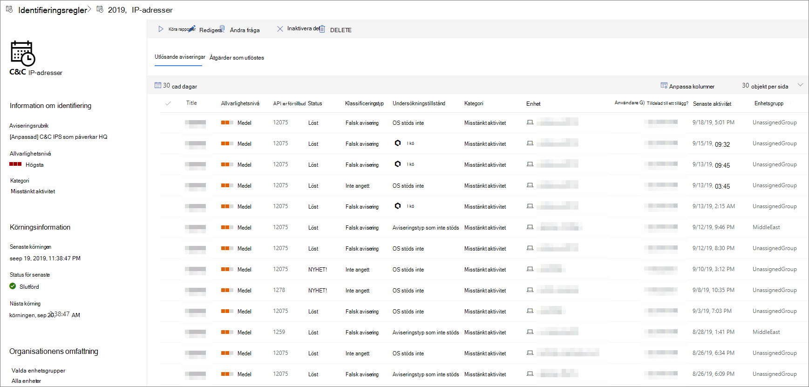

# Visa och hantera anpassade identifieringsreglerView and manage custom detection rules

[!INCLUDE [Microsoft 365 Defender rebranding](../../includes/microsoft-defender.md)]

**Gäller för:****Applies to:**
- [Microsoft Defender för EndpointMicrosoft Defender for Endpoint](https://go.microsoft.com/fwlink/p/?linkid=2154037)
- [Microsoft 365 DefenderMicrosoft 365 Defender](https://go.microsoft.com/fwlink/?linkid=2118804)

>Vill du använda Defender för Slutpunkt?Want to experience Defender for Endpoint? [Registrera dig för en kostnadsfri utvärderingsversion.Sign up for a free trial.](https://www.microsoft.com/microsoft-365/windows/microsoft-defender-atp?ocid=docs-wdatp-assignaccess-abovefoldlink)

Hantera dina befintliga [anpassade identifieringsregler för](custom-detection-rules.md) att säkerställa att de effektivt hittar hot och vidtar åtgärder.Manage your existing [custom detection rules](custom-detection-rules.md) to ensure they are effectively finding threats and taking actions. Lär dig hur du visar listan med regler, kontrollerar deras tidigare körningar och granskar aviseringarna som de har utlöst.Explore how to view the list of rules, check their previous runs, and review the alerts they have triggered. Du kan även köra en regel på begäran och ändra den.You can also run a rule on demand and modify it.

## Behörighet som krävsRequired permissions

För att skapa eller hantera anpassade identifieringar [måste din roll](user-roles.md#create-roles-and-assign-the-role-to-an-azure-active-directory-group) ha behörighet att hantera **säkerhetsinställningar.**To create or manage custom detections, [your role](user-roles.md#create-roles-and-assign-the-role-to-an-azure-active-directory-group) needs to have the **manage security settings** permission.

## Visa befintliga reglerView existing rules

Om du vill visa alla befintliga anpassade identifieringsregler går du **till Inställningar**  >  **anpassade identifieringar**.To view all existing custom detection rules, navigate to **Settings** > **Custom detections**. På sidan visas alla regler med följande körningsinformation:The page lists all the rules with the following run information:

- **Senaste körningen**– när en regel senast körts för att söka efter frågematchningar och generera aviseringar**Last run**—when a rule was last run to check for query matches and generate alerts
- **Status för senaste körningen**– om en regel kördes som den ska**Last run status**—whether a rule ran successfully
- **Nästa körning**– nästa schemalagda körning**Next run**—the next scheduled run
- **Status**– om en regel har aktiverats eller inaktiverats**Status**—whether a rule has been turned on or off

## Visa regeldetaljer, ändra regel och köra regelView rule details, modify rule, and run rule

Om du vill visa omfattande information om en anpassad identifieringsregel väljer du namnet på regeln i listan med regler **i Inställningar**  >  **Anpassade identifieringar.**To view comprehensive information about a custom detection rule, select the name of rule from the list of rules in **Settings** > **Custom detections**. En sida om den valda regeln visar följande information:A page about the selected rule displays the following information:

- Allmän information om regeln, inklusive information om aviseringen, körningsstatus och omfattningGeneral information about the rule, including the details of the alert, run status, and scope
- Lista med utlösta aviseringarList of triggered alerts
- Lista över utlösande åtgärderList of triggered actions

 
*Sidan Anpassad identifieringsregel**Custom detection rule page*

Du kan också utföra följande åtgärder på regeln från den här sidan:You can also take the following actions on the rule from this page:

- **Kör**– kör regeln direkt.**Run**—run the rule immediately. Den här åtgärden återställer också intervallet för nästa körning.This action also resets the interval for the next run.
- **Redigera**– ändra regeln utan att ändra frågan**Edit**—modify the rule without changing the query
- **Ändra fråga**– redigera frågan under avancerad sökning**Modify query**—edit the query in advanced hunting
- **Aktivera**  /  **Inaktivera –** aktivera regeln eller hindra den från att köras**Turn on** / **Turn off**—enable the rule or stop it from running
- **Ta** bort – inaktivera regeln och ta bort den**Delete**—turn off the rule and remove it

>[!TIP]
>Om du snabbt vill visa information och vidta åtgärder för ett objekt i en tabell använder du urvalskolumnen [&#10003;] till vänster om tabellen.To quickly view information and take action on an item in a table, use the selection column [&#10003;] at the left of the table.

## Relaterade ämnenRelated topics
- [Översikt över anpassade identifieringarCustom detections overview](overview-custom-detections.md)
- [Skapa identifieringsreglerCreate detection rules](custom-detection-rules.md)
- [Översikt över avancerad jaktAdvanced hunting overview](advanced-hunting-overview.md)
- [Visa och ordna aviseringarView and organize alerts](alerts-queue.md)
