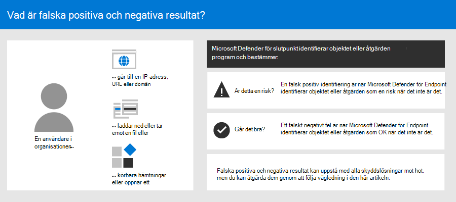
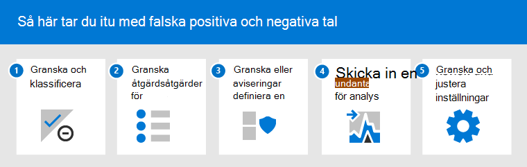
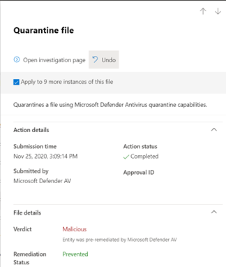
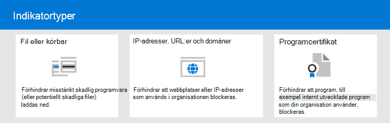

# <a name="address-false-positivesnegatives-in-microsoft-defender-for-endpoint"></a><span data-ttu-id="7e903-104">Åtgärda falska positiva/negativa i Microsoft Defender för Endpoint</span><span class="sxs-lookup"><span data-stu-id="7e903-104">Address false positives/negatives in Microsoft Defender for Endpoint</span></span>

[!INCLUDE [Microsoft 365 Defender rebranding](../../includes/microsoft-defender.md)]

<span data-ttu-id="7e903-105">**Gäller för**</span><span class="sxs-lookup"><span data-stu-id="7e903-105">**Applies to**</span></span>

- [<span data-ttu-id="7e903-106">Microsoft Defender för Endpoint</span><span class="sxs-lookup"><span data-stu-id="7e903-106">Microsoft Defender for Endpoint</span></span>](https://go.microsoft.com/fwlink/p/?linkid=2146806)

<span data-ttu-id="7e903-107">I slutpunktsskyddslösningar är en falsk positivhet en enhet, till exempel en fil eller en process, som identifierades och identifierades som skadlig, även om enheten faktiskt inte är ett hot.</span><span class="sxs-lookup"><span data-stu-id="7e903-107">In endpoint protection solutions, a false positive is an entity, such as a file or a process, that was detected and identified as malicious, even though the entity isn't actually a threat.</span></span> <span data-ttu-id="7e903-108">En falsk negativ är en enhet som inte identifierades som ett hot, även om den faktiskt är skadlig.</span><span class="sxs-lookup"><span data-stu-id="7e903-108">A false negative is an entity that was not detected as a threat, even though it actually is malicious.</span></span> <span data-ttu-id="7e903-109">Falska positiva/negativa kan uppstå med alla lösningar för skydd mot hot, inklusive [Microsoft Defender för slutpunkt.](microsoft-defender-endpoint.md)</span><span class="sxs-lookup"><span data-stu-id="7e903-109">False positives/negatives can occur with any threat protection solution, including [Microsoft Defender for Endpoint](microsoft-defender-endpoint.md).</span></span>



<span data-ttu-id="7e903-111">Som tur är går det att vidta åtgärder för att åtgärda och minska den här typen av problem.</span><span class="sxs-lookup"><span data-stu-id="7e903-111">Fortunately, steps can be taken to address and reduce these kinds of issues.</span></span> <span data-ttu-id="7e903-112">Om du ser falska positiva/negativa tal i [Microsoft 365 Defender](microsoft-defender-security-center.md) (tidigare i Microsoft Defender Säkerhetscenter) kan dina säkerhetsåtgärder vidta åtgärder för att åtgärda dem genom att använda följande process:</span><span class="sxs-lookup"><span data-stu-id="7e903-112">If you're seeing false positives/negatives in [Microsoft 365 Defender](microsoft-defender-security-center.md) (formerly the Microsoft Defender Security Center), your security operations can take steps to address them by using the following process:</span></span>

1.  [<span data-ttu-id="7e903-113">Granska och klassificera aviseringar</span><span class="sxs-lookup"><span data-stu-id="7e903-113">Review and classify alerts</span></span>](#part-1-review-and-classify-alerts) 
2.  [<span data-ttu-id="7e903-114">Granska åtgärder som har vidtagits</span><span class="sxs-lookup"><span data-stu-id="7e903-114">Review remediation actions that were taken</span></span>](#part-2-review-remediation-actions)
3.  [<span data-ttu-id="7e903-115">Granska och definiera undantag</span><span class="sxs-lookup"><span data-stu-id="7e903-115">Review and define exclusions</span></span>](#part-3-review-or-define-exclusions)
4.  [<span data-ttu-id="7e903-116">Skicka en entitet för analys</span><span class="sxs-lookup"><span data-stu-id="7e903-116">Submit an entity for analysis</span></span>](#part-4-submit-a-file-for-analysis)
5.  [<span data-ttu-id="7e903-117">Granska och justera dina skyddsinställningar för hot</span><span class="sxs-lookup"><span data-stu-id="7e903-117">Review and adjust your threat protection settings</span></span>](#part-5-review-and-adjust-your-threat-protection-settings)

<span data-ttu-id="7e903-118">Du kan få hjälp om du fortfarande har problem med falska positiva/negativa när du har utfört de uppgifter som beskrivs i den här artikeln.</span><span class="sxs-lookup"><span data-stu-id="7e903-118">You can get help if you still have issues with false positives/negatives after performing the tasks described in this article.</span></span> <span data-ttu-id="7e903-119">Se [Behöver du mer hjälp?](#still-need-help)</span><span class="sxs-lookup"><span data-stu-id="7e903-119">See [Still need help?](#still-need-help)</span></span>



> [!NOTE]
> <span data-ttu-id="7e903-121">Den här artikeln är avsedd som vägledning för säkerhetsoperatorer och säkerhetsadministratörer som använder [Microsoft Defender för Slutpunkt.](microsoft-defender-endpoint.md)</span><span class="sxs-lookup"><span data-stu-id="7e903-121">This article is intended as guidance for security operators and security administrators who are using [Microsoft Defender for Endpoint](microsoft-defender-endpoint.md).</span></span>

## <a name="part-1-review-and-classify-alerts"></a><span data-ttu-id="7e903-122">Del 1: Granska och klassificera aviseringar</span><span class="sxs-lookup"><span data-stu-id="7e903-122">Part 1: Review and classify alerts</span></span>

<span data-ttu-id="7e903-123">Om du ser ett [meddelande](alerts.md) som utlöstes eftersom något identifierades som skadligt eller misstänkt, och som inte borde ha varit det, kan du dölja varningen för den enheten.</span><span class="sxs-lookup"><span data-stu-id="7e903-123">If you see an [alert](alerts.md) that was triggered because something was detected as malicious or suspicious that should not have been, you can suppress the alert for that entity.</span></span> <span data-ttu-id="7e903-124">Du kan också dölja aviseringar som inte nödvändigtvis är falska positiva, men som inte är viktiga.</span><span class="sxs-lookup"><span data-stu-id="7e903-124">You can also suppress alerts that are not necessarily false positives, but are unimportant.</span></span> <span data-ttu-id="7e903-125">Vi rekommenderar att du även klassificerar aviseringar.</span><span class="sxs-lookup"><span data-stu-id="7e903-125">We recommend that you classify alerts as well.</span></span> 

<span data-ttu-id="7e903-126">Att hantera dina varningar och klassificera sant/falskt-positiva hjälper till att utbilda din lösning för hotskydd och kan minska antalet falska positiva eller falska negativa resultat över tid.</span><span class="sxs-lookup"><span data-stu-id="7e903-126">Managing your alerts and classifying true/false positives helps to train your threat protection solution and can reduce the number of false positives or false negatives over time.</span></span> <span data-ttu-id="7e903-127">Om du vidtar de här stegen minskar också bruset i instrumentpanelen för säkerhetsåtgärder så att säkerhetsteamet kan fokusera på arbetsobjekt med högre prioritet.</span><span class="sxs-lookup"><span data-stu-id="7e903-127">Taking these steps also helps reduce noise in your security operations dashboard so that your security team can focus on higher priority work items.</span></span>

### <a name="determine-whether-an-alert-is-accurate"></a><span data-ttu-id="7e903-128">Avgöra om en avisering är korrekt</span><span class="sxs-lookup"><span data-stu-id="7e903-128">Determine whether an alert is accurate</span></span>

<span data-ttu-id="7e903-129">Innan du klassificerar eller ignorerar en avisering måste du avgöra om aviseringen är korrekt, en falsk positiv eller en varning.</span><span class="sxs-lookup"><span data-stu-id="7e903-129">Before you classify or suppress an alert, determine whether the alert is accurate, a false positive, or benign.</span></span>

1. <span data-ttu-id="7e903-130">Gå till Microsoft 365 Defender ( [https://security.microsoft.com](https://security.microsoft.com) ) och logga in.</span><span class="sxs-lookup"><span data-stu-id="7e903-130">Go to the Microsoft 365 Defender portal ([https://security.microsoft.com](https://security.microsoft.com)) and sign in.</span></span>

2. <span data-ttu-id="7e903-131">Välj Aviseringskö **i navigeringsfönstret.**</span><span class="sxs-lookup"><span data-stu-id="7e903-131">In the navigation pane, choose **Alerts queue**.</span></span>

3. <span data-ttu-id="7e903-132">Välj en avisering om du vill ha mer information om aviseringen.</span><span class="sxs-lookup"><span data-stu-id="7e903-132">Select an alert to more details about the alert.</span></span> <span data-ttu-id="7e903-133">(Se [Granska aviseringar i Microsoft Defender för Slutpunkt](review-alerts.md).)</span><span class="sxs-lookup"><span data-stu-id="7e903-133">(See [Review alerts in Microsoft Defender for Endpoint](review-alerts.md).)</span></span>

4. <span data-ttu-id="7e903-134">Beroende på aviseringsstatusen följer du stegen som beskrivs i följande tabell:</span><span class="sxs-lookup"><span data-stu-id="7e903-134">Depending on the alert status, take the steps described in the following table:</span></span> 

| <span data-ttu-id="7e903-135">Aviseringsstatus</span><span class="sxs-lookup"><span data-stu-id="7e903-135">Alert status</span></span> | <span data-ttu-id="7e903-136">Lämplig åtgärd</span><span class="sxs-lookup"><span data-stu-id="7e903-136">What to do</span></span> |
|:---|:---|
| <span data-ttu-id="7e903-137">Aviseringen är korrekt</span><span class="sxs-lookup"><span data-stu-id="7e903-137">The alert is accurate</span></span> | <span data-ttu-id="7e903-138">Tilldela aviseringen och undersök [den](investigate-alerts.md) sedan ytterligare.</span><span class="sxs-lookup"><span data-stu-id="7e903-138">Assign the alert, and then [investigate it](investigate-alerts.md) further.</span></span> |
| <span data-ttu-id="7e903-139">Aviseringen är en falsk positiv</span><span class="sxs-lookup"><span data-stu-id="7e903-139">The alert is a false positive</span></span> | <span data-ttu-id="7e903-140">1. [Klassificera aviseringen](#classify-an-alert) som en falsk positivhet.</span><span class="sxs-lookup"><span data-stu-id="7e903-140">1. [Classify the alert](#classify-an-alert) as a false positive.</span></span> <br/><span data-ttu-id="7e903-141">2. [Ignorera aviseringen](#suppress-an-alert).</span><span class="sxs-lookup"><span data-stu-id="7e903-141">2. [Suppress the alert](#suppress-an-alert).</span></span> <br/> <span data-ttu-id="7e903-142">3. [Skapa en indikator för](#indicators-for-microsoft-defender-for-endpoint) Microsoft Defender för Endpoint.</span><span class="sxs-lookup"><span data-stu-id="7e903-142">3. [Create an indicator](#indicators-for-microsoft-defender-for-endpoint) for Microsoft Defender for Endpoint.</span></span> <br/> <span data-ttu-id="7e903-143">4. [Skicka en fil till Microsoft för analys](#part-4-submit-a-file-for-analysis).</span><span class="sxs-lookup"><span data-stu-id="7e903-143">4. [Submit a file to Microsoft for analysis](#part-4-submit-a-file-for-analysis).</span></span> |
| <span data-ttu-id="7e903-144">Aviseringen är korrekt, men den är inte viktig</span><span class="sxs-lookup"><span data-stu-id="7e903-144">The alert is accurate, but benign (unimportant)</span></span> | <span data-ttu-id="7e903-145">[Klassificera aviseringen](#classify-an-alert) som en sant positiv och utelämna [sedan aviseringen](#suppress-an-alert).</span><span class="sxs-lookup"><span data-stu-id="7e903-145">[Classify the alert](#classify-an-alert) as a true positive, and then [suppress the alert](#suppress-an-alert).</span></span> |

### <a name="classify-an-alert"></a><span data-ttu-id="7e903-146">Klassificera en avisering</span><span class="sxs-lookup"><span data-stu-id="7e903-146">Classify an alert</span></span>

<span data-ttu-id="7e903-147">Aviseringar kan klassificeras som falska positiva resultat eller sant positiva resultat i Microsoft 365 Defender.</span><span class="sxs-lookup"><span data-stu-id="7e903-147">Alerts can be classified as false positives or true positives in Microsoft 365 Defender.</span></span> <span data-ttu-id="7e903-148">Genom att klassificera aviseringar kan du träna Microsoft Defender för Endpoint så att du med tiden ser fler sanna aviseringar och färre falska aviseringar.</span><span class="sxs-lookup"><span data-stu-id="7e903-148">Classifying alerts helps train Microsoft Defender for Endpoint so that, over time, you'll see more true alerts and fewer false alerts.</span></span>

1. <span data-ttu-id="7e903-149">Gå till Microsoft 365 Defender ( [https://security.microsoft.com](https://security.microsoft.com) ) och logga in.</span><span class="sxs-lookup"><span data-stu-id="7e903-149">Go to the Microsoft 365 Defender portal ([https://security.microsoft.com](https://security.microsoft.com)) and sign in.</span></span>

2. <span data-ttu-id="7e903-150">Välj **Aviseringskö** och välj sedan en avisering.</span><span class="sxs-lookup"><span data-stu-id="7e903-150">Select **Alerts queue**, and then select an alert.</span></span>

3. <span data-ttu-id="7e903-151">För den valda aviseringen väljer du **Åtgärder**  >  **Hantera avisering**.</span><span class="sxs-lookup"><span data-stu-id="7e903-151">For the selected alert, select **Actions** > **Manage alert**.</span></span> <span data-ttu-id="7e903-152">Ett utfällt fönster öppnas.</span><span class="sxs-lookup"><span data-stu-id="7e903-152">A flyout pane opens.</span></span>

4. <span data-ttu-id="7e903-153">I avsnittet **Hantera avisering** väljer du antingen **True-avisering** **eller Falskt-avisering.**</span><span class="sxs-lookup"><span data-stu-id="7e903-153">In the **Manage alert** section, select either **True alert** or **False alert**.</span></span> <span data-ttu-id="7e903-154">(Använd **falsk varning för** att klassificera en felaktighet.)</span><span class="sxs-lookup"><span data-stu-id="7e903-154">(Use **False alert** to classify a false positive.)</span></span>

> [!TIP]
> <span data-ttu-id="7e903-155">Mer information om hur du ignorerar aviseringar finns i [Hantera Microsoft Defender för slutpunktsaviseringar.](/microsoft-365/security/defender-endpoint/manage-alerts)</span><span class="sxs-lookup"><span data-stu-id="7e903-155">For more information about suppressing alerts, see [Manage Microsoft Defender for Endpoint alerts](/microsoft-365/security/defender-endpoint/manage-alerts).</span></span> <span data-ttu-id="7e903-156">Och om organisationen använder en säkerhetsinformations- och händelsehanteringsserver (SIEM) ser du till att definiera en regel för regeln här också.</span><span class="sxs-lookup"><span data-stu-id="7e903-156">And, if your organization is using a security information and event management (SIEM) server, make sure to define a suppression rule there, too.</span></span> 

### <a name="suppress-an-alert"></a><span data-ttu-id="7e903-157">Ignorera en avisering</span><span class="sxs-lookup"><span data-stu-id="7e903-157">Suppress an alert</span></span>

<span data-ttu-id="7e903-158">Om du har aviseringar som antingen är falska positiva eller som är sanna positiva, men för oimporterande händelser, kan du dölja dessa aviseringar i Microsoft 365 Defender.</span><span class="sxs-lookup"><span data-stu-id="7e903-158">If you have alerts that are either false positives or that are true positives but for unimportant events, you can suppress those alerts in Microsoft 365 Defender.</span></span> <span data-ttu-id="7e903-159">Att dölja aviseringar hjälper till att minska bruset i instrumentpanelen för säkerhetsåtgärder.</span><span class="sxs-lookup"><span data-stu-id="7e903-159">Suppressing alerts helps reduce noise in your security operations dashboard.</span></span> 

1. <span data-ttu-id="7e903-160">Gå till Microsoft 365 Defender ( [https://security.microsoft.com](https://security.microsoft.com) ) och logga in.</span><span class="sxs-lookup"><span data-stu-id="7e903-160">Go to the Microsoft 365 Defender portal ([https://security.microsoft.com](https://security.microsoft.com)) and sign in.</span></span>

2. <span data-ttu-id="7e903-161">I navigeringsfönstret väljer du **Aviseringskö**.</span><span class="sxs-lookup"><span data-stu-id="7e903-161">In the navigation pane, select **Alerts queue**.</span></span>

3. <span data-ttu-id="7e903-162">Markera en avisering om att du inte vill öppna **fönstret** Information.</span><span class="sxs-lookup"><span data-stu-id="7e903-162">Select an alert that you want to suppress to open its **Details** pane.</span></span>

4. <span data-ttu-id="7e903-163">I fönstret **Information** väljer du ellipsen (**...**) och sedan **Skapa en regel för en uteslutning.**</span><span class="sxs-lookup"><span data-stu-id="7e903-163">In the **Details** pane, choose the ellipsis (**...**), and then **Create a suppression rule**.</span></span>

5. <span data-ttu-id="7e903-164">Ange alla inställningar för regeln för regeln och välj sedan **Spara**.</span><span class="sxs-lookup"><span data-stu-id="7e903-164">Specify all the settings for your suppression rule, and then choose **Save**.</span></span>

> [!TIP]
> <span data-ttu-id="7e903-165">Behöver du hjälp med regelregler?</span><span class="sxs-lookup"><span data-stu-id="7e903-165">Need help with suppression rules?</span></span> <span data-ttu-id="7e903-166">Mer [information finns i Ignorera en avisering och skapa en ny regel för en ny regel.](/microsoft-365/security/defender-endpoint/manage-alerts#suppress-an-alert-and-create-a-new-suppression-rule)</span><span class="sxs-lookup"><span data-stu-id="7e903-166">See [Suppress an alert and create a new suppression rule](/microsoft-365/security/defender-endpoint/manage-alerts#suppress-an-alert-and-create-a-new-suppression-rule).</span></span>

## <a name="part-2-review-remediation-actions"></a><span data-ttu-id="7e903-167">Del 2: Granska åtgärder</span><span class="sxs-lookup"><span data-stu-id="7e903-167">Part 2: Review remediation actions</span></span>

<span data-ttu-id="7e903-168">[Åtgärdsåtgärder, som](manage-auto-investigation.md#remediation-actions)att skicka en fil till karantän eller stoppa en process, vidtas på enheter (till exempel filer) som identifieras som hot.</span><span class="sxs-lookup"><span data-stu-id="7e903-168">[Remediation actions](manage-auto-investigation.md#remediation-actions), such as sending a file to quarantine or stopping a process, are taken on entities (such as files) that are detected as threats.</span></span> <span data-ttu-id="7e903-169">Flera typer av åtgärdsåtgärder sker automatiskt genom automatiserad undersökning och Microsoft Defender Antivirus:</span><span class="sxs-lookup"><span data-stu-id="7e903-169">Several types of remediation actions occur automatically through automated investigation and Microsoft Defender Antivirus:</span></span>   
- <span data-ttu-id="7e903-170">Sätt en fil i karantän</span><span class="sxs-lookup"><span data-stu-id="7e903-170">Quarantine a file</span></span>
- <span data-ttu-id="7e903-171">Ta bort en registernyckel</span><span class="sxs-lookup"><span data-stu-id="7e903-171">Remove a registry key</span></span>
- <span data-ttu-id="7e903-172">"Kill a process"</span><span class="sxs-lookup"><span data-stu-id="7e903-172">Kill a process</span></span>
- <span data-ttu-id="7e903-173">Stoppa en tjänst</span><span class="sxs-lookup"><span data-stu-id="7e903-173">Stop a service</span></span>
- <span data-ttu-id="7e903-174">Inaktivera en drivrutin</span><span class="sxs-lookup"><span data-stu-id="7e903-174">Disable a driver</span></span>
- <span data-ttu-id="7e903-175">Ta bort en schemalagd aktivitet</span><span class="sxs-lookup"><span data-stu-id="7e903-175">Remove a scheduled task</span></span>

<span data-ttu-id="7e903-176">Andra åtgärder, som att starta en antivirussökning eller samla in ett undersökningspaket, kan inträffa manuellt eller via [Live Response.](live-response.md)</span><span class="sxs-lookup"><span data-stu-id="7e903-176">Other actions, such as starting an antivirus scan or collecting an investigation package, occur manually or through [Live Response](live-response.md).</span></span> <span data-ttu-id="7e903-177">Åtgärder som vidtas i Live Response kan inte ångras.</span><span class="sxs-lookup"><span data-stu-id="7e903-177">Actions taken through Live Response cannot be undone.</span></span>

<span data-ttu-id="7e903-178">När du har granskat dina aviseringar är nästa steg att [granska åtgärder](manage-auto-investigation.md).</span><span class="sxs-lookup"><span data-stu-id="7e903-178">After you have reviewed your alerts, your next step is to [review remediation actions](manage-auto-investigation.md).</span></span> <span data-ttu-id="7e903-179">Om några åtgärder har vidtagits på grund av falska positiva resultat kan du ångra de flesta typerna av åtgärdsåtgärder.</span><span class="sxs-lookup"><span data-stu-id="7e903-179">If any actions were taken as a result of false positives, you can undo most kinds of remediation actions.</span></span> <span data-ttu-id="7e903-180">Specifikt kan du:</span><span class="sxs-lookup"><span data-stu-id="7e903-180">Specifically, you can:</span></span>

- [<span data-ttu-id="7e903-181">Återställa en fil i karantän från Åtgärdscenter</span><span class="sxs-lookup"><span data-stu-id="7e903-181">Restore a quarantined file from the Action Center</span></span>](#restore-a-quarantined-file-from-the-action-center)
- [<span data-ttu-id="7e903-182">Ångra flera åtgärder samtidigt</span><span class="sxs-lookup"><span data-stu-id="7e903-182">Undo multiple actions at one time</span></span>](#undo-multiple-actions-at-one-time)
- <span data-ttu-id="7e903-183">[Ta bort en fil från karantän på flera enheter.](#remove-a-file-from-quarantine-across-multiple-devices)</span><span class="sxs-lookup"><span data-stu-id="7e903-183">[Remove a file from quarantine across multiple devices](#remove-a-file-from-quarantine-across-multiple-devices).</span></span>  <span data-ttu-id="7e903-184">och</span><span class="sxs-lookup"><span data-stu-id="7e903-184">and</span></span> 
- [<span data-ttu-id="7e903-185">Återställa fil från karantän</span><span class="sxs-lookup"><span data-stu-id="7e903-185">Restore file from quarantine</span></span>](#restore-file-from-quarantine)

<span data-ttu-id="7e903-186">När du har granskat och ångrat åtgärder som har [utförts](#part-3-review-or-define-exclusions)på grund av falska positiva resultat kan du fortsätta att granska eller definiera undantag .</span><span class="sxs-lookup"><span data-stu-id="7e903-186">When you're done reviewing and undoing actions that were taken as a result of false positives, proceed to [review or define exclusions](#part-3-review-or-define-exclusions).</span></span>

### <a name="review-completed-actions"></a><span data-ttu-id="7e903-187">Granska slutförda åtgärder</span><span class="sxs-lookup"><span data-stu-id="7e903-187">Review completed actions</span></span>

1. <span data-ttu-id="7e903-188">Gå till Åtgärdscenter ( [https://security.microsoft.com/action-center](https://security.microsoft.com/action-center) ) och logga in.</span><span class="sxs-lookup"><span data-stu-id="7e903-188">Go to the Action center ([https://security.microsoft.com/action-center](https://security.microsoft.com/action-center)) and sign in.</span></span> 

2. <span data-ttu-id="7e903-189">Välj fliken **Historik** för att visa en lista över åtgärder som har vidtagits.</span><span class="sxs-lookup"><span data-stu-id="7e903-189">Select the **History** tab to view a list of actions that were taken.</span></span>  

3. <span data-ttu-id="7e903-190">Välj ett objekt om du vill visa mer information om åtgärden som har vidtagits.</span><span class="sxs-lookup"><span data-stu-id="7e903-190">Select an item to view more details about the remediation action that was taken.</span></span>

### <a name="restore-a-quarantined-file-from-the-action-center"></a><span data-ttu-id="7e903-191">Återställa en fil i karantän från Åtgärdscenter</span><span class="sxs-lookup"><span data-stu-id="7e903-191">Restore a quarantined file from the Action Center</span></span>

1. <span data-ttu-id="7e903-192">Gå till Åtgärdscenter ( [https://security.microsoft.com/action-center](https://security.microsoft.com/action-center) ) och logga in.</span><span class="sxs-lookup"><span data-stu-id="7e903-192">Go to the Action center ([https://security.microsoft.com/action-center](https://security.microsoft.com/action-center)) and sign in.</span></span> 

2. <span data-ttu-id="7e903-193">Välj **en åtgärd** som du vill ångra på fliken Historik.</span><span class="sxs-lookup"><span data-stu-id="7e903-193">On the **History** tab, select an action that you want to undo.</span></span>

3. <span data-ttu-id="7e903-194">Välj Ångra i den utfällade **rutan.**</span><span class="sxs-lookup"><span data-stu-id="7e903-194">In the flyout pane, select **Undo**.</span></span> <span data-ttu-id="7e903-195">Om åtgärden inte kan ångras med den här metoden visas inte knappen **Ångra.**</span><span class="sxs-lookup"><span data-stu-id="7e903-195">If the action cannot be undone with this method, you will not see an **Undo** button.</span></span> <span data-ttu-id="7e903-196">(Mer information finns i [Ångra slutförda åtgärder](manage-auto-investigation.md#undo-completed-actions).)</span><span class="sxs-lookup"><span data-stu-id="7e903-196">(To learn more, see [Undo completed actions](manage-auto-investigation.md#undo-completed-actions).)</span></span>

### <a name="undo-multiple-actions-at-one-time"></a><span data-ttu-id="7e903-197">Ångra flera åtgärder samtidigt</span><span class="sxs-lookup"><span data-stu-id="7e903-197">Undo multiple actions at one time</span></span>

1. <span data-ttu-id="7e903-198">Gå till Åtgärdscenter ( [https://security.microsoft.com/action-center](https://security.microsoft.com/action-center) ) och logga in.</span><span class="sxs-lookup"><span data-stu-id="7e903-198">Go to the Action center ([https://security.microsoft.com/action-center](https://security.microsoft.com/action-center)) and sign in.</span></span> 

2. <span data-ttu-id="7e903-199">Markera **de åtgärder** du vill ångra på fliken Historik.</span><span class="sxs-lookup"><span data-stu-id="7e903-199">On the **History** tab, select the actions that you want to undo.</span></span>

3. <span data-ttu-id="7e903-200">I fönstret till höger på skärmen väljer du **Ångra**.</span><span class="sxs-lookup"><span data-stu-id="7e903-200">In the pane on the right side of the screen, select **Undo**.</span></span>

### <a name="remove-a-file-from-quarantine-across-multiple-devices"></a><span data-ttu-id="7e903-201">Ta bort en fil från karantän på flera enheter</span><span class="sxs-lookup"><span data-stu-id="7e903-201">Remove a file from quarantine across multiple devices</span></span> 

> [!div class="mx-imgBorder"]
> <span data-ttu-id="7e903-202"></span><span class="sxs-lookup"><span data-stu-id="7e903-202"></span></span>

1. <span data-ttu-id="7e903-203">Gå till Åtgärdscenter ( [https://security.microsoft.com/action-center](https://security.microsoft.com/action-center) ) och logga in.</span><span class="sxs-lookup"><span data-stu-id="7e903-203">Go to the Action center ([https://security.microsoft.com/action-center](https://security.microsoft.com/action-center)) and sign in.</span></span> 

2. <span data-ttu-id="7e903-204">På fliken **Historik** väljer du en fil som har karantänfilen **Åtgärdstyp.**</span><span class="sxs-lookup"><span data-stu-id="7e903-204">On the **History** tab, select a file that has the Action type **Quarantine file**.</span></span>

3. <span data-ttu-id="7e903-205">I fönstret till höger på skärmen väljer du Använd för **fler X-instanser** av den här filen och sedan **Ångra**.</span><span class="sxs-lookup"><span data-stu-id="7e903-205">In the pane on the right side of the screen, select **Apply to X more instances of this file**, and then select **Undo**.</span></span>

### <a name="restore-file-from-quarantine"></a><span data-ttu-id="7e903-206">Återställa fil från karantän</span><span class="sxs-lookup"><span data-stu-id="7e903-206">Restore file from quarantine</span></span>

<span data-ttu-id="7e903-207">Du kan återställa och ta bort en fil från karantän om du har fastställt att den är ren efter en undersökning.</span><span class="sxs-lookup"><span data-stu-id="7e903-207">You can roll back and remove a file from quarantine if you’ve determined that it’s clean after an investigation.</span></span> <span data-ttu-id="7e903-208">Kör följande kommando på varje enhet där filen satts i karantän.</span><span class="sxs-lookup"><span data-stu-id="7e903-208">Run the following command on each device where the file was quarantined.</span></span>

1. <span data-ttu-id="7e903-209">Öppna en upphöjd kommandoradsfråga på enheten:</span><span class="sxs-lookup"><span data-stu-id="7e903-209">Open an elevated command–line prompt on the device:</span></span>

   1. <span data-ttu-id="7e903-210">Gå till **Start** och skriv _cmd_.</span><span class="sxs-lookup"><span data-stu-id="7e903-210">Go to **Start** and type _cmd_.</span></span>

   1. <span data-ttu-id="7e903-211">Högerklicka på **Kommandotolken** och välj **Kör som administratör.**</span><span class="sxs-lookup"><span data-stu-id="7e903-211">Right–click **Command prompt** and select **Run as administrator**.</span></span>

2. <span data-ttu-id="7e903-212">Ange följande kommando och tryck på **Retur:**</span><span class="sxs-lookup"><span data-stu-id="7e903-212">Enter the following command, and press **Enter**:</span></span>

    ```console
    "ProgramFiles%\Windows Defender\MpCmdRun.exe" –Restore –Name EUS:Win32/CustomEnterpriseBlock –All
    ```

    > [!IMPORTANT]
    > <span data-ttu-id="7e903-213">I vissa fall kan **ThreatName visas** som `EUS:Win32/
      CustomEnterpriseBlock!cl` .</span><span class="sxs-lookup"><span data-stu-id="7e903-213">In some scenarios, the **ThreatName** may appear as `EUS:Win32/
    >   CustomEnterpriseBlock!cl`.</span></span> <span data-ttu-id="7e903-214">Defender för Endpoint återställer alla egna blockerade filer som har satts i karantän på den här enheten under de senaste 30 dagarna.</span><span class="sxs-lookup"><span data-stu-id="7e903-214">Defender for Endpoint will restore all custom blocked files that were quarantined on this device in the last 30 days.</span></span>
<span data-ttu-id="7e903-215">En fil som har satts i karantän som ett potentiellt nätverkshot kanske inte kan återställas.</span><span class="sxs-lookup"><span data-stu-id="7e903-215">A file that was quarantined as a potential network threat might not be recoverable.</span></span> <span data-ttu-id="7e903-216">Om en användare försöker återställa filen efter karantänen är filen kanske inte tillgänglig.</span><span class="sxs-lookup"><span data-stu-id="7e903-216">If a user attempts to restore the file after quarantine, that file might not be accessible.</span></span> <span data-ttu-id="7e903-217">Det kan bero på att systemet inte längre har nätverksautentiseringsuppgifter för att få åtkomst till filen.</span><span class="sxs-lookup"><span data-stu-id="7e903-217">This can be due to the system no longer having network credentials to access the file.</span></span> <span data-ttu-id="7e903-218">Vanligtvis beror det på en tillfällig inloggning till ett system eller en delad mapp och åtkomsttoken har upphört att gälla.</span><span class="sxs-lookup"><span data-stu-id="7e903-218">Typically, this is a result of a temporary log on to a system or shared folder and the access tokens expired.</span></span>

3. <span data-ttu-id="7e903-219">I fönstret till höger på skärmen väljer du Använd för **fler X-instanser** av den här filen och sedan **Ångra**.</span><span class="sxs-lookup"><span data-stu-id="7e903-219">In the pane on the right side of the screen, select **Apply to X more instances of this file**, and then select **Undo**.</span></span> 

## <a name="part-3-review-or-define-exclusions"></a><span data-ttu-id="7e903-220">Del 3: Granska eller definiera undantag</span><span class="sxs-lookup"><span data-stu-id="7e903-220">Part 3: Review or define exclusions</span></span>

<span data-ttu-id="7e903-221">Ett undantag är en enhet, till exempel en fil eller url, som du anger som ett undantag för åtgärder.</span><span class="sxs-lookup"><span data-stu-id="7e903-221">An exclusion is an entity, such as a file or URL, that you specify as an exception to remediation actions.</span></span> <span data-ttu-id="7e903-222">Den undantagna enheten kan fortfarande identifieras, men inga åtgärder vidtas på den enheten.</span><span class="sxs-lookup"><span data-stu-id="7e903-222">The excluded entity can still get detected, but no remediation actions are taken on that entity.</span></span> <span data-ttu-id="7e903-223">Den identifierade filen eller processen stoppas inte, skickas till karantän, tas bort eller ändras på annat sätt av Microsoft Defender för Slutpunkt.</span><span class="sxs-lookup"><span data-stu-id="7e903-223">That is, the detected file or process won’t be stopped, sent to quarantine, removed, or otherwise changed by Microsoft Defender for Endpoint.</span></span> 

<span data-ttu-id="7e903-224">Så här definierar du undantag i Microsoft Defender för Slutpunkt:</span><span class="sxs-lookup"><span data-stu-id="7e903-224">To define exclusions across Microsoft Defender for Endpoint, perform the following tasks:</span></span>
- [<span data-ttu-id="7e903-225">Definiera undantag för Microsoft Defender Antivirus</span><span class="sxs-lookup"><span data-stu-id="7e903-225">Define exclusions for Microsoft Defender Antivirus</span></span>](#exclusions-for-microsoft-defender-antivirus)
- [<span data-ttu-id="7e903-226">Skapa "tillåt"-indikatorer för Microsoft Defender för Endpoint</span><span class="sxs-lookup"><span data-stu-id="7e903-226">Create “allow” indicators for Microsoft Defender for Endpoint</span></span>](#indicators-for-microsoft-defender-for-endpoint)

> [!NOTE]
> <span data-ttu-id="7e903-227">Microsoft Defender Antivirus gäller endast för antivirusskydd, inte för andra Microsoft Defender-funktioner för slutpunkt.</span><span class="sxs-lookup"><span data-stu-id="7e903-227">Microsoft Defender Antivirus exclusions apply only to antivirus protection, not across other Microsoft Defender for Endpoint capabilities.</span></span> <span data-ttu-id="7e903-228">Om du vill utesluta filer allmänt använder du undantag för Microsoft Defender Antivirus och [anpassade indikatorer](/microsoft-365/security/defender-endpoint/manage-indicators) för Microsoft Defender för slutpunkt.</span><span class="sxs-lookup"><span data-stu-id="7e903-228">To exclude files broadly, use exclusions for Microsoft Defender Antivirus and [custom indicators](/microsoft-365/security/defender-endpoint/manage-indicators) for Microsoft Defender for Endpoint.</span></span>

<span data-ttu-id="7e903-229">Procedurerna i det här avsnittet beskriver hur du definierar undantag och indikatorer.</span><span class="sxs-lookup"><span data-stu-id="7e903-229">The procedures in this section describe how to define exclusions and indicators.</span></span>

### <a name="exclusions-for-microsoft-defender-antivirus"></a><span data-ttu-id="7e903-230">Undantag för Microsoft Defender Antivirus</span><span class="sxs-lookup"><span data-stu-id="7e903-230">Exclusions for Microsoft Defender Antivirus</span></span>

<span data-ttu-id="7e903-231">I allmänhet behöver du inte definiera undantag för Microsoft Defender Antivirus.</span><span class="sxs-lookup"><span data-stu-id="7e903-231">In general, you should not need to define exclusions for Microsoft Defender Antivirus.</span></span> <span data-ttu-id="7e903-232">Se till att du definierar undantag sparsamt och att du endast tar med filer, mappar, processer och process öppna filer som resulterar i falska positiva resultat.</span><span class="sxs-lookup"><span data-stu-id="7e903-232">Make sure that you define exclusions sparingly, and that you only include the files, folders, processes, and process-opened files that are resulting in false positives.</span></span> <span data-ttu-id="7e903-233">Kontrollera även regelbundet att du har definierat undantag.</span><span class="sxs-lookup"><span data-stu-id="7e903-233">In addition, make sure to review your defined exclusions regularly.</span></span> <span data-ttu-id="7e903-234">Vi rekommenderar att [Microsoft Endpoint Manager](/mem/endpoint-manager-overview) du använder för att definiera eller redigera dina undantag för antivirus. Du kan emellertid använda andra metoder, till exempel [Grupprincip](/azure/active-directory-domain-services/manage-group-policy) (se [Hantera Microsoft Defender för slutpunkt).](manage-atp-post-migration.md)</span><span class="sxs-lookup"><span data-stu-id="7e903-234">We recommend using [Microsoft Endpoint Manager](/mem/endpoint-manager-overview) to define or edit your antivirus exclusions; however, you can use other methods, such as [Group Policy](/azure/active-directory-domain-services/manage-group-policy) (see [Manage Microsoft Defender for Endpoint](manage-atp-post-migration.md)).</span></span>

> [!TIP]
> <span data-ttu-id="7e903-235">Behöver du hjälp med undantag för antivirusprogram?</span><span class="sxs-lookup"><span data-stu-id="7e903-235">Need help with antivirus exclusions?</span></span> <span data-ttu-id="7e903-236">Se [Konfigurera och validera undantag för Microsoft Defender Antivirus genomsökningar](configure-exclusions-microsoft-defender-antivirus.md).</span><span class="sxs-lookup"><span data-stu-id="7e903-236">See [Configure and validate exclusions for Microsoft Defender Antivirus scans](configure-exclusions-microsoft-defender-antivirus.md).</span></span>

#### <a name="use-microsoft-endpoint-manager-to-manage-antivirus-exclusions-for-existing-policies"></a><span data-ttu-id="7e903-237">Använda Microsoft Endpoint Manager för att hantera undantag för antivirus (för befintliga principer)</span><span class="sxs-lookup"><span data-stu-id="7e903-237">Use Microsoft Endpoint Manager to manage antivirus exclusions (for existing policies)</span></span>

1. <span data-ttu-id="7e903-238">Gå till Microsoft Endpoint Manager ( ) [https://endpoint.microsoft.com](https://endpoint.microsoft.com) och logga in.</span><span class="sxs-lookup"><span data-stu-id="7e903-238">Go to the Microsoft Endpoint Manager admin center ([https://endpoint.microsoft.com](https://endpoint.microsoft.com)) and sign in.</span></span>

2. <span data-ttu-id="7e903-239">Välj **Endpoint Security**  >  **Antivirus** och välj sedan en befintlig princip.</span><span class="sxs-lookup"><span data-stu-id="7e903-239">Choose **Endpoint security** > **Antivirus**, and then select an existing policy.</span></span> <span data-ttu-id="7e903-240">(Om du inte har en befintlig princip, eller om du vill skapa en ny princip, kan du gå vidare [till nästa procedur](#use-microsoft-endpoint-manager-to-create-a-new-antivirus-policy-with-exclusions)).</span><span class="sxs-lookup"><span data-stu-id="7e903-240">(If you don’t have an existing policy, or you want to create a new policy, skip to [the next procedure](#use-microsoft-endpoint-manager-to-create-a-new-antivirus-policy-with-exclusions)).</span></span>

3. <span data-ttu-id="7e903-241">Välj **Egenskaper** och bredvid **Konfigurationsinställningar** väljer du **Redigera**.</span><span class="sxs-lookup"><span data-stu-id="7e903-241">Choose **Properties**, and next to **Configuration settings**, choose **Edit**.</span></span>

4. <span data-ttu-id="7e903-242">Expandera **Microsoft Defender Antivirus undantag och** ange sedan dina undantag.</span><span class="sxs-lookup"><span data-stu-id="7e903-242">Expand **Microsoft Defender Antivirus Exclusions** and then specify your exclusions.</span></span>

5. <span data-ttu-id="7e903-243">Välj **Granska + spara** och välj sedan **Spara.**</span><span class="sxs-lookup"><span data-stu-id="7e903-243">Choose **Review + save**, and then choose **Save**.</span></span>

#### <a name="use-microsoft-endpoint-manager-to-create-a-new-antivirus-policy-with-exclusions"></a><span data-ttu-id="7e903-244">Använda Microsoft Endpoint Manager för att skapa en ny antivirusprincip med undantag</span><span class="sxs-lookup"><span data-stu-id="7e903-244">Use Microsoft Endpoint Manager to create a new antivirus policy with exclusions</span></span>

1. <span data-ttu-id="7e903-245">Gå till Microsoft Endpoint Manager ( ) [https://endpoint.microsoft.com](https://endpoint.microsoft.com) och logga in.</span><span class="sxs-lookup"><span data-stu-id="7e903-245">Go to the Microsoft Endpoint Manager admin center ([https://endpoint.microsoft.com](https://endpoint.microsoft.com)) and sign in.</span></span>

2. <span data-ttu-id="7e903-246">Välj **Endpoint Security**  >  **Antivirus**+ Create  >  **Policy**.</span><span class="sxs-lookup"><span data-stu-id="7e903-246">Choose **Endpoint security** > **Antivirus** > **+ Create Policy**.</span></span> 

3. <span data-ttu-id="7e903-247">Välj en plattform (till **exempel Windows 10 eller senare**, **macOS** eller **Windows 10 och Windows Server**).</span><span class="sxs-lookup"><span data-stu-id="7e903-247">Select a platform (such as **Windows 10 and later**, **macOS**, or **Windows 10 and Windows Server**).</span></span>

4. <span data-ttu-id="7e903-248">Under **Profil** väljer **du Microsoft Defender Antivirus undantag** och väljer sedan **Skapa**.</span><span class="sxs-lookup"><span data-stu-id="7e903-248">For **Profile**, select **Microsoft Defender Antivirus exclusions**, and then choose **Create**.</span></span>

5. <span data-ttu-id="7e903-249">Ange ett namn och en beskrivning för profilen och välj sedan **Nästa**.</span><span class="sxs-lookup"><span data-stu-id="7e903-249">Specify a name and description for the profile, and then choose **Next**.</span></span>

6. <span data-ttu-id="7e903-250">På fliken **Konfigurationsinställningar** anger du dina undantag för antivirus och väljer sedan **Nästa.**</span><span class="sxs-lookup"><span data-stu-id="7e903-250">On the **Configuration settings** tab, specify your antivirus exclusions, and then choose **Next**.</span></span>

7. <span data-ttu-id="7e903-251">Om du **använder omfattningstaggar** i organisationen på fliken Omfattningstaggar anger du omfattningstaggar för principen du skapar.</span><span class="sxs-lookup"><span data-stu-id="7e903-251">On the **Scope tags** tab, if you are using scope tags in your organization, specify scope tags for the policy you are creating.</span></span> <span data-ttu-id="7e903-252">(Se [Omfattningstaggar](/mem/intune/fundamentals/scope-tags).)</span><span class="sxs-lookup"><span data-stu-id="7e903-252">(See [Scope tags](/mem/intune/fundamentals/scope-tags).)</span></span>

8. <span data-ttu-id="7e903-253">På **fliken Tilldelningar** anger du de användare och grupper som principen ska tillämpas på och väljer sedan **Nästa.**</span><span class="sxs-lookup"><span data-stu-id="7e903-253">On the **Assignments** tab, specify the users and groups to whom your policy should be applied, and then choose **Next**.</span></span> <span data-ttu-id="7e903-254">(Om du behöver hjälp med uppgifter kan du gå [till Tilldela användar- och enhetsprofiler i Microsoft Intune](/mem/intune/configuration/device-profile-assign).)</span><span class="sxs-lookup"><span data-stu-id="7e903-254">(If you need help with assignments, see [Assign user and device profiles in Microsoft Intune](/mem/intune/configuration/device-profile-assign).)</span></span>

9. <span data-ttu-id="7e903-255">Granska **inställningarna på fliken** Granska + skapa och välj sedan **Skapa**.</span><span class="sxs-lookup"><span data-stu-id="7e903-255">On the **Review + create** tab, review the settings, and then choose **Create**.</span></span>

### <a name="indicators-for-microsoft-defender-for-endpoint"></a><span data-ttu-id="7e903-256">Indikatorer för Microsoft Defender för Slutpunkt</span><span class="sxs-lookup"><span data-stu-id="7e903-256">Indicators for Microsoft Defender for Endpoint</span></span>

<span data-ttu-id="7e903-257">[Indikatorer](/microsoft-365/security/defender-endpoint/manage-indicators) (särskilt indikatorer för kompromettering och IOC) gör det möjligt för teamet med säkerhetsåtgärder att definiera identifiering, skydd och undantag från enheter.</span><span class="sxs-lookup"><span data-stu-id="7e903-257">[Indicators](/microsoft-365/security/defender-endpoint/manage-indicators) (specifically, indicators of compromise, or IoCs) enable your security operations team to define the detection, prevention, and exclusion of entities.</span></span> <span data-ttu-id="7e903-258">Du kan till exempel ange att vissa filer ska utelämnas från genomsökningar och åtgärdsåtgärder i Microsoft Defender för Slutpunkt.</span><span class="sxs-lookup"><span data-stu-id="7e903-258">For example, you can specify certain files to be omitted from scans and remediation actions in Microsoft Defender for Endpoint.</span></span> <span data-ttu-id="7e903-259">Indikatorer kan också användas för att generera aviseringar för vissa filer, IP-adresser eller URL-adresser.</span><span class="sxs-lookup"><span data-stu-id="7e903-259">Or, indicators can be used to generate alerts for certain files, IP addresses, or URLs.</span></span>

<span data-ttu-id="7e903-260">Om du vill ange enheter som undantag för Microsoft Defender för Endpoint skapar du "tillåt"-indikatorer för de enheterna.</span><span class="sxs-lookup"><span data-stu-id="7e903-260">To specify entities as exclusions for Microsoft Defender for Endpoint, create "allow" indicators for those entities.</span></span> <span data-ttu-id="7e903-261">Sådana ["tillåt"-indikatorer](microsoft-defender-antivirus-in-windows-10.md)i Microsoft Defender för Endpoint gäller för nästa generations skydd , [identifiering och åtgärd på slutpunkt](overview-endpoint-detection-response.md)och [automatiserad undersökning & åtgärd](/microsoft-365/security/defender-endpoint/automated-investigations).</span><span class="sxs-lookup"><span data-stu-id="7e903-261">Such "allow" indicators in Microsoft Defender for Endpoint apply to [next-generation protection](microsoft-defender-antivirus-in-windows-10.md), [endpoint detection and response](overview-endpoint-detection-response.md), and [automated investigation & remediation](/microsoft-365/security/defender-endpoint/automated-investigations).</span></span>

<span data-ttu-id="7e903-262">"Tillåt"-indikatorer kan skapas för:</span><span class="sxs-lookup"><span data-stu-id="7e903-262">"Allow" indicators can be created for:</span></span>

- [<span data-ttu-id="7e903-263">Filer</span><span class="sxs-lookup"><span data-stu-id="7e903-263">Files</span></span>](#indicators-for-files)
- [<span data-ttu-id="7e903-264">IP-adresser, URL:er och domäner</span><span class="sxs-lookup"><span data-stu-id="7e903-264">IP addresses, URLs, and domains</span></span>](#indicators-for-ip-addresses-urls-or-domains)
- [<span data-ttu-id="7e903-265">Programcertifikat</span><span class="sxs-lookup"><span data-stu-id="7e903-265">Application certificates</span></span>](#indicators-for-application-certificates)



#### <a name="indicators-for-files"></a><span data-ttu-id="7e903-267">Indikatorer för filer</span><span class="sxs-lookup"><span data-stu-id="7e903-267">Indicators for files</span></span>

<span data-ttu-id="7e903-268">Om du skapar en indikator för "tillåt" för en [fil,](/microsoft-365/security/defender-endpoint/indicator-file)till exempel en körbar fil, förhindrar det att filer som din organisation använder blockeras.</span><span class="sxs-lookup"><span data-stu-id="7e903-268">When you [create an "allow" indicator for a file, such as an executable](/microsoft-365/security/defender-endpoint/indicator-file), it helps prevent files that your organization is using from being blocked.</span></span> <span data-ttu-id="7e903-269">Filer kan innehålla flyttbara körbara filer (PE), till exempel `.exe` `.dll` filer.</span><span class="sxs-lookup"><span data-stu-id="7e903-269">Files can include portable executable (PE) files, such as `.exe` and `.dll` files.</span></span> 

<span data-ttu-id="7e903-270">Innan du skapar indikatorer för filer bör du kontrollera att följande krav uppfylls:</span><span class="sxs-lookup"><span data-stu-id="7e903-270">Before you create indicators for files, make sure the following requirements are met:</span></span>
- <span data-ttu-id="7e903-271">Microsoft Defender Antivirus är konfigurerat med molnbaserat skydd aktiverat (se [Hantera molnbaserat skydd)](/windows/security/threat-protection/microsoft-defender-antivirus/deploy-manage-report-microsoft-defender-antivirus)</span><span class="sxs-lookup"><span data-stu-id="7e903-271">Microsoft Defender Antivirus is configured with cloud-based protection enabled (see [Manage cloud-based protection](/windows/security/threat-protection/microsoft-defender-antivirus/deploy-manage-report-microsoft-defender-antivirus))</span></span>
- <span data-ttu-id="7e903-272">Antimalware client version is 4.18.1901.x or later</span><span class="sxs-lookup"><span data-stu-id="7e903-272">Antimalware client version is 4.18.1901.x or later</span></span> 
- <span data-ttu-id="7e903-273">Enheter kör Windows 10, version 1703 eller senare. Windows Server 2016; eller Windows Server 2019</span><span class="sxs-lookup"><span data-stu-id="7e903-273">Devices are running Windows 10, version 1703 or later; Windows Server 2016; or Windows Server 2019</span></span> 
- <span data-ttu-id="7e903-274">Funktionen [Blockera eller tillåt är aktiverad](/microsoft-365/security/defender-endpoint/advanced-features)</span><span class="sxs-lookup"><span data-stu-id="7e903-274">The [Block or allow feature is turned on](/microsoft-365/security/defender-endpoint/advanced-features)</span></span> 

#### <a name="indicators-for-ip-addresses-urls-or-domains"></a><span data-ttu-id="7e903-275">Indikatorer för IP-adresser, URL-adresser och domäner</span><span class="sxs-lookup"><span data-stu-id="7e903-275">Indicators for IP addresses, URLs, or domains</span></span>

<span data-ttu-id="7e903-276">Om du skapar en "tillåt"-indikator för en [IP-adress, URL-adress](/microsoft-365/security/defender-endpoint/indicator-ip-domain)eller domän förhindrar det att webbplatser eller IP-adresser som din organisation använder blockeras.</span><span class="sxs-lookup"><span data-stu-id="7e903-276">When you [create an "allow" indicator for an IP address, URL, or domain](/microsoft-365/security/defender-endpoint/indicator-ip-domain), it helps prevent the sites or IP addresses your organization uses from being blocked.</span></span>

<span data-ttu-id="7e903-277">Innan du skapar indikatorer för IP-adresser, URL:er eller domäner bör du kontrollera att följande krav uppfylls:</span><span class="sxs-lookup"><span data-stu-id="7e903-277">Before you create indicators for IP addresses, URLs, or domains, make sure the following requirements are met:</span></span>
- <span data-ttu-id="7e903-278">Nätverksskydd i Defender för Slutpunkt är aktiverat i blockläge (se [Aktivera nätverksskydd](/microsoft-365/security/defender-endpoint/enable-network-protection))</span><span class="sxs-lookup"><span data-stu-id="7e903-278">Network protection in Defender for Endpoint is enabled in block mode (see [Enable network protection](/microsoft-365/security/defender-endpoint/enable-network-protection))</span></span>
- <span data-ttu-id="7e903-279">Antimalware client version is 4.18.1906.x or later</span><span class="sxs-lookup"><span data-stu-id="7e903-279">Antimalware client version is 4.18.1906.x or later</span></span> 
- <span data-ttu-id="7e903-280">Enheter med Windows 10, version 1709 eller senare</span><span class="sxs-lookup"><span data-stu-id="7e903-280">Devices are running Windows 10, version 1709, or later</span></span> 

<span data-ttu-id="7e903-281">Anpassade nätverksindikatorer aktiveras i [Microsoft 365 Defender](microsoft-defender-security-center.md).</span><span class="sxs-lookup"><span data-stu-id="7e903-281">Custom network indicators are turned on in the [Microsoft 365 Defender](microsoft-defender-security-center.md).</span></span> <span data-ttu-id="7e903-282">Mer information finns i [Avancerade funktioner.](/microsoft-365/security/defender-endpoint/advanced-features)</span><span class="sxs-lookup"><span data-stu-id="7e903-282">To learn more, see [Advanced features](/microsoft-365/security/defender-endpoint/advanced-features).</span></span>

#### <a name="indicators-for-application-certificates"></a><span data-ttu-id="7e903-283">Indikatorer för programcertifikat</span><span class="sxs-lookup"><span data-stu-id="7e903-283">Indicators for application certificates</span></span> 

<span data-ttu-id="7e903-284">När du [skapar en "tillåt"-indikator](/microsoft-365/security/defender-endpoint/indicator-certificates)för ett programcertifikat förhindrar det att program, till exempel internt utvecklade program, som din organisation använder blockeras.</span><span class="sxs-lookup"><span data-stu-id="7e903-284">When you [create an "allow" indicator for an application certificate](/microsoft-365/security/defender-endpoint/indicator-certificates), it helps prevent applications, such as internally developed applications, that your organization uses from being blocked.</span></span> <span data-ttu-id="7e903-285">`.CER` eller `.PEM` så stöds filnamnstillägg.</span><span class="sxs-lookup"><span data-stu-id="7e903-285">`.CER` or `.PEM` file extensions are supported.</span></span>   

<span data-ttu-id="7e903-286">Innan du skapar indikatorer för programcertifikat ska du kontrollera att följande krav uppfylls:</span><span class="sxs-lookup"><span data-stu-id="7e903-286">Before you create indicators for application certificates, make sure the following requirements are met:</span></span>

- <span data-ttu-id="7e903-287">Microsoft Defender Antivirus är konfigurerat med molnbaserat skydd aktiverat (se [Hantera molnbaserat skydd)](deploy-manage-report-microsoft-defender-antivirus.md)</span><span class="sxs-lookup"><span data-stu-id="7e903-287">Microsoft Defender Antivirus is configured with cloud-based protection enabled (see [Manage cloud-based protection](deploy-manage-report-microsoft-defender-antivirus.md))</span></span>
- <span data-ttu-id="7e903-288">Antimalware client version is 4.18.1901.x or later</span><span class="sxs-lookup"><span data-stu-id="7e903-288">Antimalware client version is 4.18.1901.x or later</span></span> 
- <span data-ttu-id="7e903-289">Enheter kör Windows 10, version 1703 eller senare. Windows Server 2016; eller Windows Server 2019</span><span class="sxs-lookup"><span data-stu-id="7e903-289">Devices are running Windows 10, version 1703 or later; Windows Server 2016; or Windows Server 2019</span></span> 
- <span data-ttu-id="7e903-290">Definitioner av skydd mot virus och hot är uppdaterade</span><span class="sxs-lookup"><span data-stu-id="7e903-290">Virus and threat protection definitions are up to date</span></span>  

> [!TIP]
> <span data-ttu-id="7e903-291">När du skapar indikatorer kan du definiera dem en i gånger ett, eller importera flera objekt samtidigt.</span><span class="sxs-lookup"><span data-stu-id="7e903-291">When you create indicators, you can define them one by one, or import multiple items at once.</span></span> <span data-ttu-id="7e903-292">Tänk på att det finns en gräns på 15 000 indikatorer för en enskild klientorganisation.</span><span class="sxs-lookup"><span data-stu-id="7e903-292">Keep in mind there's a limit of 15,000 indicators for a single tenant.</span></span> <span data-ttu-id="7e903-293">Och du kan behöva samla in viss information först, till exempel information om filhash.</span><span class="sxs-lookup"><span data-stu-id="7e903-293">And, you might need to gather certain details first, such as file hash information.</span></span> <span data-ttu-id="7e903-294">Kontrollera att du har granskat förutsättningarna innan du [skapar indikatorer .](manage-indicators.md)</span><span class="sxs-lookup"><span data-stu-id="7e903-294">Make sure to review the prerequisites before you [create indicators](manage-indicators.md).</span></span> 

## <a name="part-4-submit-a-file-for-analysis"></a><span data-ttu-id="7e903-295">Del 4: Skicka en fil för analys</span><span class="sxs-lookup"><span data-stu-id="7e903-295">Part 4: Submit a file for analysis</span></span>

<span data-ttu-id="7e903-296">Du kan skicka enheter, till exempel filer och identifieringar utan filer, till Microsoft för analys.</span><span class="sxs-lookup"><span data-stu-id="7e903-296">You can submit entities, such as files and fileless detections, to Microsoft for analysis.</span></span> <span data-ttu-id="7e903-297">Microsoft security analyze all submissions, and their results help inform Microsoft Defender for Endpoint threat protection capabilities.</span><span class="sxs-lookup"><span data-stu-id="7e903-297">Microsoft security researchers analyze all submissions, and their results help inform Microsoft Defender for Endpoint threat protection capabilities.</span></span> <span data-ttu-id="7e903-298">När du loggar in på webbplatsen för inskickat material kan du spåra dina inskickade material.</span><span class="sxs-lookup"><span data-stu-id="7e903-298">When you sign in at the submission site, you can track your submissions.</span></span>

### <a name="submit-a-file-for-analysis"></a><span data-ttu-id="7e903-299">Skicka en fil för analys</span><span class="sxs-lookup"><span data-stu-id="7e903-299">Submit a file for analysis</span></span>

<span data-ttu-id="7e903-300">Om du har en fil som antingen identifierats felaktigt som skadlig eller har missats följer du dessa steg för att skicka filen för analys.</span><span class="sxs-lookup"><span data-stu-id="7e903-300">If you have a file that was either wrongly detected as malicious or was missed, follow these steps to submit the file for analysis.</span></span>

1. <span data-ttu-id="7e903-301">Läs riktlinjerna här: [Skicka filer för analys](/windows/security/threat-protection/intelligence/submission-guide).</span><span class="sxs-lookup"><span data-stu-id="7e903-301">Review the guidelines here: [Submit files for analysis](/windows/security/threat-protection/intelligence/submission-guide).</span></span>

2. <span data-ttu-id="7e903-302">Besök webbplatsen Microsoft Säkerhetsinsikter över [https://www.microsoft.com/wdsi/filesubmission](https://www.microsoft.com/wdsi/filesubmission) inskickade filer ( ) och skicka in dina filer.</span><span class="sxs-lookup"><span data-stu-id="7e903-302">Visit the Microsoft Security Intelligence submission site ([https://www.microsoft.com/wdsi/filesubmission](https://www.microsoft.com/wdsi/filesubmission)), and submit your file(s).</span></span>

### <a name="submit-a-fileless-detection-for-analysis"></a><span data-ttu-id="7e903-303">Skicka en fillös identifiering för analys</span><span class="sxs-lookup"><span data-stu-id="7e903-303">Submit a fileless detection for analysis</span></span>

<span data-ttu-id="7e903-304">Om något identifierades som skadlig programvara baserat på beteende och du inte har en fil, kan du skicka filen `Mpsupport.cab` för analys.</span><span class="sxs-lookup"><span data-stu-id="7e903-304">If something was detected as malware based on behavior, and you don’t have a file, you can submit your `Mpsupport.cab` file for analysis.</span></span> <span data-ttu-id="7e903-305">Du kan hämta *.cab* filen med hjälp av verktyget Microsoft Malware Protection Command-Line Utility (MPCmdRun.exe) på Windows 10.</span><span class="sxs-lookup"><span data-stu-id="7e903-305">You can get the *.cab* file by using the Microsoft Malware Protection Command-Line Utility (MPCmdRun.exe) tool on Windows 10.</span></span>

1.  <span data-ttu-id="7e903-306">Gå till ` C:\ProgramData\Microsoft\Windows Defender\Platform\<version>` och kör sedan som `MpCmdRun.exe` administratör.</span><span class="sxs-lookup"><span data-stu-id="7e903-306">Go to ` C:\ProgramData\Microsoft\Windows Defender\Platform\<version>`, and then run `MpCmdRun.exe` as an administrator.</span></span>

2.  <span data-ttu-id="7e903-307">Skriv `mpcmdrun.exe -GetFiles` och tryck sedan på **Retur.**</span><span class="sxs-lookup"><span data-stu-id="7e903-307">Type `mpcmdrun.exe -GetFiles`, and then press **Enter**.</span></span>
   <span data-ttu-id="7e903-308">En .cab skapas som innehåller olika diagnostikloggar.</span><span class="sxs-lookup"><span data-stu-id="7e903-308">A .cab file is generated that contains various diagnostic logs.</span></span> <span data-ttu-id="7e903-309">Platsen för filen anges i utdata från kommandotolken.</span><span class="sxs-lookup"><span data-stu-id="7e903-309">The location of the file is specified in the output of the command prompt.</span></span> <span data-ttu-id="7e903-310">Platsen är som standard `C:\ProgramData\Microsoft\Microsoft Defender\Support\MpSupportFiles.cab` .</span><span class="sxs-lookup"><span data-stu-id="7e903-310">By default, the location is `C:\ProgramData\Microsoft\Microsoft Defender\Support\MpSupportFiles.cab`.</span></span>

3.  <span data-ttu-id="7e903-311">Läs riktlinjerna här: [Skicka filer för analys](/windows/security/threat-protection/intelligence/submission-guide).</span><span class="sxs-lookup"><span data-stu-id="7e903-311">Review the guidelines here: [Submit files for analysis](/windows/security/threat-protection/intelligence/submission-guide).</span></span>

4.  <span data-ttu-id="7e903-312">Gå till Microsoft Säkerhetsinsikter webbplats för inskickning ( [https://www.microsoft.com/wdsi/filesubmission](https://www.microsoft.com/wdsi/filesubmission) ) och skicka dina .cab filer.</span><span class="sxs-lookup"><span data-stu-id="7e903-312">Visit the Microsoft Security Intelligence submission site ([https://www.microsoft.com/wdsi/filesubmission](https://www.microsoft.com/wdsi/filesubmission)), and submit your .cab files.</span></span>

### <a name="what-happens-after-a-file-is-submitted"></a><span data-ttu-id="7e903-313">Vad händer när en fil har skickats?</span><span class="sxs-lookup"><span data-stu-id="7e903-313">What happens after a file is submitted?</span></span>

<span data-ttu-id="7e903-314">Din inskickad information skannas omedelbart av våra system för att ge dig den senaste avgörande informationen redan innan en analytiker börjar hantera ditt ärende.</span><span class="sxs-lookup"><span data-stu-id="7e903-314">Your submission is immediately scanned by our systems to give you the latest determination even before an analyst starts handling your case.</span></span> <span data-ttu-id="7e903-315">Det är möjligt att en fil redan har skickats in och bearbetats av en analytiker.</span><span class="sxs-lookup"><span data-stu-id="7e903-315">It’s possible that a file might have already been submitted and processed by an analyst.</span></span> <span data-ttu-id="7e903-316">I sådana fall görs ett snabbt avgörande.</span><span class="sxs-lookup"><span data-stu-id="7e903-316">In those cases, a determination is made quickly.</span></span>

<span data-ttu-id="7e903-317">För inlämningar som inte redan har bearbetats prioriteras de för analys enligt följande:</span><span class="sxs-lookup"><span data-stu-id="7e903-317">For submissions that were not already processed, they are prioritized for analysis as follows:</span></span>

- <span data-ttu-id="7e903-318">Vanliga filer som kan påverka ett stort antal datorer får högre prioritet.</span><span class="sxs-lookup"><span data-stu-id="7e903-318">Prevalent files with the potential to impact large numbers of computers are given a higher priority.</span></span>
- <span data-ttu-id="7e903-319">Autentiserade kunder, särskilt företagskunder med giltiga [SAID (Software Assurance-ID)](https://www.microsoft.com/licensing/licensing-programs/software-assurance-default.aspx)får högre prioritet.</span><span class="sxs-lookup"><span data-stu-id="7e903-319">Authenticated customers, especially enterprise customers with valid [Software Assurance IDs (SAIDs)](https://www.microsoft.com/licensing/licensing-programs/software-assurance-default.aspx), are given a higher priority.</span></span>
- <span data-ttu-id="7e903-320">Inskickade som har hög prioritet av SAID-innehavare ges omedelbar uppmärksamhet.</span><span class="sxs-lookup"><span data-stu-id="7e903-320">Submissions flagged as high priority by SAID holders are given immediate attention.</span></span>

<span data-ttu-id="7e903-321">Om du vill söka efter uppdateringar om din inskickning loggar du in Microsoft Säkerhetsinsikter [webbplatsen för inskicking.](https://www.microsoft.com/wdsi/filesubmission)</span><span class="sxs-lookup"><span data-stu-id="7e903-321">To check for updates regarding your submission, sign in at the [Microsoft Security Intelligence submission site](https://www.microsoft.com/wdsi/filesubmission).</span></span> 

> [!TIP]
> <span data-ttu-id="7e903-322">Mer information finns i [Skicka filer för analys.](/windows/security/threat-protection/intelligence/submission-guide#how-does-microsoft-prioritize-submissions)</span><span class="sxs-lookup"><span data-stu-id="7e903-322">To learn more, see [Submit files for analysis](/windows/security/threat-protection/intelligence/submission-guide#how-does-microsoft-prioritize-submissions).</span></span>

## <a name="part-5-review-and-adjust-your-threat-protection-settings"></a><span data-ttu-id="7e903-323">Del 5: Granska och justera dina inställningar för skydd mot hot</span><span class="sxs-lookup"><span data-stu-id="7e903-323">Part 5: Review and adjust your threat protection settings</span></span>

<span data-ttu-id="7e903-324">Microsoft Defender för Slutpunkt har ett brett utbud av alternativ, bland annat möjligheten att finjustera inställningar för olika funktioner.</span><span class="sxs-lookup"><span data-stu-id="7e903-324">Microsoft Defender for Endpoint offers a wide variety of options, including the ability to fine-tune settings for various features and capabilities.</span></span> <span data-ttu-id="7e903-325">Om du får flera falska positiva resultat bör du granska organisationens inställningar för skydd mot hot.</span><span class="sxs-lookup"><span data-stu-id="7e903-325">If you’re getting numerous false positives, make sure to review your organization’s threat protection settings.</span></span> <span data-ttu-id="7e903-326">Du kan behöva göra några justeringar för att:</span><span class="sxs-lookup"><span data-stu-id="7e903-326">You might need to make some adjustments to:</span></span>

- [<span data-ttu-id="7e903-327">Moln levererat skydd</span><span class="sxs-lookup"><span data-stu-id="7e903-327">Cloud-delivered protection</span></span>](#cloud-delivered-protection)
- [<span data-ttu-id="7e903-328">Åtgärd för potentiellt oönskade program</span><span class="sxs-lookup"><span data-stu-id="7e903-328">Remediation for potentially unwanted applications</span></span>](#remediation-for-potentially-unwanted-applications)
- [<span data-ttu-id="7e903-329">Automatiserad undersökning och åtgärder</span><span class="sxs-lookup"><span data-stu-id="7e903-329">Automated investigation and remediation</span></span>](#automated-investigation-and-remediation)

### <a name="cloud-delivered-protection"></a><span data-ttu-id="7e903-330">Molnbaserat skydd</span><span class="sxs-lookup"><span data-stu-id="7e903-330">Cloud-delivered protection</span></span>

<span data-ttu-id="7e903-331">Kontrollera att din moln levererat skyddsnivå för Microsoft Defender Antivirus.</span><span class="sxs-lookup"><span data-stu-id="7e903-331">Check your cloud-delivered protection level for Microsoft Defender Antivirus.</span></span> <span data-ttu-id="7e903-332">Som standard har moln levererat skydd inställningen **Ej konfigurerad,** vilket motsvarar en normal skyddsnivå för de flesta organisationer.</span><span class="sxs-lookup"><span data-stu-id="7e903-332">By default, cloud-delivered protection is set to **Not configured**, which corresponds to a normal level of protection for most organizations.</span></span> <span data-ttu-id="7e903-333">Om ditt moln levererat skydd är inställt på **Hög,** Hög **+** eller Nolldögont kan du uppleva ett högre antal falska positiva resultat. </span><span class="sxs-lookup"><span data-stu-id="7e903-333">If your cloud-delivered protection is set to **High**, **High +**, or **Zero tolerance**, you might experience a higher number of false positives.</span></span>

> [!TIP]
> <span data-ttu-id="7e903-334">Mer information om hur du konfigurerar ditt moln levererat skydd finns [i Ange skyddsnivån för moln levererat.](/windows/security/threat-protection/microsoft-defender-antivirus/specify-cloud-protection-level-microsoft-defender-antivirus)</span><span class="sxs-lookup"><span data-stu-id="7e903-334">To learn more about configuring your cloud-delivered protection, see [Specify the cloud-delivered protection level](/windows/security/threat-protection/microsoft-defender-antivirus/specify-cloud-protection-level-microsoft-defender-antivirus).</span></span>

<span data-ttu-id="7e903-335">Vi rekommenderar att [Microsoft Endpoint Manager](/mem/endpoint-manager-overview) du använder för att redigera eller ange skyddsinställningar som levereras i molnet. Du kan emellertid använda andra metoder, till exempel [Grupprincip](/azure/active-directory-domain-services/manage-group-policy) (se [Hantera Microsoft Defender för slutpunkt).](manage-atp-post-migration.md)</span><span class="sxs-lookup"><span data-stu-id="7e903-335">We recommend using [Microsoft Endpoint Manager](/mem/endpoint-manager-overview) to edit or set your cloud-delivered protection settings; however, you can use other methods, such as [Group Policy](/azure/active-directory-domain-services/manage-group-policy) (see [Manage Microsoft Defender for Endpoint](manage-atp-post-migration.md)).</span></span>

#### <a name="use-microsoft-endpoint-manager-to-review-and-edit-cloud-delivered-protection-settings-for-existing-policies"></a><span data-ttu-id="7e903-336">Använda Microsoft Endpoint Manager att granska och redigera skyddsinställningar som levereras till molnet (för befintliga principer)</span><span class="sxs-lookup"><span data-stu-id="7e903-336">Use Microsoft Endpoint Manager to review and edit cloud-delivered protection settings (for existing policies)</span></span>

1. <span data-ttu-id="7e903-337">Gå till Microsoft Endpoint Manager ( ) [https://endpoint.microsoft.com](https://endpoint.microsoft.com) och logga in.</span><span class="sxs-lookup"><span data-stu-id="7e903-337">Go to the Microsoft Endpoint Manager admin center ([https://endpoint.microsoft.com](https://endpoint.microsoft.com)) and sign in.</span></span>

2. <span data-ttu-id="7e903-338">Välj **Endpoint Security**  >  **Antivirus** och välj sedan en befintlig princip.</span><span class="sxs-lookup"><span data-stu-id="7e903-338">Choose **Endpoint security** > **Antivirus** and then select an existing policy.</span></span> <span data-ttu-id="7e903-339">(Om du inte har en befintlig princip, eller om du vill skapa en ny princip, kan du gå vidare [till nästa procedur](#use-microsoft-endpoint-manager-to-set-cloud-delivered-protection-settings-for-a-new-policy)).</span><span class="sxs-lookup"><span data-stu-id="7e903-339">(If you don’t have an existing policy, or you want to create a new policy, skip to [the next procedure](#use-microsoft-endpoint-manager-to-set-cloud-delivered-protection-settings-for-a-new-policy)).</span></span>

3. <span data-ttu-id="7e903-340">Under **Hantera** väljer du **Egenskaper**.</span><span class="sxs-lookup"><span data-stu-id="7e903-340">Under **Manage**, select **Properties**.</span></span> <span data-ttu-id="7e903-341">Välj sedan Redigera bredvid **Konfigurationsinställningar.** </span><span class="sxs-lookup"><span data-stu-id="7e903-341">Then, next to **Configuration settings**, choose **Edit**.</span></span>

4. <span data-ttu-id="7e903-342">Expandera **Molnskydd** och granska din aktuella inställning på **raden Moln levererat skyddsnivå.**</span><span class="sxs-lookup"><span data-stu-id="7e903-342">Expand **Cloud protection**, and review your current setting in the **Cloud-delivered protection level** row.</span></span> <span data-ttu-id="7e903-343">Vi rekommenderar att du ställer in moln levererat skydd till **Ej** konfigurerat, vilket ger starkt skydd samtidigt som det minskar risken för falska positiva resultat.</span><span class="sxs-lookup"><span data-stu-id="7e903-343">We recommend setting cloud-delivered protection to **Not configured**, which provides strong protection while reducing the chances of getting false positives.</span></span>

5. <span data-ttu-id="7e903-344">Välj **Granska + spara** och sedan **Spara.**</span><span class="sxs-lookup"><span data-stu-id="7e903-344">Choose **Review + save**, and then **Save**.</span></span>

#### <a name="use-microsoft-endpoint-manager-to-set-cloud-delivered-protection-settings-for-a-new-policy"></a><span data-ttu-id="7e903-345">Använd Microsoft Endpoint Manager för att ange inställningar för moln levererat skydd (för en ny princip)</span><span class="sxs-lookup"><span data-stu-id="7e903-345">Use Microsoft Endpoint Manager to set cloud-delivered protection settings (for a new policy)</span></span>

1. <span data-ttu-id="7e903-346">Gå till Microsoft Endpoint Manager ( ) [https://endpoint.microsoft.com](https://endpoint.microsoft.com) och logga in.</span><span class="sxs-lookup"><span data-stu-id="7e903-346">Go to the Microsoft Endpoint Manager admin center ([https://endpoint.microsoft.com](https://endpoint.microsoft.com)) and sign in.</span></span>

2. <span data-ttu-id="7e903-347">Välj **Endpoint Security**  >  **Antivirus**+ Create  >  **policy**.</span><span class="sxs-lookup"><span data-stu-id="7e903-347">Choose **Endpoint security** > **Antivirus** > **+ Create policy**.</span></span>

3. <span data-ttu-id="7e903-348">För **Plattform** väljer du ett alternativ och sedan För **Profil** väljer du **Antivirus** **eller Microsoft Defender Antivirus** (det specifika alternativet beror på vad du valde för **plattform**.) Välj sedan **Skapa**.</span><span class="sxs-lookup"><span data-stu-id="7e903-348">For **Platform**, select an option, and then for **Profile**, select **Antivirus** or **Microsoft Defender Antivirus** (the specific option depends on what you selected for **Platform**.) Then choose **Create**.</span></span>

4. <span data-ttu-id="7e903-349">På **fliken Grunder** anger du ett namn och en beskrivning för principen.</span><span class="sxs-lookup"><span data-stu-id="7e903-349">On the **Basics** tab, specify a name and description for the policy.</span></span> <span data-ttu-id="7e903-350">Välj sedan **Nästa**.</span><span class="sxs-lookup"><span data-stu-id="7e903-350">Then choose **Next**.</span></span>

5. <span data-ttu-id="7e903-351">På fliken **Konfigurationsinställningar** **expanderar du Molnskydd** och anger följande inställningar:</span><span class="sxs-lookup"><span data-stu-id="7e903-351">On the **Configuration settings** tab, expand **Cloud protection**, and specify the following settings:</span></span>
   - <span data-ttu-id="7e903-352">Ställ **in Aktivera moln levererat skydd till** **Ja.**</span><span class="sxs-lookup"><span data-stu-id="7e903-352">Set **Turn on cloud-delivered protection** to **Yes**.</span></span>
   - <span data-ttu-id="7e903-353">Ställ in **Skyddsnivå som levereras i molnet** på **Inte konfigurerat**.</span><span class="sxs-lookup"><span data-stu-id="7e903-353">Set **Cloud-delivered protection level** to **Not configured**.</span></span> <span data-ttu-id="7e903-354">(Den här nivån ger en stark skyddsnivå som standard, samtidigt som du minskar risken för falska positiva resultat.)</span><span class="sxs-lookup"><span data-stu-id="7e903-354">(This level provides a strong level of protection by default while reducing the chances of getting false positives.)</span></span>

6. <span data-ttu-id="7e903-355">Om du **använder omfattningstaggar** i organisationen på fliken Omfattningstaggar anger du omfattningstaggar för principen.</span><span class="sxs-lookup"><span data-stu-id="7e903-355">On the **Scope tags** tab, if you are using scope tags in your organization, specify scope tags for the policy.</span></span> <span data-ttu-id="7e903-356">(Se [Omfattningstaggar](/mem/intune/fundamentals/scope-tags).)</span><span class="sxs-lookup"><span data-stu-id="7e903-356">(See [Scope tags](/mem/intune/fundamentals/scope-tags).)</span></span>

7. <span data-ttu-id="7e903-357">På **fliken Tilldelningar** anger du de användare och grupper som principen ska tillämpas på och väljer sedan **Nästa.**</span><span class="sxs-lookup"><span data-stu-id="7e903-357">On the **Assignments** tab, specify the users and groups to whom your policy should be applied, and then choose **Next**.</span></span> <span data-ttu-id="7e903-358">(Om du behöver hjälp med uppgifter kan du gå [till Tilldela användar- och enhetsprofiler i Microsoft Intune](/mem/intune/configuration/device-profile-assign).)</span><span class="sxs-lookup"><span data-stu-id="7e903-358">(If you need help with assignments, see [Assign user and device profiles in Microsoft Intune](/mem/intune/configuration/device-profile-assign).)</span></span>

8. <span data-ttu-id="7e903-359">Granska **inställningarna på fliken** Granska + skapa och välj sedan **Skapa**.</span><span class="sxs-lookup"><span data-stu-id="7e903-359">On the **Review + create** tab, review the settings, and then choose **Create**.</span></span>  

### <a name="remediation-for-potentially-unwanted-applications"></a><span data-ttu-id="7e903-360">Åtgärd för potentiellt oönskade program</span><span class="sxs-lookup"><span data-stu-id="7e903-360">Remediation for potentially unwanted applications</span></span>

<span data-ttu-id="7e903-361">Potentiellt oönskade program (PUA) är en kategori med programvara som kan göra att enheter körs långsamt, visar oväntade annonser eller installerar annan programvara som kan vara oväntad eller oönskad.</span><span class="sxs-lookup"><span data-stu-id="7e903-361">Potentially unwanted applications (PUA) are a category of software that can cause devices to run slowly, display unexpected ads, or install other software that might be unexpected or unwanted.</span></span> <span data-ttu-id="7e903-362">Exempel på PUA-program är reklamprogramvara, sammanslagning av programvara och programvara som fungerar annorlunda med säkerhetsprodukter.</span><span class="sxs-lookup"><span data-stu-id="7e903-362">Examples of PUA include advertising software, bundling software, and evasion software that behaves differently with security products.</span></span> <span data-ttu-id="7e903-363">Även om PUA inte betraktas som skadlig programvara, är vissa typer av programvara PUA baserat på deras beteende och rykte.</span><span class="sxs-lookup"><span data-stu-id="7e903-363">Although PUA is not considered malware, some kinds of software are PUA based on their behavior and reputation.</span></span>

> [!TIP]
> <span data-ttu-id="7e903-364">Mer information om PUA finns i Identifiera [och blockera potentiellt oönskade program.](/windows/security/threat-protection/microsoft-defender-antivirus/detect-block-potentially-unwanted-apps-microsoft-defender-antivirus)</span><span class="sxs-lookup"><span data-stu-id="7e903-364">To learn more about PUA, see [Detect and block potentially unwanted applications](/windows/security/threat-protection/microsoft-defender-antivirus/detect-block-potentially-unwanted-apps-microsoft-defender-antivirus).</span></span>
 
<span data-ttu-id="7e903-365">Beroende på vilka appar din organisation använder kan det hända att du får falska positiva resultat som ett resultat av inställningarna för PUA-skydd.</span><span class="sxs-lookup"><span data-stu-id="7e903-365">Depending on the apps your organization is using, you might be getting false positives as a result of your PUA protection settings.</span></span> <span data-ttu-id="7e903-366">Om det behövs kan du köra PUA-skydd i granskningsläge ett tag eller använda PUA-skydd på en delmängd enheter i organisationen.</span><span class="sxs-lookup"><span data-stu-id="7e903-366">If necessary, consider running PUA protection in audit mode for a while, or apply PUA protection to a subset of devices in your organization.</span></span> <span data-ttu-id="7e903-367">PUA-skydd kan konfigureras för Microsoft Edge och för Microsoft Defender Antivirus.</span><span class="sxs-lookup"><span data-stu-id="7e903-367">PUA protection can be configured for the Microsoft Edge browser and for Microsoft Defender Antivirus.</span></span>

<span data-ttu-id="7e903-368">Vi rekommenderar att [Microsoft Endpoint Manager kan](/mem/endpoint-manager-overview) redigera eller ange PUA-skyddsinställningar. Du kan emellertid använda andra metoder, till exempel [Grupprincip](/azure/active-directory-domain-services/manage-group-policy) (se [Hantera Microsoft Defender för slutpunkt).](manage-atp-post-migration.md)</span><span class="sxs-lookup"><span data-stu-id="7e903-368">We recommend using [Microsoft Endpoint Manager](/mem/endpoint-manager-overview) to edit or set PUA protection settings; however, you can use other methods, such as [Group Policy](/azure/active-directory-domain-services/manage-group-policy) (see [Manage Microsoft Defender for Endpoint](manage-atp-post-migration.md)).</span></span>

#### <a name="use-microsoft-endpoint-manager-to-edit-pua-protection-for-existing-configuration-profiles"></a><span data-ttu-id="7e903-369">Använda Microsoft Endpoint Manager redigera PUA-skydd (för befintliga konfigurationsprofiler)</span><span class="sxs-lookup"><span data-stu-id="7e903-369">Use Microsoft Endpoint Manager to edit PUA protection (for existing configuration profiles)</span></span>

1. <span data-ttu-id="7e903-370">Gå till Microsoft Endpoint Manager ( ) [https://endpoint.microsoft.com](https://endpoint.microsoft.com) och logga in.</span><span class="sxs-lookup"><span data-stu-id="7e903-370">Go to the Microsoft Endpoint Manager admin center ([https://endpoint.microsoft.com](https://endpoint.microsoft.com)) and sign in.</span></span>

2. <span data-ttu-id="7e903-371">Välj   >  **Konfigurationsprofiler för** enheter och välj sedan en befintlig princip.</span><span class="sxs-lookup"><span data-stu-id="7e903-371">Choose **Devices** > **Configuration profiles**, and then select an existing policy.</span></span> <span data-ttu-id="7e903-372">(Om du inte har en befintlig princip, eller om du vill skapa en ny princip, kan du gå [vidare till nästa procedur](#use-microsoft-endpoint-manager-to-set-pua-protection-for-a-new-configuration-profile).)</span><span class="sxs-lookup"><span data-stu-id="7e903-372">(If you don’t have an existing policy, or you want to create a new policy, skip to [the next procedure](#use-microsoft-endpoint-manager-to-set-pua-protection-for-a-new-configuration-profile).)</span></span>

3. <span data-ttu-id="7e903-373">Under **Hantera** väljer du **Egenskaper** och bredvid Konfigurationsinställningar **väljer** du sedan **Redigera**.</span><span class="sxs-lookup"><span data-stu-id="7e903-373">Under **Manage**, choose **Properties**, and then, next to **Configuration settings**, choose **Edit**.</span></span>

4. <span data-ttu-id="7e903-374">På fliken **Konfigurationsinställningar** rullar du nedåt och expanderar **Microsoft Defender Antivirus**.</span><span class="sxs-lookup"><span data-stu-id="7e903-374">On the **Configuration settings** tab, scroll down and expand **Microsoft Defender Antivirus**.</span></span>

5. <span data-ttu-id="7e903-375">Ange **Granska för Identifiera potentiellt oönskade** **program.**</span><span class="sxs-lookup"><span data-stu-id="7e903-375">Set **Detect potentially unwanted applications** to **Audit**.</span></span> <span data-ttu-id="7e903-376">(Du kan inaktivera det, men med granskningsläget kan du se identifieringar.)</span><span class="sxs-lookup"><span data-stu-id="7e903-376">(You can turn it off, but by using audit mode, you will be able to see detections.)</span></span>

6. <span data-ttu-id="7e903-377">Välj **Granska + spara** och välj sedan **Spara.**</span><span class="sxs-lookup"><span data-stu-id="7e903-377">Choose **Review + save**, and then choose **Save**.</span></span>

#### <a name="use-microsoft-endpoint-manager-to-set-pua-protection-for-a-new-configuration-profile"></a><span data-ttu-id="7e903-378">Använd Microsoft Endpoint Manager att ange PUA-skydd (för en ny konfigurationsprofil)</span><span class="sxs-lookup"><span data-stu-id="7e903-378">Use Microsoft Endpoint Manager to set PUA protection (for a new configuration profile)</span></span>

1. <span data-ttu-id="7e903-379">Gå till Microsoft Endpoint Manager ( ) [https://endpoint.microsoft.com](https://endpoint.microsoft.com) och logga in.</span><span class="sxs-lookup"><span data-stu-id="7e903-379">Go to the Microsoft Endpoint Manager admin center ([https://endpoint.microsoft.com](https://endpoint.microsoft.com)) and sign in.</span></span>

2. <span data-ttu-id="7e903-380">Välj   >  **Konfigurationsprofiler för enheter**+ Skapa  >  **profil**.</span><span class="sxs-lookup"><span data-stu-id="7e903-380">Choose **Devices** > **Configuration profiles** > **+ Create profile**.</span></span>

3. <span data-ttu-id="7e903-381">För plattformen **väljer** du **Windows 10 senare och** i Profil **väljer** du **Enhetsbegränsningar**.</span><span class="sxs-lookup"><span data-stu-id="7e903-381">For the **Platform**, choose **Windows 10 and later**, and for **Profile**, select **Device restrictions**.</span></span>

4. <span data-ttu-id="7e903-382">På fliken **Grunder anger** du ett namn och en beskrivning för principen.</span><span class="sxs-lookup"><span data-stu-id="7e903-382">On the **Basics** tab, specify a name and description for your policy.</span></span> <span data-ttu-id="7e903-383">Välj sedan **Nästa**.</span><span class="sxs-lookup"><span data-stu-id="7e903-383">Then choose **Next**.</span></span>

5. <span data-ttu-id="7e903-384">På fliken **Konfigurationsinställningar** rullar du nedåt och expanderar **Microsoft Defender Antivirus**.</span><span class="sxs-lookup"><span data-stu-id="7e903-384">On the **Configuration settings** tab, scroll down and expand **Microsoft Defender Antivirus**.</span></span>

6. <span data-ttu-id="7e903-385">Ange **Granska för Identifiera potentiellt oönskade** program och välj sedan **Nästa.** </span><span class="sxs-lookup"><span data-stu-id="7e903-385">Set **Detect potentially unwanted applications** to **Audit**, and then choose **Next**.</span></span> <span data-ttu-id="7e903-386">(Du kan inaktivera PUA-skydd, men med granskningsläget kan du se identifieringar.)</span><span class="sxs-lookup"><span data-stu-id="7e903-386">(You can turn off PUA protection, but by using audit mode, you will be able to see detections.)</span></span>

7. <span data-ttu-id="7e903-387">På **fliken Tilldelningar** anger du de användare och grupper som principen ska tillämpas på och väljer sedan **Nästa.**</span><span class="sxs-lookup"><span data-stu-id="7e903-387">On the **Assignments** tab, specify the users and groups to whom your policy should be applied, and then choose **Next**.</span></span> <span data-ttu-id="7e903-388">(Om du behöver hjälp med uppgifter kan du gå [till Tilldela användar- och enhetsprofiler i Microsoft Intune](/mem/intune/configuration/device-profile-assign).)</span><span class="sxs-lookup"><span data-stu-id="7e903-388">(If you need help with assignments, see [Assign user and device profiles in Microsoft Intune](/mem/intune/configuration/device-profile-assign).)</span></span>

8. <span data-ttu-id="7e903-389">På fliken **Tillämplighetsregler** anger du de OS-utgåvor eller versioner som ska ingå eller exkluderas från principen.</span><span class="sxs-lookup"><span data-stu-id="7e903-389">On the **Applicability Rules** tab, specify the OS editions or versions to include or exclude from the policy.</span></span> <span data-ttu-id="7e903-390">Du kan till exempel ange att principen ska tillämpas på alla enheter vissa utgåvor av Windows 10.</span><span class="sxs-lookup"><span data-stu-id="7e903-390">For example, you can set the policy to be applied to all devices certain editions of Windows 10.</span></span> <span data-ttu-id="7e903-391">Välj sedan **Nästa**.</span><span class="sxs-lookup"><span data-stu-id="7e903-391">Then choose **Next**.</span></span>

9. <span data-ttu-id="7e903-392">Granska **inställningarna på fliken** Granska + skapa och välj sedan **Skapa**.</span><span class="sxs-lookup"><span data-stu-id="7e903-392">On the **Review + create** tab, review your settings, and, and then choose **Create**.</span></span>

### <a name="automated-investigation-and-remediation"></a><span data-ttu-id="7e903-393">Automatiserad undersökning och åtgärder</span><span class="sxs-lookup"><span data-stu-id="7e903-393">Automated investigation and remediation</span></span>

<span data-ttu-id="7e903-394">[Funktionerna automatisk undersökning och åtgärder](automated-investigations.md) (AIR) är utformade för att undersöka varningar och vidta omedelbar åtgärd för att lösa överträdelser.</span><span class="sxs-lookup"><span data-stu-id="7e903-394">[Automated investigation and remediation](automated-investigations.md) (AIR) capabilities are designed to examine alerts and take immediate action to resolve breaches.</span></span> <span data-ttu-id="7e903-395">När aviseringar utlöses och en automatiserad undersökning körs genereras en bedömning för varje bevis som undersöks.</span><span class="sxs-lookup"><span data-stu-id="7e903-395">As alerts are triggered, and an automated investigation runs, a verdict is generated for each piece of evidence investigated.</span></span> <span data-ttu-id="7e903-396">Omdömen kan vara *skadliga,* *misstänkta* eller *inga hot hittades.*</span><span class="sxs-lookup"><span data-stu-id="7e903-396">Verdicts can be *Malicious*, *Suspicious*, or *No threats found*.</span></span> 

<span data-ttu-id="7e903-397">Åtgärder vidtas [på](/microsoft-365/security/defender-endpoint/automation-levels) artefakter som anses vara skadliga eller misstänkta, beroende på hur mycket automatisering som har ställts in för din organisation och *andra* *säkerhetsinställningar.*</span><span class="sxs-lookup"><span data-stu-id="7e903-397">Depending on the [level of automation](/microsoft-365/security/defender-endpoint/automation-levels) set for your organization and other security settings, remediation actions are taken on artifacts that are considered to be *Malicious* or *Suspicious*.</span></span> <span data-ttu-id="7e903-398">I vissa fall sker åtgärder automatiskt. i andra fall vidtas åtgärder manuellt eller bara efter godkännande från säkerhetsteamet.</span><span class="sxs-lookup"><span data-stu-id="7e903-398">In some cases, remediation actions occur automatically; in other cases, remediation actions are taken manually or only upon approval by your security operations team.</span></span> 

- <span data-ttu-id="7e903-399">[Läs mer om automatiseringsnivåer](/microsoft-365/security/defender-endpoint/automation-levels)– och sedan</span><span class="sxs-lookup"><span data-stu-id="7e903-399">[Learn more about automation levels](/microsoft-365/security/defender-endpoint/automation-levels); and then</span></span> 
- <span data-ttu-id="7e903-400">[Konfigurera AIR-funktioner i Defender för Slutpunkt](/microsoft-365/security/defender-endpoint/configure-automated-investigations-remediation).</span><span class="sxs-lookup"><span data-stu-id="7e903-400">[Configure AIR capabilities in Defender for Endpoint](/microsoft-365/security/defender-endpoint/configure-automated-investigations-remediation).</span></span>

> [!IMPORTANT]
> <span data-ttu-id="7e903-401">Vi rekommenderar att *du använder fullständig* automation för automatiserad undersökning och åtgärd.</span><span class="sxs-lookup"><span data-stu-id="7e903-401">We recommend using *Full automation* for automated investigation and remediation.</span></span> <span data-ttu-id="7e903-402">Stäng inte av de här funktionerna på grund av en felaktig positiv inställning.</span><span class="sxs-lookup"><span data-stu-id="7e903-402">Don't turn these capabilities off because of a false positive.</span></span> <span data-ttu-id="7e903-403">Använd i stället [indikatorerna "tillåt" för att](#indicators-for-microsoft-defender-for-endpoint)definiera undantag och ange att automatisk undersökning och åtgärd ska vidta lämpliga åtgärder automatiskt.</span><span class="sxs-lookup"><span data-stu-id="7e903-403">Instead, use ["allow" indicators to define exceptions](#indicators-for-microsoft-defender-for-endpoint), and keep automated investigation and remediation set to take appropriate actions automatically.</span></span> <span data-ttu-id="7e903-404">Genom [att följa dessa](automation-levels.md#levels-of-automation) anvisningar kan du minska antalet varningar som säkerhetsgruppen måste hantera.</span><span class="sxs-lookup"><span data-stu-id="7e903-404">Following [this guidance](automation-levels.md#levels-of-automation) helps reduce the number of alerts your security operations team must handle.</span></span> 

## <a name="still-need-help"></a><span data-ttu-id="7e903-405">Behöver du fortfarande hjälp?</span><span class="sxs-lookup"><span data-stu-id="7e903-405">Still need help?</span></span>

<span data-ttu-id="7e903-406">Kontakta teknisk support om du har gått igenom alla steg i den här artikeln och fortfarande behöver hjälp.</span><span class="sxs-lookup"><span data-stu-id="7e903-406">If you have worked through all the steps in this article and still need help, contact technical support.</span></span>

1. <span data-ttu-id="7e903-407">Gå till Microsoft 365 Defender ( [https://security.microsoft.com](https://security.microsoft.com) ) och logga in.</span><span class="sxs-lookup"><span data-stu-id="7e903-407">Go to Microsoft 365 Defender ([https://security.microsoft.com](https://security.microsoft.com)) and sign in.</span></span>

2. <span data-ttu-id="7e903-408">Välj frågetecken (**?**) i det övre högra hörnet och välj sedan **Microsoft support.**</span><span class="sxs-lookup"><span data-stu-id="7e903-408">In the upper right corner, select the question mark (**?**), and then select **Microsoft support**.</span></span>

3. <span data-ttu-id="7e903-409">Beskriv **problemet i** fönstret Supportassistenten och skicka sedan meddelandet.</span><span class="sxs-lookup"><span data-stu-id="7e903-409">In the **Support Assistant** window, describe your issue, and then send your message.</span></span> <span data-ttu-id="7e903-410">Därifrån kan du öppna en tjänstförfrågan.</span><span class="sxs-lookup"><span data-stu-id="7e903-410">From there, you can open a service request.</span></span>  

## <a name="see-also"></a><span data-ttu-id="7e903-411">Se även</span><span class="sxs-lookup"><span data-stu-id="7e903-411">See also</span></span>

[<span data-ttu-id="7e903-412">Hantera Microsoft Defender för Slutpunkt</span><span class="sxs-lookup"><span data-stu-id="7e903-412">Manage Microsoft Defender for Endpoint</span></span>](manage-atp-post-migration.md)

[<span data-ttu-id="7e903-413">Översikt över Microsoft 365 Defender portalen</span><span class="sxs-lookup"><span data-stu-id="7e903-413">Overview of Microsoft 365 Defender portal</span></span>](/microsoft-365/security/defender-endpoint/use) 
