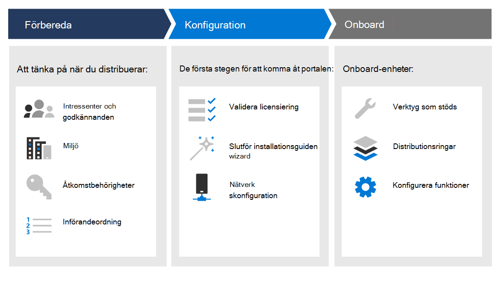
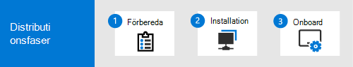

# DistributionsfaserDeployment phases

[!INCLUDE [Microsoft 365 Defender rebranding](../../includes/microsoft-defender.md)]

**Gäller för:****Applies to:**
- [Microsoft Defender för EndpointMicrosoft Defender for Endpoint](https://go.microsoft.com/fwlink/p/?linkid=2154037)
- [Microsoft 365 DefenderMicrosoft 365 Defender](https://go.microsoft.com/fwlink/?linkid=2118804)

>Vill du använda Defender för Slutpunkt?Want to experience Defender for Endpoint? [Registrera dig för en kostnadsfri utvärderingsversion.Sign up for a free trial.](https://www.microsoft.com/microsoft-365/windows/microsoft-defender-atp?ocid=docs-wdatp-assignaccess-abovefoldlink)

Lär dig hur du distribuerar Microsoft Defender för Endpoint så att ditt företag kan dra nytta av förebyggande skydd, identifiering efter intrång, automatisk undersökning och svar.Learn how to deploy Microsoft Defender for Endpoint so that your enterprise can take advantage of preventative protection, post-breach detection, automated investigation, and response. 

Den här guiden hjälper dig att arbeta med intressenter för att förbereda miljön och sedan introducera enheter på ett metodiskt sätt, flytta från utvärdering till ett meningsfullt pilottest till en fullständig distribution.This guide helps you work across stakeholders to prepare your environment and then onboard devices in a methodical way, moving from evaluation, to a meaningful pilot, to full deployment.

Varje avsnitt motsvarar en separat artikel i den här lösningen.Each section corresponds to a separate article in this solution.

|FasPhase | BeskrivningDescription | 
|:-------|:-----|
| [Fas 1: FörberedaPhase 1: Prepare](prepare-deployment.md)| Läs mer om vad du behöver tänka på när du distribuerar Defender för Endpoint, till exempel godkännanden från intressenter, miljööverväganden, åtkomstbehörigheter och införandeordningen för funktioner.Learn about what you need to consider when deploying Defender for Endpoint such as stakeholder approvals, environment considerations, access permissions, and adoption order of capabilities. 
| [Fas 2: InstallationPhase 2: Setup](production-deployment.md)|  Få vägledning om de inledande åtgärder du behöver vidta så att du kan komma åt portalen, till exempel validera licensiering, slutföra installationsguiden och nätverkskonfiguration.Get guidance on the initial steps you need to take so that you can access the portal such as validating licensing, completing the setup wizard, and network configuration. 
| [Fas 3: IntroduktionPhase 3: Onboard](onboarding.md) | Lär dig hur du använder distributionsringar, onboarding-verktyg som stöds baserat på typen av slutpunkt och hur du konfigurerar tillgängliga funktioner.Learn how to make use of deployment rings, supported onboarding tools based on the type of endpoint, and configuring available capabilities. 

När du har slutfört den här guiden konfigureras du med rätt åtkomstbehörighet, dina slutpunkter kommer att introduceras och rapportera sensordata till tjänsten, och funktioner som nästa generations skydd och minskning av attackytan kommer att finnas.After you've completed this guide, you'll be setup with the right access permissions, your endpoints will be onboarded and reporting sensor data to the service, and capabilities such as next-generation protection and attack surface reduction will be in place.

Oavsett vilken miljöarkitektur och distributionsmetod du väljer i distributionsvägledning för [Abonnemang](deployment-strategy.md) får du stöd för den här guiden i slutpunkter för onboarding.Regardless of the environment architecture and method of deployment you choose outlined in the [Plan deployment](deployment-strategy.md) guidance, this guide is going to support you in onboarding endpoints. 

## Viktiga funktionerKey capabilities

Även om Microsoft Defender för Slutpunkt innehåller många funktioner är det primära syftet med den här distributionsguiden att komma igång med att registrera enheter.While Microsoft Defender for Endpoint provides many capabilities, the primary purpose of this deployment guide is to get you started by onboarding devices. Förutom introduktionen får du i den här vägledningen även hjälp att komma igång med följande funktioner.In addition to onboarding, this guidance gets you started with the following capabilities.

FunktionCapability | BeskrivningDescription 
:---|:---
Identifiering och svar av slutpunktEndpoint detection and response | Funktioner för identifiering och svar av slutpunkter används för att identifiera, undersöka och svara på intrångsförsök och aktiva intrång.Endpoint detection and response capabilities are put in place to detect, investigate, and respond to intrusion attempts and active breaches.
Nästa generations skyddNext-generation protection | För att ytterligare förstärka nätverkets säkerhets perimeter använder Microsoft Defender för Endpoint nästa generations skydd som är utformat för att fånga upp alla typer av nya hot.To further reinforce the security perimeter of your network, Microsoft Defender for Endpoint uses next-generation protection designed to catch all types of emerging threats.
Minska attackytanAttack surface reduction |  Tillhandahåll den första försvarslinjen i högen.Provide the first line of defense in the stack. Genom att säkerställa att konfigurationsinställningarna är korrekt inställda och utnyttja tekniker för minskningar tillämpas, kommer dessa uppsättning funktioner att motarbeta attacker och användning.By ensuring configuration settings are properly set and exploit mitigation techniques are applied, these set of capabilities resist attacks and exploitation.

Alla dessa funktioner är tillgängliga för Microsoft Defender för Endpoint-licensinnehavare.All these capabilities are available for Microsoft Defender for Endpoint license holders. Mer information finns i [Licenskrav](minimum-requirements.md#licensing-requirements).For more information, see [Licensing requirements](minimum-requirements.md#licensing-requirements).

## OmfattningScope

### I omfattningIn scope

-   Användning av Microsoft Endpoint Manager och Microsoft Endpoint Manager för att introducera slutpunkter i tjänsten och konfigurera funktionerUse of Microsoft Endpoint Manager and Microsoft Endpoint Manager to onboard endpoints into the service and configure capabilities

-   Aktivera Defender för identifiering och åtgärd på slutpunkt (Identifiering och åtgärd på slutpunkt)Enabling Defender for Endpoint endpoint detection and response (EDR)  capabilities

-   Aktivera Defender för funktioner för Slutpunktsskyddsplattform (DEFENDER)Enabling Defender for Endpoint endpoint protection platform (EPP) capabilities

    -   Nästa generations skyddNext-generation protection

    -   Minska attackytanAttack surface reduction

### Inte begränsadOut of scope

Följande ingår inte i den här distributionsguiden:The following are out of scope of this deployment guide:

-   Konfiguration av lösningar från tredje part som kan integreras med Defender för EndpointConfiguration of third-party solutions that might integrate with Defender for Endpoint

-   Test av test vid test i produktionsmiljöPenetration testing in production environment

## Se ävenSee also
- [Fas 1: FörberedaPhase 1: Prepare](prepare-deployment.md)
- [Fas 2: KonfigureraPhase 2: Set up](production-deployment.md)
- [Fas 3: IntroduktionPhase 3: Onboard](onboarding.md)
- [Planera distributionPlan deployment](deployment-strategy.md)