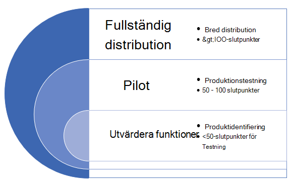
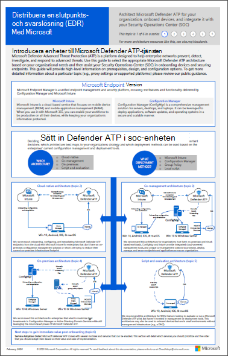
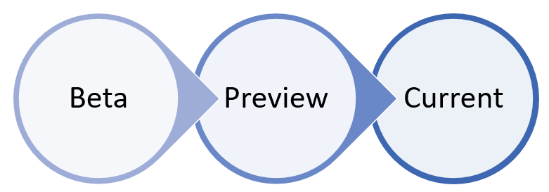

# Distribuera Microsoft Defender för slutpunkt i ringarDeploy Microsoft Defender for Endpoint in rings

[!INCLUDE [Microsoft 365 Defender rebranding](../../includes/microsoft-defender.md)]

**Gäller för:****Applies to:**
- [Microsoft Defender för EndpointMicrosoft Defender for Endpoint](https://go.microsoft.com/fwlink/p/?linkid=2154037)
- [Microsoft 365 DefenderMicrosoft 365 Defender](https://go.microsoft.com/fwlink/?linkid=2118804)

>Vill du använda Defender för Slutpunkt?Want to experience Defender for Endpoint? [Registrera dig för en kostnadsfri utvärderingsversion.Sign up for a free trial.](https://www.microsoft.com/microsoft-365/windows/microsoft-defender-atp?ocid=docs-wdatp-assignaccess-abovefoldlink)

Distribution av Microsoft Defender för Endpoint kan göras med en ringbaserad distributionsmetod.Deploying Microsoft Defender for Endpoint can be done using a ring-based deployment approach. 

Distributionsringarna kan användas i följande scenarier:The deployment rings can be applied in the following scenarios:
- [Nya distributionerNew deployments](#new-deployments)
- [Befintliga distributionerExisting deployments](#existing-deployments)

## Nya distributionerNew deployments

En ringbaserad metod är en metod för att identifiera en uppsättning slutpunkter för att registrera och verifiera att vissa villkor uppfylls innan du fortsätter att distribuera tjänsten till en större uppsättning enheter.A ring-based approach is a method of identifying a set of endpoints to onboard and verifying that certain criteria is met before proceeding to deploy the service to a larger set of devices. Du kan definiera utgångsvillkor för varje ring och säkerställa att de är nöjda innan du går vidare till nästa ring.You can define the exit criteria for each ring and ensure that they are satisfied before moving on to the next ring.

Genom att införa en ringbaserad distribution minskar du eventuella problem som kan uppstå när tjänsten distribueras.Adopting a ring-based deployment helps reduce potential issues that could arise while rolling out the service. Genom att pilottesta ett visst antal enheter först kan du identifiera potentiella problem och minimera potentiella risker som kan uppstå.By piloting a certain number of devices first, you can identify potential issues and mitigate potential risks that might arise. 

Tabell 1 innehåller ett exempel på de distributionsringar som du kan använda.Table 1 provides an example of the deployment rings you might use. 

**Tabell 1****Table 1**

|**Distributionsringen****Deployment ring**|**Beskrivning****Description**|
|:-----|:-----|
UtvärderaEvaluate | Ring 1: Identifiera 50 system för pilottestningRing 1: Identify 50 systems for pilot testing 
PilotPilot | Ring 2: Identifiera de nästa 50–100 slutpunkterna i produktionsmiljönRing 2: Identify the next 50-100  endpoints in production environment    
Fullständig distributionFull deployment | Ring 3: Distribuera tjänsten till resten av miljön stegvis.Ring 3: Roll out service to the rest of environment in larger increments

### Avsluta villkorExit criteria
Ett exempel på utgångsvillkor för dessa ringar kan vara:An example set of exit criteria for these rings can include:
- Enheter visas i enhetsinventeringslistanDevices show up in the device inventory list
- Aviseringar visas i instrumentpanelenAlerts appear in dashboard
- [Köra ett identifieringstestRun a detection test](run-detection-test.md)
- [Köra en simulerad attack på en enhetRun a simulated attack on a device](attack-simulations.md)

### UtvärderaEvaluate
Identifiera ett litet antal testdatorer i din miljö som kan komma igång med tjänsten.Identify a small number of test machines in your environment to onboard to the service. Helst bör dessa datorer ha färre än 50 slutpunkter.Ideally, these machines would be fewer than 50 endpoints. 

### PilotPilot
Microsoft Defender för Endpoint har stöd för ett antal olika slutpunkter som du kan introducera till tjänsten.Microsoft Defender for Endpoint supports a variety of endpoints that you can onboard to the service. I den här ringen identifierar du flera enheter som kan introduceras och utifrån de utgångsvillkor som du anger, bestämmer dig för att gå vidare till nästa distributionsring.In this ring, identify several devices to onboard and based on the exit criteria you define, decide to proceed to the next deployment ring.

I följande tabell visas de slutpunkter som stöds och motsvarande verktyg som du kan använda för att registrera enheter i tjänsten.The following table shows the supported endpoints and the corresponding tool you can use to onboard devices to the service. 

| SlutpunktEndpoint     | DistributionsverktygetDeployment tool                       |
|--------------|------------------------------------------|
| **Windows****Windows**  |  [Lokalt skript (upp till 10 enheter)Local script (up to 10 devices)](configure-endpoints-script.md)   Obs! Om du vill distribuera fler än 10 enheter i en produktionsmiljö använder du grupprincipmetoden i stället eller andra verktyg som stöds nedan.NOTE: If you want to deploy more than 10 devices in a production environment, use the Group Policy method instead or the other supported tools listed below.   [GrupprincipGroup Policy](configure-endpoints-gp.md)    [Microsoft Endpoint Manager/Mobile Device ManagerMicrosoft Endpoint Manager/ Mobile Device Manager](configure-endpoints-mdm.md)     [Microsoft Endpoint Configuration ManagerMicrosoft Endpoint Configuration Manager](configure-endpoints-sccm.md)   [VDI-skriptVDI scripts](configure-endpoints-vdi.md)   |
| **macOS****macOS**    | [Lokalt skriptLocal script](mac-install-manually.md)   [Microsoft Endpoint ManagerMicrosoft Endpoint Manager](mac-install-with-intune.md)   [JAMF-ProJAMF Pro](mac-install-with-jamf.md)   [Mobile Device ManagementMobile Device Management](mac-install-with-other-mdm.md) |
| **Linux Server****Linux Server** | [Lokalt skriptLocal script](linux-install-manually.md)   [En- och en-Puppet](linux-install-with-puppet.md)   [AnsibleAnsible](linux-install-with-ansible.md)|
| **iOS****iOS**      | [AppbaseradeApp-based](ios-install.md)                                |
| **Android****Android**  | [Microsoft Endpoint ManagerMicrosoft Endpoint Manager](android-intune.md)               | 

### Fullständig distributionFull deployment
I det här läget kan du använda planera [distributionsmaterial](deployment-strategy.md) för att planera distributionen.At this stage, you can use the [Plan deployment](deployment-strategy.md) material to help you plan your deployment. 

Använd följande material för att välja lämplig Microsoft Defender för Slutpunktsarkitektur som bäst passar din organisation.Use the following material to select the appropriate Microsoft Defender for Endpoint architecture that best suites your organization.

|**Objekt****Item**|**Beskrivning****Description**|
|:-----|:-----|
|  [PDF](https://github.com/MicrosoftDocs/microsoft-365-docs/raw/public/microsoft-365/security/defender-endpoint/downloads/mdatp-deployment-strategy.pdf)  \| [Visio](https://github.com/MicrosoftDocs/microsoft-365-docs/raw/public/microsoft-365/security/defender-endpoint/downloads/mdatp-deployment-strategy.vsdx)[PDF](https://github.com/MicrosoftDocs/microsoft-365-docs/raw/public/microsoft-365/security/defender-endpoint/downloads/mdatp-deployment-strategy.pdf)  \| [Visio](https://github.com/MicrosoftDocs/microsoft-365-docs/raw/public/microsoft-365/security/defender-endpoint/downloads/mdatp-deployment-strategy.vsdx) | Med hjälp av arkitekturmaterialet kan du planera din distribution för följande arkitekturer:The architectural material helps you plan your deployment for the following architectures: <ul><li> MolnbaseradCloud-native </li><li> SamhanteringCo-management </li><li> LokalOn-premise</li><li>Utvärdering och lokal registreringEvaluation and local onboarding</li>

## Befintliga distributionerExisting deployments

### Windows slutpunkterWindows endpoints
För Windows-servrar och/eller Windows-servrar väljer du flera datorer för att testa i förväg (före korrigeringen tisdag) med hjälp av programmet FÖR **säkerhetsuppdateringsverifiering (SÅD).**For Windows and/or Windows Servers, you select several machines to test ahead of time (before patch Tuesday) by using the **Security Update Validation program (SUVP)**.

Mer information finns i:For more information, see:
- [Vad är verifieringsprogrammet för säkerhetsuppdateringar?What is the Security Update Validation Program](https://techcommunity.microsoft.com/t5/windows-it-pro-blog/what-is-the-security-update-validation-program/ba-p/275767)
- [Valideringsprogram för program för programuppdatering och Microsoft Malware Protection Center upp - TwC Interaktiv tidslinje del 4Software Update Validation Program and Microsoft Malware Protection Center Establishment - TwC Interactive Timeline Part 4](https://www.microsoft.com/security/blog/2012/03/28/software-update-validation-program-and-microsoft-malware-protection-center-establishment-twc-interactive-timeline-part-4/)

### Slutpunkter som Windows inte är slutpunkterNon-Windows endpoints
Med macOS och Linux kan du köra ett par system i Beta-kanalen.With macOS and Linux, you could take a couple of systems and run in the Beta channel.

>[!NOTE]
>Under idealiska som helst minst en säkerhetsadministratör och en utvecklare så att du kan hitta kompatibilitets-, prestanda- och tillförlitlighetsproblem innan versionen tar den till aktuell kanal.Ideally at least one security admin and one developer so that you are able to find compatibility, performance and reliability issues before the build makes it into the Current channel.

Valet av kanal avgör typ och frekvens för uppdateringar som erbjuds till din enhet.The choice of the channel determines the type and frequency of updates that are offered to your device. Enheter i betaversion är de första som får uppdateringar och nya funktioner, följt senare av Förhandsversion och slutligen av Aktuell.Devices in Beta are the first ones to receive updates and new features, followed later by Preview and lastly by Current.

Om du vill förhandsgranska nya funktioner och ge tidig feedback rekommenderar vi att du konfigurerar vissa enheter i företaget för användning med antingen betaversion eller förhandsversion.In order to preview new features and provide early feedback, it is recommended that you configure some devices in your enterprise to use either Beta or Preview.

>[!WARNING]
>Om du byter kanal efter den första installationen måste produkten installeras om.Switching the channel after the initial installation requires the product to be reinstalled. Om du vill byta produktkanal: avinstallera det befintliga paketet, konfigurera om enheten så att den nya kanalen används och följ stegen i det här dokumentet för att installera paketet från den nya platsen.To switch the product channel: uninstall the existing package, re-configure your device to use the new channel, and follow the steps in this document to install the package from the new location.
