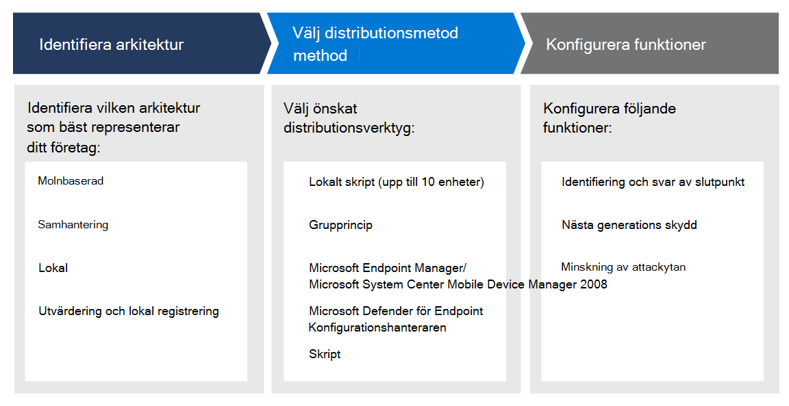

# Planera distribution av Microsoft Defender för SlutpunktPlan your Microsoft Defender for Endpoint deployment 

[!INCLUDE [Microsoft 365 Defender rebranding](../../includes/microsoft-defender.md)]

**Gäller för:****Applies to:**
- [Microsoft Defender för EndpointMicrosoft Defender for Endpoint](https://go.microsoft.com/fwlink/p/?linkid=2154037)
- [Microsoft 365 DefenderMicrosoft 365 Defender](https://go.microsoft.com/fwlink/?linkid=2118804)

>Vill du använda Defender för Slutpunkt?Want to experience Defender for Endpoint? [Registrera dig för en kostnadsfri utvärderingsversion.Sign up for a free trial.](https://www.microsoft.com/microsoft-365/windows/microsoft-defender-atp?ocid=docs-wdatp-secopsdashboard-abovefoldlink) 

Planera distributionen av Microsoft Defender för slutpunkt så att du kan maximera säkerhetsfunktionerna i paketet och bättre skydda ditt företag mot cyberhot.Plan your Microsoft Defender for Endpoint deployment so that you can maximize the security capabilities within the suite and better protect your enterprise from cyber threats.

Den här lösningen innehåller vägledning om hur du identifierar din miljöarkitektur, väljer den typ av distributionsverktyg som bäst passar dina behov och vägledning om hur du konfigurerar funktioner.This solution provides guidance on how to identify your environment architecture, select the type of deployment tool that best fits your needs, and guidance on how to configure capabilities.

## Steg 1: Identifiera arkitekturStep 1: Identify architecture
Vi förstår att alla företagsmiljöer är unika, så vi har tillhandahållit flera alternativ för att ge dig flexibiliteten att välja hur tjänsten ska distribueras.We understand that every enterprise environment is unique, so we've provided several options to give you the flexibility in choosing how to deploy the service.

Beroende på din miljö passar vissa verktyg bättre för vissa arkitekturer.Depending on your environment, some tools are better suited for certain architectures. 

Använd följande material för att välja lämplig Defender för Endpoint-arkitektur som bäst passar din organisation.Use the following material to select the appropriate Defender for Endpoint architecture that best suites your organization.

| ObjektItem | BeskrivningDescription |
|:-----|:-----|
|  [PDF](https://github.com/MicrosoftDocs/microsoft-365-docs/raw/public/microsoft-365/security/defender-endpoint/downloads/mdatp-deployment-strategy.pdf)  \| [Visio](https://github.com/MicrosoftDocs/microsoft-365-docs/raw/public/microsoft-365/security/defender-endpoint/downloads/mdatp-deployment-strategy.vsdx)[PDF](https://github.com/MicrosoftDocs/microsoft-365-docs/raw/public/microsoft-365/security/defender-endpoint/downloads/mdatp-deployment-strategy.pdf)  \| [Visio](https://github.com/MicrosoftDocs/microsoft-365-docs/raw/public/microsoft-365/security/defender-endpoint/downloads/mdatp-deployment-strategy.vsdx) | Med hjälp av arkitekturmaterialet kan du planera din distribution för följande arkitekturer:The architectural material helps you plan your deployment for the following architectures: <ul><li> MolnbaseradCloud-native </li><li> SamhanteringCo-management </li><li> LokalOn-premise</li><li>Utvärdering och lokal registreringEvaluation and local onboarding</li>

## Steg 2: Välj distributionsmetodStep 2: Select deployment method
Defender för Endpoint har stöd för ett antal olika slutpunkter som du kan introducera till tjänsten.Defender for Endpoint supports a variety of endpoints that you can onboard to the service. 

I följande tabell visas de slutpunkter som stöds och motsvarande distributionsverktyg som du kan använda så att du kan planera distributionen på rätt sätt.The following table lists the supported endpoints and the corresponding deployment tool that you can use so that you can plan the deployment appropriately.

| SlutpunktEndpoint     | DistributionsverktygetDeployment tool                       |
|--------------|------------------------------------------|
| **Windows****Windows**  |  [Lokalt skript (upp till 10 enheter)Local script (up to 10 devices)](configure-endpoints-script.md)    [GrupprincipGroup Policy](configure-endpoints-gp.md)    [Microsoft Endpoint Manager/Mobile Device ManagerMicrosoft Endpoint Manager/ Mobile Device Manager](configure-endpoints-mdm.md)     [Microsoft Endpoint Configuration ManagerMicrosoft Endpoint Configuration Manager](configure-endpoints-sccm.md)   [VDI-skriptVDI scripts](configure-endpoints-vdi.md)   |
| **macOS****macOS**    | [Lokalt skriptLocal script](mac-install-manually.md)   [Microsoft Endpoint ManagerMicrosoft Endpoint Manager](mac-install-with-intune.md)   [JAMF ProJAMF Pro](mac-install-with-jamf.md)   [Mobile Device ManagementMobile Device Management](mac-install-with-other-mdm.md) |
| **Linux Server****Linux Server** | [Lokalt skriptLocal script](linux-install-manually.md)   [En- och en-Puppet](linux-install-with-puppet.md)   [AnsibleAnsible](linux-install-with-ansible.md)|
| **iOS****iOS**      | [AppbaseradeApp-based](ios-install.md)                                |
| **Android****Android**  | [Microsoft Endpoint ManagerMicrosoft Endpoint Manager](android-intune.md)               | 

## Steg 3: Konfigurera funktionerStep 3: Configure capabilities
Efter slutpunkter för onboarding konfigurerar du säkerhetsfunktionerna i Defender för Endpoint så att du kan maximera det robusta säkerhetsskydd som finns tillgängligt i programsviten.After onboarding endpoints, configure the security capabilities in Defender for Endpoint so that you can maximize the robust security protection available in the suite. Funktionerna omfattar:Capabilities include:

- Identifiering och svar av slutpunkterEndpoint detection and response
- Nästa generations skyddNext-generation protection
- Minskning av attackytanAttack surface reduction

  
## Relaterade ämnenRelated topics
- [DistributionsfaserDeployment phases](deployment-phases.md)
