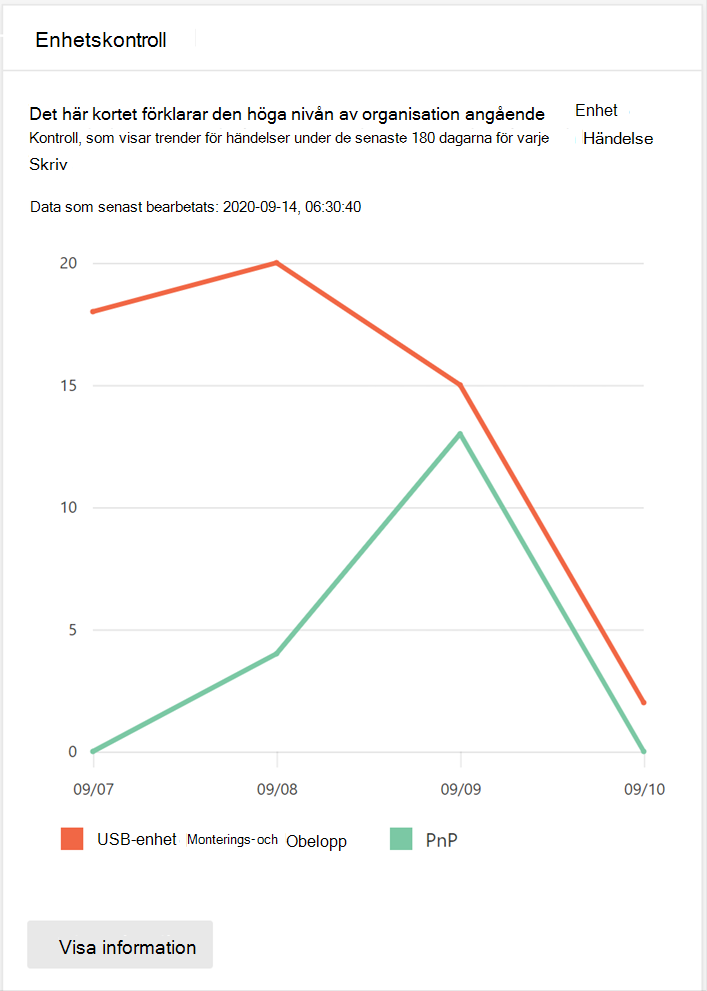
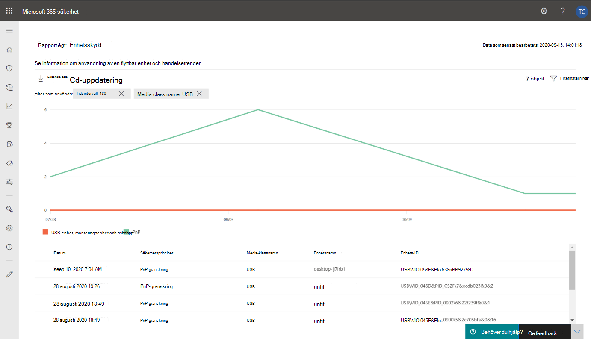
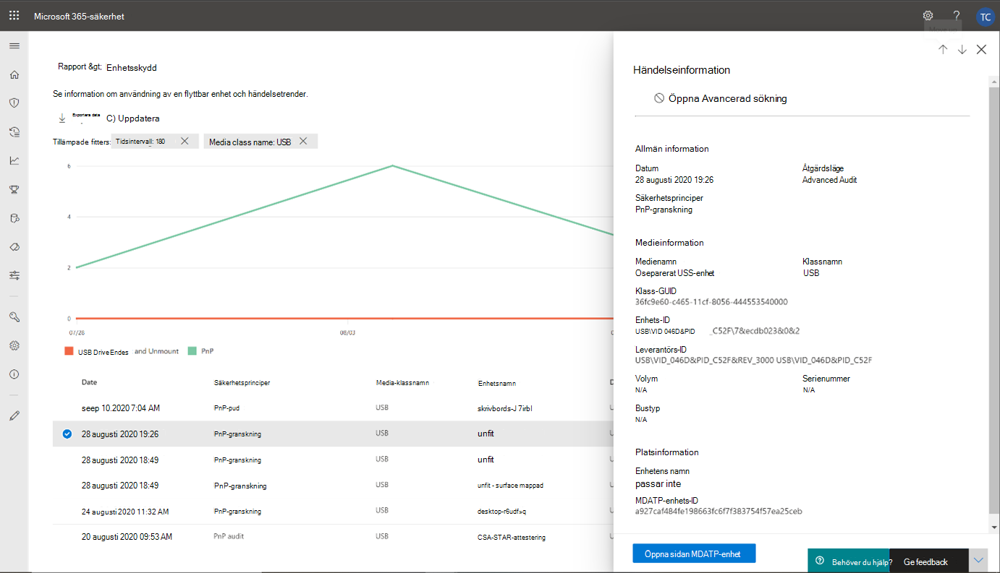
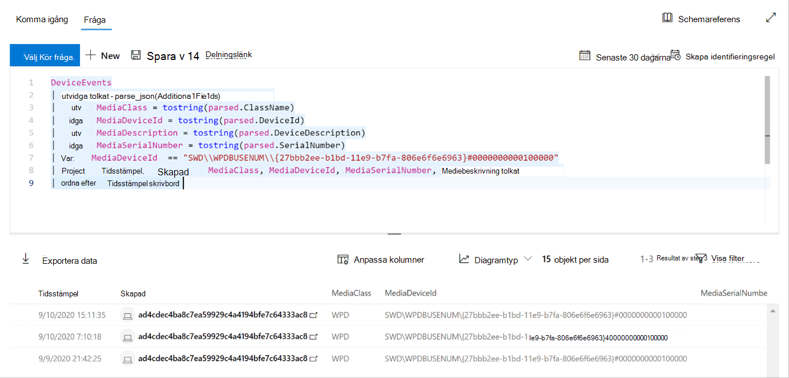

# Skydda organisationens data med enhetskontroll

**Gäller för:** [Microsoft Defender för slutpunkt](https://go.microsoft.com/fwlink/p/?linkid=2069559)

Microsoft Defender för Endpoint-enhetskontroll skyddar mot dataförlust genom att övervaka och styra medieanvändningen på olika enheter i organisationen, t.ex. användning av flyttbara lagringsenheter och USB-enheter.

Med enhetskontrollrapporten kan du visa händelser som är relaterade till medieanvändning, till exempel:

- **Granskningshändelser:** Visar antalet granskningshändelser som inträffar när externa media är anslutna.
- **Policyhändelser:** Visar antalet principhändelser som inträffar när en enhetskontrollprincip utlöses.

> [!NOTE]
> Granskningshändelsen för att spåra medieanvändning är aktiverad som standard för enheter som är onboarded till Microsoft Defender för Endpoint.

## Förstå granskningshändelserna

Granskningshändelserna omfattar:

- **USB-enhetsuppfattning och avbelopp:** Granskningshändelser som genereras när en USB-enhet ärmonterad eller oöverstiglig.
- **PnP:** Plug and Play audit events are generated when removable storage, a printer, or Bluetooth media is connected.

## Övervaka säkerheten för enhetskontroller

Enhetskontroll i Microsoft Defender för Endpoint ger säkerhetsadministratörer möjlighet att använda verktyg som gör att de kan spåra organisationens enhetskontrollsäkerhet via rapporter. Du hittar rapporten om enhetskontroll i Säkerhetscenter för Microsoft 365 genom att gå till **Rapporter > Enhetsskydd**.

Kortet för enhetsskydd på **instrumentpanelen** Rapporter visar antalet granskningshändelser som genererats av medietyp under de senaste 180 dagarna.

> [!div class="mx-imgBorder"]
> 

Knappen **Visa information** visar mer medieanvändningsdata på sidan med **enhetskontrollrapporten.**

Sidan innehåller en instrumentpanel med det samlade antalet händelser per typ och en lista över händelser. Administratörer kan filtrera fram tidsintervall, mediaklassnamn och enhets-ID.

> [!div class="mx-imgBorder"]
> 

När du väljer en händelse visas en utfällning med mer information:

- **Allmän information:** Datum, åtgärdsläge och principen för den här händelsen.
- **Medieinformation:** Medieinformation omfattar Medienamn, Klassnamn, Klass-GUID, Enhets-ID, Leverantörs-ID, Volym, Serienummer och Bustyp.
- **Platsinformation:** Enhetsnamn och MDATP-enhets-ID.

> [!div class="mx-imgBorder"]
> 

Om du vill se realtidsaktivitet för dessa medier i hela organisationen väljer du **knappen Öppna avancerad** sökning. Det här inkluderar en inbäddad, fördefinierad fråga.

> [!div class="mx-imgBorder"]
> 

Om du vill se enhetens säkerhet väljer du **knappen Öppna enhetssida** på den utfällade sidan. Med den här knappen öppnas sidan enhetsentitet.

> [!div class="mx-imgBorder"]
> 

## Rapporteringsfördröjningar

Rapporten om enhetskontroll kan ha en fördröjning på 12 timmar från den tid en medieanslutning uppstår till den tidpunkt då händelsen återspeglas på kortet eller i domänlistan.
