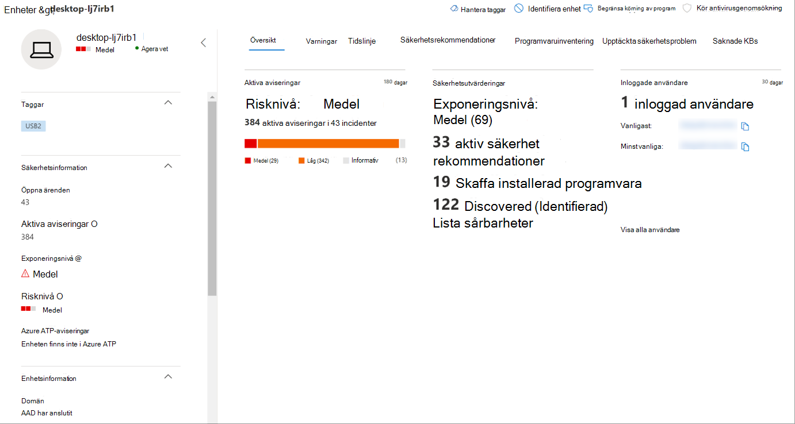

# Skydda organisationens data med enhetskontrollProtect your organization’s data with device control

**Gäller för:** [Microsoft Defender för slutpunkt](https://go.microsoft.com/fwlink/p/?linkid=2069559)**Applies to:** [Microsoft Defender for Endpoint](https://go.microsoft.com/fwlink/p/?linkid=2069559)

Microsoft Defender för Endpoint-enhetskontroll skyddar mot dataförlust genom att övervaka och styra medieanvändningen på olika enheter i organisationen, t.ex. användning av flyttbara lagringsenheter och USB-enheter.Microsoft Defender for Endpoint device control protects against data loss, by monitoring and controlling media use by devices in your organization, such as the use of removable storage devices and USB drives.

Med enhetskontrollrapporten kan du visa händelser som är relaterade till medieanvändning, till exempel:With the device control report, you can view events that relate to media usage, such as:

- **Granskningshändelser:** Visar antalet granskningshändelser som inträffar när externa media är anslutna.**Audit events:** Shows the number of audit events that occur when external media is connected.
- **Policyhändelser:** Visar antalet principhändelser som inträffar när en enhetskontrollprincip utlöses.**Policy events:** Shows the number of policy events that occur when a device control policy is triggered.

> [!NOTE]
> Granskningshändelsen för att spåra medieanvändning är aktiverad som standard för enheter som är onboarded till Microsoft Defender för Endpoint.The audit event to track media usage is enabled by default for devices onboarded to Microsoft Defender for Endpoint.

## Förstå granskningshändelsernaUnderstanding the audit events

Granskningshändelserna omfattar:The audit events include:

- **USB-enhetsuppfattning och avbelopp:** Granskningshändelser som genereras när en USB-enhet ärmonterad eller oöverstiglig.**USB drive mount and unmount:** Audit events that are generated when a USB drive is mounted or unmounted.
- **PnP:** Plug and Play audit events are generated when removable storage, a printer, or Bluetooth media is connected.**PnP:** Plug and Play audit events are generated when removable storage, a printer, or Bluetooth media is connected.

## Övervaka säkerheten för enhetskontrollerMonitor device control security

Enhetskontroll i Microsoft Defender för Endpoint ger säkerhetsadministratörer möjlighet att använda verktyg som gör att de kan spåra organisationens enhetskontrollsäkerhet via rapporter.Device control in Microsoft Defender for Endpoint empowers security administrators with tools that enable them to track their organization’s device control security through reports. Du hittar rapporten om enhetskontroll i säkerhetscentret i Microsoft 365 genom att gå till **Rapporter > Enhetsskydd**.You can find the device control report in the Microsoft 365 security center by going to **Reports > Device protection**.

Kortet för enhetsskydd på **instrumentpanelen** Rapporter visar antalet granskningshändelser som genererats av medietyp under de senaste 180 dagarna.The Device protection card on the **Reports** dashboard shows the number of audit events generated by media type, over the last 180 days.

> [!div class="mx-imgBorder"]
> 

Knappen **Visa information** visar mer medieanvändningsdata på sidan med **enhetskontrollrapporten.**The **View details** button shows more media usage data in the **device control report** page.

Sidan innehåller en instrumentpanel med det samlade antalet händelser per typ och en lista över händelser.The page provides a dashboard with aggregated number of events per type and a list of events. Administratörer kan filtrera fram tidsintervall, mediaklassnamn och enhets-ID.Administrators can filter on time range, media class name, and device ID.

> [!div class="mx-imgBorder"]
> 

När du väljer en händelse visas en utfällning med mer information:When you select an event, a flyout appears that shows you more information:

- **Allmän information:** Datum, åtgärdsläge och principen för den här händelsen.**General details:** Date, Action mode, and the policy of this event.
- **Medieinformation:** Medieinformation omfattar Medienamn, Klassnamn, Klass-GUID, Enhets-ID, Leverantörs-ID, Volym, Serienummer och Bustyp.**Media information:** Media information includes Media name, Class name, Class GUID, Device ID, Vendor ID, Volume, Serial number, and Bus type.
- **Platsinformation:** Enhetsnamn och MDATP enhets-ID.**Location details:** Device name and MDATP device ID.

> [!div class="mx-imgBorder"]
> 

Om du vill se realtidsaktivitet för dessa medier i hela organisationen väljer du **knappen Öppna avancerad** sökning.To see real-time activity for this media across the organization, select the **Open Advanced hunting** button. Det här inkluderar en inbäddad, fördefinierad fråga.This includes an embedded, pre-defined query.

> [!div class="mx-imgBorder"]
> 

Om du vill se enhetens säkerhet väljer du **knappen Öppna enhetssida** på den utfällade sidan.To see the security of the device, select the **Open device page** button on the flyout. Med den här knappen öppnas sidan enhetsentitet.This button opens the device entity page.

> [!div class="mx-imgBorder"]
> 

## RapporteringsfördröjningarReporting delays

Rapporten om enhetskontroll kan ha en fördröjning på 12 timmar från den tid en medieanslutning uppstår till den tidpunkt då händelsen återspeglas på kortet eller i domänlistan.The device control report can have a 12-hour delay from the time a media connection occurs to the time the event is reflected in the card or in the domain list.
