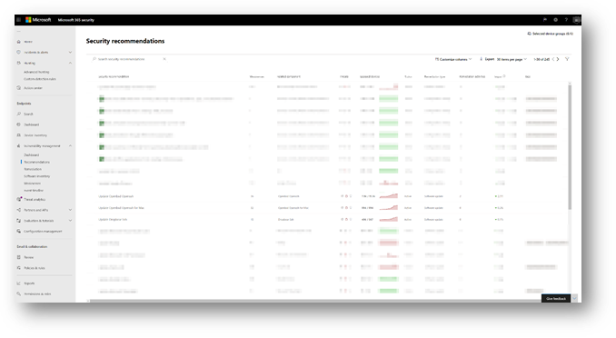
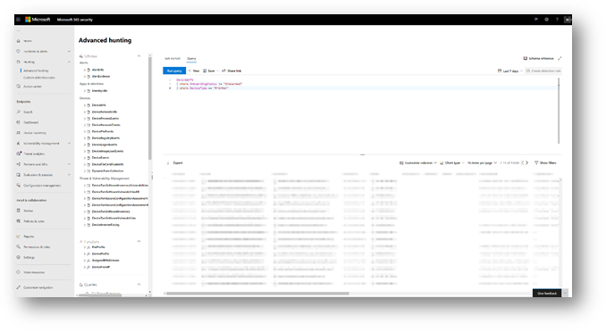

# <a name="device-discovery-overview"></a><span data-ttu-id="7da54-104">Översikt över enhetsidentifiering</span><span class="sxs-lookup"><span data-stu-id="7da54-104">Device discovery overview</span></span>

[!INCLUDE [Microsoft 365 Defender rebranding](../../includes/microsoft-defender.md)]

<span data-ttu-id="7da54-105">**Gäller för:**</span><span class="sxs-lookup"><span data-stu-id="7da54-105">**Applies to:**</span></span>
- [<span data-ttu-id="7da54-106">Microsoft Defender för Endpoint</span><span class="sxs-lookup"><span data-stu-id="7da54-106">Microsoft Defender for Endpoint</span></span>](https://go.microsoft.com/fwlink/p/?linkid=2146631)
- [<span data-ttu-id="7da54-107">Microsoft 365 Defender</span><span class="sxs-lookup"><span data-stu-id="7da54-107">Microsoft 365 Defender</span></span>](https://go.microsoft.com/fwlink/?linkid=2118804)


<span data-ttu-id="7da54-108">För att du ska kunna skydda din miljö måste du göra en inventering av de enheter som finns i nätverket.</span><span class="sxs-lookup"><span data-stu-id="7da54-108">Protecting your environment requires taking inventory of the devices that are in your network.</span></span> <span data-ttu-id="7da54-109">Det kan dock vara dyr, utmanande och tidskrävande att mappa enheter i ett nätverk.</span><span class="sxs-lookup"><span data-stu-id="7da54-109">However, mapping devices in a network can often be expensive, challenging, and time-consuming.</span></span> 

<span data-ttu-id="7da54-110">Microsoft Defender för slutpunkt ger en funktion för enhetsidentifiering som hjälper dig att hitta ohanterade enheter som är anslutna till företagsnätverket utan att behöva extra utrustning eller krångliga processändringar.</span><span class="sxs-lookup"><span data-stu-id="7da54-110">Microsoft Defender for Endpoint provides a device discovery capability that helps you find unmanaged devices connected to your corporate network without the need for extra appliances or cumbersome process changes.</span></span>


<span data-ttu-id="7da54-111">Med funktionen för enhetsidentifiering kan du:</span><span class="sxs-lookup"><span data-stu-id="7da54-111">The device discovery capability allows you to:</span></span>

- <span data-ttu-id="7da54-112">**Upptäck slutpunkter för företag som är anslutna till företagets nätverk**</span><span class="sxs-lookup"><span data-stu-id="7da54-112">**Discover enterprise endpoints connected to your corporate network**</span></span> <br>
<span data-ttu-id="7da54-113">Med hjälp av grundläggande identifieringsalternativ eller standardidentifieringsalternativ kan du hitta arbetsstationer, servrar och mobila slutpunkter som ännu inte har introducerats till Microsoft Defender för Slutpunkt.</span><span class="sxs-lookup"><span data-stu-id="7da54-113">Using either basic or standard discovery options, you can discover workstations, servers, and mobile endpoints that are not yet onboarded to Microsoft Defender for Endpoint.</span></span>  

- <span data-ttu-id="7da54-114">**Onboard discovered endpoints**</span><span class="sxs-lookup"><span data-stu-id="7da54-114">**Onboard discovered endpoints**</span></span><br>
<span data-ttu-id="7da54-115">Ohanterade slutpunkter i nätverket innebär svagheter och risker för nätverket.</span><span class="sxs-lookup"><span data-stu-id="7da54-115">Unmanaged endpoints in your network introduce vulnerabilities and risks to your network.</span></span> <span data-ttu-id="7da54-116">Att registrera dem i tjänsten kan öka säkerheten för dem.</span><span class="sxs-lookup"><span data-stu-id="7da54-116">Onboarding them to the service can increase the security visibility on them.</span></span> 

<span data-ttu-id="7da54-117">Tillsammans med den här funktionen kommer en ny säkerhetsrekommendationer om att registrera enheter i Microsoft Defender för Endpoint att finnas tillgänglig som en del av den befintliga upplevelsen av hantering av hot och sårbarhet.</span><span class="sxs-lookup"><span data-stu-id="7da54-117">In conjunction with this capability, a new security recommendation to onboard devices to Microsoft Defender for Endpoint will be available as part of the existing Threat and Vulnerability Management experience.</span></span>


## <a name="discovery-methods"></a><span data-ttu-id="7da54-118">Identifieringsmetoder</span><span class="sxs-lookup"><span data-stu-id="7da54-118">Discovery methods</span></span>
<span data-ttu-id="7da54-119">Det finns två identifieringslägen:</span><span class="sxs-lookup"><span data-stu-id="7da54-119">There are two modes of discovery:</span></span> 

-   <span data-ttu-id="7da54-120">Grundläggande identifiering</span><span class="sxs-lookup"><span data-stu-id="7da54-120">Basic discovery</span></span> 
-   <span data-ttu-id="7da54-121">Standardidentifiering (rekommenderas)</span><span class="sxs-lookup"><span data-stu-id="7da54-121">Standard discovery (recommended)</span></span> 


> [!IMPORTANT]
> <span data-ttu-id="7da54-122">Identifieringen är inställd på standardläge.</span><span class="sxs-lookup"><span data-stu-id="7da54-122">Discovery is set to basic mode.</span></span> <span data-ttu-id="7da54-123">Du kan välja att behålla den här konfigurationen via inställningssidan.</span><span class="sxs-lookup"><span data-stu-id="7da54-123">You can choose to retain this configuration through the settings page.</span></span> <span data-ttu-id="7da54-124">Standardidentifieringen kommer att vara standardläget för alla kunder från och med den 19 juli 2021 , om det inte ändrats via inställningssidan före detta datum.</span><span class="sxs-lookup"><span data-stu-id="7da54-124">Standard discovery will be the default mode for all customers starting July 19, 2021 - unless modified through the settings page before this date.</span></span>

### <a name="basic-discovery"></a><span data-ttu-id="7da54-125">Grundläggande identifiering</span><span class="sxs-lookup"><span data-stu-id="7da54-125">Basic discovery</span></span> 

<span data-ttu-id="7da54-126">I det här läget samlar slutpunkter in händelser in passivt i nätverket och extraherar enhetsinformation från dem.</span><span class="sxs-lookup"><span data-stu-id="7da54-126">In this mode, endpoints will passively collect events in your network and extract device information from them.</span></span> <span data-ttu-id="7da54-127">Grundläggande identifiering använder den SenseNDR.exe för insamling av passiva nätverksdata och ingen nätverkstrafik kommer att initieras.</span><span class="sxs-lookup"><span data-stu-id="7da54-127">Basic discovery uses the SenseNDR.exe binary for passive network data collection and no network traffic will be initiated.</span></span> <span data-ttu-id="7da54-128">Slutpunkter extraherar helt enkelt data från varje nätverkstrafik som visas för en onboarded-enhet.</span><span class="sxs-lookup"><span data-stu-id="7da54-128">Endpoints will simply extract data from every network traffic that is seen by an onboarded device.</span></span> 

### <a name="standard-discovery"></a><span data-ttu-id="7da54-129">Standardidentifiering</span><span class="sxs-lookup"><span data-stu-id="7da54-129">Standard discovery</span></span> 

<span data-ttu-id="7da54-130">Med det här läget kan slutpunkter aktivt registrera observerade enheter i nätverket för att utveckla insamlade data – vilket hjälper dig att skapa en tillförlitlig och sammanhängande enhetsinventering.</span><span class="sxs-lookup"><span data-stu-id="7da54-130">This mode allows endpoints to actively probe observed devices in the network to enrich collected data - helping you build a reliable and coherent device inventory.</span></span> <span data-ttu-id="7da54-131">I standardläget används smart och aktiv sannolikhet för att upptäcka ännu mer information om observerade enheter för att utöka befintlig enhetsinformation.</span><span class="sxs-lookup"><span data-stu-id="7da54-131">Standard mode uses smart, active probing to discover even more information about observed devices to enrich existing device information.</span></span>  

<span data-ttu-id="7da54-132">När standardläget är aktiverat kan minimal och inaktiverad nätverksaktivitet som genereras av identifieringssensoren observeras av organisationens nätverksövervakningsverktyg.</span><span class="sxs-lookup"><span data-stu-id="7da54-132">When Standard mode is enabled, minimal and negligible network activity generated by the discovery sensor might be observed by network monitoring tools in your organization.</span></span>  

 <span data-ttu-id="7da54-133">Om du väljer att inte aktivera det här läget får du bara begränsad insyn i ohanterade slutpunkter i nätverket.</span><span class="sxs-lookup"><span data-stu-id="7da54-133">If you choose not to enable this mode, you will only gain limited visibility of unmanaged endpoints in your network.</span></span>

<span data-ttu-id="7da54-134">Standardidentifiering använder olika PowerShell-skript för att aktivt söka enheter i nätverket.</span><span class="sxs-lookup"><span data-stu-id="7da54-134">Standard discovery uses various PowerShell scripts to actively probe devices in the network.</span></span> <span data-ttu-id="7da54-135">Dessa PowerShell-skript är Microsoft signerade och körs från följande plats: `C:\ProgramData\Microsoft\Windows Defender Advanced Threat Protection\Downloads\*.ps` .</span><span class="sxs-lookup"><span data-stu-id="7da54-135">Those PowerShell scripts are Microsoft signed and are executed from the following location: `C:\ProgramData\Microsoft\Windows Defender Advanced Threat Protection\Downloads\*.ps`.</span></span> <span data-ttu-id="7da54-136">Till exempel `C:\ProgramData\Microsoft\Windows Defender Advanced Threat Protection\Downloads\UnicastScannerV1.1.0.ps1`.</span><span class="sxs-lookup"><span data-stu-id="7da54-136">For example, `C:\ProgramData\Microsoft\Windows Defender Advanced Threat Protection\Downloads\UnicastScannerV1.1.0.ps1`.</span></span>

<span data-ttu-id="7da54-137">Du kan ändra och anpassa dina identifieringsinställningar för mer information i [Konfigurera enhetsidentifiering.](configure-device-discovery.md)</span><span class="sxs-lookup"><span data-stu-id="7da54-137">You can change and customize your discovery settings, for more information see [Configure device discovery](configure-device-discovery.md).</span></span>

> [!NOTE]
> <span data-ttu-id="7da54-138">Identifieringsmotorn skiljer mellan nätverkshändelser som tas emot i företagsnätverket jämfört med utanför företagsnätverket.</span><span class="sxs-lookup"><span data-stu-id="7da54-138">The discovery engine distinguishes between network events that are received in the corporate network versus outside of the corporate network.</span></span> <span data-ttu-id="7da54-139">Enheter som inte är anslutna till företagets nätverk upptäcks eller listas inte i enhetsinventeringen.</span><span class="sxs-lookup"><span data-stu-id="7da54-139">Devices that are not connected to corporate networks will not be discovered or listed in the device inventory.</span></span> 


## <a name="device-inventory"></a><span data-ttu-id="7da54-140">Enhetsinventering</span><span class="sxs-lookup"><span data-stu-id="7da54-140">Device Inventory</span></span> 
<span data-ttu-id="7da54-141">Enheter som har identifierats men ännu inte har introducerats och skyddats av Microsoft Defender för Slutpunkt visas i Enhetsinventering på fliken Slutpunkter. Du kan nu använda ett nytt filter i enhetsinventeringslistan med namnet Onboarding status som kan ha något av följande värden:</span><span class="sxs-lookup"><span data-stu-id="7da54-141">Devices that have been discovered but have not yet been onboarded and secured by Microsoft Defender for Endpoint will be listed in Device Inventory within the Endpoints tab. You can now use a new filter in the device inventory list called Onboarding status which can have any of the following values:</span></span>

- <span data-ttu-id="7da54-142">Introduktion – Slutpunkten introduceras till Microsoft Defender för Endpoint.</span><span class="sxs-lookup"><span data-stu-id="7da54-142">Onboarded – The endpoint is onboarded to Microsoft Defender for Endpoint.</span></span>
- <span data-ttu-id="7da54-143">Kan introduceras – Slutpunkten identifierades i nätverket och operativsystemet identifierades som ett som stöds av Microsoft Defender för Endpoint, men det är för närvarande inte introducerat.</span><span class="sxs-lookup"><span data-stu-id="7da54-143">Can be onboarded – The endpoint was discovered in the network and the Operating System was identified as one that is supported by Microsoft Defender for Endpoint, but it is not currently onboarded.</span></span> <span data-ttu-id="7da54-144">Vi rekommenderar att du använder dessa enheter.</span><span class="sxs-lookup"><span data-stu-id="7da54-144">We highly recommend onboarding these devices.</span></span>
- <span data-ttu-id="7da54-145">Stöds inte – Slutpunkten upptäcktes i nätverket men stöds inte av Microsoft Defender för Slutpunkt.</span><span class="sxs-lookup"><span data-stu-id="7da54-145">Unsupported – The endpoint was discovered in the network but is not supported by Microsoft Defender for Endpoint.</span></span>
- <span data-ttu-id="7da54-146">Otillräcklig information – Systemet kunde inte fastställa enhetens supportmöjlighet.</span><span class="sxs-lookup"><span data-stu-id="7da54-146">Insufficient info – The system could not determine the supportability of the device.</span></span> <span data-ttu-id="7da54-147">Genom att aktivera standardidentifiering på fler enheter i nätverket kan de identifierade attributen utökas.</span><span class="sxs-lookup"><span data-stu-id="7da54-147">Enabling standard discovery on more devices in the network can enrich the discovered attributes.</span></span> 
 


> [!TIP]
> <span data-ttu-id="7da54-149">Du kan alltid använda filter för att utesluta ohanterade enheter från enhetsinventeringslistan.</span><span class="sxs-lookup"><span data-stu-id="7da54-149">You can always apply filters to exclude unmanaged devices from the device inventory list.</span></span> <span data-ttu-id="7da54-150">Du kan också använda kolumnen onboardingstatus i API-frågor för att filtrera bort ohanterade enheter.</span><span class="sxs-lookup"><span data-stu-id="7da54-150">You can also use the onboarding status column on API queries to filter out unmanaged devices.</span></span> 

## <a name="vulnerability-assessment-on-discovered-devices"></a><span data-ttu-id="7da54-151">Sårbarhetsbedömning på identifierade enheter</span><span class="sxs-lookup"><span data-stu-id="7da54-151">Vulnerability assessment on discovered devices</span></span>
<span data-ttu-id="7da54-152">Säkerhetsproblem och risker på dina enheter samt andra identifierade ohanterade enheter i nätverket är en del av de aktuella TVM-flödena under "Security Rekommendationer" och representeras på entitetssidor i portalen.</span><span class="sxs-lookup"><span data-stu-id="7da54-152">Vulnerabilities and risks on your devices as well as other discovered unmanaged devices in the network are part of the current TVM flows under "Security Recommendations" and represented in entity pages across the portal.</span></span> <span data-ttu-id="7da54-153">Sök efter SSH-relaterade säkerhetsrekommendationer för att hitta svagheter i SSH som är relaterade till ohanterade och hanterade enheter.</span><span class="sxs-lookup"><span data-stu-id="7da54-153">Search for "SSH" related security recommendations to find SSH vulnerabilities that are related for unmanaged and managed devices.</span></span> 

  

## <a name="use-advanced-hunting-on-discovered-devices"></a><span data-ttu-id="7da54-155">Använda Avancerad sökning på identifierade enheter</span><span class="sxs-lookup"><span data-stu-id="7da54-155">Use Advanced Hunting on discovered devices</span></span>
<span data-ttu-id="7da54-156">Du kan använda Avancerad sökning för att se vilka enheter som finns.</span><span class="sxs-lookup"><span data-stu-id="7da54-156">You can use Advanced Hunting queries to gain visibility on discovered devices.</span></span>
<span data-ttu-id="7da54-157">Hitta information om identifierade slutpunkter i tabellen DeviceInfo eller nätverksrelaterad information om dessa enheter i tabellen DeviceNetworkInfo.</span><span class="sxs-lookup"><span data-stu-id="7da54-157">Find details about discovered Endpoints in the DeviceInfo table, or network-related information about those devices in the DeviceNetworkInfo table.</span></span>
  




<span data-ttu-id="7da54-159">Enhetsidentifieringen utnyttjar Microsoft Defender för slutpunktsbaserade enheter som en nätverksdatakälla för att attributaktiviteter till enheter som inte är registrerade.</span><span class="sxs-lookup"><span data-stu-id="7da54-159">Device discovery leverages Microsoft Defender for Endpoint onboarded devices as a network data source to attribute activities to non-onboarded devices.</span></span> <span data-ttu-id="7da54-160">Det innebär att om en Microsoft Defender för slutpunktsbaserad enhet kommuniceras med en enhet som inte är onboarded kan aktiviteter på enheter som inte är onboarded-enheter visas på tidslinjen och via tabellen Advanced hunting DeviceNetworkEvents.</span><span class="sxs-lookup"><span data-stu-id="7da54-160">This means that if a Microsoft Defender for Endpoint onboarded device communicated with a non-onboarded device, activities on the non-onboarded device can be seen on the timeline and through the Advanced hunting DeviceNetworkEvents table.</span></span> 


<span data-ttu-id="7da54-161">Nya händelser är TCP-anslutningar (Transmission Control Protocol) och kommer att passa till det aktuella DeviceNetworkEvents-schemat.</span><span class="sxs-lookup"><span data-stu-id="7da54-161">New events are Transmission Control Protocol (TCP) connections-based and will fit to the current DeviceNetworkEvents scheme.</span></span> <span data-ttu-id="7da54-162">TCP-anslutning till Microsoft Defender för slutpunktsaktiverad enhet från en enhet som inte är Microsoft Defender för slutpunkt aktiverad.</span><span class="sxs-lookup"><span data-stu-id="7da54-162">TCP ingress to the Microsoft Defender for Endpoint enabled device from a non-Microsoft Defender for Endpoint enabled.</span></span>  

<span data-ttu-id="7da54-163">Följande åtgärdstyper har också lagts till:</span><span class="sxs-lookup"><span data-stu-id="7da54-163">The following action types have also been added:</span></span>  

- <span data-ttu-id="7da54-164">ConnectionAttempt – Ett försök att upprätta en TCP-anslutning (syn)</span><span class="sxs-lookup"><span data-stu-id="7da54-164">ConnectionAttempt - An attempt to establish a TCP connection (syn)</span></span>  
- <span data-ttu-id="7da54-165">ConnectionAcknowledged – En bekräftelse på att en TCP-anslutning har accepterats (syn\ack)</span><span class="sxs-lookup"><span data-stu-id="7da54-165">ConnectionAcknowledged - An acknowledgment that a TCP connection was accepted (syn\ack)</span></span>  

<span data-ttu-id="7da54-166">Du kan prova den här exempelfrågan:</span><span class="sxs-lookup"><span data-stu-id="7da54-166">You can try this example query:</span></span>  

```
DeviceNetworkEvents  
| where ActionType == "ConnectionAcknowledged" or ActionType == "ConnectionAttempt"  
| take 10  
```


## <a name="changed-behavior"></a><span data-ttu-id="7da54-167">Ändrat beteende</span><span class="sxs-lookup"><span data-stu-id="7da54-167">Changed behavior</span></span>
<span data-ttu-id="7da54-168">I följande avsnitt visas de ändringar du ser i Microsoft Defender för Endpoint och/eller Microsoft 365 Säkerhetscenter när den här funktionen är aktiverad.</span><span class="sxs-lookup"><span data-stu-id="7da54-168">The following section lists the changes you'll observe in Microsoft Defender for Endpoint and/or Microsoft 365 Security Center when this capability is enabled.</span></span> 
 
1.  <span data-ttu-id="7da54-169">Enheter som inte är onboarded till Microsoft Defender till Endpoint förväntas visas i enhetsinventeringen, avancerad sökning och API-frågor.</span><span class="sxs-lookup"><span data-stu-id="7da54-169">Devices that are not onboarded to Microsoft Defender to Endpoint are expected to appear in the device inventory, advanced hunting, and API queries.</span></span> <span data-ttu-id="7da54-170">Det kan öka storleken på frågeresultatet avsevärt.</span><span class="sxs-lookup"><span data-stu-id="7da54-170">This may significantly increase the size of query results.</span></span> 
    1. <span data-ttu-id="7da54-171">Tabellerna "DeviceInfo" och "DeviceNetworkInfo" i Avancerad sökning kommer nu att innehålla identifierade enheter.</span><span class="sxs-lookup"><span data-stu-id="7da54-171">"DeviceInfo" and "DeviceNetworkInfo" tables in Advanced Hunting will now hold discovered device.</span></span> <span data-ttu-id="7da54-172">Du kan filtrera bort dessa enheter med hjälp av attributet "OnboardingStatus".</span><span class="sxs-lookup"><span data-stu-id="7da54-172">You can filter out those devices by using “OnboardingStatus” attribute.</span></span>

    2. <span data-ttu-id="7da54-173">Identifierade enheter förväntas visas i resultat för streaming-API-frågor.</span><span class="sxs-lookup"><span data-stu-id="7da54-173">Discovered devices are expected to appear in Streaming API query results.</span></span> <span data-ttu-id="7da54-174">Du kan filtrera bort dessa enheter genom att `OnboardingStatus` använda filtret i frågan.</span><span class="sxs-lookup"><span data-stu-id="7da54-174">You can filter out those devices by using the `OnboardingStatus` filter in your query.</span></span> 

2.  <span data-ttu-id="7da54-175">Ohanterade enheter tilldelas till befintliga enhetsgrupper baserat på definierade villkor.</span><span class="sxs-lookup"><span data-stu-id="7da54-175">Unmanaged devices will be assigned to existing device groups based on the defined criteria.</span></span> 
3.  <span data-ttu-id="7da54-176">I sällsynta fall kan Standard-identifiering utlösa aviseringar på nätverksbildskärmar eller säkerhetsverktyg.</span><span class="sxs-lookup"><span data-stu-id="7da54-176">In rare cases, Standard discovery might trigger alerts on network monitors or security tools.</span></span> <span data-ttu-id="7da54-177">Lämna gärna feedback om du upplever sådana händelser för att undvika återkommande problem.</span><span class="sxs-lookup"><span data-stu-id="7da54-177">Please provide feedback, if you experience such events, to help prevent these issues from recurring.</span></span> <span data-ttu-id="7da54-178">Du kan uttryckligen utesluta specifika mål eller hela undernät från aktivt söka efter standardidentifiering.</span><span class="sxs-lookup"><span data-stu-id="7da54-178">You can explicitly exclude specific targets or entire subnets from being actively probed by Standard discovery.</span></span> 


## <a name="next-steps"></a><span data-ttu-id="7da54-179">Nästa steg</span><span class="sxs-lookup"><span data-stu-id="7da54-179">Next steps</span></span>
- [<span data-ttu-id="7da54-180">Konfigurera enhetsidentifiering</span><span class="sxs-lookup"><span data-stu-id="7da54-180">Configure device discovery</span></span>](configure-device-discovery.md)
- [<span data-ttu-id="7da54-181">Vanliga frågor och svar om enhetsupptäckt</span><span class="sxs-lookup"><span data-stu-id="7da54-181">Device discovery FAQs</span></span>](device-discovery-faq.md)
