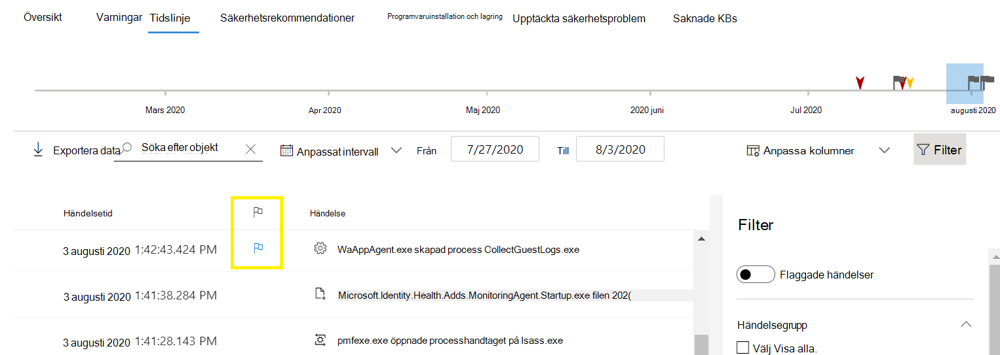

# Händelseflaggor i Microsoft Defender för slutpunktsenhetstidMicrosoft Defender for Endpoint device timeline event flags

[!INCLUDE [Microsoft 365 Defender rebranding](../../includes/microsoft-defender.md)]

**Gäller för:****Applies to:**
- [Microsoft Defender för EndpointMicrosoft Defender for Endpoint](https://go.microsoft.com/fwlink/p/?linkid=2154037)
- [Microsoft 365 DefenderMicrosoft 365 Defender](https://go.microsoft.com/fwlink/?linkid=2118804)

>Vill du använda Defender för Slutpunkt?Want to experience Defender for Endpoint? [Registrera dig för en kostnadsfri utvärderingsversion.Sign up for a free trial.](https://www.microsoft.com/microsoft-365/windows/microsoft-defender-atp?ocid=docs-wdatp-assignaccess-abovefoldlink)

Med händelseflaggor i Defender för slutpunktsenhetens tidslinje får du hjälp att filtrera och ordna specifika händelser när du undersöker potentiella attacker.Event flags in the Defender for Endpoint device timeline help you filter and organize specific events when you're  investigate potential attacks.

Defender för Endpoint-enhetens tidslinje ger en kronologisk vy av händelserna och tillhörande aviseringar som observeras på en enhet.The Defender for Endpoint device timeline provides a chronological view of the events and associated alerts observed on a device. Den här listan med händelser ger full insyn i händelser, filer och IP-adresser som observerats på enheten.This list of events provides full visibility into any events, files, and IP addresses observed on the device. Listan kan ibland vara lång.The list can sometimes be lengthy. Med händelseflaggor på enhetstidslinjen kan du hålla reda på händelser som kan vara relaterade.Device timeline event flags help you track events that could be related. 

När du har gått igenom en tidslinje på en enhet kan du sortera, filtrera och exportera specifika händelser som du har flaggat.After you've gone through a device timeline, you can sort, filter, and export the specific events that you flagged.

När du navigerar på enhetens tidslinje kan du söka efter och filtrera efter specifika händelser.While navigating the device timeline, you can search and filter for specific events. Du kan ange händelseflaggor genom att:You can set event flags by: 

- Markera de viktigaste händelsernaHighlighting the most important events 
- Markera händelser som kräver djupdykningMarking events that requires deep dive 
- Skapa en tidslinje med ett rent intrångBuilding a clean breach timeline

## Flagga en händelseFlag an event
1. Hitta den händelse som du vill flaggaFind the event that you want to flag
2. Klicka på flaggikonen i kolumnen Flagga.Click the flag icon in the Flag column. 

## Visa flaggade händelserView flagged events  
1. Aktivera Flaggade **händelser** i avsnittet **Filter på tidslinjen.**In the timeline **Filters** section, enable **Flagged events**.
2. Klicka på **Använd**.Click **Apply**. Endast flaggade händelser visas.Only flagged events are displayed.
Du kan tillämpa ytterligare filter genom att klicka på tidsstapeln.You can apply additional filters by clicking on the time bar. Då visas bara händelser före den flaggade händelsen.This will only show events prior to the flagged event.  

