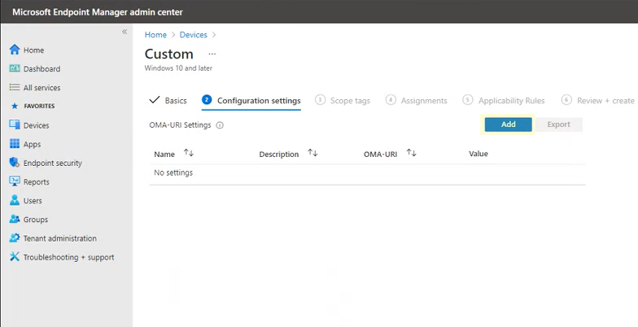

# <a name="enable-attack-surface-reduction-rules"></a>Aktivera regler för minskning av attackytan

**Gäller för:**

- [Microsoft Defender för Endpoint](https://go.microsoft.com/fwlink/p/?linkid=2154037)
- [Microsoft 365 Defender](https://go.microsoft.com/fwlink/?linkid=2118804)

> [!TIP]
> Vill du använda Defender för Slutpunkt? [Registrera dig för en kostnadsfri utvärderingsversion](https://www.microsoft.com/microsoft-365/windows/microsoft-defender-atp?ocid=docs-wdatp-assignaccess-abovefoldlink).

[Minskningsregler för attackytor](attack-surface-reduction.md) (ASR-regler) hjälper till att förhindra åtgärder som ofta används för missbruk av skadlig programvara för att avslöja enheter och nätverk.

## <a name="requirements"></a>Krav

Funktioner för att minska attackytan i Windows versioner

Du kan ange minskningsregler för attackytan för enheter som kör någon av följande utgåvor och versioner av Windows:

- Windows 10 Pro, version [1709](/windows/whats-new/whats-new-windows-10-version-1709) eller senare
- Windows 10 Enterprise, version [1709](/windows/whats-new/whats-new-windows-10-version-1709) eller senare
- Windows Server, [version 1803 (Halvårskanal)](/windows-server/get-started/whats-new-in-windows-server-1803) eller senare
- [Windows Server 2019](/windows-server/get-started-19/whats-new-19)

Om du vill använda hela funktionsuppsättningen för minskningsregler för attackytan behöver du:

- Windows Defender Antivirus som primärt AV (realtidsskydd på)
- [Molnleveransskydd på](https://docs.microsoft.com/windows/security/threat-protection/microsoft-defender-antivirus/enable-cloud-protection-microsoft-defender-antivirus) (vissa regler kräver det)
- Windows 10 Enterprise E5- eller E3-licens Microsoft 365 Företagslicens

Även om minskningsregler för attackytan inte kräver en [Windows E5-licens](/windows/deployment/deploy-enterprise-licenses), med en Windows E5-licens, får du avancerade hanteringsfunktioner, inklusive övervakning, analys och arbetsflöden som är tillgängliga i Defender för Slutpunkt, samt rapporterings- och konfigurationsfunktioner i Microsoft 365 säkerhetscenter. Dessa avancerade funktioner är inte tillgängliga med en E3-licens, men du kan fortfarande använda Loggboken för att granska händelser för attackytans minskning av regler.

Varje ASR-regel innehåller en av fyra inställningar:

- **Inte konfigurerad:** Inaktivera ASR-regeln
- **Block:** Aktivera ASR-regeln
- **Granskning:** Utvärdera hur ASR-regeln skulle påverka organisationen om den skulle aktiveras
- **Varna**: Aktivera ASR-regeln men tillåta slutanvändaren att kringgå blocket

> [!IMPORTANT]
> För närvarande stöds inte varningsläge för tre ASR-regler när du konfigurerar ASR-regler i Microsoft Endpoint Manager (MEM). Mer information finns i [Fall där varningsläge inte stöds.](attack-surface-reduction.md#cases-where-warn-mode-is-not-supported)

Vi rekommenderar starkt att du använder ASR-regler med en Windows E5-licens (eller liknande licens-SKU) för att dra nytta av de avancerade funktioner för övervakning och rapportering som finns tillgängliga i [Microsoft Defender](microsoft-defender-endpoint.md) för slutpunkt (Defender för slutpunkt). Men om du har en annan licens, till exempel Windows Professional eller Windows E3 som inte innehåller avancerade funktioner för övervakning och rapportering, kan du utveckla egna övervaknings- och rapporteringsverktyg ovanpå händelser som genereras vid varje slutpunkt när ASR-regler utlöses (till exempel Vidarebefordran av händelse).

> [!TIP]
> Mer information om Windows finns i [Windows 10 licensiering](https://www.microsoft.com/licensing/product-licensing/windows10?activetab=windows10-pivot:primaryr5) och få [volymlicensieringsguiden för Windows 10](https://download.microsoft.com/download/2/D/1/2D14FE17-66C2-4D4C-AF73-E122930B60F6/Windows-10-Volume-Licensing-Guide.pdf).

Du kan aktivera minskningsregler för attackytan med någon av följande metoder:

- [Microsoft Intune](#intune)
- [Hantering av mobila enheter (MDM)](#mdm)
- [Microsoft Endpoint Configuration Manager](#microsoft-endpoint-configuration-manager)
- [Grupprincip](#group-policy)
- [PowerShell](#powershell)

Hantering på företagsnivå, till exempel Intune eller Microsoft Endpoint Manager, rekommenderas. Hantering på företagsnivå skriver över eventuella grupprincipinställningar eller PowerShell-inställningar som är i konflikt vid start.

## <a name="exclude-files-and-folders-from-asr-rules"></a>Undanta filer och mappar från ASR-regler

Du kan utesluta filer och mappar från att utvärderas av de flesta minskningsregler för attackytor. Det innebär att även om en ASR-regel bestämmer att filen eller mappen innehåller skadligt beteende blockerar den inte filen från att köras. Det kan potentiellt tillåta att osäkra filer körs och smittar dina enheter.

Du kan även utesluta ASR-regler från utlösare baserat på certifikat och filshashar genom att tillåta angiven Defender för Slutpunktsfil och certifikatindikatorer. (Se [Hantera indikatorer](manage-indicators.md).)

> [!IMPORTANT]
> Att utesluta filer eller mappar kan allvarligt minska skyddet som ges av ASR-regler. Undantagna filer tillåts köras och ingen rapport eller händelse registreras.
> Om ASR-reglerna identifierar filer som du inte anser ska identifieras bör du först använda granskningsläge [för att testa regeln.](evaluate-attack-surface-reduction.md)

Du kan ange enskilda filer eller mappar (med hjälp av mappsökvägar eller fullständigt kvalificerade resursnamn), men du kan inte ange vilka regler undantagen ska gälla för. Ett undantag tillämpas endast när det undantagna programmet eller tjänsten startas. Om du till exempel lägger till ett undantag för en uppdateringstjänst som redan körs fortsätter uppdateringstjänsten att utlösa händelser tills tjänsten stoppas och startas om.

ASR-regler stöder miljövariabler och jokertecken. Information om hur du använder jokertecken finns i Använda jokertecken i listorna filnamn och [mappsökväg eller undantag för filnamnstillägg.](configure-extension-file-exclusions-microsoft-defender-antivirus.md#use-wildcards-in-the-file-name-and-folder-path-or-extension-exclusion-lists)

Följande procedurer för att aktivera ASR-regler innehåller instruktioner för hur du utesluter filer och mappar.

## <a name="intune"></a>Intune

1. Välj **Profiler för**  >  **enhetskonfiguration**. Välj en befintlig profil för slutpunktsskydd eller skapa en ny. Om du vill skapa en ny väljer du **Skapa profil och** anger information om den här profilen. För **Profiltyp** väljer du **Slutpunktsskydd**. Om du har valt en befintlig profil väljer du **Egenskaper** och sedan **Inställningar**.

2. I fönstret **Slutpunktsskydd** väljer du **Windows Defender Exploit Guard** och sedan Attack Surface **Reduction.** Välj önskad inställning för varje ASR-regel.

3. Ange **enskilda filer och mappar** under Undantag för minskning av attackytan. Du kan också välja **Importera om du** vill importera en CSV-fil som innehåller filer och mappar som ska undantas från ASR-regler. Varje rad i CSV-filen ska vara formaterad på följande sätt:

   `C:\folder`, `%ProgramFiles%\folder\file`, `C:\path`

4. Välj **OK** i de tre konfigurationsrutorna. Välj sedan **Skapa** om du skapar en ny slutpunktsskyddsfil eller **Spara** om du redigerar en befintlig.

## <a name="mem"></a>MEM

Du kan använda Microsoft Endpoint Manager (MEM) OMA-URI för att konfigurera anpassade ASR-regler. I följande procedur används regeln [Blockera missbruk av utnyttjas sårbara signerade drivrutiner](attack-surface-reduction.md#block-abuse-of-exploited-vulnerable-signed-drivers) för exemplet.

1. Öppna administrationscentret Microsoft Endpoint Manager (MEM). På **Start-menyn** klickar du  **på Enheter**, väljer **Konfigurationsprofil** och klickar sedan **på Skapa profil**.

   > [!div class="mx-imgBorder"]
   > 

2. Välj **följande i** följande två listlistor i Skapa en profil:

   - I **Plattform** väljer du **Windows 10 och senare**
   - I **Profiltyp** väljer du **Mallar**

   Välj **Anpassad** och klicka sedan på **Skapa**.

   > [!div class="mx-imgBorder"]
   > 

3. Verktyget Anpassad mall öppnas och visar grunderna **i steg 1.** I **1 Basics**, i **Name** anger du ett namn på mallen och i **Beskrivning** kan du skriva en beskrivning (valfritt).

   > [!div class="mx-imgBorder"]
   > 

4. Klicka **Nästa**. Steg **2 Konfigurationsinställningar** öppnas. Om du vill använda OMA-URI Inställningar du på **Lägg till.** Nu visas två alternativ: **Lägg till** och **Exportera.**

   > [!div class="mx-imgBorder"]
   > 

5. Klicka **på Lägg till** igen. Lägg **till rad OMA-URI Inställningar** rad. Gör **följande i** Lägg till rad:

   - Ange **ett** namn för regeln i Namn.
   - Skriv **en** kort beskrivning i Beskrivning.
   - I **OMA-URI** skriver eller klistrar du in den specifika OMA-URI-länken för regeln som du lägger till.
   - I **Datatyp** väljer du **Sträng**.
   - I **Värde** skriver eller klistrar du in GUID-värdet, tecknet och värdet Tillstånd utan \= blanksteg _(GUID=StateValue)._ Var: {0: Inaktivera (inaktivera ASR-regeln)}, {1 : Blockera (aktivera ASR-regeln)}, {2: Granska (Utvärdera hur ASR-regeln skulle påverka din organisation om den skulle aktiveras)}, {6: Varna (Aktivera ASR-regeln men tillåta slutanvändare att kringgå blockeringen)}

   > [!div class="mx-imgBorder"]
   > 

6. Klicka på **Spara**. **Lägg till rad** stängs. Klicka **på** Nästa i **Anpassad.** I steg **3 Omfattningstaggar** är omfattningstaggar valfria. Gör något av följande:

   - Klicka **på Välj omfattningstaggar**, välj omfattningstaggen (valfritt) och klicka sedan på **Nästa.**
   - Eller klicka på **Nästa**

7. I steg **4 Tilldelningar**, i Inkluderade **grupper** - för de grupper som du vill att regeln ska gälla - välj bland följande alternativ:

   - **Lägga till grupper**
   - **Lägga till alla användare**
   - **Lägg till alla enheter**

   > [!div class="mx-imgBorder"]
   > 

8. Markera **de grupper** som du vill utesluta från regeln i Undantagna grupper och klicka sedan på **Nästa.**

9. I steg **5 Tillämplighetsregler** för följande inställningar gör du följande:

   - I **Regel** väljer du **antingen Tilldela profil** om , eller Tilldela inte profil **om**
   - I **Egenskap** väljer du den egenskap som du vill att regeln ska gälla för
   - I **Värde** anger du tillämplig värde eller värdeintervall

   > [!div class="mx-imgBorder"]
   > 

10. Klicka **Nästa**. I steg **6 Granska + skapa** granskar du de inställningar och den information du har valt och angett och klickar sedan på **Skapa**.

    > [!div class="mx-imgBorder"]
    > 

    > [!NOTE]
    > Reglerna är aktiva och finns inom några minuter.

>[!NOTE]
> Konflikthantering:
>
> Om du tilldelar en enhet två olika ASR-principer, hanteras konflikterna på regler som har tilldelats olika tillstånd, det finns ingen hantering av konflikter och resultatet är ett fel.
>
> Regler som inte är i konflikt resulterar inte i fel och regeln tillämpas korrekt. Resultatet är att den första regeln tillämpas och efterföljande regler som inte är i konflikt slås ihop med principen.

## <a name="mdm"></a>MDM

Använd [./Vendor/MSFT/Policy/Config/Defender/AttackSurfaceReductionRules](/windows/client-management/mdm/policy-csp-defender#defender-attacksurfacereductionrules) configuration service provider (CSP) för att individuellt aktivera och ställa in läget för varje regel.

Följande är ett exempel för referens där [GUID-värden för ASR-regler används.](attack-surface-reduction.md#attack-surface-reduction-rules)

`OMA-URI path: ./Vendor/MSFT/Policy/Config/Defender/AttackSurfaceReductionRules`

`Value: 75668C1F-73B5-4CF0-BB93-3ECF5CB7CC84=2|3B576869-A4EC-4529-8536-B80A7769E899=1|D4F940AB-401B-4EfC-AADC-AD5F3C50688A=2|D3E037E1-3EB8-44C8-A917-57927947596D=1|5BEB7EFE-FD9A-4556-801D-275E5FFC04CC=0|BE9BA2D9-53EA-4CDC-84E5-9B1EEEE46550=1`

Värdena som du aktiverar (blockera), inaktiverar, varnar eller aktiverar i granskningsläge är:

- 0: Inaktivera (Inaktivera ASR-regeln)
- 1: Blockera (aktivera ASR-regeln)
- 2: Granska (Utvärdera hur ASR-regeln skulle påverka organisationen om den skulle aktiveras)
- 6: Varna (aktivera ASR-regeln men tillåt slutanvändaren att kringgå blocket). Varningsläge är nu tillgängligt för de flesta ASR-regler.

Använd [./Vendor/MSFT/Policy/Config/Defender/AttackSurfaceReductionOnlyExclusions-konfigurationstjänsten](/windows/client-management/mdm/policy-csp-defender#defender-attacksurfacereductiononlyexclusions) (CSP) för att lägga till undantag.

Exempel:

`OMA-URI path: ./Vendor/MSFT/Policy/Config/Defender/AttackSurfaceReductionOnlyExclusions`

`Value: c:\path|e:\path|c:\Exclusions.exe`

> [!NOTE]
> Se till att ange OMA-URI-värden utan blanksteg.

## <a name="microsoft-endpoint-configuration-manager"></a>Microsoft Endpoint Configuration Manager

1. I Microsoft Endpoint Configuration Manager går du till **Tillgångar och Endpoint Protection** Windows Defender Exploit  >    >  **Guard.**

2. Välj **Home**  >  **Create Exploit Guard-policy**.

3. Ange ett namn och en beskrivning, välj **Attack Surface Reduction** och välj **Nästa**.

4. Välj vilka regler som ska blockera eller granska åtgärder och välj **Nästa.**

5. Granska inställningarna och välj **Nästa för** att skapa principen.

6. När principen har skapats stänger **du**.

## <a name="group-policy"></a>Grupprincip

> [!WARNING]
> Om du hanterar dina datorer och enheter med Intune, Konfigurationshanteraren eller någon annan hanteringsplattform på företagsnivå skriver hanteringsprogramvaran över eventuella grupprincipinställningar som står i konflikt vid start.

1. På datorn för hantering av grupprinciper öppnar du [konsolen Grupprinciphantering](https://technet.microsoft.com/library/cc731212.aspx), högerklickar på det grupprincipobjekt som du vill konfigurera och väljer **Redigera**.

2. I **Redigeraren för grupprinciphantering** går du till **Datorkonfiguration** och väljer **Administrativa mallar**.

3. Expandera trädet för att **Windows komponenter Microsoft Defender Antivirus**  >    >  **Microsoft Defender Exploit Guard**  >  **minska attackytan.**

4. Välj **Konfigurera minskningsregler för attackytan** och välj **Aktiverad**. Sedan kan du ange enskilda tillstånd för varje regel i alternativavsnittet.

   Välj **Visa...** och ange regel-ID i **kolumnen Värdenamn** och ditt valda tillstånd **i kolumnen Värde** enligt följande:

   - 0: Inaktivera (Inaktivera ASR-regeln)
   - 1: Blockera (aktivera ASR-regeln)
   - 2: Granska (Utvärdera hur ASR-regeln skulle påverka organisationen om den skulle aktiveras)
   - 6: Varna (Aktivera ASR-regeln men tillåta slutanvändaren att kringgå blocket)

   :::image type="content" source="images/asr-rules-gp.png" alt-text="ASR-regler i grupprincip":::

5. Om du vill utesluta filer och  mappar från ASR-regler markerar du inställningen Exkludera filer och sökvägar från reglerna för att minska attackytan och ställer in alternativet **Aktiverad.** Välj **Visa** och ange varje fil eller mapp i **kolumnen Värdenamn.** Ange **0** i **värdekolumnen** för varje objekt.

   > [!WARNING]
   > Använd inte citattecken eftersom de inte stöds för antingen **värdenamnskolumnen** eller **värdekolumnen.**

## <a name="powershell"></a>PowerShell

> [!WARNING]
> Om du hanterar dina datorer och enheter med Intune, Konfigurationshanteraren eller en annan hanteringsplattform på företagsnivå skriver hanteringsprogramvaran över eventuella motstridande PowerShell-inställningar vid start. Om du vill låta användare definiera värdet med hjälp av PowerShell använder du alternativet "Användardefinierad" för regeln på hanteringsplattformen.

1. Skriv **powershell** i Start-menyn, högerklicka på **Windows PowerShell** välj **Kör som administratör**.

2. Skriv in följande cmdlet:

    ```PowerShell
    Set-MpPreference -AttackSurfaceReductionRules_Ids <rule ID> -AttackSurfaceReductionRules_Actions Enabled
    ```

    Om du vill aktivera ASR-regler i granskningsläge använder du följande cmdlet:

    ```PowerShell
    Add-MpPreference -AttackSurfaceReductionRules_Ids <rule ID> -AttackSurfaceReductionRules_Actions AuditMode
    ```

    Om du vill aktivera ASR-regler i varningsläge använder du följande cmdlet:

    ```PowerShell
    Add-MpPreference -AttackSurfaceReductionRules_Ids <rule ID> -AttackSurfaceReductionRules_Actions Warn
    ```

    Använd följande cmdlet för att aktivera ASR Blockera missbruk av utnyttjas sårbara signerade drivrutiner:

   ```PowerShell
   Add-MpPreference -AttackSurfaceReductionRules_Ids 56a863a9-875e-4185-98a7-b882c64b5ce5 -AttackSurfaceReductionRules_Actions Enabled
   ```

    Om du vill inaktivera ASR-regler använder du följande cmdlet:

    ```PowerShell
    Add-MpPreference -AttackSurfaceReductionRules_Ids <rule ID> -AttackSurfaceReductionRules_Actions Disabled
    ```

    > [!IMPORTANT]
    > Du måste ange en delstat individuellt för varje regel, men du kan kombinera regler och tillstånd i en kommaavgränsad lista.
    >
    > I följande exempel aktiveras de två första reglerna, den tredje regeln inaktiveras och den fjärde regeln aktiveras i granskningsläge:
    >
    > ```PowerShell
    > Set-MpPreference -AttackSurfaceReductionRules_Ids <rule ID 1>,<rule ID 2>,<rule ID 3>,<rule ID 4> -AttackSurfaceReductionRules_Actions Enabled, Enabled, Disabled, AuditMode
    > ```

    Du kan också använda `Add-MpPreference` PowerShell-verbet för att lägga till nya regler i den befintliga listan.

    > [!WARNING]
    > `Set-MpPreference` kommer alltid att skriva över den befintliga uppsättningen regler. Om du vill lägga till i den befintliga uppsättningen använder du `Add-MpPreference` istället.
    > Du kan få en lista över regler och deras aktuella status med hjälp av `Get-MpPreference` .

3. Om du vill utesluta filer och mappar från ASR-regler använder du följande cmdlet:

    ```PowerShell
    Add-MpPreference -AttackSurfaceReductionOnlyExclusions "<fully qualified path or resource>"
    ```

    Fortsätt att använda `Add-MpPreference -AttackSurfaceReductionOnlyExclusions` för att lägga till fler filer och mappar i listan.

    > [!IMPORTANT]
    > Används `Add-MpPreference` för att lägga till eller lägga till appar i listan. Med `Set-MpPreference` hjälp av cmdleten skriver du över den befintliga listan.

## <a name="related-articles"></a>Relaterade artiklar

- [Minska attackytor med minskningsregler för attackytan](attack-surface-reduction.md)

- [Utvärdera minskning av attackytan](evaluate-attack-surface-reduction.md)

- [Vanliga frågor och svar för minskning av attackytan](attack-surface-reduction.md)
