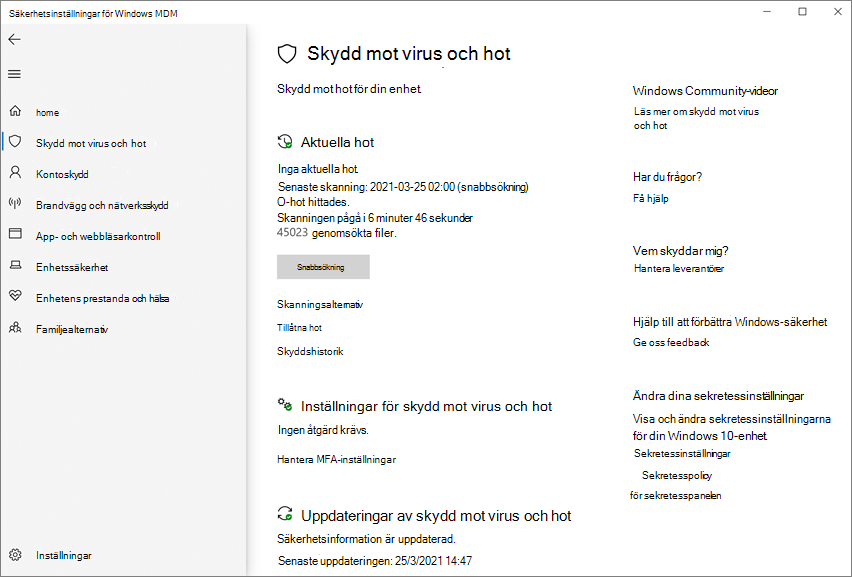

# <a name="turn-on-cloud-delivered-protection"></a>Aktivera molnbaserat skydd

[!INCLUDE [Microsoft 365 Defender rebranding](../../includes/microsoft-defender.md)]

**Gäller för:**

- [Microsoft Defender för Endpoint](/microsoft-365/security/defender-endpoint/)

> [!NOTE]
> Den Microsoft Defender Antivirus molntjänsten är en mekanism för att tillhandahålla uppdaterat skydd till nätverket och slutpunkterna. Även om den kallas för en molntjänst är den inte bara skydd för filer som lagras i molnet. I stället används distribuerade resurser och maskininlärning för att ge skydd till dina slutpunkter i en takt som är mycket snabbare än traditionella säkerhetsintelligensuppdateringar.

Microsoft Defender Antivirus använder flera identifierings- och skyddstekniker för att ge korrekt, realtids- och intelligent skydd. [Lär känna de avancerade teknikerna som ligger till grund för nästa](https://www.microsoft.com/security/blog/2019/06/24/inside-out-get-to-know-the-advanced-technologies-at-the-core-of-microsoft-defender-atp-next-generation-protection/)generations skydd för Microsoft Defender för slutpunkt.
  

Du kan aktivera Microsoft Defender Antivirus eller inaktivera moln levererat-skydd på flera olika sätt:

- Microsoft Intune
- Microsoft Endpoint Manager
- Grupprincip
- PowerShell-cmdlets.

 Du kan också aktivera eller inaktivera det i enskilda klienter med Windows-säkerhet program.

Se [Använda Microsoft moln levererat skydd för](cloud-protection-microsoft-defender-antivirus.md) en översikt över Microsoft Defender Antivirus moln levererat skydd.

Mer information om specifika nätverksanslutningskrav för att säkerställa att slutpunkterna kan ansluta till den molnbaserade skyddstjänsten finns i [Konfigurera och verifiera nätverksanslutningar.](configure-network-connections-microsoft-defender-antivirus.md)

> [!NOTE]
> I Windows 10 finns det ingen skillnad mellan **rapportalternativen Grundläggande** och **Avancerat** som beskrivs i det här avsnittet. Det här är en äldre skillnad och om du väljer en av inställningarna får du samma nivå av moln levererat skydd. Det är ingen skillnad på vilken typ av information och hur mycket information som delas. Mer information om vad vi samlar in finns i [Microsofts sekretesspolicy.](https://go.microsoft.com/fwlink/?linkid=521839)

## <a name="use-intune-to-turn-on-cloud-delivered-protection"></a>Använda Intune för att aktivera moln levererat skydd

1. Gå till Microsoft Endpoint Manager administrationscenter ( [https://endpoint.microsoft.com](https://endpoint.microsoft.com) ) och logga in.

2. I fönstret **Start** väljer du **Enhetskonfiguration > Profiler**.

3. Välj den **profiltyp för** Enhetsbegränsningar som du vill konfigurera. Om du behöver skapa en ny **profiltyp för Enhetsbegränsningar** kan du gå [till Konfigurera inställningar för enhetsbegränsningar i Microsoft Intune](/intune/device-restrictions-configure).

4. Välj   >  **Konfigurationsinställningar för egenskaper:**  >  **Redigera Microsoft Defender Antivirus**.

5. På **växeln Moln levererat skydd** väljer du **Aktivera**.

6. I **listrutan Fråga användarna före** exempelinskickning väljer du Skicka alla data **automatiskt.**

Mer information om Intune-enhetsprofiler, bland annat hur du skapar och konfigurerar deras inställningar, finns i [Vad är Microsoft Intune enhetsprofiler?](/intune/device-profiles)

## <a name="use-microsoft-endpoint-manager-to-turn-on-cloud-delivered-protection"></a>Använd Microsoft Endpoint Manager för att aktivera moln levererat skydd

1. Gå till Microsoft Endpoint Manager administrationscenter ( [https://endpoint.microsoft.com](https://endpoint.microsoft.com) ) och logga in.

2. Välj **Endpoint Security**  >  **Antivirus**.

3. Välj en antivirusprofil. (Om du inte redan har en, eller om du vill skapa en ny profil, se Konfigurera inställningar för enhetsbegränsning [i Microsoft Intune](/intune/device-restrictions-configure).

4. Välj **Egenskaper**. Välj sedan Redigera bredvid **Konfigurationsinställningar.** 

5. Expandera **Molnskydd** och välj sedan **något** av följande i listan Moln levererat skyddsnivå:
   - **Hög:** Använder en stark identifieringsnivå.
   - **Hög plus:** Använder **högnivån** och tillämpar ytterligare skyddsåtgärder (kan påverka klientprestandan).
   - **Nollarvering**: Blockerar alla okända körbara filer.

6. Välj **Granska + spara** och välj sedan **Spara.**

Mer information om konfigurering av Microsoft Endpoint Configuration Manager finns i Skapa och distribuera principer för skydd mot [skadlig programvara: Molnskyddstjänst](/configmgr/protect/deploy-use/endpoint-antimalware-policies#cloud-protection-service).

## <a name="use-group-policy-to-turn-on-cloud-delivered-protection"></a>Använda grupprinciper för att aktivera moln levererat skydd

1. Öppna grupprinciphanteringskonsolen på [](/previous-versions/windows/it-pro/windows-server-2008-R2-and-2008/cc731212(v=ws.11))din enhet för grupprinciphantering, högerklicka på det grupprincipobjekt du vill konfigurera och välj **Redigera.**

2. Gå till **Datorkonfiguration i redigeraren** för **grupprinciphantering.**

3. Välj **Administrativa mallar**.

4. Expandera trädet för att **Windows komponenter > Microsoft Defender Antivirus > KARTOR**

5. Dubbelklicka på Anslut **till Microsoft MAPS.** Kontrollera att alternativet är aktiverat och inställt på **Grundläggande KARTOR** eller **Avancerade KARTOR.** Välj **OK**.

6. Dubbelklicka på Skicka **filexempel när ytterligare analys krävs**. Kontrollera att det första alternativet är **inställt på Aktiverad** och att de andra alternativen är inställda på något av följande:

    1. **Skicka säkra exempel** (1)
    2. **Skicka alla exempel** (3)

        >[!NOTE]
        > Alternativet **Skicka säkra exempel** (1) innebär att de flesta urval kommer att skickas automatiskt. Filer som troligtvis innehåller personlig information uppmanas fortfarande och kräver ytterligare bekräftelse.
        > Om du anger **alternativet Fråga** alltid (0) sänks skyddstillståndet för enheten. Om du ställer **in det på** Skicka aldrig (2) innebär det att funktionen [Blockera](configure-block-at-first-sight-microsoft-defender-antivirus.md) vid första synning i Microsoft Defender för slutpunkt inte fungerar.

7. Välj **OK**.

## <a name="use-powershell-cmdlets-to-turn-on-cloud-delivered-protection"></a>Använda PowerShell-cmdlets för att aktivera moln levererat skydd

Följande cmdlets kan aktivera moln levererat skydd:

```PowerShell
Set-MpPreference -MAPSReporting Advanced
Set-MpPreference -SubmitSamplesConsent SendAllSamples
```

Mer information om hur du använder PowerShell med Microsoft Defender Antivirus finns i Använda [PowerShell-cmdlets](use-powershell-cmdlets-microsoft-defender-antivirus.md) för att konfigurera och köra Microsoft Defender Antivirus- och [Defender-cmdlets.](/powershell/module/defender/) [Policy CSP – Defender](/windows/client-management/mdm/policy-csp-defender) har också mer information specifikt om [-SubmitSamplesConsent.](/windows/client-management/mdm/policy-csp-defender#defender-submitsamplesconsent)

>[!NOTE]
> Du kan också **ange -SubmitSamplesConsent** `SendSafeSamples` till (standardinställningen), `NeverSend` eller `AlwaysPrompt` . Inställningen `SendSafeSamples` innebär att de flesta exempel skickas automatiskt. Filer som troligtvis innehåller personlig information uppmanas fortfarande och kräver ytterligare bekräftelse.

>[!WARNING]
> Inställning **-SubmitSamplesConsent** till `NeverSend` eller `AlwaysPrompt` sänker skyddsnivån för enheten. Om du sätter den till `NeverSend` innebär det också att funktionen Blockera vid första synning [i](configure-block-at-first-sight-microsoft-defender-antivirus.md) Microsoft Defender för Slutpunkt inte fungerar.

## <a name="use-windows-management-instruction-wmi-to-turn-on-cloud-delivered-protection"></a>Använd Windows management instruction (WMI) för att aktivera moln levererat skydd

Använd [ **metoden** Set för **MSFT_MpPreference**](/previous-versions/windows/desktop/defender/set-msft-mppreference) för följande egenskaper:

```WMI
MAPSReporting
SubmitSamplesConsent
```

Mer information om tillåtna parametrar finns i Windows Defender [WMIv2-API:er](/previous-versions/windows/desktop/defender/windows-defender-wmiv2-apis-portal)

## <a name="turn-on-cloud-delivered-protection-on-individual-clients-with-the-windows-security-app"></a>Aktivera moln levererat skydd på enskilda klienter med Windows-säkerhet program

> [!NOTE]
> Om inställningen Konfigurera lokal åsidosättning för rapportering av Grupprincip för  **Microsoft MAPS** är inställd på Inaktiverad kommer den molnbaserade skyddsinställningen i Windows Inställningar att vara nedtonad och otillgänglig. Ändringar som görs via ett grupprincipobjekt måste först distribueras till enskilda slutpunkter innan inställningen uppdateras i Windows Inställningar.

1. Öppna Windows-säkerhet genom att välja sköldikonen i aktivitetsfältet eller genom att söka efter Defender på **startmenyn.**

2. Välj panelen **&** för skydd mot hot (eller sköldikonen på den vänstra menyraden) och sedan & för skydd **mot** hot:

    

3. Kontrollera att **molnbaserat skydd och automatisk** **exempelinskickning** är på **.**

> [!NOTE]
> Om automatisk exempelinskickning har konfigurerats med Grupprincip kommer inställningen att vara nedtonad och otillgänglig.

## <a name="related-articles"></a>Relaterade artiklar

- [Konfigurera tidsgräns för blockering i molnet](configure-cloud-block-timeout-period-microsoft-defender-antivirus.md)
- [Konfigurera blocket vid första synen](configure-block-at-first-sight-microsoft-defender-antivirus.md)
- [Använd cmdlets från PowerShell för att hantera Microsoft Defender Antivirus](use-powershell-cmdlets-microsoft-defender-antivirus.md)
- [Skydda Windows datorer med Endpoint Protection för Microsoft Intune](/intune/deploy-use/help-secure-windows-pcs-with-endpoint-protection-for-microsoft-intune)]
- [Defender-cmdlets](/powershell/module/defender/)
- [Använd Microsoft moln levererat skydd i Microsoft Defender Antivirus](cloud-protection-microsoft-defender-antivirus.md)
- [Så här skapar och distribuerar du skydd mot skadlig programvara: Molnskyddstjänst](/configmgr/protect/deploy-use/endpoint-antimalware-policies#cloud-protection-service)
- [Microsoft Defender Antivirus i Windows 10](microsoft-defender-antivirus-in-windows-10.md)
