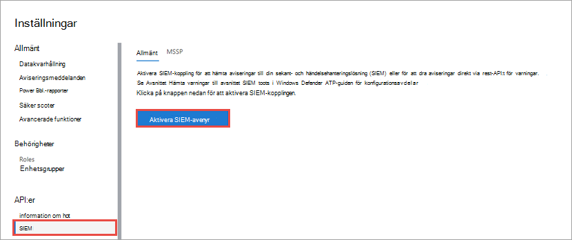
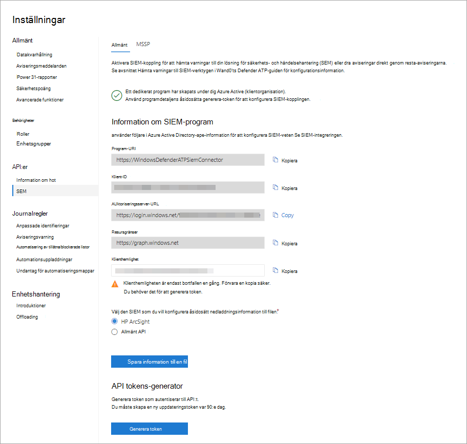

# Aktivera SIEM-integrering i Microsoft Defender för SlutpunktEnable SIEM integration in Microsoft Defender for Endpoint

[!INCLUDE [Microsoft 365 Defender rebranding](../../includes/microsoft-defender.md)]

**Gäller för:****Applies to:**
- [Microsoft Defender för EndpointMicrosoft Defender for Endpoint](https://go.microsoft.com/fwlink/?linkid=2154037)

>Vill du uppleva Microsoft Defender för Slutpunkt?Want to experience Microsoft Defender for Endpoint? [Registrera dig för en kostnadsfri utvärderingsversion.Sign up for a free trial.](https://www.microsoft.com/microsoft-365/windows/microsoft-defender-atp?ocid=docs-wdatp-enablesiem-abovefoldlink) 

Aktivera integrering av säkerhetsinformation och händelsehantering (SIEM) så att du kan hämta identifieringar Microsoft Defender Säkerhetscenter.Enable security information and event management (SIEM) integration so you can pull detections from Microsoft Defender Security Center. Dra identifieringar med hjälp av din SIEM-lösning eller genom att ansluta direkt till identifieringarna REST API.Pull detections using your SIEM solution or by connecting directly to the detections REST API.

>[!NOTE]
>- [Microsoft Defender för slutpunktsavisering](alerts.md) består av en eller flera identifieringar.[Microsoft Defender for Endpoint Alert](alerts.md) is composed from one or more detections.
>- [Microsoft Defender för identifiering av slutpunkt](api-portal-mapping.md) består av den misstänkta händelsen som inträffade på enheten och tillhörande aviseringsinformation.[Microsoft Defender for Endpoint Detection](api-portal-mapping.md) is composed from the suspicious event occurred on the Device and its related Alert details.
>- Microsoft Defender för slutpunktsaviserings-API är det senaste API:t för aviseringsanvändning och innehåller en detaljerad lista med relaterade bevis för varje avisering.The Microsoft Defender for Endpoint Alert API is the latest API for alert consumption and contain a detailed list of related evidence for each alert. Mer information finns i [Aviseringsmetoder och egenskaper](alerts.md) och [Listaviseringar.](get-alerts.md)For more information, see [Alert methods and properties](alerts.md) and [List alerts](get-alerts.md).

## FörutsättningarPrerequisites

- Den användare som aktiverar inställningen måste ha behörighet att skapa en app i Azure Active Directory (AAD).The user who activates the setting must have permissions to create an app in Azure Active Directory (AAD). Det här är någon med följande roller:This is someone with the following roles: 

  - Säkerhetsadministratör och antingen global administratörSecurity Administrator and either Global Administrator
  - Administratör för molnprogramCloud Application Administrator
  - ProgramadministratörApplication Administrator
  - Ägaren till tjänstens huvudnamnOwner of the service principal

- Under den första aktiveringen visas en popup-skärm där du kan lägga till autentiseringsuppgifter.During the initial activation, a pop-up screen is displayed for credentials to be entered. Se till att du tillåter popup-fönster för den här webbplatsen.Make sure that you allow pop-ups for this site.

## Aktivera SIEM-integreringEnabling SIEM integration 
1. I navigeringsfönstret väljer du **Inställningar**  >  **SIEM.**In the navigation pane, select **Settings** > **SIEM**.

    

    >[!TIP]
    >Om det uppstår ett fel när du försöker aktivera SIEM-kopplingsprogrammet kontrollerar du inställningarna för blockering av popup-fönster i webbläsaren.If you encounter an error when trying to enable the SIEM connector application, check the pop-up blocker settings of your browser. Det kan blockera det nya fönstret som öppnas när du aktiverar funktionen.It might be blocking the new window being opened when you enable the capability. 

2. Välj **Aktivera SIEM-integrering.**Select **Enable SIEM integration**. Detta aktiverar **informationsavsnittet** för SIEM-koppling med ifyllda värden och ett program skapas under Azure Active Directory (Azure AD) klientorganisation.This activates the **SIEM connector access details** section with pre-populated values and an application is created under your Azure Active Directory (Azure AD) tenant.

    > [!WARNING]
    >Klienthemligheten visas bara en gång.The client secret is only displayed once. Se till att spara en kopia av den på ett säkert ställe.Make sure you keep a copy of it in a safe place. 
     

    

3. Välj den SIEM-typ som du använder i organisationen.Choose the SIEM type you use in your organization.

   > [!NOTE]
   > Om du väljer HP ArcSight måste du spara de här två konfigurationsfilerna:If you select HP ArcSight, you'll need to save these two configuration files: 
   > - WDATP-connector.jsonparser.propertiesWDATP-connector.jsonparser.properties
   > - WDATP-connector.propertiesWDATP-connector.properties  

   Om du vill ansluta direkt till identifieringarna REST API via programmatisk åtkomst väljer du **Allmänt API.**If you want to connect directly to the detections REST API through programmatic access, choose **Generic API**.

4. Kopiera de enskilda värdena eller välj **Spara information till fil om** du vill ladda ned en fil som innehåller alla värden.Copy the individual values or select **Save details to file** to download a file that contains all the values.

5. Välj **Generera token för att** få en åtkomst- och uppdateringstoken.Select **Generate tokens** to get an access and refresh token.
  
   > [!NOTE]
   > Du måste skapa en ny Uppdateringstoken var 90:e dag.You'll need to generate a new Refresh token every 90 days. 

6. Följ instruktionerna för [att skapa en azure AD-appregistrering för Microsoft Defender](/microsoft-365/security/defender-endpoint/exposed-apis-create-app-webapp) för Endpoint och tilldela rätt behörigheter till den för att läsa aviseringar.Follow the instructions for [creating an Azure AD app registration for Microsoft Defender for Endpoint](/microsoft-365/security/defender-endpoint/exposed-apis-create-app-webapp) and assign the correct permissions to it to read alerts.

Du kan nu fortsätta med att konfigurera din SIEM-lösning eller ansluta till identifieringen av REST API via programmeringsåtkomst.You can now proceed with configuring your SIEM solution or connecting to the detections REST API through programmatic access. Du måste använda tokens när du konfigurerar din SIEM-lösning så att den kan ta emot identifieringar från Microsoft Defender Säkerhetscenter.You'll need to use the tokens when configuring your SIEM solution to allow it to receive detections from Microsoft Defender Security Center.

## Integrera Microsoft Defender för slutpunkt med IBM QRadarIntegrate Microsoft Defender for Endpoint with IBM QRadar 
Du kan konfigurera IBM QRadar att samla in identifieringar från Microsoft Defender för Endpoint.You can configure IBM QRadar to collect detections from Microsoft Defender for Endpoint. Mer information finns i [IBM Knowledge Center.](https://www.ibm.com/support/knowledgecenter/SS42VS_DSM/c_dsm_guide_MS_Win_Defender_ATP_overview.html?cp=SS42VS_7.3.1)For more information, see [IBM Knowledge Center](https://www.ibm.com/support/knowledgecenter/SS42VS_DSM/c_dsm_guide_MS_Win_Defender_ATP_overview.html?cp=SS42VS_7.3.1).

## Se ävenSee also
- [Konfigurera HP ArcSight att hämta Microsoft Defender för identifiering av slutpunkterConfigure HP ArcSight to pull Microsoft Defender for Endpoint detections](configure-arcsight.md)
- [Fälten Microsoft Defender för identifiering av slutpunktMicrosoft Defender for Endpoint Detection fields](api-portal-mapping.md)
- [Hämta Microsoft Defender för slutpunktsidentifiering med REST APIPull Microsoft Defender for Endpoint detections using REST API](pull-alerts-using-rest-api.md)
- [Felsöka problem med SIEM-verktygsintegreringTroubleshoot SIEM tool integration issues](troubleshoot-siem.md)
