# Microsoft Defender för utvärderingslabb med slutpunktMicrosoft Defender for Endpoint evaluation lab

[!INCLUDE [Microsoft 365 Defender rebranding](../../includes/microsoft-defender.md)]

**Gäller för:****Applies to:**
- [Microsoft Defender för EndpointMicrosoft Defender for Endpoint](https://go.microsoft.com/fwlink/?linkid=2154037)
- [Microsoft 365 DefenderMicrosoft 365 Defender](https://go.microsoft.com/fwlink/?linkid=2118804)

>Vill du uppleva Microsoft Defender för Slutpunkt?Want to experience Microsoft Defender for Endpoint? [Registrera dig för en kostnadsfri utvärderingsversion.Sign up for a free trial.](https://www.microsoft.com/microsoft-365/windows/microsoft-defender-atp?ocid=docs-wdatp-enablesiem-abovefoldlink)

Att genomföra en omfattande utvärdering av säkerhetsprodukter kan vara en komplex process som kräver krångliga miljöer och enhetskonfigurationer innan en helslutsattack simulering kan utföras.Conducting a comprehensive security product evaluation can be a complex process requiring cumbersome environment and device configuration before an end-to-end attack simulation can actually be done. Till komplexiteten läggs utmaningen att spåra var simuleringsaktiviteter, varningar och resultat återspeglas under utvärderingen.Adding to the complexity is the challenge of tracking where the simulation activities, alerts, and results are reflected during the evaluation.

Utvärderingslabb med Microsoft Defender för slutpunkter är utformat för att eliminera komplexiteten i konfigurationen av enheter och miljöer så att du kan fokusera på att utvärdera plattformens funktioner, köra simuleringar och se funktionerna för skydd, identifiering och åtgärder i praktiken.The Microsoft Defender for Endpoint evaluation lab is designed to eliminate the complexities of device and environment configuration so that you can  focus on evaluating the capabilities of the platform, running simulations, and seeing the prevention, detection, and remediation features in action.

> [!VIDEO https://www.microsoft.com/en-us/videoplayer/embed/RE4qLUM]

Med den förenklade uppsättningen kan du fokusera på att köra egna testscenarier och de färdiga simuleringarna och se hur Defender för Slutpunkt fungerar.With the simplified set-up experience, you can focus on running your own test scenarios and the pre-made simulations to see how Defender for Endpoint performs. 

Du har full tillgång till plattformens kraftfulla funktioner, som automatiska undersökningar, avancerad sökning och hotanalys, så att du kan testa den omfattande skyddsstacken som Defender för Slutpunkt erbjuder.You'll have full access to the powerful capabilities of the platform such as automated investigations, advanced hunting, and threat analytics, allowing you to test the comprehensive protection stack that Defender for Endpoint offers. 

Du kan lägga till Windows 10- eller Windows Server 2019-enheter som är förkonfigurerade så att de senaste os-versionerna och rätt säkerhetskomponenter och Office 2019 Standard är installerade.You can add Windows 10 or Windows Server 2019 devices that come pre-configured to have the latest OS versions and the right security components in place as well as Office 2019 Standard installed.

Du kan även installera hot.You can also install threat simulators. Defender för Endpoint har samarbetat med branschledande simuleringsplattformar för hot som hjälper dig att testa Defender för Slutpunkt-funktioner utan att behöva lämna portalen.Defender for Endpoint has partnered with industry leading threat simulation platforms to help you test out the Defender for Endpoint capabilities without having to leave the portal.

 Installera det du föredrar, kör scenarier i utvärderingslabbet och se direkt hur plattformen fungerar – allt finns tillgängligt utan extra kostnad för dig.Install your preferred simulator, run scenarios within the evaluation lab, and instantly see how the platform performs - all conveniently available at no extra cost to you. Du får också praktisk tillgång till ett brett utbud av simuleringar som du kan komma åt och köra från simuleringskatalogen.You'll also have convenient access to wide array of simulations which you can access and run from the simulations catalog.
    

## Innan du börjarBefore you begin
Du måste uppfylla licenskraven eller ha [utvärderingsåtkomst till](minimum-requirements.md#licensing-requirements) Microsoft Defender för Endpoint för att komma åt utvärderingslabbet.You'll need to fulfill the [licensing requirements](minimum-requirements.md#licensing-requirements) or have trial access to Microsoft Defender for Endpoint to access the evaluation lab.

Du måste ha **behörigheten Hantera säkerhetsinställningar** för att:You must have **Manage security settings** permissions to:
- Skapa labbetCreate the lab
- Skapa enheterCreate devices
- Återställa lösenordReset password
- Skapa simuleringarCreate simulations 
 
Om du har aktiverat rollbaserad åtkomstkontroll (RBAC) och skapat minst en datorgrupp, måste användarna ha åtkomst till Alla datorgrupper.If you enabled role-based access control (RBAC) and created at least a one machine group, users must have access to All machine groups.

Mer information finns i Skapa [och hantera roller.](user-roles.md)For more information, see [Create and manage roles](user-roles.md).

Vill du uppleva Microsoft Defender för Slutpunkt?Want to experience Microsoft Defender for Endpoint? [Registrera dig för en kostnadsfri utvärderingsversion.Sign up for a free trial.](https://www.microsoft.com/microsoft-365/windows/microsoft-defender-atp?ocid=docs-wdatp-main-abovefoldlink)

## Kom igång med labbetGet started with the lab
Du kan komma åt labbet från menyn.You can access the lab from the menu. I navigeringsmenyn väljer du **Utvärdering och självstudier > Utvärderingslabb.**In the navigation menu, select **Evaluation and tutorials > Evaluation lab**.

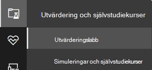

>[!NOTE]
>- Beroende på vilken typ av miljöstruktur du väljer blir enheter tillgängliga under det angivna antalet timmar från aktiveringsdagen.Depending the type of environment structure you select, devices will be available for the specified number of hours from the day of activation.
>- Varje miljö etableras med ett begränsat antal testenheter.Each environment is provisioned with a limited set of test devices. När du använt de etablerade enheterna tillhandahålls inga nya enheter.When you've used up the provisioned devices, no new devices are provided. En borttagna enhet uppdaterar inte antalet tillgängliga testenhet.A deleted device does not refresh the available test device count.
>- Du kan inte längre använda labbet när resurserna har använts upp.You can no longer use the lab when the resources have been used up. Den återställs inte eller uppdateras inte.It does not reset nor refresh.
>- Vi rekommenderar att du använder resurserna noggrant. Labbresurserna är begränsade.It is advisable to use the resources carefully.The lab resources are limited. De återställs inte eller uppdateras inte.They will not reset nor refresh. 

Har du redan ett labb?Already have a lab? Se till att aktivera de nya hoten och ha aktiva enheter.Make sure to enable the new threat simulators and have active devices.

## Konfigurera utvärderingslabbSetup the evaluation lab

1. Välj Utvärderings- och **självstudiekurser**  >  **Utvärderingslabb** i navigeringsfönstret och välj sedan **Installationslabb.**In the navigation pane, select **Evaluation and tutorials** > **Evaluation lab**, then select **Setup lab**.

    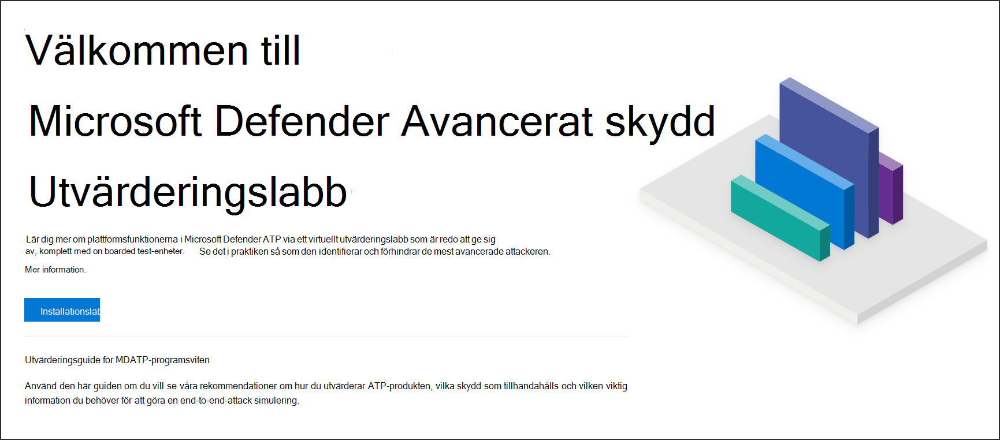

2. Beroende på dina utvärderingsbehov kan du välja att konfigurera en miljö med färre enheter under en längre period eller fler enheter under kortare tid.Depending on your evaluation needs, you can choose to setup an environment with fewer devices for a longer period or more devices for a shorter period. Välj önskad labkonfiguration och välj sedan **Nästa**.Select your preferred lab configuration then select **Next**.

    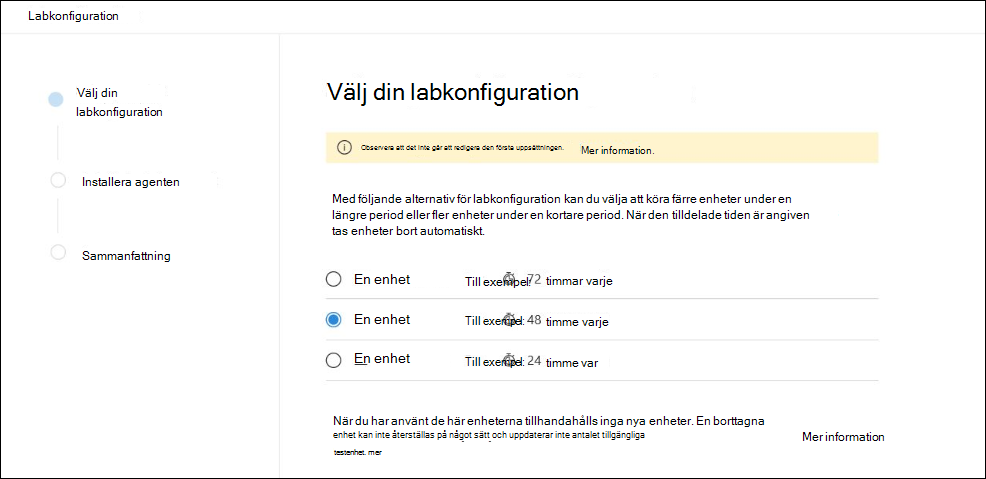 

3. (Valfritt) Du kan välja att installera hot i labbet.(Optional) You can choose to install threat simulators in the lab. 

    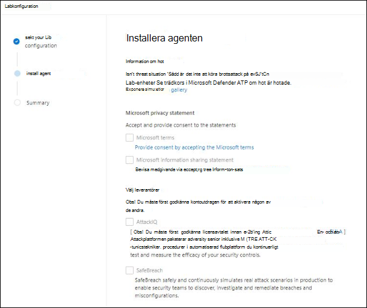

    >[!IMPORTANT]
    >Först måste du godkänna och godkänna användningsvillkoren och informationsdelningssatserna.You'll first need to accept and provide consent to the terms and information sharing statements. 

4. Välj den simulering av hot som du vill använda och ange din information.Select the threat simulation agent you'd like to use and enter your details. Du kan också välja att installera hot vid ett senare tillfälle.You can also choose to install threat simulators at a later time. Om du väljer att installera simuleringsagenter för hot under installationen av lab får du fördelen med att ha dem installerade på de enheter du lägger till.If you choose to install threat simulation agents during the lab setup, you'll enjoy the benefit of having them conveniently installed on the devices you add.  
    
    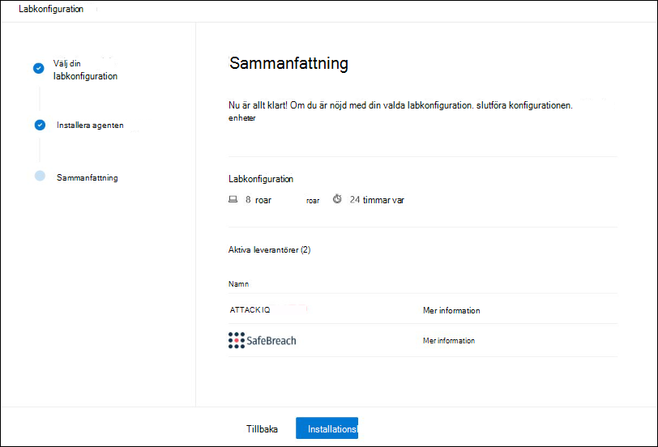

5.  Granska sammanfattningen och välj **Installationslabb**.Review the summary and select **Setup lab**.  

När labinstallationen är klar kan du lägga till enheter och köra simuleringar.After the lab setup process is complete, you can add devices and run simulations. 

## Lägg till enheterAdd devices
När du lägger till en enhet i din miljö konfigurerar Defender för Endpoint en välkonfigurerad enhet med anslutningsinformation.When you add a device to your environment, Defender for Endpoint sets up a well-configured device with connection details. Du kan lägga till Windows 10- eller Windows Server 2019-enheter.You can add Windows 10 or Windows Server 2019 devices.

Enheten konfigureras med den senaste versionen av operativsystemet och Office 2019 Standard samt med andra appar som Java, Python och SysIntenals.The device will be configured with the most up-to-date version of the OS and Office 2019 Standard as well as other apps such as Java, Python, and SysIntenals. 

   >[!TIP]
   > Behöver du fler enheter i labbet?Need more devices in your lab? Skicka ett supportbegäran om du vill att din begäran ska granskas av Defender för Endpoint-teamet.Submit a support ticket to have your request reviewed by the Defender for Endpoint team. 

Om du väljer att lägga till en hotbild under installationen av lab kommer alla enheter att ha hotagent installerad på de enheter som du lägger till.If you chose to add a threat simulator during the lab setup, all devices will have the threat simulator agent installed in the devices that you add.

Enheten introduceras automatiskt i din klientorganisation med de rekommenderade Windows-säkerhetskomponenterna påslagna och i granskningsläge – utan ansträngning från din sida.The device will automatically be onboarded to your tenant with the recommended Windows security components turned on and in audit mode - with no effort on your side. 

Följande säkerhetskomponenter är förkonfigurerade i testenheterna:The following security components are pre-configured in the test devices:

- [Minskning av attackytanAttack surface reduction](https://docs.microsoft.com/windows/security/threat-protection/windows-defender-exploit-guard/attack-surface-reduction-exploit-guard)
- [Blockera vid första synenBlock at first sight](https://docs.microsoft.com/windows/security/threat-protection/microsoft-defender-antivirus/configure-block-at-first-sight-microsoft-defender-antivirus)
- [Kontrollerad mappåtkomstControlled folder access](https://docs.microsoft.com/windows/security/threat-protection/windows-defender-exploit-guard/controlled-folders-exploit-guard)
- [ExploateringsskyddExploit protection](https://docs.microsoft.com/windows/security/threat-protection/windows-defender-exploit-guard/enable-exploit-protection)
- [NätverksskyddNetwork protection](https://docs.microsoft.com/windows/security/threat-protection/windows-defender-exploit-guard/network-protection-exploit-guard)
- [Potentiellt oönskad identifiering av programPotentially unwanted application detection](https://docs.microsoft.com/windows/security/threat-protection/microsoft-defender-antivirus/detect-block-potentially-unwanted-apps-microsoft-defender-antivirus)
- [Molnbaserat skyddCloud-delivered protection](https://docs.microsoft.com/windows/security/threat-protection/microsoft-defender-antivirus/utilize-microsoft-cloud-protection-microsoft-defender-antivirus)
- [Microsoft Defender SmartScreenMicrosoft Defender SmartScreen](https://docs.microsoft.com/windows/security/threat-protection/windows-defender-smartscreen/windows-defender-smartscreen-overview)

>[!NOTE]
> Microsoft Defender Antivirus är aktiverat (inte i granskningsläge).Microsoft Defender Antivirus will be on (not in audit mode). Om Microsoft Defender Antivirus blockerar dig från att köra din simulering kan du inaktivera realtidsskydd på enheten via Windows-säkerhet.If Microsoft Defender Antivirus blocks you from running your simulation, you can turn off real-time protection on the device through Windows Security. Mer information finns i [Konfigurera alltid-på-skydd](https://docs.microsoft.com/windows/security/threat-protection/microsoft-defender-antivirus/configure-real-time-protection-microsoft-defender-antivirus).For more information, see [Configure always-on protection](https://docs.microsoft.com/windows/security/threat-protection/microsoft-defender-antivirus/configure-real-time-protection-microsoft-defender-antivirus).

Inställningar för automatisk undersökning beror på klientorganisationsinställningarna.Automated investigation settings will be dependent on tenant settings. Den konfigureras som standard semi-automatiserad.It will be configured to be semi-automated by default. Mer information finns i [Översikt över automatiserade undersökningar.](automated-investigations.md)For more information, see [Overview of Automated investigations](automated-investigations.md).

>[!NOTE]
>Anslutningen till testenheterna görs med RDP.The connection to the test devices is done using RDP. Kontrollera att dina brandväggsinställningar tillåter RDP-anslutningar.Make sure that your firewall settings allow RDP connections.

1. Välj Lägg till enhet på **instrumentpanelen.**From the dashboard, select **Add device**. 

2. Välj vilken typ av enhet du vill lägga till.Choose the type of device to add. Du kan välja att lägga till Windows 10 eller Windows Server 2019.You can choose to add Windows 10 or Windows Server 2019.

    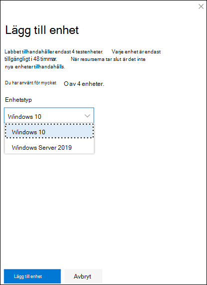

    >[!NOTE]
    >Om något går fel med processen för att skapa enhet får du ett meddelande och du måste skicka en ny begäran.If something goes wrong with the device creation process, you'll be notified and you'll need to submit a new request. Om enheten skapas utan fel räknas den inte in i den totala tillåtna kvoten.If the device creation fails, it will not be counted against the overall allowed quota. 

3. Anslutningsinformationen visas.The connection details are displayed. Välj **Kopiera** för att spara lösenordet för enheten.Select **Copy** to save the password for the device.

    >[!NOTE]
    >Lösenordet visas bara en gång.The password is only displayed once. Se till att spara den för senare användning.Be sure to save it for later use.

    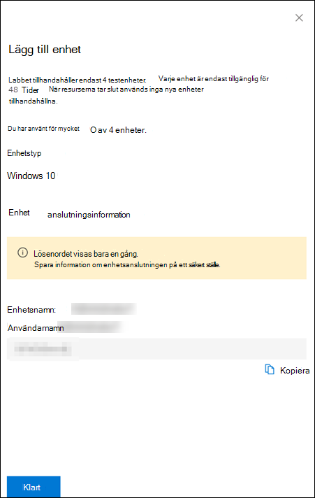

4. Enhetsuppsättningen startar.Device set up begins. Det kan ta upp till cirka 30 minuter.This can take up to approximately 30 minutes. 

5. Se status för testenheter, risk- och exponeringsnivåer och status för installationerna genom att välja **fliken** Enheter.See the status of test devices, the risk and exposure levels, and the status of simulator installations by selecting the **Devices** tab. 

    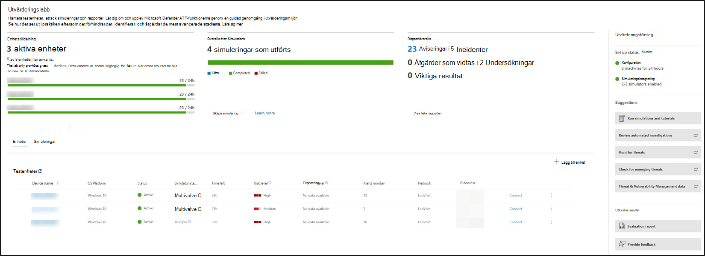
    

    >[!TIP]
    >I kolumnen **Förnamnsstatus** kan du hovra över informationsikonen för att få information om installationsstatus för en agent.In the **Simulator status** column, you can hover over the information icon to know the installation status of an agent.

## Simulera attackscenarierSimulate attack scenarios
Använd testenheterna för att köra egna attack simuleringar genom att ansluta till dem.Use the test devices to run your own attack simulations by connecting to them. 

Du kan simulera attackscenarier med hjälp av:You can simulate attack scenarios using:
- [Attackscenarierna "Gör det själv"](https://securitycenter.windows.com/tutorials)The ["Do It Yourself" attack scenarios](https://securitycenter.windows.com/tutorials)
- HotbildThreat simulators

Du kan också använda [Avancerad sökning för](advanced-hunting-query-language.md) att söka efter data och [hotanalyser för](threat-analytics.md) att visa rapporter om nya hot.You can also use [Advanced hunting](advanced-hunting-query-language.md) to query data and [Threat analytics](threat-analytics.md) to view reports about emerging threats.

### Gör det själv-attackscenarierDo-it-yourself attack scenarios
Om du letar efter en färdig simulering kan du använda våra ["Gör det själv"-attackscenarier](https://securitycenter.windows.com/tutorials).If you are looking for a pre-made simulation, you can use our ["Do It Yourself" attack scenarios](https://securitycenter.windows.com/tutorials). De här skripten är säkra, har dokumenterats och är enkla att använda.These scripts are safe, documented, and easy to use. De här scenarierna återspeglar Defender för Slutpunkt-funktioner och går igenom undersökningsupplevelsen.These scenarios will reflect Defender for Endpoint capabilities and walk you through investigation experience.

>[!NOTE]
>Anslutningen till testenheterna görs med RDP.The connection to the test devices is done using RDP. Kontrollera att dina brandväggsinställningar tillåter RDP-anslutningar.Make sure that your firewall settings allow RDP connections.

1. Anslut till din enhet och kör en attack simulering genom att välja **Anslut**.Connect to your device and run an attack simulation by selecting **Connect**. 

    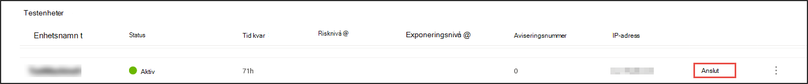

2. Spara RDP-filen och starta den genom att välja **Anslut**.Save the RDP file and launch it by selecting **Connect**.

    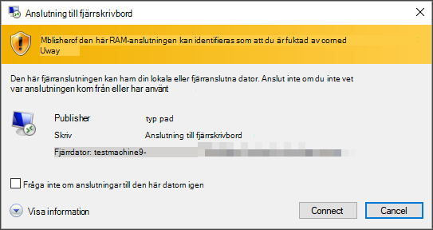

    >[!NOTE]
    >Om du inte har en kopia av lösenordet sparats vid den första  installationen kan du återställa lösenordet genom att välja Återställ lösenord på menyn: Bild på If you don't have a copy of the password saved during the initial setup, you can reset the password by selecting **Reset password** from the menu:  
    > Enheten ändrar statusen till "Kör återställning av lösenord", och sedan får du det nya lösenordet om några minuter.The device will change it’s state to “Executing password reset", then you’ll be presented with your new password in a few minutes.

3. Ange det lösenord som visades när enheten skapades.Enter the password that was displayed during the device creation step. 

   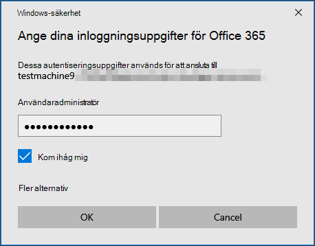

4. Kör Do-it-yourself-attack simuleringar på enheten.Run Do-it-yourself attack simulations on the device. 

### HotscenarierThreat simulator scenarios
Om du valde att installera någon av de hot som stöds under labinstallationen kan du köra de inbyggda simuleringarna på utvärderingslabbenheterna.If you chose to install any of the supported threat simulators during the lab setup, you can run the built-in simulations on the evaluation lab devices. 

Att köra simuleringar av hot med tredjepartsplattformar är ett bra sätt att utvärdera Microsoft Defender för Slutpunktsfunktionerna i en labmiljö.Running threat simulations using third-party platforms is a good way to evaluate Microsoft Defender for Endpoint capabilities within the confines of a lab environment.

>[!NOTE]
>Innan du kan köra simuleringar ser du till att följande krav uppfylls:Before you can run simulations, ensure the following requirements are met:
>- Enheter måste läggas till i utvärderingslabbDevices must be added to the evaluation lab
>- Hot måste installeras i utvärderingslabbThreat simulators must be installed in the evaluation lab

1. Välj Skapa simulering i **portalen**.From the portal select **Create simulation**.

2. Välj ett hot.Select a threat simulator.

    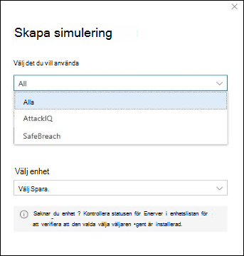

3. Välj en simulering eller titta igenom simuleringsgalleriet och bläddra igenom de tillgängliga simuleringarna.Choose a simulation or look through the simulation gallery to browse through the available simulations. 

    Du kan gå till simuleringsgalleriet från:You can get to the simulation gallery from:
    - Huvudpanelen för utvärdering i panelen **för simuleringsöversikt** ellerThe main evaluation dashboard in the **Simulations overview** tile or
    - Genom att navigera från navigeringsfönstret **Utvärdering och självstudiekurser**  >  **om simulering &** och sedan välja **Simuleringskatalog**.By navigating from the navigation pane **Evaluation and tutorials** > **Simulation & tutorials**, then select **Simulations catalog**.

4. Välj de enheter där du vill köra simuleringen på.Select the devices where you'd like to run the simulation on.

5. Välj **Skapa simulering**.Select **Create simulation**.

6. Visa förloppet för en simulering genom att välja **fliken Simuleringar.** Visa simuleringstillståndet, aktiva aviseringar och annan information.View the progress of a simulation by selecting the **Simulations** tab. View the simulation state, active alerts, and other details. 

    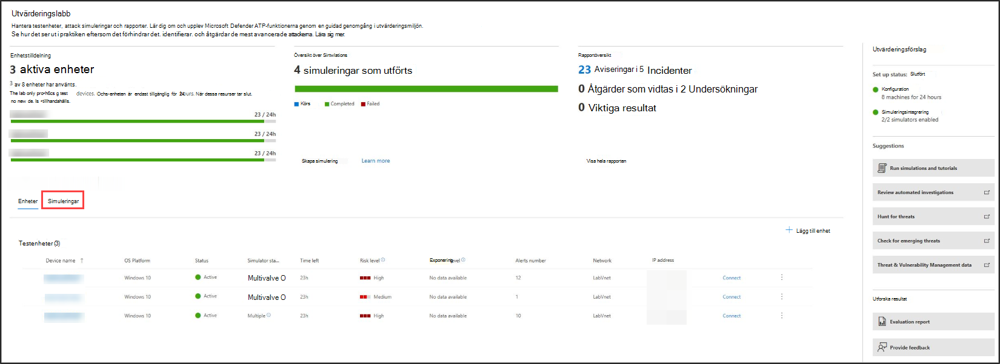
    
När du har kört din simulering rekommenderar vi att du går igenom labbförloppet och utforskar Microsoft Defender för Endpoint orsakade en automatiserad **undersökning och åtgärd.**After running your simulations, we encourage you to walk through the lab progress bar and explore **Microsoft Defender for Endpoint triggered an automated investigation and remediation**. Ta en kontroll över bevisen som samlas in och analyseras av funktionen.Check out the evidence collected and analyzed by the feature.

Sök efter attackbevis genom avancerad sökning med hjälp av det avancerade frågespråket och den obearbetade telemetrin, och ta en titta på några av de hot som beskrivs i hotanalyser världen över.Hunt for attack evidence through advanced hunting by using the rich query language and raw telemetry and check out some world-wide threats documented in Threat analytics.

## SimuleringsgallerietSimulation gallery
Microsoft Defender för Endpoint har samarbetat med olika simuleringsplattformar för hot för att ge dig bekväm åtkomst till att testa plattformens funktioner direkt från portalen.Microsoft Defender for Endpoint has partnered with various threat simulation platforms to give you convenient access to test the capabilities of the platform right from the within the portal. 

Visa alla tillgängliga simuleringar genom att gå till Simuleringar och **självstudiekurser**  >  **för simuleringskatalogen** på menyn.View all the available simulations by going to  **Simulations and tutorials** > **Simulations catalog**  from the menu. 

En lista över simuleringsagenter från tredje part som stöds visas och specifika typer av simuleringar tillsammans med detaljerade beskrivningar ges i katalogen.A list of supported third-party threat simulation agents are listed, and specific types of simulations along with detailed descriptions are provided on the catalog. 

Du kan enkelt köra alla tillgängliga simuleringar direkt från katalogen.You can conveniently run any available simulation right from the catalog.  

Varje simulering levereras med en detaljerad beskrivning av attackscenariot och referenser som MITRE-attacktekniker som används och exempel på avancerade sökfrågor du kör.Each simulation comes with an in-depth description of the attack scenario and references such as the MITRE attack techniques used and sample Advanced hunting queries you run.

**Exempel:** 
 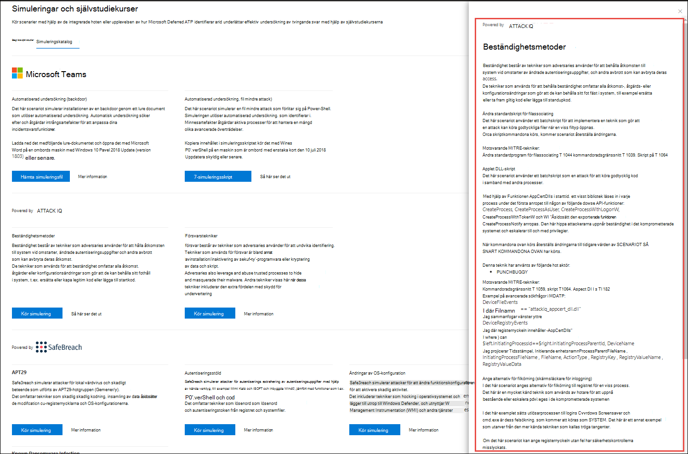**Examples:**

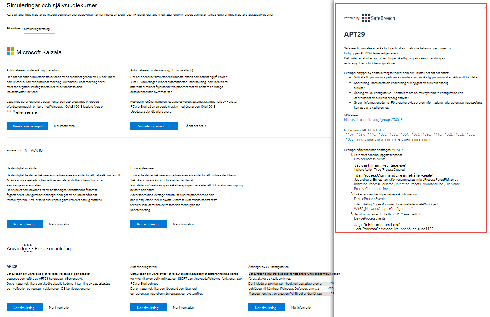

## UtvärderingsrapportEvaluation report
Labrapporterna sammanfattar resultaten av simuleringarna på enheterna.The lab reports summarize the results of the simulations conducted on the devices.

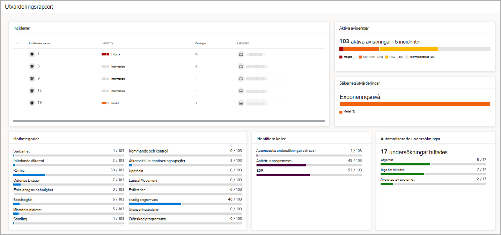

Du kommer snabbt att kunna se:At a glance, you'll quickly be able to see:
- Incidenter som utlöstesIncidents that were triggered
- Genererade aviseringarGenerated alerts
- Utvärderingar av exponeringsnivåAssessments on exposure level 
- Observerade hotkategorierThreat categories observed
- Identifiera källorDetection sources
- Automatiserade undersökningarAutomated investigations

## Ge feedbackProvide feedback
Din feedback hjälper oss att bli bättre i din miljö mot avancerade attacker.Your feedback helps us get better in protecting your environment from advanced attacks. Dela din upplevelse och intryck från produktfunktioner och utvärderingsresultat.Share your experience and impressions from product capabilities and evaluation results.

Berätta vad du tycker genom att välja **Ge feedback.**Let us know what you think, by selecting **Provide feedback**.

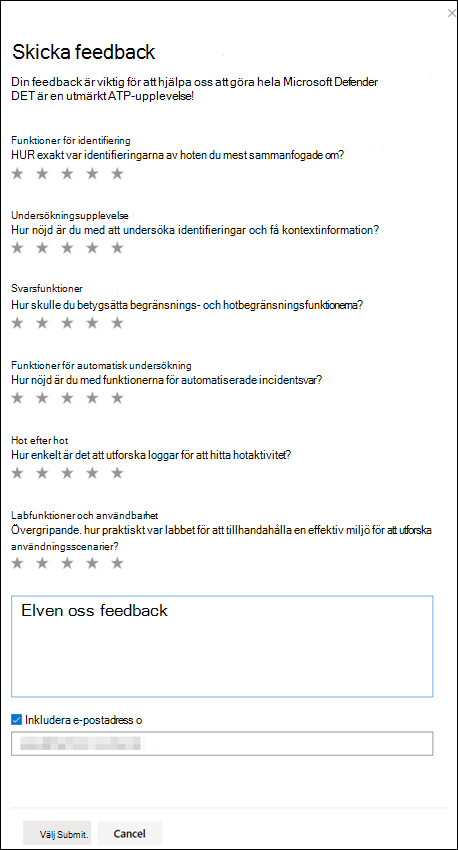
