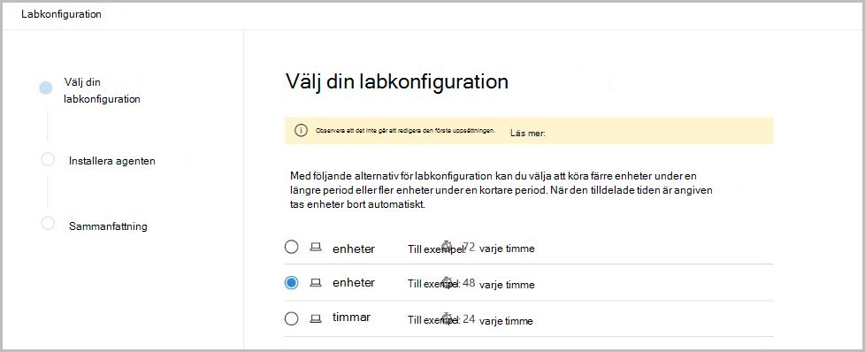

# Microsoft Defender för utvärderingslabb med slutpunkt

[!INCLUDE [Microsoft 365 Defender rebranding](../../includes/microsoft-defender.md)]

**Gäller för:**
- [Microsoft Defender för Endpoint](https://go.microsoft.com/fwlink/?linkid=2154037)
- [Microsoft 365 Defender](https://go.microsoft.com/fwlink/?linkid=2118804)

>Vill du uppleva Microsoft Defender för Slutpunkt? [Registrera dig för en kostnadsfri utvärderingsversion.](https://www.microsoft.com/microsoft-365/windows/microsoft-defender-atp?ocid=docs-wdatp-enablesiem-abovefoldlink)

Att genomföra en omfattande utvärdering av säkerhetsprodukter kan vara en komplex process som kräver krångliga miljöer och enhetskonfigurationer innan en helslutsattack simulering kan utföras. Till komplexiteten läggs utmaningen att spåra var simuleringsaktiviteter, varningar och resultat återspeglas under utvärderingen.

Utvärderingslabb med Microsoft Defender för slutpunkter är utformat för att eliminera komplexiteten i konfigurationen av enheter och miljöer så att du kan fokusera på att utvärdera plattformens funktioner, köra simuleringar och se funktionerna för skydd, identifiering och åtgärder i praktiken.

> [!VIDEO https://www.microsoft.com/en-us/videoplayer/embed/RE4qLUM]

Med den förenklade uppsättningen kan du fokusera på att köra egna testscenarier och de färdiga simuleringarna och se hur Defender för Slutpunkt fungerar. 

Du har full tillgång till plattformens kraftfulla funktioner, som automatiska undersökningar, avancerad sökning och hotanalys, så att du kan testa den omfattande skyddsstacken som Defender för Slutpunkt erbjuder. 

Du kan lägga till Windows 10- eller Windows Server 2019-enheter som är förkonfigurerade så att de senaste os-versionerna och rätt säkerhetskomponenter och Office 2019 Standard är installerade.

Du kan även installera hot. Defender för Endpoint har samarbetat med branschledande simuleringsplattformar för hot som hjälper dig att testa Defender för Slutpunkt-funktioner utan att behöva lämna portalen.

 Installera det du föredrar, kör scenarier i utvärderingslabbet och se direkt hur plattformen fungerar – allt finns tillgängligt utan extra kostnad för dig. Du får också praktisk tillgång till ett brett utbud av simuleringar som du kan komma åt och köra från simuleringskatalogen.
    

## Innan du börjar
Du måste uppfylla licenskraven eller ha [utvärderingsåtkomst till](minimum-requirements.md#licensing-requirements) Microsoft Defender för Endpoint för att komma åt utvärderingslabbet.

Du måste ha **behörigheten Hantera säkerhetsinställningar** för att:
- Skapa labbet
- Skapa enheter
- Återställa lösenord
- Skapa simuleringar 
 
Om du har aktiverat rollbaserad åtkomstkontroll (RBAC) och skapat minst en datorgrupp, måste användarna ha åtkomst till Alla datorgrupper.

Mer information finns i Skapa [och hantera roller.](user-roles.md)

Vill du uppleva Microsoft Defender för Slutpunkt? [Registrera dig för en kostnadsfri utvärderingsversion.](https://www.microsoft.com/microsoft-365/windows/microsoft-defender-atp?ocid=docs-wdatp-main-abovefoldlink)

## Kom igång med labbet
Du kan komma åt labbet från menyn. I navigeringsmenyn väljer du **Utvärdering och självstudier > Utvärderingslabb.**

>[!NOTE]
>- Beroende på vilken typ av miljöstruktur du väljer blir enheter tillgängliga under det angivna antalet timmar från aktiveringsdagen.
>- Varje miljö etableras med ett begränsat antal testenheter. När du använt de etablerade enheterna tillhandahålls inga nya enheter. En borttagna enhet uppdaterar inte antalet tillgängliga testenhet.
>- Du kan inte längre använda labbet när resurserna har använts upp. Den återställs inte eller uppdateras inte.
>- Vi rekommenderar att du använder resurserna noggrant. Labbresurserna är begränsade. De återställs inte eller uppdateras inte. 

Har du redan ett labb? Se till att aktivera de nya hoten och ha aktiva enheter.

## Konfigurera utvärderingslabb

1. Välj Utvärderings- och **självstudiekurser**  >  **Utvärderingslabb** i navigeringsfönstret och välj sedan **Installationslabb.**

    

2. Beroende på dina utvärderingsbehov kan du välja att konfigurera en miljö med färre enheter under en längre period eller fler enheter under kortare tid. Välj önskad labkonfiguration och välj sedan **Nästa**.

     

3. (Valfritt) Du kan välja att installera hot i labbet. 

    

    >[!IMPORTANT]
    >Först måste du godkänna och godkänna användningsvillkoren och informationsdelningssatserna. 

4. Välj den simulering av hot som du vill använda och ange din information. Du kan också välja att installera hot vid ett senare tillfälle. Om du väljer att installera simuleringsagenter för hot under installationen av lab får du fördelen med att ha dem installerade på de enheter du lägger till.  
    
    

5.  Granska sammanfattningen och välj **Installationslabb**.  

När labinstallationen är klar kan du lägga till enheter och köra simuleringar. 

## Lägg till enheter
När du lägger till en enhet i din miljö konfigurerar Defender för Endpoint en välkonfigurerad enhet med anslutningsinformation. Du kan lägga till Windows 10- eller Windows Server 2019-enheter.

Enheten konfigureras med den senaste versionen av operativsystemet och Office 2019 Standard samt med andra appar som Java, Python och SysIntenals. 

   >[!TIP]
   > Behöver du fler enheter i labbet? Skicka ett supportbegäran om du vill att din begäran ska granskas av Defender för Endpoint-teamet. 

Om du väljer att lägga till en hotbild under installationen av lab kommer alla enheter att ha hotagent installerad på de enheter som du lägger till.

Enheten introduceras automatiskt i din klientorganisation med de rekommenderade Windows-säkerhetskomponenterna påslagna och i granskningsläge – utan ansträngning från din sida. 

Följande säkerhetskomponenter är förkonfigurerade i testenheterna:

- [Minskning av attackytan](https://docs.microsoft.com/windows/security/threat-protection/windows-defender-exploit-guard/attack-surface-reduction-exploit-guard)
- [Blockera vid första synen](https://docs.microsoft.com/windows/security/threat-protection/microsoft-defender-antivirus/configure-block-at-first-sight-microsoft-defender-antivirus)
- [Kontrollerad mappåtkomst](https://docs.microsoft.com/windows/security/threat-protection/windows-defender-exploit-guard/controlled-folders-exploit-guard)
- [Exploateringsskydd](https://docs.microsoft.com/windows/security/threat-protection/windows-defender-exploit-guard/enable-exploit-protection)
- [Nätverksskydd](https://docs.microsoft.com/windows/security/threat-protection/windows-defender-exploit-guard/network-protection-exploit-guard)
- [Potentiellt oönskad identifiering av program](https://docs.microsoft.com/windows/security/threat-protection/microsoft-defender-antivirus/detect-block-potentially-unwanted-apps-microsoft-defender-antivirus)
- [Molnbaserat skydd](https://docs.microsoft.com/windows/security/threat-protection/microsoft-defender-antivirus/utilize-microsoft-cloud-protection-microsoft-defender-antivirus)
- [Microsoft Defender SmartScreen](https://docs.microsoft.com/windows/security/threat-protection/windows-defender-smartscreen/windows-defender-smartscreen-overview)

>[!NOTE]
> Microsoft Defender Antivirus är aktiverat (inte i granskningsläge). Om Microsoft Defender Antivirus blockerar dig från att köra din simulering kan du inaktivera realtidsskydd på enheten via Windows-säkerhet. Mer information finns i [Konfigurera alltid-på-skydd](https://docs.microsoft.com/windows/security/threat-protection/microsoft-defender-antivirus/configure-real-time-protection-microsoft-defender-antivirus).

Inställningar för automatisk undersökning beror på klientorganisationsinställningarna. Den konfigureras som standard semi-automatiserad. Mer information finns i [Översikt över automatiserade undersökningar.](automated-investigations.md)

>[!NOTE]
>Anslutningen till testenheterna görs med RDP. Kontrollera att dina brandväggsinställningar tillåter RDP-anslutningar.

1. Välj Lägg till enhet på **instrumentpanelen.** 

2. Välj vilken typ av enhet du vill lägga till. Du kan välja att lägga till Windows 10 eller Windows Server 2019.

    

    >[!NOTE]
    >Om något går fel med processen för att skapa enhet får du ett meddelande och du måste skicka en ny begäran. Om enheten skapas utan fel räknas den inte in i den totala tillåtna kvoten. 

3. Anslutningsinformationen visas. Välj **Kopiera** för att spara lösenordet för enheten.

    >[!NOTE]
    >Lösenordet visas bara en gång. Se till att spara den för senare användning.

    

4. Enhetsuppsättningen startar. Det kan ta upp till cirka 30 minuter. 

5. Se status för testenheter, risk- och exponeringsnivåer och status för installationerna genom att välja **fliken** Enheter. 

    
    

    >[!TIP]
    >I kolumnen **Förnamnsstatus** kan du hovra över informationsikonen för att få information om installationsstatus för en agent.

## Simulera attackscenarier
Använd testenheterna för att köra egna attack simuleringar genom att ansluta till dem. 

Du kan simulera attackscenarier med hjälp av:
- [Attackscenarierna "Gör det själv"](https://securitycenter.windows.com/tutorials)
- Hotbild

Du kan också använda [Avancerad sökning för](advanced-hunting-query-language.md) att söka efter data och [hotanalyser för](threat-analytics.md) att visa rapporter om nya hot.

### Gör det själv-attackscenarier
Om du letar efter en färdig simulering kan du använda våra ["Gör det själv"-attackscenarier](https://securitycenter.windows.com/tutorials). De här skripten är säkra, har dokumenterats och är enkla att använda. De här scenarierna återspeglar Defender för Slutpunkt-funktioner och går igenom undersökningsupplevelsen.

>[!NOTE]
>Anslutningen till testenheterna görs med RDP. Kontrollera att dina brandväggsinställningar tillåter RDP-anslutningar.

1. Anslut till din enhet och kör en attack simulering genom att välja **Anslut**. 

    

2. Spara RDP-filen och starta den genom att välja **Anslut**.

    

    >[!NOTE]
    >Om du inte har en kopia av lösenordet sparats vid den första  installationen kan du återställa lösenordet genom att välja Återställ lösenord på menyn: Bild på  
    > Enheten ändrar statusen till "Kör återställning av lösenord", och sedan får du det nya lösenordet om några minuter.

3. Ange det lösenord som visades när enheten skapades. 

   

4. Kör Do-it-yourself-attack simuleringar på enheten. 

### Hotscenarier
Om du valde att installera någon av de hot som stöds under labinstallationen kan du köra de inbyggda simuleringarna på utvärderingslabbenheterna. 

Att köra simuleringar av hot med tredjepartsplattformar är ett bra sätt att utvärdera Microsoft Defender för Slutpunktsfunktionerna i en labmiljö.

>[!NOTE]
>Innan du kan köra simuleringar ser du till att följande krav uppfylls:
>- Enheter måste läggas till i utvärderingslabb
>- Hot måste installeras i utvärderingslabb

1. Välj Skapa simulering i **portalen**.

2. Välj ett hot.

    

3. Välj en simulering eller titta igenom simuleringsgalleriet och bläddra igenom de tillgängliga simuleringarna. 

    Du kan gå till simuleringsgalleriet från:
    - Huvudpanelen för utvärdering i panelen **för simuleringsöversikt** eller
    - Genom att navigera från navigeringsfönstret **Utvärdering och självstudiekurser**  >  **om simulering &** och sedan välja **Simuleringskatalog**.

4. Välj de enheter där du vill köra simuleringen på.

5. Välj **Skapa simulering**.

6. Visa förloppet för en simulering genom att välja **fliken Simuleringar.** Visa simuleringstillståndet, aktiva aviseringar och annan information. 

    
    
När du har kört din simulering rekommenderar vi att du går igenom labbförloppet och utforskar Microsoft Defender för Endpoint orsakade en automatiserad **undersökning och åtgärd.** Ta en kontroll över bevisen som samlas in och analyseras av funktionen.

Sök efter attackbevis genom avancerad sökning med hjälp av det avancerade frågespråket och den obearbetade telemetrin, och ta en titta på några av de hot som beskrivs i hotanalyser världen över.

## Simuleringsgalleriet
Microsoft Defender för Endpoint har samarbetat med olika simuleringsplattformar för hot för att ge dig bekväm åtkomst till att testa plattformens funktioner direkt från portalen. 

Visa alla tillgängliga simuleringar genom att gå till Simuleringar och **självstudiekurser**  >  **för simuleringskatalogen** på menyn. 

En lista över simuleringsagenter från tredje part som stöds visas och specifika typer av simuleringar tillsammans med detaljerade beskrivningar ges i katalogen. 

Du kan enkelt köra alla tillgängliga simuleringar direkt från katalogen.  

Varje simulering levereras med en detaljerad beskrivning av attackscenariot och referenser som MITRE-attacktekniker som används och exempel på avancerade sökfrågor du kör.

**Exempel:** 
 

## Utvärderingsrapport
Labrapporterna sammanfattar resultaten av simuleringarna på enheterna.

Du kommer snabbt att kunna se:
- Incidenter som utlöstes
- Genererade aviseringar
- Utvärderingar av exponeringsnivå 
- Observerade hotkategorier
- Identifiera källor
- Automatiserade undersökningar

## Ge feedback
Din feedback hjälper oss att bli bättre i din miljö mot avancerade attacker. Dela din upplevelse och intryck från produktfunktioner och utvärderingsresultat.

Berätta vad du tycker genom att välja **Ge feedback.**

